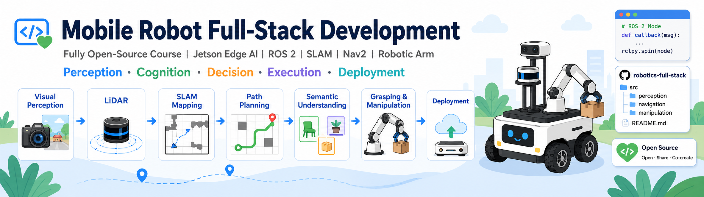
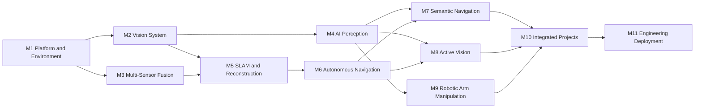

<div align="center">

# Mobile Robot Full-Stack Development in Practice

### An open-source embodied intelligence and autonomous systems course based on reComputer J501 (Jetson AGX Orin)

Build a complete mobile robotics development loop from sensor integration, AI perception, SLAM, and autonomous navigation to semantic understanding, active vision, and robotic grasping.

[](#project-status)
[](#hardware-and-software)
[](#hardware-and-software)
[](#hardware-and-software)
[](#open-source-license)

</div>

---



## Project Overview

This project is an open-source hands-on course for robotics developers, AI engineers, and university students. It uses **Seeed Studio reComputer J501 (Jetson AGX Orin 32GB/64GB)** as the core compute platform and covers:

```text
Perception -> Cognition -> Decision -> Actuation -> Deployment
```

The course emphasizes system integration on real robots rather than explaining only a single algorithm in isolation. The content will be opened progressively. If you are interested in this project, Star it and contribute with us.

---

## Course Highlights

- **Complete technology stack**: covers Jetson, ROS 2, vision, LiDAR, SLAM, Nav2, VLN, robotic arms, and deployment optimization.
- **Strict progression**: starts from sensors and coordinate-system fundamentals, then moves into navigation, semantic understanding, and grasping.
- **Real hardware practice**: uses J501, cameras, LiDAR, chassis, PTZ, and robotic arms as the main validation platform.
- **Verifiable chapter outputs**: each module provides code, configuration, experiment steps, expected results, and common issues.
- **Engineering-oriented**: the course ends with TensorRT, DeepStream, Isaac ROS, system monitoring, and OTA.

---

## Course Roadmap



---

<a id="project-status"></a>

## Course Modules

The course is planned as **11 modules, about 43 class hours** in total. Starting from **July 22, 2026**, the plan is to complete one module every two weeks. If there are no major changes, all modules are planned to be completed before **December 22, 2026**.

| Module | Theme | Main Content | Planned Window |
|---|---|---|---|
| M1 | Platform Introduction and Development Environment | J501, JetPack, Docker, ROS 2 | 🚧 In Progress 2026-07-24 |
| M2 | Vision System Foundations | CSI, GMSL2, RGB-D, calibration, BEV | ⏳ Planned 2026-08-07 |
| M3 | LiDAR and Sensor Fusion | LiDAR, IMU, GNSS, CAN-FD, PTP, EKF | ⏳ Planned 2026-08-21 |
| M4 | AI Vision and Edge Acceleration | YOLO, tracking, segmentation, 6D pose, Isaac ROS | ⏳ Planned 2026-09-04 |
| M5 | 3D Reconstruction and SLAM | ORB-SLAM3, Fast-LIO, R3LIVE, 3DGS, semantic maps | ⏳ Planned 2026-09-18 |
| M6 | Localization, Navigation, and Path Planning | Nav2, planning, dynamic obstacle avoidance, multi-robot collaboration | ⏳ Planned 2026-10-02 |
| M7 | VLN Semantic Navigation | instruction parsing, topological maps, semantic landmarks | ⏳ Planned |
| M8 | PTZ and Active Vision | PTZ control, target tracking, chassis coordination | ⏳ Planned |
| M9 | Robotic Arm and Manipulation | MoveIt 2, Pinocchio, hand-eye calibration, GraspNet | ⏳ Planned |
| M10 | Integrated Projects | inspection, BEV+3DGS, VLN, semantic grasping | ⏳ Planned |
| M11 | Deployment Optimization and Engineering | ONNX, TensorRT, DeepStream, monitoring, OTA | ⏳ Planned |

> The progress status will be updated to `✅ Completed` after each module is released, together with the corresponding documentation, code, configurations, test results, and demo videos.

---

## Integrated Projects

Planned...

---

<a id="hardware-and-software"></a>

## Core Hardware

| Category | Recommended Configuration |
|---|---|
| Main Controller | [reComputer Robotics J5012](https://www.seeedstudio.com/reComputer-Robotics-J5012-with-GMSL-extension-board-p-6682.html) |
| Vision | CSI / GMSL2 / RGB-D cameras |
| Localization | LiDAR, IMU, GNSS |
| Actuation | Mobile chassis, 2-axis PTZ, reBot or compatible robotic arm |
| Bus | CAN-FD, UART, Ethernet |
| Power | Mobile robot power supply system |

You do not need to purchase all hardware at once. Early modules can be completed with only the J501 and a single camera. Navigation- and robotic-arm-related hardware can be added gradually later.

---

## Repository Layout

```text
mobile-robot-full-stack-course/
├── hardware/             # Hardware-related files
├── docs/                 # Course documentation
├── modules/              # Per-module course code
├── projects/             # Integrated projects
├── assets/               # Images and videos
├── README.md
├── README_CN.md
├── CONTRIBUTING.md
└── LICENSE
```

---

## Intended Audience and Prerequisites

Suitable for:

- beginners in ROS 2 and robotics development;
- AI, computer vision, and edge computing engineers;
- developers of AMR, AGV, inspection robots, and service robots;
- university students, instructors, and lab teams.

Basic knowledge of Linux, Python, Git, and linear algebra is recommended. ROS 2, Docker, and Jetson basics will be introduced in the course.

---

<a id="open-source-license"></a>

## Open-Source License

This project will be released in a fully open-source manner. All self-developed course content will be made public, including:

- course documentation and lab instructions;
- ROS 2 source code and configuration files;
- Dockerfiles, installation scripts, and deployment tools;
- model conversion, testing, and performance evaluation scripts;
- integrated project code and system integration solutions;
- publicly distributable sample data, images, and demo resources.

The specific license terms will be defined in the root `LICENSE` file and in any subdirectory-specific license notes. Code, documentation, data, and hardware design files may use different open-source licenses depending on content type.

---

## Safety Notes

Robotic systems involve batteries, motors, robotic arms, and high-speed moving parts. Before operating real hardware, make sure to:

- configure an emergency stop;
- limit chassis and robotic-arm speed;
- check power and wiring;
- clear the motion range;
- finish simulation or low-speed validation first;
- avoid running unverified policies in crowded environments.

---

## Acknowledgements

This course will use or reference open-source projects including ROS 2, NVIDIA Jetson, Isaac ROS, Nav2, MoveIt 2, OpenCV, PyTorch, Open3D, ORB-SLAM3, Fast-LIO, LIO-SAM, 3D Gaussian Splatting, GraspNet, and LeRobot.

---

<div align="center">

**From “seeing” to “understanding,” from “autonomous mobility” to “autonomous manipulation.”**

Star, Watch, Fork, and contribute.

</div>
