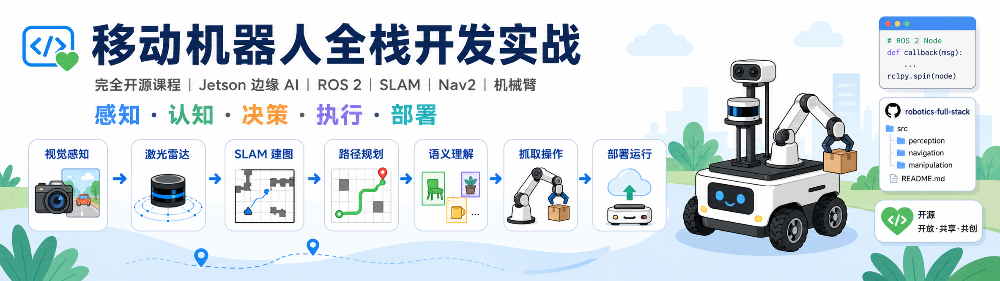
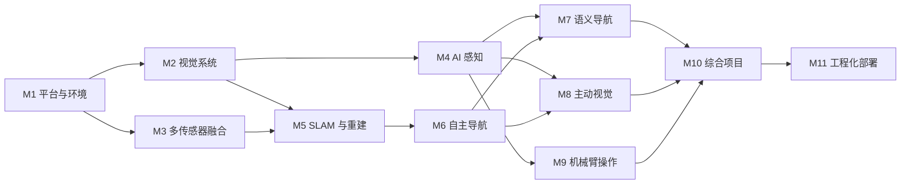

<div align="center">

# 移动机器人全栈开发实战

### 基于 reComputer J501（Jetson AGX Orin）的具身智能与自主系统开源课程

从传感器接入、AI 感知、SLAM、自主导航，到语义理解、主动视觉和机械臂抓取，构建完整的移动机器人开发闭环。

[](#项目进度)
[](#硬件与软件)
[](#硬件与软件)
[](#硬件与软件)
[](#开源许可)

</div>

---



## 项目简介

本项目是一套面向机器人开发者、AI 工程师和高校学生的开源实战课程，以 **Seeed Studio reComputer J501（Jetson AGX Orin 32GB/64GB）** 为核心计算平台，覆盖：

```text
感知 → 认知 → 决策 → 执行 → 部署
```

课程强调真实机器人上的系统集成，而不是单独讲解某一个算法。内容将逐步开放，如果您对此项目感兴趣，欢迎 Star 与共创。

---

## 课程特点

- **完整技术栈**：覆盖 Jetson、ROS 2、视觉、雷达、SLAM、Nav2、VLN、机械臂和部署优化。
- **严格递进**：从传感器和坐标系基础开始，逐步进入导航、语义理解和抓取。
- **真实硬件实战**：以 J501、相机、雷达、底盘、云台和机械臂为主要验证平台。
- **每章可验证**：每个模块都提供代码、配置、实验步骤、预期结果和常见问题。
- **面向工程应用**：课程最后加入 TensorRT、DeepStream、Isaac ROS、系统监控和 OTA。

---

## 课程路线



---

## 课程目录

课程共规划 **11 个模块，约 43 课时**。从 **2026 年 7 月 22 日**开始，按每两周完成一个模块的节奏推进；如无重大调整，全部模块计划于 **2026 年 12 月 22 日**前完成。

| 模块 | 主题 | 主要内容 | 计划周期
|---|---|---|---|
| M1 | 平台入门与开发环境 | J501、JetPack、Docker、ROS 2 | 🚧 进行中 2026-07-24 |
| M2 | 视觉系统基础 | CSI、GMSL2、RGB-D、标定、BEV | ⏳ 计划中 2026-08-07 |
| M3 | 雷达与传感器融合 | LiDAR、IMU、GNSS、CAN-FD、PTP、EKF | ⏳ 计划中 2026-08-21 |
| M4 | AI 视觉与边缘加速 | YOLO、跟踪、分割、6D 位姿、Isaac ROS | ⏳ 计划中 2026-09-04 |
| M5 | 三维重建与 SLAM | ORB-SLAM3、Fast-LIO、R3LIVE、3DGS、语义地图 | ⏳ 计划中 2026-09-18 |
| M6 | 定位导航与路径规划 | Nav2、规划、动态避障、多机协同 | ⏳ 计划中 2026-10-02|
| M7 | VLN 语义导航 | 指令解析、拓扑地图、语义路标 | ⏳ 计划中 |
| M8 | 云台与主动视觉 | 云台控制、目标跟踪、底盘协同 | ⏳ 计划中 |
| M9 | 机械臂与操作 | MoveIt 2、Pinocchio、手眼标定、GraspNet | ⏳ 计划中 |
| M10 | 综合项目 | 巡检、BEV+3DGS、VLN、语义抓取 | ⏳ 计划中 |
| M11 | 部署优化与工程化 | ONNX、TensorRT、DeepStream、监控、OTA | ⏳ 计划中 |

> 进度状态将在每个模块发布后更新为 `✅ 已完成`，并补充对应文档、代码、配置、测试结果和演示视频。

---

## 综合项目
规划中...

---

## 核心硬件

| 类别 | 推荐配置 |
|---|---|
| 主控 | [reComputer Robotics J5012](https://www.seeedstudio.com/reComputer-Robotics-J5012-with-GMSL-extension-board-p-6682.html) |
| 视觉 | CSI / GMSL2 / RGB-D 相机 |
| 定位 | 激光雷达、IMU、GNSS |
| 执行 | 移动底盘、二轴云台、reBot 或兼容机械臂 |
| 总线 | CAN-FD、UART、以太网 |
| 供电 | 机器人移动供电系统 |

无需一次购买全部硬件。前期模块可以仅使用 J501 和单路相机，导航和机械臂相关硬件可在后续逐步增加。

---

## 仓库结构

```text
mobile-robot-full-stack-course/
├── hardware/             # 硬件相关文件
├── docs/                 # 课程文档
├── modules/              # 各课程模块代码
├── projects/             # 综合项目
├── assets/               # 图片和视频
├── README.md
├── README_CN.md
├── CONTRIBUTING.md
└── LICENSE
```

---


## 适合人群与前置基础

适合以下学习者：

- ROS 2 和机器人开发初学者；
- AI、计算机视觉和边缘计算工程师；
- AMR、AGV、巡检机器人和服务机器人开发者；
- 高校学生、教师和实验室团队。

建议具备 Linux、Python、Git 和基础线性代数知识。ROS 2、Docker 和 Jetson 基础将在课程中介绍。

---

## 开源许可

本项目将以完全开源的方式发布，课程自主开发的内容均会公开，包括：

- 课程文档与实验说明；
- ROS 2 源代码与配置文件；
- Dockerfile、安装脚本和部署工具；
- 模型转换、测试与性能评估脚本；
- 综合项目代码与系统集成方案；
- 可公开分发的示例数据、图片和演示资源。

具体许可证将在仓库根目录的 LICENSE 以及各子目录的许可说明中明确。代码、文档、数据和硬件设计文件可以根据内容类型采用不同的开源许可证。

---

## 安全说明

机器人系统涉及电池、电机、机械臂和高速运动部件。运行真实硬件前，请确保：

- 配置急停；
- 限制底盘和机械臂速度；
- 检查供电与接线；
- 清空运动范围；
- 先完成仿真或低速验证；
- 不在人员密集环境中运行未经验证的策略。

---

## 致谢

本课程将使用或参考 ROS 2、NVIDIA Jetson、Isaac ROS、Nav2、MoveIt 2、OpenCV、PyTorch、Open3D、ORB-SLAM3、Fast-LIO、LIO-SAM、3D Gaussian Splatting、GraspNet 和 LeRobot 等开源项目。

---

<div align="center">

**从“看见”到“理解”，从“自主移动”到“自主操作”。**

欢迎 Star、Watch、Fork 和参与共建。

</div>
