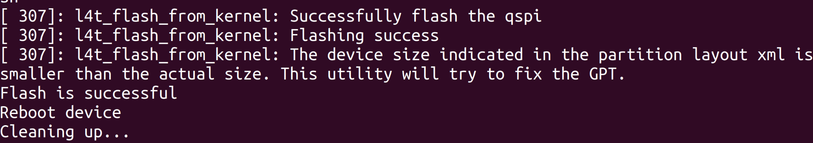

# 1.2 JetPack 6.2 系统刷机与基础配置

**课程目标**：完成 reComputer 的系统初始化，建立稳定的开发平台。

**硬件清单**：reComputer、USB-C 数据线、Ubuntu Host PC。

**参考**：[Seeed Wiki — reComputer Robotics J501 硬件与快速上手](https://wiki.seeedstudio.com/cn/ai_robotics_recomputer_j501_robotics_getting_started/) 

***

## 1.2.1 JetPack 6.2 组件概览

| 组件        | 版本        | 说明               |
| --------- | --------- | ---------------- |
| L4T       | 36.4.4    | Linux BSP（内核+驱动） |
| CUDA      | 12.6.11   | GPU 并行计算框架       |
| cuDNN     | 9.3.0.75  | 深度学习加速库          |
| TensorRT  | 10.3.0.30 | 高性能推理优化器         |
| VPI       | 3.2.4     | 视觉编程接口           |
| Vulkan    | 1.3.204   | 图形/计算 API        |
| OpenCV    | 4.8.0     | 计算机视觉库（无 CUDA）   |
| PyTorch   | 2.11.0    | 深度学习框架（conda 环境） |
| FFmpeg    | 4.4.2     | 多媒体处理（含硬件解码）     |
| GStreamer | 1.20.3    | 多媒体管线框架          |

> **实机状态**：出厂已预装 JetPack 6.2.1，无需重新刷机。如需重刷，参考下文 1.2.2 节。

***

## 1.2.2 刷写 JetPack 操作系统

> 如 J501 已预装系统，可跳至 1.2.3 节"**系统验证**"。

### (1) 前置准备

- Ubuntu 22.04 主机电脑（非虚拟机）
- USB Type-C 数据传输线

### (2) 下载镜像

| JetPack | 模块            | GMSL | 下载链接                                                                                                                                                   | SHA256      |
| ------- | ------------- | ---- | ------------------------------------------------------------------------------------------------------------------------------------------------------ | ----------- |
| 6.2.1   | AGX Orin 64GB | ✅    | [下载](https://seeedstudio88-my.sharepoint.com/:u:/g/personal/youjiang_yu_seeedstudio88_onmicrosoft_com/IQCiNRM83_Q1Qq2lodZbxxz7AQb046lJeZh4aTUo20T6ks4) | B858312B9DC9EA5D43A104F478C0ABDC |
| 6.2.1   | AGX Orin 32GB | ✅    | [下载](https://seeedstudio88-my.sharepoint.com/:u:/g/personal/youjiang_yu_seeedstudio88_onmicrosoft_com/IQAWnjh2iWzeRI1rKN5Bb_HxAX3P3GxPMHSb-60VmCPCgx4) | e868fd8c7ad05d3acc8c9808f42e183528f11df14f48cb6ae16464adb4f23d1f |

> 镜像较大，考虑下载时网络与其他因素，请在下载完成后使用 `sha256sum <文件名>` 验证完整性。

### (3) 进入强制恢复模式

**步骤 1.** 用 USB-C 线连接 reComputer 的 **USB2.0 DEVICE 接口**和 Ubuntu 主机。


**步骤 2.** 用针按住 RECOVERY 按键不放。

**步骤 3.** 接通电源。

**步骤 4.** 松开 RECOVERY 按键。

**步骤 5.** 在主机上运行 `lsusb`，出现以下输出说明进入恢复模式：

- AGX Orin 32GB：`0955:7223 NVidia Corp`
- AGX Orin 64GB：`0955:7023 NVidia Corp`


### (4) 刷写系统

```bash
# [Host PC 终端] 以下命令在 Ubuntu 主机上执行
# 解压镜像
cd <path-to-image>
sudo tar xpf mfi_recomputer-robo-agx-orin-32g-j501-6.2.1-36.4.4-2025-11-04.tar.gz

# 执行刷写
cd mfi_recomputer-robo-agx-orin-j501x
sudo ./tools/kernel_flash/l4t_initrd_flash.sh --flash-only --massflash 1 --network usb0 --showlogs
```

刷写成功输出：



> 刷写命令约运行 2-10 分钟。

**初始配置：** 用 HDMI 线连接 reComputer 到显示器，完成系统配置：


> 刷机完成后，你可以通过 HDMI + 键鼠、SSH 或调试串口等方式连接 reComputer 验证系统（参见 1.1.5 (1) 连接方式说明）。

***

## 1.2.3 系统验证

以下命令通过 SSH 在 reComputer Robotics J5011 上执行，输出为实际验证结果。你也可以在 reComputer 本机终端上执行相同命令。

### (1) L4T 版本

```bash
cat /etc/nv_tegra_release
```

**实际输出：**

```
# R36 (release), REVISION: 4.4, GCID: 41062509, BOARD: generic, EABI: aarch64, DATE: Mon Jun 16 16:07:13 UTC 2025
# KERNEL_VARIANT: oot
TARGET_USERSPACE_LIB_DIR=nvidia
TARGET_USERSPACE_LIB_DIR_PATH=usr/lib/aarch64-linux-gnu/nvidia
# Seeed Image Name mfi_recomputer-robo-agx-orin-32g-j501-6.2.1-36.4.4-2025-11-04.tar.gz
# branch R36.4.4
# commit ID 36a8a761b8a88785372afc7bd6d4e70643b76677
```

### (2) 操作系统

```bash
cat /etc/os-release
```

**实际输出：**

```
PRETTY_NAME="Ubuntu 22.04.5 LTS"
NAME="Ubuntu"
VERSION_ID="22.04"
VERSION="22.04.5 LTS (Jammy Jellyfish)"
VERSION_CODENAME=jammy
ID=ubuntu
ID_LIKE=debian
UBUNTU_CODENAME=jammy
```

### (3) 内核版本

```bash
uname -a
```

**实际输出：**

```
Linux seeed-desktop 5.15.148-tegra #1 SMP PREEMPT Tue Nov 4 08:05:33 UTC 2025 aarch64 aarch64 aarch64 GNU/Linux
```

**解读：** Tegra 专用内核 5.15.148，支持 SMP（对称多处理）和 PREEMPT（抢占调度），aarch64 架构。

### (4) CPU 信息

```bash
lscpu | head -20
```

**实际输出：**

```
Architecture:                       aarch64
CPU op-mode(s):                     32-bit, 64-bit
Byte Order:                         Little Endian
CPU(s):                             8
On-line CPU(s) list:                0-7
Vendor ID:                          ARM
Model name:                         Cortex-A78AE
Model:                              1
Thread(s) per core:                 1
Core(s) per cluster:                4
Socket(s):                          -
Cluster(s):                         2
Stepping:                           r0p1
CPU max MHz:                        2188.8000
CPU min MHz:                        115.2000
BogoMIPS:                           62.50
Flags:                              fp asimd evtstrm aes pmull sha1 sha2 crc32 atomics fphp asimdhp ...
L1d cache:                          512 KiB (8 instances)
L1i cache:                          512 KiB (8 instances)
L2 cache:                           2 MiB (8 instances)
```

**解读：** 8 核 Cortex-A78AE（2 集群 × 4 核），最大 2.2GHz，支持 AES/SHA 硬件加速。

### (5) 内存与存储

```bash
free -h; echo "---"; df -h
```

**实际输出：**

```
               total        used        free      shared  buff/cache   available
Mem:            29Gi       3.1Gi        23Gi        82Mi       3.8Gi        26Gi
Swap:           14Gi          0B        14Gi
---
Filesystem       Size  Used Avail Use% Mounted on
/dev/nvme0n1p1   116G   43G   68G  39% /
tmpfs             15G  172K   15G   1% /dev/shm
tmpfs            6.0G   28M  6.0G   1% /run
/dev/nvme0n1p10   63M  110K   63M   1% /boot/efi
tmpfs            3.0G  144K  3.0G   1% /run/user/1000
```

**解读：** 32GB LPDDR5 内存（系统可见 29Gi），NVMe SSD 116GB（已用 39%），Swap 14GB（zram）。

### (6) GPU 状态

```bash
nvidia-smi
```

**实际输出：**

```
Tue Jul 28 13:48:48 2026
+---------------------------------------------------------------------------------------+
| NVIDIA-SMI 540.4.0                Driver Version: 540.4.0      CUDA Version: 12.6     |
|-----------------------------------------+----------------------+----------------------+
| GPU  Name                 Persistence-M | Bus-Id        Disp.A | Volatile Uncorr. ECC |
| Fan  Temp   Perf          Pwr:Usage/Cap |         Memory-Usage | GPU-Util  Compute M. |
|=========================================+======================+======================|
|   0  Orin (nvgpu)                  N/A  | N/A              N/A |                  N/A |
| N/A   N/A  N/A               N/A /  N/A | Not Supported        |     N/A          N/A |
+-----------------------------------------+----------------------+----------------------+

+---------------------------------------------------------------------------------------+
| Processes:                                                                            |
|  No running processes found                                                           |
+---------------------------------------------------------------------------------------+
```

**解读：** GPU 名称 Orin (nvgpu)，驱动 540.4.0，CUDA 12.6。Jetson 平台 nvidia-smi 不显示温度/功耗/显存（与独立 GPU 不同，Jetson GPU 与 CPU 共享内存）。

***

## 1.2.4 CUDA 验证

### (1) CUDA SDK 版本

```bash
cat /usr/local/cuda-12.6/version.json | head -10
```

**实际输出：**

```json
{
   "cuda" : {
      "name" : "CUDA SDK",
      "version" : "12.6.11"
   },
   "cuda_cccl" : {
      "name" : "CUDA C++ Core Compute Libraries",
      "version" : "12.6.37"
   },
   "cuda_compat" : {
      "name" : "CUDA Specific Libraries",
      "version" : "12.6.36890662"
   },
```

### (2) NVCC 编译器

```bash
/usr/local/cuda/bin/nvcc --version
```

**实际输出：**

```
nvcc: NVIDIA (R) Cuda compiler driver
Copyright (c) 2005-2024 NVIDIA Corporation
Built on Wed_Aug_14_10:14:07_PDT_2024
Cuda compilation tools, release 12.6, V12.6.68
Build cuda_12.6.r12.6/compiler.34714021_0
```

**解读：** CUDA SDK 12.6.11，NVCC 编译器 12.6.68，编译日期 2024-08-14。

> **提示**：`nvcc` 默认不在 PATH 中。添加到 `~/.bashrc`：`export PATH=/usr/local/cuda/bin:$PATH`

***

## 1.2.5 cuDNN 验证

### (1) 包版本

```bash
dpkg -l | grep -i cudnn
```

**实际输出：**

```
ii  libcudnn9-cuda-12     9.3.0.75-1   arm64   cuDNN runtime libraries for CUDA 12.6
ii  libcudnn9-dev-cuda-12 9.3.0.75-1   arm64   cuDNN development headers for CUDA 12.6
ii  libcudnn9-samples     9.3.0.75-1   all     cuDNN samples
ii  nvidia-cudnn          6.2.1+b38    arm64   NVIDIA CUDNN Meta Package
ii  nvidia-cudnn-dev      6.2.1+b38    arm64   NVIDIA CUDNN dev Meta Package
```

### (2) 头文件版本

```bash
cat /usr/include/cudnn_version.h | grep CUDNN_MAJOR -A2
```

**实际输出：**

```c
#define CUDNN_MAJOR 9
#define CUDNN_MINOR 3
#define CUDNN_PATCHLEVEL 0
```

**解读：** cuDNN 版本 9.3.0

***

## 1.2.6 TensorRT 验证

### (1) 包版本

```bash
dpkg -l | grep -i "tensorrt\|libnvinfer" | head -10
```

**实际输出：**

```
ii  libnvinfer-bin          10.3.0.30-1+cuda12.5  arm64  TensorRT binaries
ii  libnvinfer-dev          10.3.0.30-1+cuda12.5  arm64  TensorRT development libraries
ii  libnvinfer-dispatch10   10.3.0.30-1+cuda12.5  arm64  TensorRT dispatch runtime
ii  libnvinfer-headers-dev  10.3.0.30-1+cuda12.5  arm64  TensorRT development headers
ii  libnvinfer-lean10       10.3.0.30-1+cuda12.5  arm64  TensorRT lean runtime
ii  libnvinfer-plugin10     10.3.0.30-1+cuda12.5  arm64  TensorRT plugin libraries
```

### (2) Python 绑定

```bash
python3 -c "import tensorrt; print(tensorrt.__version__)"
```

**实际输出：**

```
10.3.0
```

### (3) trtexec 工具位置

```bash
ls /usr/src/tensorrt/bin/trtexec
```

**实际输出：**

```
/usr/src/tensorrt/bin/trtexec
```

> **提示**：`trtexec` 不在默认 PATH。使用时指定完整路径，或添加 `export PATH=/usr/src/tensorrt/bin:$PATH`。

***

## 1.2.7 其他关键库验证

### (1) VPI

```bash
dpkg -l | grep -i vpi | head -5
```

**实际输出：**

```
ii  libnvvpi3           3.2.4       arm64  NVIDIA Vision Programming Interface library
ii  nvidia-vpi          6.2.1+b38   arm64  NVIDIA Vpi Meta Package
ii  python3.10-vpi3     3.2.4       arm64  NVIDIA VPI python 3.10 bindings
ii  vpi3-dev            3.2.4       arm64  NVIDIA VPI C/C++ development library
```

### (2) OpenCV

```bash
python3 -c "import cv2; print(cv2.__version__)"
```

**实际输出：**

```
4.8.0
```

> **注意**：系统 OpenCV 4.8.0 **不含 CUDA 加速**。如需 CUDA 加速版本，需自行编译或在容器中使用。M4 课程会详细讲解。

### (3) Vulkan

```bash
dpkg -l | grep -i vulkan | head -5
```

**实际输出：**

```
ii  libvulkan-dev:arm64        1.3.204.1-2              arm64  Vulkan loader dev files
ii  libvulkan1:arm64           1.3.204.1-2              arm64  Vulkan loader library
ii  nvidia-l4t-vulkan-sc       36.4.4-20250616085344    arm64  NVIDIA Vulkan SC runtime
```

***

## 1.2.9 性能模式配置

### (1) 查看当前模式

```bash
sudo nvpmodel -q
```

**实际输出：**

```
NV Power Mode: MODE_40W
3
```

### (2) 切换到 MAXN 模式

MAXN 模式解锁全部算力（\~60W），适合 AI 推理和密集计算：

```bash
sudo nvpmodel -m 0
```

### (3) 锁定最高频率

```bash
sudo jetson_clocks
```

将所有 CPU/GPU/EMC 频率锁定到最大值，确保性能稳定不降频。

> **注意**：切换 MAXN 前确保散热风扇已安装。MAXN 下温度可达 55-65°C。

### (4) 电源模式对照表

| 模式 | 名称        | 功耗    | 适用场景       |
| -- | --------- | ----- | ---------- |
| 0  | MAXN      | \~60W | AI 推理、密集计算 |
| 1  | MODE\_30W | \~30W | 轻量任务、节能    |
| 2  | MODE\_50W | \~50W | 平衡模式       |
| 3  | MODE\_40W | \~40W | 日常使用（当前）   |

***

## 1.2.10 总结
学完 1.1 和 1.2 两节内容后，我们已经了解了 reComputer Robotics J501X 边缘计算平台的硬件接口和基础系统配置。后续内容，我们将在 reComputer 设备中安装常用软件工具包。
