# 2.1 GMSL2 ：车载级多相机接入

## 什么是GMSL2？

GMSL2（Gigabit Multimedia Serial Link 2，千兆多媒体串行链路第二代）是 Analog Devices（原 Maxim Integrated）推出的高速串行器/解串器（SerDes）技术，专为汽车及高可靠性场景中的视频、音频与控制数据传输而设计。它通过单根同轴电缆或屏蔽双绞线（STP）实现高达 6Gbps 的正向数据传输，并同时承载反向控制通道，可在一根线缆上完成高清视频流、I²C 配置、GPIO 信号乃至供电（PoC）的复合传输。相比第一代 GMSL，GMSL2 在带宽、传输距离、EMC 抗扰性和功能安全方面均有显著提升，并支持 HDCP 内容保护，广泛应用于车载环视摄像头、ADAS 传感器、域控制器显示屏以及工业机器人视觉等对实时性和可靠性要求严苛的场景。

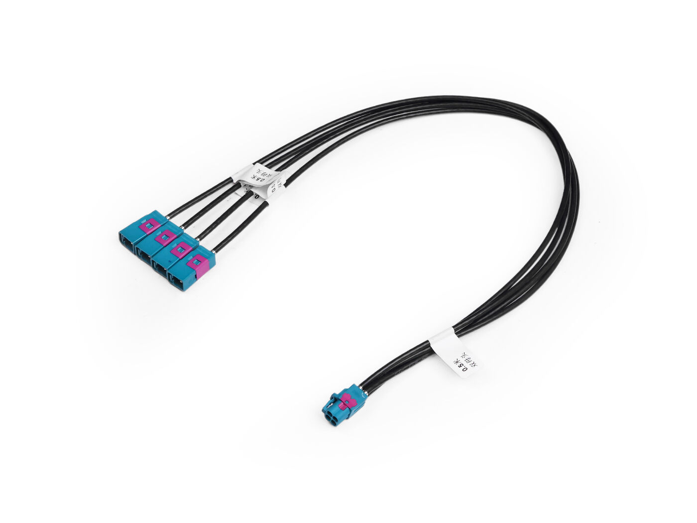

## GMSL VS CSI

GMSL 与 CSI（MIPI CSI-2）并非相互替代的竞争关系，而是处于不同层级、常协同工作的两种接口技术。CSI-2 是 MIPI 联盟制定的摄像头串行接口协议，定义了图像数据从传感器到处理器的传输格式，广泛用于手机、嵌入式和车载 SoC 的板级短距离连接，物理层依赖 D-PHY 或 C-PHY，传输距离通常在厘米级。GMSL 则是 Analog Devices 推出的完整 SerDes（串行器/解串器）方案，专为汽车等长距离、强干扰环境设计，可通过单根同轴电缆或 STP 将视频、控制信号乃至供电传输 15 米以上。在典型车载摄像头链路中，两者往往配合使用：图像传感器输出 CSI-2 信号送入 GMSL 串行器，经长线传输后由 GMSL 解串器还原为 CSI-2 再接入域控制器 SoC。CSI-2 解决"芯片间怎么传图像"的协议问题，GMSL 解决"远距离怎么可靠传输"的物理链路问题。

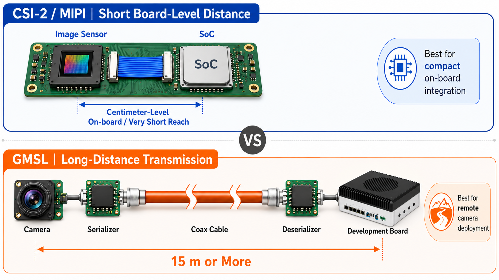

## 硬件清单：

- reComputer Robotics J501 / reComputer mini J501 + GMSL 扩展板
- [SG3S-ISX031C-GMSL2F](https://www.seeedstudio.com/SG3S-ISX031C-GMSL2F-p-6245.html) / SG8S-AR0820 GMSL2 相机
- [Fakra 四合一线缆](https://www.seeedstudio.com/Mini-fakra-Coaxial-Cable-4-in-1-0-5m-Female-to-Female-p-6484.html)

| 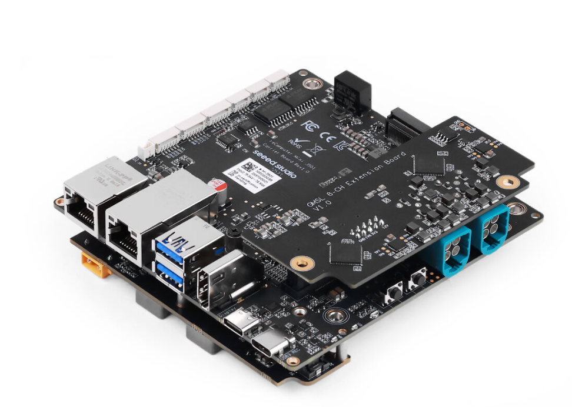 | 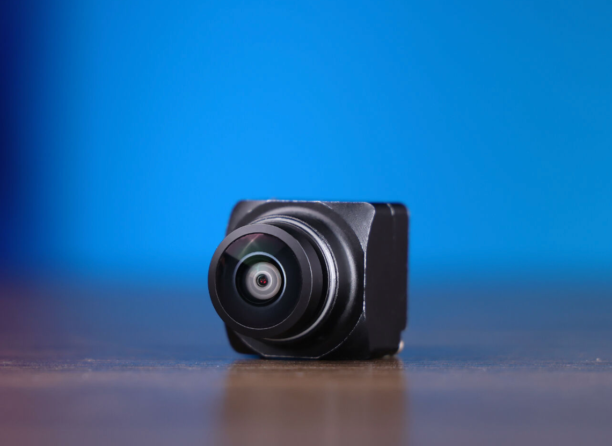 | 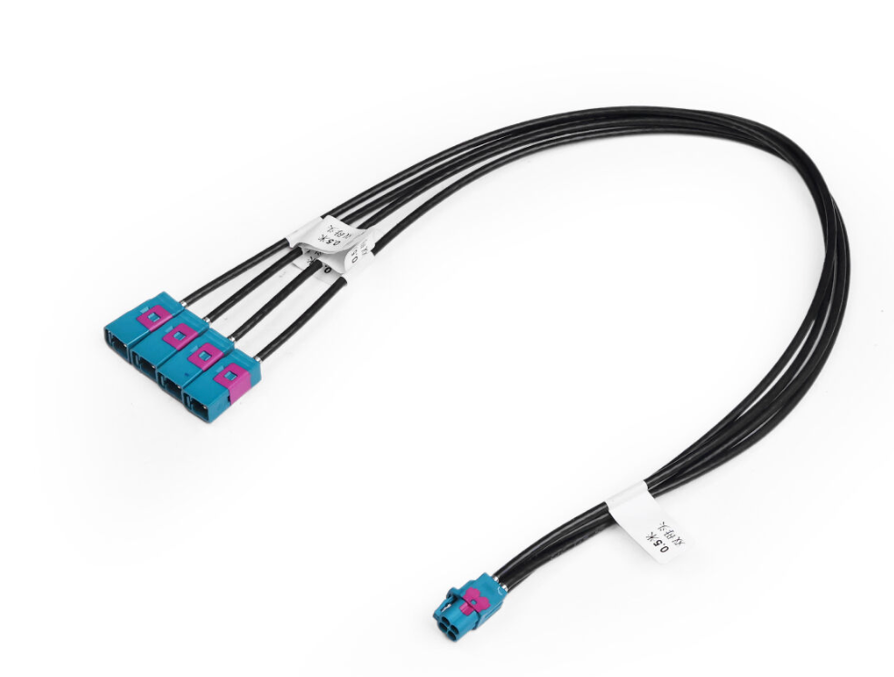 |
|---|---|---|
| reComputer mini J501 + GMSL 扩展板 | 森云 3G GMSL 摄像头 | Fakra 四合一线缆 |

## 使用介绍

### 硬件连接

请参考下图连接方式，接入自己的 GMSL 摄像头与 J501 载板连接。

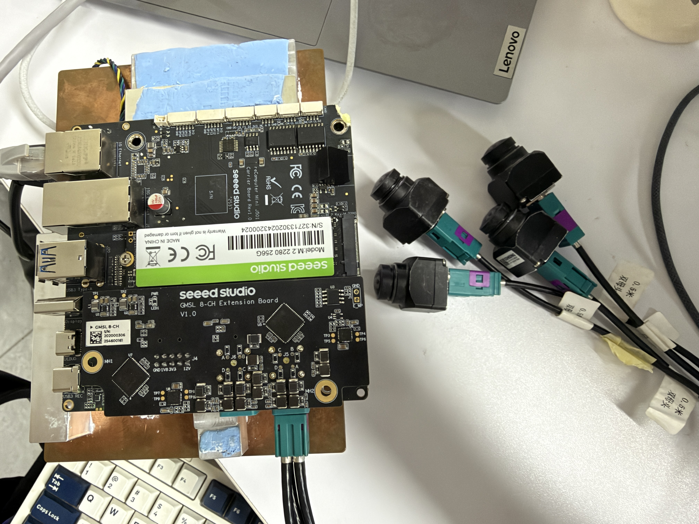

### 选择设备树

参考如下步骤进行设备树选择

> 注意：本章使用的示例硬件为 seeed reComputer J501 mini + 森云 [SG3S-ISX031C-GMSL2F](https://www.seeedstudio.com/SG3S-ISX031C-GMSL2F-p-6245.html) 摄像头，实际设备树需要根据自己的硬件组合选择，具体配置可参考 [GMSL 配置选择](https://wiki.seeedstudio.com/cn/recomputer_j501_mini_getting_started/#%E6%89%A9%E5%B1%95%E7%AB%AF%E5%8F%A3---gmsl)。

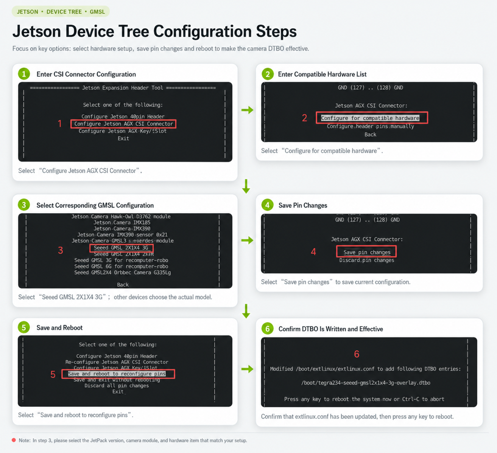

设备重启之后，如果设备树文件选择正确，即可看到接入的摄像头

```bash
ls /dev/video*
```

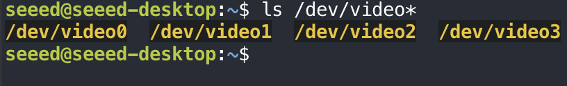

### 多相机同步

J501 载板上用于启用四路 GMSL 摄像头的设备树配置；它在启动时创建四路相机的 CSI/V4L2 链路，并配置 MAX96712 deserializer 的 FSYNC 输入及四个 MAX96717 serializer 的 MFP7 FSYNC 输出，使同一同步时钟可经 GMSL 链路传到四个相机的 FSIN/Trigger 引脚，从硬件层支持四路传感器按统一节拍曝光。

#### 查看media-controller 拓扑

```bash
media-ctl -d /dev/media0 -p
```

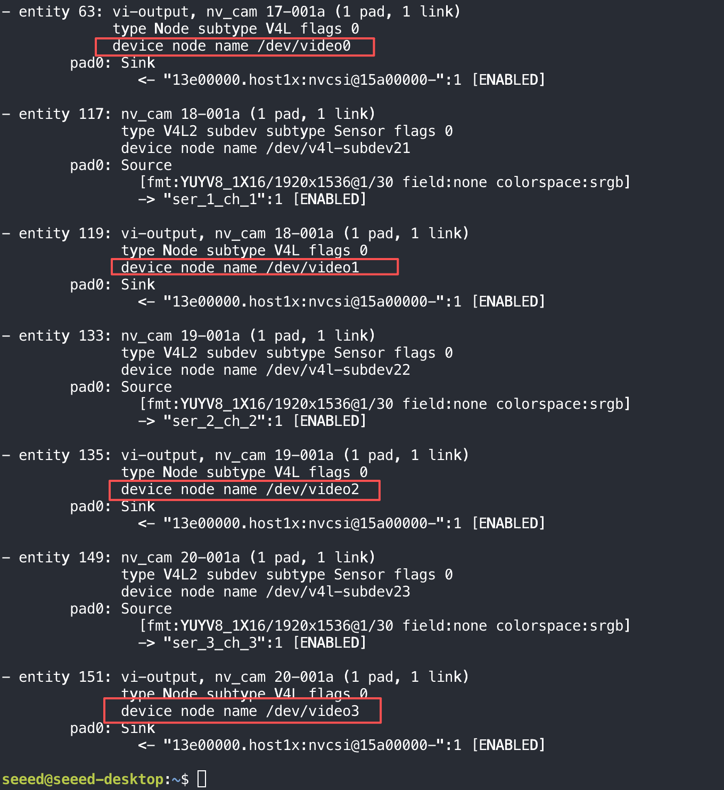

这一步验证的是：传感器、serializer、deserializer、CSI 和 V4L2 节点已经连通。

#### 检查摄像头占用

```bash
fuser /dev/video0 /dev/video1 /dev/video2 /dev/video3
```

如果没有输出，说明未被占用。

#### 设置串行器/解串器格式

```bash
sudo media-ctl -d /dev/media0 --set-v4l2 '"ser_0_ch_0":1[fmt:YUYV8_1X16/1920x1536]'
sudo media-ctl -d /dev/media0 --set-v4l2 '"des_0_ch_0":0[fmt:YUYV8_1X16/1920x1536]'

sudo media-ctl -d /dev/media0 --set-v4l2 '"ser_1_ch_1":1[fmt:YUYV8_1X16/1920x1536]'
sudo media-ctl -d /dev/media0 --set-v4l2 '"des_0_ch_1":0[fmt:YUYV8_1X16/1920x1536]'

sudo media-ctl -d /dev/media0 --set-v4l2 '"ser_2_ch_2":1[fmt:YUYV8_1X16/1920x1536]'
sudo media-ctl -d /dev/media0 --set-v4l2 '"des_0_ch_2":0[fmt:YUYV8_1X16/1920x1536]'

sudo media-ctl -d /dev/media0 --set-v4l2 '"ser_3_ch_3":1[fmt:YUYV8_1X16/1920x1536]'
sudo media-ctl -d /dev/media0 --set-v4l2 '"des_0_ch_3":0[fmt:YUYV8_1X16/1920x1536]'
```

> 注意：具体的分辨率设置需要根据自己实际连接的摄像头进行设置，以下是 J501 载板适配的 GMSL 相机型号以及对应的分辨率。

| GMSL 相机型号 | 分辨率（YUYV8_1X16） | sensor_mode |
|---|---|---|
| SG3S-ISX031C-GMSL2F（森云 3G） | 1920×1536 | 0 |
| J501 载板适配的 2MP GMSL 型号 | 1920×1080 | 1 |
| SG8S-AR0820-GMSL2F | 3840×2160 | 2 |

#### 设置 V4L2 节点格式和传感器模式

```bash
for i in 0 1 2 3; do
  sudo v4l2-ctl -d /dev/video${i} \
    --set-fmt-video=width=1920,height=1536,pixelformat=YUYV \
    -c sensor_mode=0
done
```

> sensor_mode 参数代表的是不同型号、分辨率的 GMSL 相机
>
> - sensor_mode=0 -------> YUYV8_1X16/1920x1536
> - sensor_mode=1 -------> YUYV8_1X16/1920x1080
> - sensor_mode=2 -------> YUYV8_1X16/3840x2160

检查设置是否生效：

```bash
for i in 0 1 2 3; do
  echo "===== /dev/video${i} ====="
  v4l2-ctl -d /dev/video${i} --get-fmt-video --get-parm
done
```

预期看到如下输出：

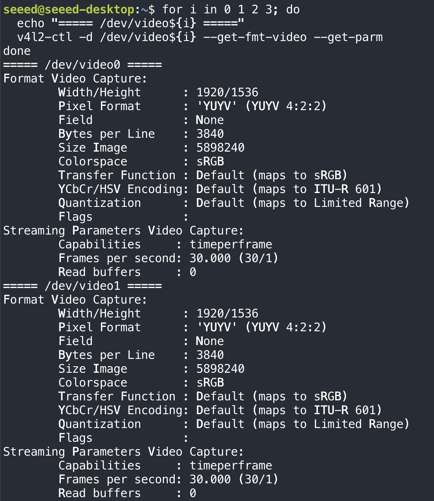

#### 同步启动

将以下脚本拷贝到 J501 上运行

```bash
#同时启动多个相机
bash gmsl4_start.sh preview
```

> 注意：如果你使用的 GMSL 相机型号不是森云 [SG3S-ISX031C-GMSL2F](https://www.seeedstudio.com/SG3S-ISX031C-GMSL2F-p-6245.html)，需要修改脚本的分辨率参数 `WIDTH, HEIGHT, FPS = 1920, 1536, 30`，改成实际的分辨率。

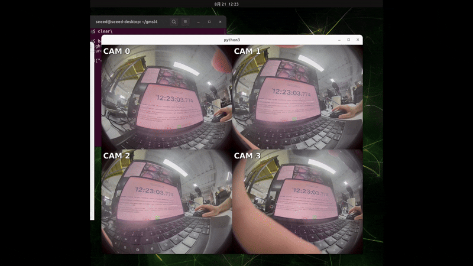

##### 运行代码 (Run the code)

> **说明**：下文命令中的 `<Jetson IP>` 请替换为你 Jetson 的实际 IP。可在 Jetson 终端运行 `hostname -I` 查询；请勿直接照抄固定地址。

脚本已收录在本仓库：`code/2.1_gmsl2/gmsl4_start.sh`（来自飞书 2.1 的附件，约 16 KB）。它支持 `preview / stream / verify / stop / status` 五种模式。

1. 把脚本从本仓库拷到 Jetson（远端地址 `<Jetson IP>`，用户名 `seeed`）：

   ```bash
   scp docs/M02-Fundamentals-of-Vision-Systems/code/2.1_gmsl2/gmsl4_start.sh seeed@<Jetson IP>:~/
   ```

2. 加执行权限：

   ```bash
   ssh seeed@<Jetson IP> 'chmod +x ~/gmsl4_start.sh'
   ```

3. 启动四路相机预览：

   ```bash
   ssh seeed@<Jetson IP> 'bash ~/gmsl4_start.sh preview'
   ```

脚本默认按 SG3S-ISX031C-GMSL2F 的 1920×1536@30 配置（脚本内 `WIDTH, HEIGHT, FPS = 1920, 1536, 30`），并预置 `sensor_mode=0`。换成其他型号时，先按上面的型号表把脚本里的 `WIDTH, HEIGHT, FPS` 改成该型号的实际分辨率，再运行。

`preview` 模式需要在 Jetson 上接显示器（本地 X11）；无显示器时用 `bash gmsl4_start.sh verify` 做无头自检。