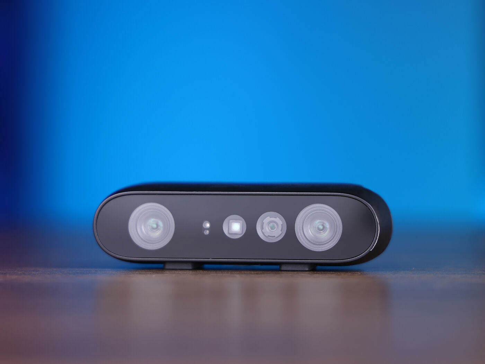
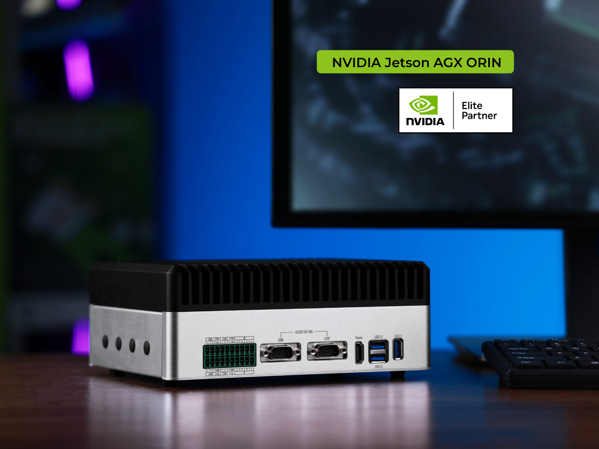
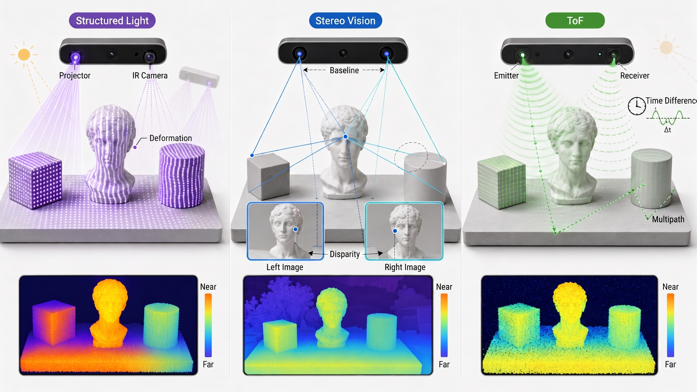
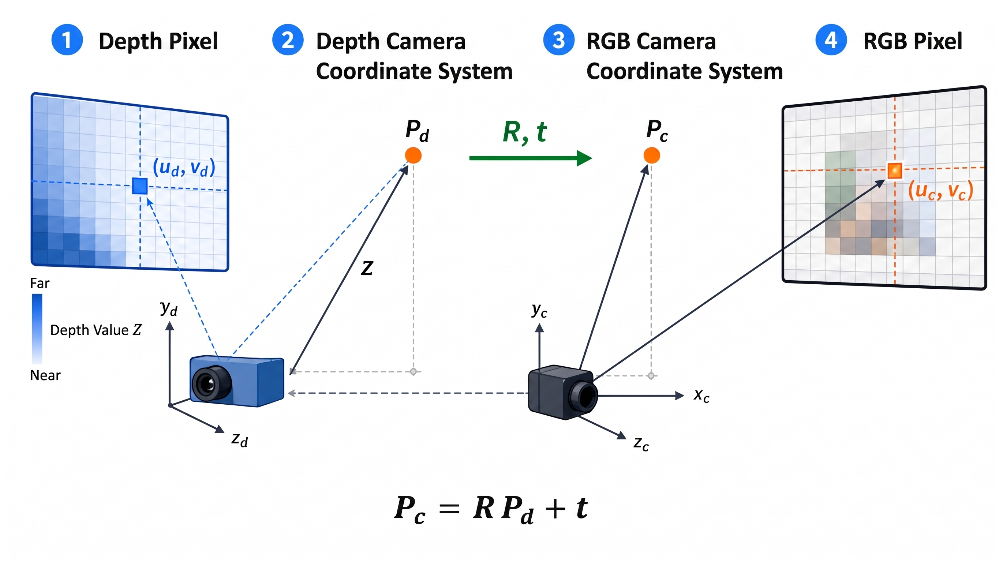
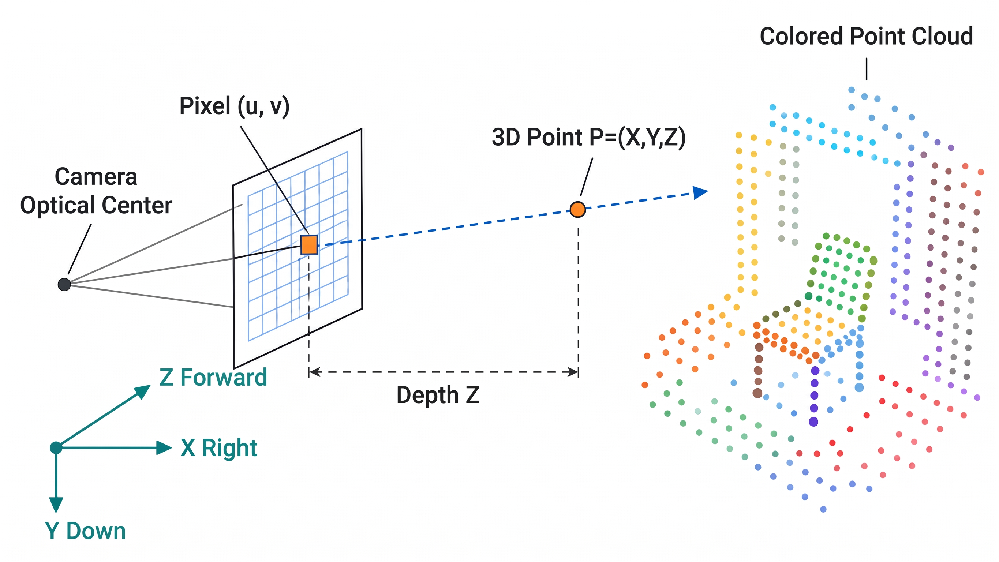
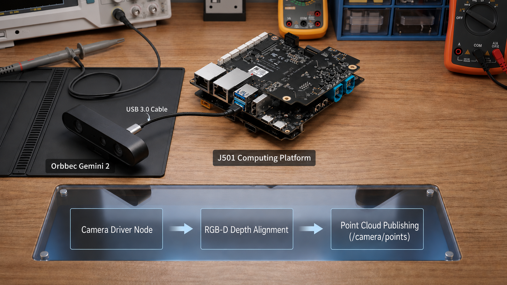
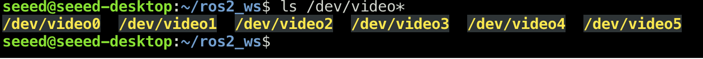

# 2.2 Depth Cameras and 3D Visual Perception

### Course Objectives

After completing this section, you will be able to turn a depth camera into a 3D perception input: first judge which depth technology suits which scenario, then start the official ROS 2 driver to obtain aligned RGB-D and colored point clouds, understand how a depth pixel becomes a 3D point through coordinate transformation, and verify the results with RViz2. After finishing the required parts, you can additionally challenge yourself with a hand-written synchronized point-cloud node, Open3D visualization, and depth filtering.

| Stage | What you do | Verifiable result |
| --- | --- | --- |
| Connect | Start the Gemini 2 with the official ROS 2 driver | The RGB, depth, and CameraInfo topics appear |
| Align | Enable depth-to-color registration | Depth edges line up with the color image |
| Point Cloud | Enable the official colored point cloud and inspect it in RViz2 | The point-cloud coordinate frame, colors, and shape are correct |
| Advanced | Understand back-projection, synchronization, and filtering | You can explain and modify your own point-cloud node |

### Hardware List

|  |  |
| --- | --- |
| [Orbbec Gemini 2](https://www.seeedstudio.com/Orbbec-Gemini-2-3D-Camera-p-6464.html) | [reComputer Robotics J5012](https://www.seeedstudio.com/reComputer-Robotics-J5012-with-GMSL-extension-board-p-6682.html) |

- Depth camera: Orbbec Gemini 2 (USB3 interface, active stereo IR depth technology, integrated 6-axis IMU, supports hardware RGB-D synchronization and depth alignment).
- Compute platform: reComputer Robotics J5012 (NVIDIA Jetson AGX Orin; or an equivalent x86/ARM compute platform that meets the ROS 2 Humble-or-newer requirement).
- Cable: USB3.0 data cable (for connecting the Gemini 2 to the compute platform).

Official documentation: [OrbbecSDK_ROS2 Wrapper v2 docs](https://orbbec.github.io/OrbbecSDK_ROS2/). Driver parameters and topics change between versions; during the hands-on work, rely on the on-machine `ros2 topic list -t` output and the current official documentation.

### Prerequisites

- ROS 2 basics: be familiar with nodes, topics, message types, and the `ros2 launch` startup method.
- Linear algebra basics: homogeneous coordinates and the composition of rotation matrices with translation vectors.

---

### Theory Essentials

#### 1. Comparing Depth-Sensing Technologies

Today's mainstream consumer/industrial depth cameras mainly follow three technology routes, each with trade-offs in accuracy, ranging distance, immunity to light interference, cost, and power consumption.



| Technology route | Core principle | Advantages | Limitations |
| --- | --- | --- | --- |
| Structured Light | Projects a known encoded infrared speckle/stripe pattern and computes disparity from how the pattern deforms on object surfaces, then triangulates the depth. | High near-range accuracy; friendly to low-texture surfaces; lower power consumption. | Easily disturbed by strong light; pattern crosstalk when multiple devices run together; ranging distance typically ≤ 3 m. |
| Stereo Vision | Uses left/right infrared or visible-light cameras to mimic human binocular disparity; a stereo-matching algorithm (SGBM, BM, etc.) computes the disparity map, and depth is derived from the baseline and focal length. | Active IR texture improves low-texture regions; wide ranging distance; usually performs well indoors and semi-outdoors. | Hard to match textureless regions; high computational complexity; accuracy degrades with distance. |
| ToF (Time-of-Flight) | Emits modulated infrared light into the scene and computes each pixel's distance directly from the phase shift or flight time of the light pulse's round trip. | No stereo matching required; insensitive to texture; achieves high frame rates in a compact module. | Susceptible to multi-path interference (MPI); moderate near-range accuracy; SNR drops under direct sunlight. |

> The hardware used in this section, the Orbbec Gemini 2, uses an Active Stereo IR scheme: two infrared cameras derive depth through disparity triangulation, and the active IR texture helps match low-texture surfaces. It integrates a 6-axis IMU and supports hardware RGB-D synchronization and hardware D2C alignment; however, strong sunlight, reflective surfaces, occlusion, and long distances still degrade depth quality.

#### 2. Extrinsic Alignment of Depth and Color Images (Registration)

A depth camera typically contains two independent imaging units — a depth sensor (IR/ToF) and a color sensor (RGB) — whose optical centers do not coincide and which have a fixed extrinsic relationship (rotation `R` and translation `t`). Simply overlaying the depth and color images produces pixel misalignment, so depth alignment (Depth Registration / Alignment) is required.

Alignment goal: map every pixel of the depth image into the color camera's coordinate frame so that depth values correspond one-to-one with RGB pixels, producing aligned RGB-D data.

Core transformation pipeline:

1. For each pixel `(u_d, v_d)` in the depth image, combine the depth value `Z` with the depth camera intrinsics `K_d` to back-project a 3D point `P_d = (X_d, Y_d, Z_d)` in the depth camera frame.
2. Transform the point into the color camera frame using the depth→color extrinsics `(R_{d2c}, t_{d2c})`: `P_c = R_{d2c} · P_d + t_{d2c}`.
3. Project `P_c` onto the color image plane using the color camera intrinsics `K_c` to obtain the corresponding pixel coordinates `(u_c, v_c)`.
4. Write the depth value `Z_c = P_c.z` into position `(u_c, v_c)` of the aligned depth image; unfilled pixels are marked invalid (0 or NaN).



> Extrinsic calibration accuracy directly affects alignment quality. Factory calibration is usually sufficient; if you replace lenses or the mechanical structure deforms, recalibrate with Kalibr or the MATLAB Stereo Camera Calibrator.

#### 3. Point-Cloud Generation: RGB-D → PointCloud2

A point cloud is a set of discrete points in 3D space; each point contains at least 3D coordinates `(x, y, z)` and may carry additional attributes such as color, normals, and intensity. Converting RGB-D data into a point cloud is essentially per-pixel back-projection of the depth image.

Back-projection formula (pinhole model): for a pixel `(u, v)` in the aligned depth image with depth value `Z`, and camera intrinsics `K = [[f_x, 0, c_x], [0, f_y, c_y], [0, 0, 1]]`, the 3D coordinates are:

`X = (u - c_x) · Z / f_x`
`Y = (v - c_y) · Z / f_y`
`Z = Z` (the depth value, usually in meters)



Key points of the ROS 2 `PointCloud2` message structure:

- `header.frame_id`: the reference frame of the point cloud, typically the camera optical frame (e.g. `camera_color_optical_frame`).
- `height` / `width`: the point cloud's layout. An organized point cloud preserves the image's 2D structure and `height` is the number of image rows; an unorganized point cloud has `height=1`.
- `fields`: field descriptions; a common combination is `x, y, z` (FLOAT32) + `rgb` (FLOAT32, packed RGB bytes) or `r, g, b` (UINT8).
- `point_step` / `row_step`: the byte stride of a single point and of a single row; `data` is the raw byte array.

Commonly used libraries:

- PCL (Point Cloud Library): the most common C++ library for point-cloud processing; provides conversion between `pcl::PointCloud<pcl::PointXYZRGB>` and ROS 2 messages (`pcl_conversions`).
- Open3D: covers both Python and C++, with a friendly API, suitable for rapid prototyping and visualization.
- depth_image_proc (a ROS 2 package): converts depth images to point clouds through launch configuration, with no hand-written code.

---

### Exercises

> The compute platform used in this lab is the reComputer Robotics J5012 (NVIDIA Jetson AGX Orin), the camera is the Orbbec Gemini 2, and the software system is JetPack 6.2.1. First check whether your environment matches — if versions differ, the installation and startup commands below may need to be adjusted accordingly.

#### Task 1: Connect the Depth Camera and Publish a ROS 2 PointCloud2 Topic

Goal: connect the depth camera hardware, start the official ROS 2 driver, obtain aligned RGB-D data, and publish it as a `sensor_msgs/PointCloud2` topic.

Step A: Hardware Connection and Driver Installation

Orbbec Gemini 2 (USB3)



1. Use a USB3.0 cable to connect the Gemini 2 to a USB3.0 port on the J5012 (note the difference between USB2.0 and USB3.0 — USB2.0 bandwidth is insufficient to carry the depth and color streams simultaneously).
2. Build and install the Orbbec ROS 2 driver from source (clone the repo, install dependencies, install udev rules, build, and verify device recognition):

```bash
mkdir -p ~/ros2_ws/src && cd ~/ros2_ws/src && git clone https://github.com/orbbec/OrbbecSDK_ROS2.git && sudo apt install libgflags-dev nlohmann-json3-dev ros-$ROS_DISTRO-image-transport ros-${ROS_DISTRO}-image-transport-plugins ros-${ROS_DISTRO}-compressed-image-transport ros-$ROS_DISTRO-image-publisher ros-${ROS_DISTRO}-camera-info-manager ros-$ROS_DISTRO-diagnostic-updater ros-$ROS_DISTRO-diagnostic-msgs ros-$ROS_DISTRO-statistics-msgs ros-${ROS_DISTRO}-backward-ros libdw-dev && cd ~/ros2_ws/src/OrbbecSDK_ROS2/orbbec_camera/scripts && sudo bash install_udev_rules.sh && sudo udevadm control --reload-rules && sudo udevadm trigger && cd ~/ros2_ws/ && colcon build --packages-select orbbec_camera --cmake-args -DCMAKE_BUILD_TYPE=Release -DOpenCV_DIR=/usr/lib/cmake/opencv4 && source ./install/setup.bash && ls /dev/video*
```




Step B: Start the Camera Driver Node

Start the Gemini 2 camera node and enable depth alignment and colored point-cloud publishing:

```bash
ros2 launch orbbec_camera gemini2.launch.py \
  depth_registration:=true \
  enable_point_cloud:=true \
  enable_colored_point_cloud:=true
```

After startup, verify the topics with the following commands:

```bash
ros2 topic list | grep camera
# 检查彩色图、深度图与点云话题
ros2 topic hz /camera/depth_registered/points
ros2 topic info /camera/depth_registered/points
ros2 topic echo /camera/color/camera_info --once
```

> `depth_registration:=true` aligns the depth image to the color camera frame, so every point in the colored point cloud published on `/camera/depth_registered/points` corresponds directly to an RGB pixel. If alignment is disabled, the point cloud is expressed in the depth camera frame and color requires an additional lookup mapping.


Step C (advanced): Write Your Own Point-Cloud Node

What you will get: `pointcloud_utils` subscribes to the RGB image, the D2C-aligned depth image, and the color camera's `CameraInfo`, and publishes a colored point cloud on `/camera/points` in real time.

Why write it by hand instead of using `depth_image_proc`? `depth_image_proc` can convert a depth image to a point cloud with zero code, but this section deliberately hand-writes the node so you understand two key steps — back-projection and time synchronization — which are exactly the places you will modify later when tuning parameters, adding filters, or doing multi-frame fusion.

> Before starting, complete Steps A and B and confirm that the official `/camera/depth_registered/points` publishes normally. The hand-written node is not a replacement for the camera driver; it turns already-aligned RGB-D data into a PointCloud2 that you can modify.
>
> Note: the upstream repository currently provides only two nodes, `rgbd_to_pointcloud` and `open3d_viewer`. There is no launch file and no `start_orbbec_rviz.sh` one-click script. The camera node, the hand-written node, and RViz2 must be started manually in three separate terminals.

Step C1: Clone the Code and Build

```bash
mkdir -p ~/ros2_ws/src

# 方式 A：拷贝本课程仓库随附的代码（已整理为 pointcloud_utils 单包，与上游 GitHub 同源）
cp -r docs/M02-Fundamentals-of-Vision-Systems/code/2.2_depth_camera/pointcloud_utils ~/ros2_ws/src/

# 方式 B：从上游 GitHub 克隆（规范源；仓库内还含其他包，只取 pointcloud_utils 子目录）
# git clone https://github.com/zibochen6/Mobile_Robot_Code.git
# cp -r Mobile_Robot_Code/pointcloud_utils ~/ros2_ws/src/

sudo apt update
sudo apt install -y ros-$ROS_DISTRO-cv-bridge ros-$ROS_DISTRO-vision-opencv ros-$ROS_DISTRO-sensor-msgs-py ros-$ROS_DISTRO-message-filters python3-numpy

cd ~/ros2_ws
source /opt/ros/$ROS_DISTRO/setup.bash
colcon build --packages-select pointcloud_utils
source install/setup.bash
```

If `~/ros2_ws/src/pointcloud_utils` already exists, delete the old directory first or overwrite it with the version bundled in this course, then run `colcon build --packages-select pointcloud_utils`.

Step C2: Run the Hand-Written Node and Verify

```bash
cd ~/ros2_ws
source /opt/ros/$ROS_DISTRO/setup.bash
source install/setup.bash

ros2 run pointcloud_utils rgbd_to_pointcloud
```

`rgbd_to_pointcloud` parameters and their defaults:

```bash
# registered_depth_topic := /camera/depth/image_raw   # D2C 对齐后的深度
# color_topic            := /camera/color/image_raw
# color_camera_info_topic:= /camera/color/camera_info
# output_topic           := /camera/points
# pixel_stride           := 2      # 采样步长，1 表示全分辨率
# sync_slop_sec          := 0.03   # 深度/彩色近似同步窗口（秒）
# depth_unit_m           := 0.001  # 16UC1 深度图每单位 = 1 mm

# 想要更密的点云，把 pixel_stride 降到 1：
ros2 run pointcloud_utils rgbd_to_pointcloud --ros-args -p pixel_stride:=1
```

Manual RViz2 configuration (the repo provides no one-click launch and no built-in `.rviz` config):

```bash
ros2 run rviz2 rviz2
# Fixed Frame 设为 camera_color_optical_frame；
# Add → By topic → /camera/points → PointCloud2，Color Transformer 选 RGB8。
```

Acceptance output:

```bash
ros2 topic hz /camera/points --window 30
ros2 topic echo /camera/points --once --field header.frame_id
ros2 topic echo /camera/points --once --field fields
```


Success criteria: `/camera/points` continuously outputs at a steady rate; `header.frame_id` is `camera_color_optical_frame`; `fields` contains `x`, `y`, `z`, and `rgb`; and a colored point cloud covering the scene's depth range is visible in RViz2.

#### Implementing It Yourself: Two Essential Pieces

1. RGB and depth must come in pairs. The node does not treat "an image received" as one iteration. For the Gemini 2's D2C stream, the repo implementation uses `message_filters.ApproximateTimeSynchronizer` (slop=0.03 s) to approximately pair frames by timestamp; the callback shown below is a simplified version of the same idea.

```python
self.depth_sub = self.create_subscription(
    Image, depth_topic, self.depth_callback, qos_profile_sensor_data)
self.color_sub = self.create_subscription(
    Image, color_topic, self.color_callback, qos_profile_sensor_data)

# Orbbec Gemini 2 的 RGB/Depth stamp 可能有固定偏移；
# 对已 D2C 对齐的流，仓库默认用近似时间同步把最新帧配对。

def depth_callback(self, msg):
    self.latest_depth = msg
    self.maybe_publish()

def color_callback(self, msg):
    self.latest_color = msg
    self.maybe_publish()
```

2. Back-project pixels into 3D points using the intrinsics. For each valid depth `Z`, the pixel coordinates `(u, v)` are converted through the color camera intrinsics to `X=(u-cx)×Z/fx`, `Y=(v-cy)×Z/fy`. The node first checks whether the RGB, depth, and CameraInfo resolutions match; if they do not, it stops publishing to avoid producing misplaced point clouds.

```python
sampled_z = z[::stride, ::stride]
valid = np.isfinite(sampled_z) & (sampled_z > 0)
v, u = np.mgrid[0:z.shape[0]:stride, 0:z.shape[1]:stride]

points['x'] = (u[valid] - cx) * sampled_z[valid] / fx
points['y'] = (v[valid] - cy) * sampled_z[valid] / fy
points['z'] = sampled_z[valid]
points['rgb'] = (r << 16) | (g << 8) | b
```

The node defaults to `pixel_stride=2` and publishes `/camera/points`. For a denser point cloud use `-p pixel_stride:=1`; if the CPU is under pressure, raise it to `4`. If the point cloud is just a small blob hugging the camera, first check the depth image's real valid range rather than rushing to enable hole filling.

#### Task 2: Visualize the Point-Cloud Stream in Open3D

This step is advanced and optional. RViz2 is enough for the required validation in this section; you only need Open3D if you want to continue with downsampling, segmentation, or fusion in Python. Whether Open3D can be installed depends on the combination of Python, Ubuntu, and CPU architecture; failing to install it does not affect acceptance.

Implementation essentials:

- Use `open3d.geometry.PointCloud` to store points and colors.
- Parse a complete point-cloud frame in the ROS 2 callback and refresh the geometry on the visualization main thread; do not assume the rgb field sits at a fixed byte offset.
- Thread safety: isolate the ROS 2 callback and the visualization main thread with a lock or `copy.deepcopy`.

```python
import threading
import numpy as np

import rclpy
from rclpy.node import Node
from rclpy.qos import qos_profile_sensor_data
from sensor_msgs.msg import PointCloud2
from sensor_msgs_py import point_cloud2


class PointCloudViewer(Node):
    def __init__(self):
        import open3d as o3d
        super().__init__('open3d_viewer')
        self.declare_parameter('pointcloud_topic', '/camera/depth_registered/points')
        topic = self.get_parameter('pointcloud_topic').value
        self.sub = self.create_subscription(PointCloud2, topic, self.pc_callback, qos_profile_sensor_data)
        self.lock = threading.Lock()
        self.latest_xyz = None
        self.latest_colors = None
        self.vis = o3d.visualization.Visualizer()
        self.vis.create_window(window_name='RGB-D PointCloud', width=960, height=720)
        self.geometry = o3d.geometry.PointCloud()
        self.vis.add_geometry(self.geometry)

    def pc_callback(self, msg):
        names = {field.name for field in msg.fields}
        if not {'x', 'y', 'z'} <= names:
            self.get_logger().error('点云缺少 x/y/z 字段', throttle_duration_sec=2.0)
            return
        data = point_cloud2.read_points(msg, skip_nans=True)
        if data.size == 0:
            return
        xyz = np.column_stack((data['x'], data['y'], data['z'])).astype(np.float64)
        valid = np.isfinite(xyz).all(axis=1) & (xyz[:, 2] > 0)
        xyz = xyz[valid]
        if xyz.size == 0:
            return

        colors = None
        if 'rgb' in names:
            raw = np.asarray(data['rgb'][valid])
            packed = raw.view(np.uint32) if np.issubdtype(raw.dtype, np.floating) else raw.astype(np.uint32)
            colors = np.column_stack(((packed >> 16) & 255, (packed >> 8) & 255, packed & 255)) / 255.0
        elif {'r', 'g', 'b'} <= names:
            colors = np.column_stack((data['r'][valid], data['g'][valid], data['b'][valid])) / 255.0

        with self.lock:
            self.latest_xyz = xyz
            self.latest_colors = colors

    def run(self):
        while rclpy.ok():
            rclpy.spin_once(self, timeout_sec=0.01)
            with self.lock:
                if self.latest_xyz is not None:
                    self.geometry.points = o3d.utility.Vector3dVector(self.latest_xyz)
                    if self.latest_colors is not None:
                        self.geometry.colors = o3d.utility.Vector3dVector(self.latest_colors)
                    self.vis.update_geometry(self.geometry)
            self.vis.poll_events()
            self.vis.update_renderer()
        self.vis.destroy_window()


def main(args=None):
    rclpy.init(args=args)
    viewer = PointCloudViewer()
    try:
        viewer.run()
    finally:
        viewer.destroy_node()
        rclpy.shutdown()


if __name__ == '__main__':
    main()
```

File placement and how to run:

This code is the file `pointcloud_utils/pointcloud_utils/scripts/open3d_pointcloud_viewer.py` in the repo; its entry point is already registered in `setup.py`:

```python
entry_points={
    "console_scripts": [
        "rgbd_to_pointcloud = pointcloud_utils.scripts.rgbd_to_pointcloud:main",
        "open3d_viewer = pointcloud_utils.scripts.open3d_pointcloud_viewer:main",
    ],
},
```

Install Open3D and run (only if a usable wheel exists for the current platform):

```bash
# 隔离环境；--system-site-packages 让它复用 ROS 2 Python 包。
sudo apt install -y python3-venv
cd ~/ros2_ws
python3 -m venv --system-site-packages .venv-open3d
source .venv-open3d/bin/activate
python -m pip install --only-binary=:all: open3d
python -c "import open3d as o3d; print(o3d.__version__)"
```

Measured on the Jetson: PyPI's Open3D 0.19.0 only ships Linux x86_64 wheels, with no ARM64 wheel; requesting PyPI from this machine also raised a TLS EOF. So do not treat it as a required main path, and do not stubbornly build from source on the Jetson. If it cannot be installed, use RViz2 or the real-time rendered image already validated in this section for acceptance.

Before running, confirm the point-cloud topic is publishing:

```bash
ros2 topic list | grep points

# 官方彩色点云：/camera/depth_registered/points
# 手写节点输出：/camera/points
```

Run the registered `open3d_viewer` (requires a graphical desktop, display, or X11 forwarding):

```bash
cd ~/ros2_ws
source /opt/ros/$ROS_DISTRO/setup.bash
source install/setup.bash
source .venv-open3d/bin/activate

# 默认订阅官方点云：
ros2 run pointcloud_utils open3d_viewer

# 切换到手写节点输出：
ros2 run pointcloud_utils open3d_viewer --ros-args -p pointcloud_topic:=/camera/points
```

You can also run the script directly (bypassing `ros2 run`):

```bash
source .venv-open3d/bin/activate
python ~/ros2_ws/src/pointcloud_utils/pointcloud_utils/scripts/open3d_pointcloud_viewer.py \
  --ros-args -p pointcloud_topic:=/camera/depth_registered/points
```

> The Open3D visualization window needs a graphical interface. On headless devices such as the J5012, first use `ssh -X user@<device-IP>` (X11 forwarding), or attach a display / VNC, before starting the script; otherwise you will see display-related errors.

> To quickly verify point-cloud quality, use RViz2 directly (see Task 1). Open3D's advantage is overlaying point-cloud processing results (downsampling, plane segmentation, clustering) in a single window, which helps with algorithm debugging.

#### Task 3: Depth Filtering and Hole Filling

> Decide the purpose before choosing a filter: obstacle avoidance and visualization can favor continuous, smooth output; measurement, grasping, and mapping should always keep the raw depth and the valid-pixel mask. Any hole filling is an estimate — never treat it as a true measurement.

Goal: understand where noise and holes come from in a raw depth image, learn the principles and implementation of bilateral filtering and temporal filtering, and end up with a smoother, more complete depth image.

Background: a raw depth image commonly has the following problems:

- Noise: random jitter in depth values, especially noticeable in low-texture or far-distance regions.
- Holes / Missing Data: pixels with depth 0 or NaN, caused by IR absorption (black objects), specular reflection, exceeding the ranging range, or stereo-matching failure (occluded regions).
- Flying Pixels: isolated outliers produced by depth-value jumps at object edges.

Method 1: Bilateral Filter — Spatial-Domain Denoising with Edge Preservation

The bilateral filter considers two things at once: how close a pixel is in space (Gaussian spatial kernel) and how close its depth value is (Gaussian range kernel). The result is that noise in flat regions is smoothed away while object edges are preserved. Both Open3D and OpenCV provide ready-made implementations.

```python
import cv2
import numpy as np

def bilateral_filter_depth(depth_uint16, d=9, sigma_color=50, sigma_space=50):
    """
    对 uint16 深度图执行双边滤波。
    输入先转换为 float32；sigma 参数必须与深度单位和量级匹配。
    """
    # 转换为 float32 以获得更稳定的滤波效果
    depth_f = depth_uint16.astype(np.float32)
    # 仅对有效深度区域滤波，无效区域保持 0
    mask = depth_uint16 > 0
    filtered = cv2.bilateralFilter(depth_f, d, sigma_color, sigma_space)
    result = np.where(mask, filtered, 0).astype(np.uint16)
    return result

# 使用示例
# depth_raw = cv2.imread('depth_raw.png', cv2.IMREAD_UNCHANGED)
# depth_filtered = bilateral_filter_depth(depth_raw, d=9, sigma_color=80, sigma_space=80)
```

This example has a pitfall: it restores invalid pixels to 0 first, but the bilateral filter itself does not know that "0 means invalid". It is therefore only suitable for local visualization smoothing when there are no significant holes; once holes are numerous, prefer camera-side spatial filtering or an explicit mask-aware algorithm, and keep the raw depth alongside.

Method 2: Temporal Filter — Temporal Smoothing to Suppress Jitter

Temporal filtering relies on depth consistency between adjacent frames, applying exponential moving average (EMA) or median filtering to the same pixel across time to suppress inter-frame jitter. It works best for static or slowly moving scenes.

```python
import numpy as np

class TemporalFilter:
    def __init__(self, alpha=0.3, max_diff=50):
        """
        alpha: 平滑系数，越小越平滑但延迟越大（0~1）。
        max_diff: 单帧深度变化阈值（mm），超过则认为是运动物体，不参与平滑。
        """
        self.alpha = alpha
        self.max_diff = max_diff
        self.accumulated = None

    def apply(self, depth_uint16):
        if self.accumulated is None:
            self.accumulated = depth_uint16.astype(np.float32).copy()
            return depth_uint16.copy()

        current = depth_uint16.astype(np.float32)
        valid = depth_uint16 > 0
        # 计算与历史值的差异
        diff = np.abs(current - self.accumulated)
        # 仅对变化在阈值内的像素做 EMA（避免运动模糊）
        stable = valid & (diff < self.max_diff)
        self.accumulated[stable] = (
            self.alpha * current[stable] +
            (1 - self.alpha) * self.accumulated[stable]
        )
        # 新出现的有效像素直接赋值
        new_valid = valid & ~stable
        self.accumulated[new_valid] = current[new_valid]
        # 无效像素保持历史值（简单空洞填充）
        result = self.accumulated.copy()
        result[~valid] = self.accumulated[~valid]  # 保留历史填充
        return result.astype(np.uint16)

# 使用示例
# temporal_filter = TemporalFilter(alpha=0.3, max_diff=50)
# for frame in depth_stream:
#     smoothed = temporal_filter.apply(frame)
```

Temporal filtering introduces latency, and filling current invalid pixels with historical depth can leave "ghosting". For moving objects, grasping, or fast obstacle avoidance, either shorten the history window or simply use only the current frame's valid mask.

Method 3: Hole Filling

For invalid pixels (0 / NaN) in the depth image, the following strategies can be used to fill them:

- Nearest-neighbor interpolation (Inpainting): you can hand the normalized visualization image to cv2.inpaint() for display; do not treat its output directly as a faithful depth measurement.
- Morphological Closing: dilate then erode to fill small holes and smooth edges.
- Multi-frame accumulation: combined with temporal filtering, fill current holes using valid depth at that position from historical frames.

```python
import cv2
import numpy as np

def fill_small_holes_for_visualization(depth_uint16, max_hole_area=9):
    """仅填补很小的 0 深度连通域，返回填充结果和原始有效掩码。
    不要将 filled 用于尺寸测量、抓取位姿或高精度建图。
    """
    valid_mask = depth_uint16 > 0
    holes = (~valid_mask).astype(np.uint8)
    count, labels, stats, _ = cv2.connectedComponentsWithStats(holes, connectivity=8)
    dilated = cv2.dilate(depth_uint16, np.ones((3, 3), np.uint8))
    filled = depth_uint16.copy()

    for label in range(1, count):
        area = stats[label, cv2.CC_STAT_AREA]
        if area <= max_hole_area:
            filled[labels == label] = dilated[labels == label]
    return filled, valid_mask

# depth_visual, original_valid_mask = fill_small_holes_for_visualization(depth_raw)
```

Hole filling introduces estimated values; use it cautiously in high-precision scenarios such as 3D reconstruction and robotic-arm grasping. Keep one copy of the raw depth image and one of the filled depth image, and feed them to different downstream modules.

---

### Deliverables

After completing this section's exercises, submit the following deliverables:

1. Official colored point-cloud validation (required): submit the Gemini 2 launch parameters, the actual point-cloud topic name, an RViz2 screenshot, and the check results for the point-cloud frame_id and CameraInfo. For the advanced deliverable, also include the launch command `ros2 run pointcloud_utils rgbd_to_pointcloud` and an RViz2 screenshot of the hand-written point cloud `/camera/points`.
2. RViz2 visualization config file: a `.rviz` config containing the Fixed Frame setting (use the actual value of the point cloud's header.frame_id), the PointCloud2 display plugin (subscribe to the point-cloud topic, Color Transformer set to RGB8), and the Grid and TF axis displays. Save it as a file loadable with `rviz2 -d config.rviz`.
3. Depth-filtering experiment report: compare visualized results across four groups — raw depth, bilateral-filtered, temporal-filtered, and hole-filled (depth-image pseudo-color + corresponding point-cloud screenshots) — and briefly explain how each filter parameter affects the result.

---

### Questions and Extensions

1. Why does depth quality degrade in sunlight for structured-light / active stereo vision cameras? Analyze from the perspectives of the IR projector's power and ambient IR noise.
2. What TF transforms are needed to change a point cloud's `frame_id` from `camera_color_optical_frame` to `base_link`? Draw the TF tree.
3. When `sigma_color` and `sigma_space` of the bilateral filter are each increased, how do they affect the smoothing and edge preservation of the depth image?
4. Try downsampling the point cloud with PCL's `VoxelGrid` and compare the point count and visualization before and after.
5. Further reading: learn about `nvblox` in NVIDIA Isaac ROS or Open3D's `TSDFVolume`, and think about how to fuse single-frame RGB-D point clouds into a global 3D reconstruction map.