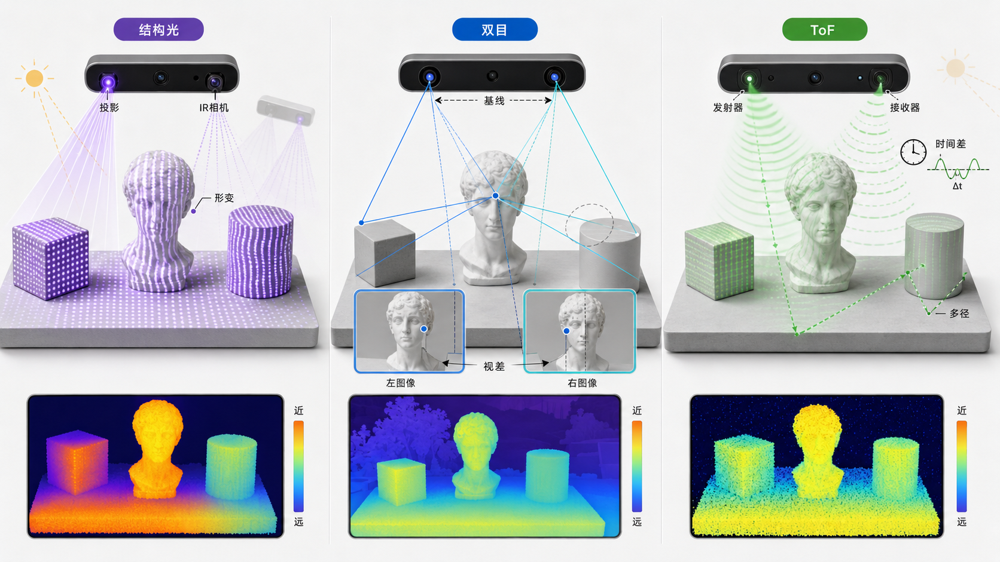
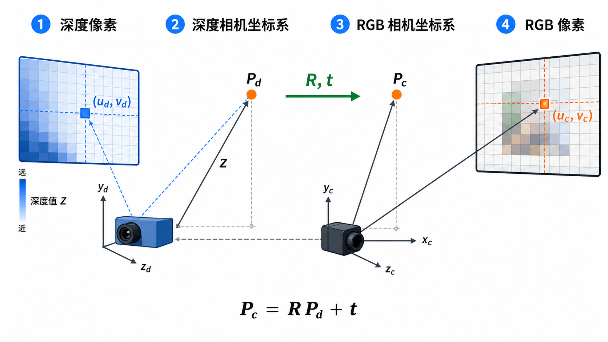
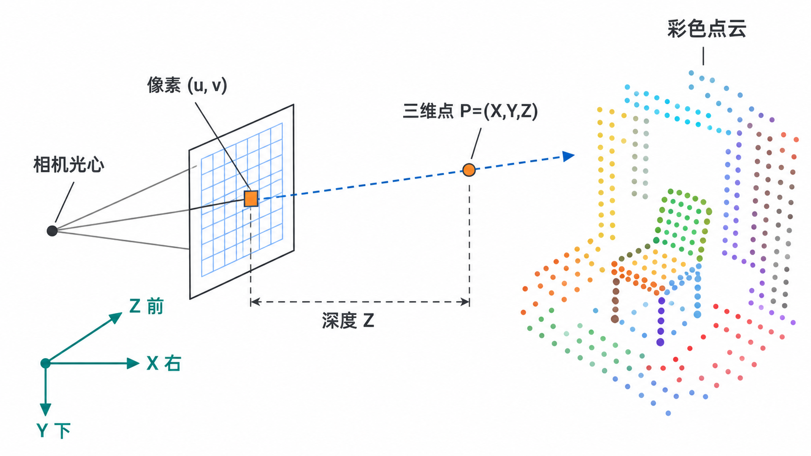
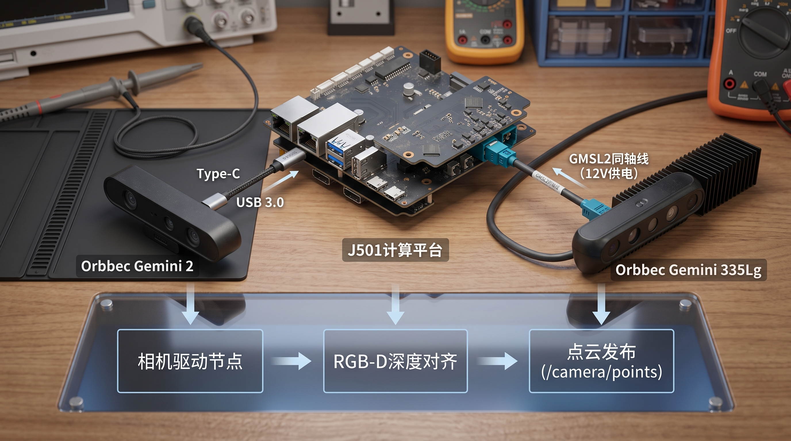
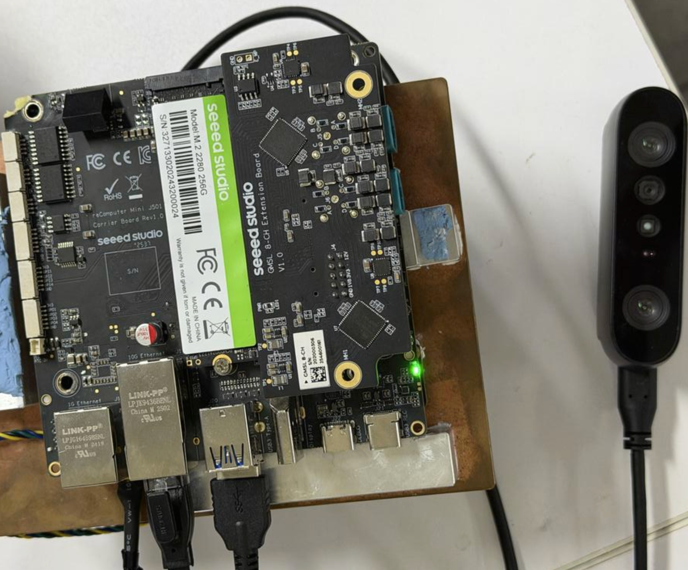
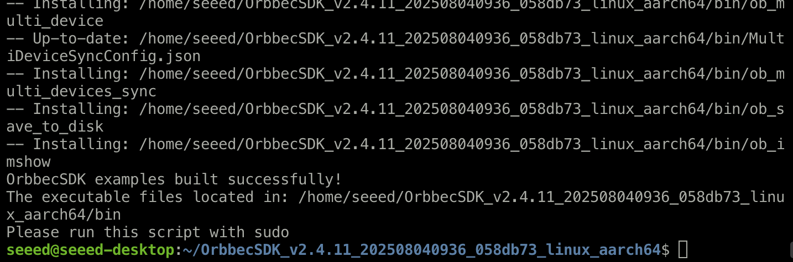
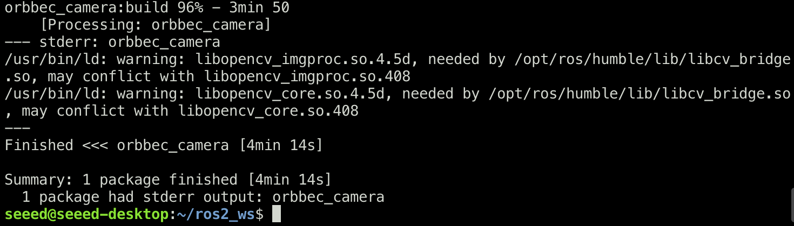
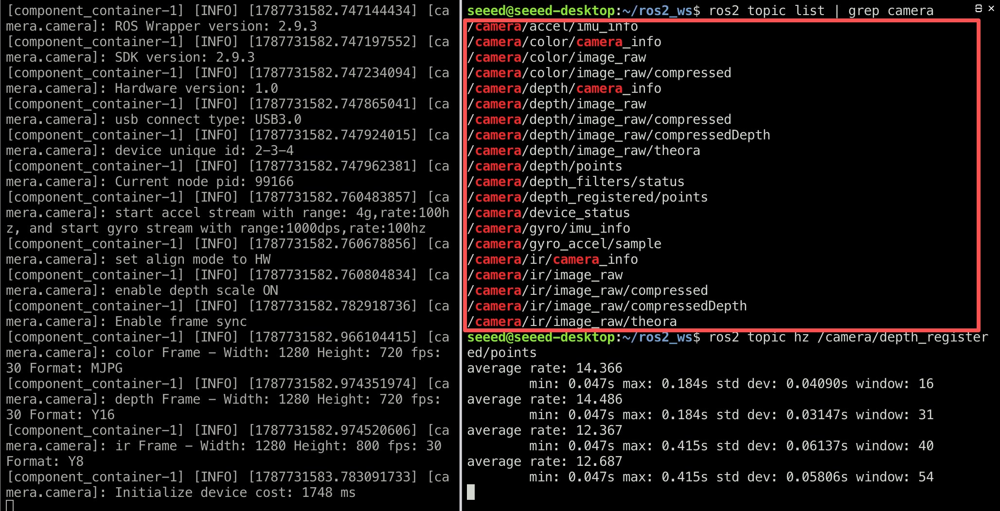
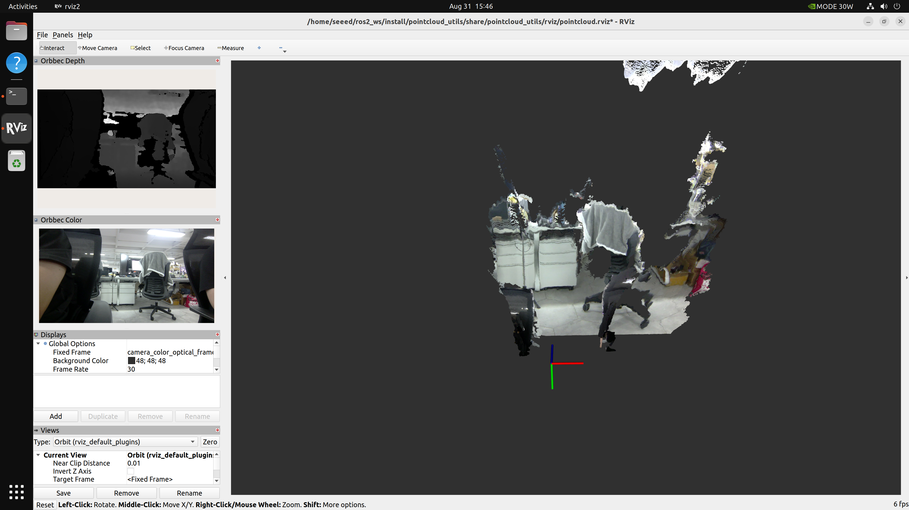
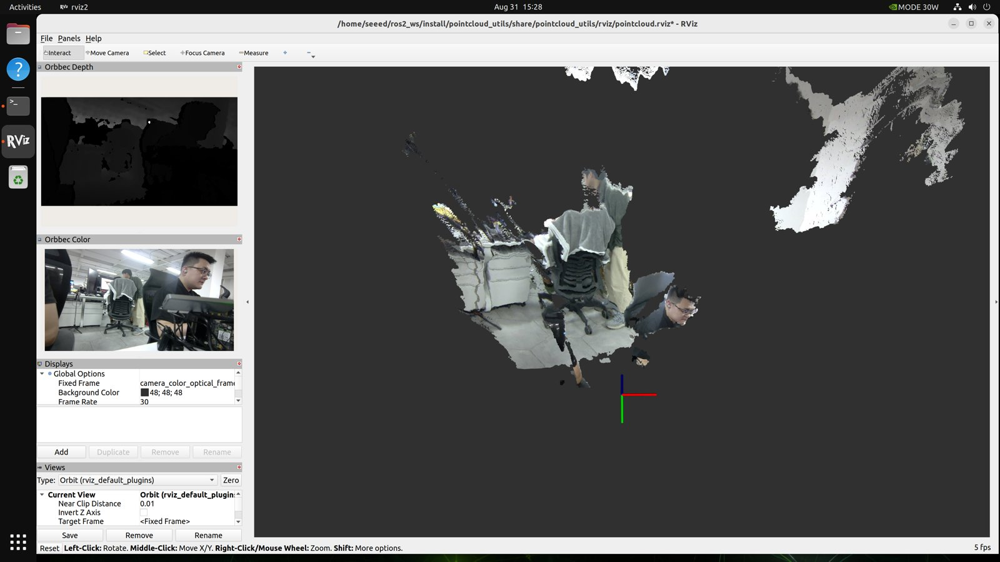

# 2.2 深度相机与 3D 视觉感知

#### 课程目标

完成本节后，你将能把一台深度相机变成可靠的三维感知输入：先判断不同深度技术适合什么场景，再启动官方 ROS2 驱动得到已对齐的 RGB-D 与彩色点云，理解深度像素如何经过坐标变换成为三维点，并能用 RViz2 验证结果。完成必做部分后，还可挑战手写同步点云节点、Open3D 可视化和深度滤波。

| 学习阶段 | 你要完成的事 | 可验证的结果 |
| --- | --- | --- |
| 接入 | 启动 Gemini 2 与官方 ROS2 驱动 | 能看到 RGB、深度、CameraInfo 话题 |
| 对齐 | 启用 depth-to-color registration | 深度边缘与彩色画面位置一致 |
| 点云 | 启用官方彩色点云并在 RViz2 检查 | 点云坐标系、颜色和形状正确 |
| 进阶 | 理解反投影、同步与滤波 | 能解释并改造自己的点云节点 |

#### 硬件清单

| <br><br>Orbbec Gemini 2 | <br><br>reComputer Robotics J5012 |
| --- | --- |

- 深度相机：Orbbec Gemini 2（USB3 接口，采用主动双目红外（Active Stereo IR）深度技术，集成 6 轴 IMU，支持 RGB-D 硬件同步与深度对齐）。
- 计算平台：J501 开发板（或等效 x86/ARM 计算平台，需满足 ROS2 Humble 及以上运行要求）。
- 配套线缆：USB3.0 数据线（用于连接 Gemini 2 与计算平台）。
官方资料：Gemini 2 产品规格；OrbbecSDK_ROS2 Wrapper v2 文档。驱动参数和话题会随版本变化，实操时以本机 ros2 topic list -t 和当前官方文档为准。

#### 前置基础

- ROS2 基础：熟悉节点、话题、消息类型与 ros2 launch 启动方式。
- 线性代数基础：齐次坐标、旋转矩阵与平移向量的复合变换。
---

#### 理论要点

##### 1. 深度感知技术原理对比

目前主流的消费级/工业级深度相机主要采用以下三种技术路线，各自在精度、测距范围、抗光照干扰、成本与功耗方面存在权衡。



| 技术路线 | 核心原理 | 优势 | 局限性 |
| --- | --- | --- | --- |
| 结构光<br>（Structured Light） | 投射已知编码的红外光斑/条纹图案，通过图案在物体表面的形变计算视差，进而三角化得到深度。 | 近距离精度高；对纹理缺失表面友好；功耗较低。 | 易受强光干扰；多设备同时使用时存在图案串扰；测距范围通常 ≤ 3m。 |
| 立体视觉<br>（Stereo Vision） | 利用左右两个红外/可见光相机模拟人眼双目视差，通过立体匹配算法（SGBM、BM 等）计算视差图，再由基线与焦距换算深度。 | 主动红外纹理能改善低纹理区域；测距范围较广。室内与半室外表现通常较好。 | 对无纹理区域匹配困难；计算复杂度高；精度随距离增大而下降。 |
| 飞行时间<br>（ToF, Time-of-Flight） | 向场景发射调制红外光，通过测量光脉冲往返的相位差或飞行时间直接计算每个像素的距离。 | 无需立体匹配；对纹理不敏感；可获得较高帧率并做成紧凑模组。深度图同样可能出现无效像素。 | 易受多路径反射（MPI）干扰；近距离精度一般；阳光直射下信噪比下降。 |

> 本节硬件对应：Orbbec Gemini 2 采用主动双目红外（Active Stereo IR）方案：两枚红外相机通过视差三角化得到深度，主动红外纹理可帮助低纹理表面匹配。它集成 6 轴 IMU，并支持 RGB-D 硬件同步与硬件 D2C 对齐；但强阳光、反光表面、遮挡和远距离仍会降低深度质量。

##### 2. 深度图与彩色图的外参对齐（Registration）

深度相机通常包含深度传感器（红外/ToF）与彩色传感器（RGB）两个独立成像单元，二者光心不重合，存在固定的外参（旋转 R 与平移 t）。直接叠加深度图与彩色图会出现像素错位，因此需要进行深度对齐（Depth Registration / Alignment）。

对齐目标：将深度图的每个像素映射到彩色相机坐标系下，使深度值与 RGB 像素一一对应，生成对齐后的 RGB-D 数据。

核心变换流程：

1. 对深度图中每个像素 (u_d, v_d)，结合深度值 Z 与深度相机内参 K_d，反投影得到深度相机坐标系下的三维点 P_d = (X_d, Y_d, Z_d)。
1. 通过深度→彩色的外参 (R_{d2c}, t_{d2c}) 将点变换到彩色相机坐标系：P_c = R_{d2c} · P_d + t_{d2c}。
1. 用彩色相机内参 K_c 将 P_c 投影到彩色图像平面，得到对应像素坐标 (u_c, v_c)。
1. 将深度值 Z_c = P_c.z 写入对齐深度图的 (u_c, v_c) 位置，未被填充的像素标记为无效（0 或 NaN）。


*图：深度对齐（D2C）的核心是先反投影到深度相机坐标系，再用外参变换到 RGB 相机坐标系，最后投影到 RGB 像素。*

> 注意：外参标定精度直接影响对齐质量。工厂标定的外参通常足够日常使用；若自行更换镜头或机械结构发生形变，需使用 Kalibr 或 MATLAB Stereo Camera Calibrator 重新标定。

##### 3. 点云生成：RGB-D → PointCloud2

点云（Point Cloud）是三维空间中离散点的集合，每个点至少包含三维坐标 (x, y, z)，可附加颜色、法向量、强度等属性。RGB-D 数据转点云的本质是深度图的逐像素反投影（Back-projection）。

反投影公式（针孔模型）：对于对齐后的深度图中像素 (u, v) 及其深度值 Z，相机内参为 K = [[f_x, 0, c_x], [0, f_y, c_y], [0, 0, 1]]，则三维坐标为：

X = (u - c_x) · Z / f_x
Y = (v - c_y) · Z / f_y
Z = Z（深度值，单位通常为米）



*图：对齐后的深度图中，每个有效像素结合内参和深度 Z 都能反投影为相机坐标系中的三维点；所有点合在一起就是彩色点云。*

ROS2 PointCloud2 消息结构要点：

- header.frame_id：点云所属坐标系，通常为相机光心坐标系（如 camera_color_optical_frame）。
- height / width：点云组织形式。有序点云（Organized）保留图像二维结构，height 为图像行数；无序点云 height=1。
- fields：字段描述，常见组合为 x, y, z（FLOAT32）+ rgb（FLOAT32，打包 RGB 字节）或 r, g, b（UINT8）。
- point_step / row_step：单个点与单行数据的字节步长，data 为原始字节数组。
常用工具库：

- PCL（Point Cloud Library）：C++ 点云处理事实标准，提供 pcl::PointCloud<pcl::PointXYZRGB> 与 ROS2 消息互转（pcl_conversions）。
- Open3D：Python/C++ 兼顾，API 友好，适合快速原型验证与可视化。
- depth_image_proc（ROS2 功能包）：无需手写代码，通过 launch 配置即可将深度图转为点云。
---

#### 实践内容

> Tips : 本次实验内容演示的计算平台：reComputer Mini J501 + Orbbec Gemini2 深度相机，软件系统为 JetPack 6.2.1 请检查自己的环境依赖是否对齐我们的演示版本，如不同配置过程可能会有所不同！



##### 任务 1：接入深度相机并发布 ROS2 PointCloud2 话题

目标：完成深度相机硬件连接，启动官方 ROS2 驱动，获取对齐后的 RGB-D 数据，并将其转换为 sensor_msgs/PointCloud2 话题发布。

步骤 A：硬件连接与驱动安装

Orbbec Gemini 2（USB3）



1. 使用 USB3.0 数据线将 Gemini 2 连接至 J501 的 USB3.0 端口（注意区分 USB2.0 与 USB3.0，USB2.0 带宽不足以同时传输深度+彩色流）。
1. 安装 Orbbec SDK v2（ARM64 架构），并配置 udev 规则：
*安装 Orbbec SDK v2*

```bash
wget https://github.com/orbbec/OrbbecSDK_v2/releases/download/v2.4.11/OrbbecSDK_v2.4.11_202508040936_058db73_linux_aarch64.zip && unzip OrbbecSDK_v2.4.11_202508040936_058db73_linux_aarch64.zip && cd OrbbecSDK_v2.4.11_202508040936_058db73_linux_aarch64/shared/ && sudo chmod +x ./install_udev_rules.sh && sudo ./install_udev_rules.sh && sudo udevadm control --reload-rules && sudo udevadm trigger && cd .. && ./build_examples.sh && ./setup.sh
```



从源码编译安装 Orbbec ROS2 驱动：

1. 克隆 OrbbecSDK_ROS2 仓库并安装依赖：
1. 安装 udev 规则，编译工作空间并验证设备识别：
*编译安装 Orbbec ROS2 驱动*

```bash
mkdir -p ~/ros2_ws/src && cd ~/ros2_ws/src && git clone https://github.com/orbbec/OrbbecSDK_ROS2.git && sudo apt install libgflags-dev nlohmann-json3-dev ros-$ROS_DISTRO-image-transport ros-${ROS_DISTRO}-image-transport-plugins ros-${ROS_DISTRO}-compressed-image-transport ros-$ROS_DISTRO-image-publisher ros-${ROS_DISTRO}-camera-info-manager ros-$ROS_DISTRO-diagnostic-updater ros-$ROS_DISTRO-diagnostic-msgs ros-$ROS_DISTRO-statistics-msgs ros-${ROS_DISTRO}-backward-ros libdw-dev && cd ~/ros2_ws/src/OrbbecSDK_ROS2/orbbec_camera/scripts && sudo bash install_udev_rules.sh && sudo udevadm control --reload-rules && sudo udevadm trigger && cd ~/ros2_ws/ && colcon build --packages-select orbbec_camera --cmake-args -DCMAKE_BUILD_TYPE=Release -DOpenCV_DIR=/usr/lib/cmake/opencv4 && source ./install/setup.bash && ls /dev/video*
```




步骤 B：启动相机驱动节点

启动 Gemini 2 相机节点，启用深度对齐与彩色点云发布：

*启动 Orbbec Gemini 2 相机节点（启用深度对齐与点云）*

```bash
ros2 launch orbbec_camera gemini2.launch.py \
  depth_registration:=true \
  enable_point_cloud:=true \
  enable_colored_point_cloud:=true
```

启动后可通过以下命令验证话题：

*查看相机发布的话题*

```bash
ros2 topic list | grep camera
# 检查彩色图、深度图与点云话题
ros2 topic hz /camera/depth_registered/points
ros2 topic info /camera/depth_registered/points
ros2 topic echo /camera/color/camera_info --once
```

> 提示：depth_registration:=true 会将深度图对齐到彩色相机坐标系，此时 /camera/depth_registered/points 话题发布的彩色点云每个点可直接与 RGB 像素对应。若关闭对齐，点云坐标基于深度相机坐标系，颜色需额外查找映射。



步骤 C（进阶）：克隆并一键启动手写点云 + RViz2

你将得到什么：仓库中的 pointcloud_utils 会同步 RGB 图、D2C 对齐后的深度图与彩色相机内参，实时发布 /camera/points，并直接打开内置 RViz2 布局。默认会展开 Orbbec Color / Orbbec Depth 面板，并按 0.2–8.0 m 有效深度范围生成更完整的彩色点云。

> 开始前的条件：先完成步骤 A、B，并确认官方 /camera/depth_registered/points 可以发布。手写节点不是相机驱动的替代品，而是把已对齐的 RGB-D 数据转换为你可修改的 PointCloud2；推荐用包内的一键脚本同时启动相机、手写节点和 RViz2。

步骤 C1：克隆代码并编译

*首次安装：克隆、安装依赖、编译*

```bash
mkdir -p ~/ros2_ws/src
cd ~/ros2_ws/src
git clone https://github.com/zibochen6/Mobile_Robot_Code.git pointcloud_utils
cd pointcloud_utils

# 若你拿到的是本课 validated 包，也可直接复制到 src：
# cp -r /path/to/validated/pointcloud_utils ~/ros2_ws/src/

sudo apt update
sudo apt install -y ros-$ROS_DISTRO-cv-bridge ros-$ROS_DISTRO-vision-opencv   ros-$ROS_DISTRO-sensor-msgs-py ros-$ROS_DISTRO-message-filters python3-numpy

cd ~/ros2_ws
source /opt/ros/$ROS_DISTRO/setup.bash
colcon build --packages-select pointcloud_utils
source install/setup.bash
```

> 若 ~/ros2_ws/src/pointcloud_utils 已存在，请不要再次 clone。进入该目录后执行 git pull --ff-only 更新，或直接覆盖为本课 validated 版本后再 colcon build --packages-select pointcloud_utils。

步骤 C2：一键启动相机、手写点云与 RViz2

*一键启动：Orbbec + 手写点云 + RViz2*

```bash
cd ~/ros2_ws
source /opt/ros/$ROS_DISTRO/setup.bash
source install/setup.bash

# 推荐：包内一键脚本
~/ros2_ws/install/pointcloud_utils/share/pointcloud_utils/scripts/start_orbbec_rviz.sh

# 等价 launch 写法：
# ros2 launch pointcloud_utils orbbec_rviz.launch.py
```

*默认参数说明*

```bash
# launch / 节点默认值：
# pixel_stride:=1
# min_depth_m:=0.2
# max_depth_m:=8.0
# sync_mode:=latest

# 若 Jetson CPU 压力过高，可单独把密度降下来：
# ros2 run pointcloud_utils rgbd_to_pointcloud --ros-args -p pixel_stride:=2
```

*验收输出*

```bash
ros2 topic hz /camera/points --window 30
ros2 topic echo /camera/points --once --field header.frame_id
ros2 topic echo /camera/points --once --field fields
```



成功标准：/camera/points 持续有频率输出；header 的 frame_id 是 camera_color_optical_frame；字段含 x、y、z 和 rgb。RViz2 打开后应直接看到：

- Orbbec Color / Orbbec Depth 两个 Image 面板默认展开，而不是缩成标题条；
- 中央 PointCloud2 订阅 /camera/points，Fixed Frame 为 camera_color_optical_frame，Color Transformer 为 RGB8；
- 点云覆盖近处到约 8 m 的有效深度，而不只是贴着相机的一小团。

##### 如何手写：只需理解两个关键片段

1. RGB 与深度必须成对。节点不是“收到一张图就算一次”。对 Gemini 2 的 D2C 流，默认用 sync_mode:=latest 做最新帧配对；只有在你确认时间戳稳定时，才切到 strict_stamp。

*最新帧配对 RGB 与 D2C 深度*

```python
self.depth_sub = self.create_subscription(
    Image, depth_topic, self.depth_callback, qos_profile_sensor_data)
self.color_sub = self.create_subscription(
    Image, color_topic, self.color_callback, qos_profile_sensor_data)

# Orbbec Gemini 2 的 RGB/Depth stamp 可能有固定偏移；
# 对已 D2C 对齐的流，默认用 sync_mode:=latest 做最新帧配对。
self.latest_depth = msg
self.latest_color = msg
self.maybe_publish()
```

2. 用内参把像素反投影为三维点。对于每个有效深度 Z，像素坐标 (u, v) 通过彩色相机内参得到 X=(u-cx)×Z/fx、Y=(v-cy)×Z/fy。节点会先检查 RGB、深度与 CameraInfo 的分辨率是否一致；不一致就停止发布，防止生成位置错误的点云。

*反投影并按有效深度范围打包 RGB*

```python
sampled_z = z[::stride, ::stride]
valid = (
    np.isfinite(sampled_z)
    & (sampled_z >= min_depth)
    & (sampled_z <= max_depth)
)
v, u = np.mgrid[0:z.shape[0]:stride, 0:z.shape[1]:stride]

points['x'] = (u[valid] - cx) * sampled_z[valid] / fx
points['y'] = (v[valid] - cy) * sampled_z[valid] / fy
points['z'] = sampled_z[valid]
points['rgb'] = (r << 16) | (g << 8) | b
```

可修改的起点：默认 pixel_stride:=1、min_depth_m:=0.2、max_depth_m:=8.0。若 CPU 吃紧，再把 pixel_stride 提到 2 或 4。若点云看起来只剩贴着相机的一小团，先检查深度图真实有效范围，而不是盲目开空洞填充。

##### Gemini 2 / Jetson AGX Orin 验证记录

验证环境：Jetson AGX Orin Developer Kit、JetPack 6.2.1、ROS 2 Humble；Gemini 2 USB ID 2bc5:0670；OrbbecSDK_ROS2 commit 8e7cad2（2026-08-07）。Wrapper 与 pointcloud_utils 均已从源码构建成功。

SDK 边界：本次源码版 Wrapper 自带并使用其安装目录中的 OrbbecSDK 2.9.3；已验证无需设置外部 SDK 的 LD_LIBRARY_PATH。保留前文 SDK 安装步骤用于原有环境配置，但同一终端不要额外 source 其他 SDK 环境脚本；udev 规则只执行当前 Wrapper 的安装脚本一次即可。

| 项目 | 实测结果 |
| --- | --- |
| D2C 输入 | /camera/depth/image_raw 与 /camera/color/image_raw 均为 1280×720；深度编码为 16UC1。 |
| 坐标系 | 彩色 CameraInfo、官方彩色点云和手写点云均使用 camera_color_optical_frame。 |
| 官方彩色点云 | /camera/depth_registered/points 约 20–23 Hz；其 rgb 是 FLOAT32 打包字段，offset 为 16。 |
| 手写点云 | /camera/points 默认 pixel_stride:=1、min_depth_m:=0.2、max_depth_m:=8.0、sync_mode:=latest；字段为 x/y/z/FLOAT32 与 rgb/UINT32，point_step 为 16。 |

为什么不能只看话题名？本机已经 D2C 对齐的深度仍叫 /camera/depth/image_raw，并没有 depth_registered/image_raw 话题。可复现的判断是：深度与 RGB 尺寸一致，并以彩色 CameraInfo 内参反投影；若检查失败，节点会停止发布而不是制造错误点云。

运行效果：下图来自一键启动后的 RViz2 布局：右侧默认展开 Color / Depth，中央显示手写彩色点云。配置已内置完整 QMainWindow State，避免 Image 面板启动后缩成标题条。Fixed Frame=camera_color_optical_frame，Color Transformer=RGB8。



*一键启动后的 RViz2：Color / Depth 默认展开，中央为手写彩色点云*

> 如果 Color / Depth 仍显示成标题条：包内 rviz/pointcloud.rviz 已写入完整 QMainWindow State。请重新 source 工作空间后，用 start_orbbec_rviz.sh 或 ros2 launch pointcloud_utils orbbec_rviz.launch.py 启动；不要只靠 Displays 勾选来恢复布局。

> 快速验证（不建包）：临时测试可直接 source /opt/ros/$ROS_DISTRO/setup.bash 后运行 python3 rgbd_to_pointcloud.py。正式验收请走包内一键脚本，这样会同时加载已修好布局的 pointcloud.rviz。

##### 任务 2：使用 Open3D 实时可视化点云流

进阶可选：RViz2 是本节的必做验证工具；只有需要在 Python 中继续做降采样、分割或融合时，才使用 Open3D。Open3D 是否可安装取决于 Python、Ubuntu 与 CPU 架构组合，安装失败不影响本节验收。

实现要点：

- 使用 open3d.geometry.PointCloud 存储点与颜色。
- 在 ROS2 回调中解析一帧完整点云，在可视化主线程中刷新几何体；不要假设 rgb 字段固定在某个字节偏移。
- 线程安全：ROS2 回调与可视化主线程需通过锁或 copy.deepcopy 隔离。
*open3d_pointcloud_viewer.py*

```python
import threading
import numpy as np
import open3d as o3d

import rclpy
from rclpy.node import Node
from rclpy.qos import qos_profile_sensor_data
from sensor_msgs.msg import PointCloud2
from sensor_msgs_py import point_cloud2

class PointCloudViewer(Node):
    def __init__(self):
        super().__init__('open3d_viewer')
        self.declare_parameter('pointcloud_topic', '/camera/depth_registered/points')
        topic = self.get_parameter('pointcloud_topic').value
        self.sub = self.create_subscription(PointCloud2, topic, self.pc_callback, qos_profile_sensor_data)
        self.lock = threading.Lock()
        self.latest_xyz = None
        self.latest_colors = None
        self.vis = o3d.visualization.Visualizer()
        self.vis.create_window(window_name='RGB-D PointCloud', width=960, height=720)
        self.geometry = o3d.geometry.PointCloud()
        self.vis.add_geometry(self.geometry)

    def pc_callback(self, msg):
        names = {field.name for field in msg.fields}
        if not {'x', 'y', 'z'} <= names:
            self.get_logger().error('点云缺少 x/y/z 字段', throttle_duration_sec=2.0)
            return
        # Humble 返回 structured ndarray；由官方工具按 fields/offset/point_step 解析。
        data = point_cloud2.read_points(msg, skip_nans=True)
        if data.size == 0:
            return
        xyz = np.column_stack((data['x'], data['y'], data['z'])).astype(np.float64)
        valid = np.isfinite(xyz).all(axis=1) & (xyz[:, 2] > 0)
        xyz = xyz[valid]
        if xyz.size == 0:
            return

        colors = None
        if 'rgb' in names:
            raw = np.asarray(data['rgb'][valid])
            packed = raw.view(np.uint32) if np.issubdtype(raw.dtype, np.floating) else raw.astype(np.uint32)
            colors = np.column_stack(((packed >> 16) & 255, (packed >> 8) & 255, packed & 255)) / 255.0
        elif {'r', 'g', 'b'} <= names:
            colors = np.column_stack((data['r'][valid], data['g'][valid], data['b'][valid])) / 255.0

        with self.lock:
            self.latest_xyz = xyz
            self.latest_colors = colors

    def run(self):
        while rclpy.ok():
            rclpy.spin_once(self, timeout_sec=0.01)
            with self.lock:
                if self.latest_xyz is not None:
                    self.geometry.points = o3d.utility.Vector3dVector(self.latest_xyz)
                    if self.latest_colors is not None:
                        self.geometry.colors = o3d.utility.Vector3dVector(self.latest_colors)
                    self.vis.update_geometry(self.geometry)
            self.vis.poll_events()
            self.vis.update_renderer()
        self.vis.destroy_window()

def main(args=None):
    rclpy.init(args=args)
    viewer = PointCloudViewer()
    try:
        viewer.run()
    finally:
        viewer.destroy_node()
        rclpy.shutdown()

if __name__ == '__main__':
    main()
```

文件放置与运行方法：

将代码保存为 open3d_pointcloud_viewer.py，可放入上述同一个功能包的 scripts/ 目录，也可作为独立脚本直接运行。

若放入功能包，需在 setup.py 中额外注册入口点：

*setup.py 追加入口点*

```python
entry_points={
    "console_scripts": [
        "rgbd_to_pointcloud = pointcloud_utils.scripts.rgbd_to_pointcloud:main",
        "open3d_viewer = pointcloud_utils.scripts.open3d_pointcloud_viewer:main",
    ],
},
```

安装依赖并运行：

*Open3D：仅在当前平台存在可用 ARM64 wheel 时执行*

```bash
# 先创建隔离环境；--system-site-packages 让它复用 ROS 2 Python 包。
sudo apt install -y python3-venv
cd ~/ros2_ws
python3 -m venv --system-site-packages .venv-open3d
source .venv-open3d/bin/activate
python -m pip install --only-binary=:all: open3d
python -c "import open3d as o3d; print(o3d.__version__)"

# 只有上一条成功后才运行；需要图形桌面、显示器或 X11 转发。
python ~/ros2_ws/src/pointcloud_utils/pointcloud_utils/scripts/open3d_pointcloud_viewer.py \\
  --ros-args -p pointcloud_topic:=/camera/depth_registered/points
```

Jetson 实测结论：PyPI 的 Open3D 0.19.0 提供 Linux x86_64 wheel，但未提供 Linux ARM64 wheel；本机请求 PyPI 亦出现 TLS EOF。因此不要把此命令作为必做主线，也不要在 Jetson 上无提示地从源码编译 Open3D。安装失败时，使用本节已经验证的 RViz2 配置或实时 PointCloud2 渲染图完成验收。

运行前确保点云话题已在发布：

*检查点云话题*

```bash
ros2 topic list | grep points

# 官方彩色点云：/camera/depth_registered/points
# 手写节点输出：/camera/points
# Open3D 默认订阅官方点云；切换为手写点云时无需改代码：
python open3d_pointcloud_viewer.py --ros-args \\
  -p pointcloud_topic:=/camera/points
```

> 注意：Open3D 可视化窗口需要图形界面支持。在 J501 等无头设备上运行时，请通过 ssh -X user@设备IP（X11 转发）或连接显示器 / VNC 后再启动脚本，否则会报显示相关错误。

> 替代方案：若仅需快速验证点云质量，可直接使用 RViz2（见任务 1 产出物）。Open3D 可视化的优势在于可在同一窗口中叠加点云处理结果（如降采样、平面分割、聚类），便于算法调试。

##### 任务 3：深度图滤波与空洞填充

> 先确定用途，再选滤波：障碍物规避和可视化可以追求连续、平滑；测量、抓取和建图应始终保留原始深度与有效像素掩码。任何空洞填充都是估计值，不能把它当作真实测量值。

目标：理解原始深度图中噪声与空洞的成因，掌握双边滤波（Bilateral Filter）与时间滤波（Temporal Filter）的原理与实现，输出更平滑、更完整的深度图。

问题背景：原始深度图普遍存在以下问题：

- 噪声（Noise）：深度值的随机抖动，尤其在低纹理或远距离区域明显。
- 空洞（Holes / Missing Data）：深度值为 0 或 NaN 的像素，成因包括红外吸收（黑色物体）、镜面反射、超出测距范围、立体匹配失败（遮挡区域）。
- 飞点（Flying Pixels）：物体边缘处深度值跳变产生的孤立噪点。
方法一：双边滤波（Bilateral Filter）—— 空间域去噪保边

双边滤波同时考虑空间邻近度（高斯空间核）与像素值相似度（高斯值域核），在平滑平坦区域噪声的同时保留物体边缘。Open3D 与 OpenCV 均提供实现。

*深度图双边滤波示例*

```python
import cv2
import numpy as np

def bilateral_filter_depth(depth_uint16, d=9, sigma_color=50, sigma_space=50):
    """
    对 uint16 深度图执行双边滤波。
    输入先转换为 float32；sigma 参数必须与深度单位和量级匹配。
    """
    # 转换为 float32 以获得更稳定的滤波效果
    depth_f = depth_uint16.astype(np.float32)
    # 仅对有效深度区域滤波，无效区域保持 0
    mask = depth_uint16 > 0
    filtered = cv2.bilateralFilter(depth_f, d, sigma_color, sigma_space)
    result = np.where(mask, filtered, 0).astype(np.uint16)
    return result

# 使用示例
# depth_raw = cv2.imread('depth_raw.png', cv2.IMREAD_UNCHANGED)
# depth_filtered = bilateral_filter_depth(depth_raw, d=9, sigma_color=80, sigma_space=80)
```

代码边界：上例会先恢复无效像素为 0，但双边滤波本身不了解“0 是无效值”。因此它适合没有明显空洞的局部可视化平滑；空洞较多时应优先使用相机端空间滤波或显式的掩码感知算法，并与原始深度一起保存。

方法二：时间滤波（Temporal Filter）—— 时序平滑抑制抖动

时间滤波利用相邻帧之间的深度一致性，对同一像素在时间维度上做指数加权平均（EMA）或中值滤波，有效抑制深度值的帧间抖动，尤其适合静态或缓慢移动场景。

*深度图时间滤波（指数移动平均 EMA）*

```python
import numpy as np

class TemporalFilter:
    def __init__(self, alpha=0.3, max_diff=50):
        """
        alpha: 平滑系数，越小越平滑但延迟越大（0~1）。
        max_diff: 单帧深度变化阈值（mm），超过则认为是运动物体，不参与平滑。
        """
        self.alpha = alpha
        self.max_diff = max_diff
        self.accumulated = None

    def apply(self, depth_uint16):
        if self.accumulated is None:
            self.accumulated = depth_uint16.astype(np.float32).copy()
            return depth_uint16.copy()

        current = depth_uint16.astype(np.float32)
        valid = depth_uint16 > 0
        # 计算与历史值的差异
        diff = np.abs(current - self.accumulated)
        # 仅对变化在阈值内的像素做 EMA（避免运动模糊）
        stable = valid & (diff < self.max_diff)
        self.accumulated[stable] = (
            self.alpha * current[stable] +
            (1 - self.alpha) * self.accumulated[stable]
        )
        # 新出现的有效像素直接赋值
        new_valid = valid & ~stable
        self.accumulated[new_valid] = current[new_valid]
        # 无效像素保持历史值（简单空洞填充）
        result = self.accumulated.copy()
        result[~valid] = self.accumulated[~valid]  # 保留历史填充
        return result.astype(np.uint16)

# 使用示例
# temporal_filter = TemporalFilter(alpha=0.3, max_diff=50)
# for frame in depth_stream:
#     smoothed = temporal_filter.apply(frame)
```

动态场景限制：时间滤波会带来延迟；把历史深度拿来填补当前无效像素还可能留下“残影”。移动物体、抓取和快速避障场景应缩短历史窗口，或直接使用当前帧的有效掩码。

方法三：空洞填充（Hole Filling）

对于深度图中的无效像素（0 / NaN），可采用以下策略填充：

- 最近邻插值（Inpainting）：可将归一化后的可视化图像交给 cv2.inpaint() 做展示；不要直接把其输出当作保真深度测量。
- 形态学闭运算（Morphological Closing）：先膨胀后腐蚀，填补小空洞并平滑边缘。
- 多帧累积填充：结合时间滤波，用历史帧中该位置的有效深度填充当前空洞。
*仅用于可视化的小空洞填充：保留测量掩码*

```python
import cv2
import numpy as np

def fill_small_holes_for_visualization(depth_uint16, max_hole_area=9):
    """仅填补很小的 0 深度连通域，返回填充结果和原始有效掩码。
    不要将 filled 用于尺寸测量、抓取位姿或高精度建图。
    """
    valid_mask = depth_uint16 > 0
    holes = (~valid_mask).astype(np.uint8)
    count, labels, stats, _ = cv2.connectedComponentsWithStats(holes, connectivity=8)
    dilated = cv2.dilate(depth_uint16, np.ones((3, 3), np.uint8))
    filled = depth_uint16.copy()

    for label in range(1, count):
        area = stats[label, cv2.CC_STAT_AREA]
        if area <= max_hole_area:
            filled[labels == label] = dilated[labels == label]
    return filled, valid_mask

# depth_visual, original_valid_mask = fill_small_holes_for_visualization(depth_raw)
```

> 注意：空洞填充会引入估计值，在对精度要求高的应用（如三维重建、机械臂抓取）中应谨慎使用。建议保留原始深度图与填充后深度图两份数据，分别用于不同下游模块。

---

#### 产出物

完成本节实践后，需提交以下产出物：

1. 官方彩色点云验证（必做）：提交 Gemini 2 启动参数、实际点云话题名、RViz2 截图，以及点云 frame_id 与 CameraInfo 的检查结果。进阶产出建议附上 start_orbbec_rviz.sh / orbbec_rviz.launch.py 的启动命令，以及 Color / Depth 面板已展开、点云覆盖约 0.2–8.0 m 的截图。
1. RViz2 可视化配置文件：.rviz 配置，包含 Fixed Frame 设置（以点云 header.frame_id 的实际值为准）、PointCloud2 显示插件（订阅点云话题、Color Transformer 设为 RGB8）、Grid 与 TF 轴显示，保存为可直接 rviz2 -d config.rviz 加载的文件。
1. 深度滤波实验报告：对比原始深度图、双边滤波后、时间滤波后、空洞填充后四组结果的可视化截图（深度图伪彩色 + 对应点云截图），并简要说明各滤波参数对结果的影响。
---

#### 思考题与拓展

1. 为什么结构光/主动立体视觉相机在阳光下深度质量会下降？可以从红外投射器功率与环境红外噪声的角度分析。
1. 若将点云的 frame_id 从 camera_color_optical_frame 改为 base_link，需要哪些 TF 变换？请画出 TF 树。
1. 双边滤波的 sigma_color 与 sigma_space 分别增大时，对深度图的平滑效果和边缘保留有何影响？
1. 尝试使用 PCL 的 VoxelGrid 对点云进行降采样，对比降采样前后的点云数量与可视化效果。
1. 拓展阅读：了解 NVIDIA Isaac ROS 中的 nvblox 或 Open3D 的 TSDFVolume，思考如何将单帧 RGB-D 点云融合为全局三维重建地图。

