# 2.3 Camera Calibration: From Intrinsics and Extrinsics to Stereo Calibration

## Course Overview

A camera records images but does not inherently know where a pixel lies in the real world. Calibration gives it a geometric ruler and orientation reference so that undistortion, SLAM, stereo ranging, 3D reconstruction, and robotic grasping share the same reliable model. This lesson turns abstract parameters into a `camera_info` configuration that ROS 2 nodes can load and validate.

### What You Will Accomplish

| Stage | What you will understand | Verifiable outcome |
| --- | --- | --- |
| Understand | Pixel-to-space geometry and the roles of intrinsics and extrinsics | Interpret calibration results instead of treating them as a black box |
| Capture | Why the target must cover multiple positions, distances, and angles | Collect sufficiently diverse observations |
| Validate | What reprojection error and epipolar alignment mean | Decide whether a calibration file is usable |

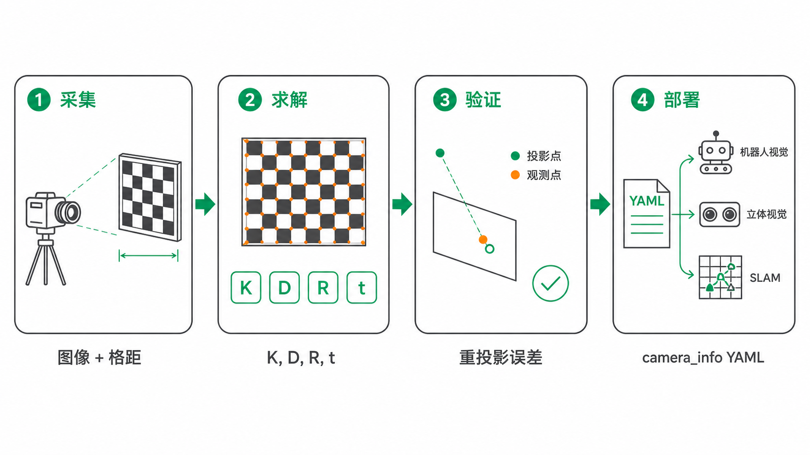

### Learning Outcomes

- Understand pinhole and distortion models and estimate \(K\) and \((k_1,k_2,p_1,p_2,k_3)\).
- Understand extrinsic rotation \(R\) and translation \(t\).
- Complete monocular and stereo calibration and produce usable `camera_info` YAML.
- Evaluate quality through reprojection error and reject poor observations.
- Understand Eye-in-hand and Eye-to-hand calibration in preparation for M9.

### Hardware and Software

| Category | Description |
| --- | --- |
| Compute | J501, or equivalent x86/ARM host with Ubuntu 20.04/22.04 |
| Cameras | One camera for monocular calibration or two synchronized cameras for stereo; GMSL, USB, or MIPI |
| Target | Chessboard or ChArUco board sized for the working distance; this course uses a 9×7 A4 board with accurately known square size |
| Tools | ROS `camera_calibration`, or Kalibr for multi-camera and camera–IMU calibration |
| Accessories | Ruler, tripod or rigid fixture, and uniform lighting |

### Prerequisites

- A stable camera stream through ROS topics or an SDK.
- Basic matrix multiplication, homogeneous coordinates, rotation, and translation.
- Familiarity with `sensor_msgs/Image` and `sensor_msgs/CameraInfo`.

> Lock focus or disable autofocus before capture; otherwise intrinsics change. Clean the lens and keep the target flat. Adjust exposure and white balance for sharp corners without saturation or glare.

## How a Camera Turns the World into Pixels

Calibration answers three questions: how light becomes a pixel, how much the lens bends geometry, and where the camera is relative to another frame.

### Pinhole Model and Extrinsics

For a world point:

\[
P_w=\begin{bmatrix}X_w\\Y_w\\Z_w\end{bmatrix}
\]

Extrinsics transform it into the camera frame:

\[
P_c=RP_w+t
\]

\(R\) is the orientation difference and \(t\) the displacement between origins. Always state the reference frame. Monocular calibration estimates a temporary board pose per image; stereo calibration estimates the fixed relative pose between cameras.

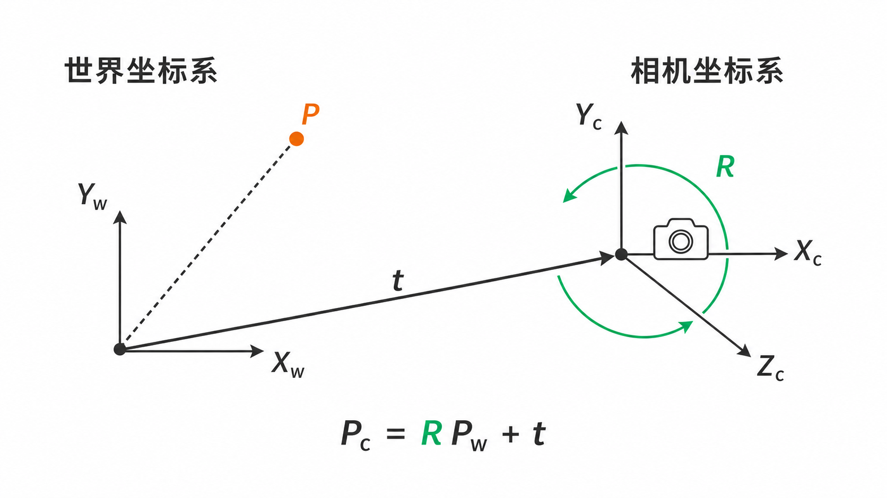

The optical center is \(O_c=(0,0,0)\). In the OpenCV camera convention, \(X_c\) points right, \(Y_c\) down, and \(Z_c\) forward. For \(P_c=(X_c,Y_c,Z_c)\):

\[
x=\frac{X_c}{Z_c},\qquad y=\frac{Y_c}{Z_c}
\]

These are normalized, not pixel, coordinates.

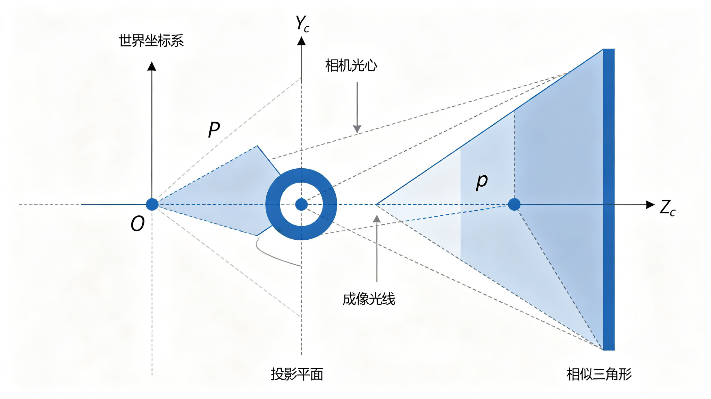

### Intrinsics and Pixel Coordinates

\[
K=\begin{bmatrix}f_x&0&c_x\\0&f_y&c_y\\0&0&1\end{bmatrix}
\]

Here \(f_x,f_y\) are focal lengths in pixels and \((c_x,c_y)\) is the principal point.

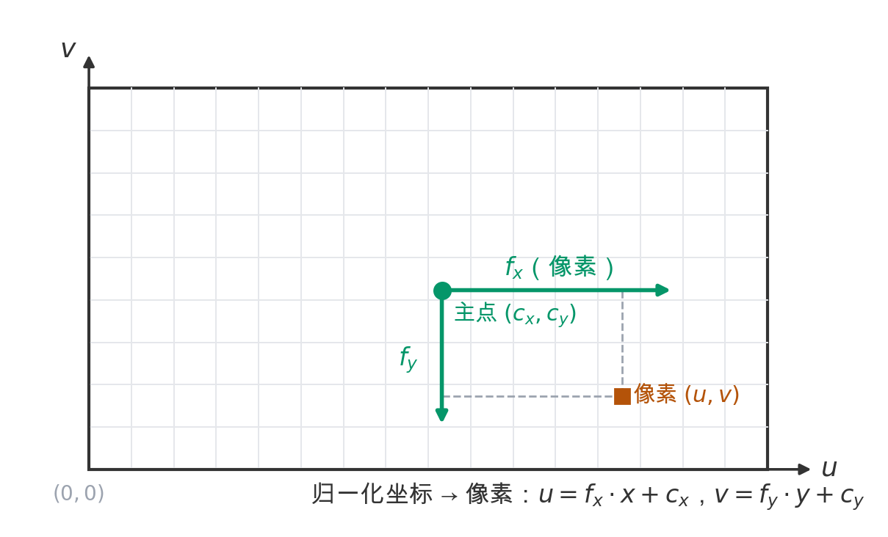

\[
u=f_xx+c_x,\qquad v=f_yy+c_y
\]

\[
\begin{bmatrix}u\\v\\1\end{bmatrix}
=\frac{1}{Z_c}K\begin{bmatrix}X_c\\Y_c\\Z_c\end{bmatrix}
\]

The lens focal length \(f\) is in millimeters; calibrated \(f_x,f_y\) are in pixels. For pixel pitches \(s_x,s_y\), \(f_x=f/s_x\) and \(f_y=f/s_y\).

### Lens Distortion

Distortion acts on normalized coordinates. Let \(r^2=x^2+y^2\). Brown–Conrady radial distortion is:

\[
x_r=x(1+k_1r^2+k_2r^4+k_3r^6),\quad
y_r=y(1+k_1r^2+k_2r^4+k_3r^6)
\]

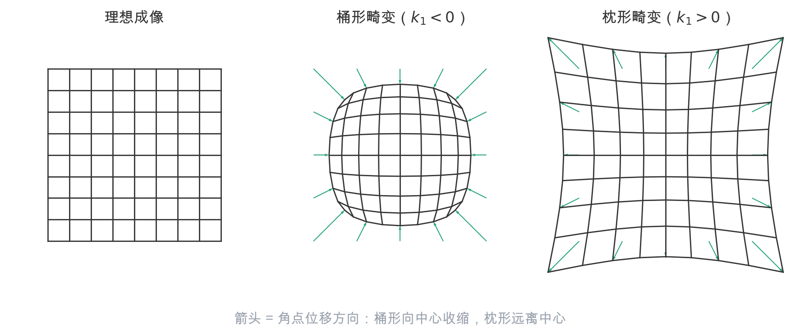

Tangential distortion caused by lens/sensor misalignment is:

\[
x_t=2p_1xy+p_2(r^2+2x^2)
\]

\[
y_t=p_1(r^2+2y^2)+2p_2xy
\]

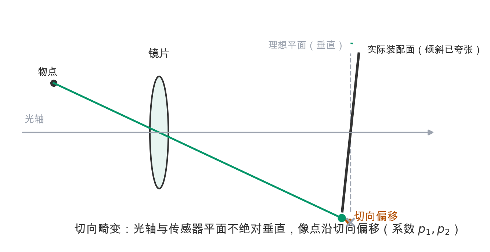

Combined:

\[
x_d=x(1+k_1r^2+k_2r^4+k_3r^6)+2p_1xy+p_2(r^2+2x^2)
\]

\[
y_d=y(1+k_1r^2+k_2r^4+k_3r^6)+p_1(r^2+2y^2)+2p_2xy
\]

Then \(u=f_xx_d+c_x\) and \(v=f_yy_d+c_y\). The complete chain is:

\[
P_w\xrightarrow{R,t}P_c\xrightarrow{\div Z_c}(x,y)
\xrightarrow{\text{distortion}}(x_d,y_d)\xrightarrow{K}(u,v)
\]

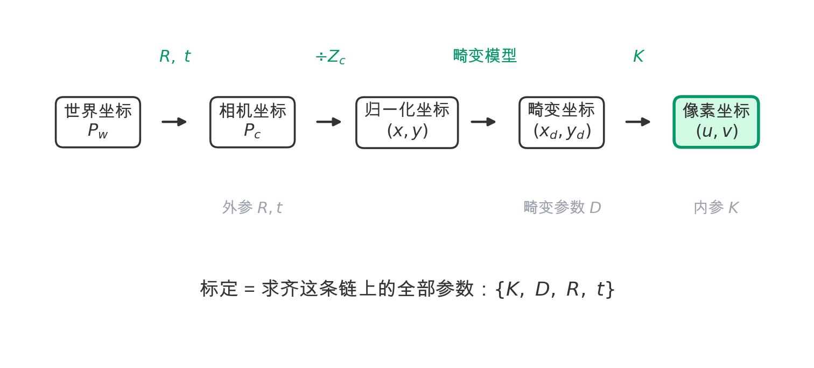

### What Does Calibration Estimate?

Calibration fits predicted corner pixels to detected corners whose target coordinates are known:

- **Intrinsics:** \(K\), describing focal lengths and principal point.
- **Distortion:** \(D=(k_1,k_2,p_1,p_2,k_3,\ldots)\).
- **Extrinsics:** \(R,t\), describing camera pose relative to a stated frame.

\(K,D\) explain how a camera sees; \(R,t\) explain where it is and where it points. AVM, BEV, and camera stitching need both. Use dedicated fisheye models such as OpenCV Fisheye or Kannala–Brandt for ultra-wide lenses instead of continually adding radial terms.

### Hand–Eye Calibration Fundamentals

| Dimension | Eye-in-hand | Eye-to-hand |
| --- | --- | --- |
| Mount | Camera moves with the end effector | Camera is fixed outside the workspace |
| Goal | Estimate \(T_{cam\to tool}\) | Estimate \(T_{cam\to base}\) |
| View | Close and movable; motion-blur risk | Fixed global view; resolution depends on distance |
| Typical equation | \(AX=XB\) | \(AX=ZB\) |

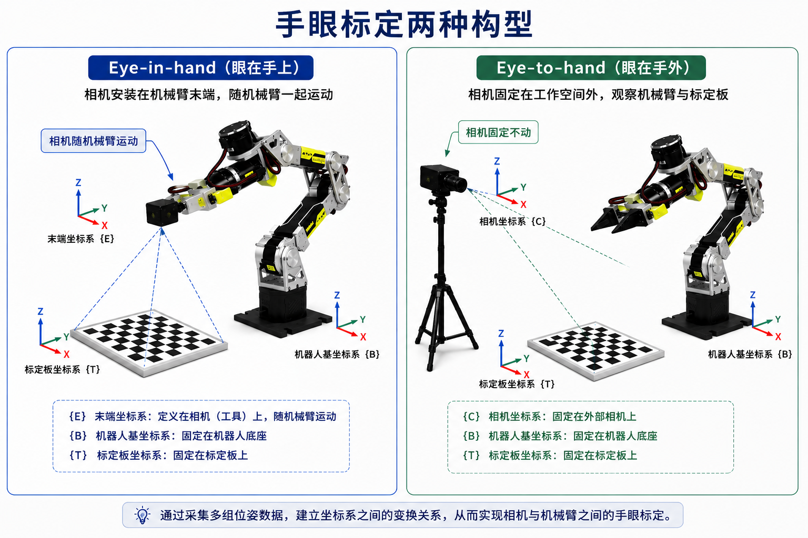

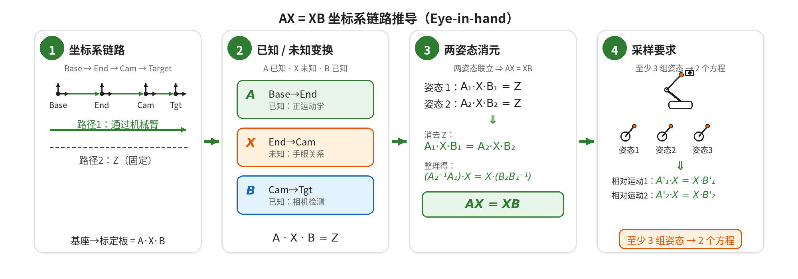

Coordinate and transform conventions differ between references. Never apply \(AX=XB\) or \(AX=ZB\) without explicit frame definitions. M9 covers the full solution.

### Stereo Calibration and Rectification

Stereo calibration estimates inter-camera \(R,t\). Rectification reprojects both image planes so corresponding epipolar lines become horizontal:

1. Calibrate both cameras' intrinsics and distortion.
1. Estimate \(R,t\) from synchronized target pairs.
1. Construct \(R_1,R_2\) to make the planes coplanar and row-aligned.
1. Generate real-time remap tables.

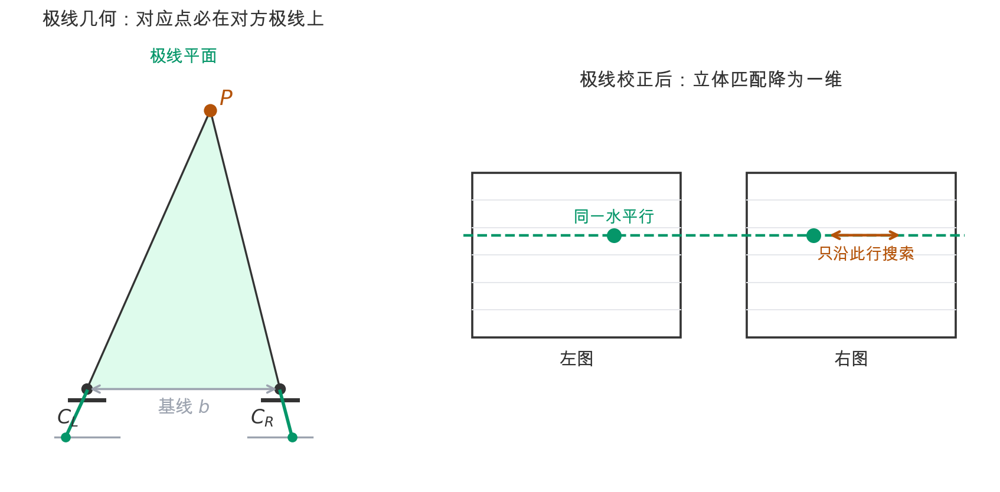

## Hands-On Calibration

### Four Checks Before Starting

| Check | Why | Pass criterion |
| --- | --- | --- |
| Stable images | Blur and dropped frames corrupt corners | Continuous topic and sharp target edges |
| Fixed lens | Autofocus changes focal length | Lock focus; preferably stabilize exposure and white balance |
| Accurate target | Wrong square size corrupts scale | Measure one square in meters |
| Stereo sync | Both cameras must see the same pose | Prefer hardware sync; otherwise constrain timestamp tolerance |

> This exercise uses ROS 2. Complete Section 1.4 first if needed.

### Setup and Capture

**1. Install packages**

```bash
sudo apt install ros-humble-camera-calibration
sudo apt install ros-${ROS_DISTRO}-v4l2-camera
```

**2. Start the camera**

```bash
ros2 run v4l2_camera v4l2_camera_node --ros-args \
    -r __node:=gmsl_cam0 \
    -r __ns:=/gmsl/cam0 \
    -p video_device:=/dev/video0 \
    -p image_size:="[1920,1536]" \
    -p pixel_format:=YUYV \
    -p output_encoding:=rgb8 \
    -p camera_frame_id:=gmsl_cam0_optical_frame \
    -p camera_info_url:=file:///home/seeed/.ros/camera_info/gmsl_cam0.yaml
```

Verify the driver's actual parameters with `ros2 param list /gmsl/cam0`.

```bash
ros2 topic list -t
ros2 topic hz /gmsl/cam0/image_raw
```

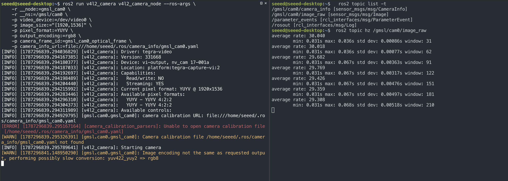

**3. Prepare the board and start monocular calibration**

A 9×7-square board contains 8×6 inner corners. Measure the square size and disable print scaling.

```bash
ros2 run camera_calibration cameracalibrator \
  --no-service-check \
  --size 8x6 --square 0.020 \
  --ros-args -r image:=/gmsl/cam0/image_raw
```

> `--size 8x6` means inner corners.
>
> 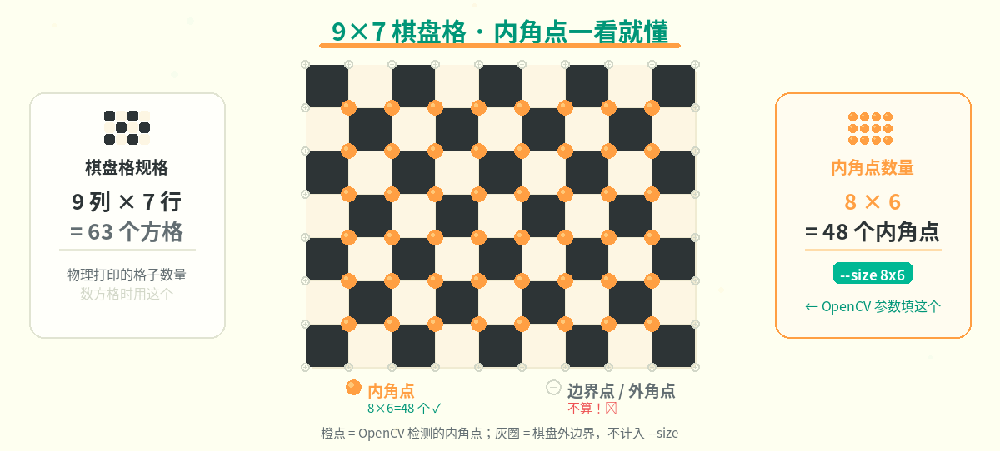
>
> `--square 0.020` is meters. `--no-service-check` supports drivers without `SetCameraInfo`. Use SAVE after solving; use COMMIT only when that service exists.

**4. Capture observations**

- Capture 20–40 monocular images or 30–50 synchronized stereo pairs.
- Keep the board between one-third and two-thirds of the image.
- Cover center, corners, edges, multiple distances, 30°–45° tilt, and in-plane rotation.
- Avoid blur and glare.

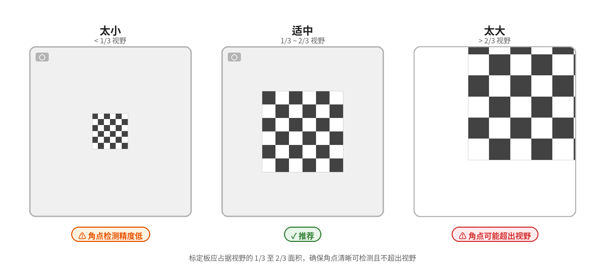

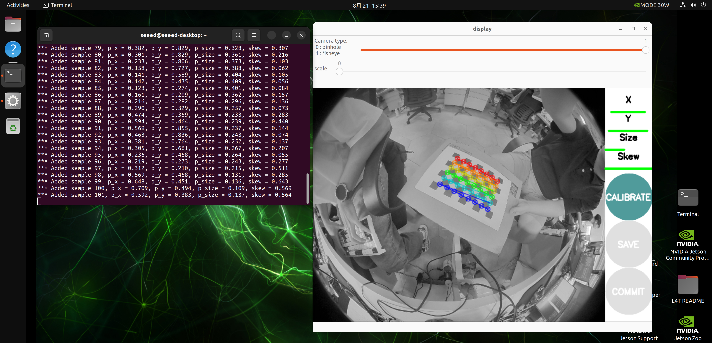

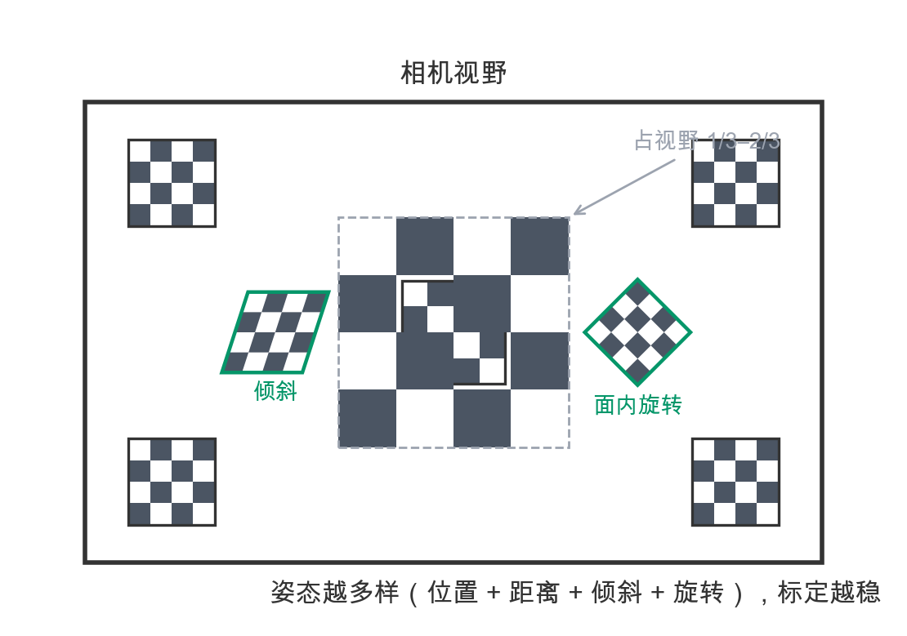

Capture when X/Y/Size/Skew indicators are green. Click CALIBRATE, inspect results, then SAVE. Extract `/tmp/calibrationdata.tar.gz`: monocular output contains `ost.yaml`; stereo output contains `left.yaml` and `right.yaml`. Copy them to the configured `camera_info_url` and restart the driver.

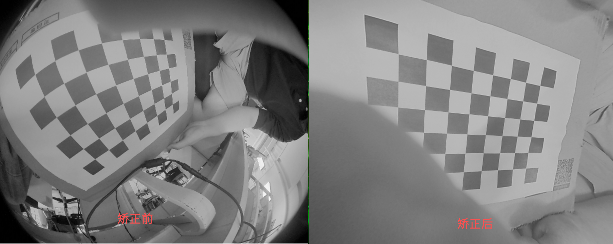

### Advanced: Kalibr

Kalibr is useful for multi-camera and camera–IMU calibration because it solves richer sensor and timing models together; it is not automatically more accurate. It is a ROS 1 tool without an apt package and reads ROS 1 bags. Convert ROS 2 bags with `rosbags` as described in Kalibr's documentation.

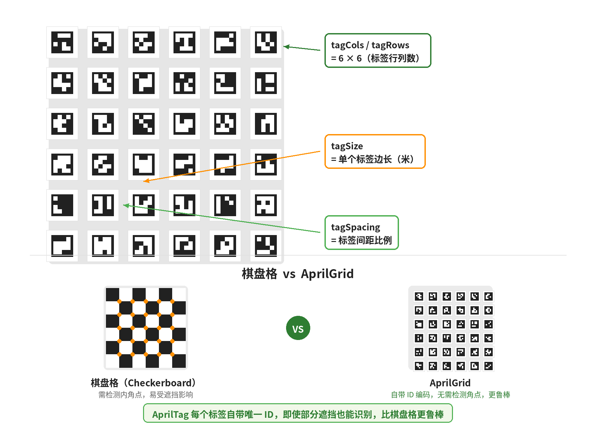

```yaml
target_type: 'aprilgrid'
tagCols: 6
tagRows: 6
tagSize: 0.088
tagSpacing: 0.3
```

```bash
kalibr_calibrate_cameras \
  --target aprilgrid.yaml \
  --bag calibration.bag \
  --models pinhole-radtan \
  --topics /camera/image_raw
```

Kalibr outputs `camchain-*.yaml`, a PDF, and a summary, not a drop-in `camera_info` file. Map its parameters as required. Use `pinhole-radtan` for radial/tangential distortion or `pinhole-equi` for equidistant fisheye.

### Stereo Calibration

```bash
ros2 run camera_calibration cameracalibrator \
  --size 8x6 \
  --square 0.020 \
  --no-service-check \
  --ros-args -r left:=/stereo/left/image_raw \
  -r right:=/stereo/right/image_raw
```

Prefer hardware synchronization. If only software sync is possible, inspect timestamp differences and begin with a small tolerance such as `--approximate=0.01`; 100 ms is too large for a moving board. Output includes both cameras' intrinsics/distortion, \(R,T\), and \(R_1/R_2,P_1/P_2\).

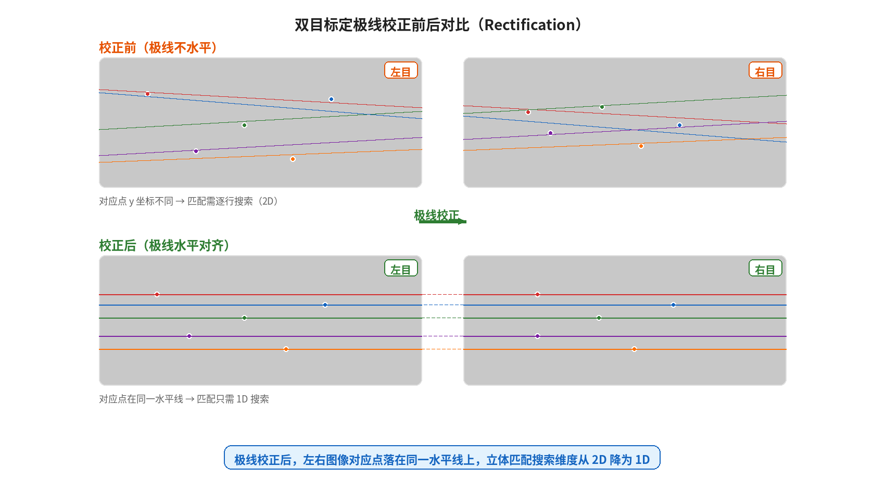

### Reprojection Error

\[
e_{rms}=\sqrt{\frac{1}{N}\sum_{i=1}^{N}\|\hat p_i-p_i\|^2}
\]

| RMS pixels | Rating | Use |
| --- | --- | --- |
| < 0.5 | Excellent | Precision measurement and 3D reconstruction |
| 0.5–1.0 | Good | Most SLAM and detection |
| 1.0–2.0 | Acceptable | Lower-accuracy work; improve capture if possible |
| > 2.0 | Unacceptable | Recalibrate |

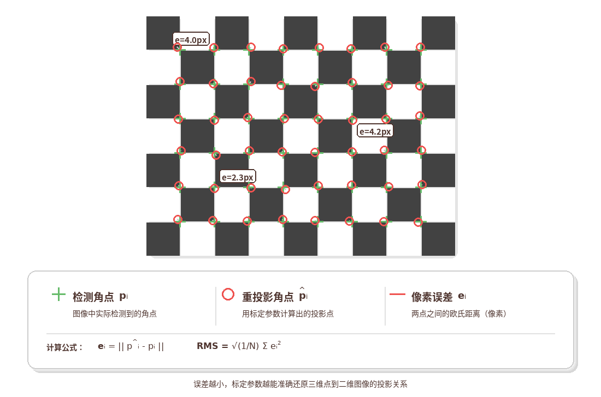

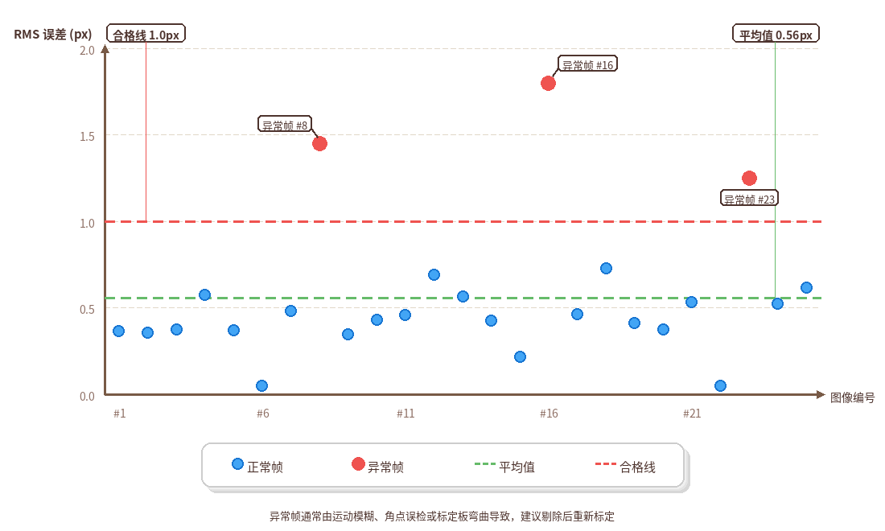

These are starting references for ordinary perspective cameras, not universal limits. Inspect every frame; large outliers often indicate blur, false corners, or a warped target.

### Exporting camera_info YAML

```yaml
image_width: 1280
image_height: 720
camera_name: front_camera
camera_matrix:
  rows: 3
  cols: 3
  data: [640.5, 0.0, 640.0, 0.0, 640.5, 360.0, 0.0, 0.0, 1.0]
distortion_model: plumb_bob
distortion_coefficients:
  rows: 1
  cols: 5
  data: [0.05, -0.02, 0.001, -0.001, 0.0]
rectification_matrix:
  rows: 3
  cols: 3
  data: [1.0, 0.0, 0.0, 0.0, 1.0, 0.0, 0.0, 0.0, 1.0]
projection_matrix:
  rows: 3
  cols: 4
  data: [640.5, 0.0, 640.0, 0.0, 0.0, 640.5, 360.0, 0.0, 0.0, 0.0, 1.0, 0.0]
```

| Field | Meaning | Consumers |
| --- | --- | --- |
| `camera_matrix` | Intrinsics \(K\) | Undistortion, PnP, SLAM, measurement |
| `distortion_coefficients` | Distortion \(D\) | Image correction |
| `rectification_matrix` | Rectification rotation \(R\) | Stereo matching |
| `projection_matrix` | Rectified projection \(P\), including right-camera baseline | Stereo depth |

For the right camera, \(P[0][3]=-f_xb\). Load YAML through `camera_info_url` so the driver publishes `CameraInfo`.

### Advanced: Four-Fisheye Extrinsics and Real-Time BEV

This section places four cameras in `base_link`, estimates vehicle-relative poses, and blends their projections into BEV using ROS 2 and RViz2.

> Intended for rigid fisheye/ultra-wide cameras over approximately flat ground. Recalibrate after changing mounting, focus, resolution, or driver configuration.

#### Coordinate Model

Define `base_link` at the vehicle center: +X right, +Y forward, +Z up. Known ground-board corners estimate \(T_{base\_camera}\), then planar homography \(H\) maps each undistorted image to BEV. The result is a ground-plane projection, not full 3D reconstruction.

#### Step 1: Build and Configure fisheye_avm_ros

The package subscribes to ROS 2 images and does not open `/dev/video*` directly.

```bash
cd ~/ros2_ws
source /opt/ros/$ROS_DISTRO/setup.bash
colcon build --packages-select fisheye_avm_ros
source install/setup.bash
```

Verify topics, direction mapping, intrinsics, board dimensions, and placement in `config/avm.yaml`:

```yaml
cameras:
  front:
    image_topic: /cameras/front/image_raw
    camera_info_topic: /cameras/front/camera_info
    intrinsics_file: /home/seeed/fisheye-avm-calib/calib_results/front.json
calibration:
  board: {pattern_size: [8, 6], square_size_m: 0.025}
  placements:
    front: {near_m: 0.35, lateral_m: 0.0, orient: long-lateral}
bev:
  base_frame: base_link
  scale_px_per_meter: 200.0
  canvas_size: [800, 800]
```

The default `front=0, back=2, left=3, right=1` mapping is only an example. Calibration and live resolutions must match exactly. Four-parameter equidistant/fisheye is preferred; `plumb_bob` may be inaccurate at ultra-wide edges.

#### Step 2: Capture Four Extrinsics

Lay one board direction at a time on the ground and measure `near_m` and `lateral_m` from `base_link`.

```bash
source /opt/ros/$ROS_DISTRO/setup.bash
source ~/ros2_ws/install/setup.bash
ros2 launch fisheye_avm_ros avm_calibrate.launch.py \
  config:=~/ros2_ws/src/fisheye_avm_ros/config/avm.yaml
```

```bash
ros2 topic pub --once /avm/calibration/capture std_msgs/msg/String "{data: front}"
ros2 topic pub --once /avm/calibration/capture std_msgs/msg/String "{data: back}"
ros2 topic pub --once /avm/calibration/capture std_msgs/msg/String "{data: left}"
ros2 topic pub --once /avm/calibration/capture std_msgs/msg/String "{data: right}"

# Solve after every direction reports "capture locked"
ros2 service call /avm/calibration/solve std_srvs/srv/Trigger "{}"
```

Success writes `~/.ros/fisheye_avm/extrinsics.yaml` with \(T_{base\_camera}\), \(H\), pose RMS, and BEV RMS. A result exceeding configured thresholds does not overwrite the accepted file.

#### Step 3: Validate in RViz2

```bash
source ~/ros2_ws/install/setup.bash
rviz2 -d $(ros2 pkg prefix fisheye_avm_ros)/share/fisheye_avm_ros/rviz/avm.rviz
```

- Overlay topics must show complete, consistently ordered corners.
- With Fixed Frame=`base_link`, markers and camera TF poses must be plausible.
- `/avm/diagnostics` must report no resolution, missing-board, or RMS errors.

#### Step 4: Real-Time Stitching

```bash
# Real-time path requires CUDA-enabled OpenCV
source /home/seeed/fisheye-avm-calib/scripts/env_opencv_cuda.sh
source /opt/ros/$ROS_DISTRO/setup.bash
source ~/ros2_ws/install/setup.bash
ros2 launch fisheye_avm_ros avm_bev.launch.py \
  config:=~/ros2_ws/src/fisheye_avm_ros/config/avm.yaml
```

Display `/avm/bev/image_raw`; inspect individual directional BEV topics for seam diagnosis. Only frames within `max_sync_delta_sec`—30 ms by default—are fused.

> Tested Jetson status: the package builds and starts on ROS 2 Humble, but the tested Python OpenCV 4.5.4 reported zero CUDA devices. The node therefore reports an explicit error instead of silently degrading. Use `allow_cpu:=true` only for geometry debugging, not performance acceptance.

| Check | Pass criterion | Inspect first |
| --- | --- | --- |
| Extrinsics | Four \(H\), \(T_{base\_camera}\), and RMS entries | Board size, placement, direction mapping |
| Geometry | Plausible board markers and camera TF | `base_link` axes and camera assignment |
| Stitching | Continuous ground lines across seams | Intrinsics, resolution, synchronization, exposure |
| Real time | CUDA reported and continuous BEV | CUDA OpenCV, environment, resolution, resources |

BEV here is not a LiDAR map and does not control the robot; it supplies a unified ground view for later occupancy, localization, navigation, and grasp perception.

## Deliverables and Acceptance

1. Calibration YAML: one monocular file or stereo `left.yaml/right.yaml`.
1. Accuracy report: overall/per-frame RMS, intrinsics, distortion, stereo extrinsics, and capture counts.
1. Recommended raw data: calibration images or ROS bag.

Acceptance criteria:

- RMS ≤ 1.0 pixel is an initial reference for ordinary perspective cameras; evaluate fisheye and precision tasks in context.
- YAML loads through `image_proc` or `camera_info_url`.
- Rectified stereo correspondences differ vertically by no more than one pixel.
- The report contains no unexplained outliers.

## Troubleshooting

### Unstable Corner Detection

Increase target coverage, remove blur and glare, improve exposure, and use a high-contrast board.

### High Reprojection Error

Diversify poses, remove high-error frames, lock focus/exposure, and remeasure square size.

### Misaligned Stereo Epipolar Lines

Use hardware synchronization or reduce `--approximate`, collect more pairs, and mount cameras rigidly.

### Kalibr Errors or Non-Convergence

Verify bag continuity, frame rate, and `aprilgrid.yaml`; reduce resolution or use `--dont-show-extract`.

> Next, load the resulting `camera_info` YAML in M3 visual SLAM or M4 object detection. For manipulator vision, continue to M9 hand–eye calibration and visual servoing.

