# 2.3 Camera Calibration: From Understanding Intrinsics/Extrinsics to Completing Stereo Calibration

## Course Overview

A camera captures a frame, but it does not intrinsically know where a pixel lies in the real world. Calibration fills in this missing geometric relationship: image undistortion, SLAM localization, stereo ranging, 3D reconstruction, and robotic grasping all consume the same calibration result. This lesson turns a set of abstract parameters into a `camera_info` configuration that ROS2 nodes can load and validate directly.

### Before You Start: What This Lesson Will Walk You Through

| Stage     | What you will understand                                                | What you can ultimately do                                          |
| --------- | ----------------------------------------------------------------------- | ------------------------------------------------------------------- |
| Interpret | How pixels map to space, and what intrinsics vs. extrinsics each answer | Read calibration results without treating parameters as a black box |
| Capture   | Why the chessboard must cover different positions, distances, and tilts | Capture data diverse enough to solve                                |
| Validate  | What reprojection error and epipolar alignment each tell you            | Judge whether a calibration file is actually usable                 |

### Learning Outcomes

- Understand the physical meaning of the pinhole camera model and distortion models, and master how to solve for the intrinsic matrix $K$ and distortion coefficients $(k_1, k_2, p_1, p_2, k_3)$.
- Understand the geometric meaning of extrinsics (rotation $R$ and translation $t$), and be able to build the transform between the camera frame and the world frame.
- Complete monocular and stereo camera calibration, producing a usable $camera\_info$ YAML file.
- Quantitatively evaluate calibration accuracy through reprojection error, and identify and reject low-quality calibration data.
- Understand the basic concepts of hand–eye calibration (Eye-in-hand / Eye-to-hand), laying groundwork for the M9 robot-arm vision module.
- Advanced path: explain why a 198° fisheye does not use `plumb_bob`, why diversity matters more than stacking frames, why new intrinsics require redoing extrinsics, and why the chessboard has a 180° ambiguity; and produce the `equidistant` YAML + JSON that 2.4 consumes directly.

### Hardware and Software Checklist

| Category           | Description                                                                                                                                                                                                                                                                                |
| ------------------ | ------------------------------------------------------------------------------------------------------------------------------------------------------------------------------------------------------------------------------------------------------------------------------------------ |
| Compute platform   | J501 board (or an equivalent x86/ARM host running Ubuntu 22.04)                                                                                                                                                                                                                            |
| Cameras            | 1–2 cameras (GMSL / USB / MIPI; this course uses GMSL cameras as the example) — 1 camera for monocular calibration, 2 synchronized cameras for stereo calibration                                                                                                                          |
| Calibration target | Chessboard or ChArUco. The main ROS example uses a 9×7 A4 board; **the advanced four-fisheye workflow must use 8×6 inner corners at 25 mm**, matching 2.4's live configuration. The square size must be known and accurate, printed without scaling, and the two boards must not be mixed. |
| Calibration tools  | Main: ROS `camera_calibration`, or Kalibr. Advanced: `python3 tools/calib_web.py` (browser `http://<jetson-ip>:8090`). Do not use `fisheye-avm-calib`'s GPU hub at `:8787`.                                                                                                                |
| Accessories        | Tape measure (to measure the target square size), tripod or rigid fixture, uniform lighting                                                                                                                                                                                                |

### Prerequisites

- M2.1–M2.3: the camera driver works correctly, and you can reliably obtain an image stream through ROS topics or an SDK.
- Linear algebra basics: matrix multiplication, homogeneous coordinates, and basic operations on rotation matrices and translation vectors.
- ROS basics: able to publish/subscribe to image topics, and understand the $sensor\_msgs/Image$ and $sensor\_msgs/CameraInfo$ message formats.

> **Pre-calibration check:** You must lock the focus or disable autofocus; otherwise the intrinsics will change during capture and the result cannot be reused. The lens should be clean and the calibration board flat. Aim exposure and white balance for "sharp corners, no overexposure, no strong reflections"; whether to disable auto-exposure depends on the camera and on-site lighting — no need to apply one fixed rule mechanically.

## Read First: How a Camera Turns the World into Pixels

Think of a camera first as a measuring instrument that "compresses the 3D world onto a 2D photo". Calibration does not require you to master complex math in advance; you only need to answer three questions in order:

1. How does this camera turn light into pixels?
2. How much does the lens bend straight lines?
3. How far apart, and in which orientation, is the camera from another coordinate frame?

The formulas below all answer these three questions.

### Pinhole Camera Model and Distortion

The core of camera calibration is to use a set of points whose positions are known to work backwards to **how a camera projects the 3D world onto 2D pixels**: where the same spatial point lands, how large it appears, and how much the edges shift are all determined by this model. We first describe the process with the pinhole camera model (the most ideal case).

#### Pinhole Imaging: the Simplest "Camera"

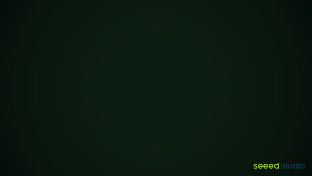

Before diving into formulas, it helps to understand pinhole imaging intuitively. Imagine a completely sealed dark box with only a pinhole-sized opening in one wall. Every point on an object's surface reflects light in all directions, but only the ray that happens to pass exactly through the pinhole enters the box. Because light travels in straight lines, light from the top of the object passes through the pinhole and lands on the **lower** part of the inside far wall, while light from the bottom lands at the **top**. An upside-down, left-right reversed image then appears on the far wall. This is the most primitive camera: the camera obscura — the word "camera" comes from the Latin word for "room".

The pinhole size creates an unavoidable trade-off: the smaller the hole, the thinner the light beam for each object point and the sharper the image, but less light enters the box so the picture gets darker; a larger hole brightens the picture, but the light spot of each object point spreads out and the image becomes blurry. Real cameras resolve this trade-off with a lens (convex lens) — the large aperture collects more light to guarantee brightness while refocusing the light to a point to guarantee sharpness. The "far wall" that receives the image is replaced by the image sensor.

The pinhole camera model idealizes this geometric relationship: all light rays converge at a zero-volume "optical center", pass through it in straight lines, and project onto the imaging plane. Below, we use similar triangles to convert a spatial point's position in the camera frame onto the imaging plane; the deviation of a real lens from this ideal model is explained later in the "Lens Distortion" section.

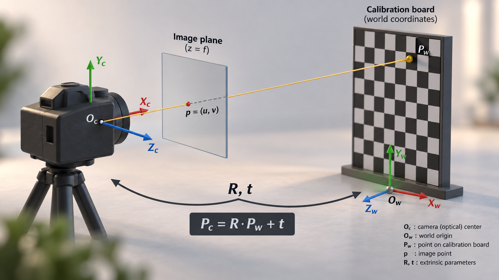

Let the 3D coordinates of a spatial point $P$ in the world frame be:

$P_w = \begin{bmatrix} X_w \\ Y_w \\ Z_w \end{bmatrix}$

First, we need to transform the point from the world frame to the camera frame via the **camera extrinsics**:

$P_c = R P_w + t$

Here, **$R$ represents the orientation difference between the two frames and $t$ represents the difference between their origins**; together they are called extrinsic parameters. Importantly, extrinsics must always state "relative to what". In monocular capture, what is estimated is usually the camera's temporary pose relative to each calibration board; in a stereo or multi-camera system, what we really care about is the fixed relative pose between cameras.

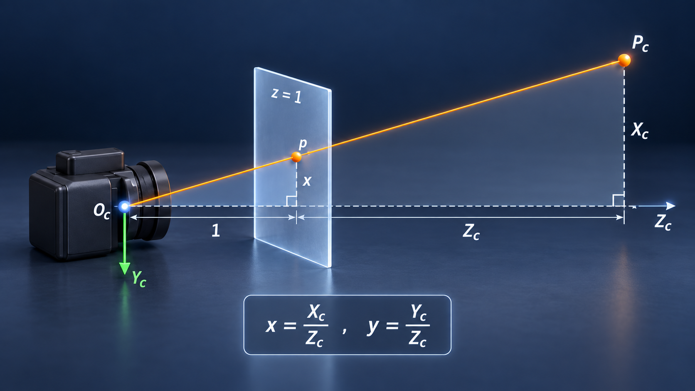

In the camera frame, the camera's optical center is at the origin:

$O_c = (0, 0, 0)$

Under the camera-frame convention commonly used in OpenCV, the $X_c$ axis points to the right of the image, the $Y_c$ axis points downward, and the $Z_c$ axis points forward along the camera's optical axis.

The ray emitted from spatial point $P_c=(X_c, Y_c, Z_c)$ passes through the camera's optical center and intersects the imaging plane. Using the similar-triangle relationship, we obtain the point's coordinates on the normalized imaging plane:

$x = \frac{X_c}{Z_c}, \qquad y = \frac{Y_c}{Z_c}$

Here $(x, y)$ are called **normalized image coordinates**. They are not yet the final pixel coordinates in the image; they describe the spatial point's position relative to the camera's optical axis.

---

### Camera Intrinsics and Pixel Coordinates

Normalized image coordinates still need to be converted to the final pixel coordinates via the camera intrinsics.

The camera intrinsic matrix is usually written as:

$K = \begin{bmatrix} f_x & 0 & c_x \\ 0 & f_y & c_y \\ 0 & 0 & 1 \end{bmatrix}$

where:

- $f_x$: the effective focal length along the horizontal direction, in pixels;
- $f_y$: the effective focal length along the vertical direction, in pixels;
- $(c_x, c_y)$: the pixel coordinates of the camera's principal point;
- $K$: the camera intrinsic matrix.

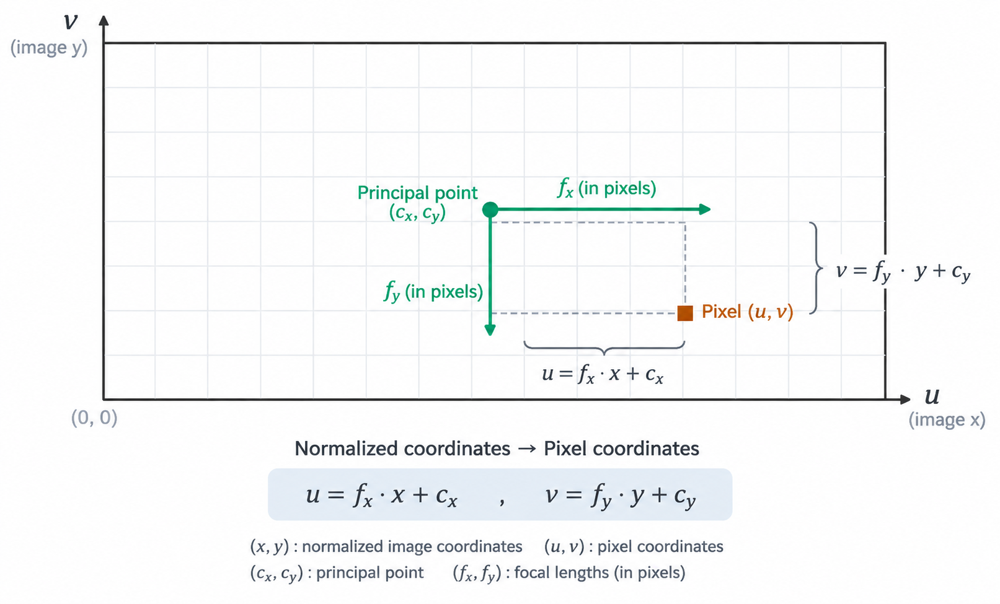

Under the ideal pinhole model, normalized coordinates and pixel coordinates satisfy:

$u = f_x x + c_x$

$v = f_y y + c_y$

Therefore:

$\begin{bmatrix} u \\ v \\ 1 \end{bmatrix} = K \begin{bmatrix} x \\ y \\ 1 \end{bmatrix}$

Combining with $x = \frac{X_c}{Z_c}, \qquad y = \frac{Y_c}{Z_c}$,

we get the common pinhole camera projection formula:

$\begin{bmatrix} u \\ v \\ 1 \end{bmatrix} = \frac{1}{Z_c} \begin{bmatrix} f_x & 0 & c_x \\ 0 & f_y & c_y \\ 0 & 0 & 1 \end{bmatrix} \begin{bmatrix} X_c \\ Y_c \\ Z_c \end{bmatrix}$

The physical focal length $f$ printed on the lens is in mm, while the calibrated $(f_x, f_y)$ are in pixels; they are not the same physical quantity.

If the sensor's per-pixel size in the two directions is $s_x$ and $s_y$ respectively, they can be approximately expressed as:

$f_x = \frac{f}{s_x}, \qquad f_y = \frac{f}{s_y}$

Therefore, in practice we usually use $f_x$ and $f_y$ directly, rather than the lens's millimeter focal length $f$.

---

### Lens Distortion

The ideal pinhole model assumes light goes through an ideal pinhole to complete the projection, but a real lens is made of multiple optical elements, so real images usually exhibit some geometric distortion. Common lens distortion mainly includes **radial distortion** and **tangential distortion**. The distortion model acts on the normalized image coordinates $(x, y)$, not on the final pixel coordinates $(u, v)$.

Definition: let the normalized image coordinates be $(x, y)$, and let $r$ denote the radial distance from that point to the image center (principal point), satisfying:

$r^2 = x^2 + y^2$

In the common Brown–Conrady distortion model, radial distortion corrects the normalized coordinates to:

$x_r = x(1 + k_1 r^2 + k_2 r^4 + k_3 r^6)$

$y_r = y(1 + k_1 r^2 + k_2 r^4 + k_3 r^6)$

where $(k_1, k_2, k_3)$ are the radial distortion coefficients.

Radial distortion typically appears in two forms:

- **Barrel Distortion**: the image edges bulge outward;
- **Pincushion Distortion**: the image edges shrink inward.

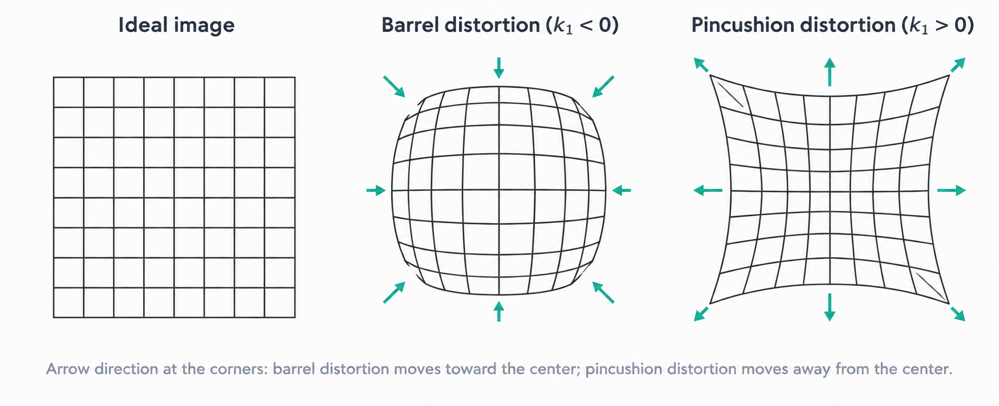

In addition to radial distortion, when the lens optical axis cannot be perfectly aligned with the image sensor plane, tangential distortion also arises, expressed as:

$x_t = 2p_1 xy + p_2(r^2 + 2x^2)$

$y_t = p_1(r^2 + 2y^2) + 2p_2 xy$

where $(p_1, p_2)$ are the tangential distortion coefficients.

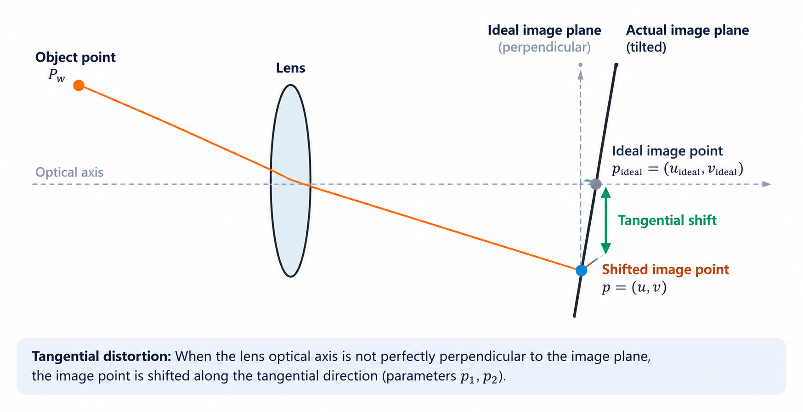

Considering radial and tangential distortion together, we get the distorted normalized coordinates:

$x_d = x(1 + k_1 r^2 + k_2 r^4 + k_3 r^6) + 2p_1 xy + p_2(r^2 + 2x^2)$

$y_d = y(1 + k_1 r^2 + k_2 r^4 + k_3 r^6) + p_1(r^2 + 2y^2) + 2p_2 xy$

After that, the distorted normalized coordinates are converted to pixel coordinates via the camera intrinsics:

$u = f_x x_d + c_x$

$v = f_y y_d + c_y$

Therefore, a real camera's complete imaging process can be summarized as:

**World coordinates → Camera coordinates → Normalized image coordinates → Lens distortion → Pixel coordinates**

that is:

$P_w \xrightarrow{R,t} P_c \xrightarrow{\div Z_c} (x,y) \xrightarrow{\text{Distortion}} (x_d,y_d) \xrightarrow{K} (u,v)$

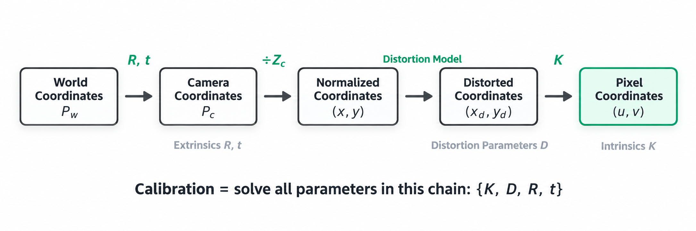

---

### What Camera Calibration Actually Solves For

Now we can understand "calibration" as a reverse measurement: the corner positions on the calibration board are known, the software finds these corners in the image, and then adjusts the model parameters so that the "model-predicted pixel positions" match the "actually detected positions" as closely as possible. What emerges is not a set of mysterious numbers, but a manual describing how the camera images, how to correct it, and how to align it with other coordinate frames.

The parameters to be solved usually fall into three categories:

#### Camera Intrinsics

$K = \begin{bmatrix} f_x & 0 & c_x \\ 0 & f_y & c_y \\ 0 & 0 & 1 \end{bmatrix}$

Describes the camera's own imaging characteristics, including focal length and principal point position.

#### Distortion Parameters

A common form is:

$D = (k_1, k_2, p_1, p_2, k_3, \ldots)$

Used to describe the geometric distortion of a real lens relative to the ideal pinhole model.

#### Camera Extrinsics

$R, \quad t$

Describe the positional and orientational relationship between the camera frame and the world frame, the calibration-board frame, or the vehicle frame.

Therefore, the calibration result can be simply understood as:

$\{K, D, R, t\}$

**One-line memory aid:** intrinsics $K$ and distortion $D$ describe "how this camera sees"; extrinsics $(R,t)$ describe "where it is and which way it points relative to some reference frame". For monocular, the reference is usually the calibration board; for stereo, the reference is the other camera; for vehicle or robot systems, the reference is usually the vehicle body or the robot-arm base.

For AVM, BEV, and multi-camera stitching applications, obtaining only the camera intrinsics is not enough. Besides accurately correcting each camera's lens distortion, you must also obtain each camera's extrinsics relative to the vehicle frame or a unified world frame, so that what the different cameras observe can be correctly mapped onto the same bird's-eye-view plane.

> **Supplementary note:** For ordinary perspective lenses, the pinhole model above with the Brown–Conrady distortion model can be used. For ultra-wide or fisheye lenses with a very large field of view, the ordinary pinhole model may not accurately describe their projection characteristics; in that case, dedicated fisheye camera models such as OpenCV Fisheye or Kannala–Brandt are usually required, rather than simply adding higher-order radial distortion parameters.

### Hand–Eye Calibration Basics (Groundwork for M9)

Hand–eye calibration solves the transform between the camera frame and the frame of the robot arm's end effector (or base); it is a prerequisite for visual servoing and grasp planning. Depending on where the camera is mounted, there are two typical configurations:

| Dimension        | Eye-in-hand                                                                | Eye-to-hand                                                                                   |
| ---------------- | -------------------------------------------------------------------------- | --------------------------------------------------------------------------------------------- |
| Mounting         | Camera fixed to the arm's end effector and moves with the arm              | Camera fixed outside the workspace and does not move with the arm                             |
| Calibration goal | Solve the camera-to-end-flange transform $T_{cam \to tool}$                | Solve the camera-to-arm-base transform $T_{cam \to base}$                                     |
| Field of view    | Moves with the arm, can observe the target up close, but risks motion blur | Fixed view, can observe arm and target throughout, but resolution limited by working distance |
| Typical equation | $AX = XB$                                                                  | $AX = ZB$                                                                                     |

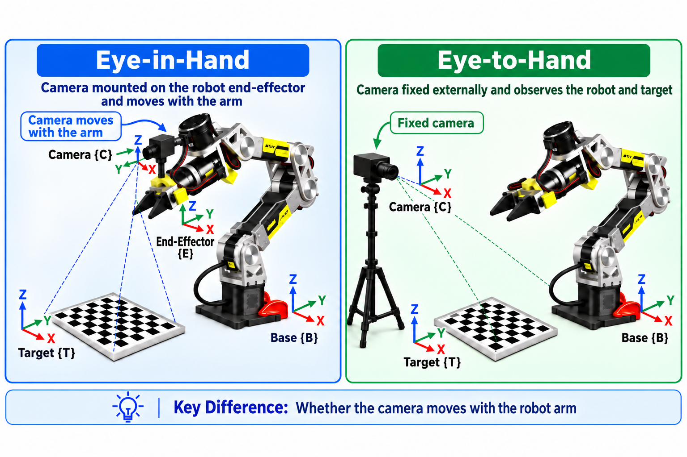

This course does not go into the actual solving of hand–eye calibration; it only requires understanding the difference between the two configurations and their applicable scenarios. The $AX=XB$ and $AX=ZB$ in the table are just common notations; different references use different conventions for frame directions and transform naming, so they cannot be applied directly without the frame definitions. The M9 robot-arm vision module will fully define the frames before explaining the solution and hands-on practice.

### Stereo Calibration and Epipolar Rectification

Stereo calibration builds on monocular calibration by additionally solving the extrinsic relationship $(R, t)$ between the left and right cameras — that is, the rotation $R$ and translation $t$ from the left camera frame to the right camera frame. With these extrinsics, one can further perform **epipolar rectification** on the left and right images.

First understand **epipolar geometry**: for any spatial point $P$ projected to $p_L$ in the left image, its corresponding point $p_R$ in the right image must lie on a determined line — this line is the **epipolar line**. Before rectification, the epipolar lines are usually slanted, so stereo matching must search for correspondences in a 2D region, which is computationally expensive and error-prone.

**Stereo rectification** uses the $(R, t)$ from stereo calibration to apply a virtual rotation to each of the left and right images, making the two cameras' imaging planes coplanar and row-aligned. After rectification, all epipolar lines become horizontal, and the projections of the same spatial point in the left and right images lie strictly on the same horizontal row — stereo matching is thus reduced from a 2D search to a 1D search along the horizontal direction, greatly improving both efficiency and accuracy.

The core steps of rectification:

1. Calibrate the intrinsics and distortion coefficients of the left and right cameras separately (monocular calibration).
2. Based on synchronously captured calibration-board image pairs, solve the rotation $R$ and translation $t$ between the left and right cameras (the core of stereo calibration).
3. Use $(R, t)$ to construct the virtual rotation matrices $R_1, R_2$ for the left and right cameras, making the two imaging planes coplanar and row-aligned.
4. Generate the rectification mapping tables (remap) and remap the original left/right images to obtain the rectified image pair.

After rectification, the projections of the same spatial point in the left and right images lie strictly on the same horizontal row, so stereo matching only needs a 1D search along the horizontal direction.

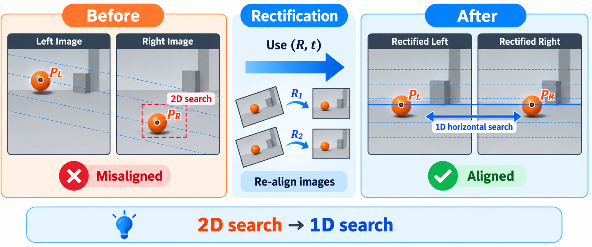

## Hands-On Calibration: From Images to Usable Parameters

### Before Starting: Confirm These 4 Things

| Check                  | Why it matters                                                                          | Pass criterion                                                        |
| ---------------------- | --------------------------------------------------------------------------------------- | --------------------------------------------------------------------- |
| Stable images          | Blur and dropped frames make corner positions unreliable                                | Image topic keeps publishing; chessboard edges are sharp              |
| Fixed lens state       | Autofocus changes the effective focal length; auto-exposure can affect corner detection | Lock focus; fix exposure and white balance as much as possible        |
| Accurate board size    | A wrong square size corrupts the whole distance scale                                   | Measure one square edge and convert to meters                         |
| Stereo synchronization | Both cameras must see the same board at the same moment                                 | Prefer hardware sync; otherwise record and control the time tolerance |

> **Note:** This section performs camera calibration with ROS2. If ROS2 is not installed yet, please first refer to [1.4 Robot Software Middleware: ROS2 Humble Quick Start](../../M01-Platform-and-Dev-Environment/1.4_Getting_Started_with_ROS2_Humble/README_en_US.md).

### Environment Setup and Data Capture

**Step 1: Install the ROS2 camera calibration package**

```bash
sudo apt install ros-humble-camera-calibration
sudo apt install ros-${ROS_DISTRO}-v4l2-camera
```

**Step 2: Start the camera node**

*Terminal 1*

```bash
ros2 run v4l2_camera v4l2_camera_node --ros-args \
    -r __node:=gmsl_cam0 \
    -r __ns:=/gmsl/cam0 \
    -p video_device:=/dev/video0 \
    -p image_size:="[1920,1536]" \
    -p pixel_format:=YUYV \
    -p output_encoding:=rgb8 \
    -p camera_frame_id:=gmsl_cam0_optical_frame \
    -p camera_info_url:=file:///home/seeed/.ros/camera_info/gmsl_cam0.yaml
```

**Confirm the driver version first:** the parameters above apply to the common `v4l2_camera` usage; different GMSL / USB / MIPI drivers may use different parameter names. After starting, run `ros2 param list /gmsl/cam0` to confirm that the device, resolution, encoding, and `camera_info_url` parameters exist and actually take effect before proceeding to calibration.

Open another terminal to check whether the camera node data is normal:

*Terminal 2*

```bash
#查看相机话题是否存在
ros2 topic list -t
#查看画面数据是否正常
ros2 topic hz /gmsl/cam0/image_raw
```


Seeing the result above means the camera node can stream normally.

**Step 3: Prepare the calibration board and start the calibration tool**

This example uses the [9×7 chessboard](https://www.mrpt.org/downloads/camera-calibration-checker-board_9x7.pdf): it has 9×7 squares, so its detectable inner corners are 8×6. Measure one square edge with a ruler; if it measures 20 mm, write the square size in the command as `0.020` (unit: meters). When printing, be sure to disable scaling options such as "fit to page".

*Start monocular calibration*

```bash
ros2 run camera_calibration cameracalibrator \
  --no-service-check \
  --size 8x6 --square 0.020 \
  --ros-args -r image:=/gmsl/cam0/image_raw
```

> Parameters and saving:
> 
> - `--size 8x6` is the number of inner corners: 9×7 squares correspond to 8×6 inner corners.
> - `--square 0.020` is the edge length of a single square in meters; it must match your measured value.
> - `--no-service-check` lets drivers without a `SetCameraInfo` service start the calibration tool. After solving, click **SAVE** to save the result; use **COMMIT** only when the driver actually provides that service.

**Step 4: Capture calibration images**

Place the calibration board in the camera's field of view and vary its position and orientation to cover different areas of the view (center, four corners, edges) and different depths. Capture tips:

- For monocular calibration, capture **20–40** valid images; for stereo calibration, capture **30–50** synchronized pairs.
- The board should occupy **1/3 to 2/3** of the field of view — avoid too small (low corner-detection accuracy) or too large (out of view).

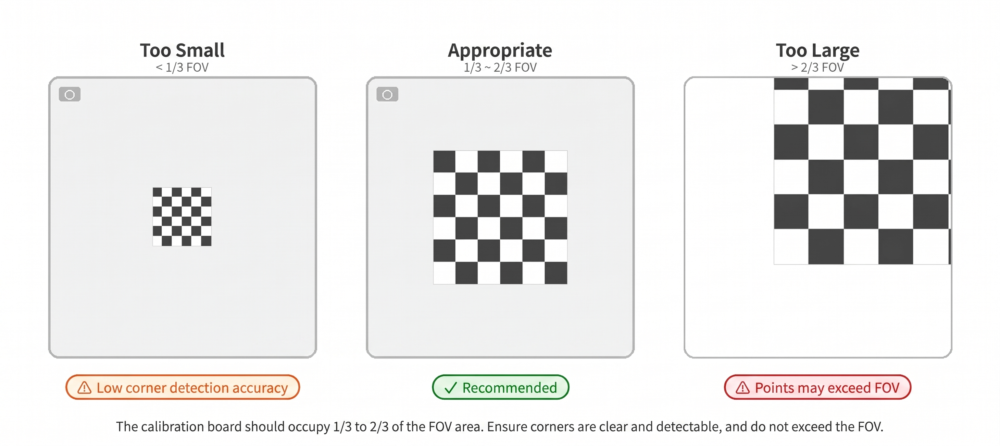

- Poses should include tilt (30°–45° rotation around the X/Y axes) and in-plane rotation (around the optical axis), avoiding similar poses across all images.

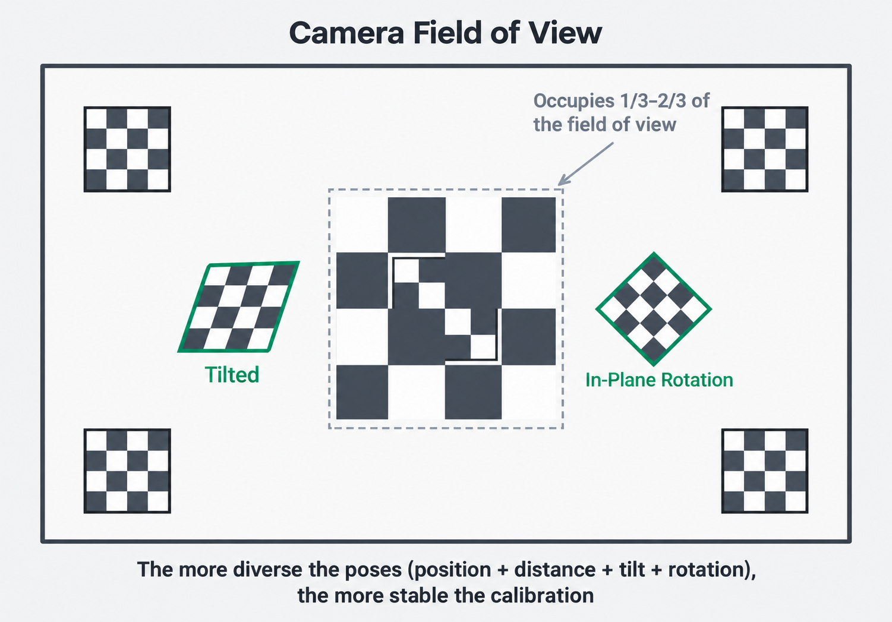

- Ensure the board stays sharp with no motion blur throughout, with uniform lighting and no strong reflections.


> **Capture tip:** Use the live preview window of the $camera\_calibration$ tool and capture only when all four progress bars (X/Y/Size/Skew) are in the green zone — this effectively ensures data diversity.

After capturing enough data, click **CALIBRATE** to solve the parameters. Once computation finishes, check the intrinsics, distortion coefficients, and reprojection error printed in the terminal, then click **SAVE** to save the result; the default file is `/tmp/calibrationdata.tar.gz`. **COMMIT** is only for drivers that provide the `SetCameraInfo` service; this tutorial saves a YAML and loads it when the driver starts, so a successful COMMIT is not required.

**Convert results to YAML:** extract `/tmp/calibrationdata.tar.gz`; monocular output contains `ost.yaml` (i.e., the standard camera_info YAML format), and stereo output contains `left.yaml` / `right.yaml`. Rename and copy them as needed to the `camera_info_url` path from Step 2 (e.g., `/home/seeed/.ros/camera_info/gmsl_cam0.yaml`), then restart the camera node so the driver loads the new calibration.


### Stereo Calibration

Stereo calibration requires synchronized image capture from the left and right cameras. When using $camera\_calibration$, the launch command must specify both the left and right topics:

```bash
ros2 run camera_calibration cameracalibrator \
  --size 8x6 \
  --square 0.020 \
  --no-service-check \
  --ros-args -r left:=/stereo/left/image_raw \
  -r right:=/stereo/right/image_raw
```

**Synchronization principle:** prefer hardware sync, so the standard command above does not set `--approximate`. If the device can only do software sync, first check the timestamp difference between the left and right images, then start from a small tolerance (e.g., `--approximate=0.01`); do not use 0.1 s as the default, because a moving calibration board may already change pose within 100 ms. After calibration, besides each camera's intrinsics and distortion, you also get the inter-camera $R$, $T$, as well as $R_1/R_2$ and $P_1/P_2$ used for rectification.

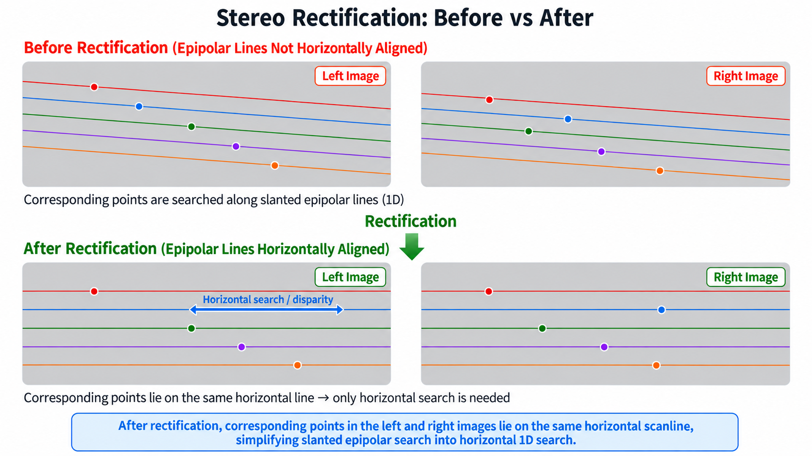

When using Kalibr for stereo calibration, simply list the left and right topics in `--topics` and specify two camera models correspondingly in `--models`.

### Accuracy Assessment and Reprojection Error

Reprojection error is the first yardstick of whether a calibration is trustworthy. Think of it as the pixel distance between "the corners the software draws using the calibration parameters" and "the corners actually detected in the image": the smaller the difference, the better the model explains this batch of images. But it cannot represent everything on its own — combine it with image sharpness, corner coverage, and stereo epipolar alignment when judging.

$e_{rms} = \sqrt{\frac{1}{N} \sum_{i=1}^{N} \| \hat{p}_i - p_i \|^2}$

where $\hat{p}_i$ is the projected point, $p_i$ is the actually detected corner, and $N$ is the total number of corners.

| Reprojection error (pixels) | Accuracy grade | Notes                                                                                   |
| --------------------------- | -------------- | --------------------------------------------------------------------------------------- |
| < 0.5                       | Excellent      | Suitable for high-precision measurement and 3D reconstruction                           |
| 0.5 – 1.0                   | Good           | Suitable for most SLAM and detection applications                                       |
| 1.0 – 2.0                   | Acceptable     | Usable for less accuracy-demanding scenarios; improving the capture data is recommended |
| > 2.0                       | Unacceptable   | Recalibrate; check the lens, calibration board, and capture quality                     |

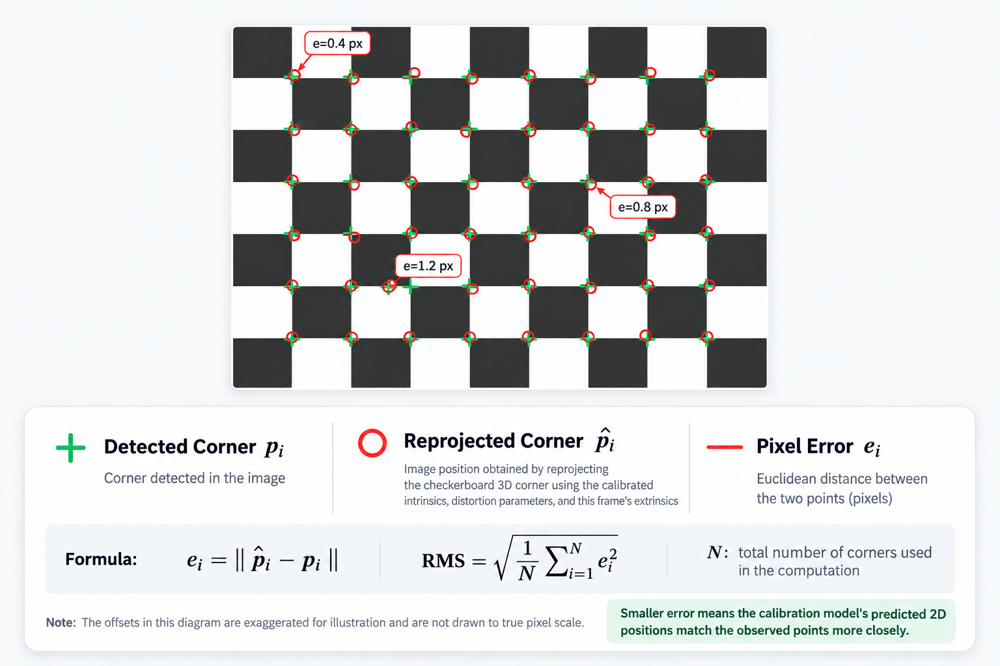

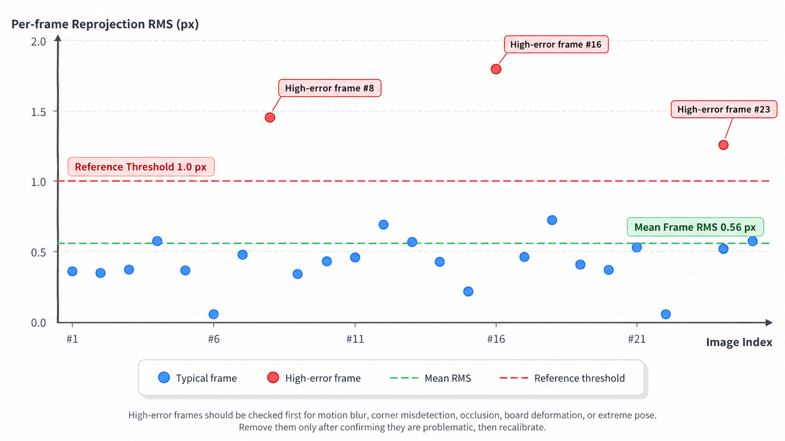

The values in the table are a starting reference for ordinary perspective cameras, not a universal threshold for all lenses and resolutions: for ultra-wide, fisheye, or low-resolution images, judge against the specific model. Regardless of the number, always inspect the error distribution image by image; a few images clearly above the average usually indicate motion blur, false corner detection, or a warped board, and should be removed before re-solving.

### Exporting the camera_info YAML

After calibration, save the parameters in standard YAML format for later modules to consume. Below is the standard format of a monocular $camera\_info$ YAML file:

```yaml
image_width: 1280
image_height: 720
camera_name: front_camera
camera_matrix:
  rows: 3
  cols: 3
  data: [640.5, 0.0, 640.0, 0.0, 640.5, 360.0, 0.0, 0.0, 1.0]
distortion_model: plumb_bob
distortion_coefficients:
  rows: 1
  cols: 5
  data: [0.05, -0.02, 0.001, -0.001, 0.0]
rectification_matrix:
  rows: 3
  cols: 3
  data: [1.0, 0.0, 0.0, 0.0, 1.0, 0.0, 0.0, 0.0, 1.0]
projection_matrix:
  rows: 3
  cols: 4
  data: [640.5, 0.0, 640.0, 0.0, 0.0, 640.5, 360.0, 0.0, 0.0, 0.0, 1.0, 0.0]
```

| Field                     | What to understand it as                                                                       | Main consumers                       |
| ------------------------- | ---------------------------------------------------------------------------------------------- | ------------------------------------ |
| `camera_matrix`           | Intrinsics K: the scale and center the camera uses to convert normalized coordinates to pixels | Undistortion, PnP, SLAM, measurement |
| `distortion_coefficients` | Distortion D: the rule by which the lens shifts edge pixels from their ideal positions         | Image correction                     |
| `rectification_matrix`    | Rectification rotation R: the transform that row-aligns the stereo image pair                  | Stereo matching                      |
| `projection_matrix`       | Rectified projection P; in the right camera it also encodes baseline information               | Stereo depth computation             |

In the stereo case, save one YAML for each of the left and right cameras; the right camera's $projection\_matrix$ contains the baseline information ($P[0][3] = -f_x \cdot b$, where $b$ is the baseline length).

In a ROS system, it is recommended to load this YAML via the camera driver's $camera\_info\_url$ parameter (consistent with Step 2 of this course): for example, $v4l2\_camera$ specifies `-p camera_info_url:=file:///home/seeed/.ros/camera_info/gmsl_cam0.yaml`, and the driver then publishes the $sensor\_msgs/CameraInfo$ topic according to that calibration, for nodes such as image correction and SLAM to subscribe to.

### Advanced: Four-Fisheye Calibration (Web) and Handoff to 2.4 Artifacts

**Problem this section solves:** the main path has already used ROS to calibrate the pinhole camera's `K/D` and `(R,t)`. The advanced path calibrates the four 198° fisheye cameras into files that 2.4 can consume directly: JSON for AVM, and `equidistant` YAML for the ROS driver. Real-time stitching, `valid_mask`, and metric/surround acceptance stay in 2.4 — `avm_ros2` is not launched here.

> **Teaching entry point:** open `http://<jetson-ip>:8090` in a browser and follow the existing pages: `/intrinsics` → `/extrinsics` (optional `/seam`; the web `/bev` is only a preview). Use a chessboard with **8×6 inner corners, 25 mm**, separate from the main-line ROS example board — do not mix them. The main-line `plumb_bob` YAML is not fed into 2.4.

#### Read First: What Advanced Extrinsics Are

Define the vehicle-body center as `base_link`. For each camera, the program uses the ground chessboard to solve `T_base_camera` (the camera's pose relative to the vehicle body), and the planar homography `H` mapping "this set of `K/D/balance` undistorted coordinates → the ground". `T_base_camera` is for TF; `H` is what the later IPM actually uses. The BEV here is a **ground-plane** projection, not a 3D reconstruction at arbitrary height.

The ground-plane frame follows the accompanying package's internal convention: `+X` to the right, `+Y` forward, `+Z` up — different from ROS REP-103 (`+X` forward, `+Y` left). When reading other ROS materials or interfacing with modules, swap the axes first; do not copy numbers directly.

#### Why the Intrinsics Page Must Be Done This Way

At the frame edges of a 198° fisheye, "adding a few more orders to `plumb_bob`'s `k`" can no longer compensate. The pinhole assumption says that after passing the optical center, light can still be described by a planar perspective; once the field of view is too large, the edge residuals are amplified by the later `H` and IPM, so use Kannala–Brandt / `equidistant` 4-parameter, via `cv2.fisheye.calibrate`.

**Diversity, not stacking frames.** Calibration is an inverse problem: when poses are too similar, `K/D` are under-determined. The page follows the X/Y/Size/Skew coverage of ROS `camera_calibration`, rather than "just take more shots". At least 15 images; only when the four axes are fully covered, or the count reaches about 40, is Calibrate recommended. If you click solve with insufficient samples, the edges may look undistorted but the extrinsic seams will drift.

**Compute before saving.** Computation only produces a candidate. First check the undistortion preview and the quality report: fail blocks saving, warn requires confirmation, then write to disk. Once fisheye edge errors are written into the official intrinsics, the entire downstream `H` will be wrong.

**`balance` scales the undistorted `K_new`, not the lens.** `0` crops the invalid region, `1` keeps the full field of view, and the default around `0.8` leans toward keeping more. The intrinsics preview and extrinsics/BEV must use the same setting, otherwise `H` will not match.

**Dual-write artifacts:** YAML for the ROS driver, JSON for AVM. New intrinsics mark old extrinsics as stale, because `H` is measured on "this set of `K/D/balance` undistorted coordinates". Do not feed the main-line `plumb_bob` YAML into this path.

#### Step 1: Start the Calibration Station

The calibration station takes the V4L2 device directly and is mutually exclusive with the ROS camera driver. First stop any `camera_driver` / `avm_ros2`, then start on the Jetson:

```bash
python3 tools/calib_web.py
```

Open `http://<jetson-ip>:8090` in a browser on an external computer. Do not use the `fisheye-avm-calib` GPU hub at `:8787` — that is not a command in this course.

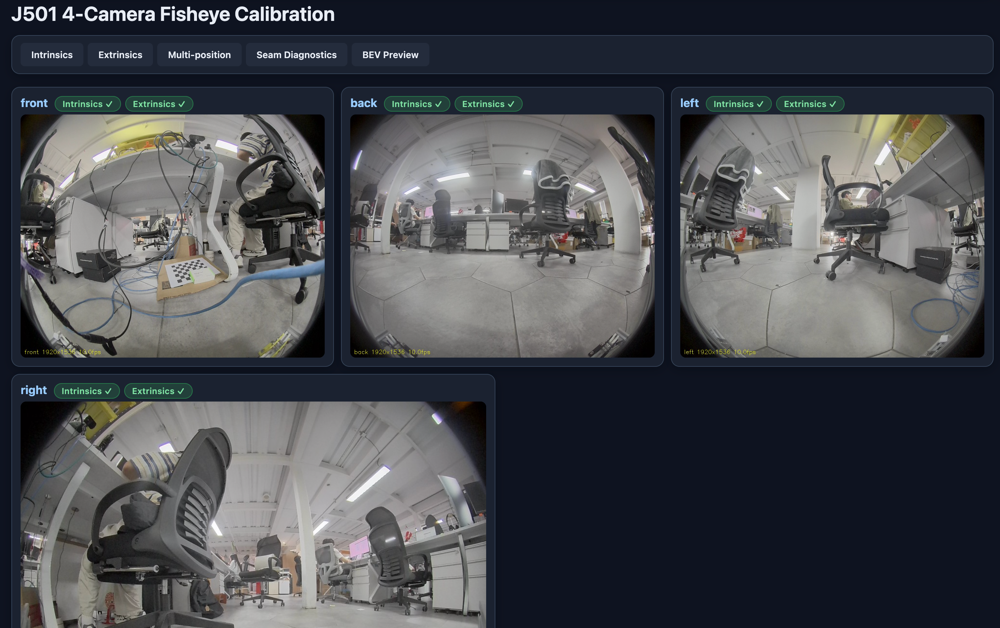

#### Step 2: Go Through /intrinsics First

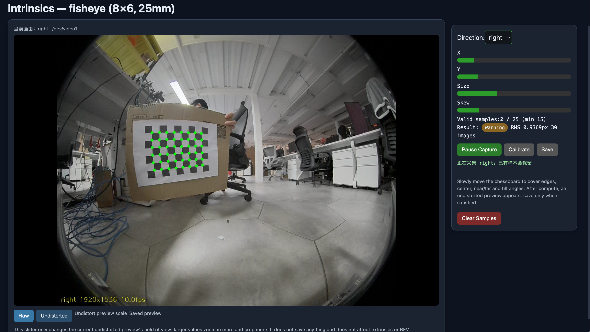

1. Capture each camera separately: the chessboard should cover different positions, distances, and tilts in the frame; watch X/Y/Size/Skew, and do not burst-shoot the same pose just to inflate the count.
2. Calibrate only after samples are sufficient. First check the undistortion preview: straight lines should be straightened, and the edges should not ripple.
3. A quality report of fail cannot be saved; for warn, read the reason before confirming. After saving, the JSON for that direction and a YAML with `distortion_model: equidistant` should appear.

#### Why the Extrinsics Page Must Be Done This Way

**Measure `H` directly, not derived from `K[r1 r2 t]`.** When the ground is approximately planar, `H` wraps up "how this camera sees this ground" in one package, avoiding model residuals. The key equation:

$s\begin{bmatrix}u\\v\\1\end{bmatrix}=H\begin{bmatrix}X\\Y\\1\end{bmatrix}$

**Tape-measure placement:** world points are measured, pixel points are detected. Get the near-edge distance wrong and the whole BEV's scale shifts along with it.

**Burst-averaging:** a single frame's corners have jitter and false detections. After stabilization, burst-capture about 8 frames, align the ordering, reject outliers, average the corners, then run `findHomography`.

**180° ambiguity:** a chessboard rotated 180° looks almost the same. First use the long/short edges to rule out the 90° false solution, then use the perspective rule that "the near edge looks larger" to resolve 180°. If solved backwards, that direction's image flips to the opposite side of the vehicle.

**The web `/bev` is only a preview.** Real-time ROS stitching, mask, and metric/surround acceptance stay in 2.4. Optional `/seam`: graph cut routes the seam along the minimum-difference path, rather than averaging a large overlap region.

#### Step 3: Go Through /extrinsics Next

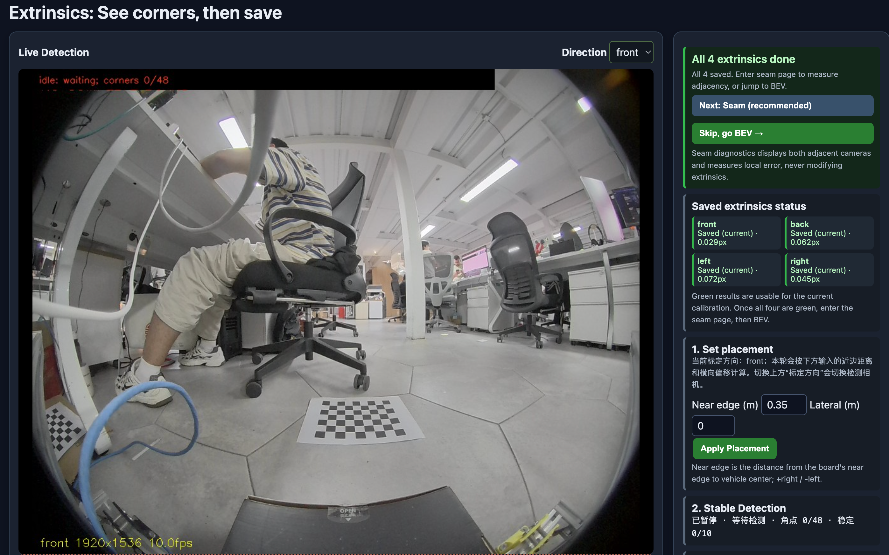

1. Lay out only one direction at a time. Place the chessboard flat on the ground and, following the page's `near_m` / `lateral_m`, measure to the vehicle center with a tape measure; the default near edge is about 0.35 m with the long edge lateral.
2. After the corners stabilize, burst-capture to lock that direction's `H`. All four directions must be locked and saved before extrinsics are considered complete.
3. If a direction's image flips to the opposite side, first check the 180° corner ordering — do not rush back to change the intrinsics.
4. Optionally enter `/seam` to view the seam between two adjacent directions; the web `/bev` only confirms it "roughly stitches together" and is not the 2.4 acceptance.

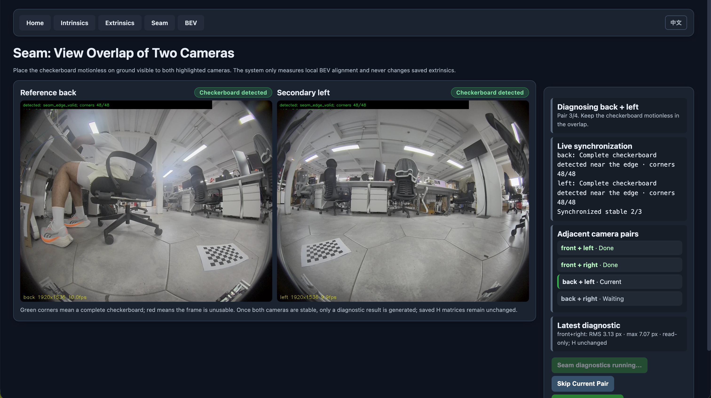

#### Step 4: Only Check Artifacts, Do Not Launch avm_ros2

Advanced completion is judged on disk, not RViz. You should have all of the following:

- `calib_results/{front,back,left,right}.json`
- `calib_results/extrinsics.json`
- `camera_info/{front,back,left,right}.yaml` (`distortion_model: equidistant`)

The default results directory is `/home/seeed/workspace/ros2_bev/calib_results/`. New intrinsics mark old extrinsics as stale: in that case only redo the extrinsics — no need to rerun the main-line ROS calibration. The beginning of 2.4 consumes these files directly; no recalibration is done there.

#### Acceptance Checklist and Debug Directions

| Check               | Pass criterion                                                                          | When failing, inspect first                                          |
| ------------------- | --------------------------------------------------------------------------------------- | -------------------------------------------------------------------- |
| Intrinsics model    | All four directions' YAML are `equidistant`, not main-line `plumb_bob`                  | Whether a ROS monocular calibration file was mistakenly fed into AVM |
| Diversity           | At least 15 images per direction with X/Y/Size/Skew coverage, not the same pose stacked | Edge undistortion drifting, unstable extrinsic seams                 |
| Extrinsic artifacts | Four json + `extrinsics.json`, and not marked stale                                     | near_m, chessboard 8×6/25 mm, 180° corner ordering                   |
| Web preview         | `/bev` shows the four directions roughly around the vehicle                             | Preview only; the formal metric acceptance is in 2.4                 |

**Boundary reminder:** this section does not control the chassis, nor treats the web BEV as a LiDAR map. It only hands off the calibration files that 2.4 needs.

#### Run the Code

> **Note**: replace `<Jetson IP>` with your Jetson's actual IP. Find it by running `hostname -I` on the Jetson; do not reuse a fixed address.

This section's code lives in `code/2.3_camera_calibration/` of this repository. `run_calib_web.sh` and `calib_web.py` default to the following Jetson paths; deploy them with this layout:

| Repo file                             | Jetson destination              |
| ------------------------------------- | ------------------------------- |
| `j501_avm_calib/`                     | `~/ros2_ws/src/j501_avm_calib`  |
| `calib_web.py`, `camera_probe_gui.py` | `~/workspace/ros2_bev/tools/`   |
| `run_calib_web.sh`                    | `~/workspace/ros2_bev/scripts/` |

**clone / obtain the code** (push from this repo's checkout to the Jetson)

```bash
scp -r code/2.3_camera_calibration/j501_avm_calib \
      seeed@<Jetson IP>:~/ros2_ws/src/
scp code/2.3_camera_calibration/calib_web.py \
    code/2.3_camera_calibration/camera_probe_gui.py \
    seeed@<Jetson IP>:~/workspace/ros2_bev/tools/
scp code/2.3_camera_calibration/run_calib_web.sh \
    seeed@<Jetson IP>:~/workspace/ros2_bev/scripts/
```

`j501_avm_calib` is the algorithm package that `calib_web.py` imports (`config`, `fisheye_math`, `homography`, `detect_board`, etc.). The Python dependencies are `numpy` / `opencv-python` (cv2) / `PyYAML`, using the system python3 — no venv needed.

**configure (build)**

```bash
cd ~/ros2_ws
source /opt/ros/humble/setup.bash
colcon build --packages-select j501_avm_calib --symlink-install
source install/setup.bash
```

**run (start the calibration station)**

```bash
# 先确认 camera_driver / avm_ros2 已停（共享 V4L2 设备，否则 device busy）
pkill -x camera_driver || true
cd ~/workspace/ros2_bev
bash scripts/run_calib_web.sh        # 等价 python3 tools/calib_web.py --port 8090
```

Open `http://<Jetson IP>:8090` in an external browser and follow `/intrinsics` → `/extrinsics` (optional `/seam`; `/bev` is preview only).

**Artifact locations**

- Intrinsics JSON + extrinsics: `~/workspace/ros2_bev/calib_results/{front,back,left,right}.json`, `~/workspace/ros2_bev/calib_results/extrinsics.json`
- camera_info YAML: `~/ros2_ws/src/j501_avm_calib/config/camera_info/{front,back,left,right}.yaml` (`distortion_model: equidistant`), mirrored to `~/ros2_ws/install/j501_avm_calib/share/j501_avm_calib/config/camera_info/`

## Deliverables and Acceptance Criteria

Do not end just because "the tool shows success". After calibration, check in order: whether the parameter file can be loaded by the driver, whether straight lines become straighter after undistortion, whether the monocular reprojection error is reasonable, and whether stereo correspondences fall on the same horizontal row. Only when all four pass does this calibration become reliably usable by downstream systems.

### Deliverables Checklist

1. **Calibration parameter YAML files**: 1 for monocular, 2 for stereo (left.yaml / right.yaml), in the standard format above.
2. **Calibration accuracy report**: including reprojection error (overall RMS + per-frame distribution), intrinsic matrix, distortion coefficients, stereo extrinsics (if any), captured image count, and valid frame count.
3. **Raw data** (optional but recommended): the calibration image set or ROS bag, for later reproduction and optimization.
4. **Advanced (optional, but mandatory before entering 2.4)**: `calib_results/{front,back,left,right}.json`, `extrinsics.json`, and 4 `camera_info/<dir>.yaml` (`distortion_model: equidistant`). You can pass without launching `avm_ros2` at this point. The main-line `plumb_bob` YAML is not in this list.

### Acceptance Criteria

- For ordinary perspective lenses, a reprojection RMS ≤ 1.0 pixel can serve as a starting reference; for ultra-wide, fisheye, and high-precision measurement tasks, evaluate against the lens model, resolution, error distribution, and actual application, rather than a single threshold.
- YAML files have complete fields and can be loaded normally by $image\_proc$ or the camera driver ($camera\_info\_url$).
- After stereo rectification the epipolar lines are horizontally aligned, and the row-coordinate difference of corresponding points between the left/right images is ≤ 1 pixel.
- The accuracy report has complete data with no anomalous outlier frames in the error distribution.
- Advanced: can verbally answer why the four fisheyes are not calibrated with `plumb_bob`, why diversity matters rather than stacking frames, why new intrinsics require redoing extrinsics, and why the chessboard has a 180° ambiguity; disk artifacts are complete and the YAML is `equidistant`.

## FAQ and Troubleshooting

### Corner Detection Fails or Is Unstable

- **Cause**: board too small, blurred image, insufficient or overexposed lighting, or insufficient chessboard contrast.
- **Solution**: increase the board's share of the field of view, ensure the image is sharp, adjust lighting to avoid reflections, and use a high-contrast board.

### Reprojection Error Too High

- **Cause**: monotonous capture poses, motion-blurred frames, autofocus changing the focal length, or inaccurate measurement of the board's square size.
- **Solution**: increase pose diversity, inspect frame by frame and remove high-error frames, lock the camera's focus and exposure, and re-measure the square size precisely.

### Epipolar Lines Misaligned After Stereo Rectification

- **Cause**: large time-sync error between the left/right cameras, insufficient stereo calibration data, or flexible vibration between the cameras.
- **Solution**: use hardware sync triggering or reduce the `--approximate` tolerance, increase the number of stereo calibration image pairs, and ensure the cameras are rigidly mounted.

### Kalibr Errors or Fails to Converge

- **Cause**: discontinuous image topics in the bag file, board configuration not matching reality, or image resolution too high causing insufficient memory.
- **Solution**: check the bag topics and frame rate, verify the `aprilgrid.yaml` parameters, lower the image resolution, or use the `--dont-show-extract` option.

### Advanced: Four-Fisheye Calibration Fails or Artifacts Do Not Match 2.4

- **Intrinsics edges drifting / extrinsic seams unstable**: it is not about adding more `plumb_bob` orders. Confirm you went through `/intrinsics`'s `equidistant`, with X/Y/Size/Skew coverage rather than stacking the same pose.
- **Old extrinsics become stale after new intrinsics**: `H` is bound to this `K/D/balance`. Only redo `/extrinsics`; do not go back and change the main-line ROS YAML.
- **A direction flips to the opposite side of the vehicle**: first check the 180° corner ordering (the near edge should look larger); do not recalibrate intrinsics first.
- **2.4 cannot read the files**: confirm the disk has 4 json, `extrinsics.json`, and 4 `equidistant` YAML; the main-line `plumb_bob` cannot be fed into `avm_ros2`.

> **Next step:** after completing this lesson's calibration, you may proceed to M3 (visual SLAM) or M4 (object detection), configuring the $camera\_info$ YAML into the corresponding algorithms. For robot-arm vision, continue to M9 hand–eye calibration and visual servoing.