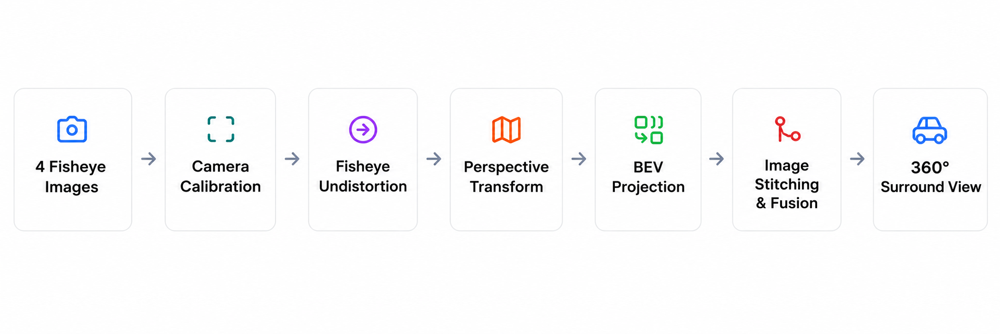
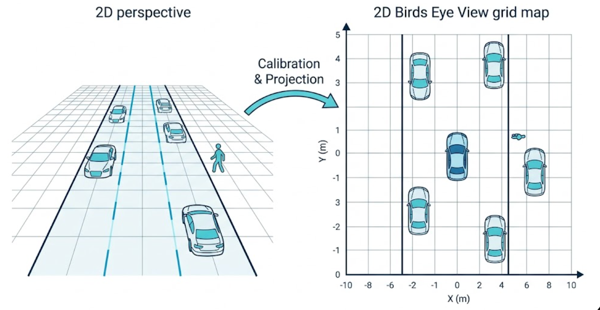
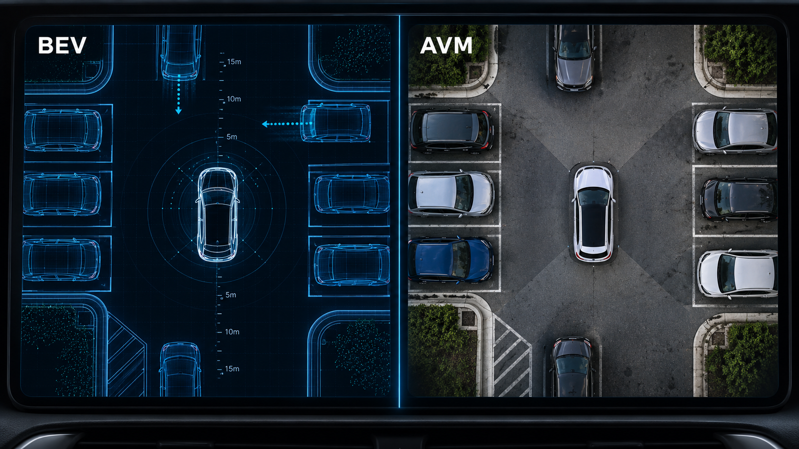
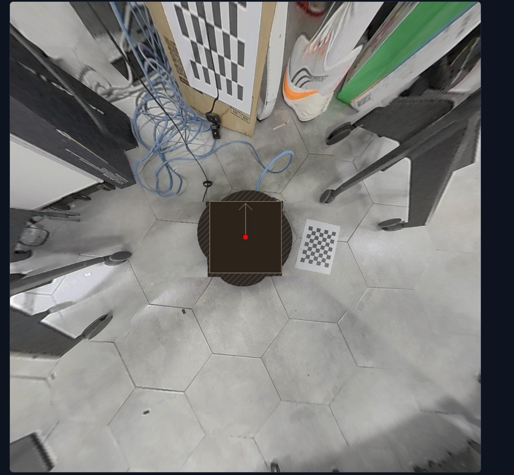

# 2.4 Multi-Camera BEV Stitching and Surround-View Perception Basics

## Course Overview

Calibration answers "how each camera sees, where it is mounted, and which way it faces"; stitching answers "how to lay what the four cameras see onto a single map". By the end of 2.3, `calib_results/` already holds the four directions' intrinsics files and one `extrinsics.json`. This chapter puts those parameters to real use: first explain the geometry of projection and stitching thoroughly, then run the real-time bird's-eye view on the Jetson.

### Before You Start: What This Lesson Will Walk You Through

| Stage | What you will understand | What you can ultimately do |
| --- | --- | --- |
| Read | How the homography $H$ maps "points on the ground" to "pixels in the image" | Follow each step of BEV projection, no longer treating stitching as a black box |
| See through | Why the four camera views can share one canvas without fighting | Diagnose seam misalignment, brightness mismatch, and coverage gaps |
| Run | How `avm_ros2` consumes the calibration results and which topics it publishes | Get a real-time BEV in RViz2 and verify it item by item |

The entire surround-view perception pipeline can be divided into six stages: 4 fisheye inputs → camera calibration → fisheye undistortion → perspective transform / BEV projection → image stitching and blending → output a 360° surround view. **2.3 advanced has already produced** `calib_results/{front,back,left,right}.json`, `extrinsics.json`, and 4 `equidistant` YAML files. This chapter does not recalibrate; it only consumes these files and runs the last four stages into a real-time BEV.



### Learning Outcomes

- Understand the geometric meaning of the homography $H$, and articulate its relationship to the intrinsics/extrinsics solved in 2.3.
- Understand where the "inverse" in inverse perspective mapping (IPM) lies: from each BEV canvas pixel, step all the way back to the sampling position in the fisheye source image.
- Understand the multi-camera fusion strategy: hard ownership selection, narrow transition band, brightness gain alignment, and seam refinement, and what problem each one guards against.
- Run the `avm_ros2` real-time BEV pipeline on the Jetson, and view/verify its output in RViz2.
- Know the failure boundaries of the planar assumption, and judge which content in a BEV image is trustworthy and which is only a projection artifact.
- Distinguish metric BEV, `valid_mask`, and the surround/bowl observation view, and explain why unknown regions must not be filled with color.

### Hardware and Software Checklist

| Category | Description |
| --- | --- |
| Compute platform | reComputer J501 (Jetson AGX Orin 32GB, JetPack 6.2.1, ROS 2 Humble) |
| Cameras | 4 × GMSL 3G fisheye cameras (Hov 198) on a fixed bracket at 90° intervals, already calibrated for intrinsics/extrinsics per 2.3 |
| Calibration board | A4 chessboard (8×6 inner corners, 25 mm square; used for 2.3 extrinsic placement) |
| ROS 2 packages | `avm_ros2` (BEV rendering and topic output), `j501_avm_calib` (camera driver and calibration config), RViz2 |
| Calibration results | Four-direction intrinsics json under `calib_results/` and `extrinsics.json` (2.3's output, this chapter's direct input) |

### Prerequisites

Complete 2.3 advanced: `~/workspace/ros2_bev/calib_results/` should already contain the four-direction json and `extrinsics.json`, plus `camera_info/<dir>.yaml` (`distortion_model: equidistant`). The main-line `plumb_bob` YAML cannot be used as input to this chapter.

- Homogeneous coordinates and matrix multiplication (a continuation of 2.3's prerequisites; this chapter also makes heavy use of matrix inverses).
- ROS 2 basics: launch, topic subscription, RViz2 display configuration.

## Read First: From Calibration Results to a Bird's-Eye View

### Why Do We Need BEV?

BEV (Bird's Eye View) converts the world as seen by cameras into a top-down map. An ordinary camera captures a perspective image — near objects large, far objects small — from which it is hard to directly judge real positions between objects; BEV, by contrast, uses the calibration information to project the road-surface content onto one plane, making vehicles, pedestrians, and obstacles all appear as if on a map. This is not only more intuitive for people, but also makes it easier for machines to compute distances, judge relative positions, and plan motion. So, whether for a car's 360° surround view, automated parking, or a robot's environment perception, the core role of BEV is: turning the "seen image" into an "understandable spatial map".



### From Calibration Results to a Map: the Homography H

The geometry of BEV stitching rests almost entirely on one assumption: **the ground around the vehicle is approximately a plane**. Under this assumption the 3D world collapses to 2D, and each point on the ground can be described by just two coordinates $(X, Y)$ (the frame follows 2.3's vehicle-body frame, with `base_link` as the origin).

For each camera, the $H$ solved by 2.3's extrinsic calibration describes exactly the correspondence between "ground points" and "image pixels":

$s \begin{bmatrix} u \\ v \\ 1 \end{bmatrix} = H \begin{bmatrix} X \\ Y \\ 1 \end{bmatrix}$

where $(X, Y)$ is the ground point's position in the vehicle-body frame, $(u, v)$ is its pixel coordinate in that camera's image, and $s$ is a per-point scale factor; "multiply by the same matrix and then divide once more" is the hallmark of a projective transform. $H$ is a 3×3 matrix with 8 degrees of freedom, so 4 pairs of "ground point ↔ pixel point" correspondences suffice to solve it.

$H$ is not some new magic parameter — it is the compression of 2.3's entire imaging chain onto the ground plane. For the pinhole model, if the ground is set to $Z=0$, the full projection formula collapses into one matrix:

$H = K \begin{bmatrix} r_1 & r_2 & t \end{bmatrix}$

that is, the intrinsics $K$ multiplied by the first two columns of the extrinsic rotation and the translation. But this project does not derive $H$ from $K, R, t$ — it does **direct measurement**: during 2.3's extrinsic calibration, the chessboard is laid flat on the ground and its placement is tape-measured (near edge 0.35 m from the vehicle center); the corners' ground coordinates are measured, their pixel coordinates are detected, and `findHomography` solves $H$ directly from these correspondences. This bypasses model error: $H$ encapsulates "how this camera sees this patch of ground" as a whole — whatever it was at calibration time is exactly how it is used at run time.

**One-line memory aid:** $T_{base_camera}$ answers "where the camera is mounted on the vehicle and which way it faces"; $H$ answers "where a point on the ground lands in its image". The former serves RViz's TF; the latter serves BEV projection.

### Inverse Perspective Mapping: Where Each BEV Canvas Pixel Samples Its Color

With $H$ in hand, the most direct mental model is "project the source image onto the ground". But the implementation asks in reverse: **for this pixel on the BEV canvas, which source-image pixel does it correspond to?** Answering "where do you come from" pixel by pixel fills the entire canvas in a single pass — no holes, and no need to handle one-to-many. That is what the "inverse" in inverse perspective mapping (IPM) means.

The textbook route is two-stage: first undistort the fisheye into an ordinary perspective image, then apply a perspective transform to the undistorted image. It is intuitive and checkable mid-way, but the undistortion canvas has a limited size, and a large-FOV fisheye loses its edges. This project uses **direct backward mapping**: skip the intermediate canvas and step from the BEV pixel all the way back to the original fisheye pixel. With the default parameters (600×600 canvas, 4×4 m ground extent) as an example, each pixel goes through five steps:

**Step 1: canvas pixel → ground coordinates.** The canvas center is the vehicle center; the scale is $s_{px} = \text{canvas_px} / \text{view_m} = 600 / 4 = 150$ pixels/meter:

$X = \frac{u - c}{s_{px}}, \qquad Y = -\frac{v - c}{s_{px}}$

$Y$ takes a minus sign because image coordinates grow downward, while the top of the canvas is the vehicle's forward direction.

**Step 2: ground → undistorted image coordinates.** The $H$ saved at calibration maps undistorted-image pixels onto the calibration canvas (1000×1000, 100 pixels/meter). Compose it with a view transform $T_{view}$ (scaling/translating the calibration-canvas coordinates to the current canvas) into $H_s = T_{view} \cdot H$, then invert it, to send the current canvas pixel back into the undistorted image:

$\begin{bmatrix} u_d \\ v_d \\ 1 \end{bmatrix} \sim H_s^{-1} \begin{bmatrix} u \\ v \\ 1 \end{bmatrix}$

**Step 3: undistorted coordinates → normalized coordinates.** Left-multiply the homogeneous coordinates by the inverse undistortion intrinsics $K_{new}^{-1}$, then divide by the third component to get $(x, y)$. This is exactly what the "normalized image coordinates" section of 2.3 describes. $K_{new}$ is generated at calibration with balance=0.8 (0 = crop all invalid regions, 1 = keep the full field of view, 0.8 leans toward keeping).

**Step 4: normalized coordinates → fisheye source-image pixels.** This step is the most counterintuitive and elegant: in 2.3, the distortion $D$ is the error to be removed, yet here it is **used in the forward direction**. `cv2.fisheye.distortPoints` warps the ideal ray position $(x, y)$ by the fisheye model to get $(u_{raw}, v_{raw})$, the position the real lens actually captures it at.

2.3's imaging chain runs forward from "world → pixels"; this chapter's chain is the **reverse trip** along the same road:

$(u, v)_{bev} \xrightarrow{\ \div s_{px}\ } (X, Y) \xrightarrow{\ H_s^{-1}\ } (u, v)_d \xrightarrow{\ K_{new}^{-1}\ } (x, y) \xrightarrow{\ \text{fisheye } D\ } (u, v)_{raw}$

**Step 5: lookup-table sampling.** Together, the five steps compute one source-image sampling coordinate for each canvas pixel. The whole lookup table (mapx / mapy) is built only once; at run time `cv2.remap` samples with interpolation, with no per-frame matrix solving — this is what makes the "real-time" verification item at the end of the chapter hold up.

The full direction of this chain: the main chain runs left-to-right through five transforms, and only the pixels that also pass the three gates below count as valid support — that is what makes a sampling genuinely trustworthy.

### One Mapping, Three Gates

A coordinate computed by backward mapping is mathematically valid but not necessarily physically worth sampling. Direct sampling would introduce three kinds of "fake pixels", so the code sets one gate for each:

| Gate | What it blocks | Criterion |
| --- | --- | --- |
| In-bounds check | Sampling coordinates that fall outside the source image | $0 \le u_{raw} < w$ and $0 \le v_{raw} < h$ |
| Ground forward branch | The homography's inverse mapping has two branches: the real ground in front of the camera, and the folded image behind it (the latter would flip the view to the opposite side of the vehicle) | Same-side test against the chessboard reference points saved at calibration (insensitive to a global sign flip of $H$) |
| Angular sector | Homography extrapolation: extending one camera's view beyond its line-of-sight sector | Per camera, a soft sector around its own line of sight: full weight within half-angle 50°, zero beyond 75° |

The three gates each block one thing: the in-bounds check blocks "sampling outside the image"; the homography forward branch blocks "folding to the opposite side of the vehicle"; the angular sector blocks "extrapolating one camera's view into a sector it cannot see". Their intersection is this camera's **valid support**. The union over all four cameras is the set of pixels genuinely observed, published as `/avm/bev/valid_mask`. Pixels with no camera support remain unknown: `owner` only picks among forward-sector scores and never borrows from neighboring cameras to fill in. Once an unknown region is painted, the local map will treat the hole as traversable ground. An unobserved ratio below 5% outside the vehicle-body region (0.46×0.46 m) is the pipeline's health line.

### Multi-Camera Stitching and Blending

The four cameras sit 90° apart, and the fisheye FOV far exceeds 90°, so adjacent views necessarily overlap. Overlap is the source of stitching quality (2.3's seam refinement happens in the overlap band), but it also raises a question: in the overlap region, who owns each pixel?

The naive answer is a weighted average. But averaging costs **ghosting**: the same object's projections in the two adjacent views always differ by a few pixels, and averaging over a wide region smears that difference into a blurred double image.

This project's approach is "hard first, then soft":

**Hard ownership selection (owner)**: each canvas pixel belongs to exactly one camera — the one with the highest "angular-sector weight × valid support" score. Pixels with no camera support stay unknown and are not borrowed from neighbors to fill in.

1. **Narrow transition band**: apply Gaussian smoothing only within 4 cm (`transition_m` = 0.04) on either side of the ownership boundary. A hard boundary flickers between frames, a wide transition ghosts; 4 cm is the compromise between the two.
2. **Brightness gain alignment**: multiply each camera by a scalar gain estimated from the median brightness ratio in the overlap region (least squares in log domain, front anchored at 1.0, clamped to 0.85–1.15), flattening the four cameras' exposure differences.
3. **Seam refinement (optional)**: run once when the scene is static: use graph cut within a ~6 cm band on either side of the stable ownership boundary to nudge the seam along the path of minimum image difference, routing the seam "around" high-difference content.

The whole blending pipeline: the main chain is the per-frame rendering path; gain and seam refinement are one-time optimization side branches run after calibration.

The final composite is one line of weighted overlay:

$I_{bev} = \frac{\sum_{d} g_d \, w_d \, \mathcal{W}_d(I_d)}{\sum_{d} w_d}$

where $\mathcal{W}_d$ is the $d$-th camera's lookup-table projection, $w_d$ is the transition-band weight, and $g_d$ is the gain. The 0.46×0.46 m region covered by the vehicle body itself is masked out — none of the four cameras can see beneath its own chassis.

**One-line memory aid:** the contradiction in stitching is "seams must be smooth" vs. "objects must not be cut in half"; the solution is a narrow transition band plus routing the seam along a low-difference path, rather than large-scale averaging.

### BEV and AVM

BEV (Bird's Eye View) is a "top-down spatial map", while AVM (Around View Monitor) is a "360° surround-view feature for people". BEV's focus is unifying the multiple cameras' views into one coordinate frame so the system can understand an object's position, distance, and motion relationships; **AVM, on top of that, stitches and blends these views into an intuitive bird's-eye image** for the driver to observe the vehicle's surroundings. **BEV is about "understanding space"; AVM is about "presenting space"** — the former leans towards machine perception, the latter towards human-machine interaction, and modern automotive surround-view systems are usually built on BEV technology.

The live system splits these two apart: `/avm/bev/metric/image` is the 4×4 m measurable ground map, which may only enter the local map together with `valid_mask`; `/avm/bev/surround/image` is the bowl observation view for humans, whose geometry cannot be used as a ruler. The official name for coverage is `valid_mask`: unknown stays unknown.



### The Limits of the Planar Assumption

The only precondition for the homography to hold is "the point is on the ground". For content off the ground, what the BEV image shows is not its true shape but the projection of its contact relationship with the ground:

- **Off-ground objects are stretched**: pedestrians, tables, and chairs appear in BEV as smears pointing toward the camera: the contact point is correct, but the "height" becomes a streak along the line of sight. When judging obstacles, trust the contact point, not the smear outline.
- **Ground undulation**: ramps and curbs break the planar assumption, and the projection drifts with them; this course's flat indoor floor is acceptable.
- **Lighting differences**: gain alignment compensates small differences; when the four cameras' auto-exposure differs a lot, fix exposure and white balance at the source (echoing 2.3's pre-calibration check).
- **Time phase**: `avm_bev` takes each camera's latest frame independently (0.7 s timeout marks it invalid) and does no hardware synchronization. When the vehicle is stationary it is imperceptible; while moving, stitching shows momentary misalignment.

One more reminder that echoes the end of 2.3: this section's BEV is a **ground-plane** projection, not 3D reconstruction. It provides "reliable ground-view input" for occupancy grids and navigation, but does not predict the shape of off-ground objects. The project has a separate neural BEV mainline (BEVDet regresses 3D perception directly from the multi-camera images); it is a different route from this chapter's classic geometric stitching and is not expanded here.

## Hands-On: Run the Calibration Results into a Real-Time Bird's-Eye View

Step numbering continues from 2.3 advanced: the calibration station has already handed off the files. This chapter **does not recalibrate**. Before starting, stop the calibration station (V4L2 mutual exclusion), then run `avm_ros2` on the Jetson. The web `/bev` is only a preview; formal acceptance looks at the ROS topics.

### Step 5: Build the AVM ROS 2 Package

`avm_ros2` only subscribes to ROS 2 image topics, renders the BEV, and publishes the result; it does not open `/dev/video*` directly — ownership of the camera device remains with the driver and the calibration station.

```bash
cd /home/seeed/workspace/ros2_bev/ros2_ws
source /opt/ros/humble/setup.bash
source /home/seeed/ros2_ws/install/setup.bash
colcon build --packages-select avm_ros2 --symlink-install
source install/setup.bash
```

### Step 6: Launch Real-Time BEV Stitching

```bash
ros2 launch avm_ros2 avm_rviz.launch.py start_camera_driver:=true
```

If the four `/cameras/{front,back,left,right}/image_raw` topics already have publishers (e.g., bag playback), you can drop `start_camera_driver` and start rendering only. The course hands-on practice launches the driver together by default. If the calibration station is not stopped, you will hit device busy and capture no frames.

```bash
ros2 launch avm_ros2 avm_rviz.launch.py
```

> **Tip:** the calibration station `calib_web.py` and the camera driver mutually exclude each other on the V4L2 device: stop the calibration station before starting `start_camera_driver`, otherwise you will hit device busy and capture no frames.

RViz2 opens a pre-configured view automatically, showing `/avm/bev/image_annotated` by default (with health status overlay). For measurement, tick `/avm/bev/metric/image` and `/avm/bev/valid_mask`; `/avm/bev/surround/image` is for observation only — its geometry cannot serve as a ruler. The old names `/avm/bev/image` / `/avm/bev/coverage` are compatibility-only. Common parameters of the BEV rendering node `avm_bev`:

| Parameter | Default | Meaning |
| --- | --- | --- |
| `view_m` | 4.0 | Ground coverage extent (meters); canvas center is the vehicle center |
| `canvas_px` | 600 | Canvas side length (pixels), can be 400–1000; detail vs. latency trade-off |
| `rate_hz` | 5.0 | Rendering frequency |
| `transition_m` | 0.04 | Seam transition-band width (meters) |
| `require_all_cameras` | true | No image is produced if any one of the four cameras is missing (can be turned off during troubleshooting) |

Main output topics:

| Topic | Content |
| --- | --- |
| `/avm/bev/metric/image` | 4×4 m measurable ground map. May only enter the local map together with `valid_mask` |
| `/avm/bev/surround/image` | Bowl observation view for humans; geometry cannot serve as a ruler |
| `/avm/bev/valid_mask` | mono8 trustworthy ground pixels; unknown stays unknown, filling forbidden |
| `/avm/bev/camera_mask` | mono8 final ownership: 0 = unknown, 1–4 = the four cameras |
| `/avm/local_costmap` | 4×4 m, 5 cm/cell occupancy grid (-1 unknown / 0 free / 50 candidate / 100 persistent candidate) |
| `/avm/bev/diagnostics` | Rendering backend (cuda/cpu), coverage ratio, four-camera online status |

RViz also shows `/avm/bev/image_annotated` (with health overlay; not a ruler). The old names `/avm/bev/image` and `/avm/bev/coverage` are just compatibility aliases for metric / valid_mask. Input can be either the calibration resolution 1920×1536 or the driver's 960×768 DDS stream; the renderer scales the sampling table by the same ratio, so the geometry does not distort.



### Step 7: Verify and Tune

- **Seam alignment**: observe adjacent cameras' overlap regions — the chessboard should be continuous at the seam with no misalignment; on obvious misalignment, recalibrate the corresponding camera's extrinsics.
- **Distance accuracy**: place an object of known size at different positions, measure it on `/avm/bev/metric/image`, and check `/avm/bev/valid_mask` at the same time to confirm observational coverage. The surround/bowl view cannot be used as a ruler.
- **Brightness consistency**: when cameras differ a lot in exposure/white balance, fix exposure and white balance first (see 2.3's pre-calibration check), then rely on gain alignment.
- **Real-time performance**: prefer remap lookup tables over per-frame matrix computation. This project is already implemented that way; check `/avm/bev/diagnostics` to confirm the rendering backend and coverage are healthy. Unknown pixels must stay unknown — do not fill them on the image.

### Run the Code

> **Note**: replace `<Jetson IP>` with your Jetson's actual IP. Find it by running `hostname -I` on the Jetson; do not reuse a fixed address.

This chapter's code lives in `code/2.4_bev_avm/` of this repository; the core is `ros2_ws/src/avm_ros2`. The remaining `bev_*` / `bevdet_vendor` packages under `ros2_ws/src/` are the neural BEV mainline; their inference depends on CUDA/TensorRT and model files not checked in, so they are source reference only. Calibration tools are shared with 2.3 and not duplicated here: see [2.3](../2.3_Camera_Calibration/README_en_US.md) and `code/2.3_camera_calibration/` for `j501_avm_calib` and `calib_web.py`.

**clone / obtain the code** (push from this repo's checkout to the Jetson)

```bash
scp -r code/2.4_bev_avm/ros2_ws/src/avm_ros2 \
      seeed@<Jetson IP>:~/workspace/ros2_bev/ros2_ws/src/
```

`avm_ros2` depends on the `j501_avm_calib` already built in 2.3: `start_camera_driver:=true` in the launch file pulls up its `camera_driver` node. Before deployment, complete 2.3's "Run the Code" section and make sure the package can be sourced from `~/ros2_ws`.

**configure (build)**

```bash
cd ~/workspace/ros2_bev/ros2_ws
source /opt/ros/humble/setup.bash
source ~/ros2_ws/install/setup.bash        # 提供 j501_avm_calib 的接口与驱动
colcon build --packages-select avm_ros2 --symlink-install
source install/setup.bash
```

**run (launch)**

```bash
# 标定台 calib_web.py 与相机驱动互斥占用 V4L2，先停掉
pkill -f calib_web.py || true
ros2 launch avm_ros2 avm_rviz.launch.py start_camera_driver:=true
```

**Verify topics**: confirm `/avm/bev/metric/image`, `/avm/bev/valid_mask`, `/avm/bev/surround/image`, and `/avm/bev/diagnostics` keep publishing; view `/avm/bev/image_annotated` in RViz.

## Deliverables and Acceptance Criteria

### Deliverables Checklist

1. A running real-time BEV pipeline: `/avm/bev/metric/image` and `/avm/bev/valid_mask` keep publishing.
2. RViz2 screenshots: metric BEV and valid_mask, with a chessboard or known-size object placed at the seam. One surround image may be attached, but it is not a measurement basis.
3. (Advanced) before/after screenshots of one seam refinement (the calibration station web page provides the before/after comparison).

### Acceptance Criteria

| Check | Pass criterion | When failing, inspect first |
| --- | --- | --- |
| Stitching geometry | Ground lines are continuous at the seams with no obvious misalignment | Extrinsic placement measurements, whether intrinsics are stale, whether all four cameras are online. For seam misalignment, go back to the corresponding direction in 2.3 `/extrinsics`, not the intrinsics page, unless the intrinsics themselves are stale |
| Coverage health | Unobserved ratio outside the vehicle-body region < 5%; unknown regions stay unknown and are not filled from neighbors | Camera dropouts (diagnostics), sector and branch gates |
| Brightness | No visible brightness jumps in the overlap region | Four-camera exposure fixed, whether gain alignment is effective |
| Real-time | `/avm/bev/metric/image` keeps publishing, diagnostics has no ERROR | Rendering backend, `canvas_px`, input resolution |

## FAQ and Troubleshooting

### BEV Produces No Image At All

- **Cause**: `require_all_cameras` is true and one direction's topic is missing or timed out (0.7 s).
- **Solution**: check each direction with `ros2 topic hz /cameras/front/image_raw`; during troubleshooting you can temporarily turn off `require_all_cameras` and use the partial stitching to locate which direction is the problem.

### Seam Misalignment

- **Cause**: extrinsic placement measured wrong, chessboard spec mismatch, or camera bracket deformation.
- **Solution**: stop `avm_ros2`, go back to 2.3 advanced `/extrinsics`, and recalibrate the corresponding direction. Do not go back to the intrinsics page first, unless that direction's intrinsics have been marked stale. When misalignment consistently appears at one pair of adjacent cameras, first check that direction's near_m and 180° corner ordering.

### Brightness Jumps in the Overlap Region

- **Cause**: the four cameras' auto-exposure is inconsistent, beyond gain alignment's 0.85–1.15 clamp.
- **Solution**: fix exposure and white balance, then recalibrate the extrinsics so the gain is estimated from the new overlap region.

### Launch Reports Device Busy

- **Cause**: `calib_web.py` and the camera driver mutually exclude each other on the V4L2 device.
- **Solution**: stop the calibration station, then use `start_camera_driver:=true`; or keep the default mode and let an existing topic source supply the images.

> **Next step:** after completing this section, the 360° surround view can serve as input to upper-level algorithms: when connecting lane/obstacle detection (M4) or visual SLAM (M3), feed 2.3 advanced's calibration results (`equidistant` camera_info, homography H) together with this chapter's BEV topics (`/avm/bev/metric/image`, `/avm/bev/valid_mask`, `/avm/local_costmap`) into the corresponding nodes. The surround/bowl view is for humans only.