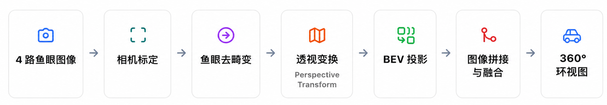
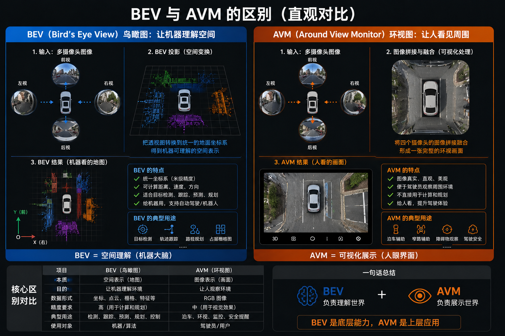

# 2.4 多相机 BEV 拼接与环视感知基础

### 硬件准备

- reComputer J501 + 4 × GMSL 3G 摄像头（Hov 198）
- A4 棋盘格 × 4
- 3D 打印的十字架（4 个摄像头间隔 90°，镜头向下倾斜 22°，安装高度 10 cm）

### 前置知识储备

#### 为什么需要BEV?

BEV（Bird's Eye View，鸟瞰图）可以理解为“把摄像头看到的世界，转换成一张从上往下看的地图”。普通摄像头拍到的是透视画面，近处大、远处小，很难直接判断物体之间的真实位置；而 BEV 会利用相机的标定信息，把路面上的内容统一投影到同一个平面上，让车辆、行人、障碍物都像出现在地图上一样。这样不仅人看起来更直观，机器也更容易计算距离、判断相对位置和规划运动路线。所以，无论是汽车的 360° 环视、自动泊车，还是机器人的环境感知，BEV 的核心作用都是：把“看到的图像”变成“可理解的空间地图”。


#### 摄像头标定

摄像头标定，就是让计算机知道“这个摄像头是怎么拍世界的”。

在 BEV（鸟瞰图）中，我们希望把摄像头里的画面，准确地投影到地面上。如果没有标定，计算机只看到一张普通图片，它并不知道：

- 镜头有多广（焦距是多少）
- 图像中心在哪里
- 鱼眼镜头弯曲了多少（畸变）
- 摄像头安装在什么位置
- 摄像头朝向哪个方向
因此，它无法判断“图像中的这个像素，对应现实世界中的哪个位置”。举个例子：你用一张纸画了一个 1 米 × 1 米的方格，然后用鱼眼摄像头拍它。由于透视和畸变，纸上的正方形在图像里会变成弯曲、大小不一的形状。标定的作用，就是建立“像素 ↔ 真实世界”的对应关系，让系统知道：这个像素实际上位于地面上的哪一个坐标。

在 BEV 中，通常需要两类标定：

- 内参标定：了解摄像头本身的成像特性（焦距、主点、畸变等），用于去除鱼眼变形。
- 外参标定：了解摄像头相对于车辆或世界的位置和姿态（平移和旋转），用于把不同摄像头统一到同一个坐标系。
只有完成这两步，系统才能把前、后、左、右四个摄像头的画面正确地“摊平”到地面，并无缝拼接成一张 360° 鸟瞰图。否则就会出现车道线对不齐、物体位置漂移、拼接缝明显等问题。

#### 流程

整个环视感知的实现可分为六个阶段：4 路鱼眼图像输入 → 相机标定 → 鱼眼去畸变 → 透视变换 / BEV 投影 → 图像拼接与融合 → 输出 360° 环视图。下文将按这个流程逐步实现。



#### BEV 与 AVM

BEV（Bird's Eye View）是一种“从上往下看的空间地图”，而 AVM（Around View Monitor）是一种“给人看的 360° 环视功能”。 BEV 的重点是把多个摄像头的画面统一到同一个坐标系中，让系统能够理解物体的位置、距离和运动关系；AVM 则是在此基础上，把这些画面拼接和融合成一张直观的鸟瞰图，方便驾驶员观察车辆周围环境。可以把它理解为：BEV 负责“理解空间”，AVM 负责“展示空间”——前者更偏机器感知，后者更偏人机交互，而现代汽车的环视系统通常就是建立在 BEV 技术之上的。



### Step by Step：多相机 BEV 拼接实操

本节以「4 路鱼眼相机 → 360° 环视图」为目标进行实操。开始前请先完成 2.1（GMSL 多相机接入）与 2.3（相机标定）的内容：确保 4 路相机能同步推流，并为每个相机拿到可用的内参与畸变系数。下面按「内参标定 → 外参/单应性 → 去畸变＋BEV 投影 → 拼接融合 → 验证」的流程逐步实现。

#### 步骤 1：组装相机与确认硬件

将 4 个鱼眼摄像头按 90° 间隔安装在 3D 打印的十字架上，镜头向下倾斜 22°、安装高度 10 cm；用 Fakra 线缆将 4 路相机接入 J501 的 GMSL 扩展板。参照 2.1 选择正确的设备树，重启后确认 4 路视频节点已出现：

```bash
ls /dev/video*
# 预期看到 /dev/video0 ~ /dev/video3
```

若需 4 路相机硬件同步曝光，参照 2.1 的 FSYNC 配置与 gmsl4_start.sh 脚本同时启动多路采集。

#### 步骤 2：启动相机并确认推流

参照 2.1 的 gmsl4_start.sh 与 2.3 的 v4l2_camera 节点，为四路相机分别启动 ROS2 节点并确认图像话题正常（分辨率按相机型号设置）：

```bash
ros2 topic list -t                    # 确认 4 路 image_raw 话题存在
ros2 topic hz /gmsl/cam0/image_raw    # 确认推流帧率稳定
```

#### 步骤 3：内参标定（鱼眼去畸变）

环视相机通常使用视场角约 198° 的鱼眼镜头，普通针孔模型无法准确描述，需用鱼眼模型求解内参矩阵 K 与畸变系数 D。若使用 ROS2 的 camera_calibration 图形工具，请参照 2.3，但鱼眼镜头应选择鱼眼/等距畸变模型；下面给出等价的 OpenCV（Kannala–Brandt）实现，便于离线批量处理每个相机的棋盘格图集。为每个相机采集 20–40 张不同姿态的棋盘格图像：

```python
import cv2
import numpy as np
import glob

pattern = (8, 6)          # 棋盘格内角点数量
square = 0.02             # 棋盘格格距（米）

objp = np.zeros((pattern[0]*pattern[1], 3), np.float32)
objp[:, :2] = np.mgrid[0:pattern[0], 0:pattern[1]].T.reshape(-1, 2) * square

objpoints, imgpoints = [], []
for f in sorted(glob.glob("calib/cam0/*.png")):
    img = cv2.imread(f)
    gray = cv2.cvtColor(img, cv2.COLOR_BGR2GRAY)
    ok, corners = cv2.findChessboardCorners(
        gray, pattern,
        cv2.CALIB_CB_ADAPTIVE_THRESH + cv2.CALIB_CB_FAST_CHECK + cv2.CALIB_CB_NORMALIZE_IMAGE)
    if not ok:
        continue
    corners = cv2.cornerSubPix(gray, corners, (11, 11), (-1, -1),
        (cv2.TERM_CRITERIA_EPS + cv2.TERM_CRITERIA_MAX_ITER, 30, 1e-6))
    objpoints.append(objp)
    imgpoints.append(corners)

h, w = gray.shape[:2]
K = np.zeros((3, 3))
D = np.zeros((4, 1))
rms, K, D, rvecs, tvecs = cv2.fisheye.calibrate(
    objpoints, imgpoints, (w, h), K, D,
    flags=cv2.fisheye.CALIB_RECOMPUTE_EXTRINSIC
          + cv2.fisheye.CALIB_CHECK_COND
          + cv2.fisheye.CALIB_FIX_SKEW)
print("cam0 RMS:", rms)
print("cam0 K =\n", K)
print("cam0 D =\n", D)
```

> 对每个相机分别执行上述标定并保存各自的 K、D，作为后续去畸变的输入。重投影误差（RMS）越低越好，一般应控制在 1 像素以内。

#### 步骤 4：外参标定与 BEV 单应性

将 4 张 A4 棋盘格平铺在十字架四周的地面上，使每张棋盘格都完整落入一个相机的视野。以内参去畸变后的图像为基础，分别求解「地面 → 图像」的单应性矩阵 H——这正是把透视画面映射到统一鸟瞰平面的逆透视变换（IPM）核心：

```python
# src_pts: 地面棋盘格角点在去畸变图像中的像素坐标
# dst_pts: 同一组角点在世界(地面)坐标系中的目标像素位置（米→画布像素）
H, _ = cv2.findHomography(src_pts, dst_pts, cv2.RANSAC, 3.0)

# 建议以十字架中心为原点建立世界/车辆坐标系：X 轴向前、Y 轴向左
# 四台相机必须共享同一地面坐标系，拼接时网格与车道线才能对齐
```

#### 步骤 5：BEV 投影（去畸变 + 逆透视变换）

运行时先做鱼眼去畸变，再经单应性 H 投影到 BEV 画布。为满足实时性，可将「去畸变 + 投影」合并为一张查找表，之后每帧只需一次 remap：

```python
# 1) 鱼眼去畸变：离线生成一次映射表
map1, map2 = cv2.fisheye.initUndistortRectifyMap(
    K, D, np.eye(3), K, (w, h), cv2.CV_16SC2)

# 2) 逐帧处理：去畸变 → 逆透视变换(IPM)到 BEV
undist = cv2.remap(frame, map1, map2, cv2.INTER_LINEAR)
bev = cv2.warpPerspective(undist, H, (bev_w, bev_h))
```

#### 步骤 6：拼接与融合

把四路 BEV 按各自在世界坐标系中的位置贴到同一张画布，形成 360° 环视图；在相邻相机的重叠区域做加权融合，消除拼接缝与亮度跳变：

```python
canvas = np.zeros((canvas_h, canvas_w, 3), np.float32)
weight = np.zeros((canvas_h, canvas_w), np.float32)

for bev, H_world in zip(bevs, H_list):
    # 每路 BEV 先贴到世界画布的对应位置
    warped = cv2.warpPerspective(bev, H_world, (canvas_w, canvas_h))
    # 该路贡献的有效区域
    w = (cv2.cvtColor(warped, cv2.COLOR_BGR2GRAY) > 0).astype(np.float32)
    canvas += warped.astype(np.float32) * w[:, :, None]
    weight += w

# 重叠区域按覆盖次数平均，得到平滑环视图
canvas = (canvas / np.maximum(weight[:, :, None], 1e-6)).astype(np.uint8)
cv2.imshow("360 AVM", canvas)
```

更平滑的效果可在重叠区域内按「到图像边界的距离」线性加权，避免简单平均带来的拼接缝。

#### 步骤 7：验证与调优

- 拼接缝对齐：观察相邻相机重叠区域，棋盘格应在接缝处连续、无错位；有明显错位时重新标定对应相机的外参。
- 距离准确性：把已知尺寸的物体放在不同位置，验证 BEV 图中比例一致，判断单应性 H 是否准确。
- 亮度一致性：各相机曝光/白平衡差异大时，先固定曝光与白平衡（见 2.3 标定前检查），再统一增益。
- 实时性：优先用 remap 的查找表替代逐帧矩阵运算，避免在全分辨率下重复计算映射。
> 完成本节后，360° 环视图可作为上层算法的输入：接车道线/障碍物检测（M4）或视觉 SLAM（M3）时，把 2.3 得到的 camera_info 与本节的外参/单应性一起配置到对应节点。

