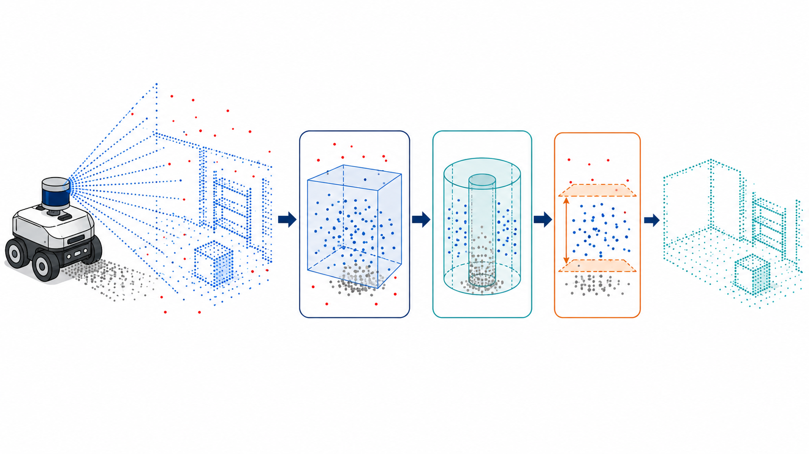
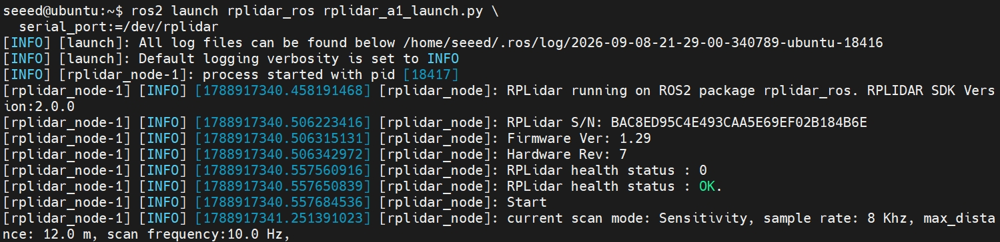
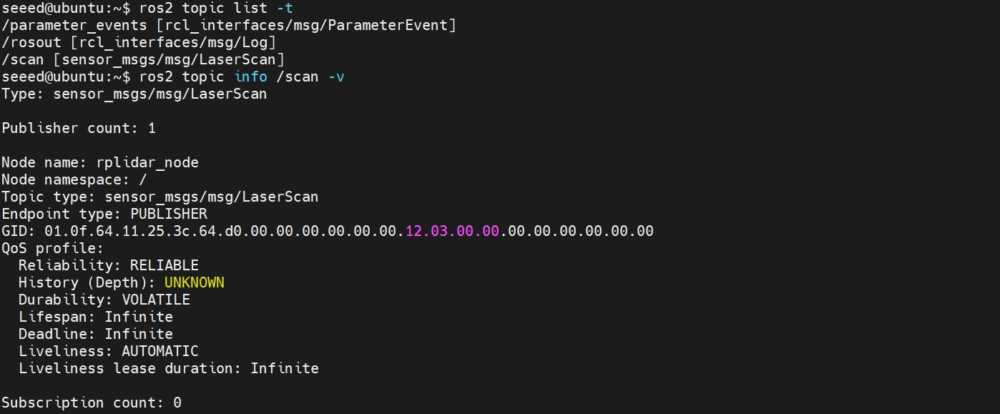
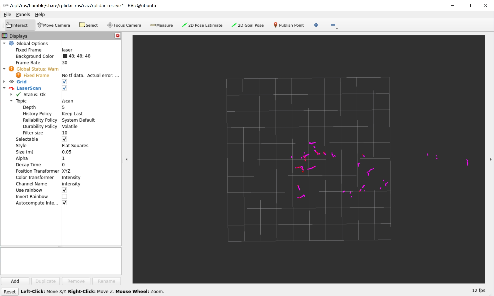
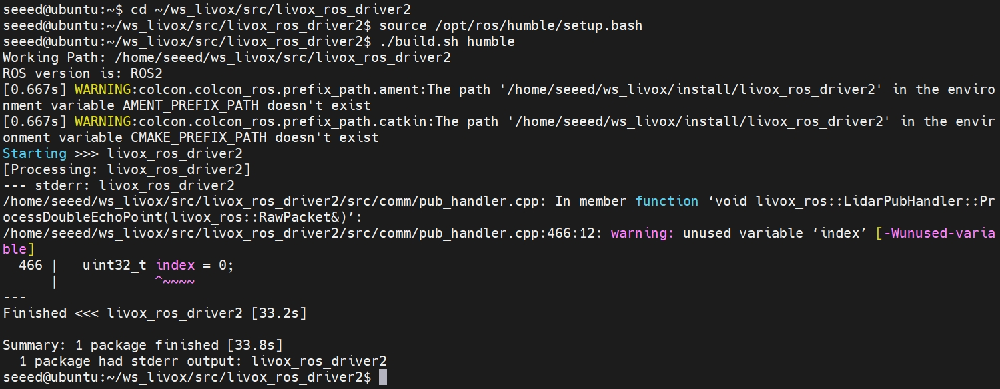
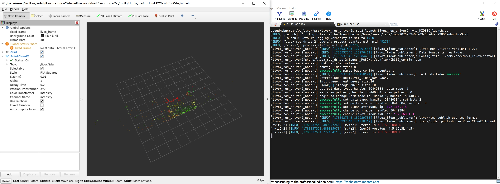

# 3.1 LiDAR Integration and Point Cloud Preprocessing

LiDAR measures the distance to objects using reflected laser light. A 2D LiDAR usually outputs one circular sequence of ranges, while a 3D LiDAR produces a spatial point cloud. This lesson focuses on making the data visible, verifiable, and clean, establishing a stable input for localization, mapping, and obstacle avoidance.



> The raw point cloud passes through spatial cropping, removal of the robot body region, and downsampling. The result preserves clear environmental structure for downstream algorithms.

## Learning Objectives

- Distinguish `LaserScan` from `PointCloud2`;
- Integrate an Ethernet or USB LiDAR with the J501;
- Inspect topic rate, bandwidth, timestamps, coordinate frames, and QoS;
- Apply range cropping, voxel downsampling, and outlier removal;
- Validate processing results with RViz2 and rosbag.

## 3.1.1 LiDAR Data Models

Time of flight can be understood as $d=c\Delta t/2$. The light travels to the target and back, so the propagation distance is divided by two.

| ROS 2 message | Common devices | Contents | Typical applications |
| --- | --- | --- | --- |
| `sensor_msgs/msg/LaserScan` | 2D LiDAR | Start angle, angular resolution, and range and intensity arrays | 2D SLAM and planar obstacle avoidance |
| `sensor_msgs/msg/PointCloud2` | 3D LiDAR and depth cameras | `x/y/z` plus optional intensity, ring number, and per-point time | 3D SLAM, detection, and ground segmentation |

`PointCloud2` is a structured binary message. Devices do not all provide the same fields, so never assume that `intensity`, `ring`, or `time` exists. A 2D LiDAR's `LaserScan` may also contain NaN, Inf, or out-of-range values. Downstream nodes must use the message's `range_min` and `range_max` to determine validity.

## 3.1.2 Hardware and Network Preparation

Prepare a J501, ROS 2 Humble, a LiDAR supported by a ROS 2 driver, the required data cable, and an independent power supply that meets the specifications. Do not power a high-power LiDAR directly from a regular USB port. Before power-up, verify voltage, peak current, polarity, and grounding.

### Ethernet LiDAR

If the LiDAR address is `192.168.1.201/24` and its dedicated interface is `eth1`, configure the host temporarily as follows:

```bash
sudo ip addr flush dev eth1
sudo ip addr add 192.168.1.100/24 dev eth1
sudo ip link set eth1 up
ip -br addr show eth1
ping -c 4 192.168.1.201
```

Use the actual parameters from the device manual. If multiple interfaces are on the same subnet, run `ip route get 192.168.1.201` to confirm that packets use the correct interface.

### USB or Serial LiDAR

```bash
lsusb
ls -l /dev/ttyUSB* /dev/ttyACM* 2>/dev/null
sudo dmesg | grep -Ei 'usb|ttyUSB|ttyACM' | tail -50
```

Use a udev rule to create a persistent device name so that reconnecting the sensor does not change its `/dev/ttyUSB*` number. Manage serial-port access through the `dialout` group instead of permanently applying `chmod 777`.

### Starting a Vendor Driver

Driver packages and parameters differ by vendor. Inspect the launch file first, then start it using this general pattern:

```bash
source /opt/ros/humble/setup.bash
source ~/robot_ws/install/setup.bash
ros2 launch <lidar_driver_package> <driver_launch_file> \
  <connection_parameters> frame_id:=lidar_link
```

The driver should publish at least `/scan` or `/points_raw`. If it publishes both vendor-specific and standard messages, the rest of this course uses the standard ROS 2 message whenever possible.

## 3.1.3 RPLIDAR A1 Integration Demonstration

This section uses the SLAMTEC RPLIDAR A1 to demonstrate the complete workflow for a 2D USB LiDAR, from installation to visualization. It is one concrete example; other 2D and 3D LiDARs still follow the general integration method above.

> Before continuing, install ROS 2 using the [beginner tutorial](https://github.com/Seeed-Projects/reComputer-Jetson-for-Beginners).
> If you are using another LiDAR model, follow the manufacturer's manual.

### Demonstration Environment

| Item | Tested configuration |
| --- | --- |
| Computing device | reComputer Robotics J5011 |
| Operating system | Ubuntu 22.04.5 LTS, aarch64 |
| ROS 2 | Humble |
| LiDAR | SLAMTEC RPLIDAR A1 |
| USB-to-serial adapter | Silicon Labs CP210x |
| ROS driver | `rplidar_ros 2.1.4` |
| SDK bundled with driver | 2.0.0 |

### Installing the Driver

```bash
source /opt/ros/humble/setup.bash
sudo apt update
sudo apt install -y ros-humble-rplidar-ros

ros2 pkg prefix rplidar_ros
ros2 pkg executables rplidar_ros
```

If you need to modify the driver, you may build it from source instead. Choose either the APT package or a source build. Avoid version confusion caused by a workspace package shadowing the system package.

### Checking the Device

```bash
lsusb
ls -l /dev/rplidar /dev/ttyUSB0
```

Under normal conditions, the CP210x device and persistent serial-port symlink appear as:

```text
ID 10c4:ea60 Silicon Labs CP210x UART Bridge
/dev/rplidar -> ttyUSB0
```

The driver package installs its udev rule at:

```text
/lib/udev/rules.d/60-ros-humble-rplidar-ros.rules
```

### Starting the Driver and Checking Health

```bash
source /opt/ros/humble/setup.bash
ros2 launch rplidar_ros rplidar_a1_launch.py \
  serial_port:=/dev/rplidar
```

The A1's default baud rate is `115200`. A successful launch produced the following log:



The driver and LiDAR controller have established communication only when device information can be read and `health status: OK` appears.

### Viewing the `/scan` Output

```bash
ros2 node list
ros2 topic info /scan --verbose
ros2 topic hz /scan
ros2 topic echo /scan --once
```



Reference test results:

| Data item | Measured result |
| --- | ---: |
| Message type | `sensor_msgs/msg/LaserScan` |
| Coordinate frame | `laser` |
| Samples per scan | 1080 |
| Finite range samples | 862 |
| Valid sample ratio | 79.8% |
| Measured nearest range | Approximately 0.121 m |
| Measured farthest range | Approximately 9.768 m |
| Configured message range | 0.15–12 m |
| Scan coverage | Nearly 360° |
| Mean ROS message rate | Approximately 7.55 Hz |

The driver reports a target rate of 10 Hz, while the measured ROS message rate was approximately 7.55 Hz. Mechanical rotation speed, scan mode, and angle compensation can affect the result. The measured 0.121 m value is less than the declared `range_min=0.15 m`; applications must not treat this point as a reliable obstacle.

Start the driver and RViz2 together:

```bash
ros2 launch rplidar_ros view_rplidar_a1_launch.py \
  serial_port:=/dev/rplidar
```

Alternatively, if the LiDAR driver is already running, start only RViz2:

```bash
rviz2 -d /opt/ros/humble/share/rplidar_ros/rviz/rplidar_ros.rviz
```

Do not run the view launch file while the regular launch file is active. The view launch starts a second `rplidar_node`, causing both nodes to contend for the serial port.



## 3.1.4 Livox MID-360 Integration Demonstration

This section uses the Livox MID-360 to demonstrate a 3D Ethernet LiDAR. Unlike the RPLIDAR A1, which publishes a two-dimensional `LaserScan` over USB serial, the MID-360 transmits a 3D point cloud over a wired network and also publishes high-rate IMU data.

### Demonstration Environment and Network Topology

| Item | Tested configuration |
| --- | --- |
| Computing device | reComputer Robotics J5011 |
| Operating system | Ubuntu 22.04.5 LTS, aarch64 |
| ROS 2 | Humble |
| LiDAR | Livox MID-360 |
| ROS driver | Livox ROS Driver2 1.2.7 |
| Jetson wired IP | `192.168.1.5` (static) |
| MID-360 IP | `192.168.1.3` |

The test used two network adapters: the wired interface connected directly to the LiDAR, while Wi-Fi retained external network access. The interfaces were on different subnets, and Wi-Fi continued to provide the default route.

```bash
ip -br link
ip -br addr
ip route
```

Reference configuration:

```text
enP8p1s0   192.168.1.5/24       # Dedicated wired LiDAR interface
wlP1p1s0   192.168.3.188/24     # Wi-Fi external network
```

Check the LiDAR link:

```bash
ping -I enP8p1s0 -c 3 192.168.1.3
ip neigh show dev enP8p1s0
```

The reference test sent and received three packets with 0% loss and approximately 1.6 ms mean latency. The LiDAR interface does not need a default gateway; adding one may disrupt Wi-Fi connectivity.

### Installing Livox-SDK2

```bash
cd ~
git clone https://github.com/Livox-SDK/Livox-SDK2.git
cd ~/Livox-SDK2
mkdir -p build
cd build
cmake ..
make -j$(nproc)
sudo make install
sudo ldconfig
```

After installation, the SDK shared library and headers are normally under `/usr/local/lib` and `/usr/local/include`. Check them with:

```bash
ls -l /usr/local/lib/liblivox_lidar_sdk_shared.so
ls -l /usr/local/include/livox_lidar_api.h
```

### Installing and Building Livox ROS Driver2

```bash
mkdir -p ~/ws_livox/src
cd ~/ws_livox/src
git clone https://github.com/Livox-SDK/livox_ros_driver2.git

cd ~/ws_livox/src/livox_ros_driver2
source /opt/ros/humble/setup.bash
./build.sh humble
```

The reference build produced:



Load and inspect the workspace:

```bash
source /opt/ros/humble/setup.bash
source ~/ws_livox/install/setup.bash
ros2 pkg prefix livox_ros_driver2
ros2 pkg executables livox_ros_driver2
```

### Configuring the Host and LiDAR IP Addresses

Edit the driver configuration:

```bash
nano ~/ws_livox/src/livox_ros_driver2/config/MID360_config.json
```

The key settings from the reference test are:

```json
{
  "MID360": {
    "host_net_info": {
      "cmd_data_ip": "192.168.1.5",
      "push_msg_ip": "192.168.1.5",
      "point_data_ip": "192.168.1.5",
      "imu_data_ip": "192.168.1.5"
    }
  },
  "lidar_configs": [
    {
      "ip": "192.168.1.3",
      "pcl_data_type": 1,
      "pattern_mode": 0
    }
  ]
}
```

Every `host_*_ip` value must use the host's wired IP on the same subnet as the MID-360, not the Wi-Fi IP. The reference device used control, push, point-cloud, IMU, and log ports in the `56100–56501` range. Do not change them without understanding the protocol.

After modifying the configuration in the source directory, rebuild:

```bash
cd ~/ws_livox/src/livox_ros_driver2
./build.sh humble
source ~/ws_livox/install/setup.bash
```

### Starting Custom Point Cloud and IMU Output

```bash
source /opt/ros/humble/setup.bash
source ~/ws_livox/install/setup.bash
ros2 launch livox_ros_driver2 msg_MID360_launch.py
```

When the driver connects successfully, the reference log contains:

```text
Livox Ros Driver2 Version: 1.2.7
Init lds lidar success!
successfully set lidar attitude, ip: 192.168.1.3
successfully change work mode
successfully enable Livox Lidar imu, ip: 192.168.1.3
livox/imu publish use imu format
livox/lidar publish use livox custom format
```

Inspect the node and topics:

```bash
ros2 node list
ros2 topic list -t
ros2 topic info /livox/lidar --verbose
ros2 topic info /livox/imu --verbose
```

Reference output:

```text
/livox_lidar_publisher
/livox/lidar [livox_ros_driver2/msg/CustomMsg]
/livox/imu [sensor_msgs/msg/Imu]
```

`CustomMsg` stores the frame time base, point count, device identifier, and point array. Each point contains `x/y/z`, reflectivity, tag, scan-line number, and relative time `offset_time`. Per-point relative time is essential for motion undistortion.

### Starting PointCloud2 and RViz2

To demonstrate standard `PointCloud2` data directly and open RViz2, run:

```bash
source /opt/ros/humble/setup.bash
source ~/ws_livox/install/setup.bash
ros2 launch livox_ros_driver2 rviz_MID360_launch.py
```

Set RViz2 `Fixed Frame` to `livox_frame` and add the `PointCloud2` topic published by the driver. `msg_MID360_launch.py` targets algorithms that require Livox per-point fields, while `rviz_MID360_launch.py` is better suited to standard point-cloud visualization and the general preprocessing pipeline in this lesson.



### Measured Data Performance

```bash
ros2 topic echo /livox/lidar --once --field header.frame_id
ros2 topic echo /livox/lidar --once --field point_num
ros2 topic echo /livox/lidar --once --field lidar_id
ros2 topic hz /livox/lidar
ros2 topic hz /livox/imu
ros2 topic bw /livox/lidar
```

Reference test results:

| Data item | Measured result |
| --- | ---: |
| Point-cloud frame | `livox_frame` |
| Points per frame | 19,968 |
| Mean point-cloud rate | 10.00 Hz |
| Point-cloud period range | 0.092–0.108 s |
| Mean IMU rate | 199.99 Hz |
| IMU period range | 0.004–0.006 s |
| Point-cloud bandwidth | Approximately 3.8 MB/s |
| Point-cloud message size | Approximately 0.40 MB |

This bandwidth indicates that raw point clouds require a stable wired connection. Continue by inspecting the NIC statistics:

```bash
ip -s link show enP8p1s0
```

Pay particular attention to RX/TX `errors`, `dropped`, `overrun`, and `carrier`. The reference test observed no NIC errors, dropped packets, device disconnects, or driver timeouts.

The test report recorded an IMU Z-axis linear acceleration of approximately `0.98` while the device was stationary. Because the standard unit for `sensor_msgs/msg/Imu` linear acceleration is `m/s²`, this magnitude alone does not prove that the IMU value is correct. Confirm the driver units, coordinate axes, and whether gravity is included, then compare the acceleration magnitude with approximately `9.81 m/s²`.

## 3.1.5 Post-Integration Checklist

For a 2D LiDAR:

```bash
ros2 topic info /scan --verbose
ros2 topic hz /scan
ros2 topic bw /scan
ros2 topic echo /scan --once --field header
```

For a 3D LiDAR:

```bash
ros2 topic info /points_raw --verbose
ros2 topic hz /points_raw
ros2 topic bw /points_raw
ros2 topic echo /points_raw --once --field header
ros2 topic echo /points_raw --once --field fields
```

Confirm:

- The rate is close to the device's stable measured value in the current mode;
- `header.stamp` is nonzero and increases with every frame;
- `header.frame_id` names an explicit sensor frame;
- The `LaserScan` range, angular coverage, and period are reasonable;
- `PointCloud2` contains at least `x/y/z`, and every additional required field actually exists;
- Publisher and subscriber QoS settings are compatible. High-rate sensors normally use the Best Effort Sensor Data QoS profile.

## 3.1.6 Data Preprocessing Pipeline

### 2D LaserScan

```text
/scan → Remove NaN/Inf → Filter by range_min/range_max
      → Apply range crop → Optional angle/robot-body mask → /scan_filtered
```

Preserve the original `header.stamp`, `frame_id`, angle fields, and timing fields during filtering. Invalid ranges are normally represented by positive infinity rather than zero so that downstream algorithms do not interpret them as obstacles touching the LiDAR.

Core logic example:

```python
import math

max_keep_range = min(8.0, msg.range_max)
filtered_ranges = [
    value
    if math.isfinite(value) and msg.range_min <= value <= max_keep_range
    else math.inf
    for value in msg.ranges
]
```

`8.0 m` is only a starting point for an indoor experiment. Adjust it to the environment and navigation costmap range. Measure the robot-body mask from the actual installation; do not copy angles from another robot.

### 3D PointCloud2

```text
Raw cloud → Remove NaN/Inf → Crop range and robot-body region
          → Voxel downsampling → Outlier removal → Frame transform → Publish
```

Range cropping retains only the region needed by the algorithm and excludes the robot's own bounding box. Voxel downsampling divides space into a grid with cell edge length $l$ and retains one representative point per voxel:

- Start with `0.03–0.05 m` for detailed indoor scenes;
- Start with `0.10–0.20 m` for outdoor or long-range scenes;
- The voxel size must not exceed the smallest obstacle size that must be preserved.

Statistical outlier removal rejects abnormal points according to their mean neighborhood distance. Radius outlier removal requires a minimum number of neighbors within a given radius. Both are computationally expensive; do not over-filter merely to make the visualization look cleaner.

PCL core pipeline example:

```cpp
pcl::CropBox<pcl::PointXYZI> crop;
crop.setInputCloud(input);
crop.setMin(Eigen::Vector4f(-10.0f, -10.0f, -0.3f, 1.0f));
crop.setMax(Eigen::Vector4f( 10.0f,  10.0f,  2.0f, 1.0f));
crop.filter(*cropped);

pcl::VoxelGrid<pcl::PointXYZI> voxel;
voxel.setInputCloud(cropped);
voxel.setLeafSize(0.05f, 0.05f, 0.05f);
voxel.filter(*downsampled);

pcl::StatisticalOutlierRemoval<pcl::PointXYZI> sor;
sor.setInputCloud(downsampled);
sor.setMeanK(20);
sor.setStddevMulThresh(1.0);
sor.filter(*output);
```

Preserve the input timestamp and `frame_id` throughout the transformation; otherwise, later synchronization and TF lookup will fail.

### Converting LaserScan to a Point Cloud

`laser_geometry` converts a 2D `LaserScan` to `PointCloud2`, allowing unified visualization or use with point-cloud algorithms:

```bash
sudo apt install -y ros-humble-laser-geometry
```

The conversion requires a correct TF. When the robot moves, a complete scan is not captured at a single instant. Use `time_increment`, IMU data, or odometry to compensate for motion distortion, as described in Section 3.3.

## 3.1.7 Recording and Reproduction

2D A1 example:

```bash
mkdir -p ~/bags/m3_rplidar_a1
ros2 bag record -o ~/bags/m3_rplidar_a1/raw \
  /scan /scan_filtered /tf /tf_static
```

3D LiDAR example:

```bash
mkdir -p ~/bags/m3_lidar
ros2 bag record -o ~/bags/m3_lidar/raw \
  /points_raw /points_filtered /tf /tf_static
```

MID-360 custom point cloud and IMU example:

```bash
mkdir -p ~/bags/m3_mid360
ros2 bag record -o ~/bags/m3_mid360/raw \
  /livox/lidar /livox/imu /tf /tf_static
```

Replay a recording with:

```bash
ros2 bag play <bag_directory>/raw/raw_0.db3 --clock
```

Set `use_sim_time` to `true` for the processing nodes and RViz2. Mixing system time with bag time commonly causes TF extrapolation errors into the past or future.

## Troubleshooting

| Symptom | Possible cause | Diagnostic approach |
| --- | --- | --- |
| No serial port appears for a USB LiDAR | Data cable, port, hub, power, or udev problem | Inspect `lsusb` and `dmesg`; replace the cable or use another port |
| Serial port operation timeout | Duplicate nodes contend for the port, or the LiDAR controller does not respond | Inspect `pgrep`, `fuser`, and the LiDAR communication cable |
| Ethernet LiDAR responds to ping but sends no data | Wrong destination IP/port, firewall, or multicast interface | Check launch parameters, routing, and driver logs |
| RViz2 displays no data | QoS, topic, or Fixed Frame mismatch | Inspect `topic info --verbose` and TF |
| Point cloud bends while moving | Motion occurs during the scan without undistortion | Synchronize time in Section 3.3 and compensate with IMU/odometry |
| CPU usage is too high | Too many points or an inefficient filter order | Crop and downsample before neighborhood filtering |
| Abnormal points appear at short range | Measurements are below the sensor's reliable minimum range | Filter according to `range_min` |

## Summary

This lesson established a general integration, inspection, preprocessing, and replay workflow for 2D and 3D LiDARs. RPLIDAR A1 and Livox MID-360 demonstrations showed the real behavior of a USB 2D LiDAR and an Ethernet 3D LiDAR. The next lesson integrates IMU, GNSS/GPS, and CAN-FD data to provide attitude, global position, and wheel-speed information for sensor fusion.

## References

- [ROS 2 Humble: sensor_msgs](https://docs.ros.org/en/humble/p/sensor_msgs/)
- [ROS 2 Humble: LaserScan](https://docs.ros.org/en/humble/p/sensor_msgs/msg/LaserScan.html)
- [ROS 2 Humble: laser_geometry](https://docs.ros.org/en/humble/p/laser_geometry/)
- [SLAMTEC rplidar_ros ROS 2 Branch](https://github.com/Slamtec/rplidar_ros/tree/ros2)
- [RPLIDAR A1 User Manual](https://bucket-download.slamtec.com/af084741a46129dfcf2b516110be558561d55767/LM108_SLAMTEC_rplidarkit_usermanual_A1M8_v2.2_en.pdf)
- [Livox-SDK2](https://github.com/Livox-SDK/Livox-SDK2)
- [Livox ROS Driver2](https://github.com/Livox-SDK/livox_ros_driver2)
- [Point Cloud Library: Filters](https://pointclouds.org/documentation/group__filters.html)
