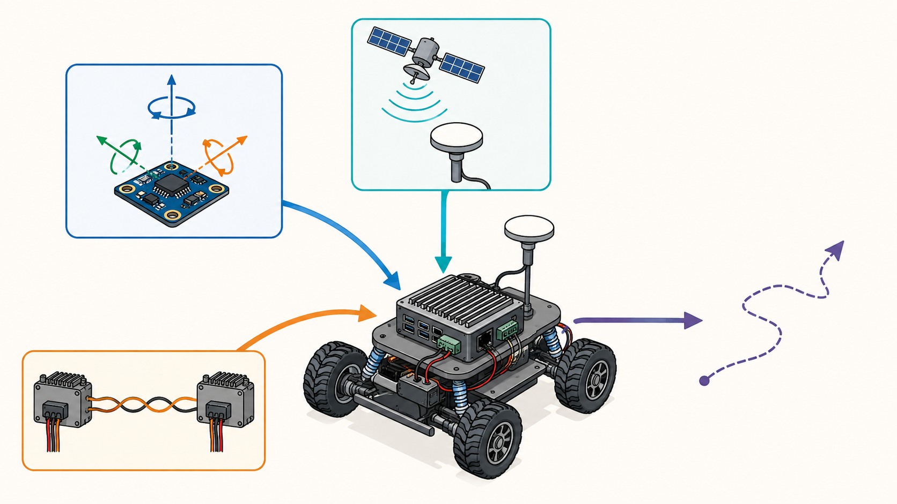
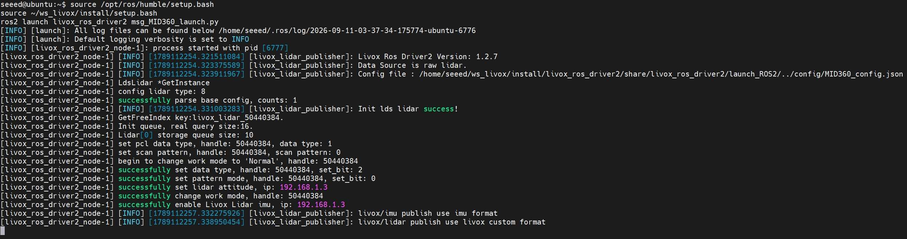
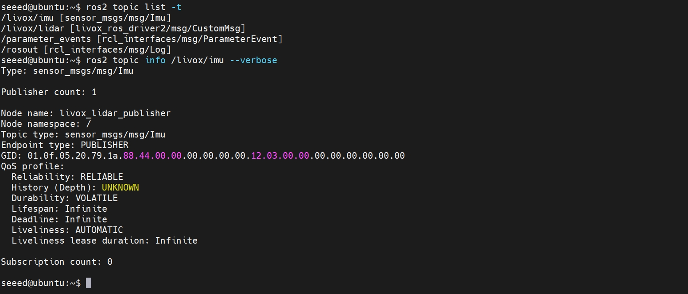
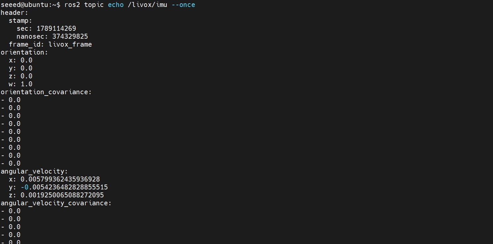

# 3.2 Integrating IMU, GPS, and CAN-FD Sensors

With LiDAR alone, a robot can observe the geometry of its surroundings but cannot reliably determine its attitude, short-term motion, or global position. This lesson adds three complementary information sources: an IMU provides high-rate angular velocity and acceleration, GNSS/GPS provides low-rate absolute position, and CAN-FD delivers chassis wheel speed, steering, and device status to the computing platform.

## Learning Objectives

- Understand the strengths and limitations of IMU, GNSS, and wheel-speed data;
- Validate `Imu`, `NavSatFix`, and `Odometry` messages;
- Enable and test CAN-FD with Linux SocketCAN;
- Generate wheel odometry with covariance from CAN signals;
- Prepare well-formed data for time synchronization and coordinate alignment in the next lesson.

## 3.2.1 How the Three Sensor Types Complement One Another

| Source | Typical rate | Strengths | Main errors |
| --- | ---: | --- | --- |
| IMU | 100–1000 Hz | Fast response; measures rotation and short-term acceleration | Bias and thermal drift; integration drifts |
| GNSS/GPS | 1–20 Hz | Provides absolute global position without accumulating long-term drift | Obstruction, multipath, position jumps, and latency |
| Wheel speed/chassis CAN | 20–200 Hz | Stable planar velocity and direct connection to the control loop | Slip, wheel-radius error, and mechanical backlash |



> The IMU captures rapid attitude changes, GNSS provides global position, and CAN-FD reports chassis motion. All three data streams enter the onboard computing platform.

Fusion is not simple averaging. It uses measurement uncertainty so that each sensor contributes on the time scale where it performs best.

## 3.2.2 IMU Integration and Validation

### Coordinate Conventions

Use a right-handed body frame whenever possible: `x` forward, `y` left, and `z` up. IMU vendors often use NED (North, East, Down) or other axis conventions. The driver must convert them to the ENU/body convention commonly used by ROS.

A standard `sensor_msgs/msg/Imu` message contains:

- `orientation`: attitude as a quaternion;
- `angular_velocity`: angular velocity in `rad/s`;
- `linear_acceleration`: linear acceleration in `m/s²`;
- Three `3×3` covariance matrices.

If the device does not provide a particular estimate, mark it unavailable according to the message specification. Do not use an all-zero covariance to pretend that it is perfectly accurate.

After starting the vendor driver, run:

```bash
ros2 topic info /imu/data --verbose
ros2 topic hz /imu/data
ros2 topic echo /imu/data --once
```

A stationary test should include:

1. Leave the unit stationary for 60 seconds; the mean angular velocity should be close to zero;
2. When the unit is level, the acceleration magnitude should be close to gravitational acceleration, although the exact axis and whether gravity has been removed depend on the driver;
3. Rotate counterclockwise about the `z` axis; according to the right-hand rule, `angular_velocity.z` should be positive;
4. Check that the orientation quaternion norm is close to 1;
5. Record how bias changes with temperature after a cold start.

> Magnetometers are easily disturbed by motors, power cables, and steel structures. Do not blindly trust absolute heading before completing magnetic calibration and verifying the installed environment.

### Real-World Example: Livox MID-360 Built-in IMU

The following example uses the Livox MID-360's built-in IMU to go beyond confirming that a topic exists and validate its rate, timestamps, static bias, units, orientation, and covariance.

#### 1. Test Environment

| Item | Tested configuration |
| --- | --- |
| Computing platform | reComputer Robotics J5011 |
| Operating system | Ubuntu 22.04.5 LTS, aarch64 |
| ROS 2 | Humble |
| Sensor | Livox MID-360 built-in IMU |
| ROS driver | Livox ROS Driver2 1.2.7 |
| Jetson wired IP | `192.168.1.5` |
| MID-360 IP | `192.168.1.3` |
| IMU topic | `/livox/imu` |
| Message type | `sensor_msgs/msg/Imu` |
| Coordinate frame | `livox_frame` |

See Section 3.1.4 for Livox-SDK2 installation, driver compilation, and MID-360 network configuration. This section begins with a working LiDAR connection:

```bash
source /opt/ros/humble/setup.bash
source ~/ws_livox/install/setup.bash
ros2 launch livox_ros_driver2 msg_MID360_launch.py
```



#### 2. Inspect the Topic, Publisher, and QoS

In a second terminal, run:

```bash
source /opt/ros/humble/setup.bash
source ~/ws_livox/install/setup.bash
ros2 topic list -t
ros2 topic info /livox/imu --verbose
```

Reference result:



This confirms the message type, single publisher, and QoS, but it does not yet prove that the numerical units and orientation fields are correct.

#### 3. Inspect One Real Message

```bash
ros2 topic echo /livox/imu --once
```

A reference message captured while stationary is shown below:



A single message reveals only the format, not stability. Collect at least several seconds of data and calculate the mean, standard deviation, time interval, and latency.

#### 4. Publication Rate, Timestamps, and Latency

```bash
ros2 topic hz /livox/imu
```

Measured command-line result:

```text
average rate: 199.99 Hz
min: 0.004 s
max: 0.006 s
```

Statistics from 2,000 consecutive messages:

| Metric | Measured result |
| --- | ---: |
| Message count | 2000 |
| Capture duration | 9.998 s |
| Rate calculated from receive time | 200.030 Hz |
| Rate calculated from message timestamps | 199.984 Hz |
| Mean timestamp interval | 4.999808 ms |
| Timestamp interval standard deviation | 0.746762 ms |
| Minimum / maximum interval | 3.803991 / 6.085605 ms |
| Non-increasing timestamps | 0 |
| Intervals greater than 7.5 ms | 0 |
| Mean message latency | 0.700 ms |
| Minimum / maximum latency | 0.360 / 1.387 ms |

In this test, `/livox/imu` remained stable at approximately 200 Hz, timestamps increased strictly, and no obvious abnormal intervals were observed. A production system must still monitor these metrics continuously; one test does not guarantee performance under every network and load condition.

## 3.2.3 GNSS/GPS Integration and Validation

GNSS is the general term for satellite navigation systems; GPS is one such system. Receivers commonly output NMEA, UBX, or vendor-specific binary protocols over UART, USB, or Ethernet. The driver should convert the data to `sensor_msgs/msg/NavSatFix`.

The reComputer Robotics J5011 includes a reserved M.2 Key B interface. A 4G/5G module with GPS positioning can be installed there. For details, see:
https://wiki.seeedstudio.com/ai_robotics_recomputer_j501_robotics_getting_started/#m2-key-b-4g5g-module

Leave the receiver stationary in an open area for 5–10 minutes and record the position scatter, status, satellite count, and covariance. When using RTK, record Fixed, Float, and standalone positioning states separately. A single Fixed observation does not mean the receiver maintained a fixed solution throughout the test.

## 3.2.4 CAN-FD Integration

Compared with Classical CAN, CAN-FD can use a higher bit rate during the data phase and carry up to 64 data bytes per frame. The two ends of the bus should have matching termination resistors. With power removed, CAN-H to CAN-L commonly measures approximately 60 Ω, subject to the actual hardware design.

Install the tools and inspect the interface:

```bash
sudo apt update
sudo apt install -y can-utils
ip -details link show can0
```

The following example uses a 500 kbit/s arbitration rate and a 2 Mbit/s data rate. These parameters must match every node on the bus:

```bash
sudo ip link set can0 down
sudo ip link set can0 type can bitrate 500000 dbitrate 2000000 fd on restart-ms 100
sudo ip link set can0 up
ip -details -statistics link show can0
```

Monitor the bus:

```bash
candump -tz can0
```

Before sending a test frame, verify that the device permits the selected ID and secure the real robot with its wheels raised, emergency stop available, or equivalent safety controls. Example CAN-FD frame:

```bash
cansend can0 123##1DEADBEEF
```

The `##` notation indicates CAN-FD; the first hexadecimal character that follows contains the FD flags. Never send arbitrary frames to a production chassis whose protocol is unknown.

### Offline Testing with Virtual CAN

When no hardware is available, use `vcan` to become familiar with the tools:

```bash
sudo modprobe vcan
sudo ip link add dev vcan0 type vcan
sudo ip link set vcan0 up

# Terminal A
candump vcan0
# Terminal B
cansend vcan0 123#11223344
```

`vcan` validates only the software transmit/receive path. It does not validate bit rates, termination, transceivers, or the physical layer.

### Real-World Example: Debugging a reComputer Robotics J5011 Dual-Motor Chassis

This example validates a reComputer Robotics J5011 connected to a chassis with two DM-H65 motors. J5011 `CAN0` connects to the shared motor bus. The left motor uses ID `0x01`, and the right motor uses ID `0x02`.

> **Distinguish CAN from CAN-FD first:** The DM-H65 motors in this example use **Classical CAN at 1 Mbit/s**. `ip -details link show can0` reports an MTU of 16, and the configuration contains neither `fd on` nor `dbitrate`. Do not apply the preceding CAN-FD configuration to these motors, or communication will fail.

#### 1. Pre-Power Checks

1. Raise and secure the chassis so the wheels cannot contact people or objects while spinning. Keep an emergency stop or chassis power disconnect within reach;
2. Verify that the J5011, motor drivers, and motor power system share a reliable ground and that CAN-H and CAN-L are not reversed;
3. With power removed, inspect the termination at both ends of the bus;
4. The checks in this section are read-only and do not issue motion commands. The first motion test requires a separate on-site safety confirmation.

#### 2. Inspect System Services and CAN0

This project provides services for CAN initialization, J5011 termination, and the chassis WebUI. Check their status first:

```bash
systemctl status dm-h65-can.service \
  dm-h65-can-termination.service \
  dm-h65-webui.service --no-pager

ip -details -statistics link show can0
```

If the services have not been configured, start the interface manually as Classical CAN at 1 Mbit/s:

```bash
sudo ip link set can0 down
sudo ip link set can0 type can bitrate 1000000 berr-reporting on restart-ms 100
sudo ip link set can0 txqueuelen 1000
sudo ip link set can0 up
```

If `dm-h65-can.service` is already active, do not repeat the manual configuration. The measured interface status was:

| Check | Measured result | Interpretation |
| --- | --- | --- |
| Link state | `UP, LOWER_UP` | Interface is enabled |
| Frame format | MTU 16, Classical CAN | Matches the DM-H65 |
| Arbitration rate | `1000000 bit/s` | Matches both motors |
| Controller state | `ERROR-ACTIVE` | Controller can currently participate in bus communication |
| Current error counters | `tx 0, rx 0` | Controller is not currently in an error-warning state |
| Automatic restart | `restart-ms 100` | Restarts 100 ms after bus-off |

#### 3. Confirm Both Motor Responses with a Read-Only Capture

The chassis WebUI periodically reads motor status, so `candump` can observe the traffic passively without sending a test frame:

```bash
timeout 4s candump -L can0
```

The test continuously showed request and response pairs similar to:

```text
can0  7FF   [4]  01 00 33 3C
can0  000   [8]  01 00 33 3C ...
can0  7FF   [4]  02 00 33 3C
can0  000   [8]  02 00 33 3C ...
```

Here, CAN arbitration ID `0x7FF` carries a read request and `0x000` carries a response. The first payload byte, `01` or `02`, is the motor ID. The driver polls these registers:

| Register | Meaning |
| --- | --- |
| `0x3C` | Bus voltage |
| `0x3D` | Driver PCB temperature |
| `0x3E` | Motor temperature |
| `0x50` | Motor position |

Requests and responses for both motor IDs appeared continuously, confirming bidirectional communication among CAN0, the wiring harness, and both nodes. Do not mistake response arbitration ID `0x000` for a motor ID, and do not guess control frames with `cansend` without understanding the protocol.

#### 4. Read the Decoded Live State

Open `http://192.168.3.201:8765` in a browser to access the chassis debugging console. The API can also be queried locally on the J5011 without writing data:

```bash
curl -s http://127.0.0.1:8765/api/state | python3 -m json.tool
```

Results from the stationary hardware test on September 11, 2026:

| Item | Left wheel `0x01` | Right wheel `0x02` |
| --- | ---: | ---: |
| Online state | Online | Online |
| Speed | 0.0 rad/s | 0.0 rad/s |
| Bus voltage | 50.23 V | 50.45 V |
| Motor temperature | 24.0 °C | 24.0 °C |
| Driver PCB temperature | 49.79 °C | 50.86 °C |

The interface was operating in hardware mode. Both motors were online and stationary, and voltage and temperature values decoded consistently. This completed the communication-loop validation without turning the wheels.

See [`hardware/robot_drivers`](../../../hardware/robot_drivers/README.md) for the driver, test scripts, and complete safety guidance.

## 3.2.5 Converting CAN Wheel Speed to Odometry

For a differential-drive chassis, let the left and right wheel linear velocities be $v_l$ and $v_r$, and let the track width be $b$:

$$
v = \frac{v_r+v_l}{2}, \qquad \omega = \frac{v_r-v_l}{b}
$$

Discrete integration gives the planar pose:

$$
\theta_{k+1}=\theta_k+\omega\Delta t
$$

$$
x_{k+1}=x_k+v\cos\theta\Delta t, \qquad
y_{k+1}=y_k+v\sin\theta\Delta t
$$

The CAN decoder node should:

1. Validate frame ID, length, endianness, sign bits, and scaling according to the protocol;
2. Use receive time or a hardware timestamp provided by the controller;
3. Detect stalled counters, timeouts, and abnormal jumps;
4. Publish `nav_msgs/msg/Odometry` with `frame_id=odom` and `child_frame_id=base_link`;
5. Populate reasonable velocity and pose covariances;
6. Ensure that only one node publishes `odom → base_link` to prevent TF conflicts.

If the chassis SDK already provides left and right wheel status, reuse its protocol parsing and safety mechanisms. Use the ROS 2 adapter layer only to standardize the message format.

## Troubleshooting

| Symptom | Possible cause | Corrective action |
| --- | --- | --- |
| IMU reports continuous rotation while stationary | Bias, thermal drift, incorrect units, or wrong axes | Warm up and calibrate the IMU; verify `rad/s` and coordinate conventions |
| GNSS supplies coordinates but the trajectory jumps | Multipath, invalid fix, or incorrect covariance | Move to an open area and inspect fix status and covariance |
| CAN interface enters BUS-OFF | Incorrect bit rate, termination, wiring, or ground reference | Stop transmitting and inspect the physical layer and error counters |
| CAN values have the wrong order of magnitude | Incorrect endianness, sign bit, or scale factor | Validate each field against the protocol and a known operating condition |
| Odometry turns in the wrong direction | Left/right wheel mapping or positive-direction convention is wrong | Raise the wheels, test at low speed, and standardize the signs |

## Summary

This lesson established IMU, GNSS, and chassis CAN-FD data paths and moved validation beyond “data exists” to trustworthy units, coordinates, timestamps, and uncertainty. The next lesson aligns the clocks and coordinate frames of these sensors.

## References

- [ROS 2 Humble: Imu Message](https://docs.ros.org/en/humble/p/sensor_msgs/msg/Imu.html)
- [ROS 2 Humble: NavSatFix Message](https://docs.ros.org/en/humble/p/sensor_msgs/msg/NavSatFix.html)
- [Linux Kernel: SocketCAN](https://docs.kernel.org/networking/can.html)
- [ROS REP-103: Coordinate and Unit Conventions](https://www.ros.org/reps/rep-0103.html)
- [Livox MID-360 Ethernet Communication Protocol](https://github.com/Livox-SDK/livox_wiki_en/blob/master/source/tutorials/new_product/mid360/livox_eth_protocol_mid360.md)
- [Livox ROS Driver2](https://github.com/Livox-SDK/livox_ros_driver2)
