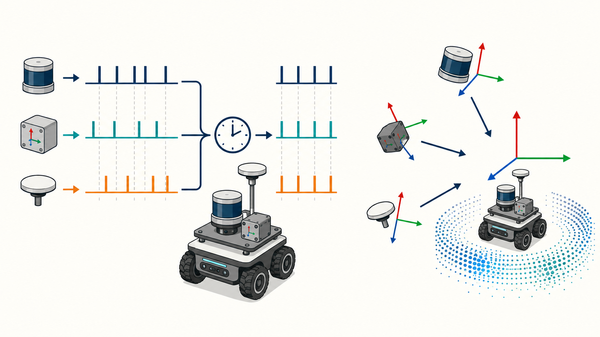

# 3.3 Multi-Sensor Time Synchronization and Spatial Alignment

Sensor fusion requires more than having every topic publish data. Each measurement must answer two questions: When was it produced? Where on the robot was it measured, and in which direction? The former is time synchronization; the latter is spatial alignment. An error in either can make a static environment appear to move while the robot is in motion.



> Figure 3.3: The left side shows timestamps from different sensors aligned to a common clock. The right side shows sensor coordinate frames transformed into the robot body frame using extrinsic parameters.

## Learning Objectives

- Distinguish sampling time, device time, host receive time, and ROS time;
- Establish a common host-level clock using chrony or PTP;
- Design a correct `map → odom → base_link → sensor_link` TF tree;
- Understand intrinsic parameters, extrinsic parameters, and coordinate conventions;
- Verify time offsets and extrinsic errors using reproducible methods.

## 3.3.1 Why Timing Matters

Suppose a robot travels at $1\,m/s$. If LiDAR and wheel-speed data differ by $100\,ms$, their corresponding positions may differ by $0.1\,m$. During rotation, even a few milliseconds of error can produce duplicated edges in a point cloud.

A sensor message may involve:

- **Sampling time**: when the physical quantity was actually measured;
- **Device time**: the timestamp recorded by the sensor's internal clock;
- **Receive time**: when the data arrived at the J501 driver;
- **ROS time**: the time domain used by the message's `header.stamp`;
- **Processing time**: when the algorithm completed processing and published its result.

Whenever possible, the driver should set `header.stamp` to the sampling time, rather than the callback start time or message publication time. Network transmission and packet batching can introduce jitter into the receive time.

## 3.3.2 Selecting a Synchronization Method

| Method | Applicable conditions | Characteristics |
| --- | --- | --- |
| Hardware trigger/sync line | Device supports Trigger, PPS, or Sync | Highest accuracy; aligns the actual sampling instants |
| PTP (IEEE 1588) | Devices and NICs support hardware timestamping | Suitable for Ethernet LiDARs, cameras, and multi-computer systems |
| GNSS PPS + time message | A GNSS receiver is available | PPS provides the second boundary; the message provides absolute time |
| NTP/chrony | General network devices | Easy to deploy for host clock synchronization; accuracy depends on the network |
| Software approximate synchronization | Timestamped messages already exist | Only pairs nearby messages; cannot repair incorrect timestamps |

The usual priority is: shared hardware clock or hardware triggering > PTP/PPS > chrony > software-only message pairing.

## 3.3.3 Host Clock Synchronization

### chrony

chrony is suitable when the J501 and development host are on the same LAN but the devices do not support hardware PTP:

```bash
sudo apt install -y chrony
chronyc tracking
chronyc sources -v
```

Inspect `System time`, `Last offset`, and the source status. Matching host clocks alone is not sufficient; the driver must still convert the sensor's device time correctly.

### PTP

First, check the NIC's timestamping capabilities:

```bash
ethtool -T eth1
ls -l /dev/ptp*
```

Typical commands for debugging a PTP slave are shown below. The actual interface, configuration, and master/slave roles depend on the network design:

```bash
sudo apt install -y linuxptp
sudo ptp4l -i eth1 -m -s
sudo phc2sys -s eth1 -c CLOCK_REALTIME -m
```

For production deployment, use systemd services and an explicit configuration file. Do not allow chrony and `phc2sys` to fight over the system clock. Record the stable range of the PTP offset and wait for clock lock before starting sensor fusion.

## 3.3.4 Diagnosing ROS 2 Timestamps

```bash
ros2 topic echo /points_raw --once --field header
ros2 topic echo /imu/data --once --field header
ros2 topic echo /wheel/odometry --once --field header
```

Use the following checks:

- Timestamps must be nonzero and monotonically increasing;
- A device restart or time-source switch must not silently move time backward;
- All messages in one rosbag must use the same time domain;
- When replaying a bag, consistently use `/clock` and `use_sim_time=true`;
- Measure latency, jitter, and packet loss separately. Low average latency does not imply low jitter.

Approximate synchronization only pairs messages whose timestamp difference falls within a threshold. A threshold that is too small frequently drops pairs; one that is too large combines measurements from different instants. Measure the timestamp-difference distribution before setting the queue length and tolerance.

```python
from message_filters import Subscriber, ApproximateTimeSynchronizer
from sensor_msgs.msg import Imu, PointCloud2

cloud_sub = Subscriber(node, PointCloud2, '/points_raw')
imu_sub = Subscriber(node, Imu, '/imu/data')
sync = ApproximateTimeSynchronizer(
    [cloud_sub, imu_sub], queue_size=30, slop=0.02)
sync.registerCallback(synchronized_callback)
```

`slop=0.02` only permits a message-time difference of approximately 20 ms; it is not a clock-synchronization method. LiDAR motion undistortion usually also requires the time offset of each point relative to the complete scan.

## 3.3.5 Building a Unified TF Tree

Recommended basic structure:

```text
map                 Global continuity is not guaranteed; corrected by localization
└── odom            Locally continuous and jump-free, but drifts over time
    └── base_link   Robot body reference frame
        ├── lidar_link
        ├── imu_link
        └── gps_link
```

- `map → odom` is normally published by global localization or SLAM;
- `odom → base_link` is normally published by odometry or a local fusion node;
- `base_link → sensor_link` is a static extrinsic transform obtained by measurement or calibration;
- Each parent-child frame pair must have exactly one publisher.

According to REP-103, the usual body-frame convention is `x` forward, `y` left, and `z` up. If a sensor's native axes differ, the driver or a fixed transform must convert them explicitly. Changing only the `frame_id` name does not transform the data.

## 3.3.6 Measuring and Publishing Extrinsics

An extrinsic transform consists of a translation $t$ and a rotation $R$:

$$
p_{base}=R_{base}^{sensor}p_{sensor}+t_{base}^{sensor}
$$

Obtain an initial estimate using a tape measure, calipers, and angle tools, then refine it using planes, wall corners, or a calibration target. Record the units, rotation order, parent and child frames, and calibration date.

The following example places the sensor 0.20 m ahead of `base_link`, 0 m to its left, and 0.35 m above it, with no rotation:

```bash
ros2 run tf2_ros static_transform_publisher \
  --x 0.20 --y 0.00 --z 0.35 \
  --roll 0.0 --pitch 0.0 --yaw 0.0 \
  --frame-id base_link --child-frame-id lidar_link
```

Replace these example values with actual measurements; do not copy them directly to a real robot.

Inspect TF:

```bash
ros2 run tf2_ros tf2_echo base_link lidar_link
ros2 run tf2_tools view_frames
ros2 topic echo /tf_static --once
```

`view_frames` generates a coordinate-tree report. If TF lookup fails, check frame spelling, publication direction, timestamps, disconnected subtrees, and duplicate publishers.

## 3.3.7 Joint Spatiotemporal Validation

### Static Validation

1. Keep the robot stationary on a level floor near a vertical wall;
2. Transform the point cloud into `base_link`;
3. The floor should appear approximately horizontal and the wall vertical;
4. Move a calibration board around the sensor and verify that the forward, left, and up directions agree with RViz2.

### Dynamic Validation

1. Drive the robot slowly in a straight line past a fixed wall corner;
2. Then rotate it slowly through one full turn in place;
3. Record the point cloud, IMU, wheel speed, TF, and clock status at the same time;
4. If the data aligns while stationary but produces double edges or curvature in motion, suspect a time offset first;
5. If a fixed directional offset appears both while stationary and in motion, suspect the extrinsic transform first.

Small controlled changes to the time offset or yaw extrinsic can help identify whether the error decreases systematically. Final parameters, however, must be supported by data rather than adjusted by eye alone.

## Lab and Acceptance Criteria

1. Export the chrony or PTP lock status;
2. Measure the message rates and adjacent timestamp differences for LiDAR, IMU, and wheel-speed data;
3. Publish static extrinsics for all three sensors and generate a complete TF tree;
4. Complete a static wall test, a straight-line test, and an in-place rotation test;
5. Save the rosbag, TF report, and final extrinsic parameters.

Acceptance criteria: all messages use the same time domain and timestamps never move backward; host synchronization error satisfies the selected algorithm's requirements; the TF tree has no cycles, disconnected frames, or duplicate publishers; the point cloud has the correct orientation in `base_link`; and moving scenes show no obvious ghosting caused by time offsets.

## Troubleshooting

| Symptom | Possible cause | Corrective action |
| --- | --- | --- |
| TF reports “extrapolation into the future” | Sensor clock is ahead or simulation time is mixed with wall time | Unify the clocks and `use_sim_time` setting |
| Data aligns while stationary but ghosts in motion | Message-time offset or incorrect per-point timing | Check sampling time, link latency, and undistortion |
| All points have a fixed angular rotation | Wrong extrinsic rotation direction or RPY order | Verify parent/child frames and the right-hand rule |
| Messages pair only occasionally and data is frequently dropped | Synchronization tolerance is too small or rates are jittery | Measure the differences, then adjust queue size and tolerance |
| TF tree jumps | Multiple nodes publish the same transform | Identify and stop the duplicate publisher |

## Summary

This lesson established a common clock, a well-formed TF tree, and a joint static/dynamic validation method. The next lesson uses this trusted spatiotemporal foundation to fuse wheel speed and IMU data with an EKF and explains how GNSS enters global state estimation.

## References

- [ROS 2 Humble: message_filters](https://docs.ros.org/en/humble/p/message_filters/)
- [ROS 2 Humble: tf2](https://docs.ros.org/en/humble/Concepts/Intermediate/About-Tf2.html)
- [ROS REP-105: Coordinate Frames for Mobile Platforms](https://www.ros.org/reps/rep-0105.html)
- [linuxptp Documentation](https://www.linuxptp.org/documentation/)
