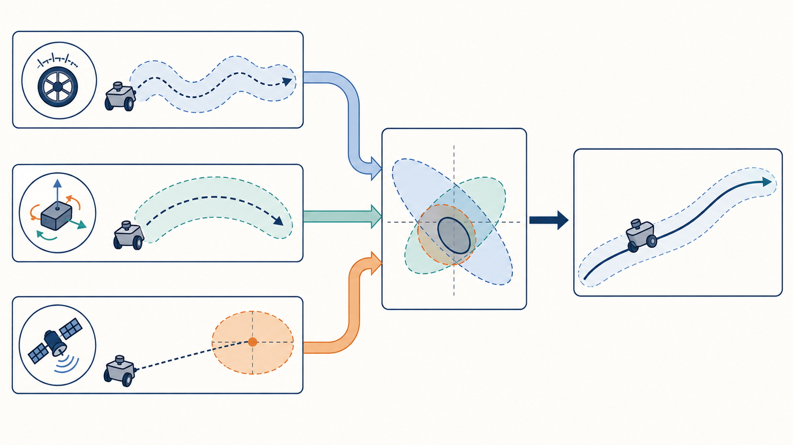

# 3.4 Sensor Fusion: Introduction to EKF and State Estimation

A mobile robot needs more than a collection of conflicting sensor readings. It needs a continuous state trajectory with quantified uncertainty that control and navigation systems can use. This lesson introduces the Extended Kalman Filter (EKF), uses ROS 2 `robot_localization` to fuse wheel odometry and IMU data, and presents the standard architecture for global localization with GNSS.

## Learning Objectives

- Understand state, prediction, observation, covariance, and Kalman gain;
- Configure an EKF for a two-dimensional mobile robot;
- Select the correct message fields for fusion and avoid reusing information from the same source;
- Identify fusion problems caused by covariance, timestamps, and coordinate frames;
- Design a two-layer architecture with continuous local estimation and GNSS-based global estimation.

## 3.4.1 What Problem Does State Estimation Solve?

For a two-dimensional robot, one possible state vector is:

$$
\mathbf{x}=[x,y,\psi,v_x,v_y,\dot{\psi},a_x,a_y]^T
$$

Here, $x,y$ are position, $\psi$ is yaw, $v$ is velocity, $\dot{\psi}$ is yaw rate, and $a$ is acceleration.

An EKF cycle contains two steps:

1. **Prediction**: propagate the previous state through the motion model and increase its uncertainty;
2. **Update**: compare sensor observations with the prediction and correct the state according to their covariances.

A simplified formulation is:

$$
\hat{x}_{k|k-1}=f(\hat{x}_{k-1|k-1},u_k)
$$

$$
K_k=P_{k|k-1}H_k^T(H_kP_{k|k-1}H_k^T+R_k)^{-1}
$$

$$
\hat{x}_{k|k}=\hat{x}_{k|k-1}+K_k(z_k-h(\hat{x}_{k|k-1}))
$$

$P$ is the state-estimate covariance, $R$ is the measurement covariance, and $K$ is the Kalman gain. A smaller measurement covariance makes the filter trust that measurement more. Incorrectly setting a covariance to zero or an unrealistically small value can therefore allow a noisy sensor to dominate the entire estimate.

## 3.4.2 Fusion Architecture Used in This Lesson

First, build a local fusion pipeline that does not depend on GNSS:

```text
/wheel/odometry ─┐
                  ├─ EKF local ─→ /odometry/filtered ─→ odom → base_link
/imu/data ────────┘
```



> Figure 3.4: Wheel-speed, IMU, and GNSS measurements have different accuracy and drift characteristics. The filter combines prediction and observation to produce a continuous trajectory with an uncertainty envelope.

Selection principles:

- Wheel odometry provides the robot's forward velocity, `vx`;
- The IMU provides yaw rate, `vyaw`;
- Enable `two_d_mode` for a differential-drive chassis to constrain `z/roll/pitch`;
- Do not fuse an unverified magnetometer-based absolute heading in the introductory setup;
- Do not treat position, velocity, and heading derived from the same wheel encoders as independent measurements.

## 3.4.3 Installation and Input Checks

```bash
sudo apt update
sudo apt install -y ros-humble-robot-localization

ros2 topic info /wheel/odometry --verbose
ros2 topic info /imu/data --verbose
ros2 topic hz /wheel/odometry
ros2 topic hz /imu/data
```

Before starting the EKF, verify all of the following:

- Both messages have valid timestamps in the same time domain;
- A static `base_link → imu_link` transform exists;
- Wheel odometry and IMU data both follow the convention `x` forward, `y` left, and `z` up;
- Linear and angular velocity units are `m/s` and `rad/s`, respectively;
- Covariances are nonzero and approximately agree with the variance of static measurements;
- No other node is simultaneously publishing `odom → base_link`.

## 3.4.4 Minimum Viable EKF Configuration

Create `config/ekf_local.yaml`:

```yaml
ekf_filter_node:
  ros__parameters:
    frequency: 30.0
    sensor_timeout: 0.2
    two_d_mode: true
    publish_tf: true
    print_diagnostics: true

    map_frame: map
    odom_frame: odom
    base_link_frame: base_link
    world_frame: odom

    odom0: /wheel/odometry
    odom0_config: [false, false, false,
                   false, false, false,
                   true,  false, false,
                   false, false, false,
                   false, false, false]
    odom0_queue_size: 10
    odom0_differential: false
    odom0_relative: false

    imu0: /imu/data
    imu0_config: [false, false, false,
                  false, false, false,
                  false, false, false,
                  false, false, true,
                  false, false, false]
    imu0_queue_size: 50
    imu0_differential: false
    imu0_relative: false
    imu0_remove_gravitational_acceleration: false

    process_noise_covariance: [
      0.05, 0.0,  0.0,  0.0, 0.0, 0.0, 0.0, 0.0, 0.0, 0.0, 0.0, 0.0, 0.0, 0.0, 0.0,
      0.0,  0.05, 0.0,  0.0, 0.0, 0.0, 0.0, 0.0, 0.0, 0.0, 0.0, 0.0, 0.0, 0.0, 0.0,
      0.0,  0.0,  0.06, 0.0, 0.0, 0.0, 0.0, 0.0, 0.0, 0.0, 0.0, 0.0, 0.0, 0.0, 0.0,
      0.0,  0.0,  0.0,  0.03,0.0, 0.0, 0.0, 0.0, 0.0, 0.0, 0.0, 0.0, 0.0, 0.0, 0.0,
      0.0,  0.0,  0.0,  0.0, 0.03,0.0, 0.0, 0.0, 0.0, 0.0, 0.0, 0.0, 0.0, 0.0, 0.0,
      0.0,  0.0,  0.0,  0.0, 0.0, 0.06,0.0, 0.0, 0.0, 0.0, 0.0, 0.0, 0.0, 0.0, 0.0,
      0.0,  0.0,  0.0,  0.0, 0.0, 0.0, 0.025,0.0,0.0, 0.0, 0.0, 0.0, 0.0, 0.0, 0.0,
      0.0,  0.0,  0.0,  0.0, 0.0, 0.0, 0.0, 0.025,0.0,0.0, 0.0, 0.0, 0.0, 0.0, 0.0,
      0.0,  0.0,  0.0,  0.0, 0.0, 0.0, 0.0, 0.0, 0.04,0.0, 0.0, 0.0, 0.0, 0.0, 0.0,
      0.0,  0.0,  0.0,  0.0, 0.0, 0.0, 0.0, 0.0, 0.0, 0.01,0.0, 0.0, 0.0, 0.0, 0.0,
      0.0,  0.0,  0.0,  0.0, 0.0, 0.0, 0.0, 0.0, 0.0, 0.0, 0.01,0.0, 0.0, 0.0, 0.0,
      0.0,  0.0,  0.0,  0.0, 0.0, 0.0, 0.0, 0.0, 0.0, 0.0, 0.0, 0.02,0.0, 0.0, 0.0,
      0.0,  0.0,  0.0,  0.0, 0.0, 0.0, 0.0, 0.0, 0.0, 0.0, 0.0, 0.0, 0.01,0.0, 0.0,
      0.0,  0.0,  0.0,  0.0, 0.0, 0.0, 0.0, 0.0, 0.0, 0.0, 0.0, 0.0, 0.0, 0.01,0.0,
      0.0,  0.0,  0.0,  0.0, 0.0, 0.0, 0.0, 0.0, 0.0, 0.0, 0.0, 0.0, 0.0, 0.0, 0.015]
```

The 15 Boolean values correspond, in order, to `x, y, z, roll, pitch, yaw, vx, vy, vz, vroll, vpitch, vyaw, ax, ay, az`. This example fuses only wheel-derived `vx` and IMU `vyaw`, creating a baseline that is easy to diagnose.

`process_noise_covariance` is only a starting example, not a universal answer for every robot. Production parameters should be adjusted according to the motion model, control cycle, and measured data.

Start the filter:

```bash
ros2 run robot_localization ekf_node --ros-args \
  --params-file ~/robot_ws/src/<your_package>/config/ekf_local.yaml
```

## 3.4.5 Verifying the Output

```bash
ros2 topic hz /odometry/filtered
ros2 topic echo /odometry/filtered --once
ros2 run tf2_ros tf2_echo odom base_link
ros2 topic echo /diagnostics
```

Test in the following order:

1. **Stationary**: position should not wander rapidly, and velocity should remain near zero;
2. **Straight line**: `x` should increase in the correct direction with limited lateral drift;
3. **In-place rotation**: position should change little and yaw should remain continuous;
4. **Rectangular route**: final-position error should be better than, or at least no worse than, raw wheel integration;
5. **Briefly disconnect one input**: the filter should predict for a short period and report a diagnostic; recovery should not cause a large jump.

Display the raw wheel-odometry path and fused path together in RViz2. Do not evaluate only whether the trajectory looks smoother; compare endpoint error, heading error, latency, and whether covariance grows reasonably.

## 3.4.6 Tuning Covariance

Start from measurements:

1. Record 5–10 minutes of IMU data while the robot is stationary;
2. Calculate the mean, variance, and drift over time for each axis;
3. Repeat straight-line and in-place rotation tests to estimate wheel-odometry error;
4. Put the measurement variances into the message covariances instead of tuning only by feel inside the EKF;
5. Check whether innovations remain biased in one direction. If so, investigate systematic error first.

Common mistakes:

- Setting covariance to zero, which gives an incorrect measurement effectively unlimited trust;
- Making covariance extremely large merely to suppress noise, which is equivalent to not fusing that data;
- Fusing pose, velocity, and heading derived from the same encoders while treating them as independent;
- Trying to use the EKF to repair incorrect units, axes, timestamps, or extrinsics.

## 3.4.7 Adding GNSS to Global Estimation

GNSS latitude and longitude cannot be fed directly to a local EKF as Cartesian coordinates. `navsat_transform_node` typically receives:

- `/gps/fix`: `NavSatFix`;
- `/imu/data`: IMU data with an Earth-referenced heading;
- `/odometry/filtered`: output from the local EKF.

It converts GNSS measurements into odometry in the robot's world-coordinate convention and sends that result to a global filter. Recommended architecture:

```text
Wheel odometry + IMU ─→ EKF local (world=odom) ─→ odom → base_link
          │                         │
GNSS ─────┴─→ navsat_transform ─────→ /odometry/gps
                                         │
Wheel odometry + IMU + odometry/gps ─→ EKF global (world=map) ─→ map → odom
```

This keeps `odom → base_link` locally continuous while GNSS corrections appear in `map → odom`, preventing the controller's local coordinates from suddenly changing when GPS jumps.

Before use, verify:

- Whether the IMU heading reference is ENU, magnetic north, or true north, and set magnetic declination and `yaw_offset` correctly;
- The GNSS antenna extrinsic `base_link → gps_link` is correct;
- `/odometry/gps` is not configured as differential when used as an absolute measurement;
- Indoors or when the position is invalid, zero coordinates or stale data are not continuously fed to the global filter;
- The first test is performed slowly in an open area.

## Lab and Acceptance Criteria

1. Start with wheel odometry only and save the baseline trajectory;
2. Add IMU angular velocity and repeat the same route;
3. Compare stationary drift, steering response, and rectangular-loop closure error;
4. Intentionally stop IMU data and observe timeout diagnostics and recovery behavior;
5. Build the global EKF only when reliable GNSS and an absolute heading are available;
6. Save the parameters, rosbag, TF tree, and result screenshots.

Acceptance criteria: `/odometry/filtered` has a stable rate; only one publisher provides `odom → base_link`; straight-line and turning directions are correct; the fused output has no sustained oscillation or unexplained jumps; input failures produce diagnostics; and the source and rationale for every enabled configuration field can be explained.

## Troubleshooting

| Symptom | Possible cause | Corrective action |
| --- | --- | --- |
| Output oscillates violently | Covariance is too small, clocks are not synchronized, or sources conflict | Check timing and frames, then re-estimate covariance |
| Heading drifts while stationary | Gyroscope bias or no absolute heading constraint | Calibrate the IMU; add a verified absolute heading if required |
| Position draws a circle during in-place rotation | Incorrect IMU translation/rotation extrinsic or wheel model | Verify TF, track width, and left/right wheel signs |
| TF is duplicated or flickers | Raw odometry and EKF both publish the same transform | Disable one of the TF publishers |
| Trajectory jumps after adding GPS | Multipath, heading offset, antenna extrinsic, or covariance error | Check GNSS status first, then transformation parameters |
| Log reports queue/old measurement | Timestamps move backward, latency is excessive, or the queue is too small | Repair the time source and inspect link latency |

## Summary

This lesson completes the minimum state-estimation loop for M3: wheel speed describes chassis translation, the IMU describes rapid rotation, and the EKF uses uncertainty to generate a continuous `odom → base_link` transform. From this foundation, `navsat_transform_node` and a global EKF can incorporate GNSS to provide both local continuity and global accuracy.

## References

- [robot_localization Documentation](https://docs.ros.org/en/rolling/p/robot_localization/)
- [navsat_transform_node Parameters](https://docs.ros.org/en/lunar/api/robot_localization/html/navsat_transform_node.html)
- [ROS REP-105: Coordinate Frames for Mobile Platforms](https://www.ros.org/reps/rep-0105.html)
- [ROS 2 Humble: Odometry Message](https://docs.ros.org/en/humble/p/nav_msgs/msg/Odometry.html)
