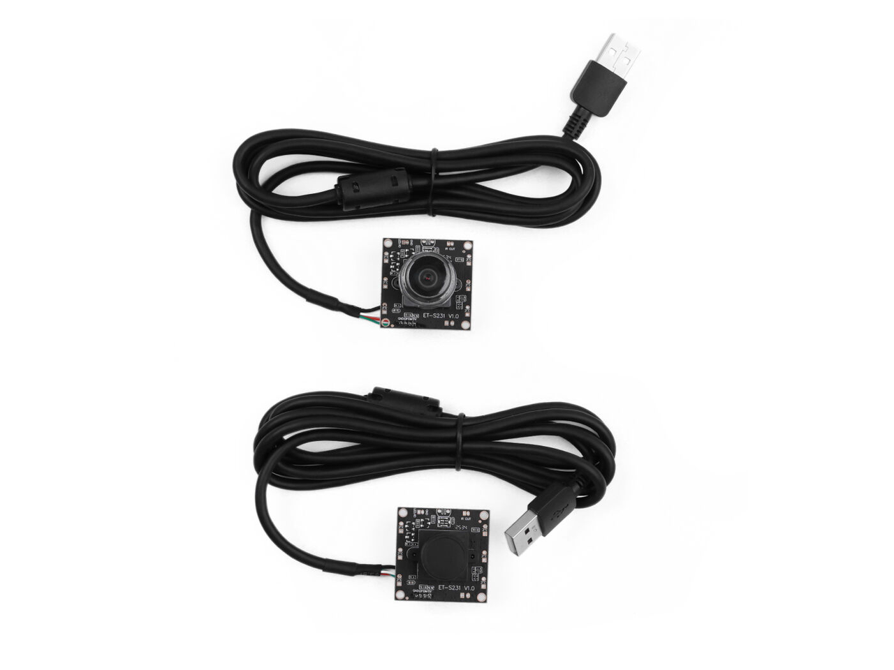
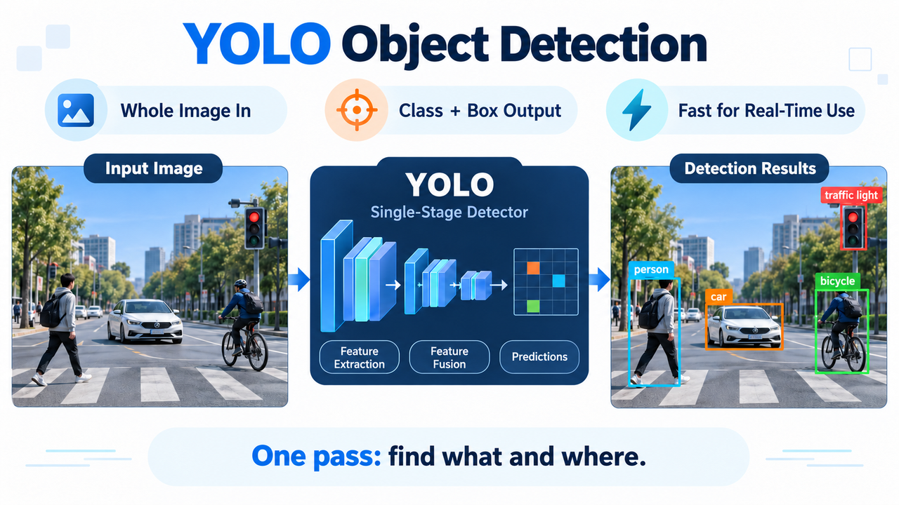

# 4.1 YOLO 目标检测：从训练到 TensorRT 部署

## 课程概述


相机能给你一整幅像素，却不告诉你画面里有什么、在哪一块。目标检测要回答的就是这两件事：每个目标的类别是什么，它在像素坐标里的位置在哪。

2.4 结束时，你手上有一张能实时刷新的鸟瞰图；那张图回答的是「地面怎么走」，回答不了「路上有什么」。M4 从检测开始补上这一层。

本页走的不是「训一个模型」，而是「把已经训好的模型接进机器人」：`bev_detection` 这个 ROS 2 包加载一份 YOLO11n 的 TensorRT engine，把相机图像变成 `vision_msgs/Detection2DArray`，发到 `/perception/detections` 上，供 4.2 的跟踪直接消费。模型本身来自 Ultralytics 的 COCO 预训练权重，本页不训练它，只把它部署成一条可靠的检测链路。

走完之后，你手上会有并理解这些东西：一份能跑起来的检测管线、对 `/perception/detections` 每一条契约的准确认识（消息类型、QoS、时间戳继承、空帧行为），以及一套可复现的性能测量口径。

### 先知道：这节课会带你完成什么

| 阶段 | 你会理解什么 | 最终能做什么 |
| --- | --- | --- |
| 读懂 | 模型输出的 `[1, 84, 8400]` 是什么，置信度、IoU、mAP 各自回答什么问题 | 看懂检测结果，不再把后处理当黑盒 |
| 部署 | PyTorch → ONNX → TensorRT 三段式导出，以及 engine 与硬件、版本的绑定关系 | 说清一份 engine 能不能换机器用，知道为什么要固定输入形状 |
| 接入 | 检测结果怎样变成 ROS 2 话题：消息类型、QoS、时间戳、空帧 | 读懂 `/perception/detections` 的每条契约，知道下游靠什么 |
| 验证 | 检测链路的性能该怎么量、要记哪些条件 | 跑出可复现、可对照的测量记录 |

### 学完后，你能做到什么

- 说清 YOLO 输出张量 `[1, 84, 8400]` 里每个维度的含义，以及 8400 这个数字是怎么来的。

- 理解 Letterbox 的缩放与填充，以及逆变换为什么必须复用同一份 `s`、`dw`、`dh`。

- 说清 IoU、mAP@0.5、mAP@0.5:0.95、Precision / Recall 的口径差别，知道报 mAP 时必须连带哪几个条件。

- 讲清 PyTorch → ONNX → TensorRT 三段各自解决什么问题，以及为什么 engine 与 GPU 架构、TensorRT 版本绑定。

- 在 J501 上跑起 `bev_detection` 的检测链路，用 `ros2 topic` 验证输出的消息类型、QoS 与时间戳。

- 说清 M4.1 与 M4.2 的职责边界：为什么检测节点不填 `id`，空帧为什么也必须发。

- 用实机脚本产出一份带条件的性能测量记录，而不是一个孤零零的帧率数字。

### 硬件与软件清单

**硬件：**

|  |  |  |
| --- | --- | --- |

**软件：**

- 平台：reComputer J501（Jetson AGX Orin 32GB，MAXN 模式）；JetPack 6.2.1（L4T 36.4.4）、Ubuntu 22.04、CUDA 12.6、TensorRT 10.3.x、ROS 2 Humble

- 推理栈：`bev_detection` 是 C++ 包，直接用 TensorRT runtime 跑 engine，不依赖 PyTorch / Ultralytics。TensorRT 版本要在 `10.3.x` 上，`ros2_ws/src/bev_detection/config/yolo.yaml` 里声明了 `expected_trt_version: "10.3"` 供版本核对

- 模型产物：`models/m4/detection/engines/yolo11n_fp16.engine`（FP16）、`models/m4/detection/labels/coco.names`（COCO 80 类）。这份 engine 由 Ultralytics 的 `yolo11n.pt` 导出 ONNX 后构建，构建命令记在 `docs/M4.1_YOLO_TENSORRT.md`；**本机不重新训练模型**

- 依赖的 ROS 2 包：`vision_msgs`（消息类型）、`cv_bridge`、`image_transport`

### 前置基础

- 相机通路已通，能拿到稳定视频流：接入流程（设备树、`media-ctl`、`v4l2-ctl`、多相机 FSYNC 同步）见 [2.1 GMSL2 ：车载级多相机接入](https://seeedstudio.feishu.cn/docx/Takhd7wo5oPx3mx0ljhcfyxDnEe)；

- 系统已刷好：按 [1.2 JetPack 6.2 系统刷机与基础配置](https://seeedstudio.feishu.cn/docx/UweQdPUKYobmfMxYjZkcy1ZpnNh)

- 会用 `ros2 topic list` / `ros2 topic echo` / `ros2 topic info -v` 看话题与 QoS。本章不要求会写 ROS 2 节点。

- 通用基础：Python 3 的基本用法（读张量形状、看数组切片）。

## 先读懂：从一张图到一个检测框

### 模型吐出来的是什么：中心点、宽高与置信度


YOLO 的输出不是「一个框」，而是一张稠密的预测图。以 640×640 输入、COCO 的 80 类为例，模型输出张量的形状是 `[1, 84, 8400]`：84 = 4 个框参数 + 80 个类别分数，8400 = 80² + 40² + 20²，也就是步长 8 / 16 / 32 三个尺度上的预测点总数。

框参数不直接是左上角与右下角，而是中心点 (cx, cy) 与宽高 (w, h)，单位是网络输入图（640×640）的像素。类别分数里的最大值就是常说的置信度（confidence）；它低于 `conf` 阈值时，这个预测点连同它的框一起丢弃。所以你看到的后处理，第一步永远是「按分数筛掉绝大多数预测点」。

这个张量是 **channel-major** 排布的：第 c 个通道的第 i 个预测点在 `c * 8400 + i`。写解析代码时这一点最容易错，读成 `output + i * stride`（anchor-major）会得到看似合理、实际全错的结果。

**一句话记忆：**置信度回答「这里有没有目标」；IoU 回答「这个框和目标贴合得准不准」。

### 指标口径：IoU、mAP、Precision / Recall、混淆矩阵


交并比（Intersection over Union, IoU）衡量预测框与真值框的重叠程度，是判定「检对 / 检错」的门槛，也是所有 mAP 指标里的那个阈值来源。

$\mathrm{IoU} = \frac{|A \cap B|}{|A \cup B|}$ ，**其中 A 是预测框，B 是真值框**；分子是两者交集面积，分母是并集面积。IoU 越接近 1，两个框越重合；工程上把 IoU ≥ 0.5 当作「算检对」的最低门槛，这就是 mAP@0.5 里那个 0.5 的来历。


- **mAP@0.5**：把 IoU 门槛固定在 0.5，对每个类别算 Precision–Recall 曲线下面积（Average Precision, AP），再对所有类别的 AP 取平均。

- **mAP@0.5:0.95**：IoU 门槛从 0.5 到 0.95 每隔 0.05 取一档，得到 10 个 mAP@0.5:x 再平均。它对框的位置精度敏感得多，COCO 主线指标用的就是它，本页的精度对照也以它为准。

- **精确率（Precision）**：P = TP / (TP + FP)，回答「你报出来的框有多少是真的」。它随 `conf` 阈值升高而升高。

- **召回率（Recall）**：R = TP / (TP + FN)，回答「画面里真实存在的目标有多少被你找出来了」。它随 `conf` 阈值升高而下降。

- **F1 分数**：P 与 R 的调和平均，用来在单一阈值下做取舍。

$F1 = \frac{2 \cdot P \cdot R}{P + R}$

- **混淆矩阵（confusion matrix）**：行是真值类别、列是预测类别。对角线是检对的量，非对角线告诉你哪两个类别在互相误判；验证后先看这张表，再决定是补数据还是调阈值。

读数有两个硬规矩。

第一，mAP 必须连带四个条件一起报：数据集与拆分方式、`imgsz`、精度模式、是否含后处理。同一份权重在 imgsz=640 与 imgsz=1280 下评估出的 mAP@0.5:0.95 不可直接比较。

第二，框架侧算出的 mAP 与 TensorRT engine 上算出的 mAP 要分开写：engine 的输入是张量，评估脚本必须复用同一套 Letterbox 与 NMS 参数，否则差出来的数字分不清是量化造成的还是后处理造成的。

混淆矩阵长这样：



### 从 PyTorch 到 TensorRT：三段式导出

先回答一个自然的问题：模型是从哪里来的？

本页用的 `yolo11n` 是 Ultralytics 发布的 COCO 预训练权重，不需要自己训练。如果场景类别与 COCO 差得远（比如要认工位上的特定零件），得先在自己的数据上微调。那是另一条独立的训练流程，和本章要讲的部署链路没有交集。本章从「已经有一个模型」开始。

部署分三段，每一段都能单独验证，出错时先定位是哪一段，再改参数。

- **PyTorch → ONNX**：`yolo export model=yolo11n.pt format=onnx simplify=True dynamic=False`。`simplify=True` 会合并冗余节点，能减少构建期不支持算子的概率；`dynamic=False` 固定输入形状，换来一个构建期就能确定显存分配的静态 engine。

- **ONNX → TensorRT Engine**：`trtexec --onnx=yolo11n.onnx --saveEngine=yolo11n_fp16.engine --fp16 --workspace=4096`。这里发生的是算子融合、层选优与 kernel autotuning，所以同一个 ONNX 在不同 TensorRT 版本、不同 GPU 上构建出的 engine 不通用。

- **确定输出契约**：实机这份 engine 的输出是 `output0: float32[1, 84, 8400]`，也就是 one-to-many 的那条路径，后处理必须带 NMS。导出时的选择会固化进计算图，加载时再传参数不会重建图。

**engine 与 GPU 架构、TensorRT 版本绑定**，换设备必须重新构建。这不是配置问题，是序列化 engine 的本质：它保存的是编译后的 kernel 与调度方案，不是可移植的中间表示。

导出完成后先看 ONNX 本身是否成立，再交给 trtexec：`python3 -c "import onnx; m=onnx.load('yolo11n.onnx'); onnx.checker.check_model(m); print(len(m.graph.node))"`。节点数与预期差异过大，说明 `simplify` 把不该合并的算子合了，回去改用 `simplify=False` 再导一次。

**一句话记忆：**ONNX 回答「算子写成什么样」；engine 回答「在这块 GPU 上怎么最快执行」。

### 精度模式：FP32 与 FP16

| 精度模式 | 怎么构建 | 代价 |
| --- | --- | --- |
| FP32 | trtexec 不带精度参数 | 精度基准，延迟最高；用来做精度对照的参考值 |
| FP16 | 加 `--fp16` | AGX Orin 的 Tensor Core 原生支持半精度，访存与计算同时减半；具体收益取决于层结构，用同一份条件实测填表 |

实机这份 engine 是 FP16 的：`models/m4/detection/engines/yolo11n_fp16.engine`。节点加载前可以先确认一下 TensorRT 版本与 engine 的匹配关系，版本不符时 TensorRT 反序列化会直接失败。`ros2_ws/src/bev_detection/config/yolo.yaml` 里的 `expected_trt_version: "10.3"` 就是为这种核对准备的，免得等到推理失败才发现版本对不上。

想换精度就换 engine 文件，不用改节点代码：`model_path` 是参数。

### 预处理与后处理：Letterbox 与坐标还原

预处理要解决一个矛盾：网络只吃固定尺寸的方形输入，而相机给的是任意宽高比的画面。直接拉伸会改变目标的宽高比，让框回归学到错误的形状，所以用 Letterbox（保持宽高比缩放 + 灰边填充）。

先算缩放比，再算边距，这两步决定了后处理能不能还原回原图坐标。

$s = \min\left(\frac{640}{W_{src}},\ \frac{640}{H_{src}}\right)$

其中 $W_{src}$ / $H_{src}$ 是原图宽高，$s$ 是缩放比。缩放后的新尺寸为 $(\mathrm{round}(W_{src}\cdot s),\ \mathrm{round}(H_{src}\cdot s))$，剩余部分左右、上下均匀填充 114 灰度，边距记为 $d_w$、$d_h$。逆变换就是把模型输出的框坐标减掉边距、再除以缩放比：

$x_{src} = \frac{x_{model} - d_w}{s}, \quad y_{src} = \frac{y_{model} - d_h}{s}$

这里最常见的错误是把 `dw` / `dh` 当成缩放后的尺寸来用，或者忘了网络输入是 CHW 排布、把 HWC 直接塞进去。写代码时把这几步固定成一个函数，逆变换用同一份 `s`、`dw`、`dh`，误差就只剩整数取整带来的 1 px 以内。

```python
import cv2
import numpy as np

def letterbox(img, new_shape=640, color=114):
    h, w = img.shape[:2]
    s = min(new_shape / w, new_shape / h)
    nw, nh = int(round(w * s)), int(round(h * s))
    resized = cv2.resize(img, (nw, nh), interpolation=cv2.INTER_LINEAR)
    canvas = np.full((new_shape, new_shape, 3), color, dtype=np.uint8)
    dw, dh = (new_shape - nw) // 2, (new_shape - nh) // 2
    canvas[dh:dh + nh, dw:dw + nw] = resized
    return canvas, s, dw, dh

def to_nchw_bgr2rgb(canvas):
    x = canvas[:, :, ::-1].astype(np.float32) / 255.0        # BGR -&gt; RGB，归一化到 0-1
    return np.ascontiguousarray(x.transpose(2, 0, 1))[None]  # HWC -&gt; 1CHW
```

后处理是四步，实机 `bev_detection` 走的就是这条：

1. **置信度过滤**：8400 个预测点里，第 i 个点的类别分数在 `output[4 + c][i]`，而不是「第 i 行的第 5 到 84 列」。按这个排布取每个点的最大类别分数，低于 `conf` 阈值的整个丢掉。实机 `confidence_threshold` 默认 0.25。漏检多就降到 0.1 再看。

2. **坐标换算**：把 (cx, cy, w, h) 转成左上 / 右下角 (x1, y1, x2, y2)。

3. **非极大值抑制**：同类别内按分数排序，与已保留框的 IoU 超过 `iou` 阈值的压掉。实机 `nms_threshold` 默认 0.45。这一步是单线程的 O(n²)，8400 个候选点在最坏情况下要做约 3500 万次 IoU 运算，是这条链路里最值得盯的一处开销。

4. **坐标还原与裁剪**：用上面两式反算回原图坐标，再裁剪到图像范围内，避免框出画外。

NMS 是按类别做的，所以两个类别重叠的目标会被同时保留；反过来，同一个目标如果被分出两个类别，就会出现两个框叠在一起。想让不同类之间也互相抑制，可以改用 class-agnostic NMS，本页不展开。

### 一条检测链路长什么样：节点、话题与三条契约

原理讲完，看这条链路在机器人上落地成什么。

### 节点与话题

`bev_detection` 包提供两个可执行文件：

| 可执行 | 作用 |
| --- | --- |
| `yolo_trt_node` | 主节点：订阅相机图像，跑 TensorRT 推理，发布检测结果 |
| `camera_adapter_node` | 可选的转发节点，把上游图像转成检测节点期望的命名空间 |

它们之间靠三个话题连接：

| 方向 | 话题 | 类型 |
| --- | --- | --- |
| 订阅 | `/perception/cameras/front/image` | `sensor_msgs/Image` |
| 发布 | `/perception/detections` | `vision_msgs/Detection2DArray` |
| 发布 | `/perception/debug/detection_image` | `sensor_msgs/Image` |

`vision_msgs/Detection2DArray` 是 ROS 2 生态的标准 2D 检测消息。这里有一个刻意的选择：检测结果**复用标准消息**，而不是自研一个消息类型。好处是任何认这个类型的下游（跟踪、可视化、录制）都能直接接上，不需要额外的转译层。

### 三条契约（下游依赖它们，不是可选项）

**契约一：时间戳与坐标系必须继承源图。** 输出的 `header.stamp` 与 `header.frame_id` 直接取自源图像，**不允许**用 `now()` 重打时间戳。跟踪、深度对齐、姿态估计、传感器融合、rosbag 回放全都依赖这条。一旦自己打时间戳，离线回放的时间戳会全部变成回放时刻，整条链路的时序就废了。

**契约二：每个完成推理的帧恰好发布一条消息，包括没有检测到目标的帧。** 空帧也发，是因为下游跟踪靠「这一帧没有观测到」来推进轨迹的丢失计数。如果检测节点在空帧时选择不发，跟踪看到的就不是「目标消失了」，而是「没有任何消息」，这两件事在跟踪器里是完全不同的语义。

**契约三：检测节点不填 `id` 字段。** `Detection2DArray` 里的每个检测项有一个 `id`，那是留给跟踪的轨迹 ID 的。检测节点填了它，就等于越过了检测与跟踪的边界，4.2 的跟踪器将无法区分「这是上一帧的同一个目标」和「这是检测器自己编的号」。

### QoS：为什么是 BEST_EFFORT

三个话题都用 `rclcpp::SensorDataQoS()`，等价于 Reliability `BEST_EFFORT`、History `KEEP_LAST`（深度 10）、Durability `VOLATILE`。

这是传感器数据的常规选择：图像流 30 Hz，允许丢帧但要求新鲜度；可靠传输在链路拥塞时会重传旧帧，反而让延迟累积。代价是**订阅端必须也用 BEST_EFFORT**，否则 DDS 会因为 QoS 不兼容而拒绝对接，表现为「发布端有数据、订阅端什么都收不到」。

**一句话记忆：**检测负责「这一帧看到了什么」，跟踪负责「这和上一帧是不是同一个」；两者的边界就是 `id` 字段与空帧行为。

## 动手：把检测模型跑成一条 ROS 2 话题

四步，每步都有可验证的产出。所有命令在 J501 上执行，工作目录是 `/home/seeed/workspace/ros2_bev`。跑之前先确认功耗模式是 MAXN，否则后面测出来的读数不具可比性。

### 步骤 1：确认环境、模型产物与节点

先确认模型、标签和节点都已就绪，免得后面把环境问题误判成操作错误。

```bash
cd /home/seeed/workspace/ros2_bev

# 模型产物
ls -l models/m4/detection/engines/yolo11n_fp16.engine   # 8,546,556 B
ls -l models/m4/detection/labels/coco.names             # COCO 80 类

# 可执行文件
ls -l ros2_ws/install/bev_detection/lib/bev_detection/yolo_trt_node

# 版本自检
python3 -c "import tensorrt as trt; print('trt', trt.__version__)"   # 10.3.0
```

engine、labels、可执行文件三者缺一不可。`ros2_ws/src/bev_detection/config/yolo.yaml` 里还声明了 `expected_trt_version: "10.3"`；本机 TensorRT 为 10.3.0，启动前先确认二者一致。换过 TensorRT 版本的话，engine 需要重新构建。

### 步骤 2：启动现有 demo

这一步把检测链路真正跑起来。

```bash
cd /home/seeed/workspace/ros2_bev
scripts/m4/run_m4_1_demo.sh
```

脚本默认走 `CAMERA_SOURCE=csi`，从 `/dev/video0` 以 1920×1536@30 取流，自己拉起相机发布节点，再把图像喂给 `yolo_trt_node`。调试图像被重映射到 `/perception/demo/m4_1`，方便和别的链路并存观察。

可选开关（都是环境变量）：`CAMERA_SOURCE`、`CAMERA_DEVICE`、`CAMERA_WIDTH` / `CAMERA_HEIGHT` / `CAMERA_FPS`、`VIEWER`、`DURATION`。

### 步骤 3：验证 `/perception/detections` 消息

接下来不要只看话题是否存在，而要逐条核对三条接口契约。

```bash
ros2 topic list | grep perception
ros2 topic info -v /perception/detections
ros2 topic hz /perception/detections
ros2 topic echo /perception/detections --once
```

逐条核对：

- **消息类型**是 `vision_msgs/msg/Detection2DArray`；

- **QoS** 是 `BEST_EFFORT` / `KEEP_LAST`（深度 10）/ `VOLATILE`，对应订阅端的 `SensorDataQoS`；

- **时间戳与 frame_id** 与源图像一致，而不是当前时刻。把 `/perception/cameras/front/image` 和 `/perception/detections` 的 `header.stamp` 放在一起看，两者应当相同；

- **空帧也发消息**：让相机对着没有可检测目标的场景，确认 `/perception/detections` 仍持续发布、`detections` 为空数组。注意别用「拔掉相机」来测——契约的前提是「完成了推理的输入帧」，没有输入帧就测不到这条契约。仓库里有专门的契约检查脚本 `scripts/m4/test_empty_frame_contract.sh`，要严格验证时直接用它；

- **`id` 字段为空**：`ros2 topic echo /perception/detections --field detections[0].id` 应当没有有效值。填上它是 4.2 的事。

### 步骤 4：性能测量方法

最后要拿到的是一份记录了完整条件的测量，而不是一个孤零零的帧率。

```bash
cd /home/seeed/workspace/ros2_bev
scripts/m4/run_m4_1_benchmark.sh 30
```

脚本用真实相机输入测这条链路的帧率与延迟，结果落在 `output/m4/4.1`。

**本页不给目标帧率数字。** 原因有两层：一是仓库里两份设计文档对同一份 engine 给了互相矛盾的读数，而且都没有注明测量条件；二是帧率本身强依赖功耗模式、相机分辨率与场景。你要做的是把条件记全，然后自己测。

一份可对照的记录必须同时写明七项，缺一项这个数字就不能和别人比：

| # | 条件 |
| --- | --- |
| 1 | 设备型号（本机为 reComputer J501 / Jetson AGX Orin 32GB） |
| 2 | JetPack / L4T 版本（6.2.1 / R36.4.4） |
| 3 | 模型与 engine 精度（YOLO11n / FP16） |
| 4 | 模型输入尺寸（640×640） |
| 5 | 相机分辨率与输入帧率（1920×1536@30） |
| 6 | 功耗与时钟模式（`sudo nvpmodel -m 0` + `sudo jetson_clocks`） |
| 7 | 测量口径与采样窗口（含 warm-up 长度） |

功耗模式必须记：换回 15W 模式后同一份 engine 的读数会下降，两次结果不可混在同一张表里。否则改一次功耗模式就会得到一张看着像「优化有收益」、实际只是换了模式的表。

## 产出物与验收标准

### 交付清单

1. 一条跑起来的检测链路：`scripts/m4/run_m4_1_demo.sh` 正常启动，`/perception/detections` 持续发布。

2. 三条契约的验证记录：消息类型与 QoS 截图、时间戳一致性对比、空帧仍然发布的证据、`id` 为空的证据。

3. 一份性能测量记录：`scripts/m4/run_m4_1_benchmark.sh` 的输出，外加七项条件表。

4. 一段可视化证据：调试图像或 `ros2 topic echo` 的摘录，显示检测框、类别与置信度。

### 验收标准

| 检查项 | 通过标准 | 不通过时优先检查 |
| --- | --- | --- |
| 环境自检 | engine、`coco.names`、`yolo_trt_node` 三者均存在；TensorRT 版本为 10.3.x | 是否跑过 `colcon build`；engine 是否被换成了别的 TensorRT 版本构建的 |
| 消息契约 | `/perception/detections` 的类型是 `vision_msgs/msg/Detection2DArray`；QoS 为 `BEST_EFFORT` / `KEEP_LAST`（深度 10）/ `VOLATILE` | 订阅端是否也用了 `SensorDataQoS`（见排障「下游收不到」） |
| 时间戳继承 | 检测消息的 `header.stamp` 与源图像一致 | 是否有人用 `now()` 重打了时间戳 |
| 空帧行为 | 无目标场景下话题仍在发布，`detections` 为空数组 | 节点是否在空框时提前 return |
| 职责边界 | `detections[i].id` 为空 | 是否误把跟踪的 ID 逻辑写进了检测节点 |
| 坐标还原 | 用已知像素位置的目标验证，还原误差在 1 px 以内 | `dw` / `dh` 是否用了缩放后的尺寸；`s` 是否被重算过 |
| 测量记录 | 七项条件全部写明，附原始脚本输出 | 是否只抄了帧率而丢了条件 |

## 常见问题与排障

### 检测框整体偏移，或缩放比例不对

- **现象**：框位置系统性偏向一侧，或框比目标大一圈 / 小一圈，类别和置信度都正常。

- **原因**：Letterbox 逆变换用错了 `dw` / `dh`，或把图像当成 HWC 直接送进网络，或缩放比用了拉伸后的尺寸重算。

- **处理**：先打印模型输入与输出张量的形状确认排布；再画一个已知尺寸的方块图（例如 100×100 像素的直角标记）走一遍全流程，看还原后的框是否回到原位，误差应在 1 px 以内。修正时让预处理与后处理共用同一份 `s`、`dw`、`dh`。

### 帧率远低于预期

- **现象**：换一份别处的 engine 或在别的机器上跑，同样输入帧率差很多。

- **原因**：多半不在推理。常见的是预处理在 CPU 上逐帧 resize、每帧同步等待 GPU、加载的其实是 FP32 engine、或者后处理在 Python 里循环 8400 个预测点。

- **处理**：用 `jtop` 看 GPU 利用率，低于 50% 基本可以判定瓶颈在 CPU 或同步等待。逐帧统计预处理、推理、后处理三段耗时，先修最长的那一段。确认节点加载的是 `yolo11n_fp16.engine` 而不是自己替换的 FP32 engine。

### 相机管线丢帧

- **现象**：视频能出但时不时卡一下，或读到的帧时间戳跳动很大。

- **原因**：相机缓冲太多、格式转换放在 CPU 上、或实际可用帧率低于设定值。

- **处理**：先把相机管线与推理分开验证：只跑相机发布节点，确认它能稳定跑满目标帧率，再叠加检测。两者混在一起排查，永远分不清是相机问题还是推理问题。

### `/perception/detections` 有数据，下游却收不到

- **现象**：`ros2 topic hz /perception/detections` 正常，但自己写的订阅端一条消息都收不到，也不报错。

- **原因**：**QoS 不兼容**。发布端用 `SensorDataQoS`（BEST_EFFORT），订阅端如果用默认的 RELIABLE，DDS 会判定两者无法对接，直接不建立连接，而且不会报错。

- **处理**：`ros2 topic info -v /perception/detections` 确认发布端 QoS，订阅端改成 `rclcpp::SensorDataQoS()`（C++）或 `qos_profile_sensor_data`（Python）。这是接实时传感器话题最常见的坑。

### 空检测帧导致下游轨迹计数异常

- **现象**：把检测接进 4.2 之后，目标被遮挡时轨迹立刻断掉，`lost_track_buffer` 像是不起作用。

- **原因**：检测节点在 `detections` 为空的帧上选择不发消息，或下游把「空数组」当成「没有收到消息」处理。

- **处理**：确认检测节点**每帧都发**，空帧发的是空数组；下游也要把空数组当作一次有效观测来推进丢失计数。这条契约在 M4.1 的验收里有专项检查，改动检测节点时不要顺手加「空框提前 return」。

> **下一步：**把本页的 `/perception/detections` 交给 4.2 多目标跟踪。跟踪不重新训练检测器，也不改检测结果，它只负责给同一目标的框分配稳定的 ID。检测这边的三件事会直接影响跟踪效果：框的坐标精度、`iou` 阈值、以及空帧是否照发。两条边界要记住：engine 与 GPU 架构、TensorRT 版本绑定，换设备必须重新构建；检测节点不填 `id`，那是跟踪的职责。
