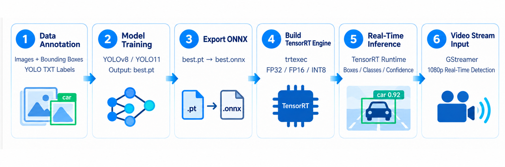
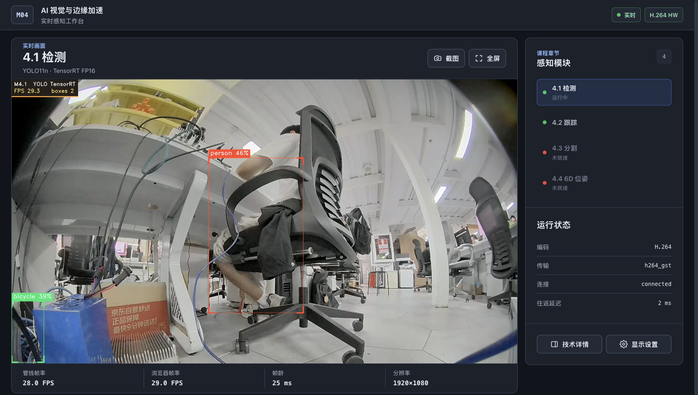
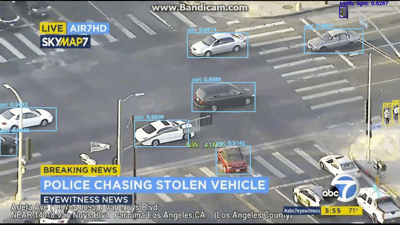
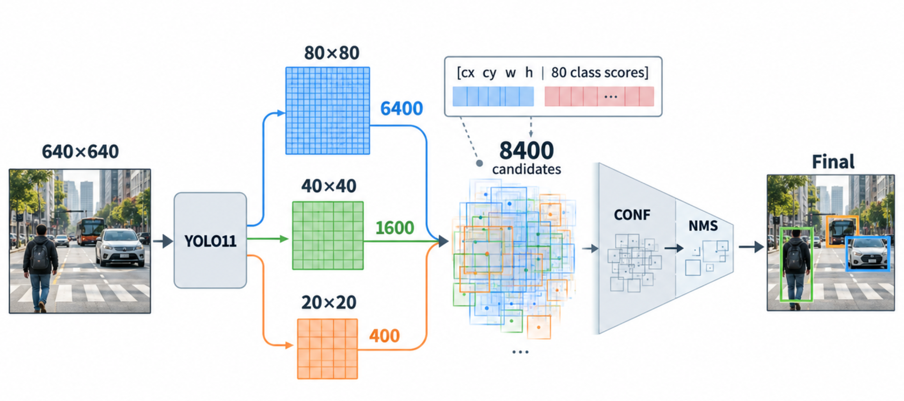
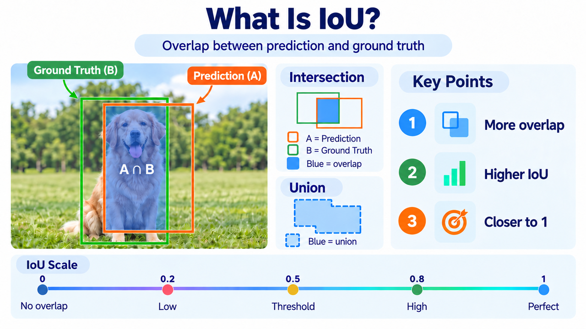
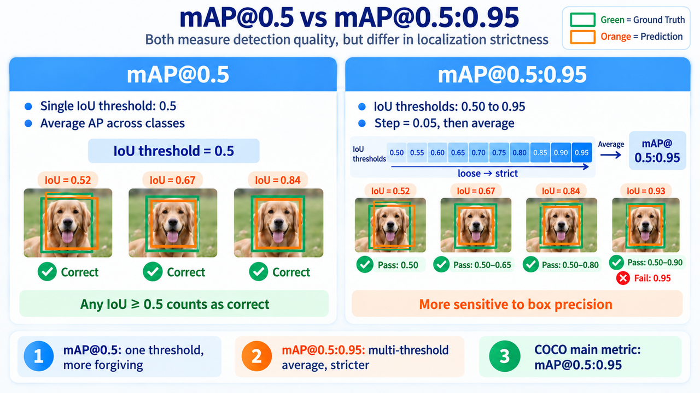
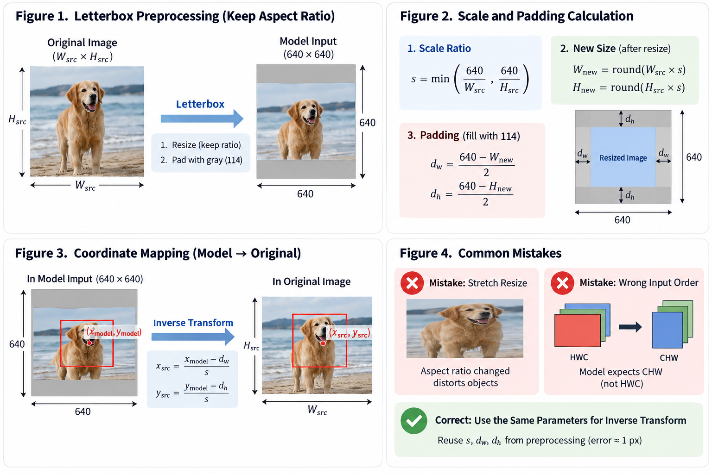
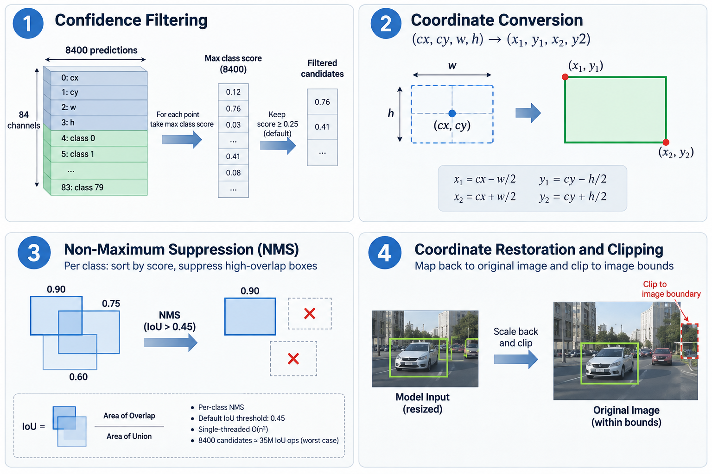
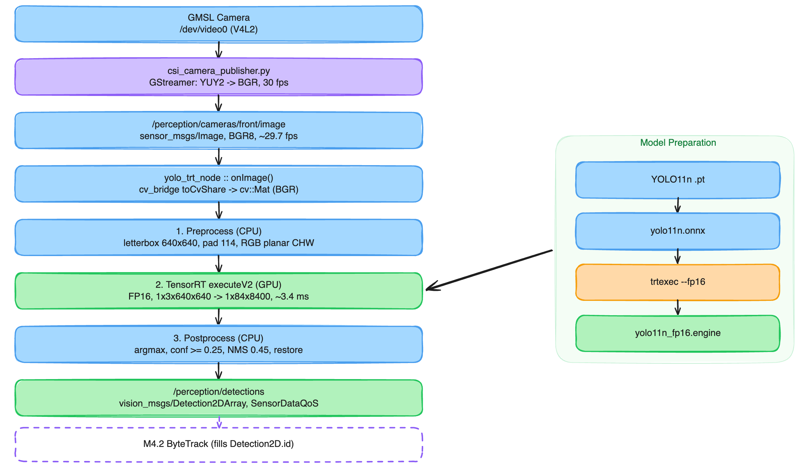

# 4.1 YOLO 目标检测：从预训练模型到 TensorRT 部署

## 概述

### 课程代码入口

以下命令从你克隆的课程源码运行；`M4_CODE_ROOT` 只需要按自己的目录修改一次：

```bash
export M4_CODE_ROOT="$HOME/mobile-robot-full-stack-course/docs/M04-AI-Vision-And-Edge-Acceleration/code"
cd "$M4_CODE_ROOT"
./scripts/setup_workspace.sh
source /opt/ros/humble/setup.bash
cd ros2_ws
colcon build --symlink-install --packages-select \
  bev_interfaces bev_detection bev_tracking bev_segmentation bev_pose m4_demo_bringup
source install/setup.bash
cd "$M4_CODE_ROOT"
```



相机能给你一整幅像素，却不告诉你画面里有什么、在哪一块。目标检测要回答的就是这两件事：每个目标的类别是什么，它在像素坐标里的位置在哪。2.4 结束时，你手上有一张能实时刷新的鸟瞰图；那张图回答的是「地面怎么走」，回答不了「路上有什么」。M4 从检测开始补上这一层，本章将以常用的 YOLO 目标检测算法作为切入点。

### 这节课会带你完成什么

| 阶段  | 你会理解什么                                                | 最终能做什么                                      |
| --- | ----------------------------------------------------- | ------------------------------------------- |
| 读懂  | 模型输出的 `[1, 84, 8400]` 是什么，置信度、IoU、mAP 各自回答什么问题        | 看懂检测结果，不再把后处理当黑盒                            |
| 部署  | PyTorch → ONNX → TensorRT 三段式导出，以及 engine 与硬件、版本的绑定关系 | 说清一份 engine 能不能换机器用，知道为什么要固定输入形状            |
| 接入  | 检测结果怎样变成 ROS 2 话题：消息类型、QoS、时间戳、空帧                     | 读懂 `/perception/detections` 的每条关键设计，知道下游靠什么 |
| 验证  | 检测链路的性能该怎么量、要记哪些条件                                    | 跑出可复现、可对照的测量记录                              |

### 学完后，你能做到什么

- 说清 YOLO 输出张量 `[1, 84, 8400]` 里每个维度的含义，以及 8400 这个数字是怎么来的。
- 理解 Letterbox 的缩放与填充，以及逆变换为什么必须复用同一份 `s`、`dw`、`dh`。
- 说清 IoU、mAP@0.5、mAP@0.5:0.95、Precision / Recall 的口径差别，知道报 mAP 时必须连带哪几个条件。
- 讲清 PyTorch → ONNX → TensorRT 三段各自解决什么问题，以及为什么 engine 与 GPU 架构、TensorRT 版本绑定。
- 在 J501 上跑起 `bev_detection` 的检测链路，用 `ros2 topic` 验证输出的消息类型、QoS 与时间戳。
- 说清 M4.1 与 M4.2 的职责边界：为什么检测节点不填 `id`，空帧为什么也必须发。
- 用实机脚本产出一份带条件的性能测量记录，而不是一个孤零零的帧率数字。

### 硬件与软件清单

- 平台：reComputer Robotics J501（Jetson AGX Orin 32GB）
- JetPack 6.2.1
- ROS 2 Humble
- GMSL摄像头 / USB 摄像头

### 前置基础

- 系统已刷好：按 [1.2 JetPack 6.2 系统刷机与基础配置](https://seeedstudio.feishu.cn/docx/UweQdPUKYobmfMxYjZkcy1ZpnNh)
- 会用 `ros2 topic list` / `ros2 topic echo` / `ros2 topic info -v` 看话题与 QoS。本章不要求会写 ROS 2 节点。
- 通用基础：Python 3 的基本用法（读张量形状、看数组切片）。

### 实机运行预览

在 Jetson 的 `$M4_CODE_ROOT` 执行 `./scripts/m4/run_m4_1_demo.sh` 可独立运行检测；需要在浏览器中切换模块时，运行 `./scripts/m4/run_m4_web_hub.sh`，打开 `http://<Jetson-IP>:8080/m4/1` 并选择“4.1 检测”。两个入口都会发布 `/perception/detections`，不要同时启动两套相机管线。




## 先读懂：从一张图到一个检测框

### 模型吐出来的是什么：中心点、宽高与置信度



YOLO 的输出并不是直接给出最终的几个检测框，而是先在多个尺度上生成大量候选预测。以 **YOLO11、640×640 输入、COCO 80 类**为例，常见的原始推理输出张量形状为：

`[1, 84, 8400]`

这里的三个维度分别表示：

- `1`：batch size；

- `84 = 4 + 80`：4 个边界框参数 + 80 个类别分数；

- `8400`：所有预测位置的总数。



这 8400 个预测位置来自三个不同尺度：`80×80 + 40×40 + 20×20 = 8400` 它们分别对应 stride 8、16、32 的特征层。也就是说，YOLO 会同时在不同分辨率的特征图上进行预测：高分辨率特征层更适合发现小目标，低分辨率特征层则具有更大的感受野。对于每一个预测位置，模型最终会给出：`[cx, cy, w, h, class_0, class_1, ..., class_79]` 其中，`cx、cy` 表示预测框中心点，`w、h` 表示框的宽和高。在常见的 YOLO11 推理输出中，这些框参数已经完成解码，通常对应网络输入图像坐标系，例如 640×640 输入下的像素坐标。后面的 80 个值则表示**模型对各个类别的预测分数**。对于一个候选框，通常取其中最大的类别分数作为该框的 confidence，并将对应类别作为预测类别。如果这个分数低于设定的 `conf` 阈值，就可以直接丢弃该候选框。因此，8400 个候选并不会全部进入最终结果。典型的后处理流程是：

`8400 个候选 → confidence 筛选 → NMS → 最终检测框`

### 指标口径：IoU、mAP、Precision / Recall、混淆矩阵



交并比（Intersection over Union, IoU）衡量预测框与真值框的重叠程度，是判定「检对 / 检错」的门槛，也是所有 mAP 指标里的那个阈值来源。

$\mathrm{IoU} = \frac{|A \cap B|}{|A \cup B|}$ ，**其中 A 是预测框，B 是真值框**；分子是两者交集面积，分母是并集面积。IoU 越接近 1，两个框越重合；mAP@0.5 用 IoU 0.5 作为匹配阈值。



- **mAP@0.5**：把 IoU 门槛固定在 0.5，对每个类别算 Precision–Recall 曲线下面积（Average Precision, AP），再对所有类别的 AP 取平均。

- **mAP@0.5:0.95**：IoU 门槛从 0.5 到 0.95 每隔 0.05 取一档，再对 10 档结果取平均。它对框的位置精度更敏感，也是 COCO 常用主指标。

- **精确率（Precision）**：P = TP / (TP + FP)，回答「**你报出来的框有多少是真的**」。它随 `conf` 阈值升高而升高。

- **召回率（Recall）**：R = TP / (TP + FN)，回答「**画面里真实存在的目标有多少被你找出来了**」。它随 `conf` 阈值升高而下降。

### 从 PyTorch 到 TensorRT：三段式导出

先回答一个自然的问题：模型是从哪里来的？本章用的 `yolo11n` 是 Ultralytics 发布的 COCO 预训练权重，不需要自己训练。如果场景类别与 COCO 差得远（比如要认工位上的特定零件），得先在自己的数据上微调。那是另一条独立的训练流程，和本章要讲的部署链路没有交集。本章从「已经有一个模型」开始。

部署分三段，每一段都能单独验证，出错时先定位是哪一段，再改参数。

1. **PyTorch → ONNX**：

```bash
yolo export model=yolo11n.pt format=onnx simplify=True dynamic=False
```

- **simplify=True** 会合并冗余节点，能减少构建期不支持算子的概率；
- **dynamic=False** 固定输入形状，换来一个构建期就能确定显存分配的静态 engine。
2. **ONNX → TensorRT Engine**：

```bash
trtexec --onnx=yolo11n.onnx --saveEngine=yolo11n_fp16.engine --fp16 --memPoolSize=workspace:4096
```

这里发生的是算子融合、层选优与 kernel autotuning，所以同一个 ONNX 在不同 TensorRT 版本、**不同 GPU 上构建出的 engine 不通用 !**

3. **确定输出契约**：实机这份 engine 的输出是 `output0: float32[1, 84, 8400]`，也就是 one-to-many 的那条路径，后处理必须带 NMS。导出时的选择会固化进计算图，加载时再传参数不会重建图。

**engine 与 GPU 架构、TensorRT 版本绑定**，换设备必须重新构建。这不是配置问题，是序列化 engine 的本质：它保存的是编译后的 kernel 与调度方案，不是可移植的中间表示。

导出完成后先看 ONNX 本身是否成立，再交给 trtexec：

```bash
python3 -c "import onnx; m=onnx.load('yolo11n.onnx'); onnx.checker.check_model(m); print(len(m.graph.node))"
```

节点数与预期差异过大，说明 `simplify` 把不该合并的算子合了，回去改用 `simplify=False` 再导一次。

**一句话记忆**：ONNX 回答「**算子写成什么样**」；engine 回答「**在这块 GPU 上怎么最快执行**」。

### 精度模式：FP32 与 FP16

| 精度模式 | 怎么构建           | 代价                                                             |
| ---- | -------------- | -------------------------------------------------------------- |
| FP32 | trtexec 不带精度参数 | 精度基准，延迟最高；用来做精度对照的参考值                                          |
| FP16 | 加 `--fp16`     | AGX Orin 的 Tensor Core 原生支持半精度，访存与计算同时减半；具体收益取决于层结构，用同一份条件实测填表 |

### 预处理与后处理：Letterbox 与坐标还原



预处理要解决一个矛盾：网络只吃固定尺寸的方形输入，而相机给的是任意宽高比的画面。直接拉伸会改变目标的宽高比，让框回归学到错误的形状，所以用 Letterbox（保持宽高比缩放 + 灰边填充）。

先算缩放比，再算边距，这两步决定了后处理能不能还原回原图坐标。

$s = \min\left(\frac{640}{W_{src}},\ \frac{640}{H_{src}}\right)$

其中 $W_{src}$ / $H_{src}$ 是原图宽高，$s$ 是缩放比。缩放后的新尺寸为 $(\mathrm{round}(W_{src}\cdot s),\ \mathrm{round}(H_{src}\cdot s))$，剩余部分左右、上下均匀填充 114 灰度，边距记为 $d_w$、$d_h$。逆变换就是把模型输出的框坐标减掉边距、再除以缩放比：

$x_{src} = \frac{x_{model} - d_w}{s}, \quad y_{src} = \frac{y_{model} - d_h}{s}$

这里最常见的错误是把 `dw` / `dh` 当成缩放后的尺寸来用，或者忘了网络输入是 CHW 排布、把 HWC 直接塞进去。写代码时把这几步固定成一个函数，逆变换用同一份 `s`、`dw`、`dh`，误差就只剩整数取整带来的 1 px 以内。

```python
import cv2
import numpy as np

def letterbox(img, new_shape=640, color=114):
    h, w = img.shape[:2]
    s = min(new_shape / w, new_shape / h)
    nw, nh = int(round(w * s)), int(round(h * s))
    resized = cv2.resize(img, (nw, nh), interpolation=cv2.INTER_LINEAR)
    canvas = np.full((new_shape, new_shape, 3), color, dtype=np.uint8)
    dw, dh = (new_shape - nw) // 2, (new_shape - nh) // 2
    canvas[dh:dh + nh, dw:dw + nw] = resized
    return canvas, s, dw, dh

def to_nchw_bgr2rgb(canvas):
    x = canvas[:, :, ::-1].astype(np.float32) / 255.0        # BGR -> RGB，归一化到 0-1
    return np.ascontiguousarray(x.transpose(2, 0, 1))[None]  # HWC -> 1CHW
```

后处理是四步，实机 `bev_detection` 走的就是这条：



1. **置信度过滤**：8400 个预测点里，第 i 个点的类别分数在 `output[4 + c][i]`，而不是「第 i 行的第 5 到 84 列」。按这个排布取每个点的最大类别分数，低于 `conf` 阈值的整个丢掉。实机 `confidence_threshold` 默认 0.25。漏检多就降到 0.1 再看。
2. **坐标换算**：把 (cx, cy, w, h) 转成左上 / 右下角 (x1, y1, x2, y2)。
3. **非极大值抑制**：同类别内按分数排序，与已保留框的 IoU 超过 `iou` 阈值的压掉。实机 `nms_threshold` 默认 0.45。这一步是单线程的 O(n²)，8400 个候选点在最坏情况下要做约 3500 万次 IoU 运算，是这条链路里最值得盯的一处开销。
4. **坐标还原与裁剪**：用上面两式反算回原图坐标，再裁剪到图像范围内，避免框出画外。

NMS 是按类别做的，所以两个类别重叠的目标会被同时保留；反过来，同一个目标如果被分出两个类别，就会出现两个框叠在一起。想让不同类之间也互相抑制，可以改用 class-agnostic NMS，本章不展开。

### 先看全景：这条链路怎么跑

原理讲完，先别急着敲命令。这张图就是 `bev_detection` 检测链路的全景：



**1. 相机出图。** GMSL 摄像头从 `/dev/video0` 不断出图，原始格式是 YUY2

**2. 解码上架。** `csi_camera_publisher.py` 用 GStreamer 把 YUY2 解码成 BGR 彩色图，打包成 `sensor_msgs/Image`，发布到 `/perception/cameras/front/image`。从这一刻起，任何节点都能订阅这路图像。如果上游不是这个脚本（比如别的模块发的图像命名空间对不上），中间可以垫一个 `camera_adapter_node`，它只做转发、不参与推理。

**3. 检测节点接单。** `yolo_trt_node` 每收到一帧做三件事：

- **预处理（CPU）**：Letterbox 等比缩放到 640×640、灰边填充、BGR 转 RGB——把大照片放进方形相框，缩放比和边距要记住，后面还原要用；
- **推理（GPU）**：TensorRT 引擎吃进 `1×3×640×640`，吐出 `1×84×8400`——8400 个候选位置，每个位置报框坐标和 80 个类别的分数；
- **后处理（CPU）**：置信度过滤（默认 0.25）、NMS 去重（默认 0.45）、再用预处理记下的缩放比和边距把框还原回原图坐标。

**4. 发布结果。** 检出的框打包成 `vision_msgs/Detection2DArray` 发到 `/perception/detections`，这是 ROS 2 的标准 2D 检测消息，下游直接接。这条消息上有三处刻意的设计：时间戳继承源图不重打、没有目标也发空数组、`id` 留空。前两条好理解，`id` 是留给 4.2 跟踪器的轨迹 ID，检测节点填了它，跟踪就没法区分「上一帧的老目标」和「检测器自己编的号」。

**5. 交给跟踪（虚线）。** 到这里检测的职责就结束了：它只回答「这一帧看到了什么」。「这和上一帧是不是同一个目标」由 4.2 的 ByteTrack 接手，它给每个框填上稳定的轨迹 `id`。

右边支线是 engine 的来历：`yolo11n.pt → yolo11n.onnx → trtexec --fp16 → yolo11n_fp16.engine`。engine 是针对这块 GPU 编译好的产物，换设备或换 TensorRT 版本都要重建；主线上每一帧用的都是它，不再碰原始模型。

最后提一句 QoS：图像话题都用 `SensorDataQoS`（BEST_EFFORT）——丢一帧没关系，旧帧重传反而让延迟累积；订阅端也必须用它，否则 DDS 不建立连接，表现为「发布端有数据、订阅端什么都收不到」，排障一节有专条。

全景看完，下一步动手把链路跑起来，用 `ros2 topic` 逐条验证这些设计。

## 动手：把检测模型跑成一条 ROS 2 话题

四步，每步都有可验证的产出。所有命令在 J501 上执行，工作目录是 `$M4_CODE_ROOT`。跑之前先确认功耗模式是 MAXN，否则后面测出来的读数不具可比性。

### 步骤 1：确认环境、模型产物与节点

先确认模型、标签和节点都已就绪，免得后面把环境问题误判成操作错误。

```bash
cd "$M4_CODE_ROOT"

# 模型产物
ls -l models/m4/detection/engines/yolo11n_fp16.engine
ls -l models/m4/detection/labels/coco.names

# 可执行文件
ls -l install/bev_detection/lib/bev_detection/yolo_trt_node

# 版本自检
python3 -c "import tensorrt as trt; print('trt', trt.__version__)"   # 10.3.0
```

engine、labels、可执行文件三者缺一不可。`4.1-yolo-object-detection/ros2/bev_detection/config/yolo.yaml` 还声明了 `expected_trt_version: "10.3"`；版本不一致时，须在目标设备上重新构建 engine。

### 步骤 2：启动现有 demo

这一步把检测链路真正跑起来。

```bash
cd "$M4_CODE_ROOT"
./scripts/m4/run_m4_1_demo.sh
```

脚本默认走 `CAMERA_SOURCE=csi`，从 `/dev/video0` 取流，默认发布分辨率为 1920×1080@30，再把图像喂给 `yolo_trt_node`。调试图像输出到 `/perception/demo/m4_1`。

可选开关（都是环境变量）：`CAMERA_SOURCE`、`CAMERA_DEVICE`、`CAMERA_WIDTH` / `CAMERA_HEIGHT` / `CAMERA_FPS`、`VIEWER`、`DURATION`。

### 步骤 3：验证 `/perception/detections` 消息

接下来不要只看话题是否存在，而要把全景图里那三处刻意的设计逐条验证一遍。

```bash
ros2 topic list | grep perception
ros2 topic info -v /perception/detections
ros2 topic hz /perception/detections
ros2 topic echo /perception/detections --once
```

逐条核对：

- **消息类型**是 `vision_msgs/msg/Detection2DArray`；
- **QoS** 是 `BEST_EFFORT` / `KEEP_LAST`（深度 10）/ `VOLATILE`，对应订阅端的 `SensorDataQoS`；
- **时间戳与 frame_id** 与源图像一致，而不是当前时刻。把 `/perception/cameras/front/image` 和 `/perception/detections` 的 `header.stamp` 放在一起看，两者应当相同；
- **空帧也发消息**：让相机对着没有可检测目标的场景，确认 `/perception/detections` 仍持续发布、`detections` 为空数组。注意别用「拔掉相机」来测——这条设计的前提是「完成了推理的输入帧」，没有输入帧就测不到它。严格验证可运行 `./scripts/m4/test_empty_frame_contract.sh`；
- **`id` 字段为空**：`ros2 topic echo /perception/detections --field detections[0].id` 应当没有有效值。填上它是 4.2 的事。

### 步骤 4：性能测量方法

最后要拿到的是一份记录了完整条件的测量，而不是一个孤零零的帧率。

```bash
cd "$M4_CODE_ROOT"
./scripts/m4/run_m4_1_benchmark.sh 30
```

脚本用真实相机输入测这条链路的帧率与延迟，结果落在 `output/m4/4.1`。

**本页不给目标帧率数字。** 原因有两层：一是仓库里两份设计文档对同一份 engine 给了互相矛盾的读数，而且都没有注明测量条件；二是帧率本身强依赖功耗模式、相机分辨率与场景。你要做的是把条件记全，然后自己测。

### 验收标准

| 检查项     | 通过标准                                                                                                                  | 不通过时优先检查                                           |
| ------- | --------------------------------------------------------------------------------------------------------------------- | -------------------------------------------------- |
| 环境自检    | engine、`coco.names`、`yolo_trt_node` 三者均存在；TensorRT 版本为 10.3.x                                                         | 是否跑过 `colcon build`；engine 是否被换成了别的 TensorRT 版本构建的 |
| 消息与 QoS | `/perception/detections` 的类型是 `vision_msgs/msg/Detection2DArray`；QoS 为 `BEST_EFFORT` / `KEEP_LAST`（深度 10）/ `VOLATILE` | 订阅端是否也用了 `SensorDataQoS`（见排障「下游收不到」）               |
| 时间戳继承   | 检测消息的 `header.stamp` 与源图像一致                                                                                           | 是否有人用 `now()` 重打了时间戳                               |
| 空帧行为    | 无目标场景下话题仍在发布，`detections` 为空数组                                                                                        | 节点是否在空框时提前 return                                  |
| 职责边界    | `detections[i].id` 为空                                                                                                 | 是否误把跟踪的 ID 逻辑写进了检测节点                               |
| 坐标还原    | 用已知像素位置的目标验证，还原误差在 1 px 以内                                                                                            | `dw` / `dh` 是否用了缩放后的尺寸；`s` 是否被重算过                  |
| 测量记录    | 七项条件全部写明，附原始脚本输出                                                                                                      | 是否只抄了帧率而丢了条件                                       |

## 常见问题与排障

### 检测框整体偏移，或缩放比例不对

- **现象**：框位置系统性偏向一侧，或框比目标大一圈 / 小一圈，类别和置信度都正常。
- **原因**：Letterbox 逆变换用错了 `dw` / `dh`，或把图像当成 HWC 直接送进网络，或缩放比用了拉伸后的尺寸重算。
- **处理**：先打印模型输入与输出张量的形状确认排布；再画一个已知尺寸的方块图（例如 100×100 像素的直角标记）走一遍全流程，看还原后的框是否回到原位，误差应在 1 px 以内。修正时让预处理与后处理共用同一份 `s`、`dw`、`dh`。

### 帧率远低于预期

- **现象**：换一份别处的 engine 或在别的机器上跑，同样输入帧率差很多。
- **原因**：多半不在推理。常见的是预处理在 CPU 上逐帧 resize、每帧同步等待 GPU、加载的其实是 FP32 engine、或者后处理在 Python 里循环 8400 个预测点。
- **处理**：用 `jtop` 看 GPU 利用率，低于 50% 基本可以判定瓶颈在 CPU 或同步等待。逐帧统计预处理、推理、后处理三段耗时，先修最长的那一段。确认节点加载的是 `yolo11n_fp16.engine` 而不是自己替换的 FP32 engine。

### 相机管线丢帧

- **现象**：视频能出但时不时卡一下，或读到的帧时间戳跳动很大。
- **原因**：相机缓冲太多、格式转换放在 CPU 上、或实际可用帧率低于设定值。
- **处理**：先把相机管线与推理分开验证：只跑相机发布节点，确认它能稳定跑满目标帧率，再叠加检测。两者混在一起排查，永远分不清是相机问题还是推理问题。

### 有数据，下游却收不到

- **现象**：`ros2 topic hz /perception/detections` 正常，但自己写的订阅端一条消息都收不到，也不报错。
- **原因**：**QoS 不兼容**。发布端用 `SensorDataQoS`（BEST_EFFORT），订阅端如果用默认的 RELIABLE，DDS 会判定两者无法对接，直接不建立连接，而且不会报错。
- **处理**：`ros2 topic info -v /perception/detections` 确认发布端 QoS，订阅端改成 `rclcpp::SensorDataQoS()`（C++）或 `qos_profile_sensor_data`（Python）。这是接实时传感器话题最常见的坑。

### 空检测帧导致下游轨迹计数异常

- **现象**：把检测接进 4.2 之后，目标被遮挡时轨迹立刻断掉，`lost_track_buffer` 像是不起作用。
- **原因**：检测节点在 `detections` 为空的帧上选择不发消息，或下游把「空数组」当成「没有收到消息」处理。
- **处理**：确认检测节点**每帧都发**，空帧发的是空数组；下游也要把空数组当作一次有效观测来推进丢失计数。这条设计在 M4.1 的验收里有专项检查，改动检测节点时不要顺手加「空框提前 return」。

> **下一步：**把本页的 `/perception/detections` 交给 4.2 多目标跟踪。跟踪不重新训练检测器，也不改检测结果，它只负责给同一目标的框分配稳定的 ID。检测这边的三件事会直接影响跟踪效果：框的坐标精度、`iou` 阈值、以及空帧是否照发。职责边界全景图里已经画过：检测节点不填 `id`，那是跟踪的事。
