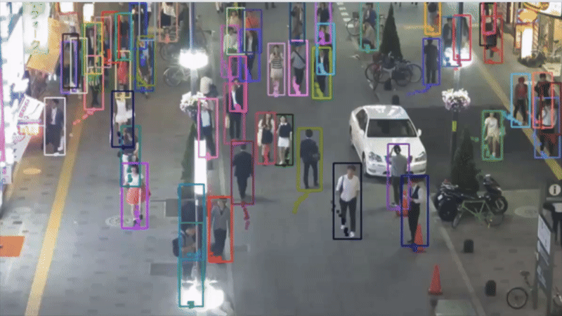
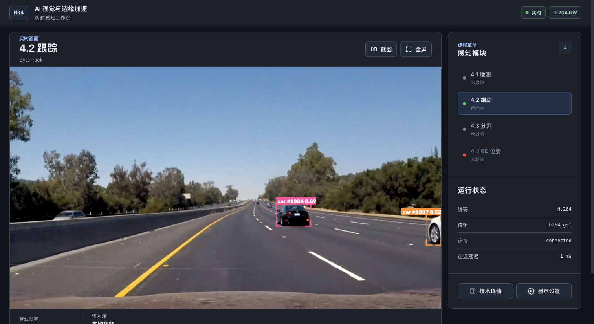
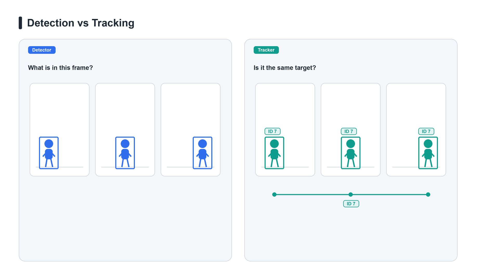
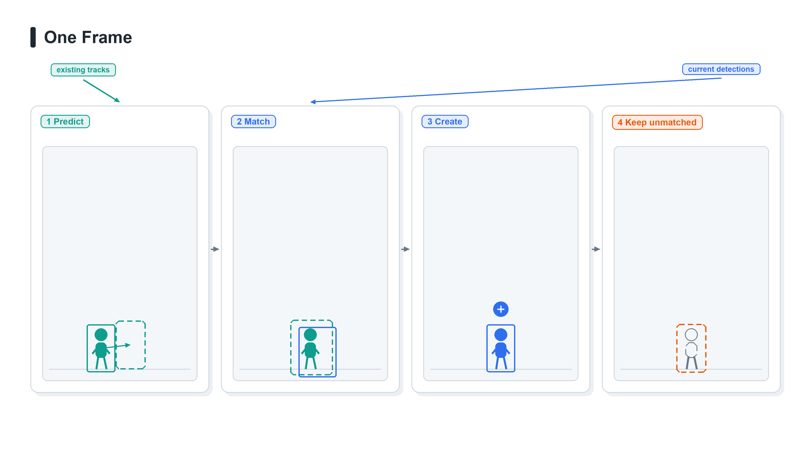
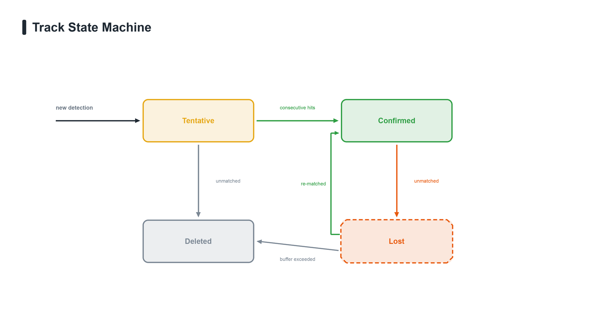
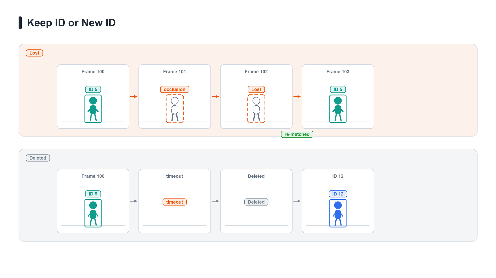

# 4.2 Multi-Object Tracking

## Overview



4.1 got the model to draw boxes in every frame, but the boxes have no names: the same little car looks almost identical in frame 10 and frame 40, and the detector will not tell you they are the same target. Multi-Object Tracking (MOT) fills in exactly this gap of identity continuity: it takes in per-frame detection boxes and outputs tracks with stable IDs.

Course code: the ROS 2 package `bev_tracking` feeds the detection boxes on `/perception/detections` to a ByteTrack tracker and publishes the results on `/perception/tracks`. You do not have to write the tracker itself; what you need to do is understand what it is tracking, what each of the five parameters changes, and which parameter to touch for which symptom.

The input to tracking is 4.1's detection results, so detection quality directly determines the ceiling of tracking. If 4.1's detection is still missing targets, this chapter's tuning can only spin its wheels on bad input. Get the 4.1 pipeline running smoothly first, then come back and read this chapter.

### Before You Start: What This Lesson Will Walk You Through

| Stage       | What you will understand                                                                                           | What you can ultimately do                                                              |
| ----------- | ------------------------------------------------------------------------------------------------------------------ | --------------------------------------------------------------------------------------- |
| Read        | Why detection boxes are not enough: at which step an ID Switch arises, and what prediction and matching each solve | Understand the tracker's entry configuration and know which step each parameter affects |
| See through | The motivation for two-stage matching: why low-score boxes cannot simply be thrown away                            | Explain why an ID can be recovered after occlusion, and when it cannot                  |
| Run         | How tracking results become one ROS 2 topic, and where the `id` field comes from                                   | Get `bev_tracking` running on the J501 and verify track continuity with `ros2 topic`    |
| Tune        | What each of the five real-machine parameters changes                                                              | Locate which parameter to touch from the symptom, instead of tuning blindly             |

### Learning Outcomes

- State clearly the four actions of Tracking-by-Detection (prediction, association, creation, deletion), and the parameter in the configuration that corresponds to each action.

- State clearly the boundary of responsibility between detection and tracking: why the question "is this the same target" should not be answered by the detection node.

- Explain ByteTrack's two-stage matching: what high-score boxes and low-score boxes each do, and why low-score boxes do not start new tracks.

- State clearly the role of `lost_track_buffer` in occlusion scenarios, and its trade-off with "ghost tracks".

- Get `bev_tracking` running on the J501, and observe ID continuity with `ros2 topic echo /perception/tracks`.

- Know why this chapter does not produce MOTA / IDF1, and what is missing if you really want to quantify.

### Hardware and Software Checklist

- Platform: reComputer Robotics J501 (Jetson AGX Orin 32GB)
- JetPack 6.2.1
- ROS 2 Humble
- GMSL or USB camera

### Prerequisites

- 4.1: understand the detection message contract first. The one-click script starts detection and tracking together; only a standalone tracking node needs an existing `/perception/detections` stream. This chapter does not retrain the detector.

- [1.4 Robot software middleware: getting started with ROS 2 Humble](https://seeedstudio.feishu.cn/docx/QdL7dbITroR6btxqesrcNJE9nib): you can use `ros2 topic` to look at topics and messages. This chapter does not require you to write nodes.

- Linear algebra basics: being able to read matrix multiplication and to accept a representation like "state plus covariance" is enough. This chapter does not derive the Kalman gain.

### Runtime Preview

From `/home/seeed/workspace/ros2_bev` on the Jetson, run `./modules/m04-ai-vision-and-edge-acceleration/scripts/m4/run_m4_2_demo.sh`; the script starts the detection and tracking pipeline it needs, so there is no need to launch the 4.1 demo separately. For browser mode, run `./modules/m04-ai-vision-and-edge-acceleration/scripts/m4/run_m4_web_hub.sh`, open `http://<Jetson-IP>:8080/m4/2`, and select “4.2 Tracking.” Confirm that `/perception/tracks` keeps publishing, then observe the target IDs on screen.



*Jetson Hub playing the local `test_seg.mp4` on 2026-09-23. This single frame shows how IDs appear; it does not establish that an ID remains stable across frames.*

## Read First: From a Pile of Detection Boxes to Individual Tracks

### The Three Problems Multi-Object Tracking Must Solve

The gap between detection and tracking can be stated in one sentence: detection answers "what is in this frame", tracking answers "the box in this frame is which target from which frame". Answering the second question requires handling three things at once.



A target moves between two frames, so the motion model must be able to predict roughly where it will be in the next frame, otherwise matching is out of the question. A newly appearing target needs a new track opened, one leaving the frame must be closed, and repeatedly opening and closing in between is an ID Switch (IDSW). Occlusion, motion blur, and crossing targets can also make detection boxes disappear or land on someone else; what the association layer must do is stop these errors in the current frame and not let them spread to the next one.

**One-line memory aid:** detection gives "what is in this frame", tracking gives "which numbered target this is".

#### Tracking-by-Detection and the Track State Machine

This page uses the **Tracking-by-Detection** paradigm.

The detector finds targets frame by frame; the tracker decides whether detections in different frames belong to the same target, and keeps the corresponding Track ID.

> **The detector answers "what is in this frame"; the tracker answers "is it still the same target as before".**

For example, when a person walks from the left of the frame to the right, the detector outputs a fresh box in every frame. Taken on their own, these boxes have no relationship; the tracker must associate them and keep the same ID for the person throughout.

## What Happens in Each Frame

One complete tracking pass usually consists of four steps:



1. **Predict track positions:** using each target's previous position and motion trend, predict where it may appear in the current frame.

2. **Match the current detections:** associate the current frame's detection boxes with existing tracks. On a successful match, update the track's position and motion state with the new detection.

3. **Create new tracks:** if a detection box matches no existing track, create a new tentative track for it.

4. **Keep temporarily unmatched tracks:** if an existing track finds no corresponding detection in the current frame, do not delete it immediately; keep it for a while and wait for a re-match in later frames.

This mechanism handles occasional missed detections and brief occlusions, and it is the reason the track state machine exists.

## The Track State Machine (Conceptual)

The Tentative / Confirmed / Lost / Deleted labels in the figure below are a teaching abstraction; the real machine calls `supervision.ByteTrack`, so do not treat these English labels as project-defined message fields or as a real ROS interface.



A track does not keep existing forever once it is created.

From a target's first appearance, through stable tracking, to temporary disappearance or final exit, a track passes through different lifecycle states:

```text
                    consecutive hits reach the threshold
new detection ──→ Tentative ─────────────→ Confirmed
              │                         │
              │ unmatched before        │ unmatched in the
              │ confirmation            │ current frame
              ↓                         ↓
           Deleted                    Lost
                                       │
                         ┌─────────────┴─────────────┐
                         │                           │
                     re-matched                window exceeded
                         │                           │
                         ↓                           ↓
                     Confirmed                    Deleted
```

The four states can be summarized as:

| State         | Meaning                                        |
| ------------- | ---------------------------------------------- |
| **Tentative** | Target just found; needs further observation   |
| **Confirmed** | Target confirmed; can be output stably         |
| **Lost**      | No detection for now, but the track is retained |
| **Deleted**   | Track lifecycle over; no longer matched        |

### Tentative: Provisional Tracks

When a new target appears for the first time, it is usually not treated as a reliable track immediately; it first enters the **Tentative** state.

The reason is simple: a single-frame detection may just be a false positive. Only after consecutive hits reach `minimum_consecutive_frames` does the track become Confirmed. If a mismatch occurs before the confirmation condition is met, the track is deleted outright.

For example:

| `minimum_consecutive_frames` | Effect                                                          |
| ---------------------------- | --------------------------------------------------------------- |
| `1`                          | Fast response, but false detections more easily become tracks    |
| `3`                          | More stable, but a new target waits several frames for confirmation |

What this parameter really controls is the **trade-off between how fast a track is confirmed and how strongly false detections are suppressed**.

### Confirmed: Stable Tracks

Once a Tentative track has hit enough consecutive frames, it enters the **Confirmed** state.

At this point the tracker considers the target real and stable, and the Track ID is output normally.

As long as subsequent detections keep matching, the ID is retained continuously:

```text
Frame 120    ID = 7
Frame 121    ID = 7
Frame 122    ID = 7
```

If no corresponding detection box is found in some frame, the track does not disappear immediately; it enters Lost.

### Lost: Temporarily Missing

**Lost does not mean the target has left.**

It means no target was detected in the current frame, but the tracker still retains this track.

Common reasons include:

- the target is briefly occluded by another object;

- the detector occasionally misses a detection;

- motion blur;

- lighting changes;

- the target briefly leaves the effective detection area.

In the Lost state, the tracker can still keep predicting the target's position from its historical motion state.

For example:

```text
Frame 100    ID = 5
Frame 101    not detected
Frame 102    not detected
Frame 103    detected again → ID = 5
```

As long as the track has not been deleted, a target reappearing in frame 103 has a chance to keep using its original ID. Therefore, **the Lost state decides whether the original track can be reconnected after a brief occlusion.**

### Deleted: Track Ends

Once a track enters **Deleted**, it no longer takes part in later matching.

There are usually two cases:

- the Tentative track was unmatched before it was confirmed;

- the Lost state lasted longer than the allowed retention window.

Once a track is deleted, its original Track ID ends with it. Even if the same target reappears later, it is treated as a new target:

```text
original track: ID = 5
        ↓
long absence
        ↓
track deleted
        ↓
reappears: ID = 12
```

From a person's point of view it may still be the same target; but for the tracker, the original track has ended.



### How Long a Lost Track Is Kept

`lost_track_buffer` controls how many frames a Lost track can be retained when no detection results arrive.

This parameter directly affects ID continuity in occlusion scenarios.

| `lost_track_buffer` | Advantage                                                                          | Cost                                                                                              |
| ------------------- | ---------------------------------------------------------------------------------- | ------------------------------------------------------------------------------------------------- |
| **Larger**          | After a longer occlusion, the original ID can still be recovered; better continuity | Targets that have left the frame stay longer; brief “ghost tracks” may appear                      |
| **Smaller**         | Invalid tracks are cleaned up faster; the picture looks cleaner                    | Even a brief occlusion may delete the track; a reappearing target more easily gets a new ID         |

Think of it as a direct trade-off:

> **Longer retention → better ID continuity**
> **Shorter retention → faster track cleanup**

### Do Not Read the Buffer as Seconds

`lost_track_buffer` is a lost buffer counted in frames; the actual elapsed seconds also depend on the input frame rate. The current configuration base is **90**, with `frame_rate` set to **30**. The table below only shows how long “the same 90 processed frames” lasts at different actual throughputs:

How long an occlusion can actually be tolerated also depends on the video frame rate:

| Actual frame rate | Track retention time |
| ----------------- | -------------------- |
| 30 FPS            | about 3 s            |
| 15 FPS            | about 6 s            |
| 10 FPS            | about 9 s            |

So when tuning on the real machine you cannot look at the value of `lost_track_buffer` alone; you must also take the system's actual frame rate into account.

## Kalman Prediction and Hungarian Matching: What Each Solves

In target tracking, the Kalman filter and the Hungarian algorithm often appear together, but they solve completely different problems:

> **The Kalman filter predicts "roughly where the target is"; the Hungarian algorithm decides "which detection box belongs to which track".**

### Kalman Prediction: Where the Target Will Be

The boxes a detector produces jitter, and it occasionally misses detections, so you cannot rely on the current frame's position alone. A tracker usually keeps a state for each track, such as the target's **position, size, and velocity**. Entering a new frame, the Kalman filter mainly does two things:

1. **Predict**: estimate where the target may appear now, based on the previous frame's motion state;

2. **Update**: if a detection box is matched successfully in the current frame, use that new observation to correct the prediction.

It can be understood as:

```text
previous frame's state
    ↓
motion-model prediction
    ↓
predicted position
    ↓
match the current detection box
    ↓
correct the state with the detection
```

The Kalman filter maintains not only "where the target is" but also the **uncertainty** of that estimate. When several consecutive frames bring no observation, the prediction becomes less and less reliable and the uncertainty grows; once a detection arrives again, the new observation helps the track converge again.

So it is not simply averaging "the predicted position" and "the detected position"; it decides which side to trust more based on their uncertainties.

### Hungarian Matching: Which Detection Box Belongs to Which Track

After prediction, another question remains:

Suppose there are currently `N` tracks and `M` detected targets at the same time; how should they be paired up one to one?

For example:

```text
existing tracks              current detections

Track 1  ─────────────── Detection A
Track 2  ─────────────── Detection B
Track 3  ─────────────── Detection C
```

In reality, of course, these connections are not known in advance. The tracker first computes the **matching cost** of every "track–detection" pair to form a cost matrix, and then the Hungarian algorithm looks for the set of pairings with the smaller total cost. The Hungarian algorithm itself does not know what a target is, nor what IoU is. **It is only responsible for completing the assignment from costs that have already been computed.** One of the keys to tracking quality is therefore:

> **How the cost between a track and a detection box is actually computed.**

### Common Matching Criteria

There are mainly three kinds of matching criteria:

| Criterion                 | What it judges                                            | Characteristics                                              |
| ------------------------- | --------------------------------------------------------- | ------------------------------------------------------------ |
| **IoU / overlap**         | Whether predicted and detection boxes overlap enough      | Simple to compute and fast                                   |
| **Appearance features**   | Whether the current target looks similar to past targets  | Better under occlusion and crossing, but requires ReID       |
| **Mahalanobis distance**  | Whether the detection lies within a plausible range of the predicted track | Can incorporate the Kalman filter's uncertainty |

Among them, **IoU is the most direct approach**. The more a predicted box and a detection box overlap, the more likely they belong to the same target; if the match is below the allowed threshold, the pairing is ruled out. The `minimum_matching_threshold` in this chapter's code takes part in filtering such match results.

But position alone is not always reliable. When several people cross or occlude one another, different targets' boxes can be very close, which is why DeepSORT introduced **ReID appearance features**. It extracts additional visual features to judge whether the person detected now is still the same person as before. This chapter's setup does not enable ReID, so it uses no such appearance information.

**Mahalanobis distance** solves a different problem: a detection box deviates from the predicted position, but is that deviation actually abnormal? It looks not only at the distance itself but also at the uncertainty maintained by the Kalman filter. The more stable the track prediction, the tighter the matching range can be; after several frames of lost observations the prediction's uncertainty grows, and the reasonable search range changes with it.

These criteria are not independent "algorithm schools" from which a tracker picks one; in practice a tracker selects one or a combination according to its association strategy. The differences among SORT, DeepSORT, ByteTrack, and BoT-SORT are not just a different distance function either; they make different design choices for **motion prediction, matching criteria, and the association flow**.

| Algorithm     | Main idea                                                                                                                          |
| ------------- | ---------------------------------------------------------------------------------------------------------------------------------- |
| **SORT**      | Uses Kalman filtering for motion prediction and IoU to associate tracks with detection boxes                                        |
| **DeepSORT**  | Adds ReID appearance features on top of motion and position matching to strengthen identity association                             |
| **ByteTrack** | Does not rely on ReID; makes full use of low-confidence detection boxes to reduce track breaks caused by falling detection confidence |
| **BoT-SORT**  | Further adds camera motion compensation to the association strategy and can combine ReID appearance features                         |

ByteTrack deserves special attention. Its key is not that it invented a new matching distance, but that it changed **how detection boxes take part in association**: high-confidence boxes complete the main matching first, and tracks still unmatched are then associated a second time with low-confidence boxes.

This way, even if a target's detection confidence temporarily drops because of occlusion or blur, as long as the box's position is still reasonable it can keep the original track instead of being discarded immediately for a "score that is too low". The next section expands on this two-stage association mechanism.

> **A parameter name cannot be read without its implementation.**
> Different tracking libraries may use similar parameter names with different meanings, directions, and ranges. For example, "matching threshold = 0.8" does not necessarily describe the same condition in different implementations. So whenever this chapter refers to a threshold, it also names the specific implementation and the real-machine parameter.

### ByteTrack's Two-Stage Matching: Why Low-Score Boxes Are Still Used

Earlier we said "match predicted boxes against detection boxes", but did not answer one question: **which boxes are eligible to enter this matching table**. An occluded target can often still be detected, only with its confidence dropping to between 0.1 and 0.3. The conventional approach throws these away during score filtering, so the track breaks. ByteTrack's core observation is that among these low-score boxes, some are precisely the position of the occluded target. Throwing them away means giving up the very observation you need most.

So it splits matching into two rounds:

1. **First round**: high-score boxes (score ≥ the activation threshold) are matched against all tracks.

2. **Second round**: the remaining low-score boxes are matched once more, only against the tracks that were **not matched** in the first round.

Two constraints are key. A low-score box **only rescues an existing track; it does not start a new track**. Otherwise any patch of noise in the frame would become a new track. Moreover, the second round's threshold is usually stricter than the first round's, because a low-score box's position is itself not very trustworthy.

The real machine condenses this mechanism into one parameter: `track_activation_threshold` (0.25) decides "how high a score counts as a detection worth considering"; a box below it cannot activate a new track, but still has a chance to take part in second-round rescue.

**One-line memory aid:** high-score boxes are responsible for "discovering new targets", low-score boxes for "not losing old targets".

### Camera Motion Compensation: When It Is Actually Needed

All the reasoning above assumes the camera is stationary. When the robot is walking or a gimbal is turning, the whole image undergoes a rigid displacement, and the motion model's "constant velocity" assumption immediately fails: the position it extrapolates may differ from the actual detection position by hundreds of pixels, IoU drops straight to zero, and the track breaks. Camera motion compensation (Global Motion Compensation, GMC) is meant to estimate exactly this rigid displacement; the approach is to estimate a global transform from two adjacent frames and move the predicted position along with it.

If the robot has its own odometry or IMU, there is a more reliable route: use the external motion information to transform the prediction from the camera frame into the world frame, rather than inferring it backward from the image.

> **GMC is not enabled on this chapter's real machine.** `supervision.ByteTrack` does not provide this option, and `config/bytetrack.yaml` has no corresponding parameter either. This section is kept so that you know: when you later move to a moving-camera scenario, this is the first piece to fill in, and it is not something you can work around by tuning `lost_track_buffer`.

### From Algorithm to Real-Machine Parameters: What Each of the Five Parameters Changes

The five parameters in `config/bytetrack.yaml` correspond directly to the constructor parameters of `supervision.ByteTrack`:

| Parameter                    | Real-machine value | What it changes                                                                                    | Symptom                                                                                                                                                                                                                                                                                                                      |
| ---------------------------- | ------------------ | -------------------------------------------------------------------------------------------------- | ---------------------------------------------------------------------------------------------------------------------------------------------------------------------------------------------------------------------------------------------------------------------------------------------------------------------------- |
| `track_activation_threshold` | 0.25               | The threshold for a **high-score detection**, and the score that activating a new track depends on | Turn it up: tracks are cleaner and more stable, but weak targets are missed; turn it down: weak targets can also start tracks, but noise and instability come in with them. It is **not** "the minimum confidence for a detection to take part in tracking" — a box below it may still take part in second-stage association |
| `lost_track_buffer`          | 90                 | The **buffer base** for lost tracks                                                                | Turn it up: occlusion tolerance grows longer and tracks break less easily, at the cost of longer-lasting ghost tracks; turn it down: tracks are cleaned up sooner, but IDs may change after occlusion. The actual duration also depends on `frame_rate`                                                                      |
| `minimum_matching_threshold` | 0.8                | The **maximum matching cost** allowed in first-stage association                                   | Turn it up: matching is looser, pairings with worse overlap are accepted, and tracks break less easily; turn it down: stricter, and when a target moves fast or box overlap is poor it easily breaks into a new ID. It governs only the first stage and is not a threshold shared by all stages                              |
| `frame_rate`                 | 30                 | The scaling factor corresponding to the actual processing frame rate                               | It participates in lost-window calculation; if throughput changes without updating it, motion prediction and occlusion tolerance can deviate from expectations                                                                                                                                                               |
| `minimum_consecutive_frames` | 1                  | How many consecutive matches a track needs before it is used externally as a **stable track**      | Turn it up: it suppresses accidental tracks produced by brief false detections, but a new target has to wait several frames before getting a stable ID                                                                                                                                                                       |

There are two more parameters that do not affect tracking behavior but that you will encounter when reading logs: `tracker_type` (fixed at `bytetrack`, the only tracker on the real machine) and `publish_log_throttle_ms` (log throttling, 1000 ms).

**`frame_rate` and `lost_track_buffer` must be read together.** The actual lost window is not `lost_track_buffer` itself, but:

```text
max_time_lost = int(frame_rate / 30 × lost_track_buffer)
```

Substituting the current configuration (`frame_rate = 30`, `lost_track_buffer = 90`) gives 90 processed frames. At about 30 FPS that is 3 seconds; if actual throughput falls to about 15 FPS while the configuration is unchanged, the same 90 frames span about 6 seconds.

The comment in `config/bytetrack.yaml` states that `frame_rate` corresponds to the observed throughput of `bev_detection` on the Orin. If you switch detection to another input source and the frame rate changes, this value must change with it, otherwise the actual occlusion tolerance window will deviate from expectations.

## Hands-On: Wire Detection Boxes into a Track Topic

Three steps. All commands run on the J501 from `/home/seeed/workspace/ros2_bev`. The prerequisite is that the 4.1 detection pipeline is already running, or that you use the repository's `mock_detection_publisher` to produce a detection stream.

### Step 5: Launch the Tracking Pipeline

Wire 4.1's detection output into tracks. The least effort is to run the one-click script directly:

```bash
cd /home/seeed/workspace/ros2_bev
./modules/m04-ai-vision-and-edge-acceleration/scripts/m4/run_m4_2_demo.sh
```

The script follows the course hardware's GMSL2 path, starts `camera_adapter_node` itself to convert the upstream images into the topic the tracking node expects, then starts `tracking_node` and the visualizer. To run the tracking node alone, use `tracking_demo.launch.py`, whose parameter defaults already configure the input and output topics.

### Step 6: Verify `/perception/tracks`

Next, do not just look at whether the topic exists; confirm that the track messages can really be consumed.

```bash
ros2 topic info -v /perception/tracks
ros2 topic hz /perception/tracks
ros2 topic echo /perception/tracks --once
```

Check each item:

- The **message type** is `vision_msgs/msg/Detection2DArray`, the same as `/perception/detections`. Tracking reuses the standard message; there is no self-developed track message type.

- **QoS** is the same as 4.1 (`BEST_EFFORT` / `KEEP_LAST` depth 10 / `VOLATILE`). Both sides are configured as sensor data, and the subscriber must use the same QoS.

- **Every detection box carries an `id`**. This `id` is the track number, and it is also the field that 4.1 deliberately leaves empty: the detection node does not fill it; only the tracking node does.

`tracking_visualizer` additionally publishes `/perception/tracking_debug_image`, on which every target carries its ID. In a headless environment you can use `--no-gui` to skip `rqt_image_view`, but the debug image is still published as usual.

### Step 7: Observe Symptoms and Tune Parameters

Run the same scene, observe the following symptoms, then locate the problem by the corresponding parameter:

```bash
# Restart after changing a parameter, then compare the same scene
vim modules/m04-ai-vision-and-edge-acceleration/4.2-multi-object-tracking/ros2/bev_tracking/config/bytetrack.yaml
```

| Symptom                                                            | Which parameter to look at first                                                                                                              |
| ------------------------------------------------------------------ | --------------------------------------------------------------------------------------------------------------------------------------------- |
| The ID changes immediately after occlusion                         | Turn `lost_track_buffer` up (and at the same time confirm `frame_rate` matches the actual frame rate)                                         |
| The target has left the frame but the box still drifts in place    | Turn `lost_track_buffer` down                                                                                                                 |
| Tracks break frequently when the target moves fast                 | First check whether the detection boxes are stable; if first-stage association is indeed too strict, turn `minimum_matching_threshold` **up** |
| Noise in the frame becomes a track                                 | Turn `track_activation_threshold` up, or turn `minimum_consecutive_frames` up                                                                 |
| The occlusion tolerance duration differs greatly from expectations | Check whether `frame_rate` matches the actual input frame rate                                                                                |

Changing `lost_track_buffer` is the most intuitive experiment: the current setting is 90, and increasing it may reconnect an ID after a longer occlusion, but also retains a departed target longer. Record both effects in the same scene.

## Deliverables and Acceptance Criteria

### Deliverables Checklist

1. A running tracking pipeline: `./modules/m04-ai-vision-and-edge-acceleration/scripts/m4/run_m4_2_demo.sh` starts normally, and `/perception/tracks` keeps publishing.

2. A verification record of the track contract: the type and QoS from `ros2 topic info -v`, and an excerpt of detection boxes carrying an `id` from `ros2 topic echo`.

3. One parameter-tuning comparison: change at least one parameter (recommended: `lost_track_buffer`) and record the difference in symptoms before and after.

4. A piece of visualization evidence: a screenshot of `/perception/tracking_debug_image` with IDs on the image.

### Acceptance Criteria

| Check                  | Pass criterion                                                                                                                | When failing, inspect first                                                                                                                                                                          |
| ---------------------- | ----------------------------------------------------------------------------------------------------------------------------- | ---------------------------------------------------------------------------------------------------------------------------------------------------------------------------------------------------- |
| Pipeline connectivity  | `tracking_node` starts normally, `/perception/tracks` has data and its rate matches the detection input                       | Whether the upstream `/perception/detections` is publishing; whether `camera_adapter_node` was missed at startup                                                                                     |
| Message contract       | The type is `vision_msgs/msg/Detection2DArray`; QoS is the same as 4.1                                                        | Whether the subscriber used the default RELIABLE QoS                                                                                                                                                 |
| ID ownership           | Every detection box on `/perception/tracks` carries a non-empty `id`; those on `/perception/detections` are still empty       | Whether the two topics were mixed up                                                                                                                                                                 |
| Continuity             | The same continuous track keeps the same `id` before and after occlusion (within the duration covered by `lost_track_buffer`) | Whether `lost_track_buffer` is too small; whether `frame_rate` does not match the actual frame rate                                                                                                  |
| Parameters take effect | After changing `config/bytetrack.yaml` and restarting, the behavior changes accordingly                                       | Whether you changed the copy belonging to `bev_tracking`; whether the package was reinstalled (after changing a Python package's config you must reinstall, or edit the copy under install directly) |
| Symptom record         | At least one before/after comparison, stating clearly what was changed and what was seen                                      | —                                                                                                                                                                                                    |

## FAQ and Troubleshooting

### The Same Target's ID Jumps Frequently

- **Symptom**: the target is continuously visible in the frame, yet the ID changes every few frames.

- **Cause**: in order of likelihood. The detection box positions themselves jitter a lot (go back to 4.1 to check), `minimum_matching_threshold` is too high so that a slight movement fails to match, or `frame_rate` does not match the actual frame rate so the duration of the lost window is computed wrongly.

- **Solution**: first look at the debug image of `/perception/detections` and the debug image of `/perception/tracks` side by side to confirm whether the detection boxes themselves are stable; if detection is fine, then tune the matching threshold; finally check `frame_rate`. Note that appearance features are not enabled on the real machine, so **tuning parameters alone cannot solve "two similar-looking targets swapping IDs"**; that needs appearance information and is another route.

### The Target Has Left the Frame but the Track Is Still There

- **Symptom**: after the target walks out of the frame, the original box still drifts near the edge for a few frames.

- **Cause**: this is exactly the designed behavior of `lost_track_buffer`: it keeps an N-frame lost window, used to reconnect occluded targets. Whether the target has really left or is occluded cannot be told apart by the tracker in the current frame.

- **Solution**: decide whether this is an occlusion need or the cost of ghost tracks. Turning `lost_track_buffer` down cleans up tracks faster, at the cost of an inevitable ID change after occlusion. There is no solution that satisfies both; choose according to the scenario.

### The Track Topic Has Data but Downstream Receives Nothing

- **Symptom**: `ros2 topic hz /perception/tracks` looks normal, but the subscriber you wrote receives not a single message, and reports no error either.

- **Cause**: QoS incompatibility. Both topics use `SensorDataQoS` (BEST_EFFORT); if the subscriber uses the default RELIABLE, DDS decides they cannot connect, simply does not establish a connection, and reports no error.

- **Solution**: confirm the publisher's QoS with `ros2 topic info -v`, and change the subscriber to `rclcpp::SensorDataQoS()` (C++) or `qos_profile_sensor_data` (Python).

### After Adding Tracking, the Detection Empty-Frame Behavior Gets Broken

- **Symptom**: 4.1's detection pipeline originally published a message every frame (including empty frames); after a revised version of the code, tracks break immediately in occlusion scenarios.

- **Cause**: the detection node returns early when `detections` is empty and does not publish a message. Tracking advances its lost counter based on "nothing was observed in this frame"; if no message arrives it does not count as an observation, and it approaches "nothing happened".

- **Solution**: go back to 4.1 and confirm the empty-frame contract still holds: publish every frame, and publish an empty array for empty frames. When modifying the detection node, do not casually add "early return on empty boxes".

> **Next step:** 4.3 assigns a semantic class to each pixel and derives a ground-candidate mask; it cannot prove collision-free space. Tracking IDs and segmentation masks are currently independent outputs, so any later integration must align their timestamps explicitly, and a planned integration must not be written up as if it were already done.