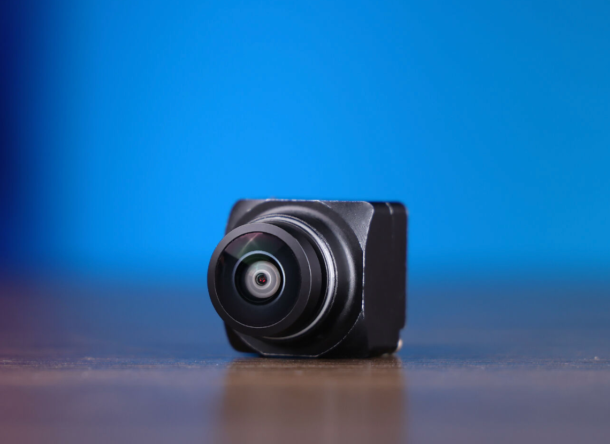

# 4.2 Multi-Object Tracking

## Course Overview


4.1 got the model to draw boxes in every frame, but the boxes have no names: the same little car looks almost identical in frame 10 and frame 40, and the detector will not tell you they are the same target. Multi-Object Tracking (MOT) fills in exactly this gap of identity continuity: it takes in per-frame detection boxes and outputs tracks with stable IDs.

This chapter is about "integrating" rather than "implementing": the ROS 2 package `bev_tracking` feeds the detection boxes on `/perception/detections` to a ByteTrack tracker and publishes the results on `/perception/tracks`. You do not have to write the tracker itself; what you need to do is understand what it is tracking, what each of the five parameters changes, and which parameter to touch for which symptom.

The input to tracking is 4.1's detection results, so detection quality directly determines the ceiling of tracking. If 4.1's detection is still missing targets, this chapter's tuning can only spin its wheels on bad input. Get the 4.1 pipeline running smoothly first, then come back and read this chapter.

### Before You Start: What This Lesson Will Walk You Through

| Stage | What you will understand | What you can ultimately do |
| --- | --- | --- |
| Read | Why detection boxes are not enough: at which step an ID Switch arises, and what prediction and matching each solve | Understand the tracker's entry configuration and know which step each parameter affects |
| See through | The motivation for two-stage matching: why low-score boxes cannot simply be thrown away | Explain why an ID can be recovered after occlusion, and when it cannot |
| Run | How tracking results become one ROS 2 topic, and where the `id` field comes from | Get `bev_tracking` running on the J501 and verify track continuity with `ros2 topic` |
| Tune | What each of the five real-machine parameters changes | Locate which parameter to touch from the symptom, instead of tuning blindly |

### Learning Outcomes

- State clearly the four actions of Tracking-by-Detection (prediction, association, creation, deletion), and the parameter in the configuration that corresponds to each action.

- State clearly the boundary of responsibility between detection and tracking: why the question "is this the same target" should not be answered by the detection node.

- Explain ByteTrack's two-stage matching: what high-score boxes and low-score boxes each do, and why low-score boxes do not start new tracks.

- State clearly the role of `lost_track_buffer` in occlusion scenarios, and its trade-off with "ghost tracks".

- Get `bev_tracking` running on the J501, and observe ID continuity with `ros2 topic echo /perception/tracks`.

- Know why this chapter does not produce MOTA / IDF1, and what is missing if you really want to quantify.

### Hardware and Software Checklist

|  |  |  |
| --- | --- | --- |

Note on the real-machine choice: `bev_tracking` explicitly rejects Ultralytics' `BYTETracker`, because it would drag in an entire training stack of dependencies such as torch, whereas tracking itself only needs to associate boxes and does not need a neural network. This is also why this chapter does not require a PyTorch environment.

### Prerequisites

- 4.1: the detection pipeline is already running and `/perception/detections` outputs stably. This chapter does not retrain the detection model, nor does it change the detection results.

- [1.4 Robot software middleware: getting started with ROS 2 Humble](https://seeedstudio.feishu.cn/docx/QdL7dbITroR6btxqesrcNJE9nib): you can use `ros2 topic` to look at topics and messages. This chapter does not require you to write nodes.

- [2.1 GMSL2: automotive-grade multi-camera integration](https://seeedstudio.feishu.cn/docx/Takhd7wo5oPx3mx0ljhcfyxDnEe): needed when using GMSL2 cameras, to confirm the image path and driver.

- Linear algebra basics: being able to read matrix multiplication and to accept a representation like "state plus covariance" is enough. This chapter does not derive the Kalman gain.

## Read First: From a Pile of Detection Boxes to Individual Tracks

### The Three Problems Multi-Object Tracking Must Solve

The gap between detection and tracking can be stated in one sentence: detection answers "what is in this frame", tracking answers "the box in this frame is which target from which frame". Answering the second question requires handling three things at once.

A target moves between two frames, and the motion model must be able to predict roughly where it will be in the next frame, otherwise matching is out of the question. A newly appearing target needs a new track opened, one leaving the frame must be closed, and repeatedly opening and closing in between is an ID Switch (IDSW). Occlusion, motion blur, and crossing targets can also make detection boxes disappear or land on someone else; what the association layer must do is stop these errors in the current frame and not let them spread to the next one.

**One-line memory aid:** detection gives "what is in this frame", tracking gives "which numbered target this is".

### Tracking-by-Detection and the Track State Machine

This page uses the Tracking-by-Detection paradigm: the detector produces boxes frame by frame, and the tracker is only responsible for stringing the boxes into tracks. The per-frame flow is fixed at four steps.

1. Prediction: for each existing track, extrapolate its position and uncertainty in the current frame with the motion model.

2. Association: match the current frame's detection boxes against the predicted positions, seeking the pairing with the minimum total cost.

3. Creation: a detection box that matches no track is treated as a new target, and a tentative track is opened.

4. Deletion: a track that fails to match a detection for several consecutive frames is judged to have left, and is deleted.

The difference between the four steps lies in what cost "association" uses, and how strict a threshold "creation / deletion" uses. Every state in the state machine corresponds to one real-machine parameter:

| State | Entry condition | Exit condition and observed symptom |
| --- | --- | --- |
| Tentative | A new detection box matches no track, so a track is created | If it matches for `minimum_consecutive_frames` consecutive frames it becomes confirmed; losing a match once within the window deletes it. Symptom: a false detection does not immediately become a track |
| Confirmed | A tentative track reaches `minimum_consecutive_frames` consecutive hits | If it fails to match in some frame it becomes lost; symptom: the stable ID output externally is produced in this state |
| Lost | A confirmed track fails to match a detection in some frame, and is still extrapolated with its predicted value | If the number of lost frames exceeds the actual lost window it is deleted; if it matches again in the meantime it recovers its original ID. Symptom: this is the only window in which the original ID can be "reconnected" after occlusion |
| Deleted | The number of lost frames exceeds the limit, or the track was never confirmed | Unrecoverable. When the target reappears it can only get a new ID |

The lost window is determined jointly by `lost_track_buffer` and `frame_rate`, and is the pair of parameters that directly decides "whether the original ID can be reconnected" in occlusion scenarios: turning them up can reconnect a target occluded for a long time, at the cost that a ghost track still lingers for a while after the target has really left the frame; turning them down does exactly the opposite. See the "From Algorithm to Real-Machine Parameters" section for how the two convert.

### Kalman Prediction and Hungarian Matching: What Each Solves

These two things are often lumped together, but their division of labor is actually very clear.

**The motion model answers "roughly where it is".** With only noisy detection boxes, "where is it most likely to be now, and how uncertain is that" requires two things: a state (position, size, velocity) and an uncertainty. Each frame first extrapolates the previous frame's state to the current frame with the motion model (the uncertainty grows accordingly, because one more frame of extrapolation has been added), then pulls it back to the observed position with the matched detection box (the uncertainty shrinks accordingly). "How far to pull back" is determined by weighting the two uncertainties, not by averaging at a fixed ratio.

**Matching answers "which box belongs to which track".** Given N tracks and M detection boxes, how to pair them so that the total cost is minimized. The real difference among the four generations of the SORT family lies entirely in how the cost is computed:

- **Overlap cost**: it only asks "how much do the predicted box and the detection box overlap". A pairing whose cost exceeds the threshold is directly ruled invalid. The real machine's `minimum_matching_threshold` is exactly this cost threshold for the first stage.

- **Appearance cost**: it asks "does this box look like the target I remember", and requires an additional ReID network. **Not enabled** on the real machine.

- **Mahalanobis distance**: it asks "how many standard deviations is this detection box away from my predicted position", and loosens or tightens automatically with the state uncertainty. Not directly exposed on the real machine.

The four generations diverge here: SORT uses only IoU, and changes the ID as soon as occlusion lasts more than one frame; DeepSORT adds appearance features, at the cost of running a network once per box per frame; ByteTrack bypasses the network and instead uses low-score boxes (next section); BoT-SORT further adds camera motion compensation.

> Here is the pitfall you are most likely to step into when reading the code: **a parameter with the same name has a different meaning in different implementations**. Writing "threshold 0.8" without the library name is as good as writing nothing. This chapter always includes the library name and the real-machine parameter name.

### ByteTrack's Two-Stage Matching: Why Low-Score Boxes Are Still Used

Earlier we said "match predicted boxes against detection boxes", but did not answer one question: **which boxes are eligible to enter this matching table**.

An occluded target can often still be detected, only with its confidence dropping to between 0.1 and 0.3. The conventional approach throws these away during score filtering, so the track breaks. ByteTrack's core observation is that among these low-score boxes, some are precisely the position of the occluded target. Throwing them away means giving up the very observation you need most.

So it splits matching into two rounds:

1. **First round**: high-score boxes (score ≥ the activation threshold) are matched against all tracks.

2. **Second round**: the remaining low-score boxes are matched once more, only against the tracks that were **not matched** in the first round.

Two constraints are key. A low-score box **only rescues an existing track; it does not start a new track**. Otherwise any patch of noise in the frame would become a new track. Moreover, the second round's threshold is usually stricter than the first round's, because a low-score box's position is itself not very trustworthy.

The real machine condenses this mechanism into one parameter: `track_activation_threshold` (0.25) decides "how high a score counts as a detection worth considering"; a box below it cannot activate a new track, but still has a chance to take part in second-round rescue.

**One-line memory aid:** high-score boxes are responsible for "discovering new targets", low-score boxes for "not losing old targets".

### Camera Motion Compensation: When It Is Actually Needed

All the reasoning above assumes the camera is stationary. When the robot is walking or a gimbal is turning, the whole image undergoes a rigid displacement, and the motion model's "constant velocity" assumption immediately fails: the position it extrapolates may differ from the actual detection position by hundreds of pixels, IoU drops straight to zero, and the track breaks. Camera motion compensation (Global Motion Compensation, GMC) is meant to estimate exactly this rigid displacement; the approach is to estimate a global transform from two adjacent frames and move the predicted position along with it.

If the robot has its own odometry or IMU, there is a more reliable route: use the external motion information to transform the prediction from the camera frame into the world frame, rather than inferring it backward from the image.

> **GMC is not enabled on this chapter's real machine.** `supervision.ByteTrack` does not provide this option, and `config/bytetrack.yaml` has no corresponding parameter either. This section is kept so that you know: when you later move to a moving-camera scenario, this is the first piece to fill in, and it is not something you can work around by tuning `lost_track_buffer`.

### From Algorithm to Real-Machine Parameters: What Each of the Five Parameters Changes

The five parameters in `config/bytetrack.yaml` correspond directly to the constructor parameters of `supervision.ByteTrack`:

| Parameter | Real-machine value | What it changes | Symptom |
| --- | --- | --- | --- |
| `track_activation_threshold` | 0.25 | The threshold for a **high-score detection**, and the score that activating a new track depends on | Turn it up: tracks are cleaner and more stable, but weak targets are missed; turn it down: weak targets can also start tracks, but noise and instability come in with them. It is **not** "the minimum confidence for a detection to take part in tracking" — a box below it may still take part in second-stage association |
| `lost_track_buffer` | 30 | The **buffer base** for lost tracks | Turn it up: occlusion tolerance grows longer and tracks break less easily, at the cost of longer-lasting ghost tracks; turn it down: tracks are cleaned up neatly, but the ID easily changes after occlusion. **The actual window is not equal to this number**; it is scaled by `frame_rate` |
| `minimum_matching_threshold` | 0.8 | The **maximum matching cost** allowed in first-stage association | Turn it up: matching is looser, pairings with worse overlap are accepted, and tracks break less easily; turn it down: stricter, and when a target moves fast or box overlap is poor it easily breaks into a new ID. It governs only the first stage and is not a threshold shared by all stages |
| `frame_rate` | 10 | The scaling factor corresponding to the actual processing frame rate | It takes part in computing the lost window, see the formula below; if the input throughput changes but this is not changed, the actual occlusion tolerance window will deviate from expectations |
| `minimum_consecutive_frames` | 1 | How many consecutive matches a track needs before it is used externally as a **stable track** | Turn it up: it suppresses accidental tracks produced by brief false detections, but a new target has to wait several frames before getting a stable ID |

There are two more parameters that do not affect tracking behavior but that you will encounter when reading logs: `tracker_type` (fixed at `bytetrack`, the only tracker on the real machine) and `publish_log_throttle_ms` (log throttling, 1000 ms).

**`frame_rate` and `lost_track_buffer` must be read together.** The actual lost window is not `lost_track_buffer` itself, but:

```text
max_time_lost = int(frame_rate / 30 × lost_track_buffer)
```

Substituting the real-machine configuration (`frame_rate = 10`, `lost_track_buffer = 30`), the actual window is 10 frames. Reading `lost_track_buffer` directly as "keep 30 frames" overestimates it threefold.

The comment in `config/bytetrack.yaml` states that `frame_rate` corresponds to the observed throughput of `bev_detection` on the Orin. If you switch detection to another input source and the frame rate changes, this value must change with it, otherwise the actual occlusion tolerance window will deviate from expectations.

### Metric Definitions: Why This Chapter Does Not Produce These Numbers

The standard metrics for tracking quality are MOTA and IDF1:

- **MOTA** leans toward the errors of detection and track creation, penalizing missed detections, false detections, and ID switches together. It is more easily affected by detection quality, and the result can even be negative.

- **IDF1** cares only about whether identities are recognized correctly, and is more informative when there is a lot of occlusion and crossing and the ID jumps repeatedly.

The two metrics must be read together: a high MOTA with a low IDF1 means positions were followed but identities were mistaken.

**But this chapter does not produce these two numbers**, because both require frame-by-frame human-annotated ground truth, and the real machine has neither this annotation nor an evaluation script. The available substitute observation is "whether the same target's ID is maintained across consecutive frames", which is exactly what Step 7 asks you to observe. To really quantify it, you must first supply an annotated test sequence; that is another matter.

## Hands-On: Wire Detection Boxes into a Track Topic

Three steps. All commands run on the J501, and the working directory is `/home/seeed/workspace/ros2_bev`. The prerequisite is that 4.1's detection pipeline is already running, or that you use the repository's bundled `mock_detection_publisher` to generate a detection stream.

### Step 5: Launch the Tracking Pipeline

Wire 4.1's detection output into tracks. The least effort is to run the one-click script directly:

```bash
cd /home/seeed/workspace/ros2_bev
scripts/m4/run_m4_2_demo.sh
```

The script takes the GMSL2 path of the course hardware, brings up `camera_adapter_node` itself to convert the upstream image into the topic the tracking node expects, then starts `tracking_node` and the visualization node. If you only want to run the tracking node alone, use `tracking_demo.launch.py`; its parameter defaults already configure the input and output topics.

### Step 6: Verify `/perception/tracks`

Next, do not just look at whether the topic exists; confirm that the track messages can really be consumed.

```bash
ros2 topic info -v /perception/tracks
ros2 topic hz /perception/tracks
ros2 topic echo /perception/tracks --once
```

Check each item:

- The **message type** is `vision_msgs/msg/Detection2DArray`, the same as `/perception/detections`. Tracking reuses the standard message; there is no self-developed track message type.

- **QoS** is the same as 4.1 (`BEST_EFFORT` / `KEEP_LAST` depth 10 / `VOLATILE`). Both sides are configured as sensor data, and the subscriber must use the same QoS.

- **Every detection box carries an `id`**. This `id` is the track number, and it is also the field that 4.1 deliberately leaves empty: the detection node does not fill it; only the tracking node does.

`tracking_visualizer` additionally publishes `/perception/tracking_debug_image`, on which every target carries its ID. In a headless environment you can use `--no-gui` to skip `rqt_image_view`, but the debug image is still published as usual.

### Step 7: Observe Symptoms and Tune Parameters

Run the same scene, observe the following symptoms, then locate the problem by the corresponding parameter:

```bash
# 改参数后重启节点，对比同一段场景
vim ros2_ws/src/bev_tracking/config/bytetrack.yaml
```

| Symptom | Which parameter to look at first |
| --- | --- |
| The ID changes immediately after occlusion | Turn `lost_track_buffer` up (and at the same time confirm `frame_rate` matches the actual frame rate) |
| The target has left the frame but the box still drifts in place | Turn `lost_track_buffer` down |
| Tracks break frequently when the target moves fast | First check whether the detection boxes are stable; if first-stage association is indeed too strict, turn `minimum_matching_threshold` **up** |
| Noise in the frame becomes a track | Turn `track_activation_threshold` up, or turn `minimum_consecutive_frames` up |
| The occlusion tolerance duration differs greatly from expectations | Check whether `frame_rate` matches the actual input frame rate |

Changing `lost_track_buffer` is the most intuitive experiment: it is originally 30 frames, and after turning it up the ID is more easily reconnected within the same occlusion, but it also lingers a while longer after the target has really walked out of the frame. Writing down the symptoms from both runs is more useful than memorizing what the parameters mean.

## Deliverables and Acceptance Criteria

### Deliverables Checklist

1. A running tracking pipeline: `scripts/m4/run_m4_2_demo.sh` starts normally, and `/perception/tracks` keeps publishing.

2. A verification record of the track contract: the type and QoS from `ros2 topic info -v`, and an excerpt of detection boxes carrying an `id` from `ros2 topic echo`.

3. One parameter-tuning comparison: change at least one parameter (recommended: `lost_track_buffer`) and record the difference in symptoms before and after.

4. A piece of visualization evidence: a screenshot of `/perception/tracking_debug_image` with IDs on the image.

### Acceptance Criteria

| Check | Pass criterion | When failing, inspect first |
| --- | --- | --- |
| Pipeline connectivity | `tracking_node` starts normally, `/perception/tracks` has data and its rate matches the detection input | Whether the upstream `/perception/detections` is publishing; whether `camera_adapter_node` was missed at startup |
| Message contract | The type is `vision_msgs/msg/Detection2DArray`; QoS is the same as 4.1 | Whether the subscriber used the default RELIABLE QoS |
| ID ownership | Every detection box on `/perception/tracks` carries a non-empty `id`; those on `/perception/detections` are still empty | Whether the two topics were mixed up |
| Continuity | The same continuous track keeps the same `id` before and after occlusion (within the duration covered by `lost_track_buffer`) | Whether `lost_track_buffer` is too small; whether `frame_rate` does not match the actual frame rate |
| Parameters take effect | After changing `config/bytetrack.yaml` and restarting, the behavior changes accordingly | Whether you changed the copy belonging to `bev_tracking`; whether the package was reinstalled (after changing a Python package's config you must reinstall, or edit the copy under install directly) |
| Symptom record | At least one before/after comparison, stating clearly what was changed and what was seen | — |

## FAQ and Troubleshooting

### The Same Target's ID Jumps Frequently

- **Symptom**: the target is continuously visible in the frame, yet the ID changes every few frames.

- **Cause**: in order of likelihood. The detection box positions themselves jitter a lot (go back to 4.1 to check), `minimum_matching_threshold` is too high so that a slight movement fails to match, or `frame_rate` does not match the actual frame rate so the duration of the lost window is computed wrongly.

- **Solution**: first look at the debug image of `/perception/detections` and the debug image of `/perception/tracks` side by side to confirm whether the detection boxes themselves are stable; if detection is fine, then tune the matching threshold; finally check `frame_rate`. Note that appearance features are not enabled on the real machine, so **tuning parameters alone cannot solve "two similar-looking targets swapping IDs"**; that needs appearance information and is another route.

### The Target Has Left the Frame but the Track Is Still There

- **Symptom**: after the target walks out of the frame, the original box still drifts near the edge for a few frames.

- **Cause**: this is exactly the designed behavior of `lost_track_buffer`: it keeps an N-frame lost window, used to reconnect occluded targets. Whether the target has really left or is occluded cannot be told apart by the tracker in the current frame.

- **Solution**: decide whether this is an occlusion need or the cost of ghost tracks. Turning `lost_track_buffer` down cleans up tracks faster, at the cost of an inevitable ID change after occlusion. There is no solution that satisfies both; choose according to the scenario.

### The Track Topic Has Data but Downstream Receives Nothing

- **Symptom**: `ros2 topic hz /perception/tracks` looks normal, but the subscriber you wrote receives not a single message, and reports no error either.

- **Cause**: QoS incompatibility. Both topics use `SensorDataQoS` (BEST_EFFORT); if the subscriber uses the default RELIABLE, DDS decides they cannot connect, simply does not establish a connection, and reports no error.

- **Solution**: confirm the publisher's QoS with `ros2 topic info -v`, and change the subscriber to `rclcpp::SensorDataQoS()` (C++) or `qos_profile_sensor_data` (Python).

### After Adding Tracking, the Detection Empty-Frame Behavior Gets Broken

- **Symptom**: 4.1's detection pipeline originally published a message every frame (including empty frames); after a revised version of the code, tracks break immediately in occlusion scenarios.

- **Cause**: the detection node returns early when `detections` is empty and does not publish a message. Tracking advances its lost counter based on "nothing was observed in this frame"; if no message arrives it does not count as an observation, and it approaches "nothing happened".

- **Solution**: go back to 4.1 and confirm the empty-frame contract still holds: publish every frame, and publish an empty array for empty frames. When modifying the detection node, do not casually add "early return on empty boxes".

> **Next step:** 4.3 semantic segmentation takes over the question of "whether each pixel can be driven on". The ID given by tracking and the drivable area given by segmentation will be placed on the same pipeline in 4.5, and there you will see that the two have the same requirement for timestamps: both rely on the detection and the camera image sharing the same `header.stamp`. If you observe IDs clearly in this chapter, the integration in 4.5 will go much more smoothly.
