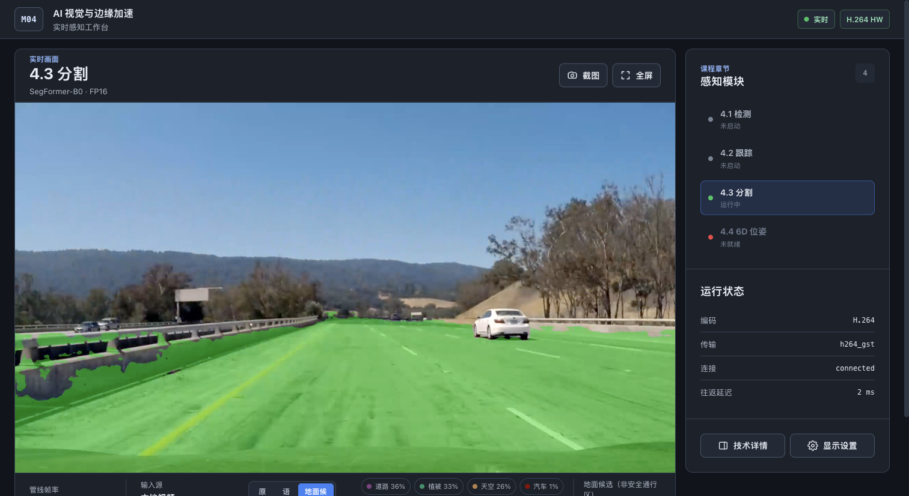
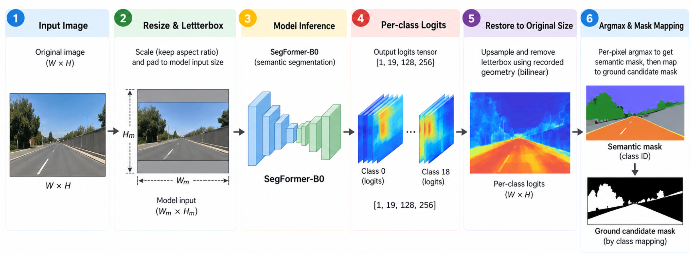
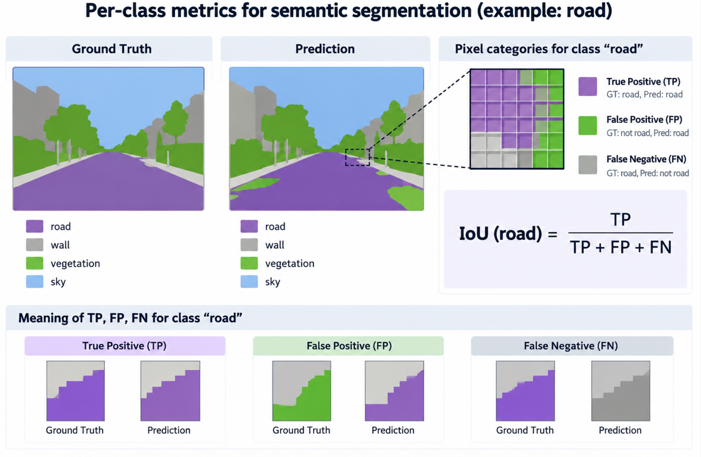
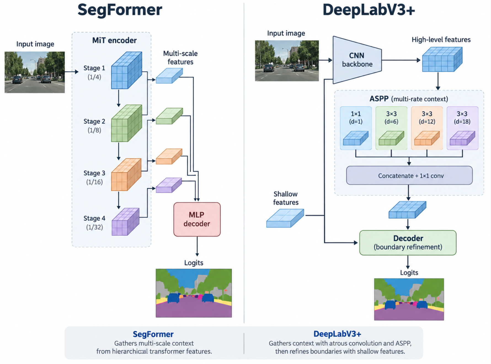

# 4.3 Semantic Segmentation: From Pixel Classes to Ground Candidates

## What This Chapter Explains

Object detection draws boxes around objects. Semantic segmentation predicts a class for **every pixel** in an image. It shows which regions look like road, wall, or vehicle, and a class mapping can turn selected regions into a ground-candidate mask. A predicted class answers “what does this pixel resemble?” It does not, by itself, answer “can the robot cross here safely?”

This chapter uses a SegFormer-B0 model with 19 Cityscapes classes to explain two outputs. `/perception/semantic_mask` stores a class ID for each pixel. `/perception/drivable_mask` writes 255 where the predicted class is selected by configuration and 0 elsewhere. The second topic keeps its existing name, but its useful interpretation is **ground candidate**.

By the end, you should be able to distinguish three segmentation tasks, read segmentation metrics and logits, explain why geometry is restored before assigning final classes, and interpret the two masks correctly.

### Runtime Preview

From `/home/seeed/workspace/ros2_bev` on the Jetson, run the standalone segmentation demo:

```bash
./modules/m04-ai-vision-and-edge-acceleration/scripts/m4/run_m4_3_demo.sh
```

To switch modules in a browser, run `./modules/m04-ai-vision-and-edge-acceleration/scripts/m4/run_m4_web_hub.sh` instead, then open `http://<Jetson-IP>:8080/m4/3`. Select “4.3 Segmentation” to view the source image, semantic view, and ground-candidate view. Run one mode at a time.



*An outdoor road video. Green marks pixels that the model predicts as road and that the mapping includes in the ground-candidate mask.*

## 1. Pixel Classes and Object Instances

Imagine a frame with two cars, a stretch of road, and a wall. Segmentation tasks differ in whether they need to distinguish the two cars:

| Task | Output | Can it separate the two cars? |
| --- | --- | --- |
| Semantic segmentation | One class ID per pixel | No; both cars have pixels labeled car |
| Instance segmentation | One mask and instance ID per object | Yes; each car has its own mask |
| Panoptic segmentation | A unified result for regions such as road and wall plus identifiable object instances | Yes, while retaining the road region's class |

This chapter uses **semantic segmentation** to assign pixels to classes such as road, wall, and car. A semantic mask has no target ID, distance, or height. Following one particular car across frames requires information about object identity as well.

## 2. How an Image Becomes a Class Map



A frame passes through this sequence:

```text
Original image → aspect-preserving resize and letterbox padding → normalized input
               → SegFormer-B0 → class logits
               → restore logits to the original image geometry → pixelwise argmax
               → semantic mask → configured class mapping → ground-candidate mask
```

**Resize and padding.** The model takes a fixed-size input, while the camera image has its own aspect ratio. Resizing without stretching preserves object shapes; letterbox padding fills the remaining area. The pipeline records the scale and padding so the output can be aligned with the original image. The current implementation samples the resized image bilinearly, then converts its colors to the model's channel order and normalized values. Losing the recorded geometry would shift mask boundaries in the original frame.

For an original image `W×H` and model input `Wm×Hm`, the scale is `min(Wm/W, Hm/H)`. The resized dimensions are rounded, and the remaining width or height becomes padding. Restoration must use the **actual rounded dimensions and padding positions**; stretching the padded model canvas directly to the original image would misalign regions.

**Logits.** This model takes an input of shape `[1,3,512,1024]` and produces logits of shape `[1,19,128,256]`: batch size, 19 classes, then height and width at one-quarter of the input resolution. Each output location has 19 scores. They are called logits and are not yet probabilities. The class with the highest score may become the final class once the result has been restored to the original image.

**Restore before classifying.** The implementation uses the saved scale and padding to restore each class's logits to the corresponding original-image positions with bilinear interpolation. Padding is not part of the real scene. It then selects the highest-scoring class (argmax) at each pixel. Those class IDs form `/perception/semantic_mask`.

Consider a teaching example with only road and wall. At the left output location the logits are `road=4, wall=0`; at the right they are `road=0, wall=2`. At a point 60% of the way from left to right, linear interpolation gives `road=1.6, wall=1.2`, so road still wins. If each endpoint is classified first and the class map is enlarged with nearest-neighbor sampling, that point inherits wall from the right. **Interpolate the scores before choosing a class** to retain the competition near a boundary.

Correct geometry does not guarantee a correct class. Geometry determines where a prediction is drawn; the model weights determine what is predicted. Indoor furniture and cables differ from the scenes and classes in a road dataset, so geometry alone cannot remove that scene mismatch.

## 3. Reading Segmentation Metrics



Evaluating a class map requires a pixel-labeled reference image. For one class, such as road:

- **TP:** a pixel is road in both the reference and prediction.
- **FP:** a pixel is not road in the reference but is predicted as road.
- **FN:** a road pixel is predicted as another class.

That class's `IoU = TP / (TP + FP + FN)`. **mIoU** averages the per-class IoUs. **Pixel Accuracy** is the fraction of all pixels classified correctly. **FW-IoU** averages class IoUs with weights based on each class's share of reference pixels: `Σ(class frequency × class IoU)`.

For a teaching image of 100 pixels, suppose the reference has 80 ground, 15 wall, and 5 person pixels. If a model predicts ground everywhere, Pixel Accuracy is still 80%. Ground IoU is 80%, while wall and person IoU are zero, so mIoU is about 26.7% and FW-IoU is 64%. The same prediction produces different numbers because the metrics ask different questions: how many pixels are right overall, how each class fares, and how much common classes contribute.

Read **per-class IoU and the confusion matrix** as well. Misclassifying many person pixels as wall might barely change overall accuracy yet matter greatly for the task. These metrics describe class prediction quality; even a correctly predicted ground class does not prove safe passage.

## 4. Why This Chapter Uses SegFormer-B0



Semantic segmentation models extract image features and combine them into a map of class scores. Two common designs obtain context in different ways:

| Architecture | How it obtains context | How it forms a segmentation result |
| --- | --- | --- |
| SegFormer | A hierarchical MiT Transformer extracts features at multiple scales | A lightweight all-MLP decoder combines those features into logits |
| DeepLabV3+ | A convolutional backbone uses atrous convolution and ASPP to combine information across receptive fields | A decoder combines shallower features to refine object boundaries |

Why use multiple scales? A broad road region benefits from wider context, while a thin pole or object boundary needs local detail. SegFormer gathers information from features at several resolutions. DeepLabV3+ uses atrous-convolution branches with different rates to observe different ranges, then combines shallower features to recover boundaries.

The running pipeline here uses SegFormer-B0, so the key idea is **multi-scale features → logits → original-image class map**. The table describes architecture, not a universal speed or accuracy ranking. Model selection depends on labeled data from the target scene and the deployment conditions.

Further reading: [SegFormer paper](https://arxiv.org/abs/2105.15203), [DeepLabV3+ paper](https://arxiv.org/abs/1802.02611), and [SegFormer model documentation](https://huggingface.co/docs/transformers/model_doc/segformer).

## 5. From Semantic Mask to Ground Candidates

The current model's class IDs come from Cityscapes. The setting `drivable_class_ids: [0]` selects ID 0, `road`. The implementation first builds a lookup table from the configuration, then checks each pixel's predicted class. A selected ID yields 255 in the candidate mask; any other ID yields 0. A road pixel therefore becomes 255, while a sidewalk pixel (ID 1) remains 0. Adding 1 to the list changes the mapping, not the model's original class prediction.

| Topic | Pixel meaning | Question to ask |
| --- | --- | --- |
| `/perception/semantic_mask` | Class ID from 0 to 18 | What class did the model predict here? |
| `/perception/drivable_mask` | 0 or 255 | Was that predicted class selected as a ground candidate? |

“Drivable” in the topic name does not mean safe to traverse. The mask does not know whether the surface can bear the robot, whether a thin cable or overhead obstacle is present, or whether the robot's body fits through the space. It provides a **semantic clue**; safe motion also needs geometry, obstacle information, and the robot's dimensions.

## 6. Inspecting the Two Outputs

With the standalone demo running, use another terminal with the ROS 2 environment loaded to inspect sample headers from the two topics:

```bash
source /home/seeed/workspace/ros2_bev/install/setup.bash
ros2 topic echo /perception/semantic_mask --once --field header
ros2 topic echo /perception/drivable_mask --once --field header
```

In the browser, switch among the source image, semantic map, and ground-candidate view. Find a boundary between road and another class: first see where the model assigns classes, then see whether the mapping selects only configured classes. If an indoor floor is predicted as road, interpret it as a **predicted road candidate**, not as a route approved for the robot.

### Check Your Understanding

1. Do two neighboring cars have different IDs in a semantic mask? What extra information is needed to keep them distinct across frames?
2. Why restore logits to the original image before argmax? What changes if the boundary example is classified first?
3. Which metric may still look high when every pixel is predicted as the most common class? What else should you inspect?
4. If sidewalk is added to `drivable_class_ids`, what changes in the semantic mask and in the ground-candidate mask?

**Answers:** 1. Both cars have the class car; instance or tracking IDs are needed to distinguish them over time. 2. Classifying first makes the example's intermediate point inherit wall and loses the score information that still favors road. 3. Pixel Accuracy may remain high; inspect per-class IoU, mIoU, and the confusion matrix. 4. The semantic mask is unchanged; pixels predicted as sidewalk become 255 in the candidate mask.
