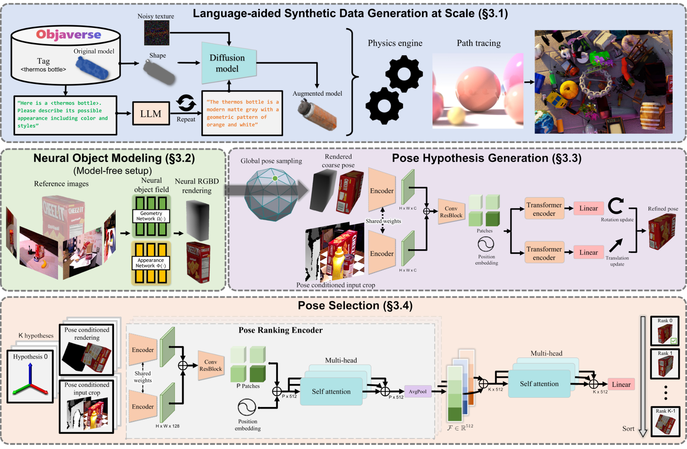
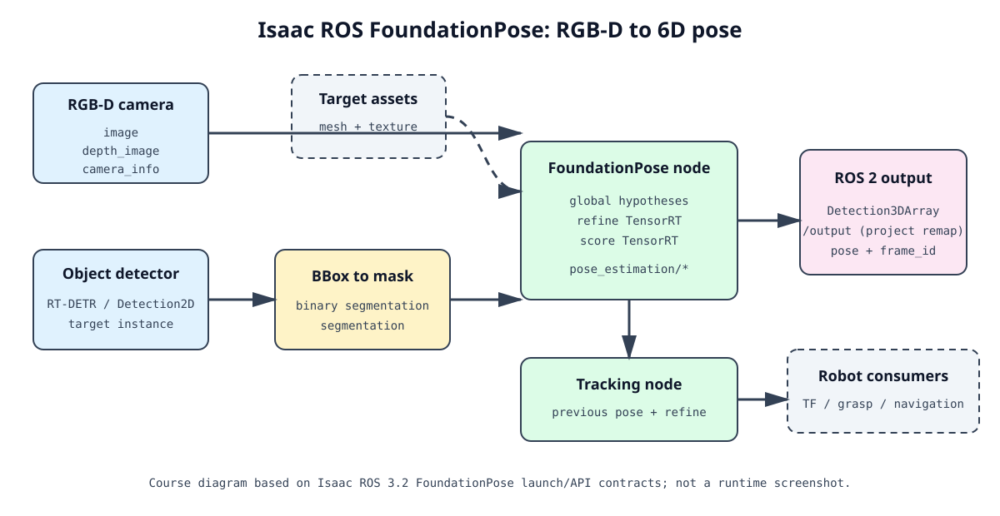
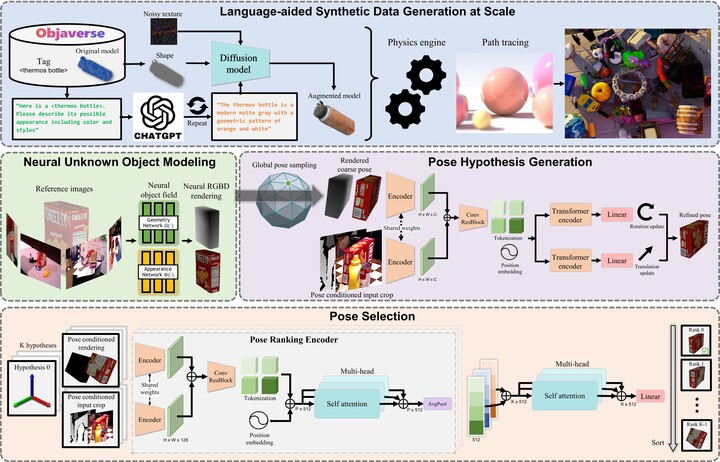
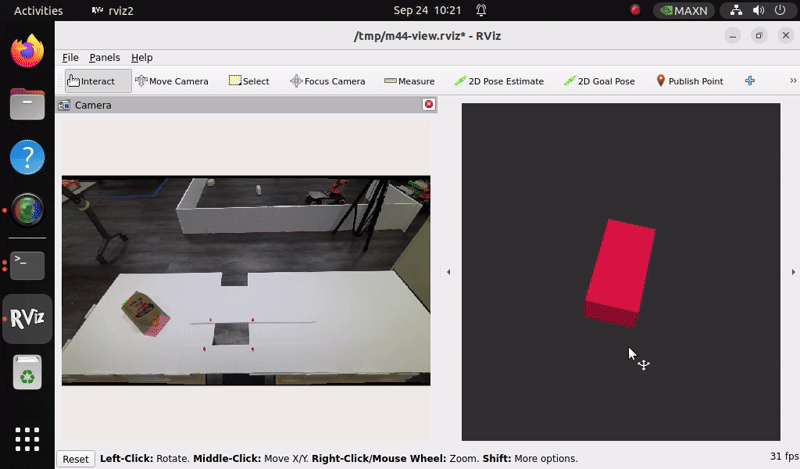

# 4.4 Isaac ROS FoundationPose: From RGB-D to 6D Pose

## Chapter Goals

### Course code entry point

Start in the M4 `code/` directory from your cloned course source. The Isaac ROS container and model assets are configured separately; the course scripts run from this directory:

```bash
export M4_CODE_ROOT="$HOME/mobile-robot-full-stack-course/docs/M04-AI-Vision-And-Edge-Acceleration/code"
export ISAAC_ROS_CONTAINER=m4-isaacros-foundationpose
export ISAAC_ROS_HOST_ASSET_ROOT="$HOME/isaac_ros_assets"
export HOST_MODEL_ROOT="$ISAAC_ROS_HOST_ASSET_ROOT/models/foundationpose"
cd "$M4_CODE_ROOT"
./scripts/setup_workspace.sh
```

2D detection answers “where is the object in the image?” and semantic segmentation answers “which class does each pixel belong to?” Robot grasping, avoidance, and spatial alignment also need the object's 3D position and orientation. This chapter uses FoundationPose in NVIDIA Isaac ROS 3.2 to explain that path:

```text
RGB-D + CameraInfo + target instance mask
    -> pose hypothesis generation
    -> iterative refine network
    -> score network comparison and ranking
    -> vision_msgs/Detection3DArray
```

This chapter separates three kinds of evidence: the general algorithm described by the paper, the engineering interfaces in the official Isaac ROS implementation, and the runtime results already verified on this course Jetson. The current M4.4 status is **PARTIAL**: the official FP32/252 Mustard single-frame graph and the separate FP32/42 adaptation both produced valid poses, but Orbbec Gemini 2 is not connected, so real-camera continuous tracking, frame rate, and accuracy are not accepted.

### After This Chapter

- Explain 6D pose, camera coordinates, quaternions, and TF.
- Distinguish a detection box, a semantic mask, and an instance mask for one object.
- Describe FoundationPose model-based and model-free setups, pose refinement, and candidate scoring.
- Read the Isaac ROS FoundationPose input topics, output message, and TensorRT engine configuration.
- Run the official Mustard rosbag on Jetson and state exactly what `valid_pose` proves.

### Prerequisites and Platform

- Jetson: Seeed reComputer Robotics J501, AGX Orin 32 GB, JetPack 6.2.1 / L4T R36.4.4.
- Software: CUDA 12.6, TensorRT 10.3, ROS 2 Humble, and Isaac ROS 3.2.
- The separate `m4-isaacros-foundationpose` container, NGC Mustard assets, and FoundationPose ONNX models are deployed.
- The quickstart uses recorded data and does not require a camera; real RGB-D integration has a separate acceptance gate.
- Stop M4.1, M4.3, or shared Hub GPU inference before running to avoid unified-memory contention.

## 1. What Does a 6D Pose Add?

### 1.1 From a Detection Box to a Rigid Transform

A rigid body's 6D pose consists of 3D translation and 3D rotation:

```text
t = (x, y, z)       position, normally in metres
R                   orientation of the object frame relative to the camera frame
T_camera_object     the combined 4 x 4 homogeneous transform
```

ROS 2 messages commonly store rotation as quaternion `x, y, z, w`. It has four stored values, but the unit-length constraint leaves three rotational degrees of freedom. When reading a pose, check all of the following:

1. Which coordinate frame does `header.frame_id` name?
2. Are translation values finite, in metres, and is `z` in front of the camera?
3. Is the quaternion norm close to 1?

A camera-frame position cannot be used directly as a robot-base target. When the calibrated camera extrinsic is published through TF, grasping must also compute:

```text
T_base_object = T_base_camera * T_camera_object
```

### 1.2 Do Not Mix Three Kinds of Masks

| Input            | What it answers                                                | Can it directly be the FoundationPose target mask?   |
| ---------------- | -------------------------------------------------------------- | ---------------------------------------------------- |
| 2D detection box | Which image rectangle probably contains the object             | No; it may contain background and other objects      |
| Semantic mask    | Whether each pixel belongs to a class such as road or building | No; it does not separate instances of the same class |
| Instance mask    | Which pixels belong to this one target object                  | Yes; it selects target depth and appearance          |

The road/scene semantic mask from 4.3 cannot replace this chapter's instance mask. The official quickstart first uses object detections and converts the target box into a binary object mask; a production system should use a more reliable instance-segmentation or object-tracking result.

### 1.3 The Roles of RGB, Depth, and CameraInfo

- **RGB** provides color, texture, and appearance cues.
- **Depth** provides the distance from each valid pixel to the camera, helping recover 3D translation and geometry.
- **CameraInfo** provides intrinsics such as `fx, fy, cx, cy`, connecting pixels to camera rays.
- **The instance mask** limits the depth pixels to the target and prevents background or nearby objects from contaminating registration.

Therefore, an RGB detection box alone cannot determine the object's true distance and orientation. Misaligned color/depth images, incorrect depth units, or mismatched intrinsics create systematic pose offsets.

## 2. The FoundationPose Method

### 2.1 Model-Based and Model-Free

The FoundationPose paper presents one unified framework with two possible object priors at test time:

- **Model-based**: provide a textured CAD mesh for the target. The Isaac ROS Mustard example uses this path.
- **Model-free**: when no CAD is available, provide a small set of reference views and build a neural implicit representation for novel-view RGB-D rendering.

Both setups use the same downstream pose-refinement and candidate-scoring modules. The paper's large-scale synthetic data, language-aided texture augmentation, and neural object field explain why the model can generalize to unseen objects; they do not mean that this Jetson has run the training pipeline.



Source: Wen et al., *FoundationPose: Unified 6D Pose Estimation and Tracking of Novel Objects*, arXiv:2312.08344, Figure 2. Full paper: [arXiv HTML](https://arxiv.org/html/2312.08344).

### 2.2 Pose Hypothesis Generation

FoundationPose does not directly regress one unique pose from one image. It first creates multiple possible global poses:

1. Initialize translation from the median depth inside the detection box.
2. Uniformly sample viewing directions on an icosphere centered on the object.
3. Add several in-plane rotations to each viewing direction to form candidate poses.
4. Render comparable RGB-D observations from the mesh under each candidate pose.

More candidates usually provide wider initial orientation coverage, but they also increase the score-engine batch shape, memory use, and first-estimation time. The official graph supports up to 252 candidates; this project also has a 42-candidate adaptation. Each must use its matching engine and configuration.

### 2.3 Refine: Align Each Candidate Iteratively

The refine model observes both:

- the target RGB-D rendered from the current candidate pose;
- a local crop of the real camera image conditioned on that candidate pose.

The network predicts a translation update `Delta t` and a rotation update `Delta R` in the camera frame. The paper disentangles the two: translation is added directly, while rotation is composed in rotation space, avoiding the coupling caused by “rotate first, then translate.” Rendering the updated pose again and feeding it to refine can improve alignment iteratively.

### 2.4 Score: Select One Candidate

Several refined poses may still look similar. The score model first compares each candidate rendering with its real crop, then uses hierarchical self-attention over the whole candidate set, and finally emits a score for each candidate. The highest-scoring candidate becomes the final pose.

This is why one nonempty `Detection3DArray` only shows that the message path produced a result; it does not by itself prove that the pose error is small. Accuracy evaluation needs sequences with ground truth and metrics such as ADD/ADD-S or BOP metrics.

### 2.5 First-Frame Estimation and Tracking

- **Pose estimation** uses global hypotheses, refine, and score to find an object from an unknown initial pose.
- **Tracking** starts from the previous pose and mainly uses refine to update the current pose, rather than enumerating the full global grid every frame.

First-frame estimation is therefore typically a seconds-scale or low-rate operation, while tracking can approach the camera rate. The Isaac ROS 3.2 documentation explicitly notes that tracking is much faster than first detection; the official README also gives a Jetson Orin tracking figure exceeding 120 FPS as an order of magnitude. These are official benchmark contexts, not a measurement of this physical camera.

## 3. Isaac ROS Engineering Implementation

### 3.1 How to Read the Official Graph

The Isaac ROS Pose Estimation repository contains FoundationPose, DOPE, and CenterPose packages. FoundationPose relies on GPU-accelerated DNN inference, TensorRT engines, and composable ROS 2 nodes. Its graph illustrates the engineering pattern: images enter accelerated nodes and inference results continue to downstream processing.



Source: redrawn from the NVIDIA Isaac ROS 3.2 FoundationPose launch/API contract. Official references are the [Isaac ROS FoundationPose documentation](https://nvidia-isaac-ros.github.io/v/release-3.2/repositories_and_packages/isaac_ros_pose_estimation/isaac_ros_foundationpose/index.html) and the [Pose Estimation repository](https://github.com/NVIDIA-ISAAC-ROS/isaac_ros_pose_estimation/tree/release-3.2). It emphasizes the inputs, `refine/score`, tracking, and `/output` remapping; it is not a runtime screenshot.



Source: official NVIDIA Isaac ROS FoundationPose resource image. Its training/modeling sections provide paper and model context; this deployment only uses the published ONNX models, mesh, texture, and TensorRT engines, and does not retrain on Jetson.

The quickstart can be simplified as:

```text
RGB + depth + CameraInfo
        + object detections
        -> bbox-to-mask / instance mask
        -> FoundationPose refine + score
        -> Detection3DArray / pose matrix / TF
```

### 3.2 ROS Topics and Message Contract

The typical FoundationPose node inputs and outputs are:

| Direction | Topic (internal node name)           | Type                                          | Purpose                             |
| --------- | ------------------------------------ | --------------------------------------------- | ----------------------------------- |
| Input     | `pose_estimation/image`              | `sensor_msgs/Image`                           | Rectified color image               |
| Input     | `pose_estimation/depth_image`        | `sensor_msgs/Image`                           | Depth image                         |
| Input     | `pose_estimation/camera_info`        | `sensor_msgs/CameraInfo`                      | Camera intrinsics                   |
| Input     | `pose_estimation/segmentation`       | `sensor_msgs/Image`                           | Target instance mask                |
| Output    | `pose_estimation/output`             | `vision_msgs/Detection3DArray`                | 3D object pose                      |
| Output    | `pose_estimation/pose_matrix_output` | `isaac_ros_tensor_list_interfaces/TensorList` | Pose matrix for next-frame tracking |

This project's launch file remaps those internal ports to `rgb/image_rect_color`, `depth_image`, `rgb/camera_info`, `segmentation`, and `output`. The absolute topic observed during validation is therefore **`/output`**, not the full path shown in the documentation example. The verifier subscribes to `/output` and checks the frame ID, nonempty detection/result, finite translation, positive depth, and unit quaternion.

### 3.3 ComposableNode, TensorRT, and NITROS

- **ComposableNode**: loads multiple ROS 2 nodes into one component container, reducing process boundaries and copy overhead.
- **TensorRT engine**: converts an ONNX model into a Jetson-loadable inference plan; refine and score are separate engines.
- **NITROS**: Isaac ROS types and adapters for efficient GPU/accelerated message transport. It reduces data movement, but it cannot fix a wrong mask, calibration, or engine shape.
- **Container**: isolates Isaac ROS, ROS 2, TensorRT, and driver dependencies; the presence of a container does not prove successful inference.

Keep these layers separate during troubleshooting: validate inputs and frames first, then engine build/deserialization, then interpretable ROS output.

## 4. Jetson Deployment and the Two Engine Profiles

### 4.1 Official Assets and Models

The Isaac ROS 3.2 quickstart downloads NGC Mustard assets, `refine_model.onnx`, and `score_model.onnx`, then generates TensorRT engines. The mesh origin should be at the object center, and color and depth must be aligned.

The official documentation states that FoundationPose engines run at FP32 on TensorRT 10.3 and later because of FP16 accuracy loss; model conversion needs at least about 7.5 GB of free GPU memory. Do not automatically switch FoundationPose to FP16 or INT8 just because other detection or segmentation models use FP16.

### 4.2 Official 252-Candidate Profile

The official score engine uses dynamic shape profile `1/1/252`, meaning minimum/optimal/maximum candidate batch sizes. On this Jetson, an idle container build once failed when a tactic required 2190 MB and only 1405 MB was available; the same FP32/252 profile then built successfully on the host with TensorRT 10.3, and the container deserialized it at maximum shape 252.

Those checks prove that:

- the engine can be built with the target profile;
- the runtime container can load the maximum-candidate engine;
- the ROS graph still needs an independent valid-pose check.

### 4.3 42-Candidate Adaptation

The adaptation uses an independent `score_trt_engine_42_fp32.plan`, `foundationpose_42.yaml`, and `m4_4_foundationpose_42.launch.py`, with `max_hypothesis: 42` and `fixed_axis_angles: ['z_0']`. `max_hypothesis` is only a cap; restricting in-plane angles makes the sampled grid fit 42 candidates.

Forty-two candidates reduce memory and compute, but also narrow initial orientation coverage. Do not connect the 42 engine to the default 252-candidate graph, and do not report its pass as an official 252-configuration pass.

## 5. Run the Mustard Example on Jetson

### 5.1 Official Single-Frame Acceptance

On the Jetson, from `$M4_CODE_ROOT`, run:

```bash
M44_MODE=official ./scripts/m4/run_m4_4_isaacros_quickstart.sh
```

The runner checks the container, models, engines, and Mustard rosbag; if the official 252 engine is missing, it attempts a host-TensorRT build. It then starts the Isaac ROS graph, loops a bag containing one RGB, depth, and CameraInfo frame, and waits for a valid `Detection3DArray` on `/output`.

### 5.2 42-Candidate Adaptation Demo

Run this only when comparing the resource-limited profile:

```bash
M44_MODE=adapted ./scripts/m4/run_m4_4_isaacros_quickstart.sh
```

The engine, configuration, and launch file must be used as one set. This is a separate adaptation demo and does not change the official 252 acceptance result.

### 5.3 RViz Visualization

From a graphical terminal on the Jetson desktop, run:

```bash
M44_MODE=official ./scripts/m4/run_m4_4_isaacros_visual.sh
```

After `valid_pose`, the script keeps the graph and rosbag alive. The RViz Camera panel on the left shows the Mustard RGB image and the central 3D view shows the detection. This view loops a single-frame bag; it is not a live camera.



## 6. Application Cases and Engineering Preconditions

| Case                     | How the pose is used                                                                                | Additional prerequisites                                              |
| ------------------------ | --------------------------------------------------------------------------------------------------- | --------------------------------------------------------------------- |
| Robotic grasping         | Transform `T_camera_object` through TF into the base/end-effector frame and generate a grasp target | Object mesh, instance mask, camera extrinsic, and gripper calibration |
| Mobile robot             | Use object distance and direction relative to the camera for avoidance, approach, or interaction    | Continuous RGB-D, stable tracking, and time synchronization           |
| AR/MR overlay            | Place a virtual model at the real object's 3D pose                                                  | Low latency and consistent camera intrinsics/extrinsics and frames    |
| Inventory and inspection | Compare object position, orientation, or pose changes                                               | Repeatable views, occlusion handling, and quality metrics             |

All of these cases share one boundary: FoundationPose estimates or tracks an object pose; detection, instance masking, camera calibration, TF, and task decisions remain other system modules. The paper also notes that false or missing external detections are a common bottleneck.

## 7. Acceptance Boundaries and Troubleshooting

| Check                               | Current conclusion | Evidence or limitation                                                         |
| ----------------------------------- | ------------------ | ------------------------------------------------------------------------------ |
| Official FP32/252 score engine      | Passed             | Built with host TensorRT 10.3 and deserialized at container maximum shape 252  |
| Official Mustard single-frame graph | Passed             | Nonempty `Detection3DArray` on `/output`; verifier returned `valid_pose`       |
| FP32/42 adaptation graph            | Passed separately  | Independent engine, configuration, launch, and valid pose                      |
| Official AGX Orin benchmark         | About 1.54 FPS     | Official Isaac ROS 3.2 release-3.2 720p benchmark, not a new local measurement |
| Continuous physical-camera tracking | Not accepted       | Orbbec Gemini 2 is not connected; the current bag has one frame                |
| Physical accuracy                   | Not accepted       | No ground-truth physical RGB-D sequence, so ADD/ADD-S is not reported          |

Common problems:

- **No output:** check bag playback, input publishers, mask/CameraInfo synchronization, and the engine/config pair.
- **Out-of-memory build:** distinguish a container builder failure from a successful host profile build; never rename a 42 engine as a 252 engine.
- **Pose offset:** check mesh origin, depth units, RGB-D alignment, CameraInfo, and TF extrinsics.
- **RViz shows only a grid:** use the visualization runner and observe after `valid_pose`; a plain SSH session without a graphical DISPLAY cannot open the window.
- **GPU is busy:** stop the owning M4.1, M4.3, or Hub task instead of bypassing the runner's guard.

### Check Your Understanding

1. Why can neither a detection box nor a semantic mask replace an instance mask?
2. Why can the 42-candidate engine not connect to the default 252-candidate graph?
3. Why does a single-frame `valid_pose` not prove live-camera frame rate?
4. Why must grasping transform a camera-frame pose into the robot base frame?

Answers: (1) They do not reliably identify the pixel set for this one object. (2) The engine maximum dynamic shape does not match the graph's candidate count, and the 42 adaptation also restricts angle coverage. (3) A single-frame bag has no continuous time series or real camera acquisition cost. (4) Robot control needs a target in the base/end-effector frame, not numbers expressed in the camera frame.

### Further Reading and Image Sources

- [FoundationPose paper (arXiv:2312.08344)](https://arxiv.org/html/2312.08344)
- [NVIDIA Isaac ROS 3.2 FoundationPose documentation](https://nvidia-isaac-ros.github.io/v/release-3.2/repositories_and_packages/isaac_ros_pose_estimation/isaac_ros_foundationpose/index.html)
- [NVIDIA-ISAAC-ROS/isaac_ros_pose_estimation release-3.2](https://github.com/NVIDIA-ISAAC-ROS/isaac_ros_pose_estimation/tree/release-3.2)
- [NVlabs/FoundationPose](https://github.com/NVlabs/FoundationPose)
