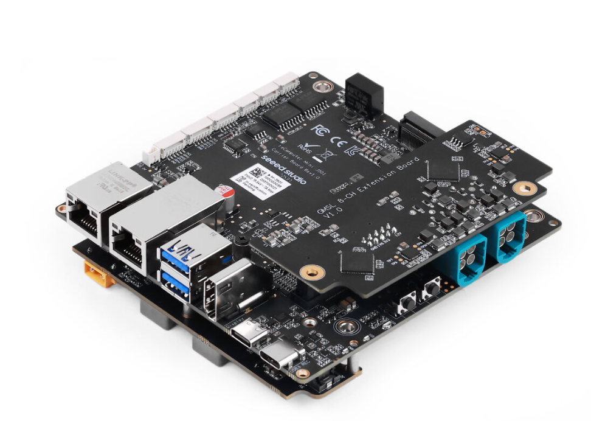

# 4.4 Isaac ROS FoundationPose: 6D Pose and Acceleration

**Status: PARTIAL overall; the FP32 42-candidate Mustard adaptation passed.** Isaac ROS 3.2 FoundationPose produced a valid `vision_msgs/Detection3DArray` pose on `/output` from the official one-frame bag. NVIDIA's 252-candidate FP32 score build still fails for insufficient device memory, so the official configuration has not passed. The physical Orbbec Gemini 2 RGB-D gate is also open. See [`code/PROJECT_STATUS.md`](../code/PROJECT_STATUS.md) for the exact evidence.

### Official Mustard Example Progress

M4.4 uses the NVIDIA Isaac ROS ROS 2 implementation of FoundationPose. It consumes synchronized, aligned RGB, depth, camera intrinsics, and an **object instance mask**, then publishes a 6D pose in the camera frame. The official `launch_fragments:=foundationpose` graph initializes the mask by converting a SyntheticaDETR/RT-DETR detection; this example input is not the semantic mask from M4.3. The native NVlabs/PyTorch route is now chapter [4.5](../4.5_Native_FoundationPose_6D_Pose/README_en_US.md).

The M4.4 entry on Jetson `/home/seeed/workspace/ros2_bev` is `modules/m04-ai-vision-and-edge-acceleration/scripts/m4/run_m4_4_isaacros_quickstart.sh`. It checks the separate Isaac ROS container, official assets, RT-DETR engine, and active M4.1/M4.3 inference processes; loops the one-frame bag; validates a finite pose and unit quaternion; and cleans up its launch and bag processes. `M44_MODE=official` selects NVIDIA's 252-candidate FP32 graph and currently stops at score-engine construction. `M44_MODE=adapted` selects the independent FP32 42-profile engine and project launch with `max_hypothesis: 42` and `fixed_axis_angles=['z_0']`. This reduced orientation grid is a demonstration adaptation, not the official configuration.

```bash
M44_MODE=adapted modules/m04-ai-vision-and-edge-acceleration/scripts/m4/run_m4_4_isaacros_quickstart.sh
```

The accepted example returned position `[-0.4713481963, 0.0929617882, 0.8295211196]` metres and quaternion xyzw `[0.2184645543, -0.3925129918, 0.0745772909, 0.8903061370]` (norm 1.0). The bag contains one RGB, depth, and camera-info message, so it cannot establish FPS or multi-view accuracy. The Orbbec Gemini 2 is not attached, so physical RGB-D, TF, and `/perception/object_pose` project adaptation remain future gates. The multi-model/NITROS/quantization material below remains design guidance without local runtime measurements.

## Course Overview

One model running does not establish multi-module performance. M4.1 and M4.2 are `PASS`, while M4.4 has only a 42-candidate single-frame pose demonstration. A proposed "detection → segmentation → tracking" pipeline would need fresh measurements of copies, memory contention, and per-frame kernel launch overhead. The current Hub switches among three modules; it does not validate concurrent Isaac ROS inference.

The candidate path is to establish a reproducible multi-module baseline, then evaluate NITROS, fixed shapes, INT8, CUDA Graph, and DLA one at a time. Each choice needs independent correctness and performance evidence. A separate Isaac ROS container and adapted FoundationPose demonstration now exist; the official 252-candidate example, multi-model workspace, runnable multi-model launch, and optimization report remain future work.

Based on version: https://nvidia-isaac-ros.github.io/v/release-3.2/getting_started/index.html

ISAAC ROS version 3.2

## Before You Start: What This Lesson Will Walk You Through

| Stage | What you will understand | What you can ultimately do |
| --- | --- | --- |
| Read | Which copy NITROS zero-copy actually eliminates, and why it must run in the same process | Be able to point at a pipeline and say which topics are still taking the D2H / H2D copy path |
| See through | The gain boundaries of one and the same Engine under the four choices of FP16, INT8, CUDA Graph, and DLA | Be able to say why a given optimization does not take effect on this pipeline, instead of copying someone else's parameters |
| Plan | How detection and segmentation might share a candidate pipeline, and how tracking consumes detections | List the components to implement and their real ROS interfaces |
| Define acceptance | What trtexec, nsys, jtop, and a topic probe each answer | Specify measurement conditions and pass criteria for a future report |

The candidate pipeline has four stages: camera input and preprocessing → NITROS transport → multi-model inference → post-processing and publishing. During implementation, measure a baseline first, then change one stage at a time with the same video and warm-up count. Every performance threshold below is a future acceptance target, not a locally measured pass.

## Intended Outcomes After Implementation

- Build an Isaac ROS development container, compile the specified packages, and run one official inference example.

- Export the 4.1–4.4 models uniformly as fixed-shape ONNX and simplify them with onnxsim; build both an FP16 and an INT8 Engine for detection and segmentation, and build an FP32 Engine for the pose model per the official specification.

- Write the launch file and parameter configuration of the unified multi-model pipeline, so that detection, segmentation, and tracking share GPU memory within the same process.

- Use CUDA Events and topic timestamps to measure the p50 / p95 / p99 of end-to-end latency, and distinguish how much preprocessing, inference, and post-processing each account for.

- Complete INT8 calibration, keep the accuracy drop within 3% with mixed precision, and judge whether a given model should be offloaded to DLA.

- Produce an optimization report that others can follow to reproduce: the same video, the same number of warm-up frames, and three runs taking the median.

- State clearly how this page and the "TensorRT / ONNX model optimization and quantization" part of M11 Deployment Optimization and Engineering divide the work: this page tunes the four perception models and the pipeline itself; system-level deployment and production engineering are not on this page.

## Hardware and Software Checklist

|  |  |  |
| --- | --- | --- |
| reCImputer mini J501  + GMSL expansion board |   | GMSL camera / USB camera |

## Prerequisites

- **Current baseline**: M4.1 detection, M4.2 tracking, and M4.3 segmentation are candidates for later integration. M4.4 has an adapted single-frame result, but no accepted physical or multi-model result. Recheck [`code/PROJECT_STATUS.md`](../code/PROJECT_STATUS.md) before implementation.

- **System and containers**: [1.2 JetPack 6.2 System Flashing and Basic Configuration](https://seeedstudio.feishu.cn/docx/UweQdPUKYobmfMxYjZkcy1ZpnNh) covered flashing and TensorRT availability verification; [1.3 Containerized Development Environment and Remote Toolchain](https://seeedstudio.feishu.cn/docx/Yab1dMx93oHkKRxzP59cV9KunDb) already has a Docker environment that supports GPU passthrough; [1.4 Robot Software Middleware: Getting Started with ROS 2 Humble](https://seeedstudio.feishu.cn/docx/QdL7dbITroR6btxqesrcNJE9nib) has ROS 2 nodes, topics, and cross-machine communication running.

- **General fundamentals**: you can edit configuration files on the command line, you can read `colcon` build logs (you can locate the package name and file from an English error), and you can use `jtop` or `tegrastats` to take a look at GPU usage and temperature.

> Get the monitoring tools installed before going further. Almost every conclusion on this page has to be judged from numbers read out of `jtop` or `tegrastats`: without readings, you cannot distinguish "the pipeline really did get faster" from "this run just happened to be in a cooler environment".

## Read First: How Many Trips the Data Actually Makes Through a GPU Pipeline

### Who Isaac ROS Hands the Compute To: GPU, DLA, and PVA

Isaac ROS is NVIDIA's collection of ROS 2 nodes for robotics applications: externally it presents standard ROS 2 topics and services, and internally it places the compute on the Jetson's acceleration engines. To read the optimization options that follow, you first need to sort out what each of these engines is good at.

Besides the GPU, Jetson AGX Orin also carries DLA (Deep Learning Accelerator) and PVA (Programmable Vision Accelerator). DLA is a fixed-function accelerator for inference, good at regular operators such as convolution, ReLU, and pooling; PVA targets the regularized image processing in a vision pipeline; the GPU can run any operator, but its energy efficiency on large-scale convolutions is worse than DLA's. So-called hardware acceleration is not pushing all the compute onto the GPU, but placing operators of different shapes onto the engine that suits them better.

| Engine | What it suits | What it does not suit |
| --- | --- | --- |
| GPU | Any operator, dynamic shapes, custom Plugins; multiple models running in parallel on different CUDA Streams | Small operators have a high launch-overhead share; power and temperature rise fastest under sustained full load |
| DLA | Regular convolutions, ReLU, pooling; backbone networks under INT8 or FP16 | Unsupported layers fall back to the GPU; both sides of a fallback point pay format conversion and synchronization costs |
| PVA | Regularized image processing, such as fixed-pattern pixel-level operations | General tensor computation and training-related operators |

**One-line memory aid:** the GPU answers "any operator can run"; DLA answers "regular convolutions run more power-efficiently"; PVA answers "regularized image processing need not occupy the GPU".

### NITROS: Which Copy Does Zero-Copy Actually Eliminate

In bare ROS 2, an image traveling from one node to the next follows a fixed path: GPU memory → CPU memory (D2H copy) → serialization → inter-process or network transport → deserialization → back to the GPU (H2D copy). Every step of this path costs something, so first work out the order of magnitude.

The single-frame byte count of one 1080p, 3-channel, 8-bit image:

$B_{frame} = 1920 \times 1080 \times 3 \approx 6.2\ \text{MB}$

If every hop makes a round trip, at 30 FPS the copy segment alone produces:

$B_{copy} = 6.2\ \text{MB} \times 30 \times 2 \approx 373\ \text{MB/s}$

373 MB/s is not itself a bottleneck; LPDDR5's bandwidth is far higher than that. What it really eats up is CPU cycles, memory bandwidth occupancy, and one fixed synchronization wait per frame; in a multi-model pipeline, that wait piles directly onto the tail of the end-to-end latency. NITROS (NVIDIA Isaac Transport for ROS) is built on ROS 2's Type Adaptation and Intra-Process Communication, passing GPU memory handles directly between two nodes and using CUDA Events for synchronization, skipping the D2H / H2D copies and serialization.

| Communication path | How the data travels | When this path is taken |
| --- | --- | --- |
| Standard ROS 2 cross-process | D2H copy → serialization → transport → deserialization → H2D copy | The sending and receiving nodes are not in the same process, the message type was not negotiated, or QoS does not match |
| Shared memory (same machine, cross-process) | GPU data first lands in CPU shared memory, and the subscriber still has to copy it back to the GPU | Two NITROS nodes run in different processes or different containers |
| NITROS in-process zero-copy | The GPU memory handle is passed directly, synchronized with CUDA Events, with no D2H / H2D | Both sides are in the same process (the same ComposableNodeContainer) and both support NITROS types |

For zero-copy to hold, three conditions must be satisfied at the same time: both sides are loaded in the same process; both sides support NITROS types (for example `NitrosImage`, `NitrosTensorList`); and the topic uses a type and QoS configuration that supports negotiation. If any one of them is not satisfied, the pipeline silently falls back to one of the two paths above — it still runs, but the latency goes back to what it was before optimization.

Do the verification only when reading the topic, not by looking at package names: pull up the topic's type information and confirm that the negotiated type lands on a NITROS type, not on `sensor_msgs/Image`.

### isaac_ros_dnn_inference: Wrapping Inference into a Single Node

This package (`isaac_ros_dnn_inference` in the 3.x line, with an apt package name of the form `ros-humble-isaac-ros-dnn-inference`) wraps TensorRT inference into a standard ROS 2 node: the input is an image (a NITROS image or `sensor_msgs/Image`), and the output is a tensor list (`isaac_ros_tensor_list_interfaces/TensorList`), where each tensor carries `name`, `shape`, `data_type`, `strides`, and a data pointer. You no longer write TensorRT's context, binding, and memory allocation code; you only fill in the Engine path and the names of the tensors.

| Parameter (3.x-line wording) [applicable version to be verified] (the specific key names change with the distribution, not compared version by version) | What it determines |
| --- | --- |
| Engine file path | Which `.plan` to load; whether the node is allowed to rebuild when the Engine is missing |
| Input tensor name and binding name | Which Engine input the input image is filled into; the name must match the name in the ONNX |
| Output tensor name and binding name | Which outputs are exposed as a TensorList, for the post-processing node to fetch by name |
| Input dimensions and preprocessing tensor name | The scaling target of the preprocessing stage, and which tensor name the preprocessing result is written into; it must match the fixed shape the Engine was built with |
| Preprocessing parameters | Normalization mean and standard deviation, channel order, whether to swap R and B; filling them in wrong makes the model "run but produce all-wrong results" |

This table gives only the Chinese semantics and no specific key names because the key names themselves are version-dependent: when unsure, use `ros2 param list <node name>` to print the parameters the current node actually accepts, then copy those into the YAML — that is more reliable than copying examples from the web.

The node is only responsible for inference, not for post-processing. YOLO's Non-Maximum Suppression (NMS), segmentation's Argmax and color mapping, and pose estimation's decoding all require you to write your own node that subscribes to the TensorList. This is exactly the boundary between this page and "inferencing directly with Ultralytics": inference goes to the standard node, post-processing stays in your hands, and the post-processing logic you already wrote for 4.1–4.4 can be reused — you only need to swap out the part that fetches the data.

When reusing 4.1's post-processing, you only need to convert the TensorList into a dictionary; keep the tensor names consistent with those used when exporting the ONNX in 4.1

```python
import numpy as np

def tensor_list_to_numpy(tensor_list):
    """把 isaac_ros_dnn_inference 的输出转成 {name: ndarray}，其余逻辑照用 4.1 的。"""
    out = {}
    for t in tensor_list:
        arr = np.asarray(t.data)                 # 接口给的是一维数据，按 shape 还原
        out[t.name] = arr.reshape(t.shape)
    return out

tensors = tensor_list_to_numpy(msg.tensors)
pred = tensors["output0"]                        # 形状由导出时的输入分辨率决定
boxes = m4_1_yolo_postprocess(pred)              # 直接复用 4.1 的实现
```

### ONNX Graphs and Input Shapes: When to Fix Them, When to Leave Dynamic Axes

TensorRT's optimizations are all done under the premise of "known shapes": only by knowing the shape can it fuse layers and choose a kernel for each layer. So the input shape is not a casual option at export time — it determines how far the engine can be optimized.

| Choice | What the engine can do | Cost and applicable scenario |
| --- | --- | --- |
| Fix all dimensions | The most aggressive layer fusion and kernel selection; can work together with CUDA Graph | Changing the resolution requires re-exporting and rebuilding; this is this page's default route |
| Leave only batch dynamic | At inference time it is chosen by the actual batch, but every shape must re-select kernels the first time | Suited to offline batch processing; in real-time scenarios the batch is usually 1 and the gain is limited |
| Wide-range dynamic shapes | It can only optimize for the three shapes min / opt / max, with intermediate shapes relying on interpolated configurations | The first inference costs an extra kernel-selection pass, and some layers cannot use INT8 kernels |

After exporting, simplify the graph before building the Engine. onnxsim removes the identity operators and redundant nodes left over after constant folding, so TensorRT gets a cleaner graph and later layer fusion has room to work; if you do not simplify, you will see a string of kernels in the nsys timeline that do no actual computation, pointlessly eating launch overhead.

When an operator that TensorRT does not support appears in a model, there are only two routes: rewrite it as a combination of supported operators, or write a TensorRT Plugin that wires the custom operator's CUDA kernel into the engine. The Plugin threshold is that three things must be written correctly at the same time — the operator prototype (how to describe this layer, how to validate the inputs), serialization and deserialization (how the parameters are stored into the Engine), and output shape inference. Only take the Plugin route when rewriting is impossible; TensorRT 10 introduced `IPluginV3` and deprecated the `IPluginV2` family of interfaces (including the `PluginVersion` and `PluginCreatorVersion` enums), so 8.x-era examples must be migrated to V3 following the official `sample_plugin_v2_to_v3_migration`, and cannot simply be copied. Deprecated does not mean unloadable, but newly written Plugins should land directly on V3.

The standard action after every model change: simplify the ONNX first, then build the Engine, and reuse the timing cache to reduce repeated build time

```bash
onnxsim m4_det_best.onnx m4_det_best_sim.onnx
trtexec --onnx=m4_det_best_sim.onnx --saveEngine=m4_det_fp16.plan --fp16 --memPoolSize=workspace:4096 --timingCache=m4.timing
ls -lh m4_det_best_sim.onnx m4_det_fp16.plan
```

The above uses `--memPoolSize=workspace:4096`, not `--workspace=4096`: parsing of the latter still existed in TensorRT 8.6 but was removed by 10.x, and writing the old form makes trtexec exit directly with an unknown-option error. With no unit, the value is interpreted as MiB, so 4096 means a 4 GiB workspace memory cap. 4.1 uses the same form, keeping the two pages consistent.

### Quantization: FP16 Is the Default Tier, and INT8 Must Prove Its Own Accuracy

FP16 is the lowest-cost tier on Jetson: weights and activations both use half precision, Tensor Cores support it natively, most models' accuracy drop is negligible, and the speedup relative to FP32 is immediately visible. It has costs too: some element-wise operations accumulate error under FP16, and the confidence scores of the detection head's last layer easily jitter. This course's accuracy budget for FP16 is an accuracy drop of no more than 1% relative to FP32.

"Turning on FP16 is always faster and cheaper" holds only for some models. The official FoundationPose documentation page states: due to FP16 precision loss, FoundationPose's TensorRT Engine runs at FP32 precision in TensorRT 10.3 and later versions (official wording: "FoundationPose TensorRT engines are running with FP32 precision in TensorRT 10.3+ versions due to FP16 precision loss"); the 3.2 versioned page records the same sentence, and Isaac ROS 3.2 Update 14 pins isaac_ros_common's tensorrt dependency to 10.3.0, so this conclusion also holds on the 3.x / Humble line. In other words, 4.4's 6D pose model does not take part in FP16 or INT8 quantization on this page and only gets its shape fixed; quantization gains must be confirmed model by model, and you cannot apply one uniform set of parameters to the whole pipeline.

INT8 is completely different: it does not become accurate automatically, and you must use calibration (Post-Training Quantization, PTQ) to gather the dynamic range of each layer's activations from a batch of representative inputs, then set the scale from that. The accuracy loss after quantization is defined as follows:

$\Delta_{mAP} = \frac{mAP_{ref} - mAP_{int8}}{mAP_{ref}} \times 100\%$

This course's budget for INT8 is an accuracy drop of no more than 3%. Once it is exceeded, suspect the calibration set first, then the specific layers. The hard requirement for the calibration set is "the same distribution as the deployment scenario": 100–500 images, covering lighting variation and target scale variation, not a few images casually picked from the training set to make up the numbers, and even less should you feed screenshots of the test video back to yourself.

- **First confirm whether the model can be quantized**: taking 4.4's pose model as an example, the official specification is FP32 (because of FP16 precision loss), so do not force INT8 onto such models; before quantizing, check the accuracy statement the official source gives for that model.

- **Mixed precision**: keep the layers most sensitive to accuracy (the last convolution of the detection head's output, the segmentation logits layer) in FP16 and let the rest go INT8. Releasing layer by layer is more cost-effective than rolling the whole model back, at the cost of needing a per-layer accuracy comparison record.

- **Quantization-Aware Training (QAT)**: use it only when PTQ cannot recover no matter how you tune it, at the cost of retraining and an extra training pipeline; this page goes with PTQ by default, with QAT as the fallback.

- **Fix the shape before quantizing**: dynamic shapes leave some layers without an INT8 kernel, and TensorRT pushes them back to FP16, so the result is "it is quantized but not all layers are quantized" and the speedup is far below expectation.

**One-line memory aid:** FP16's contradiction is "almost free" versus "not fast enough"; the solution is INT8 plus mixed precision, not compressing the whole model to INT8.

### CUDA Graph and DLA Offload: What Holds the Gains Up

CUDA Graph records the hundreds or thousands of kernel launches in one frame of inference into a single graph, then submits once and synchronizes once. Its gain ceiling is exactly the share of kernel launch overhead in the total time of a single frame: when the model is small, the batch is 1, and there are many thin layers, the launch-overhead share is high and the gain is obvious; when large kernels already saturate the compute, the gain is only a few percentage points. There is also a hard limit: once a Graph is captured, the input shape and memory addresses are fixed, so an Engine with dynamic shapes cannot be used with it directly.

DLA's gains are conditional in the same way. DLA supports a limited set of operators, and unsupported layers fall back to executing on the GPU; the fallback itself is not slow — what is slow is the format conversion and extra synchronization on both sides of the fallback point. The fallback ratio can be computed like this:

$r_{fallback} = \frac{n_{fallback}}{n_{total}}$

How to judge: only when the fallback layer share is very low and concentrated at the head and tail of the network is the DLA / GPU division of labor worth doing; if fallback layers are scattered through the middle of the backbone network, the whole execution path becomes very fragmented and end-to-end gets slower instead. Do not look only at the DLA-side kernels getting faster; look at whether the whole-frame time went down.

**One-line memory aid:** CUDA Graph answers "what share is launch overhead", DLA answers "where the fallback points are"; until both questions are measured clearly, offloading is just blind tuning.

### Performance Observation: What Question Each of the Four Tools Answers

When four people on the same machine report four different FPS numbers, it is usually not that someone measured wrong, but that they are not measuring the same segment at all. Sort out which segment each tool measures before talking about numbers.

| Tool | What it can answer | What it cannot answer | Typical usage |
| --- | --- | --- | --- |
| trtexec | The pure inference latency and throughput of a single Engine, including GPU Compute Time and the median | The overhead of preprocessing, post-processing, and topic transport; the behavior when multiple models contend | `--loadEngine=` to load the artifact and measure a pure inference baseline |
| nsys | Who is running on the GPU timeline, where the gaps are, whether it is compute-bound or launch-bound | Cannot see implementation problems in CPU-side post-processing, nor temperature and power | Record one profile of the whole pipeline and find the largest time gap |
| jtop / tegrastats | GPU utilization, memory usage, power, temperature, clock frequency | The latency distribution and single-frame time; also cannot tell which layer is slow | Sample continuously during the test and archive the CSV together with the latency data |
| Topic probe | End-to-end latency and publishing frequency, that is, the segment the user actually perceives | Which segment inside is slow; readings run high when frames are dropped | `ros2 topic hz` for the frequency, a self-written node for percentiles |

The definitions of latency and throughput must be stated clearly first, otherwise the four tools' numbers cannot explain each other. End-to-end latency is computed per "same frame", and throughput over "a period of time":

$L(n) = t_{out}(n) - t_{cap}(n)$

$\text{FPS} = \frac{N}{t_{out}(N) - t_{out}(1)}$

A percentile like p95 is not an average: sort the latencies of N frames and take the $k = \lceil 0.95N \rceil$-th value. In a real-time system what decides whether it stutters is the tail latency, so acceptance looks only at p95 and p99, with the average as reference only.

## Planned Experiment: Integrate Verified Modules into a Candidate NITROS Pipeline

The multi-model commands and configuration below are a future implementation draft. This snapshot has no `m4_isaac_pipeline` package or runnable multi-model launch. Package implementation and interface acceptance must come first; the FoundationPose official example entry above is tracked separately.

The five steps are arranged in dependency order, and each step produces something the next step can consume: environment → Engine → pipeline → optimization → report. Every step's readings must be archived, and the last step's report is the summary of those readings; if you skip a step's readings in the middle, you cannot later attribute the gains to a specific change.

### ENV SETUP

> Choose a different source configuration according to your region. Since we have already configured and installed ROS 2 in the previous chapters, now we only need to copy the one-click configuration command below for the additional installation!

China CDN

```Bash
bash <<'EOF'
set -e

echo "=== Isaac ROS 3.2 China Repository Setup ==="

CODENAME="$(lsb_release -cs)"
ARCH="$(dpkg --print-architecture)"

echo "Ubuntu codename: ${CODENAME}"
echo "Architecture: ${ARCH}"

if [ "${CODENAME}" != "jammy" ]; then
    echo "ERROR: Isaac ROS 3.2 on Jetson expects Ubuntu 22.04 (jammy)."
    exit 1
fi

if [ ! -f /opt/ros/humble/setup.bash ]; then
    echo "WARNING: /opt/ros/humble/setup.bash not found."
    echo "Isaac ROS 3.2 expects ROS 2 Humble."
else
    echo "ROS 2 Humble detected."
fi

sudo apt-get update
sudo apt-get install -y \
    gnupg \
    wget \
    curl \
    ca-certificates \
    lsb-release \
    software-properties-common

sudo add-apt-repository -y universe

# Isaac ROS GPG key - NVIDIA China CDN
wget -qO- https://isaac.download.nvidia.cn/isaac-ros/repos.key \
  | gpg --dearmor \
  | sudo tee /usr/share/keyrings/isaac-ros.gpg >/dev/null

# Isaac ROS 3.x repository
echo "deb [signed-by=/usr/share/keyrings/isaac-ros.gpg] https://isaac.download.nvidia.cn/isaac-ros/release-3 ${CODENAME} release-3.0" \
  | sudo tee /etc/apt/sources.list.d/isaac-ros.list >/dev/null

sudo apt-get update

echo
echo "=== Isaac ROS repository configured ==="
echo
echo "Repository:"
cat /etc/apt/sources.list.d/isaac-ros.list

echo
echo "Available Isaac ROS packages:"
apt-cache search '^ros-humble-isaac-ros-' | head -30 || true

echo
echo "DONE."
EOF
```

US CDN

```Bash
bash <<'EOF'
set -e

echo "=== Isaac ROS 3.2 International Repository Setup ==="

CODENAME="$(lsb_release -cs)"
ARCH="$(dpkg --print-architecture)"

echo "Ubuntu codename: ${CODENAME}"
echo "Architecture: ${ARCH}"

if [ "${CODENAME}" != "jammy" ]; then
    echo "ERROR: Isaac ROS 3.2 on Jetson expects Ubuntu 22.04 (jammy)."
    exit 1
fi

if [ ! -f /opt/ros/humble/setup.bash ]; then
    echo "WARNING: /opt/ros/humble/setup.bash not found."
    echo "Isaac ROS 3.2 expects ROS 2 Humble."
else
    echo "ROS 2 Humble detected."
fi

sudo apt-get update
sudo apt-get install -y \
    gnupg \
    wget \
    curl \
    ca-certificates \
    lsb-release \
    software-properties-common

sudo add-apt-repository -y universe

# Isaac ROS GPG key - NVIDIA International CDN
wget -qO- https://isaac.download.nvidia.com/isaac-ros/repos.key \
  | gpg --dearmor \
  | sudo tee /usr/share/keyrings/isaac-ros.gpg >/dev/null

# Isaac ROS 3.x repository
echo "deb [signed-by=/usr/share/keyrings/isaac-ros.gpg] https://isaac.download.nvidia.com/isaac-ros/release-3 ${CODENAME} release-3.0" \
  | sudo tee /etc/apt/sources.list.d/isaac-ros.list >/dev/null

sudo apt-get update

echo
echo "=== Isaac ROS repository configured ==="
echo
echo "Repository:"
cat /etc/apt/sources.list.d/isaac-ros.list

echo
echo "Available Isaac ROS packages:"
apt-cache search '^ros-humble-isaac-ros-' | head -30 || true

echo
echo "DONE."
EOF
```

### Step 1: Set Up the Isaac ROS Development Container and Run the Official Example

First get a container environment that can compile the relevant packages and access the GPU. Do not touch your own models before the official example runs through, otherwise every later error will first cost you time deciding whether it is an environment problem or a model problem.

Prepare the development container on the host machine; the workspace inside the container is mounted at /workspaces/isaac_ros-dev

```bash
sudo apt-get update
sudo apt-get install -y git git-lfs
git lfs install
mkdir -p /home/seeed/workspace
cd /home/seeed/workspace
git clone -b release-3.2 https://github.com/NVIDIA-ISAAC-ROS/isaac_ros_common.git
cd isaac_ros_common
mkdir /home/seeed/workspace/isaac_ros_ws
./scripts/run_dev.sh -d /home/seeed/workspace/isaac_ros_ws
```

- The workspace path goes through the `-d|--isaac_ros_dev_dir` option; do not write it as a bare positional argument: release-3.2's usage is `run_dev.sh {-d isaac_ros_dev directory path OPTIONAL}`, and only on this branch is `ISAAC_ROS_DEV_DIR` assigned — a bare path is discarded by getopt and it falls back to the default directory. The optional arguments also include `-v/--verbose`, `-i/--image_key`, `-b/--skip_image_build`, and `-a/--docker_arg`.

- After entering the container, first confirm that three things are on the PATH: `which trtexec`, `ros2 pkg list | head`, and `nvcc --version`.

- For the first build, compile only one package and use `colcon build --symlink-install --packages-select <package name>` to bring the compile time into an acceptable range; a full build in one go easily gets stuck on some dependency.

- As soon as the example runs through, immediately record one `ros2 topic hz` reading as the baseline for the "empty pipeline"; this baseline is the starting point for every later comparison.

### Step 2: Export the M4.1–M4.4 Models Uniformly as Fixed-Shape ONNX and Build the Engines

The deliverables are the FP16 / INT8 Engines for detection and segmentation, the pose model's FP32 Engine per the official specification, and a timing cache. The four pages' models are not migrated in the same way: exporting detection and segmentation from Ultralytics is the least trouble; the pose model's ONNX comes from the `1.0.0_onnx` version of the NGC image `nvidia/isaac/foundationpose` (the official wget in the Isaac ROS 3.2 documentation points to `versions/1.0.0_onnx/files/refine_model.onnx`), this page does not assert the 4.x-line version number [applicable version to be verified] (that version number is not evidenced), and officially it runs FP32 because of FP16 precision loss (for the reason see the "Quantization" section), so do not build FP16 / INT8 Engines for it; the tracking node (4.2's ByteTrack / Bot-SORT) is CPU-side code and needs no Engine — it only needs to be installed into the same container as the GPU nodes with the topics agreed on. Before exporting, first confirm each one's input dimensions and preprocessing parameters.

Export and simplify the detection model's ONNX; run the segmentation and pose models through the same script in a batch at their own input dimensions, producing *_sim.onnx

```python
import onnx
import onnxsim
from ultralytics import YOLO

# 固定形状导出：形状与部署时的预处理输出一致；不写 opset 走版本默认
YOLO("m4_det_best.pt").export(format="onnx", imgsz=(1080, 1920), dynamic=False, simplify=False)

model = onnx.load("m4_det_best.onnx")
simplified, ok = onnxsim.simplify(model)
onnx.save(simplified, "m4_det_best_sim.onnx")
print("simplify ok:", ok)
```

Build two Engines for each *_sim.onnx; INT8 needs calibration images to generate a calibration cache first

```bash
trtexec --onnx=m4_det_best_sim.onnx --saveEngine=m4_det_fp16.plan --fp16 --memPoolSize=workspace:4096 --timingCache=m4.timing
trtexec --onnx=m4_det_best_sim.onnx --saveEngine=m4_det_int8.plan --int8 --calib=calib_det.cache --memPoolSize=workspace:4096 --timingCache=m4.timing
trtexec --loadEngine=m4_det_fp16.plan --memPoolSize=workspace:4096
ls -lh m4_det_fp16.plan m4_det_int8.plan
```

- Do not hard-code `opset` when exporting: Ultralytics' default mapping changes with the torch version (torch 2.x maps to 17, consistent with this page's PyTorch 2.6+ specification), and pinning an old version may instead mismatch new operators; if you really need to fix it, write both the opset and the torch version into the report, not just one of them.

- This page runs `onnxsim` (the onnx-simplifier package) manually, which differs from 4.1's route: 4.1 uses Ultralytics' `simplify=True`, and that switch calls `onnxslim` at ≥8.3 and `onnxsim` at 8.1–8.2 — the two are different packages. Both approaches can merge redundant nodes, but this page needs explicit control over when simplification happens (look at the original graph first before deciding), so it runs it separately.

- Segmentation and the pose model follow the same flow, but you must separately confirm the names and count of the output tensors — the post-processing node fetches tensors by name, and a name mismatch reports empty directly.

- The calibration cache is not a file trtexec generates automatically; it takes a calibrator script to read those 100–500 images and then write the cache; the interface is TensorRT's `IInt8EntropyCalibrator2` (on the Python side `trt.IInt8EntropyCalibrator2`, still present in TensorRT 10.x). 4.1's INT8 flow uses the same calibrator script, so the two pages can share it.

- The timing cache is slow only on the first build; after changing the JetPack or TensorRT version, delete and rebuild it, otherwise you may read an incompatible old record.

- Each time an Engine is built, first measure its pure inference latency separately with `trtexec --loadEngine=`; this number is the baseline for all later comparisons.

### Step 3: Build the Unified Multi-Model Pipeline (Detection + Segmentation + Tracking)

The candidate design shares camera decoding in one process and feeds detection results to the tracker. The existing M4 interfaces are identified below; `/m4/*` names are examples for a future adapter. No matching publishers or remapping launch exist yet.

| Topic | Message type | Who publishes / who consumes |
| --- | --- | --- |
| `/m4/image_raw` | `sensor_msgs/Image` (after successful negotiation the transport layer is a NITROS image type) | Camera driver / preprocessing node and latency probe |
| `/m4/detections` | `vision_msgs/Detection2DArray` | Detection post-processing / tracking node and latency probe |
| `/m4/segmentation` | `sensor_msgs/Image` (color mask) | Segmentation post-processing / 4.3's traversable-area analysis |
| `/m4/tracks` (planned name) | `vision_msgs/Detection2DArray`; the current topic is `/perception/tracks`, with the track ID in `Detection2D.id` and no velocity or tracker-state fields | `supervision.ByteTrack` tracker / later consumers |
| `/m4/pose` (unimplemented) | No current message type is defined for this alias; the M4.5 native scaffold defines `/perception/object_pose` as a `geometry_msgs/PoseStamped` output | Design an adapter after the Isaac ROS pose output is observed |

Only after implementing and validating `m4_isaac_pipeline` could one launch the unified pipeline and measure the three frequencies. The following commands are not runnable steps today:

```bash
ros2 launch m4_isaac_pipeline m4_pipeline.launch.py
ros2 topic hz /m4/detections
ros2 topic hz /m4/segmentation
ros2 topic hz /m4/tracks
```

- The three kinds of nodes must be installed into the same ComposableNodeContainer to get in-process zero-copy; splitting them into several `ros2 run` launches gives you only the shared-memory path.

- Detection and segmentation share the same preprocessing output (scaling, normalization, channel order); do not run the image preprocessing node once for each, otherwise both the copies and the compute double.

- The current tracker uses `supervision.ByteTrack` and consumes `Detection2DArray` boxes. A future adapter must preserve track IDs and empty-frame semantics.

- First measure the "unoptimized multi-model pipeline" readings: three topics simultaneously at ≥30 Hz is the target — if you cannot reach it, write down the actual numbers and change things item by item in the next step. This 30 Hz holds only for detection + segmentation + tracking.

- If `/m4/tracks` is introduced later, it must explicitly remap the existing `/perception/tracks` topic and retain `vision_msgs/Detection2DArray`. No such remap exists today.

- 4.4's pose estimation cannot be folded into this 30 Hz loop: in the official benchmark, the pose estimation node on AGX Orin with 720p input is **1.54 fps on the Isaac ROS 3.2 line (about 780 ms per frame)**; the same row in the 4.6 table is 0.502 fps (about 3800 ms/frame), but that stack is JetPack 7.x / ROS 2 Jazzy and cannot be mixed with this page's JetPack 6.2.1 / Humble (the data comes from `isaac_ros_benchmark`'s release-3.2 and release-4.6 branches, on the same AGX Orin). The tracking stage is counted separately: the official README states that when using the refine model for tracking on the Jetson Orin platform the speed is "exceeding 120 FPS", and what is slow is pose **estimation** (the one-time first frame), not tracking (original sentence: exceeding 120 FPS at Jetson Orin, quoted from isaac_ros_pose_estimation release-3.2/README.md L37. 4.x/main corresponds to Jetson Thor and 3.2 to Jetson Orin, so this page uses it only for an order-of-magnitude comparison). So make pose estimation an independent node triggered on demand (the first-frame estimate is on the order of seconds), outside the real-time loop.

- Before folding the pose node into the same container, work out the memory first — the two sets of official pages do not give the same quantity, so do not blur them into one sentence: the **3.2 versioned page** is limited to the model conversion stage and states that at least **7.5 GB** of free GPU memory space is required; the **4.x latest page** speaks of the pipeline peak, about **7 GB**, with a recommended reservation of **≥8 GB**. This page is pinned to 3.x, so reserve 7.5 GB for the conversion stage and reference the 7 GB peak for the run stage. Jetson uses unified memory, so this usage must be budgeted together with camera buffers and other Engines.

- The M4.5 native scaffold defines `geometry_msgs/PoseStamped` with `camera_front` as its TF parent and remains `BLOCKED`. M4.4's adapted Isaac ROS output is `vision_msgs/Detection3DArray` on `/output`; the native scaffold's message type is not that node's output.

- When doing large-model inference inside the container, increase shared memory (start from `--shm-size=8g`), otherwise NITROS's in-process path may fall back to the ordinary path due to an allocation failure — and the fallback is silent: it still runs, and shows up only in the latency numbers.

### Step 4: Apply the Four Layers of Optimization in Order

Keep one comparable set of Engines for each of the four optimization layers, and additionally deliver the system-level configuration. The order cannot be reversed: fix the shape first, then quantize, then apply Graph, and only last consider DLA; re-measure after each step, otherwise you cannot separate the four layers' individual contributions.

One way to build for DLA, plus the system-level settings; CUDA Graph is not built here, it is a per-load option (see below)

```bash
trtexec --onnx=m4_det_best_sim.onnx --saveEngine=m4_det_dla.plan --int8 --useDLACore=0 --allowGPUFallback --memPoolSize=workspace:4096
sudo nvpmodel -m 0
sudo jetson_clocks
```

Measure CUDA Graph's gain: the same engine with and without it, both running the inference loop inside trtexec

```bash
trtexec --loadEngine=m4_det_fp16.plan --memPoolSize=workspace:4096
trtexec --loadEngine=m4_det_fp16.plan --useCudaGraph --memPoolSize=workspace:4096
```

- The quantization scope differs by model: detection and segmentation go through INT8 calibration, while the pose model keeps the official FP32 specification; doing INT8 calibration for it both lacks official support and would blow up the accuracy.

- INT8 calibration: generate a calibration cache from images with the same distribution as deployment, then build the Engine, and measure mAP on the validation set. If the accuracy drop exceeds 3%, release layer by layer along the lines of mixed precision, rather than rolling the whole model back to FP16.

- Try CUDA Graph only on Engines with fixed input shapes, and note that it **is not a build artifact**: `--useCudaGraph` belongs, along with `--duration`, `--warmUp`, and `--avgRuns`, to the performance/inference options, acting on that particular trtexec run's own inference loop, and is not written into the `.plan`. So there is no such file as a "graph version engine", and the difference between the two `.plan` readings will measure close to zero. The correct approach is the two lines above: the same engine with and without it, and the difference is the kernel launch overhead that was eliminated. In production, do the capture inside the inference node (`cudaStreamBeginCapture` / `cudaGraphLaunch`, or PyTorch's `torch.cuda.CUDAGraph`), with fixed shapes and memory addresses as the precondition. When the gain is below 3%, it is not worth adding code complexity for it.

- DLA: first read the list of layers taken over by the GPU in the build log, then decide whether to use it. Comparing only the DLA-side kernel time leads to a wrong conclusion; you must compare the whole-frame time.

- System level: the purpose of MAXN plus clock locking is to make the three test runs' readings comparable; after locking the frequency the temperature rises, and when cooling is insufficient it instead triggers throttling, so this step must be done together with temperature sampling.

- After every change, fall back to step 3's probes and re-measure, and record "change → metric change" as one row; an optimization without a comparison cannot go into the report.

### Step 5: Benchmarking and the Optimization Report

This step produces a reproducible comparison table. The test protocol is fixed as: the same 1080p test video (containing typical robot scenarios), 100–500 warm-up frames, 1000 consecutive measured frames, and 3 repetitions taking the median, with MAXN and clock locking maintained throughout.

End-to-end latency probe: pair the detection output with the capture time of the most recent frame and print p50 / p95 / p99

```python
import numpy as np
import rclpy
from rclpy.node import Node
from sensor_msgs.msg import Image
from vision_msgs.msg import Detection2DArray

class LatencyProbe(Node):
    def __init__(self):
        super().__init__("m4_latency_probe")
        self.stamp = None
        self.lat = []
        self.create_subscription(Image, "/m4/image_raw", self.on_img, 1)
        self.create_subscription(Detection2DArray, "/m4/detections", self.on_det, 1)

    def on_img(self, msg):
        self.stamp = msg.header.stamp.sec + msg.header.stamp.nanosec * 1e-9

    def on_det(self, msg):
        if self.stamp is None:
            return
        now = self.get_clock().now().nanoseconds * 1e-9
        self.lat.append(now - self.stamp)
        if len(self.lat) >= 1000:
            a = np.array(self.lat)
            self.get_logger().info(
                "n=%d p50=%.2fms p95=%.2fms p99=%.2fms" % (
                    len(a), np.percentile(a, 50) * 1e3,
                    np.percentile(a, 95) * 1e3, np.percentile(a, 99) * 1e3))
            self.lat = []

rclpy.init()
rclpy.spin(LatencyProbe())
```

- This probe pairs "the capture time of the most recent frame" with "this detection output"; when the pipeline keeps up, the error is within one frame. If `ros2 topic hz` also shows dropped frames at the same time, the readings run high and cannot be treated as a latency measurement.

- Sample GPU utilization, memory, power, and temperature with `jtop`, keeping the interval consistent throughout; store the sampling results together with the latency data in the report directory — data missing its conditions cannot go into the report.

- Every number in the report carries its conditions: resolution, batch, precision mode, whether preprocessing and post-processing are included, and which tool was used to measure it.

- Finally put the three groups "standalone deployment / unoptimized multi-model / after layer-by-layer optimization" on the same comparison table, and mark each layer's gain and cost row by row.

## Planned Deliverables and Future Acceptance Criteria

The items below are unfinished; the numeric thresholds are design targets, not measured Jetson A results.

### Deliverables Checklist

1. Isaac ROS workspace and build scripts: packages for this chapter's future multi-model pipeline, launch files, and a reusable container startup command.

2. Engines and build scripts: one FP16 and one INT8 each for detection and segmentation; one FP32 Engine for the pose model (official specification, no FP16 / INT8 quantization); the tracking node with its dependencies and configuration; plus the ONNX simplification script and the calibration-cache generation script.

3. Unified multi-model pipeline configuration: `m4_pipeline.launch.py`, each node's parameter files, and the topic and QoS comparison table.

4. Benchmark scripts and report: the latency probe, the jtop sampling CSV, and the three-group comparison table (standalone deployment / unoptimized multi-model / after layer-by-layer optimization).

### Acceptance Criteria

| Check | Pass criterion | When failing, inspect first |
| --- | --- | --- |
| Three models running together | The model set is limited to detection + segmentation + tracking (excluding 6D pose estimation): three topics simultaneously at ≥30 Hz (1080p, batch=1, FP16, including preprocessing and post-processing, measured with `ros2 topic hz` for 30 s) | When one topic is not publishing, first check whether the nodes are in the same container and whether type negotiation succeeded |
| End-to-end latency | p50 ≤33 ms, p95 ≤40 ms, p99 ≤50 ms (1080p, batch=1, FP16, including preprocessing and post-processing, with the latency probe sampling 1000 consecutive frames) | First use nsys to split preprocessing / inference / post-processing into three segments and see which accounts for the largest share |
| Throughput | ≥30 FPS in the steady segment (same conditions as above, `ros2 topic hz` observed continuously for 30 s, excluding the first 100 frames after startup) | Check whether post-processing is serialized on the CPU side and whether detection and segmentation are fighting over the same CUDA Stream |
| GPU utilization | Sampled with `jtop` within 60 s of steady operation, GPU utilization falls in the 60%–85% range with no sustained saturation | When it keeps approaching 100%, lower the resolution or go to INT8; when it stays below 40% for a long time, check whether the pipeline is waiting serially |
| Memory usage | When detection + segmentation + tracking run in parallel, the memory peak read by `jtop` does not exceed 70% of the system's total memory; if the pose node is loaded as well, budget it by the two official figures respectively: at least 7.5 GB free during model conversion (3.2 versioned page), and a pipeline peak of about 7 GB with a recommended reservation of ≥8 GB (4.x latest page) | When approaching the ceiling, first lower the batch and input resolution, then change non-parallel models to on-demand loading |
| Power and temperature | Under MAXN the 30 s average power does not exceed that tier's ceiling (the MAXN tier ceiling for AGX Orin is 60 W, from NVIDIA's official specifications, not this site's pages); the temperature reading fluctuates by less than 5 °C within 20 minutes and shows no frequency drop | First check the cooling fan and heatsink installation, then check whether the `nvpmodel` tier has been changed |
| Evidence that zero-copy is in effect | The topic's negotiated type is a NITROS type; the nodes are in the same container; a before/after latency comparison with NITROS disabled is attached | When negotiation fails, check the container partitioning, QoS, and node loading method rather than changing the model |
| Reproducibility before and after optimization | The same video, the same number of warm-up frames, three runs taking the median, with the p50 difference between runs below 10%; the report lists all conditions | When the difference is too large, first confirm whether `jetson_clocks` is locked and whether other processes are occupying the GPU |

## FAQ and Troubleshooting

### Missing Dependencies or CUDA Architecture Errors When Compiling the Relevant Packages

- **Cause**: the ROS 2 distribution in the container does not match the package version that was pulled, or the `CUDA_ARCHITECTURES` environment variable is empty at build time, so the compiler does not know which architecture to generate code for.

- **Solution**: first confirm that the container has ROS 2 Humble, then re-source `/opt/ros/humble/setup.bash` and build; for the architecture issue, specify it explicitly according to your module (use `87` for AGX Orin), and check whether the image version and the host's JetPack are the same generation.

- **Solution**: if the build failure message points at some uninstalled dependency package, install only that one and retry; do not install ten packages at once — a scrambled dependency order buries the real missing item.

### The Topic Is Still sensor_msgs/Image and Zero-Copy Is Not in Effect

- **Cause**: the nodes are not in the same process (started separately with `ros2 run`), one end does not support NITROS types, or a QoS mismatch causes negotiation to fail.

- **Solution**: write the sending and receiving nodes into the launch file of the same ComposableNodeContainer and use `ros2 node list` plus the process PID to confirm that they really are in the same process; then pull the topic information once more to confirm that the negotiated type is a NITROS type.

- **Solution**: if it is only for comparison, temporarily split the pipeline into two processes and compare the latency difference; a very small difference means the bottleneck was never in the copies, and you should go look at post-processing or the inference kernels.

### End-to-End Got Slower After Adding DLA

- **Cause**: unsupported layers fall back to the GPU, and format conversion plus extra synchronization appear on both sides of the fallback point; when layers are cut up too finely, the scheduling overhead exceeds the time DLA saves.

- **Solution**: read the build log to confirm the fallback layers' share and position; when the fallback layers are scattered through the middle of the backbone network, give up DLA outright; keep it only when the fallbacks are concentrated at the head and tail.

- **Solution**: compare using the two metrics of whole-frame latency and power, not the DLA-side kernel time; if the whole frame did not get faster while power dropped, that is a trade-off question and must be written clearly in the report.

### The Accuracy Drop After INT8 Calibration Far Exceeds Expectation

- **Cause**: the calibration set is not from the same distribution as the deployment scenario (too few images, a single scene, or training-set images used directly), the input shape is not fixed so some layers fall back to FP16, and a few sensitive layers have large dynamic-range differences.

- **Solution**: recalibrate with 100–500 real photos taken in the deployment scenario, covering different lighting and target scales; confirm that the Engine was built from a fixed-shape ONNX.

- **Solution**: if it still exceeds the budget, use a per-layer accuracy comparison to fix the most sensitive few layers to FP16, making it mixed precision; only consider QAT retraining last.

### Out of Memory or Nodes OOM-Killed When Running Multiple Models in Parallel

- **Cause**: three Engines are loaded at the same time and each requests its own workspace memory; the container's shared memory is too small; a high input resolution amplifies the intermediate tensors.

- **Solution**: tally the actual usage of the three Engines plus the CUDA context and budget against the 70% ceiling; raise shared memory to `--shm-size=8g` or more.

- **Solution**: if it is still not enough, first lower the input resolution or batch, then change non-essential models to on-demand loading (for example, pose estimation started only when needed), rather than splitting the three models into three independent pipelines.

> **Next step:** hand this pipeline and comparison table to two places for use: [M6 Decision Layer: Localization, Navigation, and Path Planning](https://seeedstudio.feishu.cn/docx/LTEkdYEgEo6xqwx0IfYcsfrSnYf) and [M8 Execution Layer: Gimbal and Active Vision](https://seeedstudio.feishu.cn/docx/FjJCdzbHFolniOxenGocRGMOnNP) consume `/m4/tracks`'s stable IDs and latency metrics to judge whether tracking results can be fed directly to navigation and the gimbal; for system-level deployment and engineering (production pipelines, quantization strategy selection, monitoring, and upgrades) see [M11 Deployment Optimization and Engineering](https://seeedstudio.feishu.cn/docx/CIKodf7WXoNz1ExFP79cjcIpnQh); this page is only responsible for the acceleration landing of the four perception models on this board and the before/after comparison protocol. The conclusion has clear boundaries: all performance numbers hold under J501, MAXN, 32GB, JetPack 6.2.1, TensorRT 10.x, and the test protocol above; after changing the platform, changing the resolution, or moving to dynamic shapes they must be re-measured; for numbers and interfaces quoted across Isaac ROS major versions, this page marks the source version — the official documentation site renders the latest 4.x / Jazzy line, and copying its numbers will not match this page's 3.x + Humble environment.
