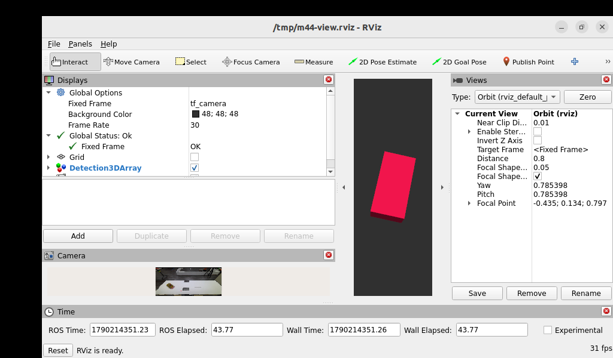
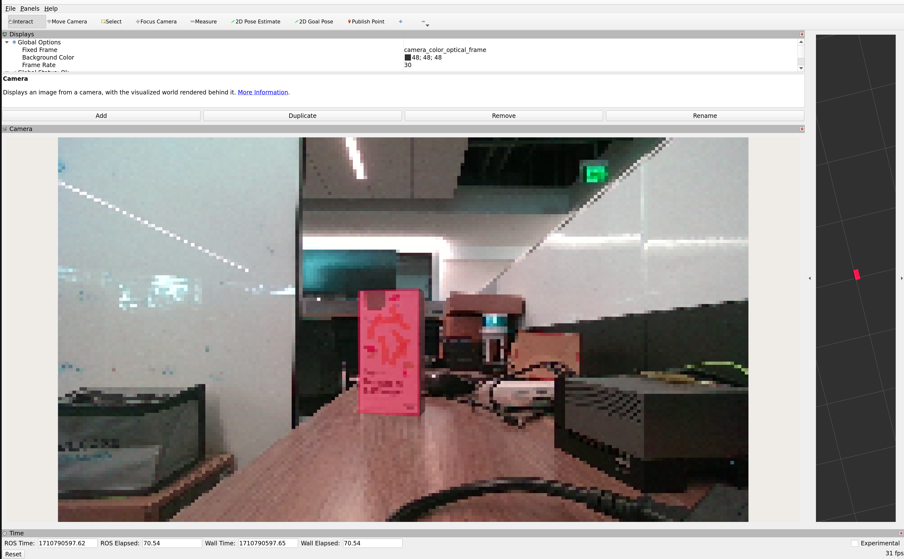

# 4.4 Isaac ROS FoundationPose：从 RGB-D 到 6D 位姿

## 本章目标

2D 检测回答“物体在图像哪里”，语义分割回答“像素属于哪一类”；机器人抓取、避障和空间对齐还需要知道物体在三维空间中的位置和朝向。本章用 NVIDIA Isaac ROS 3.2 的 FoundationPose 说明这条链路：

```text
RGB-D + CameraInfo + 目标实例掩膜
    -> 姿态假设生成
    -> refine 网络迭代细化
    -> score 网络比较和排序
    -> vision_msgs/Detection3DArray
```

### 学完后能

- 解释 6D 位姿、相机坐标系、四元数和 TF 的关系。
- 区分检测框、语义掩膜和单个物体的实例掩膜。
- 说明 FoundationPose 的 model-based、model-free、姿态细化和候选评分阶段。
- 读懂 Isaac ROS FoundationPose 的输入话题、输出消息和 TensorRT engine 配置。
- 在 Jetson 上运行官方 Mustard rosbag，并正确解释 `valid_pose` 的证据边界。

### 前置条件与平台

- Jetson：Seeed reComputer Robotics J501，AGX Orin 32 GB，JetPack 6.2.1 / L4T R36.4.4。
- 软件：CUDA 12.6、TensorRT 10.3、ROS 2 Humble、Isaac ROS 3.2。
- 已部署独立的 `m4-isaacros-foundationpose` 容器、NGC Mustard 资产和 FoundationPose ONNX 模型。
- 本章的 quickstart 使用录制数据，不要求连接相机；真实 RGB-D 集成另设验收门槛。
- 运行前退出 M4.1、M4.3 或共享 Hub 的 GPU 推理任务，避免争用统一内存。

## 一、6D 位姿到底多回答了什么

### 1.1 从检测框到刚体变换

刚体的 6D 位姿由三维平移和三维旋转组成：

```text
t = (x, y, z)       位置，通常用米
R                   方向，表示物体坐标系相对相机坐标系的旋转
T_camera_object     把二者组合成 4 x 4 齐次变换
```

ROS 2 消息常用四元数 `x, y, z, w` 存储旋转。它有四个存储值，但单位长度约束使其仍只表示三个旋转自由度。读取一条位姿时，至少要同时检查：

1. `header.frame_id` 指向哪个坐标系；
2. 平移是否为有限值、单位是否为米、`z` 是否在相机前方；
3. 四元数长度是否接近 1。

相机系中的位置不能直接当成机器人基座系目标点。若相机外参已经通过标定发布到 TF，抓取前还要计算：

```text
T_base_object = T_base_camera * T_camera_object
```

### 1.2 三类“掩膜”不要混用

| 输入     | 它回答什么          | 能否直接作为 FoundationPose 目标掩膜 |
| ------ | -------------- | -------------------------- |
| 2D 检测框 | 物体大致位于图像的哪个矩形  | 不能；框中可能包含背景和其他物体           |
| 语义掩膜   | 每个像素属于道路、建筑等类别 | 不能；它不区分同一类别的不同实例           |
| 实例掩膜   | 哪些像素属于这一个目标物体  | 可以；它用于截取目标深度和外观            |

4.3 的道路/场景语义掩膜不能直接替代本章的实例掩膜。官方 quickstart 先使用目标检测结果，再把目标框转换成二值目标掩膜；生产系统则应使用更可靠的实例分割或目标跟踪结果。

### 1.3 RGB、深度和 CameraInfo 的分工

- **RGB** 提供颜色、纹理和外观线索。
- **Depth** 提供像素到相机的距离，帮助恢复三维平移和几何关系。
- **CameraInfo** 提供 `fx, fy, cx, cy` 等内参，把像素坐标转换为相机射线。
- **实例掩膜** 限定哪些深度像素属于目标，避免背景和邻近物体污染配准。

因此，只有 RGB 检测框不能唯一确定物体的真实距离和朝向；深度未对齐、深度单位错误或内参不匹配，也会让姿态产生系统性偏移。

## 二、FoundationPose 的方法主线

### 2.1 model-based 与 model-free

FoundationPose 论文提出一个统一框架，测试时可以使用两种物体先验：

- **model-based**：提供目标物体的带纹理 CAD 网格。Isaac ROS Mustard 示例属于这一路径。
- **model-free**：没有 CAD 时，先提供少量不同视角的参考图，再为该物体建立神经隐式表示，用于新视角 RGB-D 渲染。

两种设置在后续的姿态细化和候选评分阶段使用同一套下游模块。论文中的大规模合成数据、语言辅助纹理增强和神经物体场用于解释模型为什么能泛化到未见物体。


图源：Wen 等，*FoundationPose: Unified 6D Pose Estimation and Tracking of Novel Objects*，arXiv:2312.08344，Figure 2。论文全文：[arXiv HTML](https://arxiv.org/html/2312.08344)。

### 2.2 姿态假设生成

FoundationPose 不把一张图直接回归成唯一姿态，而是先生成多个可能的全局姿态：

1. 在检测框内用深度中值初始化物体平移。
2. 在以物体为中心的 icosphere 上均匀采样多个观察方向。
3. 为每个观察方向叠加若干面内旋转，得到候选姿态集合。
4. 用目标网格和当前候选姿态渲染出可比较的 RGB-D 结果。

候选数越多，初始方向覆盖通常越充分，但 score engine 的 batch 形状、显存和首帧耗时也会增加。官方图使用最大 252 个候选；本项目另有最大 42 候选的适配图，二者必须使用各自对应的 engine 和配置。

### 2.3 refine：把候选姿态逐步对齐

refine 模型同时观察：

- 当前候选姿态渲染出来的目标 RGB-D；
- 真实相机图像中由候选姿态决定的局部 crop。

网络输出相机坐标系中的平移更新 `Delta t` 和旋转更新 `Delta R`。论文把两者解耦：平移直接相加，旋转在旋转空间中组合，从而避免“先旋转再平移”造成的耦合。将更新后的姿态再次渲染并送入 refine，可以迭代改善对齐结果。

### 2.4 score：从多个候选中选出一个

refine 之后仍可能有多个外观相似的姿态。score 模型先分别比较每个候选的渲染图和真实 crop，再通过层次化的 self-attention 同时观察整组候选，最后输出每个候选的分数。分数最高的候选作为最终位姿。

这也是为什么“有一条非空 `Detection3DArray`”只能说明消息链路产出了结果，不能单独证明姿态误差足够小。要评估精度，还需要带真值的序列和 ADD/ADD-S 或 BOP 指标。

### 2.5 首帧估计与后续 tracking

- **Pose estimation**：需要全局候选、refine 和 score，负责从未知初始姿态找到物体。
- **Tracking**：已有上一帧姿态后，主要用 refine 更新当前姿态，不必每帧重新枚举全部全局假设。

因此首帧估计通常是秒级或低帧率工作，tracking 才可能接近相机帧率。Isaac ROS 3.2 文档明确提示 tracking 会明显快于第一次检测；官方 README 还给出 Jetson Orin 上 tracking 超过 120 FPS 的量级说明。这些是官方基准语境，不是本机物理相机测量值。

## 三、Isaac ROS 工程实现

### 3.1 官方节点图怎样读

Isaac ROS Pose Estimation 仓库包含 FoundationPose、DOPE 和 CenterPose 等包。FoundationPose 依赖 GPU 加速的 DNN 推理、TensorRT engine 和 ROS 2 组件化节点。官方仓库节点图可以帮助理解“图像进入 GPU 节点、推理结果继续流向后处理”的工程模式。


图源：本课程根据 NVIDIA Isaac ROS 3.2 FoundationPose 的 launch/API 契约重绘；官方参考为 [Isaac ROS FoundationPose 文档](https://nvidia-isaac-ros.github.io/v/release-3.2/repositories_and_packages/isaac_ros_pose_estimation/isaac_ros_foundationpose/index.html) 和 [Pose Estimation 仓库](https://github.com/NVIDIA-ISAAC-ROS/isaac_ros_pose_estimation/tree/release-3.2)。它强调本项目的输入、`refine/score`、tracking 和 `/output` remap，不是运行时截图。


图源：NVIDIA Isaac ROS 官方 FoundationPose 资源图。图中训练/建模部分是论文和官方模型背景；本机部署只使用已经发布的 ONNX、mesh、texture 和 TensorRT engine，不在 Jetson 上重新训练。

FoundationPose quickstart 的逻辑可以简化为：

```text
RGB + 深度 + CameraInfo
        + 目标检测结果
        -> bbox-to-mask / 实例掩膜
        -> FoundationPose refine + score
        -> Detection3DArray / pose matrix / TF
```

### 3.2 ROS 话题和消息契约

官方 FoundationPose 节点的典型输入输出如下：

| 方向  | 话题（节点内部名称）                           | 类型                                            | 作用                    |
| --- | ------------------------------------ | --------------------------------------------- | --------------------- |
| 输入  | `pose_estimation/image`              | `sensor_msgs/Image`                           | 已校正彩色图                |
| 输入  | `pose_estimation/depth_image`        | `sensor_msgs/Image`                           | 深度图                   |
| 输入  | `pose_estimation/camera_info`        | `sensor_msgs/CameraInfo`                      | 相机内参                  |
| 输入  | `pose_estimation/segmentation`       | `sensor_msgs/Image`                           | 目标实例掩膜                |
| 输出  | `pose_estimation/output`             | `vision_msgs/Detection3DArray`                | 目标 3D 位姿              |
| 输出  | `pose_estimation/pose_matrix_output` | `isaac_ros_tensor_list_interfaces/TensorList` | 供下一帧 tracking 使用的位姿矩阵 |

本项目的 launch 文件将这些内部端口 remap 为 `rgb/image_rect_color`、`depth_image`、`rgb/camera_info`、`segmentation` 和 `output`。因此实机验证时观察到的绝对话题是 **`/output`**，而不是文档示例中的完整命名空间路径。验证器订阅 `/output`，检查坐标帧、非空 detection/result、有限平移、正深度和单位四元数。

### 3.3 ComposableNode、TensorRT 和 NITROS

- **ComposableNode**：把多个 ROS 2 节点装入同一个 component container，减少进程间拷贝和启动开销。
- **TensorRT engine**：把 ONNX 模型转换成 Jetson 上可加载的推理计划；refine 和 score 是两份不同的 engine。
- **NITROS**：Isaac ROS 用于高效传递 GPU/加速消息的类型和适配层。它减少数据搬运，但不会替算法解决错误的掩膜、标定或模型形状。
- **容器**：隔离 Isaac ROS、ROS 2、TensorRT 和驱动依赖；容器存在不代表模型已经成功推理。

这几个层次要分开排障：先确认输入和坐标，再确认 engine 能构建/反序列化，最后确认 ROS 图发布了可解释的位姿。

## 四、Jetson 部署和两种 engine 配置

### 4.1 官方资源和模型

Isaac ROS 3.2 官方 quickstart 下载 NGC Mustard 资产、`refine_model.onnx` 和 `score_model.onnx`，然后用 TensorRT 生成 engine。目标网格的原点应位于物体中心，彩色和深度必须对齐。

官方文档指出，在 TensorRT 10.3 及以后，FoundationPose engine 因 FP16 精度损失而按 FP32 运行；模型转换阶段至少需要约 7.5 GB 空闲 GPU 内存。不要因为其他检测/分割模型使用 FP16，就把 FoundationPose 自动改成 FP16 或 INT8。

### 4.2 官方 252 候选配置

官方 score engine 使用动态形状 profile `1/1/252`，含义是 batch 的最小/优化/最大候选数。课程 Jetson 上曾出现容器内构建 tactic 需要 2190 MB、可用只有 1405 MB 的失败；随后在同一台主机用 TensorRT 10.3 构建相同 FP32/252 profile 成功，并在容器内完成最大 shape 252 的反序列化检查。

这两个步骤证明的是：

- engine 可以用目标 profile 构建；
- 运行容器可以加载最大候选数的 engine；
- 仍需独立检查 ROS 图是否发布有效姿态。

### 4.3 42 候选适配配置

适配模式使用独立的 `score_trt_engine_42_fp32.plan`、`foundationpose_42.yaml` 和 `m4_4_foundationpose_42.launch.py`，并设置 `max_hypothesis: 42` 与 `fixed_axis_angles: ['z_0']`。`max_hypothesis` 只是上限；限制面内角度才让采样网格真正适配 42 个候选。

42 候选减少显存和计算量，但也缩窄了初始朝向覆盖。不能把 42 engine 接到默认 252 候选图，也不能把 42 的通过结果写成“官方 252 配置通过”。

## 五、在 Jetson 上运行 Mustard 示例

### 5.1 官方单帧验收

在 Jetson 的 `/home/seeed/workspace/ros2_bev` 执行：

```bash
M44_MODE=official ./modules/m04-ai-vision-and-edge-acceleration/scripts/m4/run_m4_4_isaacros_quickstart.sh
```

运行器会检查容器、模型、engine 和 Mustard rosbag；若官方 252 engine 不存在，会尝试用主机 TensorRT 构建。随后启动 Isaac ROS 图，循环播放只包含一帧 RGB、深度和 CameraInfo 的 bag，并等待 `/output` 上的有效 `Detection3DArray`。

### 5.2 42 候选适配演示

只有在需要比较资源受限配置时运行：

```bash
M44_MODE=adapted ./modules/m04-ai-vision-and-edge-acceleration/scripts/m4/run_m4_4_isaacros_quickstart.sh
```

该模式的 engine、配置和 launch 必须成套使用。它是单独的适配演示，不改变官方 252 配置的验收结论。

### 5.3 RViz 可视化

在 Jetson 图形桌面的终端运行：

```bash
M44_MODE=official ./modules/m04-ai-vision-and-edge-acceleration/scripts/m4/run_m4_4_isaacros_visual.sh
```

脚本在 `valid_pose` 后继续保持图和 rosbag，RViz 左侧 Camera 面板显示 Mustard RGB 图像，中心 3D 视图显示检测框。此画面来自单帧 bag 循环，不是实时相机。



图源：本课程 Jetson 实机记录 `20260924-014511-25838-official`。该截图只说明可视化链路和消息格式，不提供真实相机帧率或误差。



图源：NVIDIA Isaac ROS 3.2 FoundationPose 文档的 RealSense 示例。它用于说明官方图形化结果形态；本课程实际验收仍以 Mustard 单帧 bag 和本地日志为准。

### 5.4 一条实测结果怎样读

官方运行 `20260923-112313-14976-official` 的记录为：

| 字段              | 实测值                                                          | 解释                  |
| --------------- | ------------------------------------------------------------ | ------------------- |
| `frame_id`      | `tf_camera`                                                  | 位姿相对于该相机帧           |
| position，米      | `[-0.4350625575, 0.1339290440, 0.7972502112]`                | `z` 约 0.797 m，在相机前方 |
| quaternion，xyzw | `[0.7753970849, -0.3331845536, 0.3022323303, -0.4431738174]` | ROS 存储顺序            |
| quaternion norm | `1.0`                                                        | 通过单位四元数检查           |

这组数字证明该次录制输入通过官方图产生了格式有效的位姿；它不包含真值误差，也不能证明连续 tracking FPS。

## 六、应用案例和工程前提

| 案例       | 位姿怎样被使用                                     | 额外前提                      |
| -------- | ------------------------------------------- | ------------------------- |
| 机械臂抓取    | 把 `T_camera_object` 通过 TF 转到基座/末端坐标系，生成抓取目标 | 物体网格、实例掩膜、相机外参和夹爪标定       |
| 移动机器人    | 用物体相对相机的距离和方向做避障、靠近或交互决策                    | 连续 RGB-D、稳定 tracking、时间同步 |
| AR/MR 叠加 | 将虚拟模型放到真实物体的 3D 姿态上                         | 低延迟、相机内外参和坐标系一致           |
| 盘点和检视    | 比较物体的位置、朝向或是否发生位姿变化                         | 可重复视角、遮挡处理和质量指标           |

这些案例共享一个事实：FoundationPose 只负责物体位姿估计/跟踪，目标检测、实例掩膜、相机标定、TF 和任务决策仍是系统的其他模块。论文也指出，错误或缺失的外部检测会成为常见瓶颈。

## 七、验收边界和排障

| 检查项                      | 当前结论       | 证据或限制                                               |
| ------------------------ | ---------- | --------------------------------------------------- |
| 官方 FP32/252 score engine | 通过         | 主机 TensorRT 10.3 构建，容器最大 shape 252 反序列化             |
| 官方 Mustard 单帧图           | 通过         | `/output` 有非空 `Detection3DArray`，验证器返回 `valid_pose` |
| FP32/42 适配图              | 单独通过       | 独立 engine、配置、launch 和有效位姿                           |
| 官方 AGX Orin benchmark    | 约 1.54 FPS | Isaac ROS 3.2 release-3.2 官方 720p benchmark，不是本机新测值 |
| 真实相机连续 tracking          | 未验收        | Orbbec Gemini 2 未接入，当前 bag 只有一帧                     |
| 真实精度                     | 未验收        | 没有带真值的物理 RGB-D 序列，不能报告 ADD/ADD-S                    |

常见问题：

- **没有输出：**先检查 bag 是否播放、输入话题是否有发布者、掩膜和 CameraInfo 是否同步，再检查 engine/config 是否匹配。
- **构建内存不足：**区分容器内 builder 失败和主机 profile 构建成功；不要把 42 engine 改名为 252 engine。
- **位姿偏移：**核对 mesh 原点、深度单位、RGB-D 对齐、CameraInfo 和 TF 外参。
- **RViz 只有网格：**使用可视化脚本并在 `valid_pose` 后观察；纯 SSH 没有图形 DISPLAY 时不会出现窗口。
- **GPU 被占用：**停止 M4.1、M4.3 或 Hub 的拥有者任务，不要绕过运行器的保护。

### 想一想

1. 为什么检测框和语义掩膜都不能直接替代实例掩膜？
2. 为什么 42 候选 engine 不能接到默认 252 候选图？
3. 为什么单帧 `valid_pose` 不能证明实时相机帧率？
4. 抓取时为什么还要把相机系位姿通过 TF 转到机器人基座系？

参考答案：① 它们没有稳定地标出这一个物体的像素集合。② engine 的最大动态 shape 和图实际候选数不匹配，42 适配还限制了角度覆盖。③ 单帧 bag 没有连续时间序列和真实相机采集开销。④ 机械臂控制需要基座/末端坐标系中的目标，而不是相机坐标系中的数字。

### 延伸阅读和图源

- [FoundationPose 论文（arXiv:2312.08344）](https://arxiv.org/html/2312.08344)
- [NVIDIA Isaac ROS 3.2 FoundationPose 文档](https://nvidia-isaac-ros.github.io/v/release-3.2/repositories_and_packages/isaac_ros_pose_estimation/isaac_ros_foundationpose/index.html)
- [NVIDIA-ISAAC-ROS/isaac_ros_pose_estimation release-3.2](https://github.com/NVIDIA-ISAAC-ROS/isaac_ros_pose_estimation/tree/release-3.2)
- [NVlabs/FoundationPose](https://github.com/NVlabs/FoundationPose)
- 下一章是原生 NVlabs 路线；其运行证据与本章 Isaac ROS 证据分开记录。
