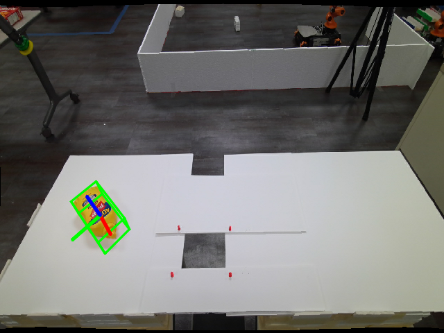

# 4.5 Native NVlabs FoundationPose: From RGB-D to 6D Pose

## Chapter Goals

This chapter uses NVlabs/PyTorch FoundationPose directly to convert RGB-D images, camera intrinsics, an instance mask, and the CAD mesh of a known object into its 6D pose in the camera frame. The course retains the `bev_pose` ROS 2 wrapper and also provides an easier-to-reproduce standalone MVP so that you can understand the algorithm before connecting ROS topics.

After completing this chapter, you should be able to:

- Explain 6D pose using translation, rotation, homogeneous matrices, and quaternions.
- Describe the roles of RGB, depth, CameraInfo, an instance mask, and a CAD mesh.
- Distinguish FoundationPose's first-frame `register` initialization from subsequent `track_one` tracking.
- Prepare the NVlabs checkout, weights, CUDA extensions, and Mustard example data on a Jetson.
- Run the minimum MVP and read its `report.json` and first/last-frame pose images.
- Understand how `bev_pose` publishes model results as `PoseStamped`, `Detection3DArray`, and TF.

## 1. 6D Pose Fundamentals

A rigid body's 6D pose consists of a three-dimensional translation and a three-dimensional rotation:

```text
t = (x, y, z)
R = 3×3 rotation matrix
T_cam_obj = [[R, t], [0, 0, 0, 1]]
```

A point `p_obj` in the object frame is located in the camera frame after the pose transformation:

```text
p_cam = R · p_obj + t
```

ROS 2 commonly represents poses with `geometry_msgs/Pose`, where rotation is stored as a quaternion in `x,y,z,w` order. A quaternion should be finite and normalized; `q` and `-q` represent the same rotation. The pose message's `header.frame_id` matters just as much: a position in the camera frame must be transformed through TF and calibrated camera extrinsics before it can be used for robot-base or manipulator planning.

### Bounding Boxes, Semantic Masks, and Instance Masks

| Input | What it represents | Role in FoundationPose |
| --- | --- | --- |
| Bounding box | The target's rectangular image region | Provides a search region or initialization hint |
| Semantic mask | The class of every pixel | Describes categories such as road, wall, or table |
| Instance mask | Pixels belonging to one specific object | Extracts target depth and becomes the `ob_mask` for `register` |

The road semantic mask from Chapter 4.3 cannot directly serve as an instance mask for a router or bottle. A target instance mask should cover only one object and must share the same resolution and alignment as RGB and depth.

### Roles of RGB, Depth, and CameraInfo

- RGB supplies texture and appearance for comparing the observed image with the rendered model.
- Depth supplies per-pixel distance, allowing a 2D region to be reconstructed as 3D points.
- `CameraInfo.K` supplies focal lengths and the principal point, defining how pixels back-project into the camera frame.
- The CAD mesh supplies object geometry, surface normals, physical scale, and a renderable model.

Without depth, it is difficult to determine scale and distance from one 2D region. Without intrinsics, depth pixels cannot be transformed correctly into the camera frame. Without an instance mask, background and neighboring objects interfere with registration.

## 2. The FoundationPose Algorithm

FoundationPose combines an object model and the current observation in a hybrid geometric and learned pipeline. The paper discusses both model-based and model-free inputs: model-based operation uses a known CAD/mesh, while model-free operation can construct an object representation from reference images. The course MVP follows the model-based route and uses the prepared `textured_simple.obj` mesh.


*Figure: FoundationPose's unified estimation and tracking pipeline. Source: [FoundationPose paper, arXiv 2312.08344](https://arxiv.org/abs/2312.08344), Figure 2. The first frame starts from global pose candidates; later frames start from the previous pose.*

### First-Frame `register`

`register` receives:

```text
RGB + aligned depth + camera K + object instance mask + mesh
```

The core steps are:

1. Estimate the target's approximate 3D center from the instance mask and depth.
2. Generate pose hypotheses over viewpoints sampled on an icosphere and in-plane rotations.
3. Use the refine network to compare rendered models with the real RGB-D observation and iteratively update translation and rotation.
4. Use the score network to rank candidate poses and select the current-frame result.

A bounding box is therefore only a 2D hint; the final output is a `T_cam_obj` containing metric distance, scale, and orientation.

### Subsequent `track_one`

Tracking no longer starts from the full global pose grid. It uses the previous frame's pose as a warm start and concentrates on local updates. First-frame registration usually evaluates more candidates with more refine iterations, while subsequent tracking requires less computation. The course script records `register_ms` and `track_ms` separately so that the two stages are not mixed into one frame-rate figure.

The official interfaces can be checked in [NVlabs `estimater.py`](https://github.com/NVlabs/FoundationPose/blob/main/estimater.py) and the [official `run_demo.py`](https://github.com/NVlabs/FoundationPose/blob/main/run_demo.py):

```python
pose = est.register(K=K, rgb=rgb, depth=depth, ob_mask=mask, iteration=5)
pose = est.track_one(rgb=rgb, depth=depth, K=K, iteration=2)
```

### Common Sources of Error

- Symmetric objects can produce similar appearances at multiple rotations.
- Occlusion or masks containing background make candidate ranking less reliable.
- Misaligned RGB/depth, incorrect depth units, or mismatched CameraInfo create systematic 3D offsets.
- If CAD mesh units or orientation disagree with the real object, the pose direction may look plausible while distance and scale remain globally wrong.

## 3. Jetson MVP Environment

The course target is a Seeed reComputer Robotics J501 with a Jetson AGX Orin 32 GB, JetPack 6.2.1 / L4T R36.4.4, CUDA 12.6, and Python 3.10. The NVlabs checkout is pinned to the course-verified commit:

```text
a1b694b83e633c2cb6115b9063d940a687759392
```

The MVP uses the following layout:

```text
/home/seeed/workspace/third_party/FoundationPose/
├── demo_data/mustard0/
├── weights/2023-10-28-18-33-37/model_best.pth
├── weights/2024-01-11-20-02-45/model_best.pth
└── mycpp/build/mycpp*.so
```

The refiner and scorer load their respective `config.yml` and `model_best.pth` files. `mycpp` clusters pose candidates, `nvdiffrast` performs GPU rasterization, and PyTorch runs the networks and tensor computations.

## 4. Run the Minimum MVP

Course scripts are in `code/scripts/m4/`. Run the following from the M4 module root on the Jetson:

```bash
cd /home/seeed/workspace/ros2_bev/modules/m04-ai-vision-and-edge-acceleration

# Compatibility entry point; forwards to the MVP runner
bash scripts/m4/phase0_foundationpose_verify.sh --frames 8

# Recommended entry point
bash scripts/m4/run_m4_5_native_mvp.sh --frames 8
```

The script uses the official NVlabs recorded Mustard sequence by default. It executes one `register`, followed by several `track_one` calls. The output directory is:

```text
output/m4/m45_native_mvp/
├── report.json
├── pose_0000.txt
├── pose_0001.txt
├── ...
├── frame_0000_pose.png
├── frame_0007_pose.png
└── debug/
```

The important `report.json` fields are:

| Field | Meaning |
| --- | --- |
| `register_ms` | First-frame global pose initialization time |
| `track_ms` | Per-frame tracking latency values |
| `track_fps` | Reference rate computed only from average tracking latency |
| `first_pose` / `last_pose` | First- and last-frame 4×4 camera-to-object transforms |

The MVP fixes the algorithm lifecycle and its evidence in one reproducible path: first inspect how registration selects a candidate, then see how tracking carries the previous result forward.

### Jetson Mustard Run Results

On the J501 / AGX Orin 32 GB with JetPack 6.2.1 and CUDA 12.6, the official `mustard0` RGB-D sequence was run for 8 frames with these results:

| Item | Measured result |
| --- | --- |
| First-frame `register` | 11050.90 ms |
| Subsequent `track_one` | 89.37–237.11 ms/frame, about 120.43 ms/frame on average |
| Tracking reference conversion | 8.30 FPS, representing only the average latency of this tracking stage |
| Outputs | 8 finite 4×4 pose matrices, `report.json`, and annotated first/last-frame images |


*Figure: Registration result on the first frame of the official Mustard sequence. Source: NVlabs FoundationPose `demo_data/mustard0`, generated by the course script on the Jetson.*



*Figure: Tracking result on frame 8 of the same sequence. Read first-frame registration and subsequent tracking latency separately; 8.30 FPS must not be interpreted as a complete real-time RGB-D camera frame rate.*

The script exports `PYTHONNOUSERSITE=1` by default so that a user-site NumPy cannot override the conda environment. On JetPack 6.2.1, CUDA 12.6 and the current PyTorch wheel differ in the available 3×3 inverse symbols, so the runner uses a local analytic inverse compatibility path for the camera/crop 3×3 matrices used by FoundationPose; the upstream FoundationPose checkout is unchanged.

## 5. CAD Mesh and Scale

The course's real target model comes from a GL.iNet GL-SFT1200 Opal CAD model. The source STEP uses millimeters. The preprocessing script scales the mesh to meters and records its source and dimensions in `object.yaml`. The runtime does not require a CAD kernel; it loads an already triangulated OBJ or `.npz` file.

```bash
python3 scripts/m4/step_to_foundationpose_mesh.py models/m4/pose
bash scripts/m4/preprocess_mesh.sh
```

Check at least the following properties:

1. Vertex and normal arrays have shape `(N,3)`.
2. Face indices stay within the vertex array.
3. Bounding-box dimensions match the physical object's order of magnitude.
4. Mesh antennas, ports, and enclosure axes match the real object's coordinate frame.

## 6. The `bev_pose` ROS 2 Wrapper

The standalone MVP answers whether native FoundationPose can consume RGB-D and return a pose. The ROS 2 wrapper addresses how to place it in a mobile-robot perception graph. Its main node relationship is:

```text
RGB ───────────────┐
aligned depth ─────┼─> foundationpose_node ─> PoseStamped
CameraInfo ────────┤                         ├─> Detection3DArray
object instance mask┘                         └─> camera_front → object TF
```

### Topic Contract

| Direction | Topic | Type |
| --- | --- | --- |
| Input | `/perception/cameras/front/image` | `sensor_msgs/Image` |
| Input | `/perception/cameras/front/depth` | `sensor_msgs/Image`, metric depth |
| Input | `/perception/cameras/front/camera_info` | `sensor_msgs/CameraInfo` |
| Input | `/perception/object_mask` | `sensor_msgs/Image`, single-object binary mask |
| Output | `/perception/object_pose` | `geometry_msgs/PoseStamped` |
| Output | `/perception/object_poses_3d` | `vision_msgs/Detection3DArray` |
| Output | `/tf` | `camera_front → object` |

`foundationpose_engine.py` separates the lifecycle into `load_object_model`, `register`, and `track`. `foundationpose_node.py` handles message synchronization, image conversion, intrinsic extraction, and pose publication. This lets the algorithm, input validation, and ROS communication be tested separately instead of placing every concern in one callback.

## 7. Applications

| Scenario | Required inputs | Role of the pose |
| --- | --- | --- |
| Robotic grasping | RGB-D, target instance mask, CAD mesh, hand-eye calibration | Transform `T_cam_obj` into `T_base_obj` and generate a grasp pose |
| Mobile robots | Aligned depth, CameraInfo, target mesh | Determine target distance, orientation, and spatial relationship to the base |
| AR/MR overlay | RGB, camera intrinsics, target mesh | Overlay axes or a virtual model on the real object |
| Inventory and inspection | Target instance mask, reference mesh, continuous tracking | Detect presence, pose changes, and viewpoint coverage |

All four applications rely on the same chain: correct RGB-D, a reliable instance mask, a correctly scaled model, and coordinate calibration. A camera-frame pose cannot bypass TF and be used directly by the robot base.

## 8. Questions and Further Reading

1. Why does the first frame need icosphere pose hypotheses while later tracking can use the previous result?
2. What happens to the translation vector if depth in meters is mistakenly interpreted as millimeters?
3. Why can a semantic segmentation map not directly replace a single-object instance mask?
4. In `T_base_obj = T_base_cam · T_cam_obj`, which transform comes from calibration and which comes from FoundationPose?

References:

- [FoundationPose paper, arXiv 2312.08344](https://arxiv.org/abs/2312.08344)
- [NVlabs FoundationPose](https://github.com/NVlabs/FoundationPose)
- [Isaac ROS FoundationPose](https://github.com/NVIDIA-ISAAC-ROS/isaac_ros_pose_estimation)
- [Official FoundationPose `run_demo.py`](https://github.com/NVlabs/FoundationPose/blob/main/run_demo.py)
