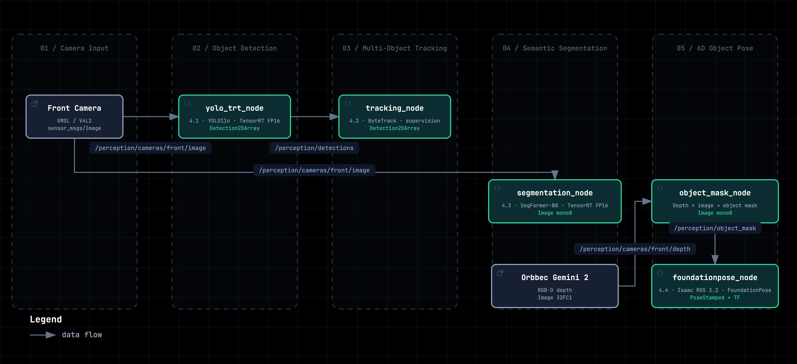

# M04 AI Vision and Edge Acceleration

## 课程代码入口

以下命令适用于课程仓库的克隆目录。把 `M4_CODE_ROOT` 改成你本机的实际路径，后续各章命令都从该目录运行：

```bash
export M4_CODE_ROOT="$HOME/mobile-robot-full-stack-course/docs/M04-AI-Vision-And-Edge-Acceleration/code"
cd "$M4_CODE_ROOT"
./scripts/setup_workspace.sh
source /opt/ros/humble/setup.bash
cd ros2_ws
colcon build --symlink-install --packages-select \
  bev_interfaces bev_detection bev_tracking bev_segmentation bev_pose m4_demo_bringup
source install/setup.bash
cd "$M4_CODE_ROOT"
```

M4 turns camera images into perception results a robot can act on. It follows M2, which
covers camera capture, calibration and BEV stitching. Here the same images pass through
detection, tracking, semantic segmentation and 6D object pose, with TensorRT and Isaac ROS
carrying the acceleration work on the J501. Each chapter takes one stage of that chain, from
the model export down to the ROS 2 topic the next stage consumes.



*Figure: the four processing stages of the module and the topics between them. Chapter numbers
in the figure follow the tutorial sequence, where 4.4 is 6D pose; in this repository 4.4 is the
Isaac ROS FoundationPose route and the native NVlabs route is 4.5.*

## What You Will Learn

- Read a YOLO detection output: what the `[1, 84, 8400]` tensor holds, and which question confidence, IoU and mAP each answer.
- Explain the three-stage export from PyTorch to ONNX to a TensorRT engine, and why an engine is tied to the GPU architecture and the TensorRT version.
- Run the `bev_detection` pipeline on the J501 and check message type, QoS and timestamps on `/perception/detections`.
- Turn per-frame detection boxes into tracks with stable IDs using ByteTrack, and know which parameter to change for a given symptom.
- Read the two segmentation outputs and say what each one does and does not tell you about where the robot can drive.
- Describe how FoundationPose turns an RGB-D frame plus an object mask into a 6D pose, and how a camera-frame pose reaches the robot through TF.

## Chapters

1. [4.1 YOLO Object Detection: From a Pretrained Model to TensorRT](./4.1_YOLO_Object_Detection_and_TensorRT_Deployment/README_en_US.md) · [中文](./4.1_YOLO_Object_Detection_and_TensorRT_Deployment/README_zh_CN.md)
2. [4.2 Multi-Object Tracking](./4.2_Multi-Object_Tracking/README_en_US.md) · [中文](./4.2_Multi-Object_Tracking/README_zh_CN.md)
3. [4.3 Semantic Segmentation: From Pixel Classes to Ground Candidates](./4.3_Semantic_Segmentation_and_Drivable_Area_Analysis/README_en_US.md) · [中文](./4.3_Semantic_Segmentation_and_Drivable_Area_Analysis/README_zh_CN.md)
4. [4.4 Isaac ROS FoundationPose: From RGB-D to 6D Pose](./4.4_Isaac_ROS_FoundationPose_and_Acceleration/README_en_US.md) · [中文](./4.4_Isaac_ROS_FoundationPose_and_Acceleration/README_zh_CN.md)
5. [4.5 Native NVlabs FoundationPose: From RGB-D to 6D Pose](./4.5_Native_FoundationPose_6D_Pose/README_en_US.md) · [中文](./4.5_Native_FoundationPose_6D_Pose/README_zh_CN.md)

## Prerequisites

- [M2 Vision System Foundations](../M02-Fundamentals-of-Vision-Systems/README.md): camera capture, calibration and BEV stitching.
- A flashed J501 running JetPack 6.2.1 and ROS 2 Humble.
- Basic ROS 2 command-line use: `ros2 topic list`, `ros2 topic echo`, `ros2 topic info -v`. No chapter asks you to write a ROS 2 node from scratch.
- For the pose chapters, basic linear algebra: reading a matrix product and a "state plus covariance" description is enough.

## Hardware and Software

- NVIDIA Jetson AGX Orin 32GB (Seeed reComputer J501)
- GMSL 1×4 camera board with the front camera exposed as a V4L2 node (`/dev/video0`), captured at 1920×1080@30
- Recorded RGB-D sequence for the pose MVP; an RGB-D camera is optional for live extensions

| Component     | Version         |
| ------------- | --------------- |
| JetPack / L4T | 6.2.1 / R36.4.4 |
| Ubuntu        | 22.04           |
| ROS 2         | Humble          |
| CUDA          | 12.6            |
| TensorRT      | 10.3.x          |
| Isaac ROS     | 3.2             |
| Python        | 3.10            |

## Code

- [M04 code — chapters 4.1 to 4.5 source and Isaac ROS quickstart](./code/README.md)
