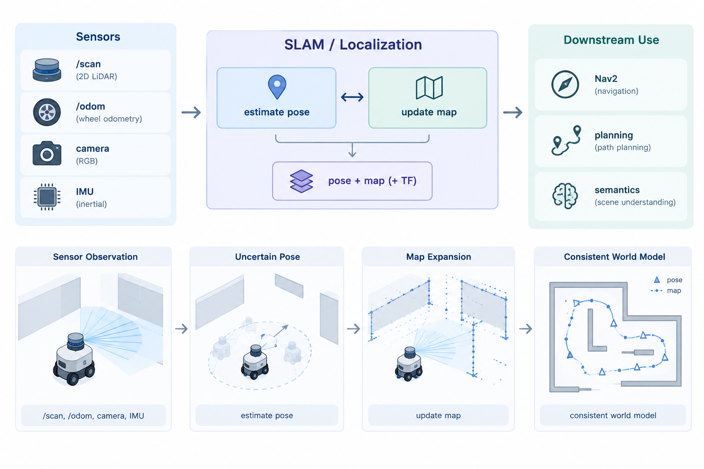

# 5.1 认识 SLAM，构建你的第一张栅格地图

SLAM（Simultaneous Localization and Mapping）是移动机器人导航与环境感知中的基础技术。它需要在机器人运动过程中，同时估计**机器人自身的位姿**和**周围环境的地图**。机器人只有知道“自己在哪里”，并建立一张可以持续使用的“环境地图”，才能进一步完成路径规划、避障、重定位以及自主导航。

本课首先介绍 SLAM 要解决的问题，以及工程实践中常见的几种 SLAM 技术路线；随后以 `reComputer Robotics J501` 为平台，使用 `RPLIDAR A1` 和 **SLAM Toolbox** 完成第一套二维激光 SLAM 流程。这一实践将作为后续 M5 激光 SLAM 内容的基础：先从结构简单、容易验证的二维激光地图开始，再进一步进入三维激光与激光惯性里程计。


## 学习目标

完成本课后，你应该能够：

- 用工程语言说明 SLAM 的基本任务，以及为什么需要同时估计位姿和地图；

- 区分二维激光、三维激光、视觉和多传感器融合等主要 SLAM 路线；

- 理解 `map`、`odom`、`base_link`、`laser` 等坐标系在 SLAM 系统中的作用；

- 在 J501 上使用 RPLIDAR A1 和 SLAM Toolbox 完成二维激光建图；

- 保存可复用的二维占用栅格地图；

- 加载已有地图，并进行基于地图的定位。

## 前置条件

开始本课前，请确保：

- **M1**：J501 已完成刷机，Ubuntu 22.04 与 ROS 2 Humble 工作正常；

- **M3.1**：RPLIDAR A1 已完成接入，可以正常发布 `/scan`，并在 RViz2 中看到稳定的扫描数据；

- **M3.2 / M3.4**：机器人已经具备轮式里程计，并且 `odom -> base_link` 只有一个发布者；

- 已了解 ROS 2 基本话题和 TF 使用方式；

- 理解 `map`、`odom`、`base_link`、`laser` 四个坐标系的基本关系。

---

# Part A. SLAM 任务

## 5.1.1 什么是 SLAM

单个传感器通常只能提供局部信息。

例如：

- 激光雷达告诉机器人当前周围有哪些障碍物；

- 相机告诉机器人当前视野中看到了什么；

- 轮式里程计估计机器人从上一时刻移动了多少；

- IMU 提供短时间内的角速度和加速度变化。

这些信息本身都不足以直接回答两个关键问题：

1. **机器人现在位于环境中的什么位置？**

2. **环境中已经观测到的结构应该如何组织成一张可复用的地图？**

SLAM 就是在运动过程中联合解决这两个问题。

如果地图已经完全准确，那么机器人只需要根据地图进行定位；如果机器人位姿始终完全准确，那么建图也会变得简单。但实际机器人中的传感器都会存在噪声，里程计会产生累计误差，环境观测也可能存在歧义，因此机器人需要在不断运动和观测的过程中，同时修正自身位姿和地图。

从工程角度看，SLAM 系统最终需要提供以下几类输出：

| 输出                 | 作用                                       |
| -------------------- | ------------------------------------------ |
| 机器人位姿           | 持续跟踪机器人在环境中的位置和姿态         |
| 环境地图             | 保存机器人已经观测到的空间结构             |
| 坐标系关系           | 让导航、规划、感知模块使用统一空间坐标     |
| 估计状态与一致性信息 | 判断当前定位是否可靠，以及是否存在明显漂移 |

对于本课程，可以先把整个 SLAM 系统理解成：

```text
Sensors
  │
  ├── /scan
  ├── /odom
  ├── camera
  └── IMU
       │
       ▼
   SLAM / Localization
       │
       ├── Robot Pose
       ├── Map
       └── TF
             │
             ▼
      Nav2 / Planning / Perception
```

也就是说，SLAM 并不是一个孤立的“建地图程序”，而是机器人空间状态估计链路中的一个核心环节。



---

## 5.1.2 SLAM 的核心过程

SLAM 的核心问题可以简单理解为：

> 机器人一边运动，一边利用传感器观察环境，同时估计自己的位置，并把这些观测组织成一张一致的地图。

在机器人刚开始运动时，机器人只知道自己的初始位置以及附近的一小部分环境。随着运动不断进行，它会获得越来越多的观测。

如果机器人只依赖里程计，那么位姿误差会不断累积，因此 SLAM 还需要利用环境中的几何结构进行约束。例如机器人经过一个房间后再次回到同一个房间，激光雷达会重新看到相似的墙壁、门框或柱子。系统可以判断：

> “我现在看到的地方，很可能就是之前来过的位置。”

这就是**回环（Loop Closure）**。

通过回环约束，可以重新调整之前积累的位姿误差，使整条轨迹和地图重新保持一致。

因此，一个典型 SLAM 系统通常包含以下几个核心过程：

1. **运动预测（Predict）**  
   根据轮式里程计、IMU 或视觉里程计预测机器人下一时刻的位置。

2. **环境观测（Observe）**  
   使用激光雷达、相机等传感器获取当前环境信息。

3. **数据关联（Associate）**  
   判断当前观测与已有地图、历史观测之间的对应关系。

4. **位姿更新（Update）**  
   根据传感器观测修正机器人当前位姿。

5. **地图更新（Map Update）**  
   将新的环境观测加入地图。

6. **回环校正（Loop Closure）**  
   当机器人重新访问已知区域时，对历史轨迹进行全局校正。

7. **结果发布（Publish）**  
   输出地图、机器人位姿以及其他模块需要的 TF 和话题。

---

## 5.1.3 SLAM 系统的基本组成

不同 SLAM 算法的实现方式不同，但从工程结构来看，大多数系统都可以拆成几个基本部分。

| 模块        | 主要作用                         | 常见实现                                           |
| ----------- | -------------------------------- | -------------------------------------------------- |
| Front-end   | 将传感器数据转换为运动或几何约束 | 扫描匹配、特征跟踪、点云匹配、视觉里程计           |
| Back-end    | 根据约束优化机器人状态           | 滤波器、位姿图、因子图、非线性优化                 |
| Map         | 保存环境空间信息                 | 占用栅格、点云、网格、TSDF/ESDF                    |
| TF / Output | 向其他机器人模块提供空间关系     | `map -> odom`、`odom -> base_link`、轨迹、地图文件 |

其中，前端和后端可以先简单理解为：

**前端负责“看到了什么、发生了什么运动”；后端负责“根据这些约束，怎样把整个轨迹调整得更一致”。**

对于二维激光 SLAM：

```text
LaserScan
    │
    ▼
Scan Matching
    │
    ▼
Local Pose Estimate
    │
    ▼
Pose Graph / Optimization
    │
    ▼
Occupancy Grid Map
```

这种结构也解释了为什么 SLAM 并不只是“把激光点画到地图上”。真正困难的部分是如何确定**当前观测应该放在哪里**，以及如何在长期运行中保持整个地图的一致性。

---

## 5.1.4 主要 SLAM 路线

实际使用哪种 SLAM 技术，主要取决于机器人使用的传感器、环境结构以及最终需要的地图形式。

本课程后续会重点涉及二维激光和三维激光，因此先建立以下四类技术路线的基本认识。

### 1）二维激光 SLAM

**输入：** 二维激光扫描，通常结合轮式里程计。  
**典型地图：** 二维占用栅格。  
**主要用途：** 室内移动机器人导航。

二维激光 SLAM 是室内轮式机器人的典型入门方案。它直接生成导航系统常用的二维占用栅格，因此非常适合作为 Nav2 的基础地图。

在墙壁、走廊和房间等结构比较明显的环境中，二维激光能够提供稳定的几何约束，同时计算量相对较低，便于在 J501 这类边缘计算平台上运行。

它的限制也比较明确：激光只观察一个水平截面，因此无法完整描述悬空物体、斜坡以及不同高度上的空间结构。对于结构高度变化明显的环境，需要进一步使用三维传感器。

本课使用的 **RPLIDAR A1 + SLAM Toolbox** 就属于这一技术路线。

---

### 2）三维激光 SLAM

**输入：** 三维点云，通常结合 IMU。  
**典型地图：** 三维点云、体素地图或进一步生成的二维投影地图。  
**主要用途：** 大空间、复杂结构和三维环境建模。

当环境不能用单一二维平面充分描述时，就需要使用三维激光。

三维激光能够观察墙面、立柱、家具、斜坡以及其他非平面结构。结合 IMU 后，还可以利用高频惯性信息估计短时间运动，并对激光扫描过程中的运动畸变进行补偿。

因此，第 5.2 课会在本课二维激光基线的基础上，进一步使用 **Livox MID-360 + Fast-LIO 风格的激光惯性里程计**。

三维 SLAM 的能力更强，但系统复杂度也明显增加。时间同步、IMU 噪声、雷达与 IMU 外参、运动去畸变等都会直接影响最终结果。

---

### 3）视觉 SLAM

**输入：** 单目、双目或 RGB-D 相机。  
**典型地图：** 特征点、关键帧地图、稠密或半稠密重建。  
**主要用途：** 位姿估计、地点识别和视觉场景理解。

视觉 SLAM 主要利用图像中的纹理和特征进行定位与建图。

相比激光，视觉能够获得更丰富的外观信息，因此可以进一步支持地点识别和语义理解。但视觉系统也更容易受到光照变化、运动模糊、弱纹理以及遮挡影响。

其中，单目视觉 SLAM 还需要特别注意尺度问题；双目和 RGB-D 可以提供更直接的深度信息。

因此，在实际机器人系统中，视觉 SLAM 往往会与 IMU 或其他传感器结合使用。

---

### 4）多传感器融合 SLAM

**输入：** 激光 + IMU、视觉 + IMU，或者激光 + 视觉 + IMU。  
**目标：** 利用不同传感器之间的互补性提高系统稳定性。

不同传感器具有不同的优势：

- 激光能够提供较稳定的几何距离；

- IMU 能够提供高频短时运动信息；

- 相机能够提供纹理和外观信息；

- 轮式里程计能够提供机器人底盘运动约束。

因此，多传感器 SLAM 可以利用一种传感器弥补另一种传感器的不足。

例如：

```text
LiDAR ────────┐
              ├──► LiDAR-Inertial SLAM
IMU ──────────┘

Camera ───────┐
              ├──► Visual-Inertial SLAM
IMU ──────────┘
```

但传感器越多，系统对**时间同步、外参标定、坐标系定义和数据质量**的要求也越高。

因此，本课程采用由简单到复杂的学习路线：先完成二维激光 SLAM，再进入三维激光与 IMU 融合。

---

## 5.1.5 如何选择 SLAM 路线

没有一种 SLAM 算法适用于所有机器人。实际选择时，应首先考虑机器人最终需要什么地图，以及环境具有什么特点。

| 机器人需求             | 推荐起点              | 主要原因                             |
| ---------------------- | --------------------- | ------------------------------------ |
| 室内差速底盘导航       | 二维激光 SLAM         | 可以直接生成导航占用栅格             |
| 大厅、园区、半开放空间 | 三维激光 / LIO        | 能够保留更多三维几何结构             |
| 语义巡检、地点识别     | 视觉或视觉融合        | 图像包含丰富外观信息                 |
| 高动态、无 GNSS 环境   | 激光-惯性 / 视觉-惯性 | IMU 可以提供高频运动约束             |
| 面向 Nav2 的产品化导航 | 二维或分层地图        | 规划器需要明确的自由空间和障碍物信息 |

本课不追求一次性覆盖所有 SLAM 技术，而是先建立一条可以实际运行、验证和排错的基线：

```text
RPLIDAR A1
    ↓
2D LaserScan
    ↓
SLAM Toolbox
    ↓
2D Occupancy Grid
    ↓
Nav2
```

完成这条链路后，再进入下一课的三维激光 SLAM。

---

# Part B. 实践：在 J501 上完成第一张二维激光地图

本实践使用 ROS 2 Humble 下的 **SLAM Toolbox**，在 `reComputer Robotics J501` 上完成二维激光建图。

最终目标不是只在 RViz2 中看到一张“会变化的地图”，而是完成完整的数据链路：

```text
RPLIDAR A1
    │
    ▼
 /scan
    │
    ├──────────────┐
    ▼              ▼
TF / Odometry   SLAM Toolbox
                   │
                   ▼
                /map
                   │
                   ▼
              saved map
              PGM + YAML
```

## 实践硬件与软件

| 项目          | 课程基线                             |
| ------------- | ------------------------------------ |
| 计算平台      | reComputer Robotics J501 / J5011     |
| 系统          | JetPack 6.x / Ubuntu 22.04 / aarch64 |
| ROS           | ROS 2 Humble                         |
| 二维激光雷达  | SLAMTEC RPLIDAR A1                   |
| 底盘 / 里程计 | DM-H65 差速底盘或等价轮式里程计      |
| 建图软件      | SLAM Toolbox                         |
| 可视化        | RViz2                                |

---

## 5.1.6 拉起 RPLIDAR A1 与 TF 契约

RPLIDAR A1 的驱动和基础点云/扫描验证流程已经在 M3 中完成，本课直接复用。

### 演示环境

| 项目       | 课程实测配置                |
| ---------- | --------------------------- |
| 计算机     | reComputer Robotics J5011   |
| 操作系统   | Ubuntu 22.04.5 LTS，aarch64 |
| ROS 2      | Humble                      |
| 激光雷达   | SLAMTEC RPLIDAR A1          |
| 设备节点   | `/dev/rplidar`              |
| 扫描话题   | `/scan`                     |
| 激光坐标系 | `laser`                     |

### 启动并检查驱动

```bash
source /opt/ros/humble/setup.bash

ros2 launch rplidar_ros rplidar_a1_launch.py \
  serial_port:=/dev/rplidar
```

检查 `/scan`：

```bash
ros2 topic info /scan --verbose
ros2 topic hz /scan
ros2 topic echo /scan --once --field header
```

正常情况下应满足：

- 消息类型为 `sensor_msgs/msg/LaserScan`；

- 时间戳持续递增；

- 扫描频率基本稳定；

- RViz2 中可以看到连续、完整的扫描轮廓；

- 雷达转动过程中没有明显的数据跳变或大面积缺失。

---

### 建立最小 TF 树

二维 SLAM 至少需要明确以下坐标关系：

```text
map
└── odom
    └── base_link
        └── laser
```

其中：

- `base_link -> laser`：机器人底盘与激光雷达之间的静态外参；

- `odom -> base_link`：由轮式里程计或 M3.4 中的状态估计节点提供；

- `map -> odom`：由 SLAM Toolbox 根据建图结果提供。

这三个关系需要明确分工，尤其要避免多个节点同时发布同一个 TF。

例如，可以使用静态 TF 发布器进行测试：

```bash
ros2 run tf2_ros static_transform_publisher \
  --x 0.20 --y 0.00 --z 0.15 \
  --roll 0 --pitch 0 --yaw 0 \
  --frame-id base_link \
  --child-frame-id laser
```

上面的参数只是示例，实际使用时必须替换成雷达在机器人上的真实安装位置。

建图前至少检查以下四项：

1. 机器人前进时，`base_link` 的 `x` 方向与实际前进方向一致；

2. 机器人左转时，yaw 按 ROS 坐标约定增加；

3. 系统中只有一个节点发布 `odom -> base_link`；

4. `/scan` 与里程计使用一致且有效的时间戳。

> **图片占位：** `images/tf_tree_map_odom_base_laser.png`  
> **需要补充：** 带发布者信息的 TF 树，明确 `map -> odom`、`odom -> base_link` 和 `base_link -> laser` 的发布来源。

---

## 5.1.7 部署 SLAM Toolbox

### 安装依赖

```bash
source /opt/ros/humble/setup.bash

sudo apt update
sudo apt install -y \
  ros-humble-slam-toolbox \
  ros-humble-nav2-map-server
```

创建课程工作空间：

```bash
mkdir -p ~/robot_ws/src
cd ~/robot_ws/src

ros2 pkg create \
  --build-type ament_python \
  j501_slam_2d \
  --dependencies rclpy slam_toolbox

mkdir -p ~/robot_ws/src/j501_slam_2d/{config,launch,maps,rviz}
```

---

### 创建 SLAM Toolbox 参数文件

创建：

```text
~/robot_ws/src/j501_slam_2d/config/slam_toolbox_online_async.yaml
```

写入：

```yaml
slam_toolbox:
  ros__parameters:
    use_sim_time: false
    mode: mapping

    odom_frame: odom
    map_frame: map
    base_frame: base_link
    scan_topic: /scan

    map_update_interval: 1.0
    resolution: 0.05
    max_laser_range: 12.0

    minimum_travel_distance: 0.10
    minimum_travel_heading: 0.10

    throttle_scans: 1
    transform_publish_period: 0.02

    map_start_at_dock: true

    use_scan_matching: true
    use_scan_barycenter: true

    link_match_minimum_response_fine: 0.1
    link_scan_maximum_distance: 1.5
    loop_search_maximum_distance: 3.0
```

这组参数作为室内环境的初始配置即可。

课程实践阶段不建议一开始就进行大量参数调节。首先确认：

```text
传感器正常
    ↓
TF 正确
    ↓
里程计正常
    ↓
SLAM 能够建图
    ↓
能够完成闭环
```

在基本链路正确后，再针对具体环境调整扫描匹配、回环和地图更新参数。

---

### 启动系统

**终端 A：启动激光雷达**

```bash
source /opt/ros/humble/setup.bash

ros2 launch rplidar_ros rplidar_a1_launch.py \
  serial_port:=/dev/rplidar
```

**终端 B：启动 TF 与轮式里程计**

```bash
source /opt/ros/humble/setup.bash
source ~/robot_ws/install/setup.bash

ros2 run tf2_ros static_transform_publisher \
  --x 0.20 --y 0.00 --z 0.15 \
  --roll 0 --pitch 0 --yaw 0 \
  --frame-id base_link \
  --child-frame-id laser
```

随后启动轮式里程计或 M3.4 中的 EKF 节点。

**终端 C：启动 SLAM Toolbox**

```bash
source /opt/ros/humble/setup.bash
source ~/robot_ws/install/setup.bash

ros2 run slam_toolbox async_slam_toolbox_node \
  --ros-args \
  --params-file \
  ~/robot_ws/src/j501_slam_2d/config/slam_toolbox_online_async.yaml
```

打开 RViz2：

```bash
rviz2
```

将：

```text
Fixed Frame = map
```

并添加：

- `/map`

- `/scan`

- TF

- Odometry

正常情况下，机器人运动后，地图会逐渐建立。

> **图片占位：** `images/j501_2d_mapping_rviz.jpg`  
> **需要补充：** J501 完成首次室内闭环后的 RViz2 截图，显示占用栅格、当前激光扫描和机器人位姿。

---

## 5.1.8 建图、保存与重新定位

### 建图路线

建图时不要一开始就高速运动。

建议按照以下方式完成第一圈：

1. 从墙角、门口或走廊交叉口等具有明显几何特征的位置开始；

2. 低速直线运动，尽量避免突然加速；

3. 转弯时保持平稳；

4. 适当覆盖已经经过的区域；

5. 尽量完成一个闭环；

6. 返回起点附近后停留几秒，观察回环是否能够正确对齐。

推荐的路线可以是：

```text
      ┌──────────────┐
      │              │
      │              │
      │      ↑       │
      │      │       │
      └──────┴───────┘
             起点
```

或者使用简单的 8 字路线。

重点不是轨迹形状本身，而是让机器人获得足够的环境重叠观测。

---

### 保存二维导航地图

完成建图后，可以使用 Nav2 的地图保存工具：

```bash
mkdir -p ~/robot_ws/src/j501_slam_2d/maps

ros2 run nav2_map_server map_saver_cli \
  -f ~/robot_ws/src/j501_slam_2d/maps/lab_2d
```

正常情况下会生成：

```text
lab_2d.pgm
lab_2d.yaml
```

其中：

- `.pgm` 保存栅格图像；

- `.yaml` 保存地图分辨率、原点和图像文件等元数据。

这两个文件就是后续 Nav2 导航可以直接使用的二维地图。

---

### 保存 SLAM 位姿图

如果希望后续继续使用 SLAM Toolbox 的位姿图信息，可以进一步序列化：

```bash
ros2 service call \
  /slam_toolbox/serialize_map \
  slam_toolbox/srv/SerializePoseGraph \
  "{filename: '/home/seeed/robot_ws/src/j501_slam_2d/maps/lab_2d_posegraph'}"
```

请根据实际用户名修改路径。

需要注意：

> **占用栅格地图和 SLAM Toolbox 位姿图不是同一种数据。**

前者主要用于导航；后者保存 SLAM 过程中的位姿图信息，可以用于后续继续优化或重新加载 SLAM 状态。

---

### 重新加载地图进行定位

创建：

```text
~/robot_ws/src/j501_slam_2d/config/map_server.yaml
```

内容：

```yaml
map_server:
  ros__parameters:
    yaml_filename: "/home/seeed/robot_ws/src/j501_slam_2d/maps/lab_2d.yaml"
    topic_name: "map"
    frame_id: "map"
```

启动地图服务器：

```bash
source /opt/ros/humble/setup.bash

ros2 run nav2_map_server map_server \
  --ros-args \
  --params-file \
  ~/robot_ws/src/j501_slam_2d/config/map_server.yaml
```

然后进行生命周期管理：

```bash
ros2 lifecycle set /map_server configure
ros2 lifecycle set /map_server activate
```

打开 RViz2 后，将 Fixed Frame 设置为：

```text
map
```

并使用 `2D Pose Estimate` 指定机器人当前在地图中的初始位置。

随后缓慢移动机器人，观察当前 `/scan` 是否能够与保存的墙体和障碍物正确重合。

验收的核心不是“机器人移动了”，而是：

> **已有地图能够被重新加载，机器人能够在这张地图中重新建立正确的空间对应关系。**

> **图片占位：** `images/saved_map_and_localization_lock.png`  
> **需要补充：** 左侧显示保存后的 `lab_2d.pgm`，右侧显示重新加载地图后 RViz2 中当前激光扫描与墙体正确重合的定位结果。

---

## 5.1.9 验收标准与常见故障

### 最低验收标准

完成以下检查后，才认为二维 SLAM 基线搭建完成：

1. 机器人能够完成约 1 m 的直线运动，里程计方向正确；

2. 原地旋转约 180° 后，地图没有明显的整体拉伸或扭曲；

3. 能够完成一圈室内闭环；

4. 返回起点后，重复区域能够基本重合；

5. 成功保存 `PGM + YAML` 地图；

6. 重新加载地图后，当前激光扫描能够与地图中的墙体基本对齐。

---

### 课程交付物

建议保留以下结果：

```text
j501_slam_2d/
├── maps/
│   ├── lab_2d.pgm
│   ├── lab_2d.yaml
│   └── lab_2d_posegraph.*
│
├── config/
│   └── slam_toolbox_online_async.yaml
│
└── screenshots/
    ├── mapping.png
    └── localization.png
```

同时记录：

- `/scan` 实际发布频率；

- `/odom` 发布频率；

- TF 树；

- `base_link -> laser` 外参；

- 建图时使用的 SLAM Toolbox 参数；

- 至少一次实际故障及其排查过程。

---

### 常见问题

| 现象                         | 可能原因                     | 处理方法                                 |
| ---------------------------- | ---------------------------- | ---------------------------------------- |
| 有 `/scan`，但没有地图       | TF 不完整或 frame 名称不一致 | 检查 `map`、`odom`、`base_link`、`laser` |
| 地图跟着机器人整体移动异常   | `odom -> base_link` 发布异常 | 检查里程计方向、时间戳和 TF 发布者       |
| 转弯时地图明显扭曲           | 轮速里程计误差较大           | 优先校准轮距、轮径和角速度               |
| 地图逐渐出现重影             | 扫描匹配或里程计质量不足     | 降低速度，检查 `/scan` 和 `/odom`        |
| 第一圈正常，回到起点无法闭环 | 环境特征不足或运动过快       | 增加环境重叠并降低速度                   |
| 定位开始后立即偏离地图       | 初始位姿设置错误             | 使用 `2D Pose Estimate` 重新设置         |
| 地图出现明显比例问题         | 里程计尺度或 TF 外参错误     | 检查轮径、轮距和激光安装参数             |
| J501 运行卡顿                | RViz2 或其他调试节点负载过高 | 减少可视化内容，保持建图链路精简         |

其中有一个排查原则需要特别注意：

> **如果地图出现严重漂移，不要首先通过修改 SLAM Toolbox 参数“硬调”结果。**

应按照：

```text
/scan
  ↓
时间戳
  ↓
base_link -> laser
  ↓
odom -> base_link
  ↓
SLAM Toolbox
```

逐层检查。

因为 SLAM 的输入数据和 TF 如果存在问题，继续调节算法参数通常只能掩盖问题，不能真正解决问题。

---

# 课程小结

SLAM 的核心任务是同时估计机器人**位姿**和环境**地图**。机器人通过里程计、IMU、激光或视觉等传感器获得运动与环境约束，再通过扫描匹配、数据关联和回环等机制，使机器人轨迹和地图保持一致。

本课首先建立了 SLAM 的基本概念，并比较了：

- 二维激光 SLAM；

- 三维激光 SLAM；

- 视觉 SLAM；

- 多传感器融合 SLAM。

随后，在 `reComputer Robotics J501` 上使用 `RPLIDAR A1 + SLAM Toolbox` 完成了一套完整的二维激光建图流程：

```text
RPLIDAR A1
    ↓
/scan
    ↓
TF + Odometry
    ↓
SLAM Toolbox
    ↓
2D Occupancy Grid
    ↓
PGM + YAML
    ↓
Map-based Localization
```

完成本课后，你应该至少拥有一张可以保存、重新加载，并能够用于后续 Nav2 导航的二维占用栅格地图。

---

# 下一步

二维激光只能观察一个固定高度的平面。

当机器人进入大厅、园区、仓库或具有明显高度变化的环境后，单层激光扫描无法完整描述墙体、立柱、斜坡以及其他三维结构。

因此，第 5.2 课将在本课二维 SLAM 基线的基础上，进一步进入**三维激光 SLAM**。

下一课使用：

```text
Livox MID-360
      +
IMU
      ↓
Fast-LIO
      ↓
3D Point Cloud Map
```

重点学习三维激光、IMU、运动去畸变、激光惯性里程计以及三维地图构建。

本课得到的二维地图应予以保留，因为后续可以将二维导航与三维感知组合起来，形成更加完整的机器人空间感知链路。

---

# 参考

- [SLAM Toolbox](https://github.com/SteveMacenski/slam_toolbox)

- [Nav2](https://docs.nav2.org/)

- Thrun, Burgard, Fox: *Probabilistic Robotics*

- 课程前置：[M3.1 激光雷达接入与点云预处理](https://chatgpt.com/M03-LiDAR-and-Multi-Sensor-Fusion/3.1_LiDAR_Integration_and_Point_Cloud_Preprocessing/README_zh_CN.md)

- 课程前置：[M3.4 EKF 与状态估计](https://chatgpt.com/M03-LiDAR-and-Multi-Sensor-Fusion/3.4_EKF_and_State_Estimation/README_zh_CN.md)
