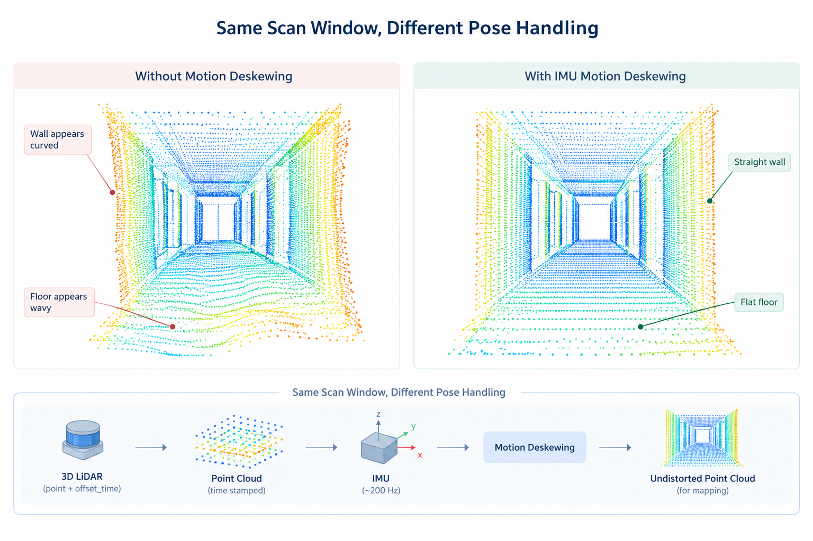

# 5.2 3D LiDAR Mapping and Fast-LIO Deployment on J501

3D LiDAR mapping is a key step from planar navigation toward full spatial perception for mobile robots. A 2D occupancy grid can support Nav2 planning, but it cannot represent overhangs, ramps, or other vertical geometry. In other words, it only shows obstacles on one planar slice of space, which is not enough for navigation in complex 3D environments. When those structures begin to affect the task, the robot needs a metric map built from 3D point clouds.

This lesson remains on the LiDAR branch of M5 and moves from planar mapping to tightly coupled LiDAR-inertial odometry. The algorithm focus is Fast-LIO / Fast-LIO2. The deployment target is `reComputer Robotics J501` with Livox MID-360, reusing the sensor bring-up already validated in M3. The 2D map from Lesson 5.1 should be kept: 2D remains the default planning interface, while 3D provides richer geometry for later projection, reconstruction, and multi-sensor work.

## Learning Objectives

- Explain why 3D LiDAR mapping needs motion deskewing and an IMU prior;
- Learn the tightly coupled estimation flow of Fast-LIO2 before deployment, including how extrinsics and biases are handled in the MID-360 setup;
- Compare the main 3D laser-mapping families used on mobile robots;
- Build the MID-360 driver stack from Livox-SDK2 and `livox_ros_driver2`, configure networking, and confirm the cloud;
- Build and launch Fast-LIO2 with the validated flow, then save trajectory / PCD artifacts after a slow mapping run;
- Evaluate map quality with checks that matter for later navigation and reconstruction.

## Prerequisites

- Lesson 5.1 completed: the SLAM task is clear, and a reusable 2D occupancy map has been produced;
- M3.1: MID-360 publishes LiDAR and IMU topics over the dedicated Ethernet link;
- M3.2 / M3.4: timestamps, frames, and covariance can be reasoned about in practice;
- Ubuntu 22.04 + ROS 2 Humble already available; this lesson installs the Livox driver stack and Fast-LIO2 from scratch.

---

# Part A. From Planar Maps to 3D LiDAR Mapping

## 5.2.1 Characteristics of 3D SLAM

2D SLAM can often treat one laser sweep as an approximately instantaneous planar observation. 3D LiDAR mapping faces a different observation process.

A spinning or scanning 3D LiDAR accumulates points over a non-zero time window. If the robot translates or rotates during that window, a single frame is already distorted. Without deskewing, walls bend, floors ripple, and scan-to-map matching becomes unreliable.

Modern 3D laser mapping therefore usually includes:

1. a high-rate IMU prior;
2. per-point or intra-scan timestamps;
3. a state estimator that updates continuously while the robot moves;
4. a map structure that can grow efficiently as new points arrive.

On J501 with MID-360, these ingredients are already available:

- a point cloud with per-point `offset_time`;
- an IMU near 200 Hz;
- an embedded compute platform capable of Fast-LIO2-class workloads when configured carefully.



## 5.2.2 Algorithm Landscape for 3D LiDAR Mapping

3D LiDAR mapping has settled into a few common engineering routes. Understanding those routes matters more than memorizing package names.

An early route comes from LOAM-style LiDAR odometry. It usually extracts geometric features such as edges and planes, then estimates motion through scan-to-scan or scan-to-map matching. That split into high-rate motion estimation and lower-rate map refinement still shapes many later 3D LiDAR systems.

On top of that, tightly coupled LiDAR-inertial odometry (LIO) has become a common real-time choice for mobile robots. It places IMU prediction and LiDAR residual updates into one estimator: the IMU provides a high-rate motion prior and supports intra-scan deskewing, while LiDAR corrects attitude, position, velocity, and bias. Fast-LIO / Fast-LIO2 are representative systems on this route.

When long-range consistency becomes the priority, systems often add a graph-optimization layer. Methods such as LIO-SAM typically keep a local LIO frontend and introduce a pose graph with loop constraints to reduce accumulated drift. Dense or surfel-oriented systems focus more on richer surface models for reconstruction, while multimodal stacks such as Fast-LIVO and R3LIVE continue from stable LIO by adding camera residuals.

A practical overview looks like this:

| Family                       | Representative systems          | Core approach                                        | Question it answers best                                                         |
| ---------------------------- | ------------------------------- | ---------------------------------------------------- | -------------------------------------------------------------------------------- |
| Feature-based LiDAR odometry | LOAM-style pipelines            | extract edge/plane features and match them over time | how 3D LiDAR odometry got started                                                |
| Tightly coupled LIO          | Fast-LIO / Fast-LIO2            | IMU prediction and LiDAR updates share one state     | how to get a stable trajectory and local map in real time on an onboard computer |
| Graph-centered 3D SLAM       | LIO-SAM and similar             | local LIO plus a pose graph / loop layer             | how to further reduce long-range drift                                           |
| Dense / surfel mapping       | reconstruction-oriented systems | maintain denser surface models                       | how to serve later reconstruction                                                |
| Multimodal solid-state LIO   | Fast-LIVO / R3LIVE family       | add camera residuals on top of LIO                   | how to bring vision into the stack                                               |

For this lesson, the goal is a repeatable 3D LiDAR mapping workflow on J501. Fast-LIO2 fits that need directly: it is tightly coupled LIO, can consume MID-360 point clouds with the built-in IMU, maintains an incremental map, and can output odometry plus a registered cloud on a Jetson-class platform under a reasonable load. Full loop closure and heavier graph optimization can wait for later reading; camera fusion and dense reconstruction belong to later multi-sensor and reconstruction lessons. This lesson first deploys the Fast-LIO2 mainline clearly.


---

# Part B. Practice: Deploy MID-360 and Fast-LIO2 on Ubuntu 22.04 + ROS 2 Humble

This section covers: install Livox-SDK2 → build `livox_ros_driver2` → configure networking and confirm the cloud → build Fast-LIO2 → edit `mid360.yaml` → launch mapping. Course baseline:

| Item | Course value |
| --- | --- |
| OS | Ubuntu 22.04 |
| ROS | ROS 2 Humble |
| LiDAR | Livox MID-360 |
| Mapping stack | Fast-LIO2 |
| Workspace | `~/ros2_ws` |
| Fast-LIO repository | [Ericsii/FAST_LIO_ROS2](https://github.com/Ericsii/FAST_LIO_ROS2) |
| Example host wired IP | `192.168.1.50/24` |
| MID-360 IP rule | typically `192.168.1.1xx`, where the last two digits come from the LiDAR SN |

> If your host IP is not `192.168.1.50`, change every network-related setting to your real address and keep the host IP, `MID360_config.json`, and LiDAR IP consistent.

## 5.2.3 Know Fast-LIO2 Before Deployment

Before hands-on work, treat Fast-LIO2 as one complete tightly coupled estimation chain.

LiDAR and IMU enter the same iterated error-state Kalman filter (iEKF). The IMU predicts attitude, position, velocity, and bias at high rate and uses that short trajectory for intra-scan deskewing. Deskewed points are then matched to the current map; the resulting LiDAR residuals correct the same state. Aligned points are written into an incremental map for the next match.

For MID-360, this lesson handles the key quantities as follows:

| Category | Handling in this lesson |
| --- | --- |
| LiDAR-IMU extrinsic | start from the default geometry in repo `mid360.yaml`, with `extrinsic_est_en: false` |
| IMU bias | stay still for a few seconds after launch; Fast-LIO2 estimates it online |
| Time synchronization | confirm `/livox/lidar` and `/livox/imu` through driver health checks first |
| Mapping input | use `msg_MID360_launch.py`, not the visualization-only `rviz_MID360_launch.py` |

## 5.2.4 Install Livox-SDK2

Install the SDK before building the ROS driver.

### 1. Clone the repository

```bash
cd ~
git clone https://github.com/Livox-SDK/Livox-SDK2.git
```

### 2. Build and install

```bash
cd ~/Livox-SDK2
mkdir build && cd build
cmake .. && make -j
sudo make install
```

### 3. Optional verification

You can run this before connecting the LiDAR. Without a sensor attached, the program may print a connection error; if the logs already show a successful start, the SDK is usually installed correctly.

```bash
find ~/Livox-SDK2 -name "mid360_config.json"
cd ~/Livox-SDK2/build/samples/livox_lidar_quick_start
./livox_lidar_quick_start /home/$USER/Livox-SDK2/samples/livox_lidar_quick_start/mid360_config.json
```

Replace the path with the real username path on your machine.

## 5.2.5 Download and Build livox_ros_driver2

The default workspace name below is `~/ros2_ws`. Create it if needed:

```bash
mkdir -p ~/ros2_ws/src
```

### 1. Clone the driver

```bash
cd ~/ros2_ws/src
git clone https://github.com/Livox-SDK/livox_ros_driver2.git
```

### 2. Create `package.xml`

The cloned repository only ships `package_ROS1.xml` and `package_ROS2.xml`. For ROS 2 you must copy one into place first:

```bash
cd ~/ros2_ws/src/livox_ros_driver2
cp package_ROS2.xml package.xml
```

Skip this step and the build will fail.

### 3. Build with the official script

Do not force a plain `colcon build` for `livox_ros_driver2` from the workspace root. Follow this order:

```bash
cd ~/ros2_ws
source /opt/ros/humble/setup.bash
cd ~/ros2_ws/src/livox_ros_driver2
./build.sh humble
cd ~/ros2_ws
source install/setup.bash
```

Yellow warnings during the build are acceptable as long as the final build succeeds.

## 5.2.6 Configure Networking and Confirm the MID-360 Cloud

### 1. Set the host wired NIC

In the system network settings, change the wired NIC connected to MID-360 to manual IPv4, for example:

| Item | Example |
| --- | --- |
| Address | `192.168.1.50` |
| Netmask | `255.255.255.0` |
| Gateway | leave empty |

### 2. Edit `MID360_config.json`

Open:

```bash
nano ~/ros2_ws/src/livox_ros_driver2/config/MID360_config.json
```

Set the host-related IP fields to the same address as the NIC, for example `192.168.1.50`. The LiDAR IP is usually of the form `192.168.1.1xx`: check the SN on the LiDAR box and append the last two digits to `192.168.1.1`. For example, if the SN ends with `23`, the LiDAR IP is often `192.168.1.123`.

### 3. Point cloud

```bash
cd ~/ros2_ws
source /opt/ros/humble/setup.bash
source install/setup.bash
ros2 launch livox_ros_driver2 rviz_MID360_launch.py
```


## 5.2.7 Install and Build Fast-LIO2

### 1. Install dependencies

```bash
sudo apt install -y libeigen3-dev libpcl-dev
sudo apt install -y ros-humble-pcl-conversions ros-humble-pcl-ros
```

### 2. Clone the repository

Upstream Fast-LIO was originally ROS 1 oriented. This lesson uses the ROS 2 community port [Ericsii/FAST_LIO_ROS2](https://github.com/Ericsii/FAST_LIO_ROS2). Always clone with `--recursive`, or submodule files will be missing.

```bash
cd ~/ros2_ws/src
git clone --recursive https://github.com/Ericsii/FAST_LIO_ROS2.git
```

If submodules were skipped:

```bash
cd ~/ros2_ws/src/FAST_LIO_ROS2
git submodule update --init --recursive
```

### 3. Build from the workspace root

Clone into `src`, but run `colcon build` from `~/ros2_ws`:

```bash
cd ~/ros2_ws
source /opt/ros/humble/setup.bash
source install/setup.bash
colcon build --packages-select fast_lio --symlink-install --cmake-args -DCMAKE_BUILD_TYPE=Release
source install/setup.bash
```

Record the commit for reproduction:

```bash
cd ~/ros2_ws/src/FAST_LIO_ROS2
git rev-parse --short HEAD
```

## 5.2.8 Edit Fast-LIO2 Parameters

Open:

```bash
nano ~/ros2_ws/src/FAST_LIO_ROS2/config/mid360.yaml
```

Create a map output directory first:

```bash
mkdir -p ~/maps/fast_lio
```

Then confirm or edit:

```yaml
extrinsic_est_en: false

map_file_path: "/home/YOUR_USERNAME/maps/fast_lio/mid360_current.pcd"

pcd_save:
    pcd_save_en: true
    interval: -1
```

Notes:

- `extrinsic_est_en: false` keeps the first run on the fixed extrinsic from the config;
- `map_file_path` must be a real absolute path on your machine;
- set `pcd_save_en` to `true` if you want to save a PCD.

Repository defaults are usually already:

```yaml
common:
    lid_topic:  "/livox/lidar"
    imu_topic:  "/livox/imu"
```

Leave them unchanged unless you renamed the driver topics.

> **Image placeholder:** `images/mid360_extrinsic_check.png`
> **Fill with:** a screenshot of the key `mid360.yaml` fields for extrinsics, `map_file_path`, and `pcd_save_en`.

## 5.2.9 Launch Fast-LIO2 Mapping

Prepare two terminals. For mapping, launch `msg_MID360_launch.py`, not the earlier visualization launch `rviz_MID360_launch.py`.

### Terminal A: Livox driver

```bash
cd ~/ros2_ws
source /opt/ros/humble/setup.bash
source install/setup.bash
ros2 launch livox_ros_driver2 msg_MID360_launch.py
```

### Terminal B: Fast-LIO2

```bash
cd ~/ros2_ws
source /opt/ros/humble/setup.bash
source install/setup.bash
ros2 launch fast_lio mapping.launch.py config_file:=mid360.yaml
```

To open RViz at the same time:

```bash
ros2 launch fast_lio mapping.launch.py config_file:=mid360.yaml rviz:=true
```

### First-run tips

1. stay still for 5–10 seconds after launch so bias can settle;
2. start with slow translation, then gentle turns;
3. choose an indoor scene with clear structure: walls, pillars, door frames;
4. revisit a distinctive corner and check drift visually.

In another terminal, run health checks:

```bash
source ~/ros2_ws/install/setup.bash
ros2 topic list | rg -i 'livox|odom|path|cloud'
ros2 topic hz /livox/lidar
ros2 topic hz /livox/imu
ros2 topic hz /Odometry
```

> **Image placeholder:** `images/j501_fastlio_rviz.jpg`
> **Fill with:** an RViz screenshot during Fast-LIO2 mapping, showing the growing cloud map and trajectory.

## 5.2.10 Save Trajectory and Map Artifacts

### Save a PCD

If `pcd_save_en` is enabled in `mid360.yaml`, call the save service after mapping:

```bash
source ~/ros2_ws/install/setup.bash
ros2 service list | rg map_save
ros2 service call /map_save std_srvs/srv/Trigger {}
ls -lh ~/maps/fast_lio/
```

### Record a bag in parallel

```bash
source ~/ros2_ws/install/setup.bash
mkdir -p ~/maps/fast_lio
ros2 bag record -o ~/maps/fast_lio/mid360_loop_bag \
  /Odometry \
  /path \
  /cloud_registered \
  /tf \
  /tf_static
```

If topic names differ, replace them using `ros2 topic list`.

### Optional: export a simple trajectory text file

Export a TUM-style text file from `/path` or from the bag for comparison with the Lesson 5.1 2D map:

```text
timestamp tx ty tz qx qy qz qw
```

> **Image placeholder:** `images/pcd_map_and_projected_2d.png`
> **Fill with:** the saved PCD and a comparison against the Lesson 5.1 2D map.

## 5.2.11 Quality Checks and Common Failures

A single attractive screenshot is not enough to claim success. Initialization, geometric consistency, revisit error, and runtime health all need to be checked together.

### Minimum checks

1. **Static warm-up:** hold the robot still for 5–10 s; the path should remain stable.
2. **Corridor straightness:** a long wall should remain roughly straight after a full pass.
3. **Return-to-start visual error:** after a loop, the revisited corner should land close to the original structure.
4. **IMU-LiDAR consistency:** intentionally degraded IMU timing should visibly damage deskewing.
5. **Runtime health:** mapping should stay real-time with a stable processing queue.

### Useful commands

```bash
ros2 topic hz /livox/lidar
ros2 topic hz /livox/imu
ros2 topic hz /Odometry
ros2 run tf2_ros tf2_echo camera_init body
top
```

If the world frame in TF is not `camera_init`, replace it with the actual frame name.

### Common issues

| Symptom | Likely cause | Fix |
| --- | --- | --- |
| Cloud grows like jelly | deskewing / timestamp problem | check per-point time and IMU rate; confirm mapping uses `msg_MID360_launch.py` |
| Map tilts as soon as the robot moves | extrinsic or axis-convention issue | revisit `mid360.yaml` and the physical mount |
| Odometry jumps through doorways | motion too aggressive or structure too weak | slow down, pause, and revisit with better overlap |
| Driver build fails | missing `package.xml` or wrong build method | run `cp package_ROS2.xml package.xml`, then `./build.sh humble` |
| Fast-LIO missing files / fails to build | cloned without `--recursive`, or `colcon` was run inside `src` | init submodules and rebuild from `~/ros2_ws` |
| Ping works but no cloud / no IMU | `MID360_config.json` disagrees with the NIC IP | unify host IP, config file, and SN-based LiDAR IP |
| Nodes will not shut down cleanly | stale processes | `killall -9 livox_ros_driver2_node` |
| Rebuild keeps old broken artifacts | leftover `build` / `install` | remove the package products, e.g. `rm -rf build/livox_ros_driver2 install/livox_ros_driver2` |

Extra recovery commands:

```bash
# refresh the dynamic library cache
sudo ldconfig

# if the firewall may be blocking LiDAR traffic, disable it temporarily for debugging
sudo ufw disable

# clean one package before rebuilding
rm -rf ~/ros2_ws/build/livox_ros_driver2
rm -rf ~/ros2_ws/install/livox_ros_driver2
```

## 5.2.12 Experiments and Acceptance

Complete the following on a real MID-360 platform.

1. **SDK and driver:** finish Livox-SDK2 and `livox_ros_driver2` builds;
2. **Cloud check:** confirm a stable cloud with `rviz_MID360_launch.py`;
3. **Mapping bring-up:** launch Fast-LIO2 with `msg_MID360_launch.py` + `mapping.launch.py`;
4. **Slow loop mapping:** drive one indoor loop and produce a registered cloud / PCD artifact;
5. **Cross-check with 5.1:** visually compare the 3D structure of the same room with the earlier 2D occupancy map.

### Deliverables

- a launch record with commit hash and config file names;
- an RViz screenshot after the indoor loop;
- a trajectory file or bag containing odometry/path;
- a PCD or equivalent 3D map artifact;
- a short diagnosis note covering a real failure case.

### Acceptance standard

| Check | Pass criterion |
| --- | --- |
| Sensor contract | MID-360 LiDAR and IMU are both healthy under the current network setup |
| Estimator lock | Fast-LIO2 keeps publishing odometry during a slow loop |
| Map artifact | a reopenable 3D map file or registered-cloud bag exists |
| Geometric sanity | walls and structure are recognizable without jelly distortion |
| Course handoff | frame names, topics, and save paths are recorded for later modules |

## Lesson Summary

This lesson upgraded the course from navigation-ready 2D maps to 3D LiDAR mapping on J501. It compared the main 3D algorithm families, gave a compact pre-deployment briefing on the Fast-LIO2 tightly coupled estimation chain, and reused the MID-360 Ethernet and IMU stack from M3. The success criterion is a repeatable J501 deployment that can be cloned, built, configured, and launched successfully, and that leaves trajectory and map artifacts behind.

## Next Step

Later lessons can move in two directions from here:

- multi-sensor mapping that adds cameras on top of stable LIO;
- reconstruction and semantic layers that turn geometry into representations usable by M6/M7.

Make the MID-360 + Fast-LIO2 bring-up stably repeatable first, then move on.

## References

- Xu, Zhang, et al.: Fast-LIO / Fast-LIO2 papers and open-source repositories
- Zhang, Singh: LOAM
- Shan et al.: LIO-SAM
- Course prerequisite: [M3.1 LiDAR Integration and Point Cloud Preprocessing](../../M03-LiDAR-and-Multi-Sensor-Fusion/3.1_LiDAR_Integration_and_Point_Cloud_Preprocessing/README_en_US.md)
- Previous lesson: [5.1 Understanding SLAM and Building Your First Occupancy Grid Map](../5.1_What_SLAM_Is_and_2D_LiDAR_Mapping/README_en_US.md)
