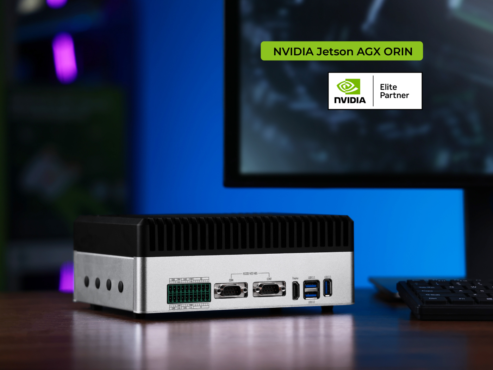
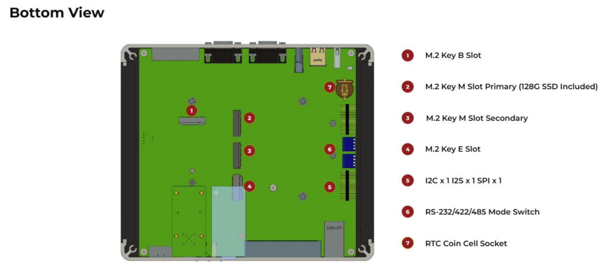
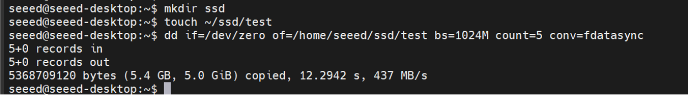
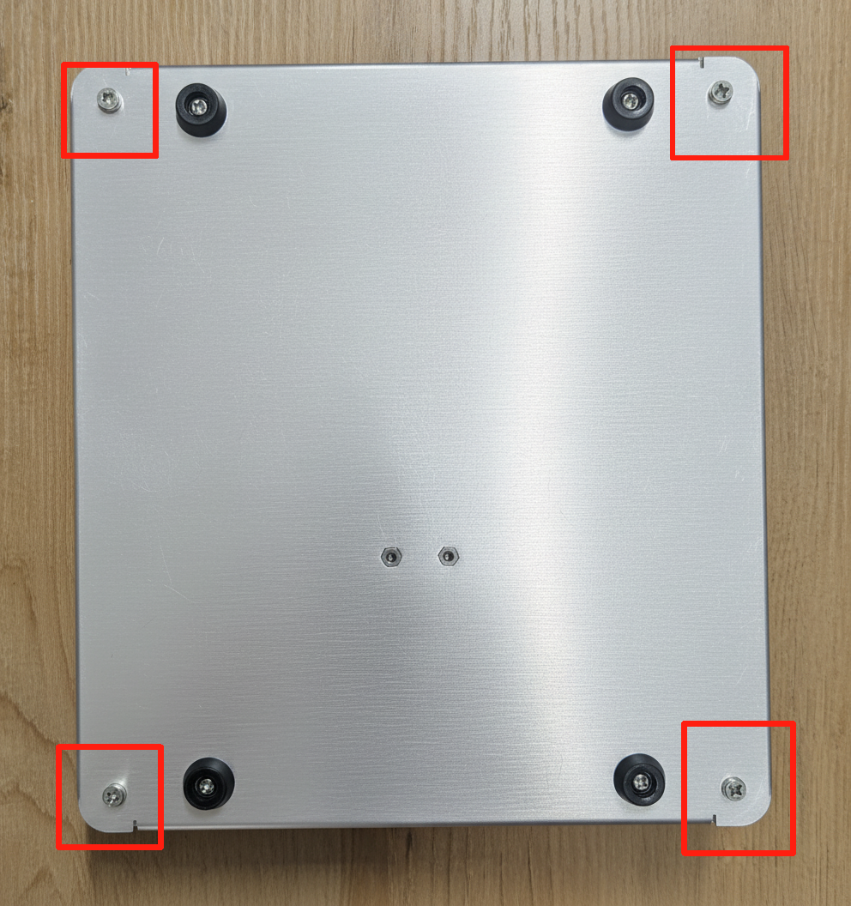
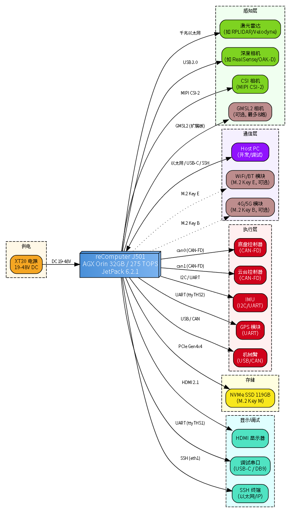

# M1 Platform and Development Environment

> **Target Hardware**: reComputer Robotics J501 (AGX Orin 32GB), L4T 36.4.4 / JetPack 6.2.1
>
> **Host PC**: Ubuntu 22.04.5 LTS, x86_64

***

# 1.1 J501 Hardware Platform Overview and Interfaces

**Learning Objectives**: Understand the hardware architecture of the J501 as a robot main controller, and master the selection and wiring of the key interfaces.

**Hardware List**: reComputer Robotics J501 (AGX Orin 32GB/64GB), XT30 power cable, cooling fan kit, debug serial cable, Ethernet cable.

***

## 1.1.1 Product Overview

The reComputer Robotics J501X is a high-performance edge AI carrier board designed for advanced robotics and industrial applications. It is compatible with NVIDIA Jetson AGX Orin modules (32GB/64GB), corresponding to the products [reComputer Robotics J5011](https://www.seeedstudio.com/reComputer-Robotics-J5011-with-GMSL-extension-board-p-6681.html) and [reComputer Robotics J5012](https://www.seeedstudio.com/reComputer-Robotics-J5012-with-GMSL-extension-board-p-6682.html) respectively, and delivers up to **275 TOPS** of AI performance in MAXN mode.



The carrier board offers rich connectivity — including one 10GbE and four 1GbE Ethernet ports, dual M.2 Key M slots for NVMe SSDs, M.2 slots for 5G and Wi-Fi/BT modules, multiple USB 3.0 ports, four CAN interfaces (2 native + 2 SPI-to-CAN), GMSL2 camera expansion, and a complete set of I/O including DI/DO, I2S, UART, and RS485 — making it a powerful robot "brain" for complex multi-sensor fusion and real-time AI processing.

With **JetPack 6.2.1** and a Linux BSP preinstalled, it enables seamless deployment. It supports frameworks such as NVIDIA Isaac ROS, Hugging Face, PyTorch, and ROS 2/1. Combining large language model-driven decision-making with physical robot control, the J501 accelerates autonomous robotics development through out-of-the-box interfaces and optimized AI frameworks.

***

## 1.1.2 Key Features

| Feature | Description |
| ------- | ----------- |
| **High-Performance AI** | Equipped with a Jetson AGX Orin 32/64GB module, Ampere GPU and DLA engines, up to 275 TOPS |
| **Rich Connectivity** | Dual M.2 Key M (NVMe); Key E (WiFi/BT) + Key B (5G); 1× 10GbE + 4× 1GbE; 3× USB 3.0; 2× USB-C |
| **Quad CAN-FD** | 2 native + 2 SPI-to-CAN interfaces with electrical isolation |
| **GMSL2 Vision** | Single GMSL2 interface (1 port) for high-speed camera connections |
| **Industrial-Grade Design** | 19–48V DC input; -10\~60°C operating temperature; isolated interfaces; JetPack 6.2.1 preinstalled |
| **Robotics-Oriented** | Supports ROS 2/1 and Isaac ROS; DI/DO, I2S, UART, RS485; optimized for AMR and automation scenarios |

***

## 1.1.3 Specifications

### (1) Jetson AGX Orin System-on-Module

| Specification | J5011 (32GB) | J5012 (64GB) |
| ------------- | ------------ | ------------ |
| Module | NVIDIA Jetson AGX Orin 32GB | NVIDIA Jetson AGX Orin 64GB |
| AI Performance | 200 TOPS | 275 TOPS |
| GPU | 1792-core Ampere @ 930 MHz | 2048-core Ampere @ 1.3 GHz |
| CPU | 8-core Cortex-A78AE @ 2.0 GHz | 12-core Cortex-A78AE @ 2.2 GHz |
| Memory | 32GB 256-bit LPDDR5 @ 204.8 GB/s | 64GB 256-bit LPDDR5 @ 204.8 GB/s |
| Video Encode | 1× 4K60 / 3× 4K30 / 6× 1080p60 / 12× 1080p30 (H.265) | 2× 4K60 / 6× 4K30 / 8× 1080p60 / 16× 1080p30 (H.265) |
| Video Decode | 1× 8K30 / 2× 4K60 / 4× 4K30 / 9× 1080p60 / 18× 1080p30 (H.265) | 1× 8K30 / 3× 4K60 / 7× 4K30 / 11× 1080p60 / 22× 1080p30 (H.265) |
| CSI Camera | Up to 6 cameras (16 virtual channels), 16 MIPI CSI-2 lanes, D-PHY 2.1 (40Gbps) / C-PHY 2.0 (164Gbps) | Same as left |
| Dimensions | 100mm × 87mm, 699-pin Molex Mirror Mezz, integrated thermal plate | Same as left |

### (2) J501 Carrier Board Interfaces

| Interface Type | Specification |
| -------------- | ------------- |
| Storage | 2× M.2 Key-M (NVMe 2280) + 1× M.2 Key-B (4G/5G) |
| Networking | 1× M.2 Key-E (WiFi/BT) + 1× RJ45 10GbE + 4× RJ45 1GbE |
| USB | 3× USB 3.0 Type-A + 1× USB-C 3.0 (Recovery) + 1× USB-C 2.0 (Debug) |
| DI/DO/CAN | 4× DI @12V + 4× DO @40V + 4× CAN-FD (electrically isolated) |
| GMSL | 2× Mini-Fakra (up to 8 GMSL2 channels, optional) |
| Serial Port | 2× DB9 (RS232/422/485) |
| Display | 1× HDMI 2.1 |
| Fan | 1× 12V (2.54mm) + 1× 5V (1.25mm JST) |
| Buttons | 1× Recovery + 1× Reset |
| LED | 3× LED (PWR, SSD, user LED) |
| RTC | 1× CR1220 battery holder + 1× RTC 2-pin header |
| Power | 19–48V DC (5.08mm terminal block, power adapter not included) |
| Power Consumption | Up to 60W for the module (MAXN); up to 75W peak for the whole system (including peripherals) |
| Mechanical | Dimensions 210×180×87mm (including stand); weight 200g; desktop/wall/rail mounting (rail bracket included in accessories) |
| Operating Temperature | -10\~60°C (25W) / -10\~55°C (MAXN) |
| Software | JetPack 6.2.1 |
| Warranty / Certifications | 2 years / RoHS, REACH, CE, FCC, UKCA, KC |

### (3) GMSL Expansion Board Specifications (Optional)

| Item | Specification |
| ---- | ------------- |
| Deserializer | MAX96712 |
| GMSL Interface | 2× Robotics-Fakra male connectors |
| GMSL Input | Up to 8× GMSL2 cameras |
| POC | Supports simultaneous power and data transmission |

***

## 1.1.4 Hardware Overview

The images below show an overview of the physical J501 (this section uses the reComputer Robotics J5011 as an example; the J5012 is similar). Compare them with the actual device and identify each part.




> **Learning tip**: Compare the images above with the actual device and locate the following key interfaces: power terminal, USB-C debug port, USB-C Recovery port, HDMI, Ethernet ports (10G + 4×1G), CAN terminal block, DB9 serial ports, and M.2 slots.

***

## 1.1.5 Interface Verification in Practice

This section verifies each type of interface on the J501 with actual commands. The **actual output** of every command comes from a real J501 device and can be used as a reference.

### (1) Connection Methods

Before starting verification, you need to establish a communication connection with the J501. Most commands work the same way under different connection methods. This chapter indicates which host each example is executed on, so you can follow along according to your own setup. Three common methods are introduced below.

**Method 1: HDMI + USB keyboard/mouse (most direct)**

Connect a monitor to the HDMI port of the J501 with an HDMI cable, and connect a USB keyboard/mouse to the USB ports. After powering on, simply open a terminal in the J501 desktop environment and operate directly. This is suitable for first-time boot configuration or scenarios that require a graphical interface.

**Method 2: SSH remote connection (commonly used in this chapter)**

Connect the J501 to the Host PC with an Ethernet cable (alternatively, you can use a network adapter to join a LAN, etc.). Configure network sharing on the Host PC so that the J501 obtains an IP address (depending on the subnet configuration of your own devices), then log in remotely via SSH. The wiring and configuration steps are as follows, for reference:

1. **Network sharing**: On the Host PC, use NetworkManager to set the Ethernet port connected to the J501 to "shared" mode. The J501 obtains the IP `192.168.55.25` via DHCP

```bash
# [Host PC terminal] List network connection names
nmcli connection show
# Find the name of the wired connection to the J501, e.g. "有线连接 1"

# [Host PC terminal] Set to shared mode
nmcli connection modify "有线连接 1" connection.autoconnect yes ipv4.method shared
nmcli connection up "有线连接 1"

# Verify: the J501 should obtain an IP in the 192.168.x.x subnet
ping 192.168.55.25
```

1. **Generate the key pair**: Run `ssh-keygen -t ed25519` on the Host PC to generate an ED25519 key pair

```bash
# [Host PC terminal] Generate a key pair (just press Enter through the prompts)
ssh-keygen -t ed25519 -C "seeed@hostpc"
```

1. **Copy the public key**: Run `ssh-copy-id seeed@192.168.55.25` to push the public key to the J501

```bash
# [Host PC terminal] The first time, you need to enter the password of the seeed user on the J501 (default: seeed)
ssh-copy-id seeed@192.168.55.25
```

1. **Configure SSH config**: Edit `~/.ssh/config` and add the following content:

```bash
# [Host PC terminal] Write the SSH configuration
cat >> ~/.ssh/config << 'EOF'
Host J501
    HostName 192.168.55.25
    User seeed
    IdentityFile ~/.ssh/id_ed25519
    StrictHostKeyChecking no
EOF
```

1. **Verify passwordless login**:

```bash
# [Host PC terminal] Simply run ssh J501 for passwordless login
ssh J501
# After success, the terminal prompt changes to seeed@seeed-desktop:~$
```

> **Tip**: If you have just flashed your J501 (see Section 1.2), you can first connect via HDMI or the debug serial port, and switch to SSH after finishing the network configuration.

**Method 3: Debug serial port**

Connect the USB-C 2.0 debug port of the J501 with a USB-C debug cable, and use a serial port tool on the Host PC to connect:

```bash
# [Host PC terminal] Connect to the debug serial port with picocom
picocom -b 115200 /dev/ttyUSB0
```

> All subsequent commands in this course are marked with their execution location: `[Host PC → J501 SSH]` means running remotely from the Host PC via SSH, and `[J501 local terminal]` means running directly on the J501's display or serial terminal.

### (2) USB Device Check

```bash
# [Host PC → J501 SSH]
ssh J501 'lsusb'
```

**Actual output:**

```
Bus 002 Device 002: ID 0424:5744 Microchip Technology, Inc. (formerly SMSC) Hub
Bus 002 Device 001: ID 1d6b:0003 Linux Foundation 3.0 root hub
Bus 001 Device 004: ID 0424:2740 Microchip Technology, Inc. (formerly SMSC) Hub Controller
Bus 001 Device 014: ID 320f:5088 VXE VXE V87 2.4G Dongle
Bus 001 Device 013: ID 093a:2510 Pixart Imaging, Inc. Optical Mouse
Bus 001 Device 002: ID 0424:2744 Microchip Technology, Inc. (formerly SMSC) Hub
Bus 001 Device 001: ID 1d6b:0002 Linux Foundation 2.0 root hub
```

**Interpretation:**

- **Bus 001/002**: The two buses for USB 2.0 (480Mbps) and USB 3.0 (5Gbps)
- **0424:5744/2744**: Microchip/SMSC USB hub controllers (built into the carrier board)
- **320f:5088**: VXE V87 keyboard 2.4G dongle
- **093a:2510**: Pixart optical mouse

### (3) Network Interface Check

```bash
# [Host PC → J501 SSH]
ssh J501 'ip link show'
```

**Actual output:**

```
1: lo: <LOOPBACK,UP,LOWER_UP> mtu 65536 qdisc noqueue state UNKNOWN mode DEFAULT group default qlen 1000
    link/loopback 00:00:00:00:00:00 brd 00:00:00:00:00:00
2: enp3s0: <NO-CARRIER,BROADCAST,MULTICAST,UP> mtu 1500 qdisc pfifo_fast state DOWN mode DEFAULT group default qlen 1000
    link/ether 2c:f7:f1:23:1d:93 brd ff:ff:ff:ff:ff:ff
3: enp4s0: <NO-CARRIER,BROADCAST,MULTICAST,UP> mtu 1500 qdisc pfifo_fast state DOWN mode DEFAULT group default qlen 1000
    link/ether 2c:f7:f1:23:1d:92 brd ff:ff:ff:ff:ff:ff
4: enp5s0: <NO-CARRIER,BROADCAST,MULTICAST,UP> mtu 1500 qdisc pfifo_fast state DOWN mode DEFAULT group default qlen 1000
    link/ether 2c:f7:f1:23:1d:91 brd ff:ff:ff:ff:ff:ff
5: can0: <NOARP,ECHO> mtu 16 qdisc noop state DOWN mode DEFAULT group default qlen 10
    link/can
6: can1: <NOARP,ECHO> mtu 16 qdisc noop state DOWN mode DEFAULT group default qlen 10
    link/can
7: eno1: <NO-CARRIER,BROADCAST,MULTICAST,UP> mtu 1500 qdisc mq state DOWN mode DEFAULT group default qlen 1000
    link/ether 4c:bb:47:4b:72:7c brd ff:ff:ff:ff:ff:ff
8: eth1: <BROADCAST,MULTICAST,UP,LOWER_UP> mtu 1500 qdisc mq state UP mode DEFAULT group default qlen 1000
    link/ether 4c:bb:47:4b:72:7d brd ff:ff:ff:ff:ff:ff
9: can2: <NOARP,ECHO> mtu 16 qdisc noop state DOWN mode DEFAULT group default qlen 10
    link/can
10: can3: <NOARP,ECHO> mtu 16 qdisc noop state DOWN mode DEFAULT group default qlen 10
    link/can
13: l4tbr0: <NO-CARRIER,BROADCAST,MULTICAST,UP> mtu 1500 qdisc noqueue state DOWN mode DEFAULT group default qlen 1000
    link/ether 3e:c7:e7:79:f3:87 brd ff:ff:ff:ff:ff:ff
14: usb0: <NO-CARRIER,BROADCAST,MULTICAST,UP> mtu 1500 qdisc pfifo_fast master l4tbr0 state DOWN mode DEFAULT group default qlen 1000
15: usb1: <NO-CARRIER,BROADCAST,MULTICAST,UP> mtu 1500 qdisc pfifo_fast master l4tbr0 state DOWN mode DEFAULT group default qlen 1000
```

**IP addresses:**

```bash
# [Host PC → J501 SSH]
ssh J501 'ip addr show | grep -E "^[0-9]|inet "'
```

**Actual output:**

```
1: lo: <LOOPBACK,UP,LOWER_UP> ...    inet 127.0.0.1/8 scope host lo
8: eth1: <BROADCAST,MULTICAST,UP,LOWER_UP> ...    inet 192.168.55.25/24 brd 192.168.55.255 scope global dynamic noprefixroute eth1
```

**Interface mapping table:**

| Interface | Type | State | IP | Description |
| --------- | ---- | ----- | -- | ----------- |
| enp3s0 | Gigabit Ethernet | DOWN | - | SMSC 7430, not cabled |
| enp4s0 | Gigabit Ethernet | DOWN | - | SMSC 7430, not cabled |
| enp5s0 | Gigabit Ethernet | DOWN | - | SMSC 7430, not cabled |
| eno1 | Gigabit Ethernet | DOWN | - | Onboard Ethernet port |
| eth1 | Ethernet | **UP** | 192.168.55.25 | Host PC network sharing |
| can0\~can3 | CAN-FD | DOWN | - | 4 CAN channels (see below for details) |
| l4tbr0 | Bridge | DOWN | - | USB bridge (disabled) |

### (4) PCI Device Check

```bash
# [Host PC → J501 SSH]
ssh J501 'lspci'
```

**Actual output:**

```
0000:00:00.0 PCI bridge: NVIDIA Corporation Device 229c (rev a1)
0000:01:00.0 PCI bridge: Pericom Semiconductor PI7C9X2G404 EL/SL PCIe2 4-Port/4-Lane Packet Switch (rev 05)
0000:02:01.0 PCI bridge: Pericom Semiconductor PI7C9X2G404 EL/SL PCIe2 4-Port/4-Lane Packet Switch (rev 05)
0000:02:02.0 PCI bridge: Pericom Semiconductor PI7C9X2G404 EL/SL PCIe2 4-Port/4-Lane Packet Switch (rev 05)
0000:02:03.0 PCI bridge: Pericom Semiconductor PI7C9X2G404 EL/SL PCIe2 4-Port/4-Lane Packet Switch (rev 05)
0000:03:00.0 Ethernet controller: Microchip Technology / SMSC Device 7430 (rev 11)
0000:04:00.0 Ethernet controller: Microchip Technology / SMSC Device 7430 (rev 11)
0000:05:00.0 Ethernet controller: Microchip Technology / SMSC Device 7430 (rev 11)
0004:00:00.0 PCI bridge: NVIDIA Corporation Device 229c (rev a1)
0004:01:00.0 Non-Volatile memory controller: Phison Electronics Corporation PS5013 E13 NVMe Controller (rev 01)
```

**Interpretation:**

- **NVIDIA 229c**: Tegra234 SoC PCIe controller
- **Pericom PI7C9X2G404**: PCIe switch chip that expands multiple Ethernet ports
- **SMSC 7430**: Three Gigabit Ethernet controllers
- **Phison PS5013 E13**: NVMe SSD controller

### (5) CAN Bus Check

```bash
# [Host PC → J501 SSH]
ssh J501 'ip -details link show can0; ip -details link show can2'
```

**Actual output (can0 — native CAN):**

```
5: can0: <NOARP,ECHO> mtu 16 qdisc noop state DOWN mode DEFAULT group default qlen 10
    link/can  promiscuity 0 minmtu 0 maxmtu 0
    can state STOPPED (berr-counter tx 0 rx 0) restart-ms 0
          mttcan: tseg1 2..255 tseg2 0..127 sjw 1..127 brp 1..511 brp-inc 1
          mttcan: dtseg1 1..31 dtseg2 0..15 dsjw 1..15 dbrp 1..15 dbrp-inc 1
          clock 50000000 numtxqueues 1 numrxqueues 1 ... parentbus platform parentdev c310000.mttcan
```

**Actual output (can2 — SPI-expanded CAN):**

```
9: can2: <NOARP,ECHO> mtu 16 qdisc noop state DOWN mode DEFAULT group default qlen 10
    link/can  promiscuity 0 minmtu 0 maxmtu 0
    can state STOPPED (berr-counter tx 0 rx 0) restart-ms 0
          mcp251xfd: tseg1 2..256 tseg2 1..128 sjw 1..128 brp 1..256 brp-inc 1
          mcp251xfd: dtseg1 1..32 dtseg2 1..16 dsjw 1..16 dbrp 1..256 dbrp-inc 1
          clock 40000000 numtxqueues 1 numrxqueues 1 ... parentbus spi parentdev spi0.0
```

| Interface | Controller | Bus | Clock | Characteristics |
| --------- | ---------- | --- | ----- | --------------- |
| can0 | mttcan | platform | 50MHz | Built into the SoC, native CAN-FD |
| can1 | mttcan | platform | 50MHz | Built into the SoC, native CAN-FD |
| can2 | mcp251xfd | SPI (spi0.0) | 40MHz | External chip, electrically isolated |
| can3 | mcp251xfd | SPI (spi0.1) | 40MHz | External chip, electrically isolated |

> **Knowledge point**: `mttcan` is the built-in CAN controller of the Tegra SoC and offers the best performance; `mcp251xfd` is a standalone CAN-FD controller from Microchip, connected via SPI, suitable for scenarios that need more channels or electrical isolation. Lesson M3.2 covers CAN-FD configuration in detail.

### (6) I2C / SPI / UART Check

```bash
# [Host PC → J501 SSH]
ssh J501 'echo "I2C:"; ls /dev/i2c-*; echo "SPI:"; ls /dev/spidev*; echo "UART:"; ls /dev/ttyTHS*'
```

**Actual output:**

```
I2C:
/dev/i2c-0
/dev/i2c-1
/dev/i2c-2
/dev/i2c-3
/dev/i2c-4
/dev/i2c-5
/dev/i2c-6
/dev/i2c-7
/dev/i2c-8
SPI:
/dev/spidev1.0
/dev/spidev1.1
/dev/spidev2.0
/dev/spidev2.1
UART:
/dev/ttyTHS1
/dev/ttyTHS2
/dev/ttyTHS4
```

| Bus | Count | Device Paths | Typical Uses |
| --- | ----- | ------------ | ------------ |
| I2C | 9 | /dev/i2c-0 \~ /dev/i2c-8 | Sensors, IMU, drivers |
| SPI | 4 | /dev/spidev1.0\~1.1, 2.0\~2.1 | CAN expansion, displays |
| UART | 3 | /dev/ttyTHS1, 2, 4 | Debug serial port, IMU, GPS |

### (7) NVMe Storage Check

```bash
# [Host PC → J501 SSH]
ssh J501 'lsblk'
```

**Actual output:**

```
NAME         MAJ:MIN RM   SIZE RO TYPE MOUNTPOINTS
nvme0n1      259:0    0 119.2G  0 disk
|-nvme0n1p1  259:1    0 117.8G  0 part /
|-nvme0n1p10 259:10   0    64M  0 part /boot/efi
...
mmcblk0      179:0    0  59.2G  0 disk
zram0-7      252:0-7  0   1.9G  0 disk [SWAP]
```

**Interpretation:** NVMe SSD 119.2GB (Phison PS5013 E13); the 117.8GB system partition is mounted at `/`. There is also 59.2GB eMMC (mmcblk0) and 8×1.9GB zram swap.

### (8) SSD Read/Write Speed Test

```bash
# [Host PC → J501 SSH]
ssh J501 'dd if=/dev/zero of=/home/seeed/ssd_test bs=100M count=1 conv=fdatasync; rm -f /home/seeed/ssd_test'
```

**Actual output:**

```
1+0 records in
1+0 records out
104857600 bytes (105 MB, 100 MiB) copied, 0.312549 s, 335 MB/s
```

**Result: NVMe SSD write speed 335 MB/s**, which meets the needs of real-time data acquisition and AI model loading.

### (9) Temperature and Cooling

```bash
# [Host PC → J501 SSH]
ssh J501 'cat /sys/class/thermal/thermal_zone*/temp; echo "---"; cat /sys/class/thermal/cooling_device*/cur_state'
```

**Actual output:**

```
39375
35781
37062
38093
37000
39375
---
0
0
0
0
0
0
0
0
0
0
0
0
0
```

**Interpretation:** The six temperature sensors read 35.8°C \~ 39.4°C (idle in 40W mode), and all 13 cooling devices are at 0 (fans are not running at full speed).

### (10) Device Model and Serial Number

```bash
# [Host PC → J501 SSH]
ssh J501 'cat /proc/device-tree/model; echo; cat /proc/device-tree/compatible; echo; cat /proc/device-tree/serial-number; echo'
```

**Actual output:**

```
NVIDIA Jetson AGX Orin Developer Kit
nvidia,p3737-0000+p3701-0004nvidia,p3701-0004nvidia,tegra234
1424225004690
```

***

## 1.1.6 M.2 Interface Expansion

### (1) M.2 Key M (NVMe SSD)


Dual M.2 Key M slots, supporting PCIe Gen4x4 NVMe SSDs. Supported capacities: 128GB / 256GB / 512GB / 1TB / 2TB.

**SSD write test:**



**View SSD information (sudo required):**


### (2) M.2 Key E (WiFi/BT)


Supports Wi-Fi 6 and Bluetooth 5.x modules. For compatible modules and antennas, see the [Wireless Module List](https://wiki.seeedstudio.com/Wireless_Module_List). Before installation, remove the enclosure screws:



**WiFi performance test:**

```bash
# [J501 local terminal] iperf3 must be installed first
# Server side (Host PC) runs: iperf3 -s
# On the J501 run:
iperf3 -c <服务器IP>
```

### (3) M.2 Key B (4G/5G Module)


Supports 4G/5G cellular modules with a Nano SIM card slot. For compatible 4G modules, see the [4G Module List](https://wiki.seeedstudio.com/4G_Module_List). Verification steps (for reference only):

```bash
# [J501 local terminal] The following commands must be run directly on the J501 (some require sudo)
# 1. Check hardware detection
lsusb
# 2. Verify the driver
lsmod | grep option
# 3. Install ModemManager
sudo apt install modemmanager && sudo systemctl restart ModemManager
# 4. Verify detection
mmcli -L
# 5. Set the APN (China Mobile example)
sudo nmcli con add type gsm ifname "*" apn "CMNET" ipv4.method auto
# 6. Activate the connection
sudo nmcli con up "gsm"
# 7. Check the status
mmcli -m 0
```

***

## 1.1.7 Interface Function Mapping Table

| Interface | Device Name | Type | Purpose | State | Follow-up Lesson |
| --------- | ----------- | ---- | ------- | ----- | ---------------- |
| Gigabit Ethernet 1 | enp3s0 | RJ45 | LiDAR connection | DOWN | M3.1 |
| Gigabit Ethernet 2 | enp4s0 | RJ45 | Spare | DOWN | - |
| Gigabit Ethernet 3 | enp5s0 | RJ45 | Spare | DOWN | - |
| Onboard Ethernet | eno1 | RJ45 | Spare | DOWN | - |
| Shared Ethernet | eth1 | - | Host PC connection | UP (192.168.55.25) | 1.3 |
| CAN-FD 1 | can0 | Terminal block | Chassis communication | STOPPED | M3.2 |
| CAN-FD 2 | can1 | Terminal block | Gimbal/expansion | STOPPED | M3.2 |
| CAN-FD 3 | can2 | Terminal block (SPI) | Expansion bus | STOPPED | M3.2 |
| CAN-FD 4 | can3 | Terminal block (SPI) | Expansion bus | STOPPED | M3.2 |
| I2C 0-8 | /dev/i2c-\[0-8] | 4-pin | Sensors/drivers | Available | M3.2 |
| SPI 1-2 | /dev/spidev\[1-2].\[0-1] | 6-pin | CAN expansion/sensors | Available | M3.2 |
| UART 1 | /dev/ttyTHS1 | 4-pin | Debug serial port | Available | 1.2 |
| UART 2 | /dev/ttyTHS2 | 4-pin | IMU/GPS | Available | M3.2 |
| UART 3 | /dev/ttyTHS4 | 4-pin | Expansion serial port | Available | M3.2 |
| USB 3.0 | Bus 001/002 | Type-A | Cameras/peripherals | Available | M2.3 |
| USB-C Debug | - | Type-C | Debug UART | Available | 1.2 |
| USB-C Recovery | - | Type-C | Flashing | Available | 1.2 |
| NVMe SSD | /dev/nvme0n1 | M.2 M | System storage (119GB) | 39% used | - |
| HDMI | - | HDMI 2.1 | Display output | Available | - |
| M.2 Key E | - | M.2 | WiFi/BT | Not installed | - |
| M.2 Key B | - | M.2 | 4G/5G | Not installed | - |
| GMSL2 | - | Mini-Fakra | Camera expansion | Not installed | M2.2 |

***

## 1.1.8 Wiring Topology

Both the Host PC and the J501 can connect to the Internet through the same router (for convenience, this course uses a direct connection to the Host PC; see Section 1.3.2 for details). The following topology diagram shows a typical wiring scheme for the J501 in a robot system, covering three major aspects: perception, communication, and actuation:



> For the device names corresponding to each interface and the follow-up lessons, see the interface function mapping table in 1.1.7.

***
