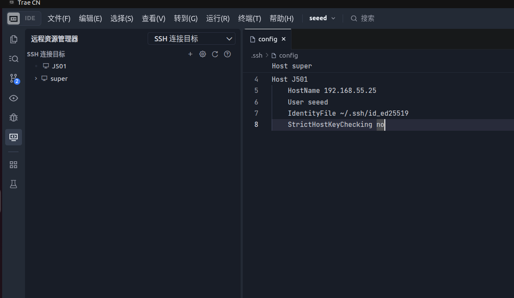
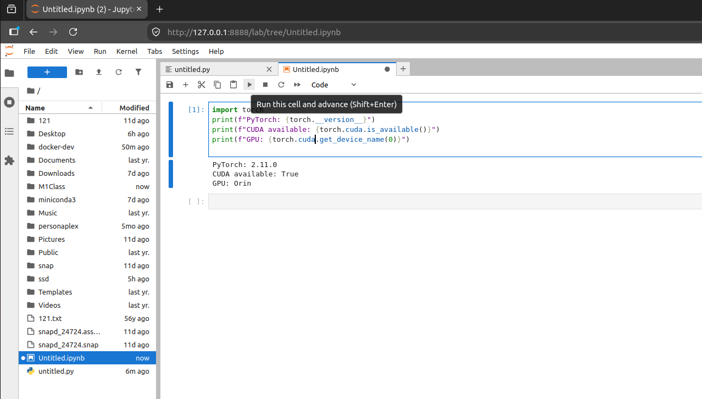

# M1 Platform and Development Environment

> **Target Hardware**: reComputer Robotics J501 (AGX Orin 32GB), L4T 36.4.4 / JetPack 6.2.1
>
> **Host PC**: Ubuntu 22.04.5 LTS, x86\_64

***

# 1.3 Containerized Development Environment and Remote Toolchain

> **Learning Objectives**: Establish a reproducible and portable containerized development environment that supports remote development and debugging.
>
> **Hardware List**: J501, a LAN or Ethernet cable, and a Host PC.
>
> **Prerequisites**: Section 1.2 (System Flashing and Configuration) has been completed.

***

## 1.3.1 Overview of the Jetson Docker Ecosystem

The core value of Docker on the Jetson platform is **environment isolation and reproducibility**. Jetson runs on the aarch64 (ARM64) architecture and differs from Docker on an x86 PC in two key ways:

| Feature           | x86 PC Docker                | Jetson Docker                                            |
| ----------------- | ---------------------------- | -------------------------------------------------------- |
| Architecture      | amd64                        | arm64 (aarch64)                                          |
| GPU passthrough   | `--gpus all` + NVIDIA Driver | `--runtime=nvidia` + NVIDIA Container Toolkit            |
| Base image        | `nvidia/cuda`                | `nvcr.io/nvidia/l4t-jetpack` (includes CUDA/cuDNN/TensorRT) |
| Device nodes      | `/dev/nvidia*`               | `/dev/nvidia*` + `/dev/nvhost-*` + `/dev/nvmap`          |

**Key components of the Jetson Docker ecosystem:**

1. **NVIDIA Container Toolkit** — Pre-installed in JetPack 6.2 (v1.16.2); passes the host GPU device nodes through into containers
2. **l4t-jetpack base image** — Officially maintained by NVIDIA; includes CUDA/cuDNN/TensorRT/VPI matched to the JetPack version
3. **nv-install-docker.service** — A systemd service shipped with JetPack that installs Docker Engine with a single command

***

## 1.3.2 Installing Docker Engine

JetPack 6.2 comes with NVIDIA Container Toolkit pre-installed, but **Docker Engine itself is not installed**. NVIDIA provides a one-click installation script `nv-install-docker.sh` that automatically completes the Docker CE installation and NVIDIA runtime configuration.

### (1) Checking the State Before Installation

```bash
# [Host PC -> J501 SSH] Check the status of Docker and NVIDIA Container Toolkit
ssh J501 'which docker 2>/dev/null; echo "---"; dpkg -l | grep nvidia-container-toolkit 2>/dev/null; echo "---"; systemctl status nv-install-docker.service 2>&1 | head -5'
```

**Actual output:**

```
---
ii  nvidia-container-toolkit          1.16.2-1                                    arm64        NVIDIA Container toolkit
○ nv-install-docker.service - One-time Docker CE installation service
     Loaded: loaded (/etc/systemd/system/nv-install-docker.service; disabled; vendor preset: enabled)
     Active: inactive (dead)
```

> **Interpretation**: The `docker` command does not exist (not installed), but `nvidia-container-toolkit` is already pre-installed (v1.16.2), and `nv-install-docker.service` is inactive and waiting to run.

### (2) Running the NVIDIA One-Click Installation Script

```bash
# [J501 local terminal] Run the official NVIDIA installation script (sudo required)
sudo bash /etc/systemd/nv-install-docker.sh
```

The script automatically performs the following operations:

1. Removes conflicting packages (docker.io, podman-docker, etc.)
2. Adds the official Docker apt repository and GPG key
3. Installs docker-ce, docker-ce-cli, containerd.io, docker-buildx-plugin, docker-compose-plugin
4. Starts and enables the Docker service
5. Configures the NVIDIA Container Runtime
6. Disables itself (a one-time service)

**Actual output (key parts):**

```
# ... remove conflicting packages, add repository ...
The following NEW packages will be installed:
  containerd.io docker-buildx-plugin docker-ce docker-ce-cli docker-ce-rootless-extras docker-compose-plugin pigz
0 upgraded, 7 newly installed, 0 to remove and 487 not upgraded.
Need to get 86.2 MB of archives.
# ... download and install ...
Setting up docker-ce (5:29.6.2-1~ubuntu.22.04~jammy) ...
Created symlink /etc/systemd/system/multi-user.target.wants/docker.service
Docker service installed
# ... configure NVIDIA runtime ...
time="2026-07-28T15:42:47+08:00" level=info msg="Wrote updated config to /etc/docker/daemon.json"
```

### (3) Adding the User to the docker Group

```bash
# [J501 local terminal] Run docker without sudo
sudo usermod -aG docker $USER
# You need to log out and log back in, or run newgrp docker, for this to take effect
```

```bash
# [Host PC -> J501 SSH] Verify the user has been added to the docker group (takes effect after reconnecting via SSH)
ssh J501 'groups'
```

**Actual output:**

```
seeed adm cdrom sudo audio dip video plugdev render i2c lpadmin gdm sambashare docker weston-launch gpio jtop
```

> **Confirmation**: The output contains `docker`, which means the user has been successfully added to the docker group and can run docker commands without sudo.

### (4) Verifying the Installation

```bash
# [Host PC -> J501 SSH] Verify the Docker version and service status
ssh J501 'docker version; echo "---"; systemctl is-active docker; echo "---"; docker info 2>&1 | grep -E "Runtime|nvidia|Server Version|Storage Driver|Cgroup"'
```

**Actual output:**

```
Client: Docker Engine - Community
 Version:           29.6.2
 API version:       1.55
 Go version:        go1.26.5
 Git commit:        dfc4efb
 Built:             Thu Jul 16 16:13:18 2026
 OS/Arch:           linux/arm64
 Context:           default

Server: Docker Engine - Community
 Engine:
  Version:          29.6.2
  API version:      1.55 (minimum version 1.40)
  Go version:       go1.26.5
  Git commit:       3d80467
  Built:            Thu Jul 16 16:13:18 2026
 OS/Arch:          linux/arm64
 containerd:
  Version:          v2.2.6
 runc:
  Version:          1.3.6
---
active
 Runtimes: runc io.containerd.runc.v2 nvidia
 Default Runtime: runc
 Storage Driver: overlay2
 Cgroup Driver: systemd
```

> **Key confirmations**:
>
> - `OS/Arch: linux/arm64` — confirms it is running on the ARM64 architecture
> - The `Runtimes` line contains `nvidia` — the GPU passthrough runtime is ready
> - `Storage Driver: overlay2` — uses the overlay2 storage driver (best performance)
> - `Cgroup Driver: systemd` — consistent with the host system

***

## 1.3.3 Configuring and Verifying NVIDIA Container Toolkit

### (1) daemon.json Configuration

The installation script automatically generated `/etc/docker/daemon.json`:

```bash
# [Host PC -> J501 SSH] View daemon.json
ssh J501 'cat /etc/docker/daemon.json'
```

**Actual output:**

```json
{
    "runtimes": {
        "nvidia": {
            "args": [],
            "path": "nvidia-container-runtime"
        }
    }
}
```

### (2) Configuring Registry Mirrors

Accessing Docker Hub from networks in China may time out. It is recommended to add a registry mirror:

```bash
# [J501 local terminal] Configure a registry mirror
sudo tee /etc/docker/daemon.json << 'EOF'
{
    "runtimes": {
        "nvidia": {
            "args": [],
            "path": "nvidia-container-runtime"
        }
    },
    "registry-mirrors": ["https://docker.1ms.run"]
}
EOF
sudo systemctl restart docker
```

### (3) Verifying GPU Passthrough

```bash
# [Host PC -> J501 SSH] Pull a test image and verify GPU passthrough
ssh J501 'docker pull hello-world && docker run --rm --runtime=nvidia --gpus all hello-world'
```

**Actual output:**

```
Hello from Docker!
This message shows that your installation appears to be working correctly.
...
```

```bash
# [Host PC -> J501 SSH] Pull the Ubuntu image and run nvidia-smi inside the container to verify full GPU passthrough
ssh J501 'docker pull ubuntu:22.04 && docker run --rm --runtime=nvidia --gpus all ubuntu:22.04 nvidia-smi'
```

**Actual output:**

```
Tue Jul 28 08:39:02 2026
+---------------------------------------------------------------------------------------+
| NVIDIA-SMI 540.4.0                Driver Version: 540.4.0      CUDA Version: 12.6     |
|-----------------------------------------+----------------------+----------------------+
| GPU  Name                 Persistence-M | Bus-Id        Disp.A | Volatile Uncorr. ECC |
| Fan  Temp   Perf          Pwr:Usage/Cap |         Memory-Usage | GPU-Util  Compute M. |
|                                         |                      |               MIG M. |
|=========================================+======================+======================|
|   0  Orin (nvgpu)                  N/A  | N/A              N/A |                  N/A |
| N/A   N/A  N/A               N/A /  N/A | Not Supported        |     N/A          N/A |
|                                         |                      |                  N/A |
+---------------------------------------------------------------------------------------+
```

> **Key confirmation**: Inside the container, `nvidia-smi` shows the `Orin (nvgpu)` GPU, and `Driver Version: 540.4.0` and `CUDA Version: 12.6` match the host, confirming that GPU passthrough works perfectly.

```bash
# [Host PC -> J501 SSH] View the GPU devices (CDI) recognized by Docker
ssh J501 'docker info 2>&1 | grep -i "cdi"'
```

**Actual output:**

```
  cdi: nvidia.com/pva=0
  cdi: nvidia.com/pva=all
```

> **Note**: CDI (Container Device Interface) shows the NVIDIA PVA (Programmable Vision Accelerator) devices. On Jetson, `--gpus all` passes all NVIDIA accelerators, such as the GPU and PVA, through into the container.

```bash
# [Host PC -> J501 SSH] Check Docker disk usage
ssh J501 'docker system df'
```

**Actual output:**

```
TYPE            TOTAL     ACTIVE    SIZE      RECLAIMABLE
Images          2         0         109MB     109MB (99%)
Containers      0         0         0B        0B
Local Volumes   0         0         0B        0B
Build Cache     0         0         0B        0B
```

> **Note**: Currently there are only two test images, hello-world and ubuntu, taking up 109MB. This will increase significantly after pulling the l4t-jetpack image later.

***

## 1.3.4 The l4t-jetpack Base Image

NVIDIA provides Docker base images on NGC (nvcr.io) that match the JetPack version, containing the complete CUDA/cuDNN/TensorRT/VPI stack.

| JetPack Version | L4T Version | Image Address                                                                                                     | Image Size |
| --------------- | ----------- | ----------------------------------------------------------------------------------------------------------------- | ---------- |
| 6.2             | 36.4.0      | [`nvcr.io/nvidia/l4t-jetpack:r36.4.0`](https://catalog.ngc.nvidia.com/orgs/nvidia/teams/l4t/l4t-jetpack/tags)    | \~5.5GB    |
| 6.1             | 36.4.0      | [`nvcr.io/nvidia/l4t-jetpack:r36.4.0`](https://catalog.ngc.nvidia.com/orgs/nvidia/teams/l4t/l4t-jetpack/tags)    | \~5.5GB    |
| 6.0             | 36.3.0      | [`nvcr.io/nvidia/l4t-jetpack:r36.3.0`](https://catalog.ngc.nvidia.com/orgs/nvidia/teams/l4t/l4t-jetpack/tags)    | \~5.2GB    |

> **Note**: JetPack 6.2 and 6.1 share the same L4T 36.4.0 base image. The image tag uses the L4T version number (`r36.4.0`), not the JetPack version number.

**Components pre-installed in the l4t-jetpack image:**

| Component | Version | Description                    |
| --------- | ------- | ------------------------------ |
| CUDA      | 12.6    | CUDA Toolkit (nvcc, libraries) |
| cuDNN     | 9.3     | Deep learning acceleration library |
| TensorRT  | 10.3    | Inference acceleration engine (includes trtexec) |
| VPI       | 3.2     | Vision Programming Interface   |
| OpenCV    | 4.8     | Computer vision library (without CUDA) |
| Python    | 3.10    | System Python                  |

```bash
# [Host PC -> J501 SSH] Pull the l4t-jetpack base image (about 5.5GB, takes a long time)
ssh J501 'docker pull nvcr.io/nvidia/l4t-jetpack:r36.4.0'
```

**Expected output (key parts):**

```
r36.4.0: Pulling from nvidia/l4t-jetpack
xxxxxxxx: Pulling fs layer
xxxxxxxx: Download complete
xxxxxxxx: Extract complete
Status: Downloaded newer image for nvcr.io/nvidia/l4t-jetpack:r36.4.0
```

> **Note**: This image is large (about 5.5GB), and the download time depends on your network speed. The nvcr.io registry is not affected by the `registry-mirrors` setting, so it is recommended to pull directly or use a proxy. Make sure there is enough disk space before pulling (`df -h /`; at least 20GB free is recommended).

```bash
# [Host PC -> J501 SSH] Verify the image after the pull completes
ssh J501 'docker images nvcr.io/nvidia/l4t-jetpack'
```

**Expected output:**

```
IMAGE                                ID             DISK USAGE   CONTENT SIZE   EXTRA
nvcr.io/nvidia/l4t-jetpack:r36.4.0   xxxxxxxx       5.5GB       1.8GB
```

```bash
# [Host PC -> J501 SSH] Run a container and verify the versions of the pre-installed components
ssh J501 'docker run --rm --runtime=nvidia --gpus all nvcr.io/nvidia/l4t-jetpack:r36.4.0 \
    bash -c "cat /usr/local/cuda/version.json | grep version; echo ---; dpkg -l | grep -E \"tensorrt|cudnn|vpi\" | head -5"'
```

**Expected output:**

```
    "version": "12.6"
---
ii  libnvinfer10                10.3.0+...    arm64    TensorRT runtime
ii  libcudnn9-cuda12           9.3.0+...     arm64    cuDNN runtime
ii  libvpi3                    3.2+...       arm64    VPI runtime
```

***

## 1.3.5 Building a Custom Dockerfile

In real development, you usually build on top of the `l4t-jetpack` image to add the Python packages, ROS 2, and development tools your project needs.

### (1) Project Directory Structure

```bash
# [J501 local terminal] Create the project directory
mkdir -p ~/docker-dev && cd ~/docker-dev
```

### (2) .dockerignore

Before building the image, create a `.dockerignore` file to avoid packing unnecessary files into the build context:

```bash
# ~/docker-dev/.dockerignore
__pycache__/
*.pyc
*.pyo
.git/
.gitignore
*.md
*.log
node_modules/
.venv/
.env
```

### (3) Dockerfile

```dockerfile
# ~/docker-dev/Dockerfile
# Based on the official JetPack 6.2 image
FROM nvcr.io/nvidia/l4t-jetpack:r36.4.0

# Set timezone and locale
ENV DEBIAN_FRONTEND=noninteractive
ENV LANG=C.UTF-8 LC_ALL=C.UTF-8
ENV TZ=Asia/Shanghai

# Install system dependencies
RUN apt-get update && apt-get install -y --no-install-recommends \
    python3-pip \
    python3-dev \
    cmake \
    git \
    vim \
    curl \
    wget \
    unzip \
    libopencv-dev \
    python3-opencv \
    && rm -rf /var/lib/apt/lists/*

# Upgrade pip
RUN python3 -m pip install --upgrade pip

# Install Python dependencies
RUN pip3 install --no-cache-dir \
    numpy \
    scipy \
    matplotlib \
    jupyterlab \
    jupyter-server-proxy \
    opencv-python-headless

# Install PyTorch (Jetson-specific wheel)
# Note: PyTorch on Jetson requires the aarch64 version downloaded from NVIDIA officially
# https://forums.developer.nvidia.com/t/pytorch-for-jetson/
# RUN pip3 install --no-cache-dir \
#     torch-2.11.0-cp310-cp310-linux_aarch64.whl

# Set the working directory
WORKDIR /workspace

# Start bash by default
CMD ["/bin/bash"]
```

### (4) Building the Image

```bash
# [J501 local terminal] Build the custom image
cd ~/docker-dev
docker build -t j501-dev:latest .
```

**Expected output (key parts):**

```
#5 [base 1/5] FROM nvcr.io/nvidia/l4t-jetpack:r36.4.0
#5 ...
#6 [base 2/5] RUN apt-get update && apt-get install -y ...
#6 ...
#7 [base 3/5] RUN python3 -m pip install --upgrade pip
#7 ...
#8 [base 4/5] RUN pip3 install --no-cache-dir numpy scipy ...
#8 ...
#9 [base 5/5] WORKDIR /workspace
#9 ...
#10 exporting to image
#10 ...
=> => writing image sha256:xxxxxxxx
=> => naming to docker.io/library/j501-dev:latest
```

> **Note**: The first build downloads and installs many packages and takes a long time (about 10-30 minutes, depending on the network). Subsequent builds take advantage of the Docker cache and are much faster.

### (5) Verifying the Image

```bash
# [J501 local terminal] Run the container and check the environment
docker run --rm --runtime=nvidia --gpus all -it j501-dev:latest \
    bash -c 'python3 -c "import cv2; print(\"OpenCV:\", cv2.__version__)"; nvidia-smi'
```

**Expected output:**

```
OpenCV: 4.8.0
Tue Jul 28 08:39:02 2026
+---------------------------------------------------------------------------------------+
| NVIDIA-SMI 540.4.0                Driver Version: 540.4.0      CUDA Version: 12.6     |
|=========================================+======================+======================|
|   0  Orin (nvgpu)                  N/A  | N/A              N/A |                  N/A |
+---------------------------------------------------------------------------------------+
```

> **Confirmation**: Inside the container, the OpenCV version is 4.8.0 and `nvidia-smi` shows the Orin GPU, which means the custom image was built successfully and GPU passthrough works normally.

***

## 1.3.6 Orchestration with docker-compose.yml

Use Docker Compose to manage the container lifecycle with one-click start/stop.

```yaml
# ~/docker-dev/docker-compose.yml
version: "3.8"

services:
  dev:
    image: j501-dev:latest
    container_name: j501-dev
    runtime: nvidia
    environment:
      - DISPLAY=${DISPLAY:-:0}
      - NVIDIA_VISIBLE_DEVICES=all
      - NVIDIA_DRIVER_CAPABILITIES=all
    volumes:
      # Working directory
      - ~/workspace:/workspace
      # X11 forwarding (GUI applications)
      - /tmp/.X11-unix:/tmp/.X11-unix:rw
      # SSH keys (if git operations are needed)
      - ~/.ssh:/root/.ssh:ro
      # Device nodes
      - /dev:/dev:rw
    devices:
      - /dev/nvidia0
      - /dev/nvidiactl
      - /dev/nvhost-ctrl
      - /dev/nvhost-gpu
      - /dev/nvmap
    network_mode: host
    privileged: false
    stdin_open: true
    tty: true
    restart: unless-stopped

  jupyter:
    image: j501-dev:latest
    container_name: j501-jupyter
    runtime: nvidia
    environment:
      - NVIDIA_VISIBLE_DEVICES=all
      - NVIDIA_DRIVER_CAPABILITIES=all
      - JUPYTER_ENABLE_LAB=yes
    volumes:
      - ~/workspace:/workspace
      - /dev:/dev:rw
    ports:
      - "8888:8888"
    command: >
      jupyter lab
      --ip=0.0.0.0
      --port=8888
      --no-browser
      --allow-root
      --ServerApp.token=""
      --ServerApp.password=""
    restart: unless-stopped
```

```bash
# [J501 local terminal] Start the development environment
cd ~/docker-dev
docker compose up -d          # Start in the background
docker compose ps             # Check the running status
docker compose exec dev bash  # Enter the development container
docker compose down           # Stop and clean up
```

**Expected output (docker compose ps):**

```
NAME           IMAGE             COMMAND                  SERVICE    STATUS         PORTS
j501-dev       j501-dev:latest   "/bin/bash"              dev        Up 10 seconds
j501-jupyter   j501-dev:latest   "jupyter lab --ip=..."   jupyter    Up 10 seconds   0.0.0.0:8888->8888/tcp
```

> **Note**: The `dev` container uses `network_mode: host`, so no port mapping is shown; the `jupyter` container maps port 8888 to the host and can be accessed via a browser.

***

## 1.3.7 Managing Conda/Mamba Environments

Jetson uses the aarch64 architecture, and standard Anaconda does not provide an aarch64 version. The Seeed factory image comes with Miniconda3 (conda 26.5.3) pre-installed, and Miniforge/Micromamba can also be used as alternatives.

### (1) Viewing Existing Conda Environments

```bash
# [Host PC -> J501 SSH] List the Conda environments
ssh J501 '~/miniconda3/bin/conda env list; echo "---"; ~/miniconda3/bin/conda --version'
```

**Actual output:**

```
# conda environments:
#
# * -> active
# + -> frozen
base                     /home/seeed/miniconda3
py310                    /home/seeed/miniconda3/envs/py310

conda 26.5.3
```

### (2) Using the Existing py310 Environment

The `py310` environment pre-installed by Seeed contains PyTorch 2.11.0 (the Jetson-specific version):

```bash
# [Host PC -> J501 SSH] Verify PyTorch in the py310 environment
ssh J501 '~/miniconda3/envs/py310/bin/python -c "import torch; print(\"PyTorch:\", torch.__version__); print(\"CUDA available:\", torch.cuda.is_available()); print(\"GPU:\", torch.cuda.get_device_name(0) if torch.cuda.is_available() else \"N/A\")"'
```

**Actual output:**

```
PyTorch: 2.11.0
CUDA available: True
GPU: Orin
```

### (3) Micromamba Alternative (Optional)

Micromamba is a lightweight alternative to Conda that starts faster and does not require a base Python environment:

```bash
# [J501 local terminal] Install Micromamba
curl -Ls https://micro.mamba.pm/api/micromamba/linux-aarch64/latest | tar -xvj -C /usr/local/bin bin/micromamba

# Create an environment
micromamba create -n dev python=3.10 -c conda-forge
micromamba activate dev
micromamba install pytorch torchvision -c pytorch -c conda-forge
```

> **Recommendation**: If the Miniconda3 + py310 environment pre-installed by Seeed already meets your needs, there is no need to install Micromamba. Micromamba is suitable for scenarios where you need to create multiple independent environments.

***

## 1.3.8 Remote Development with Remote-SSH in VS Code / Cursor / Trae

The Remote-SSH extension is the core tool for remote development, allowing you to edit code and files on J501 from the Host PC. VS Code and IDEs based on it (such as Cursor and Trae) all support similar extensions; this section uses Trae as an example.

### (1) Prerequisites

Passwordless SSH login has been configured in Section 1.1.5 (the J501 host has been added to `~/.ssh/config`).

### (2) Installing the Remote-SSH Extension

1. Open Trae (or VS Code / Cursor) on the Host PC
2. Press `Ctrl+Shift+X` to open the Extensions Marketplace
3. Search for `Remote - SSH` and click Install


### (3) Connecting to J501

1. Click the green button in the bottom-left corner → `Connect to Host...`
2. Select `J501` (automatically read from the SSH config)
3. On the first connection, VS Code Server (about 100MB) is downloaded to J501 automatically
4. Once connected, the bottom-left corner shows `SSH: J501`




> **Tip**: If passwordless SSH login has not been configured yet, you can also edit `~/.ssh/config` directly in the Remote-SSH extension and add the following:
>
> ```
> Host J501
>     HostName 192.168.55.25
>     Port 22
>     User seeed
>     IdentityFile ~/.ssh/id_ed25519
> ```
>
> Without passwordless login, you need to enter the password manually for each connection.

### (4) Opening a Remote Project

`File` → `Open Folder...` lets you edit code on J501 from the Host PC


### (5) Recommended Extensions

Install the following extensions while connected remotely (they will be installed into the VS Code Server on J501):

| Extension   | Purpose                       |
| ----------- | ----------------------------- |
| Python      | Python language support and debugging |
| Pylance     | Type checking and IntelliSense |
| C/C++       | C/C++ language support        |
| CMake Tools | CMake project management      |
| Docker      | Docker container management (optional) |
| Jupyter     | Jupyter Notebook support      |

> **Tip**: You can run commands like `docker compose up -d` directly in the Trae terminal without switching to an external terminal.

***

## 1.3.9 Deploying Jupyter Lab

Jupyter Lab is a sandbox environment for algorithm verification, supporting interactive Python development and visualization. This section provides two deployment methods: Docker containerized deployment (recommended) and direct installation.

> **Special note for Jetson**: Docker GPU passthrough on the Jetson platform differs from x86: the `--gpus all` flag is not supported. You need to use the `--runtime=nvidia` + `--privileged` combination and manually mount the CUDA libraries and system libraries. The configurations below have been verified on real J501 hardware.

### (1) Installing JupyterLab into the Conda Environment

Both deployment methods require installing JupyterLab in the py310 environment first:

```bash
# [J501 local terminal] Install JupyterLab in the py310 conda environment
~/miniconda3/envs/py310/bin/pip install jupyterlab jupyter-server-proxy
```

**Actual output (key parts):**

```
Installing collected packages: webencodings, pure-eval, ptyprocess, websocket-client,
webcolors, wcwidth, uri-template, tzdata, traitlets, tornado, tinycss2, soupsieve,
simpervisor, send2trash, rpds-py, rfc3986-validator, rfc3339-validator, pyzmq,
python-json-logger, prometheus-client, pexpect, parso, pandocfilters, overrides,
nest-asyncio2, mistune, lark, jupyterlab-pygments, jsonpointer, json5, h11, fqdn,
fastjsonschema, executing, defusedxml, decorator, debugpy, comm, bleach, babel,
async-lru, asttokens, terminado, stack_data, rfc3987-syntax, referencing,
prompt_toolkit, matplotlib-inline, jupyter-core, jedi, httpcore, beautifulsoup4,
arrow, argon2-cffi-bindings, anyio, jupyter-server-terminals, jupyter-client,
jupyter-builder, jsonschema-specifications, isoduration, ipython, httpx, argon2-cffi,
jsonschema, ipykernel, nbformat, nbclient, jupyter-events, nbconvert, jupyter-server,
notebook-shim, jupyterlab-server, jupyter-server-proxy, jupyter-lsp, jupyterlab

Successfully installed anyio-4.14.2 argon2-cffi-25.1.0 ... jupyterlab-4.6.2
jupyterlab-server-2.28.0 ... jupyter-server-proxy-4.5.0 ...
```

> **Version info**: JupyterLab 4.6.2 / Jupyter Server 2.20.0 / jupyter-server-proxy 4.5.0

### (2) Deploying with Docker Compose (Recommended)

#### Creating docker-compose.yml

```bash
# [J501 local terminal] Create the project directory
mkdir -p ~/docker-dev
```

```yaml
# ~/docker-dev/docker-compose.yml
version: "3.8"

services:
  jupyter:
    image: ubuntu:22.04
    container_name: j501-jupyter
    runtime: nvidia
    privileged: true
    restart: unless-stopped
    ports:
      - "8888:8888"
    volumes:
      # CUDA runtime libraries
      - /usr/local/cuda:/usr/local/cuda:ro
      # System libraries (cuDNN, libopenblas, etc.)
      - /usr/lib/aarch64-linux-gnu:/usr/lib/aarch64-linux-gnu:ro
      # alternatives symlinks (libopenblas.so.0, etc.)
      - /etc/alternatives:/etc/alternatives:ro
      # User home directory (conda environment + PyTorch + working directory)
      - /home/seeed:/home/seeed
    environment:
      - HOME=/home/seeed
      - LD_LIBRARY_PATH=/usr/local/cuda/lib64:/usr/lib/aarch64-linux-gnu:/usr/lib/aarch64-linux-gnu/nvidia:/home/seeed/miniconda3/envs/py310/lib
      - PYTHONPATH=/home/seeed/.local/lib/python3.10/site-packages
      - PATH=/home/seeed/miniconda3/envs/py310/bin:/usr/local/sbin:/usr/local/bin:/usr/sbin:/usr/bin:/sbin:/bin
    working_dir: /home/seeed
    command: >
      /home/seeed/miniconda3/envs/py310/bin/jupyter lab
      --ip=0.0.0.0
      --port=8888
      --no-browser
      --allow-root
      --ServerApp.token=""
      --ServerApp.password=""
```

**Key configuration notes:**

| Configuration       | Value          | Description                                                |
| ------------------- | -------------- | ---------------------------------------------------------- |
| `image`             | `ubuntu:22.04` | An arm64 base image, not a standard Jupyter image          |
| `runtime`           | `nvidia`       | The Jetson GPU runtime (a replacement for `--gpus all`)    |
| `privileged`        | `true`         | Mounts the Jetson GPU devices (`/dev/nvmap`, `/dev/nvhost-*`, etc.) |
| `volumes`           | See above      | Mounts the CUDA libraries, system libraries, and conda environment |
| `LD_LIBRARY_PATH`   | See above      | Paths for CUDA + system libraries + conda libraries        |
| `PYTHONPATH`        | See above      | User site-packages (typing\_extensions, etc.)              |
| `--allow-root`      | -              | Required for running as root inside the container          |

> **Why not use a standard Jupyter image?** Standard images (such as `jupyter/scipy-notebook`) are designed mainly for x86; arm64 support is limited and they do not include the Jetson GPU drivers. Using `ubuntu:22.04` + mounting the host's conda environment lets you directly reuse the host's PyTorch + CUDA libraries, avoiding duplicate installations.

#### Starting the Jupyter Container

```bash
# [J501 local terminal] Start the Jupyter container
cd ~/docker-dev
docker compose up -d jupyter
```

**Actual output:**

```
time="2026-07-28T18:54:29+08:00" level=warning msg="docker-compose.yml: the attribute `version` is obsolete, it will be ignored"
 Network docker-dev_default Creating
 Network docker-dev_default Created
 Container j501-jupyter Creating
 Container j501-jupyter Created
 Container j501-jupyter Starting
 Container j501-jupyter Started
```

> **Note**: `version: "3.8"` has been marked obsolete by Docker Compose v5+, so you can safely ignore it or remove the line.

#### Checking Logs to Get the Access URL

```bash
# [J501 local terminal] View the Jupyter startup logs
cd ~/docker-dev
docker compose logs jupyter
```

**Actual output (key parts):**

```
j501-jupyter  | [I 2026-07-28 10:54:35.591 ServerApp] jupyter_lsp | extension was successfully linked.
j501-jupyter  | [I 2026-07-28 10:54:35.591 ServerApp] jupyter_server_proxy | extension was successfully linked.
j501-jupyter  | [I 2026-07-28 10:54:35.611 ServerApp] jupyterlab | extension was successfully linked.
j501-jupyter  | [W 2026-07-28 10:54:36.051 ServerApp] All authentication is disabled.  Anyone who can connect to this server will be able to run code.
j501-jupyter  | [I 2026-07-28 10:54:36.153 ServerApp] jupyterlab | extension was successfully loaded.
j501-jupyter  | [I 2026-07-28 10:54:36.154 ServerApp] Serving notebooks from local directory: /home/seeed
j501-jupyter  | [I 2026-07-28 10:54:36.155 ServerApp] Jupyter Server 2.20.0 is running at:
j501-jupyter  | [I 2026-07-28 10:54:36.155 ServerApp] http://0.0.0.0:8888/lab
j501-jupyter  | [I 2026-07-28 10:54:36.155 ServerApp]     http://127.0.0.1:8888/lab
j501-jupyter  | [I 2026-07-28 10:54:36.155 ServerApp] Use Control-C to stop this server and shut down all kernels (twice to skip confirmation).
```

> **Note**: The `ServerApp.token` option has been marked deprecated in Jupyter Server 2.0+; it is recommended to switch to `--IdentityProvider.token=""` in the future. It still works for now.

#### Verifying Container Status and HTTP Access

```bash
# [Host PC -> J501 SSH] Verify the container status and HTTP reachability
ssh J501 'docker ps --filter name=j501-jupyter --format "table {{.Names}}\t{{.Status}}\t{{.Ports}}"; echo "---"; curl -s -o /dev/null -w "HTTP %{http_code}" http://192.168.55.25:8888/lab'
```

**Actual output:**

```
NAMES          STATUS         PORTS
j501-jupyter   Up 2 minutes   0.0.0.0:8888->8888/tcp
---
HTTP 200
```

### (3) Direct Installation (Without Docker)

If you do not need container isolation, you can run directly in the Conda environment without dealing with Docker GPU passthrough issues; PyTorch works out of the box:

```bash
# [J501 local terminal] Start Jupyter Lab (direct installation)
~/miniconda3/envs/py310/bin/jupyter lab \
    --ip=0.0.0.0 \
    --port=8888 \
    --no-browser \
    --ServerApp.token="" \
    --ServerApp.password=""
```

**Actual output (key parts):**

```
[I 2026-07-28 10:54:35.591 ServerApp] jupyter_server_proxy | extension was successfully linked.
[I 2026-07-28 10:54:35.611 ServerApp] jupyterlab | extension was successfully linked.
[I 2026-07-28 10:54:36.154 ServerApp] Serving notebooks from local directory: /home/seeed
[I 2026-07-28 10:54:36.155 ServerApp] Jupyter Server 2.20.0 is running at:
[I 2026-07-28 10:54:36.155 ServerApp] http://0.0.0.0:8888/lab
[I 2026-07-28 10:54:36.155 ServerApp] Use Control-C to stop this server
```

> **Note**: Once you see the `http://0.0.0.0:8888/lab` output, visit `http://192.168.55.25:8888` in your Host PC's browser.

### (4) Accessing Jupyter Lab

Open the following in your Host PC's browser:

```
http://192.168.55.25:8888
```


> **Note**: The token is empty (set in the configuration), so you can access it directly. In production environments, set a password (`--ServerApp.password=...`).

### (5) Verifying GPU Availability

In a Jupyter Notebook, create a Python 3 kernel and run the following code to verify PyTorch GPU support:

```python
import torch
print(f"PyTorch: {torch.__version__}")
print(f"CUDA available: {torch.cuda.is_available()}")
print(f"GPU: {torch.cuda.get_device_name(0)}")
```



**Actual output:**

```
PyTorch: 2.11.0
CUDA available: True
GPU: Orin
```

> **Confirmation**: `CUDA available: True` and `GPU: Orin` show that PyTorch inside the container successfully uses the Jetson GPU, and the Docker GPU passthrough configuration is correct.

### (6) Common Operations Commands

```bash
# [J501 local terminal] Operations commands for the Jupyter container
cd ~/docker-dev
docker compose up -d jupyter          # Start
docker compose down                   # Stop and clean up
docker compose logs -f jupyter        # Follow the logs in real time
docker compose restart jupyter        # Restart

# Verify GPU inside the container
docker exec j501-jupyter /home/seeed/miniconda3/envs/py310/bin/python -c "
import torch; print(torch.cuda.is_available(), torch.cuda.get_device_name(0))
"
```

***

## 1.3.10 noVNC Remote Desktop (Optional)

noVNC allows you to access the J501 desktop environment through a browser, which is suitable for scenarios that need GUI applications (such as rviz and GStreamer visualization).

<!-- Image placeholder: screenshot of the noVNC browser interface, showing the J501 desktop environment accessed through the browser -->

> **Image to be added**: screenshot of the noVNC browser interface (the J501 desktop environment in the browser), to be placed at `images/1.3.10_novnc_desktop.png`

```bash
# [J501 local terminal] Install noVNC and dependencies
sudo apt install -y novnc websockify x11vnc xfce4 xfce4-goodies

# Set the VNC password
mkdir -p ~/.vnc
x11vnc -storepasswd seeed ~/.vnc/passwd

# Start the VNC server
x11vnc -display :1 -rfbauth ~/.vnc/passwd -forever -shared &

# Start the noVNC proxy
websockify --web=/usr/share/novnc/ 6080 localhost:5900 &
```

Open the following in your Host PC's browser:

```
http://192.168.55.25:6080/vnc.html
```

> **Note**: noVNC requires the desktop environment to be started first (for example via `startx` or by connecting a monitor over HDMI). If no monitor is connected to J501, you can use a virtual display: `sudo apt install xserver-xorg-video-dummy` and configure a virtual resolution.

***

## 1.3.11 FAQ

| Problem                                        | Cause                                    | Solution                                                                                      |
| ---------------------------------------------- | ---------------------------------------- | --------------------------------------------------------------------------------------------- |
| `docker: permission denied`                    | The user is not in the docker group      | `sudo usermod -aG docker $USER`, then log in again                                            |
| `docker pull` times out                        | Docker Hub is unreachable from China     | Configure a `registry-mirrors` registry mirror                                                |
| `unknown or invalid runtime name: nvidia`      | Docker does not recognize the nvidia runtime | `sudo systemctl restart docker`                                                           |
| `nvcr.io/nvidia/l4t-jetpack: not found`        | The image tag does not match             | Confirm the L4T version and use `r36.4.0` rather than `r36.4.4`                               |
| VS Code gets stuck at "Setting up server" after connecting | Slow network or insufficient disk space | Check the space under `~/.vscode-server/`, clean it up, and retry                |
| Jupyter Lab cannot be accessed                 | The port is not open or a firewall is blocking it | `sudo ufw allow 8888`, or check `network_mode: host`                                 |
| CUDA cannot be used inside the container       | `--runtime=nvidia` was not specified     | Add `--runtime=nvidia --gpus all` at startup                                                  |
| The `docker compose` command does not exist    | The compose plugin is not installed      | nv-install-docker.sh installs it automatically, or `sudo apt install docker-compose-plugin`   |
| `no space left on device` when pulling an image | Insufficient disk space                 | `docker system prune -a` to clean up unused images, or check `df -h /` for remaining space    |
| GUI applications inside the container cannot be displayed (`cannot connect to X server`) | X11 forwarding is not configured | `xhost +local:docker` and mount `/tmp/.X11-unix` in compose                    |
| The `docker build` cache misses and a full build happens every time | Docker BuildKit behavior  | Make sure unchanged layers come before changing layers in the Dockerfile, or use `DOCKER_BUILDKIT=1 docker build ...` |
| Incorrect time inside the container            | Timezone not set                         | Add `ENV TZ=Asia/Shanghai` to the Dockerfile and install `tzdata`                             |

***

## 1.3.12 Deliverables

After completing this section, you should have the following files and environments. All files are located in the `~/docker-dev/` directory on J501 and can be verified via SSH.

### (1) Docker Engine (Installed and Running)

```bash
# [Host PC -> J501 SSH] Verify the Docker Engine status
ssh J501 'docker --version; echo "---"; systemctl is-active docker; echo "---"; docker info 2>&1 | grep -E "Runtimes|Storage Driver|Cgroup"'
```

**Actual output:**

```
Docker version 29.6.2, build dfc4efb
---
active
 Runtimes: runc io.containerd.runc.v2 nvidia
 Storage Driver: overlay2
 Cgroup Driver: systemd
```

### (2) Docker Daemon Configuration File

```bash
# [Host PC -> J501 SSH] View the Docker daemon configuration
ssh J501 'cat /etc/docker/daemon.json'
```

**Actual output:**

```json
{
    "runtimes": {
        "nvidia": {
            "args": [],
            "path": "nvidia-container-runtime"
        }
    },
    "registry-mirrors": ["https://docker.1ms.run"]
}
```

> **Note**: The NVIDIA Container Runtime and a China registry mirror are configured.

### (3) docker-compose.yml (Team Shared)

```bash
# [Host PC -> J501 SSH] View docker-compose.yml
ssh J501 'cat ~/docker-dev/docker-compose.yml'
```

**Actual output:**

```yaml
version: "3.8"

services:
  jupyter:
    image: ubuntu:22.04
    container_name: j501-jupyter
    runtime: nvidia
    privileged: true
    restart: unless-stopped
    ports:
      - "8888:8888"
    volumes:
      # CUDA runtime libraries
      - /usr/local/cuda:/usr/local/cuda:ro
      # System libraries (cuDNN, libopenblas, etc.)
      - /usr/lib/aarch64-linux-gnu:/usr/lib/aarch64-linux-gnu:ro
      # alternatives symlinks (libopenblas.so.0, etc.)
      - /etc/alternatives:/etc/alternatives:ro
      # User home directory (conda environment + PyTorch + working directory)
      - /home/seeed:/home/seeed
    environment:
      - HOME=/home/seeed
      - LD_LIBRARY_PATH=/usr/local/cuda/lib64:/usr/lib/aarch64-linux-gnu:/usr/lib/aarch64-linux-gnu/nvidia:/home/seeed/miniconda3/envs/py310/lib
      - PYTHONPATH=/home/seeed/.local/lib/python3.10/site-packages
      - PATH=/home/seeed/miniconda3/envs/py310/bin:/usr/local/sbin:/usr/local/bin:/usr/sbin:/usr/bin:/sbin:/bin
    working_dir: /home/seeed
    command: >
      /home/seeed/miniconda3/envs/py310/bin/jupyter lab
      --ip=0.0.0.0
      --port=8888
      --no-browser
      --allow-root
      --ServerApp.token=""
      --ServerApp.password=""
```

> **Note**: This file was explained in detail in Section 1.3.9. When sharing with a team, you can copy this file directly to other Jetson devices; only the username and paths need to be changed.

### (4) Dockerfile (Team Shared)

> **Note**: A Dockerfile has not yet been created in the `~/docker-dev/` directory on the current J501 (the Dockerfile in Section 1.3.5 is an example template). If you need to build a custom development image, create one following the Dockerfile content in Section 1.3.5.

```bash
# [J501 local terminal] Create the Dockerfile (following the content of Section 1.3.5)
cat > ~/docker-dev/Dockerfile << 'DOCKERFILE'
FROM nvcr.io/nvidia/l4t-jetpack:r36.4.0

# Install system dependencies
RUN apt-get update && apt-get install -y \
    python3-pip \
    python3-dev \
    libopencv-dev \
    && rm -rf /var/lib/apt/lists/*

# Install Python dependencies
RUN pip3 install --no-cache-dir \
    numpy \
    scipy \
    matplotlib \
    opencv-python \
    jupyterlab

# Set the working directory
WORKDIR /workspace

# Default command
CMD ["/bin/bash"]
DOCKERFILE
```

```bash
# [Host PC -> J501 SSH] Verify that the Dockerfile has been created
ssh J501 'ls -la ~/docker-dev/Dockerfile 2>/dev/null; echo "---"; cat ~/docker-dev/Dockerfile 2>/dev/null | head -5'
```

**Actual output (after creation):**

```
-rw-rw-r-- 1 seeed seeed 456 Jul 28 20:00 /home/seeed/docker-dev/Dockerfile
---
FROM nvcr.io/nvidia/l4t-jetpack:r36.4.0

# Install system dependencies
RUN apt-get update && apt-get install -y \
```

### (5) .dockerignore

```bash
# [J501 local terminal] Create .dockerignore (following the content of Section 1.3.5)
cat > ~/docker-dev/.dockerignore << 'EOF'
__pycache__/
*.pyc
*.pyo
.git/
.gitignore
*.md
*.log
node_modules/
.venv/
.env
EOF
```

```bash
# [Host PC -> J501 SSH] Verify
ssh J501 'cat ~/docker-dev/.dockerignore'
```

**Actual output:**

```
__pycache__/
*.pyc
*.pyo
.git/
.gitignore
*.md
*.log
node_modules/
.venv/
.env
```

### (6) Development Environment Configuration Document

```bash
# [Host PC -> J501 SSH] Verify the key configurations of the development environment
ssh J501 'echo "=== Docker ==="; docker --version; echo "=== Conda ==="; ~/miniconda3/bin/conda --version 2>/dev/null; ~/miniconda3/bin/conda env list 2>/dev/null; echo "=== PyTorch ==="; ~/miniconda3/envs/py310/bin/python -c "import torch; print(torch.__version__, torch.cuda.is_available())" 2>/dev/null; echo "=== Jupyter ==="; ~/miniconda3/envs/py310/bin/jupyter --version 2>/dev/null | head -3; echo "=== VS Code Server ==="; ls ~/.vscode-server/bin/ 2>/dev/null; echo "=== SSH config ==="; cat ~/.ssh/authorized_keys 2>/dev/null | wc -l'
```

**Actual output:**

```
=== Docker ===
Docker version 29.6.2, build dfc4efb
=== Conda ===
conda 26.5.3
# conda environments:
#
base                  *  /home/seeed/miniconda3
py310                    /home/seeed/miniconda3/envs/py310
=== PyTorch ===
2.11.0 True
=== Jupyter ===
JupyterLab 4.6.2
Jupyter Server 2.20.0
=== VS Code Server ===
=== SSH config ===
1
```

### (7) Deliverables Checklist

| Deliverable        | Path                              | Status      | Description                    |
| ------------------ | --------------------------------- | ----------- | ------------------------------ |
| Docker Engine      | System installation               | Completed   | v29.6.2 + NVIDIA Runtime       |
| daemon.json        | `/etc/docker/daemon.json`         | Completed   | NVIDIA Runtime + registry mirror |
| Dockerfile         | `~/docker-dev/Dockerfile`         | To be created | Custom image based on l4t-jetpack |
| .dockerignore      | `~/docker-dev/.dockerignore`      | To be created | Build context exclusion rules |
| docker-compose.yml | `~/docker-dev/docker-compose.yml` | Completed   | Jupyter Lab container orchestration |
| Conda environment  | `~/miniconda3/envs/py310`         | Completed   | PyTorch 2.11.0 + CUDA          |
| Jupyter Lab        | In the py310 environment          | Completed   | v4.6.2, accessible in the browser at :8888 |
| VS Code Remote-SSH | Host PC configuration             | Completed   | The J501 host in `~/.ssh/config` |
| SSH passwordless login | `~/.ssh/authorized_keys`      | Completed   | ED25519 key authentication     |

***
