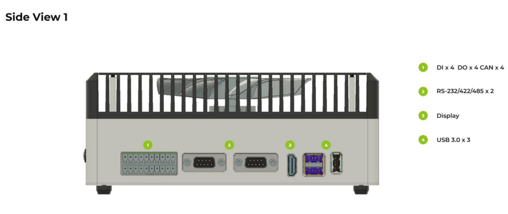
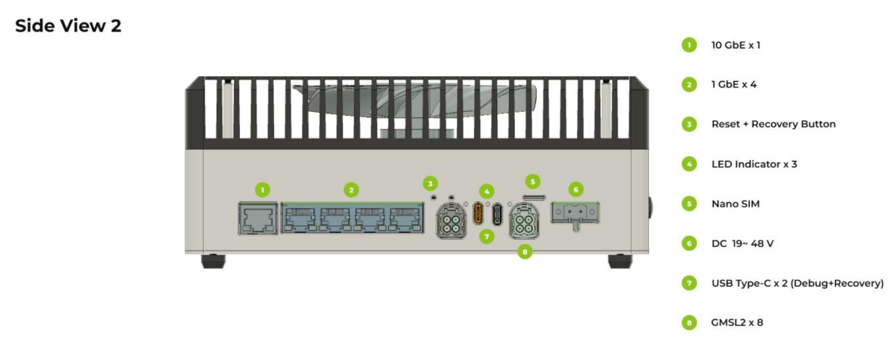
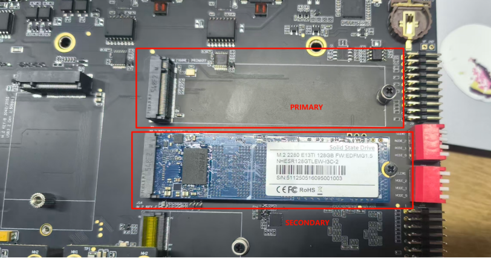
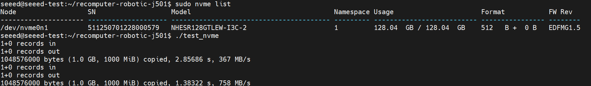
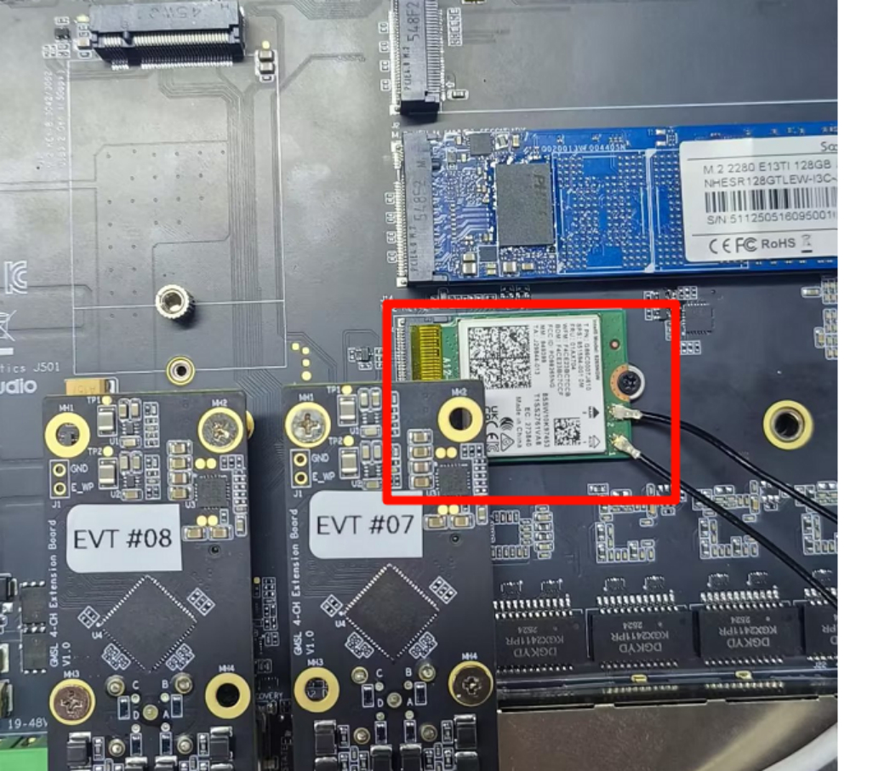

# M1 平台入门与开发环境

> **实机环境**：reComputer Robotics J501（AGX Orin 32GB），L4T 36.4.4 / JetPack 6.2.1
>
> **Host PC** ：Ubuntu 22.04.5 LTS，x86\_64

***

# 1.1 J501 硬件平台解析与接口概览

**课程目标**：理解 J501 作为机器人主控的硬件架构，掌握关键接口的选型与接线。

**硬件清单**：reComputer Robotics J501（AGX Orin 32GB/64GB）、XT30 电源线、散热风扇套件、调试串口线、网线。

***

## 1.1.1 产品总览

reComputer Robotics J501X 是面向高级机器人和工业应用的高性能边缘 AI 载板。它兼容 NVIDIA Jetson AGX Orin 模块（32GB/64GB），分别对应产品 [reComputer Robotics J5011](https://www.seeedstudio.com/reComputer-Robotics-J5011-with-GMSL-extension-board-p-6681.html) 与 [reComputer Robotics J5012](https://www.seeedstudio.com/reComputer-Robotics-J5012-with-GMSL-extension-board-p-6682.html)，在 MAXN 模式下可提供高达 **275 TOPS** 的 AI 性能。


该载板具备丰富的连接能力——包括 1 路 10GbE 和 4 路 1GbE 以太网接口、用于 NVMe SSD 的双 M.2 Key M 插槽、用于 5G 和 Wi-Fi/BT 模块的 M.2 插槽、多路 USB 3.0 接口、四路 CAN 接口（2 路原生 + 2 路 SPI 转 CAN）、GMSL2 摄像头扩展，以及包含 DI/DO、I2S、UART 和 RS485 在内的完整 I/O——可作为复杂多传感器融合和实时 AI 处理的强大机器人"大脑"。

预装 **JetPack 6.2.1** 和 Linux BSP，可实现无缝部署。支持 NVIDIA Isaac ROS、Hugging Face、PyTorch 和 ROS 2/1 等框架。J501 结合大语言模型驱动的决策与物理机器人控制，通过开箱即用的接口与优化的 AI 框架，加速自主机器人开发。

***

## 1.1.2 关键特性

| 特性            | 说明                                                                                     |
| ------------- | -------------------------------------------------------------------------------------- |
| **高性能 AI**    | 搭载 Jetson AGX Orin 32/64GB 模块，Ampere GPU 和 DLA 引擎，最高 275 TOPS                          |
| **丰富连接性**     | 双 M.2 Key M（NVMe）；Key E（WiFi/BT）+ Key B（5G）；1 路 10GbE + 4 路 1GbE；3 路 USB 3.0；2 路 USB-C |
| **四路 CAN-FD** | 2 路原生 + 2 路 SPI 转 CAN 接口，具备电气隔离                                                        |
| **GMSL2 视觉**  | 单路 GMSL2 接口（1 路），用于高速摄像头连接                                                             |
| **工业级设计**     | 19–48V 直流输入；-10\~60°C 工作温度；隔离接口；预装 JetPack 6.2.1                                       |
| **面向机器人应用**   | 支持 ROS 2/1、Isaac ROS；DI/DO、I2S、UART、RS485；针对 AMR 和自动化场景优化                              |

***

## 1.1.3 规格参数

### (1) Jetson AGX Orin 系统模块

| 规格      | J5011 (32GB)                                                               | J5012 (64GB)                                                   |
| ------- | -------------------------------------------------------------------------- | -------------------------------------------------------------- |
| 模块      | NVIDIA Jetson AGX Orin 32GB                                                | NVIDIA Jetson AGX Orin 64GB                                    |
| AI 性能   | 200 TOPS                                                                   | 275 TOPS                                                       |
| GPU     | 1792 核 Ampere @ 930 MHz                                                    | 2048 核 Ampere @ 1.3 GHz                                        |
| CPU     | 8 核 Cortex-A78AE @ 2.0 GHz                                                 | 12 核 Cortex-A78AE @ 2.2 GHz                                    |
| 内存      | 32GB 256-bit LPDDR5 @ 204.8 GB/s                                           | 64GB 256-bit LPDDR5 @ 204.8 GB/s                               |
| 视频编码    | 1× 4K60 / 3× 4K30 / 6× 1080p60 / 12× 1080p30（H.265）                        | 2× 4K60 / 6× 4K30 / 8× 1080p60 / 16× 1080p30（H.265）            |
| 视频解码    | 1× 8K30 / 2× 4K60 / 4× 4K30 / 9× 1080p60 / 18× 1080p30（H.265）              | 1× 8K30 / 3× 4K60 / 7× 4K30 / 11× 1080p60 / 22× 1080p30（H.265） |
| CSI 摄像头 | 最多 6 路（虚拟通道 16 路），16 条 MIPI CSI-2 通道，D-PHY 2.1（40Gbps）/ C-PHY 2.0（164Gbps）（注：为模组级能力，Robotics J501 载板未引出 CSI 接口，相机经 GMSL2 接入，见 M2.1） | 同左                                                             |
| 尺寸      | 100mm × 87mm，699 针 Molex Mirror Mezz，集成导热板                                 | 同左                                                             |

### (2) J501 载板接口

| 接口类型      | 规格                                                           |
| --------- | ------------------------------------------------------------ |
| 存储        | 2× M.2 Key-M（NVMe 2280）+ 1× M.2 Key-B（4G/5G）                 |
| 网络        | 1× M.2 Key-E（WiFi/BT）+ 1× RJ45 10GbE + 4× RJ45 1GbE          |
| USB       | 3× USB 3.0 Type-A + 1× USB-C 3.0（Recovery）+ 1× USB-C 2.0（调试） |
| DI/DO/CAN | 4× DI @12V + 4× DO @40V + 4× CAN-FD（电气隔离）                    |
| GMSL      | 2× Mini-Fakra（最多 8 路 GMSL2，可选）                               |
| 串口        | 2× DB9（RS232/422/485）                                        |
| 显示        | 1× HDMI 2.1                                                  |
| 风扇        | 1× 12V（2.54mm）+ 1× 5V（1.25mm JST）                            |
| 按键        | 1× Recovery + 1× Reset                                       |
| LED       | 3× LED（PWR、SSD、用户 LED）                                       |
| RTC       | 1× CR1220 电池座 + 1× RTC 2 针排针                                 |
| 电源        | 19–48V DC（5.08mm 端子排，不含电源适配器）                                |
| 功耗        | 模块最高 60W（MAXN）；整机峰值 75W（含外设）                                 |
| 机械特性      | 尺寸 210×180×87mm（含支架）；重量 200g；桌面/壁挂/导轨安装（导轨支架含在配件中）           |
| 工作温度      | -10\~60°C（25W）/ -10\~55°C（MAXN）                              |
| 软件        | JetPack 6.2.1                                                |
| 质保/认证     | 2 年 / RoHS, REACH, CE, FCC, UKCA, KC                         |

### (3) GMSL 扩展板规格（可选）

| 项目      | 规格                   |
| ------- | -------------------- |
| 解串器     | MAX96712             |
| GMSL 接口 | 2× Robotics-Fakra 公头 |
| GMSL 输入 | 最多 8× GMSL2 摄像头      |
| POC     | 支持电源与数据同时传输          |

***

## 1.1.4 硬件总览

下图展示了 J501 实物总览（本节以 reComputer Robotics J5011 为例，J5012 类似），请对照实物逐一识别。






> **学习提示**：对照以上图片和实物，找到以下关键接口：电源端子、USB-C 调试口、USB-C Recovery 口、HDMI、网口（10G + 4×1G）、CAN 端子排、DB9 串口、M.2 插槽。

***

## 1.1.5 接口实践验证

本节通过实际命令逐一验证 J501 上的各类接口。所有命令的**实际输出**均来自真实 J501 设备，可供参考。

### (1) 连接方式说明

在开始验证之前，需要先建立与 J501 的通信连接。多数命令在不同连接方式下通用，本章会标注示例代码的执行主机，复现时可按自己的习惯参考。以下介绍三种常用方式。

**方式一：HDMI + USB 键鼠（最直接）**

将显示器通过 HDMI 线连接到 J501 的 HDMI 接口，USB 键盘/鼠标连接到 USB 接口。开机后直接在 J501 桌面环境中打开终端操作。适合首次开机配置或需要图形界面的场景。

**方式二：SSH 远程连接（本章常用）**

通过网线将 J501 连接到 Host PC（也可插网卡配置局域网等方式），在 Host PC 上配置网络共享使 J501 获得 IP 地址（依据自己设备网段配置），然后通过 SSH 远程登录。接线配置步骤如下，供参考：

1. **网络共享**：在 Host PC 上通过 NetworkManager 将连接 J501 的网口设置为"共享"模式，J501 通过 DHCP 获得 IP `192.168.55.25`

```bash
# [Host PC 终端] 查看网络连接名称
nmcli connection show
# 找到连接 J501 的有线连接名称，例如 "有线连接 1"

# [Host PC 终端] 设置为共享模式
nmcli connection modify "有线连接 1" connection.autoconnect yes ipv4.method shared
nmcli connection up "有线连接 1"

# 验证：J501 应获得 192.168.x.x 网段 IP
ping 192.168.55.25
```

1. **生成密钥**：在 Host PC 上执行 `ssh-keygen -t ed25519` 生成 ED25519 密钥对

```bash
# [Host PC 终端] 生成密钥对（一路回车即可）
ssh-keygen -t ed25519 -C "seeed@hostpc"
```

1. **复制公钥**：执行 `ssh-copy-id seeed@192.168.55.25` 将公钥推送到 J501

```bash
# [Host PC 终端] 首次需要输入 J501 的 seeed 用户密码（默认: seeed）
ssh-copy-id seeed@192.168.55.25
```

1. **配置 SSH config**：编辑 `~/.ssh/config`，添加以下内容：

```bash
# [Host PC 终端] 写入 SSH 配置
cat >> ~/.ssh/config << 'EOF'
Host J501
    HostName 192.168.55.25
    User seeed
    IdentityFile ~/.ssh/id_ed25519
    StrictHostKeyChecking no
EOF
```

1. **验证免密登录**：

```bash
# [Host PC 终端] 直接 ssh J501 即可免密登录
ssh J501
# 成功后终端提示符变为 seeed@seeed-desktop:~$
```

> **提示**：如果你是刚刷完机的 J501（参见 1.2 节），可以先通过 HDMI 或调试串口连接，完成网络配置后再使用 SSH。

**方式三：调试串口**

通过 USB-C 调试线连接 J501 的 USB-C 2.0 调试口，在 Host PC 上使用串口工具连接：

```bash
# [Host PC 终端] 使用 picocom 连接调试串口
picocom -b 115200 /dev/ttyUSB0
```

> 本课程后续所有命令前会标注执行位置：`[Host PC → J501 SSH]` 表示在 Host PC 上通过 SSH 远程执行，`[J501 本机终端]` 表示需要在 J501 显示器或串口终端上直接执行。

### (2) USB 设备检查

```bash
# [Host PC → J501 SSH]
ssh J501 'lsusb'
```

**实际输出：**

```
Bus 002 Device 002: ID 0424:5744 Microchip Technology, Inc. (formerly SMSC) Hub
Bus 002 Device 001: ID 1d6b:0003 Linux Foundation 3.0 root hub
Bus 001 Device 004: ID 0424:2740 Microchip Technology, Inc. (formerly SMSC) Hub Controller
Bus 001 Device 014: ID 320f:5088 VXE VXE V87 2.4G Dongle
Bus 001 Device 013: ID 093a:2510 Pixart Imaging, Inc. Optical Mouse
Bus 001 Device 002: ID 0424:2744 Microchip Technology, Inc. (formerly SMSC) Hub
Bus 001 Device 001: ID 1d6b:0002 Linux Foundation 2.0 root hub
```

**解读：**

- **Bus 001/002**：USB 2.0（480Mbps）和 USB 3.0（5Gbps）两个总线
- **0424:5744/2744**：Microchip/SMSC USB Hub 控制器（载板自带）
- **320f:5088**：VXE V87 键盘 2.4G Dongle
- **093a:2510**：Pixart 光电鼠标

### (3) 网络接口检查

```bash
# [Host PC → J501 SSH]
ssh J501 'ip link show'
```

**实际输出：**

```
1: lo: <LOOPBACK,UP,LOWER_UP> mtu 65536 qdisc noqueue state UNKNOWN mode DEFAULT group default qlen 1000
    link/loopback 00:00:00:00:00:00 brd 00:00:00:00:00:00
2: enp3s0: <NO-CARRIER,BROADCAST,MULTICAST,UP> mtu 1500 qdisc pfifo_fast state DOWN mode DEFAULT group default qlen 1000
    link/ether 2c:f7:f1:23:1d:93 brd ff:ff:ff:ff:ff:ff
3: enp4s0: <NO-CARRIER,BROADCAST,MULTICAST,UP> mtu 1500 qdisc pfifo_fast state DOWN mode DEFAULT group default qlen 1000
    link/ether 2c:f7:f1:23:1d:92 brd ff:ff:ff:ff:ff:ff
4: enp5s0: <NO-CARRIER,BROADCAST,MULTICAST,UP> mtu 1500 qdisc pfifo_fast state DOWN mode DEFAULT group default qlen 1000
    link/ether 2c:f7:f1:23:1d:91 brd ff:ff:ff:ff:ff:ff
5: can0: <NOARP,ECHO> mtu 16 qdisc noop state DOWN mode DEFAULT group default qlen 10
    link/can
6: can1: <NOARP,ECHO> mtu 16 qdisc noop state DOWN mode DEFAULT group default qlen 10
    link/can
7: eno1: <NO-CARRIER,BROADCAST,MULTICAST,UP> mtu 1500 qdisc mq state DOWN mode DEFAULT group default qlen 1000
    link/ether 4c:bb:47:4b:72:7c brd ff:ff:ff:ff:ff:ff
8: eth1: <BROADCAST,MULTICAST,UP,LOWER_UP> mtu 1500 qdisc mq state UP mode DEFAULT group default qlen 1000
    link/ether 4c:bb:47:4b:72:7d brd ff:ff:ff:ff:ff:ff
9: can2: <NOARP,ECHO> mtu 16 qdisc noop state DOWN mode DEFAULT group default qlen 10
    link/can
10: can3: <NOARP,ECHO> mtu 16 qdisc noop state DOWN mode DEFAULT group default qlen 10
    link/can
13: l4tbr0: <NO-CARRIER,BROADCAST,MULTICAST,UP> mtu 1500 qdisc noqueue state DOWN mode DEFAULT group default qlen 1000
    link/ether 3e:c7:e7:79:f3:87 brd ff:ff:ff:ff:ff:ff
14: usb0: <NO-CARRIER,BROADCAST,MULTICAST,UP> mtu 1500 qdisc pfifo_fast master l4tbr0 state DOWN mode DEFAULT group default qlen 1000
15: usb1: <NO-CARRIER,BROADCAST,MULTICAST,UP> mtu 1500 qdisc pfifo_fast master l4tbr0 state DOWN mode DEFAULT group default qlen 1000
```

**IP 地址：**

```bash
# [Host PC → J501 SSH]
ssh J501 'ip addr show | grep -E "^[0-9]|inet "'
```

**实际输出：**

```
1: lo: <LOOPBACK,UP,LOWER_UP> ...    inet 127.0.0.1/8 scope host lo
8: eth1: <BROADCAST,MULTICAST,UP,LOWER_UP> ...    inet 192.168.55.25/24 brd 192.168.55.255 scope global dynamic noprefixroute eth1
```

**接口对照表：**

| 接口         | 类型     | 状态     | IP            | 说明            |
| ---------- | ------ | ------ | ------------- | ------------- |
| enp3s0     | 千兆以太网  | DOWN   | -             | SMSC 7430，未接线 |
| enp4s0     | 千兆以太网  | DOWN   | -             | SMSC 7430，未接线 |
| enp5s0     | 千兆以太网  | DOWN   | -             | SMSC 7430，未接线 |
| eno1       | 千兆以太网  | DOWN   | -             | 板载网口          |
| eth1       | 以太网    | **UP** | 192.168.55.25 | Host PC 网络共享  |
| can0\~can3 | CAN-FD | DOWN   | -             | 4 路 CAN（详见下文） |
| l4tbr0     | 网桥     | DOWN   | -             | USB 桥接（已禁用）   |

### (4) PCI 设备检查

```bash
# [Host PC → J501 SSH]
ssh J501 'lspci'
```

**实际输出：**

```
0000:00:00.0 PCI bridge: NVIDIA Corporation Device 229c (rev a1)
0000:01:00.0 PCI bridge: Pericom Semiconductor PI7C9X2G404 EL/SL PCIe2 4-Port/4-Lane Packet Switch (rev 05)
0000:02:01.0 PCI bridge: Pericom Semiconductor PI7C9X2G404 EL/SL PCIe2 4-Port/4-Lane Packet Switch (rev 05)
0000:02:02.0 PCI bridge: Pericom Semiconductor PI7C9X2G404 EL/SL PCIe2 4-Port/4-Lane Packet Switch (rev 05)
0000:02:03.0 PCI bridge: Pericom Semiconductor PI7C9X2G404 EL/SL PCIe2 4-Port/4-Lane Packet Switch (rev 05)
0000:03:00.0 Ethernet controller: Microchip Technology / SMSC Device 7430 (rev 11)
0000:04:00.0 Ethernet controller: Microchip Technology / SMSC Device 7430 (rev 11)
0000:05:00.0 Ethernet controller: Microchip Technology / SMSC Device 7430 (rev 11)
0004:00:00.0 PCI bridge: NVIDIA Corporation Device 229c (rev a1)
0004:01:00.0 Non-Volatile memory controller: Phison Electronics Corporation PS5013 E13 NVMe Controller (rev 01)
```

**解读：**

- **NVIDIA 229c**：Tegra234 SoC PCIe 控制器
- **Pericom PI7C9X2G404**：PCIe 交换芯片，扩展出多个以太网口
- **SMSC 7430**：3 个千兆以太网控制器
- **Phison PS5013 E13**：NVMe SSD 控制器

### (5) CAN 总线检查

```bash
# [Host PC → J501 SSH]
ssh J501 'ip -details link show can0; ip -details link show can2'
```

**实际输出（can0 — 原生 CAN）：**

```
5: can0: <NOARP,ECHO> mtu 16 qdisc noop state DOWN mode DEFAULT group default qlen 10
    link/can  promiscuity 0 minmtu 0 maxmtu 0
    can state STOPPED (berr-counter tx 0 rx 0) restart-ms 0
          mttcan: tseg1 2..255 tseg2 0..127 sjw 1..127 brp 1..511 brp-inc 1
          mttcan: dtseg1 1..31 dtseg2 0..15 dsjw 1..15 dbrp 1..15 dbrp-inc 1
          clock 50000000 numtxqueues 1 numrxqueues 1 ... parentbus platform parentdev c310000.mttcan
```

**实际输出（can2 — SPI 扩展 CAN）：**

```
9: can2: <NOARP,ECHO> mtu 16 qdisc noop state DOWN mode DEFAULT group default qlen 10
    link/can  promiscuity 0 minmtu 0 maxmtu 0
    can state STOPPED (berr-counter tx 0 rx 0) restart-ms 0
          mcp251xfd: tseg1 2..256 tseg2 1..128 sjw 1..128 brp 1..256 brp-inc 1
          mcp251xfd: dtseg1 1..32 dtseg2 1..16 dsjw 1..16 dbrp 1..256 dbrp-inc 1
          clock 40000000 numtxqueues 1 numrxqueues 1 ... parentbus spi parentdev spi0.0
```

| 接口   | 控制器       | 总线           | 时钟    | 特点               |
| ---- | --------- | ------------ | ----- | ---------------- |
| can0 | mttcan    | platform     | 50MHz | SoC 内置，原生 CAN-FD |
| can1 | mttcan    | platform     | 50MHz | SoC 内置，原生 CAN-FD |
| can2 | mcp251xfd | SPI (spi0.0) | 40MHz | 外部芯片，电气隔离        |
| can3 | mcp251xfd | SPI (spi0.1) | 40MHz | 外部芯片，电气隔离        |

> **知识点**：`mttcan` 是 Tegra SoC 内置 CAN 控制器，性能最好；`mcp251xfd` 是 Microchip 独立 CAN-FD 控制器，通过 SPI 连接，适用于需要更多通道或电气隔离的场景。M3.2 课程将详细讲解 CAN-FD 配置。

### (6) I2C / SPI / UART 检查

```bash
# [Host PC → J501 SSH]
ssh J501 'echo "I2C:"; ls /dev/i2c-*; echo "SPI:"; ls /dev/spidev*; echo "UART:"; ls /dev/ttyTHS*'
```

**实际输出：**

```
I2C:
/dev/i2c-0
/dev/i2c-1
/dev/i2c-2
/dev/i2c-3
/dev/i2c-4
/dev/i2c-5
/dev/i2c-6
/dev/i2c-7
/dev/i2c-8
SPI:
/dev/spidev1.0
/dev/spidev1.1
/dev/spidev2.0
/dev/spidev2.1
UART:
/dev/ttyTHS1
/dev/ttyTHS2
/dev/ttyTHS4
```

| 总线   | 数量  | 设备路径                          | 典型用途         |
| ---- | --- | ----------------------------- | ------------ |
| I2C  | 9 路 | /dev/i2c-0 \~ /dev/i2c-8      | 传感器、IMU、驱动器  |
| SPI  | 4 路 | /dev/spidev1.0\~1.1, 2.0\~2.1 | CAN 扩展、显示器   |
| UART | 3 路 | /dev/ttyTHS1, 2, 4            | 调试串口、IMU、GPS |

### (7) NVMe 存储检查

```bash
# [Host PC → J501 SSH]
ssh J501 'lsblk'
```

**实际输出：**

```
NAME         MAJ:MIN RM   SIZE RO TYPE MOUNTPOINTS
nvme0n1      259:0    0 119.2G  0 disk
|-nvme0n1p1  259:1    0 117.8G  0 part /
|-nvme0n1p10 259:10   0    64M  0 part /boot/efi
...
mmcblk0      179:0    0  59.2G  0 disk
zram0-7      252:0-7  0   1.9G  0 disk [SWAP]
```

**解读：** NVMe SSD 119.2GB（Phison PS5013 E13），系统分区 117.8GB 挂载在 `/`。另有 59.2GB eMMC（mmcblk0）和 8×1.9GB zram Swap。

### (8) SSD 读写速度测试

```bash
# [Host PC → J501 SSH]
ssh J501 'dd if=/dev/zero of=/home/seeed/ssd_test bs=100M count=1 conv=fdatasync; rm -f /home/seeed/ssd_test'
```

**实际输出：**

```
1+0 records in
1+0 records out
104857600 bytes (105 MB, 100 MiB) copied, 0.312549 s, 335 MB/s
```

**结果：NVMe SSD 写入速度 335 MB/s**，满足实时数据采集和 AI 模型加载需求。

### (9) 温度与散热

```bash
# [Host PC → J501 SSH]
ssh J501 'cat /sys/class/thermal/thermal_zone*/temp; echo "---"; cat /sys/class/thermal/cooling_device*/cur_state'
```

**实际输出：**

```
39375
35781
37062
38093
37000
39375
---
0
0
0
0
0
0
0
0
0
0
0
0
0
```

**解读：** 6 个温度传感器读数 35.8°C \~ 39.4°C（40W 模式空闲），13 个冷却设备全部为 0（风扇未全速运转）。

### (10) 设备型号与序列号

```bash
# [Host PC → J501 SSH]
ssh J501 'cat /proc/device-tree/model; echo; cat /proc/device-tree/compatible; echo; cat /proc/device-tree/serial-number; echo'
```

**实际输出：**

```
NVIDIA Jetson AGX Orin Developer Kit
nvidia,p3737-0000+p3701-0004nvidia,p3701-0004nvidia,tegra234
1424225004690
```

***

## 1.1.6 M.2 接口扩展

### (1) M.2 Key M（NVMe SSD）



双 M.2 Key M 插槽，支持 PCIe Gen4x4 NVMe SSD。支持的容量：128GB / 256GB / 512GB / 1TB / 2TB。

**SSD 写入测试：**


**查看 SSD 信息（需 sudo）：**



### (2) M.2 Key E（WiFi/BT）



支持 Wi-Fi 6 和 Bluetooth 5.x 模块，兼容模块与天线详见 [Wireless Module List](https://wiki.seeedstudio.com/Wireless_Module_List)。安装前需卸下外壳螺丝：


**WiFi 性能测试：**

```bash
# [J501 本机终端] 需先安装 iperf3
# 服务器端（Host PC）运行: iperf3 -s
# J501 上运行:
iperf3 -c <服务器IP>
```

### (3) M.2 Key B（4G/5G 模块）


支持带 Nano SIM 卡座的 4G/5G 蜂窝模块，兼容 4G 模块详见 [4G Module List](https://wiki.seeedstudio.com/4G_Module_List)。验证流程（仅供参考）：

```bash
# [J501 本机终端] 以下命令需在 J501 上直接执行（部分需 sudo）
# 1. 检查硬件识别
lsusb
# 2. 确认驱动
lsmod | grep option
# 3. 安装 ModemManager
sudo apt install modemmanager && sudo systemctl restart ModemManager
# 4. 验证识别
mmcli -L
# 5. 设置 APN（中国移动示例）
sudo nmcli con add type gsm ifname "*" apn "CMNET" ipv4.method auto
# 6. 激活连接
sudo nmcli con up "gsm"
# 7. 检查状态
mmcli -m 0
```

***

## 1.1.7 接口功能对照表

| 接口             | 设备名                      | 类型         | 用途          | 状态                 | 后续课程 |
| -------------- | ------------------------ | ---------- | ----------- | ------------------ | ---- |
| 千兆网口 1         | enp3s0                   | RJ45       | 激光雷达接入      | DOWN               | M3.1 |
| 千兆网口 2         | enp4s0                   | RJ45       | 备用          | DOWN               | -    |
| 千兆网口 3         | enp5s0                   | RJ45       | 备用          | DOWN               | -    |
| 板载网口           | eno1                     | RJ45       | 备用          | DOWN               | -    |
| 共享网口           | eth1                     | -          | Host PC 连接  | UP (192.168.55.25) | 1.3  |
| CAN-FD 1       | can0                     | 端子排        | 底盘通信        | STOPPED            | M3.2 |
| CAN-FD 2       | can1                     | 端子排        | 云台/扩展       | STOPPED            | M3.2 |
| CAN-FD 3       | can2                     | 端子排(SPI)   | 扩展总线        | STOPPED            | M3.2 |
| CAN-FD 4       | can3                     | 端子排(SPI)   | 扩展总线        | STOPPED            | M3.2 |
| I2C 0-8        | /dev/i2c-\[0-8]          | 4-pin      | 传感器/驱动器     | 可用                 | M3.2 |
| SPI 1-2        | /dev/spidev\[1-2].\[0-1] | 6-pin      | CAN扩展/传感器   | 可用                 | M3.2 |
| UART 1         | /dev/ttyTHS1             | 4-pin      | 调试串口        | 可用                 | 1.2  |
| UART 2         | /dev/ttyTHS2             | 4-pin      | IMU/GPS     | 可用                 | M3.2 |
| UART 3         | /dev/ttyTHS4             | 4-pin      | 扩展串口        | 可用                 | M3.2 |
| USB 3.0        | Bus 001/002              | Type-A     | 相机/外设       | 可用                 | M2.2 |
| USB-C 调试       | -                        | Type-C     | 调试 UART     | 可用                 | 1.2  |
| USB-C Recovery | -                        | Type-C     | 刷机          | 可用                 | 1.2  |
| NVMe SSD       | /dev/nvme0n1             | M.2 M      | 系统存储(119GB) | 已用 39%             | -    |
| HDMI           | -                        | HDMI 2.1   | 显示输出        | 可用                 | -    |
| M.2 Key E      | -                        | M.2        | WiFi/BT     | 未安装                | -    |
| M.2 Key B      | -                        | M.2        | 4G/5G       | 未安装                | -    |
| GMSL2          | -                        | Mini-Fakra | 摄像头扩展       | 未安装                | M2.1 |

***

## 1.1.8 接线拓扑图

Host PC 与 J501 均可通过同一路由器连接互联网（本课程为方便采用直连 Host PC 的方式，详见 1.3.2）。以下拓扑图展示了 J501 在机器人系统中的典型接线方案，涵盖感知、通信、执行三大层面：


> 各接口对应的设备名和后续课程参见 1.1.7 接口功能对照表。

***
