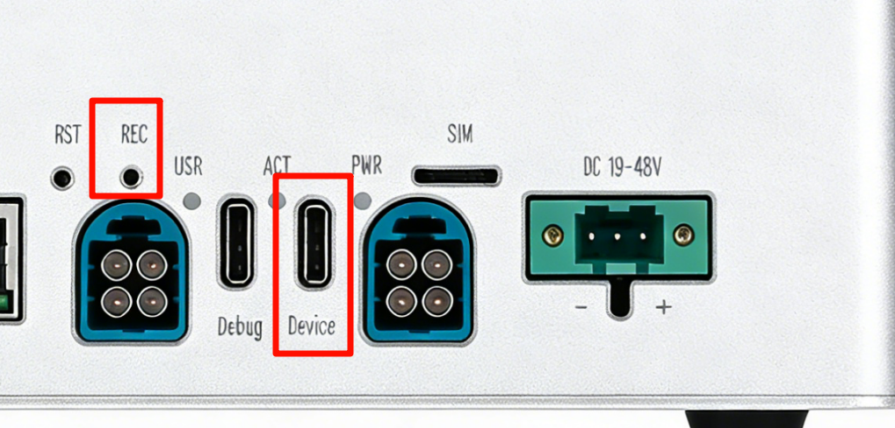
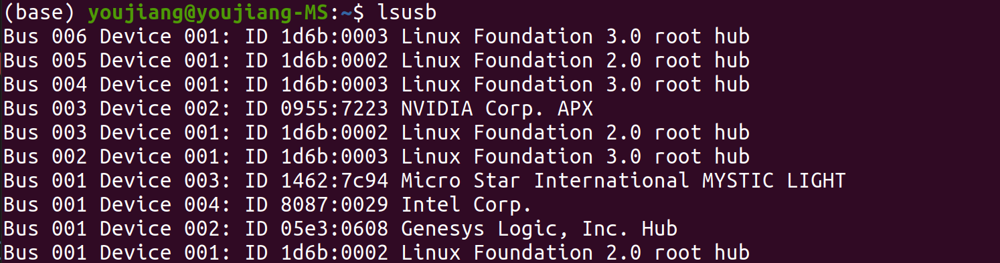
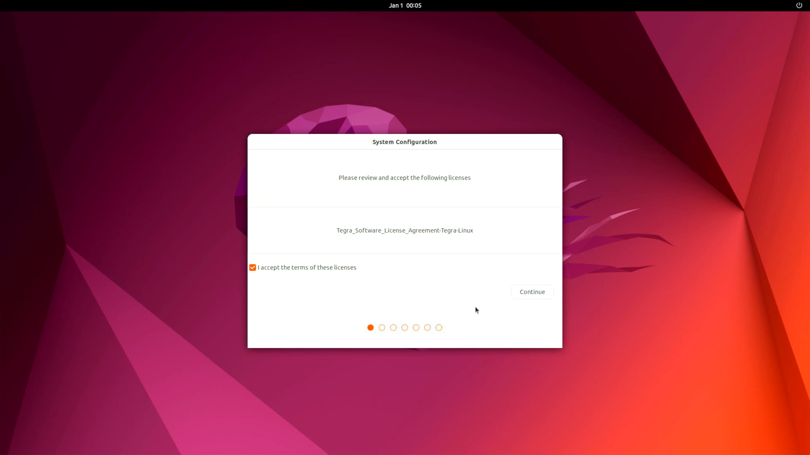

# M1 平台入门与开发环境

> **实机环境**：reComputer Robotics J501（AGX Orin 32GB），L4T 36.4.4 / JetPack 6.2.1
>
> **Host PC** ：Ubuntu 22.04.5 LTS，x86\_64

***

# 1.2 JetPack 6.2 系统刷机与基础配置

**课程目标**：完成 J501 的系统初始化，建立稳定的开发基线。

**硬件清单**：J501、USB-C 数据线、Ubuntu Host PC。

**参考**：[Seeed Wiki — Robotics J501 硬件与快速上手](https://wiki.seeedstudio.com/cn/ai_robotics_recomputer_j501_robotics_getting_started/) 

***

## 1.2.1 JetPack 6.2 组件概览

| 组件        | 版本        | 说明               |
| --------- | --------- | ---------------- |
| L4T       | 36.4.4    | Linux BSP（内核+驱动） |
| CUDA      | 12.6.11   | GPU 并行计算框架       |
| cuDNN     | 9.3.0.75  | 深度学习加速库          |
| TensorRT  | 10.3.0.30 | 高性能推理优化器         |
| VPI       | 3.2.4     | 视觉编程接口           |
| Vulkan    | 1.3.204   | 图形/计算 API        |
| OpenCV    | 4.8.0     | 计算机视觉库（无 CUDA）   |
| PyTorch   | 2.11.0    | 深度学习框架（conda 环境） |
| FFmpeg    | 4.4.2     | 多媒体处理（含硬件解码）     |
| GStreamer | 1.20.3    | 多媒体管线框架          |

> **实机状态**：出厂已预装 JetPack 6.2.1，无需重新刷机。如需重刷，参考下文 1.2.2 节。

***

## 1.2.2 刷写 JetPack 操作系统

> 如 J501 已预装系统，可跳至 1.2.3 节"系统验证"。

### (1) 前置准备

- Ubuntu 22.04 主机电脑（非虚拟机）
- USB Type-C 数据传输线

### (2) 下载镜像

| JetPack | 模块            | GMSL | 下载链接                                                                                                                                                   | SHA256      |
| ------- | ------------- | ---- | ------------------------------------------------------------------------------------------------------------------------------------------------------ | ----------- |
| 6.2.1   | AGX Orin 64GB | ✅    | [下载](https://seeedstudio88-my.sharepoint.com/:u:/g/personal/youjiang_yu_seeedstudio88_onmicrosoft_com/IQCiNRM83_Q1Qq2lodZbxxz7AQb046lJeZh4aTUo20T6ks4) | B858312B... |
| 6.2.1   | AGX Orin 32GB | ✅    | [下载](https://seeedstudio88-my.sharepoint.com/:u:/g/personal/youjiang_yu_seeedstudio88_onmicrosoft_com/IQAWnjh2iWzeRI1rKN5Bb_HxAX3P3GxPMHSb-60VmCPCgx4) | e868fd8c... |

> 镜像较大，考虑下载时网络与其他因素，请在下载完成后使用 `sha256sum <文件名>` 验证完整性。

### (3) 进入强制恢复模式

**步骤 1.** 用 USB-C 线连接 J501 的 **USB2.0 DEVICE 接口**和 Ubuntu 主机。



**步骤 2.** 用针按住 RECOVERY 按键不放。

**步骤 3.** 接通电源。

**步骤 4.** 松开 RECOVERY 按键。

**步骤 5.** 在主机上运行 `lsusb`，出现以下输出说明进入恢复模式：

- AGX Orin 32GB：`0955:7223 NVidia Corp`
- AGX Orin 64GB：`0955:7023 NVidia Corp`



### (4) 刷写系统

```bash
# [Host PC 终端] 以下命令在 Ubuntu 主机上执行
# 解压镜像
cd <path-to-image>
sudo tar xpf mfi_recomputer-robo-agx-orin-32g-j501-6.2.1-36.4.4-2025-11-04.tar.gz

# 执行刷写
cd mfi_recomputer-robo-agx-orin-j501x
sudo ./tools/kernel_flash/l4t_initrd_flash.sh --flash-only --massflash 1 --network usb0 --showlogs
```

刷写成功输出：


> 刷写命令约运行 2-10 分钟。

**初始配置：** 用 HDMI 线连接 J501 到显示器，完成系统配置：



> 刷机完成后，你可以通过 HDMI + 键鼠、SSH 或调试串口等方式连接 J501 验证系统（参见 1.1.5 (1) 连接方式说明）。

***

## 1.2.3 系统验证

以下命令通过 SSH 在 J501 上执行，输出为实际验证结果。你也可以在 J501 本机终端上执行相同命令。

### (1) L4T 版本

```bash
# [Host PC → J501 SSH]
ssh J501 'cat /etc/nv_tegra_release'
```

**实际输出：**

```
# R36 (release), REVISION: 4.4, GCID: 41062509, BOARD: generic, EABI: aarch64, DATE: Mon Jun 16 16:07:13 UTC 2025
# KERNEL_VARIANT: oot
TARGET_USERSPACE_LIB_DIR=nvidia
TARGET_USERSPACE_LIB_DIR_PATH=usr/lib/aarch64-linux-gnu/nvidia
# Seeed Image Name mfi_recomputer-robo-agx-orin-32g-j501-6.2.1-36.4.4-2025-11-04.tar.gz
# branch R36.4.4
# commit ID 36a8a761b8a88785372afc7bd6d4e70643b76677
```

### (2) 操作系统

```bash
# [Host PC → J501 SSH]
ssh J501 'cat /etc/os-release'
```

**实际输出：**

```
PRETTY_NAME="Ubuntu 22.04.5 LTS"
NAME="Ubuntu"
VERSION_ID="22.04"
VERSION="22.04.5 LTS (Jammy Jellyfish)"
VERSION_CODENAME=jammy
ID=ubuntu
ID_LIKE=debian
UBUNTU_CODENAME=jammy
```

### (3) 内核版本

```bash
# [Host PC → J501 SSH]
ssh J501 'uname -a'
```

**实际输出：**

```
Linux seeed-desktop 5.15.148-tegra #1 SMP PREEMPT Tue Nov 4 08:05:33 UTC 2025 aarch64 aarch64 aarch64 GNU/Linux
```

**解读：** Tegra 专用内核 5.15.148，支持 SMP（对称多处理）和 PREEMPT（抢占调度），aarch64 架构。

### (4) CPU 信息

```bash
# [Host PC → J501 SSH]
ssh J501 'lscpu | head -20'
```

**实际输出：**

```
Architecture:                       aarch64
CPU op-mode(s):                     32-bit, 64-bit
Byte Order:                         Little Endian
CPU(s):                             8
On-line CPU(s) list:                0-7
Vendor ID:                          ARM
Model name:                         Cortex-A78AE
Model:                              1
Thread(s) per core:                 1
Core(s) per cluster:                4
Socket(s):                          -
Cluster(s):                         2
Stepping:                           r0p1
CPU max MHz:                        2188.8000
CPU min MHz:                        115.2000
BogoMIPS:                           62.50
Flags:                              fp asimd evtstrm aes pmull sha1 sha2 crc32 atomics fphp asimdhp ...
L1d cache:                          512 KiB (8 instances)
L1i cache:                          512 KiB (8 instances)
L2 cache:                           2 MiB (8 instances)
```

**解读：** 8 核 Cortex-A78AE（2 集群 × 4 核），最大 2.2GHz，支持 AES/SHA 硬件加速。

### (5) 内存与存储

```bash
# [Host PC → J501 SSH]
ssh J501 'free -h; echo "---"; df -h'
```

**实际输出：**

```
               total        used        free      shared  buff/cache   available
Mem:            29Gi       3.1Gi        23Gi        82Mi       3.8Gi        26Gi
Swap:           14Gi          0B        14Gi
---
Filesystem       Size  Used Avail Use% Mounted on
/dev/nvme0n1p1   116G   43G   68G  39% /
tmpfs             15G  172K   15G   1% /dev/shm
tmpfs            6.0G   28M  6.0G   1% /run
/dev/nvme0n1p10   63M  110K   63M   1% /boot/efi
tmpfs            3.0G  144K  3.0G   1% /run/user/1000
```

**解读：** 32GB LPDDR5 内存（系统可见 29Gi），NVMe SSD 116GB（已用 39%），Swap 14GB（zram）。

### (6) GPU 状态

```bash
# [Host PC → J501 SSH]
ssh J501 'nvidia-smi'
```

**实际输出：**

```
Tue Jul 28 13:48:48 2026
+---------------------------------------------------------------------------------------+
| NVIDIA-SMI 540.4.0                Driver Version: 540.4.0      CUDA Version: 12.6     |
|-----------------------------------------+----------------------+----------------------+
| GPU  Name                 Persistence-M | Bus-Id        Disp.A | Volatile Uncorr. ECC |
| Fan  Temp   Perf          Pwr:Usage/Cap |         Memory-Usage | GPU-Util  Compute M. |
|=========================================+======================+======================|
|   0  Orin (nvgpu)                  N/A  | N/A              N/A |                  N/A |
| N/A   N/A  N/A               N/A /  N/A | Not Supported        |     N/A          N/A |
+-----------------------------------------+----------------------+----------------------+

+---------------------------------------------------------------------------------------+
| Processes:                                                                            |
|  No running processes found                                                           |
+---------------------------------------------------------------------------------------+
```

**解读：** GPU 名称 Orin (nvgpu)，驱动 540.4.0，CUDA 12.6。Jetson 平台 nvidia-smi 不显示温度/功耗/显存（与独立 GPU 不同，Jetson GPU 与 CPU 共享内存）。

***

## 1.2.4 CUDA 验证

### (1) CUDA SDK 版本

```bash
# [Host PC → J501 SSH]
ssh J501 'cat /usr/local/cuda-12.6/version.json | head -10'
```

**实际输出：**

```json
{
   "cuda" : {
      "name" : "CUDA SDK",
      "version" : "12.6.11"
   },
   "cuda_cccl" : {
      "name" : "CUDA C++ Core Compute Libraries",
      "version" : "12.6.37"
   },
   "cuda_compat" : {
      "name" : "CUDA Specific Libraries",
      "version" : "12.6.36890662"
   },
```

### (2) NVCC 编译器

```bash
# [Host PC → J501 SSH]
ssh J501 '/usr/local/cuda/bin/nvcc --version'
```

**实际输出：**

```
nvcc: NVIDIA (R) Cuda compiler driver
Copyright (c) 2005-2024 NVIDIA Corporation
Built on Wed_Aug_14_10:14:07_PDT_2024
Cuda compilation tools, release 12.6, V12.6.68
Build cuda_12.6.r12.6/compiler.34714021_0
```

**解读：** CUDA SDK 12.6.11，NVCC 编译器 12.6.68，编译日期 2024-08-14。

> **提示**：`nvcc` 默认不在 PATH 中。添加到 `~/.bashrc`：`export PATH=/usr/local/cuda/bin:$PATH`

***

## 1.2.5 cuDNN 验证

### (1) 包版本

```bash
# [Host PC → J501 SSH]
ssh J501 'dpkg -l | grep -i cudnn'
```

**实际输出：**

```
ii  libcudnn9-cuda-12     9.3.0.75-1   arm64   cuDNN runtime libraries for CUDA 12.6
ii  libcudnn9-dev-cuda-12 9.3.0.75-1   arm64   cuDNN development headers for CUDA 12.6
ii  libcudnn9-samples     9.3.0.75-1   all     cuDNN samples
ii  nvidia-cudnn          6.2.1+b38    arm64   NVIDIA CUDNN Meta Package
ii  nvidia-cudnn-dev      6.2.1+b38    arm64   NVIDIA CUDNN dev Meta Package
```

### (2) 头文件版本

```bash
# [Host PC → J501 SSH]
ssh J501 'cat /usr/include/cudnn_version.h | grep CUDNN_MAJOR -A2'
```

**实际输出：**

```c
#define CUDNN_MAJOR 9
#define CUDNN_MINOR 3
#define CUDNN_PATCHLEVEL 0
```

**解读：** cuDNN 版本 9.3.0

***

## 1.2.6 TensorRT 验证

### (1) 包版本

```bash
# [Host PC → J501 SSH]
ssh J501 'dpkg -l | grep -i "tensorrt\|libnvinfer" | head -10'
```

**实际输出：**

```
ii  libnvinfer-bin          10.3.0.30-1+cuda12.5  arm64  TensorRT binaries
ii  libnvinfer-dev          10.3.0.30-1+cuda12.5  arm64  TensorRT development libraries
ii  libnvinfer-dispatch10   10.3.0.30-1+cuda12.5  arm64  TensorRT dispatch runtime
ii  libnvinfer-headers-dev  10.3.0.30-1+cuda12.5  arm64  TensorRT development headers
ii  libnvinfer-lean10       10.3.0.30-1+cuda12.5  arm64  TensorRT lean runtime
ii  libnvinfer-plugin10     10.3.0.30-1+cuda12.5  arm64  TensorRT plugin libraries
```

### (2) Python 绑定

```bash
# [Host PC → J501 SSH]
ssh J501 'python3 -c "import tensorrt; print(tensorrt.__version__)"'
```

**实际输出：**

```
10.3.0
```

### (3) trtexec 工具位置

```bash
# [Host PC → J501 SSH]
ssh J501 'ls /usr/src/tensorrt/bin/trtexec'
```

**实际输出：**

```
/usr/src/tensorrt/bin/trtexec
```

> **提示**：`trtexec` 不在默认 PATH。使用时指定完整路径，或添加 `export PATH=/usr/src/tensorrt/bin:$PATH`。

***

## 1.2.7 其他关键库验证

### (1) VPI

```bash
# [Host PC → J501 SSH]
ssh J501 'dpkg -l | grep -i vpi | head -5'
```

**实际输出：**

```
ii  libnvvpi3           3.2.4       arm64  NVIDIA Vision Programming Interface library
ii  nvidia-vpi          6.2.1+b38   arm64  NVIDIA Vpi Meta Package
ii  python3.10-vpi3     3.2.4       arm64  NVIDIA VPI python 3.10 bindings
ii  vpi3-dev            3.2.4       arm64  NVIDIA VPI C/C++ development library
```

### (2) OpenCV

```bash
# [Host PC → J501 SSH]
ssh J501 'python3 -c "import cv2; print(cv2.__version__)"'
```

**实际输出：**

```
4.8.0
```

> **注意**：系统 OpenCV 4.8.0 **不含 CUDA 加速**。如需 CUDA 加速版本，需自行编译或在容器中使用。M4 课程会详细讲解。

### (3) Vulkan

```bash
# [Host PC → J501 SSH]
ssh J501 'dpkg -l | grep -i vulkan | head -5'
```

**实际输出：**

```
ii  libvulkan-dev:arm64        1.3.204.1-2              arm64  Vulkan loader dev files
ii  libvulkan1:arm64           1.3.204.1-2              arm64  Vulkan loader library
ii  nvidia-l4t-vulkan-sc       36.4.4-20250616085344    arm64  NVIDIA Vulkan SC runtime
```

### (4) PyTorch（conda py310 环境）

```bash
# [Host PC → J501 SSH]
ssh J501 '/home/seeed/miniconda3/envs/py310/bin/python -c "import torch; print(torch.__version__); print(torch.cuda.is_available()); print(torch.cuda.get_device_name(0))"'
```

**实际输出：**

```
2.11.0
True
Orin
```

**解读：** PyTorch 2.11.0，CUDA 可用，GPU 设备名 Orin。

***

## 1.2.8 jetson-stats 总览

```bash
# [Host PC → J501 SSH]
ssh J501 'jetson_release'
```

**实际输出：**

```
Software part of jetson-stats 4.3.2 - (c) 2024, Raffaello Bonghi
Jetpack missing!
 - Model: NVIDIA Jetson AGX Orin Developer Kit
 - L4T: 36.4.4
NV Power Mode[3]: MODE_40W
Serial Number: [XXX Show with: jetson_release -s XXX]
Hardware:
 - P-Number: p3701-0004
 - Module: NVIDIA Jetson AGX Orin (32GB ram)
Platform:
 - Distribution: Ubuntu 22.04 Jammy Jellyfish
 - Release: 5.15.148-tegra
jtop:
 - Version: 4.3.2
 - Service: Active
Libraries:
 - CUDA: 12.6.68
 - cuDNN: 9.3.0.75
 - TensorRT: 10.3.0.30
 - VPI: 3.2.4
 - Vulkan: 1.3.204
 - OpenCV: 4.8.0 - with CUDA: NO
```

> **注意**：`Jetpack missing!` 是 jetson-stats 4.3.2 对 JetPack 6.2 的识别兼容性问题，不影响实际使用。

***

## 1.2.9 性能模式配置

### (1) 查看当前模式

```bash
# [Host PC → J501 SSH]
ssh J501 'nvpmodel -q'
```

**实际输出：**

```
NV Power Mode: MODE_40W
3
```

### (2) 切换到 MAXN 模式

MAXN 模式解锁全部算力（\~60W），适合 AI 推理和密集计算：

```bash
# [J501 本机终端] 需要 sudo 权限，建议在 J501 显示器终端或串口终端执行
sudo nvpmodel -m 0
```

### (3) 锁定最高频率

```bash
# [J501 本机终端] 需要 sudo 权限
sudo jetson_clocks
```

将所有 CPU/GPU/EMC 频率锁定到最大值，确保性能稳定不降频。

> **注意**：切换 MAXN 前确保散热风扇已安装。MAXN 下温度可达 55-65°C。通过 SSH 执行 sudo 遇到密码问题时，请在 J501 显示器终端上操作。

### (4) 电源模式对照表

| 模式 | 名称        | 功耗    | 适用场景       |
| -- | --------- | ----- | ---------- |
| 0  | MAXN      | \~60W | AI 推理、密集计算 |
| 1  | MODE\_30W | \~30W | 轻量任务、节能    |
| 2  | MODE\_50W | \~50W | 平衡模式       |
| 3  | MODE\_40W | \~40W | 日常使用（当前）   |

***

## 1.2.10 性能基准测试

### (1) SSD 读写基准

```bash
# [Host PC → J501 SSH]
ssh J501 'dd if=/dev/zero of=/home/seeed/ssd_test bs=100M count=1 conv=fdatasync; rm -f /home/seeed/ssd_test'
```

**实际输出：**

```
1+0 records in
1+0 records out
104857600 bytes (105 MB, 100 MiB) copied, 0.312549 s, 335 MB/s
```

**结果：NVMe SSD 写入速度 335 MB/s**

### (2) TensorRT 推理基准

```bash
# [J501 本机终端] 需要 ONNX 模型文件
/usr/src/tensorrt/bin/trtexec --onnx=<model.onnx> --fp16 --iterations=100 --workspace=4096
```

> M4 课程将使用 YOLO 导出的 ONNX 模型进行完整基准测试。`trtexec` 详细参数使用 `--help` 查看。

***

## 1.2.11 刷机后缺失软件安装

Seeed 出厂镜像已预装 JetPack 核心组件（CUDA/cuDNN/TensorRT/VPI/OpenCV/PyTorch/jetson-stats/can-utils 等），但以下软件**未预装**，后续课程需要用到，此处给出安装命令。

### (1) Docker Engine + NVIDIA Container Toolkit

Docker 和 NVIDIA Container Toolkit 是 1.3 节容器化开发环境的基础，刷机后未安装。

```bash
# [J501 本机终端] 安装 Docker Engine
# 1. 添加 Docker 官方 GPG key
sudo apt-get update
sudo apt-get install -y ca-certificates curl gnupg
sudo install -m 0755 -d /etc/apt/keyrings
curl -fsSL https://download.docker.com/linux/ubuntu/gpg | sudo gpg --dearmor -o /etc/apt/keyrings/docker.gpg
sudo chmod a+r /etc/apt/keyrings/docker.gpg

# 2. 添加 Docker apt 源
echo "deb [arch=arm64 signed-by=/etc/apt/keyrings/docker.gpg] https://download.docker.com/linux/ubuntu $(lsb_release -cs) stable" | sudo tee /etc/apt/sources.list.d/docker.list > /dev/null

# 3. 安装 Docker
sudo apt-get update
sudo apt-get install -y docker-ce docker-ce-cli containerd.io docker-buildx-plugin docker-compose-plugin

# 4. 将当前用户加入 docker 组（免 sudo 运行 docker）
sudo usermod -aG docker $USER
# 需要重新登录或执行 newgrp docker 生效

# 5. 验证
docker --version
# 预期: Docker version 27.x 或更高
```

```bash
# [J501 本机终端] 安装 NVIDIA Container Toolkit（GPU 透传）
# 1. 添加 NVIDIA Container Toolkit 源
curl -fsSL https://nvidia.github.io/libnvidia-container/gpgkey | sudo gpg --dearmor -o /usr/share/keyrings/nvidia-container-toolkit-keyring.gpg
curl -s -L https://nvidia.github.io/libnvidia-container/stable/deb/nvidia-container-toolkit.list | \
  sed 's#deb https://#deb [signed-by=/usr/share/keyrings/nvidia-container-toolkit-keyring.gpg] https://#g' | \
  sudo tee /etc/apt/sources.list.d/nvidia-container-toolkit.list

# 2. 安装
sudo apt-get update
sudo apt-get install -y nvidia-container-toolkit

# 3. 配置 Docker 运行时
sudo nvidia-ctk runtime configure --runtime=docker
sudo systemctl restart docker

# 4. 验证 GPU 透传
docker run --rm --runtime=nvidia --gpus all ubuntu nvidia-smi
# 预期: 显示 Orin GPU 信息
```

### (2) ROS 2 Humble

ROS 2 Humble 是 1.4 节和后续所有机器人模块的基础，刷机后未安装。推荐使用**鱼香肉丝（fishros）一键安装**，自动处理源和依赖，适合快速上手；也给出官方手动安装方式作为备选。

#### 方式一：鱼香肉丝一键安装（推荐）

```bash
# [J501 本机终端] 鱼香肉丝一键安装 ROS 2 Humble
# 1. 运行一键安装脚本
wget http://fishros.com/install -O fishros && . fishros

# 2. 在交互菜单中选择：
#    [1] 一键安装 ROS
#    [2] humble
#    [1] 桌面版（含 rviz、rqt 等工具）
#    [Y] 配置国内镜像源（加速下载）

# 3. 安装完成后，脚本会自动写入环境变量到 ~/.bashrc
#    验证
source ~/.bashrc
ros2 --version 2>/dev/null || ros2 doctor --report | head -5
# 预期: 显示 ROS 2 Humble 环境信息
```

> **说明**：鱼香肉丝脚本会自动完成添加 apt 源、导入 GPG key、安装 ROS 2 Humble 桌面版、配置环境变量等全部步骤，并使用国内镜像源加速。适合初学者快速搭建环境。

#### 方式二：官方手动安装

```bash
# [J501 本机终端] 官方源安装 ROS 2 Humble
# 1. 添加 ROS 2 apt 源
sudo apt update && sudo apt install -y software-properties-common
sudo add-apt-repository universe
sudo apt update && sudo apt install -y curl gnupg lsb-release
sudo curl -sSL https://raw.githubusercontent.com/ros/rosdistro/master/ros.key -o /usr/share/keyrings/ros-archive-keyring.gpg
echo "deb [arch=arm64 signed-by=/usr/share/keyrings/ros-archive-keyring.gpg] http://packages.ros.org/ros2/ubuntu $(. /etc/os-release && echo $VERSION_CODENAME) main" | sudo tee /etc/apt/sources.list.d/ros2.list > /dev/null

# 2. 安装 ROS 2 Humble 桌面完整版（含 rviz、rqt 等工具）
sudo apt update
sudo apt install -y ros-humble-desktop

# 3. 安装开发工具
sudo apt install -y python3-colcon-common-extensions python3-rosdep python3-vcstool
sudo rosdep init
rosdep update

# 4. 配置环境变量（写入 ~/.bashrc）
echo "source /opt/ros/humble/setup.bash" >> ~/.bashrc
source ~/.bashrc

# 5. 验证
ros2 --version 2>/dev/null || ros2 doctor --report | head -5
# 预期: 显示 ROS 2 Humble 环境信息
```

> **注意**：官方源在国内网络可能较慢，如遇超时建议使用方式一（鱼香肉丝）或自行替换为国内镜像源。

### (3) htop（系统监控）

```bash
# [J501 本机终端] 安装 htop
sudo apt install -y htop
# 验证
htop
```

### (4) 软件预装情况速查表

| 软件           | 是否预装      | 版本        | 安装位置                       | 说明                |
| ------------ | --------- | --------- | -------------------------- | ----------------- |
| CUDA         | ✅ 预装      | 12.6.11   | /usr/local/cuda-12.6       | JetPack 组件        |
| cuDNN        | ✅ 预装      | 9.3.0.75  | /usr/lib/aarch64-linux-gnu | JetPack 组件        |
| TensorRT     | ✅ 预装      | 10.3.0.30 | /usr/src/tensorrt          | JetPack 组件        |
| VPI          | ✅ 预装      | 3.2.4     | /usr/lib                   | JetPack 组件        |
| OpenCV       | ✅ 预装      | 4.8.0     | 系统 python3                 | 无 CUDA 加速         |
| PyTorch      | ✅ 预装      | 2.11.0    | conda py310 环境             | Seeed 预装          |
| Miniconda3   | ✅ 预装      | -         | \~/miniconda3              | Seeed 预装          |
| jetson-stats | ✅ 预装      | 4.3.2     | /usr/local/bin             | jtop 服务已运行        |
| FFmpeg       | ✅ 预装      | 4.4.2     | /usr/bin                   | 含硬件解码             |
| GStreamer    | ✅ 预装      | 1.20.3    | /usr/bin                   | -                 |
| can-utils    | ✅ 预装      | 2020.11.0 | /usr/bin                   | candump/cansend 等 |
| cmake        | ✅ 预装      | 3.22.1    | /usr/bin                   | -                 |
| git          | ✅ 预装      | 2.34.1    | /usr/bin                   | -                 |
| iperf3       | ✅ 预装      | -         | /usr/bin                   | 网络测速              |
| nvme CLI     | ✅ 预装      | -         | /usr/sbin                  | NVMe 管理           |
| **Docker**   | ❌ **未预装** | -         | -                          | 见 (1) 安装命令        |
| **ROS 2**    | ❌ **未预装** | -         | -                          | 见 (2) 安装命令        |
| **htop**     | ❌ **未预装** | -         | -                          | 见 (3) 安装命令        |

***

## 1.2.12 系统环境总览表

| 项目       | 值                                    | 验证命令                                  |
| -------- | ------------------------------------ | ------------------------------------- |
| 设备型号     | NVIDIA Jetson AGX Orin Developer Kit | `cat /proc/device-tree/model`         |
| 模组       | AGX Orin 32GB (p3701-0004)           | `jetson_release`                      |
| SoC      | NVIDIA Tegra234                      | `cat /proc/device-tree/compatible`    |
| 序列号      | 1424225004690                        | `cat /proc/device-tree/serial-number` |
| 操作系统     | Ubuntu 22.04.5 LTS                   | `cat /etc/os-release`                 |
| 内核       | 5.15.148-tegra                       | `uname -r`                            |
| L4T      | R36.4.4                              | `cat /etc/nv_tegra_release`           |
| JetPack  | 6.2.1                                | 镜像文件名                                 |
| CPU      | 8 核 Cortex-A78AE @ 2.2GHz            | `lscpu`                               |
| GPU      | Orin (nvgpu), Driver 540.4.0         | `nvidia-smi`                          |
| 内存       | 29GiB (32GB LPDDR5)                  | `free -h`                             |
| 存储       | NVMe 119GB (已用 39%)                  | `df -h`                               |
| CUDA     | 12.6.11 (NVCC 12.6.68)               | `nvcc --version`                      |
| cuDNN    | 9.3.0.75                             | `dpkg -l \| grep cudnn`               |
| TensorRT | 10.3.0.30                            | `python3 -c "import tensorrt"`        |
| VPI      | 3.2.4                                | `dpkg -l \| grep vpi`                 |
| OpenCV   | 4.8.0 (无 CUDA)                       | `python3 -c "import cv2"`             |
| Vulkan   | 1.3.204                              | `dpkg -l \| grep vulkan`              |
| PyTorch  | 2.11.0 (conda py310)                 | `python -c "import torch"`            |
| 电源模式     | MODE\_40W (Mode 3)                   | `nvpmodel -q`                         |
| SSD 写入   | 335 MB/s                             | `dd if=/dev/zero ...`                 |

***

## 1.2.13 常见问题

| 问题                                  | 原因                 | 解决方案                                                       |
| ----------------------------------- | ------------------ | ---------------------------------------------------------- |
| `nvcc` 命令未找到                        | 不在 PATH 中          | `export PATH=/usr/local/cuda/bin:$PATH`                    |
| `trtexec` 命令未找到                     | 不在 PATH 中          | `export PATH=/usr/src/tensorrt/bin:$PATH`                  |
| `nvpmodel -m 0` 需要密码                | SSH 无 sudo 免密      | 在 J501 显示器终端执行，或配置 sudo 免密                                 |
| `jetson_clocks` 报错                  | 非 root 用户          | `sudo jetson_clocks`                                       |
| SSH 连接超时                            | l4tbr0 路由冲突        | `sudo nmcli connection modify l4tbr0 ipv4.method disabled` |
| OpenCV 无 CUDA 支持                    | 系统包不含 CUDA         | 自行编译或使用容器（M4 课程讲解）                                         |
| `jetson_release` 显示 Jetpack missing | jetson-stats 版本兼容性 | 不影响使用，忽略即可                                                 |

***

## 1.1 & 1.2 产出物

完成这两节学习后，你应具备：

1. **接口功能对照表**（1.1.7）— 后续 M2/M3 硬件接入的参考
2. **接线拓扑图**（1.1.8）— 系统集成参考
3. **系统环境总览表**（1.2.12）— 后续模块的验证基线
4. **刷机能力**（1.2.2）— 可独立完成 J501 系统重刷
5. **性能配置能力**（1.2.9）— 可根据场景切换电源模式和锁定频率
6. **软件安装**（1.2.11）— Docker / ROS 2 / htop 等安装

***
