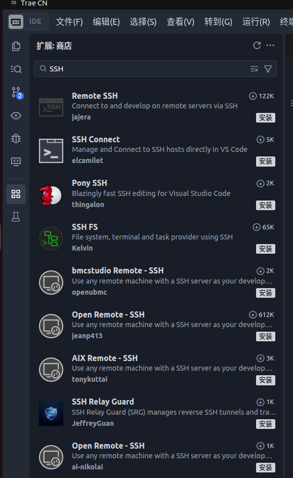
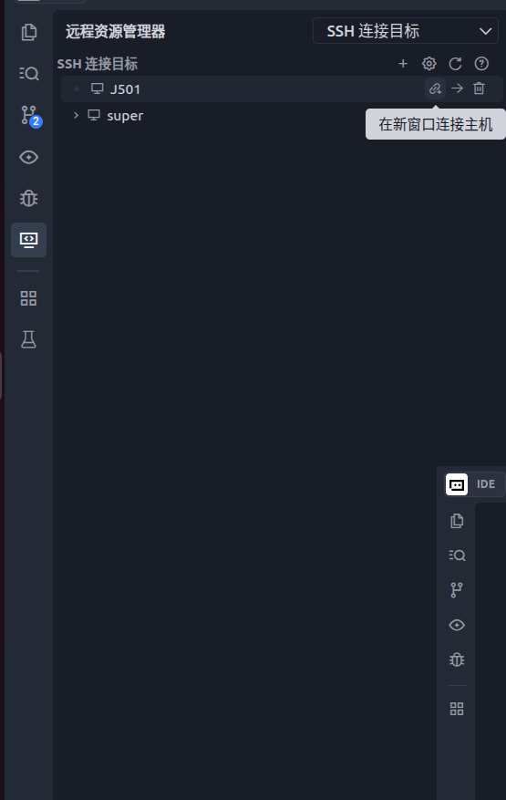
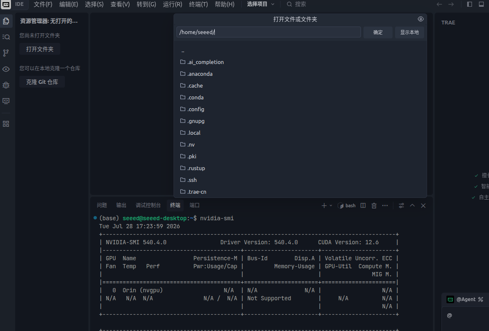
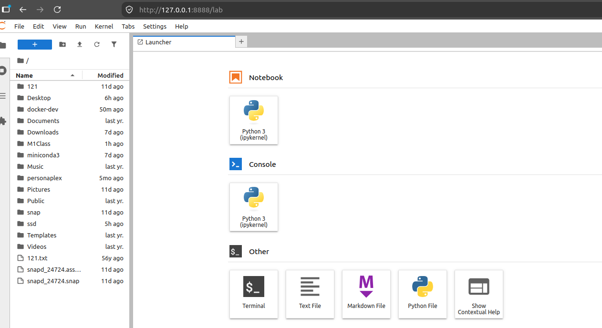

# M1 平台入门与开发环境

> **实机环境**：reComputer Robotics J501（AGX Orin 32GB），L4T 36.4.4 / JetPack 6.2.1
>
> **Host PC** ：Ubuntu 22.04.5 LTS，x86\_64

***

# 1.3 容器化开发环境与远程工具链

> **课程目标**：建立可复现、可迁移的容器化开发环境，支持远程开发与调试。
>
> **硬件清单**：J501、局域网或网线、Host PC。
>
> **前置条件**：已完成  1.2（系统刷机与配置）。

***

## 1.3.1 Jetson Docker 生态概述

Docker 在 Jetson 平台上的核心价值是**环境隔离与可复现**。Jetson 运行的是 aarch64（ARM64）架构，与 x86 PC 上的 Docker 有两个关键区别：

| 特性     | x86 PC Docker                | Jetson Docker                                       |
| ------ | ---------------------------- | --------------------------------------------------- |
| 架构     | amd64                        | arm64（aarch64）                                      |
| GPU 透传 | `--gpus all` + NVIDIA Driver | `--runtime=nvidia` + NVIDIA Container Toolkit       |
| 基础镜像   | `nvidia/cuda`                | `nvcr.io/nvidia/l4t-jetpack`（含 CUDA/cuDNN/TensorRT） |
| 设备节点   | `/dev/nvidia*`               | `/dev/nvidia*` + `/dev/nvhost-*` + `/dev/nvmap`     |

**Jetson Docker 生态关键组件：**

1. **NVIDIA Container Toolkit** — JetPack 6.2 已预装（v1.16.2），负责将宿主 GPU 设备节点透传到容器
2. **l4t-jetpack 基础镜像** — NVIDIA 官方维护，包含与 JetPack 版本匹配的 CUDA/cuDNN/TensorRT/VPI
3. **nv-install-docker.service** — JetPack 自带的一键安装 Docker Engine 的 systemd 服务

***

## 1.3.2 Docker Engine 安装

JetPack 6.2 预装了 NVIDIA Container Toolkit，但**未安装 Docker Engine 本身**。NVIDIA 提供了一个一键安装脚本 `nv-install-docker.sh`，自动完成 Docker CE 安装和 NVIDIA 运行时配置。

### (1) 检查安装前状态

```bash
# [Host PC → J501 SSH] 检查 Docker 和 NVIDIA Container Toolkit 状态
ssh J501 'which docker 2>/dev/null; echo "---"; dpkg -l | grep nvidia-container-toolkit 2>/dev/null; echo "---"; systemctl status nv-install-docker.service 2>&1 | head -5'
```

**实际输出：**

```
---
ii  nvidia-container-toolkit          1.16.2-1                                    arm64        NVIDIA Container toolkit
○ nv-install-docker.service - One-time Docker CE installation service
     Loaded: loaded (/etc/systemd/system/nv-install-docker.service; disabled; vendor preset: enabled)
     Active: inactive (dead)
```

> **解读**：`docker` 命令不存在（未安装），但 `nvidia-container-toolkit` 已预装（v1.16.2），且 `nv-install-docker.service` 处于 inactive 状态等待执行。

### (2) 运行 NVIDIA 一键安装脚本

```bash
# [J501 本机终端] 运行 NVIDIA 官方安装脚本（需要 sudo）
sudo bash /etc/systemd/nv-install-docker.sh
```

脚本自动执行以下操作：

1. 移除冲突包（docker.io、podman-docker 等）
2. 添加 Docker 官方 apt 源和 GPG key
3. 安装 docker-ce、docker-ce-cli、containerd.io、docker-buildx-plugin、docker-compose-plugin
4. 启动并启用 Docker 服务
5. 配置 NVIDIA Container Runtime
6. 禁用自身（一次性服务）

**实际输出（关键部分）：**

```
# ... 移除冲突包、添加源 ...
The following NEW packages will be installed:
  containerd.io docker-buildx-plugin docker-ce docker-ce-cli docker-ce-rootless-extras docker-compose-plugin pigz
0 upgraded, 7 newly installed, 0 to remove and 487 not upgraded.
Need to get 86.2 MB of archives.
# ... 下载安装 ...
Setting up docker-ce (5:29.6.2-1~ubuntu.22.04~jammy) ...
Created symlink /etc/systemd/system/multi-user.target.wants/docker.service
Docker service installed
# ... 配置 NVIDIA 运行时 ...
time="2026-07-28T15:42:47+08:00" level=info msg="Wrote updated config to /etc/docker/daemon.json"
```

### (3) 将用户加入 docker 组

```bash
# [J501 本机终端] 免 sudo 运行 docker
sudo usermod -aG docker $USER
# 需要重新登录或执行 newgrp docker 生效
```

```bash
# [Host PC → J501 SSH] 验证用户已加入 docker 组（需重新 SSH 登录后生效）
ssh J501 'groups'
```

**实际输出：**

```
seeed adm cdrom sudo audio dip video plugdev render i2c lpadmin gdm sambashare docker weston-launch gpio jtop
```

> **确认**：输出中包含 `docker`，说明用户已成功加入 docker 组，可以免 sudo 运行 docker 命令。

### (4) 验证安装

```bash
# [Host PC → J501 SSH] 验证 Docker 版本和服务状态
ssh J501 'docker version; echo "---"; systemctl is-active docker; echo "---"; docker info 2>&1 | grep -E "Runtime|nvidia|Server Version|Storage Driver|Cgroup"'
```

**实际输出：**

```
Client: Docker Engine - Community
 Version:           29.6.2
 API version:       1.55
 Go version:        go1.26.5
 Git commit:        dfc4efb
 Built:             Thu Jul 16 16:13:18 2026
 OS/Arch:           linux/arm64
 Context:           default

Server: Docker Engine - Community
 Engine:
  Version:          29.6.2
  API version:      1.55 (minimum version 1.40)
  Go version:       go1.26.5
  Git commit:       3d80467
  Built:            Thu Jul 16 16:13:18 2026
  OS/Arch:          linux/arm64
 containerd:
  Version:          v2.2.6
 runc:
  Version:          1.3.6
---
active
 Runtimes: runc io.containerd.runc.v2 nvidia
 Default Runtime: runc
 Storage Driver: overlay2
 Cgroup Driver: systemd
```

> **关键确认**：
>
> - `OS/Arch: linux/arm64` — 确认运行在 ARM64 架构上
> - `Runtimes` 行包含 `nvidia` — GPU 透传运行时已就绪
> - `Storage Driver: overlay2` — 使用 overlay2 存储驱动（性能最佳）
> - `Cgroup Driver: systemd` — 与宿主系统一致

***

## 1.3.3 NVIDIA Container Toolkit 配置与验证

### (1) daemon.json 配置

安装脚本自动生成了 `/etc/docker/daemon.json`：

```bash
# [Host PC → J501 SSH] 查看 daemon.json
ssh J501 'cat /etc/docker/daemon.json'
```

**实际输出：**

```json
{
    "runtimes": {
        "nvidia": {
            "args": [],
            "path": "nvidia-container-runtime"
        }
    }
}
```

### (2) 镜像加速配置

国内网络访问 Docker Hub 可能超时，建议添加镜像加速器：

```bash
# [J501 本机终端] 配置镜像加速
sudo tee /etc/docker/daemon.json << 'EOF'
{
    "runtimes": {
        "nvidia": {
            "args": [],
            "path": "nvidia-container-runtime"
        }
    },
    "registry-mirrors": ["https://docker.1ms.run"]
}
EOF
sudo systemctl restart docker
```

### (3) GPU 透传验证

```bash
# [Host PC → J501 SSH] 拉取测试镜像并验证 GPU 透传
ssh J501 'docker pull hello-world && docker run --rm --runtime=nvidia --gpus all hello-world'
```

**实际输出：**

```
Hello from Docker!
This message shows that your installation appears to be working correctly.
...
```

```bash
# [Host PC → J501 SSH] 拉取 Ubuntu 镜像并在容器内运行 nvidia-smi，验证 GPU 完整透传
ssh J501 'docker pull ubuntu:22.04 && docker run --rm --runtime=nvidia --gpus all ubuntu:22.04 nvidia-smi'
```

**实际输出：**

```
Tue Jul 28 08:39:02 2026
+---------------------------------------------------------------------------------------+
| NVIDIA-SMI 540.4.0                Driver Version: 540.4.0      CUDA Version: 12.6     |
|-----------------------------------------+----------------------+----------------------+
| GPU  Name                 Persistence-M | Bus-Id        Disp.A | Volatile Uncorr. ECC |
| Fan  Temp   Perf          Pwr:Usage/Cap |         Memory-Usage | GPU-Util  Compute M. |
|                                         |                      |               MIG M. |
|=========================================+======================+======================|
|   0  Orin (nvgpu)                  N/A  | N/A              N/A |                  N/A |
| N/A   N/A  N/A               N/A /  N/A | Not Supported        |     N/A          N/A |
|                                         |                      |                  N/A |
+---------------------------------------------------------------------------------------+
```

> **关键确认**：容器内 `nvidia-smi` 显示 `Orin (nvgpu)` GPU，`Driver Version: 540.4.0` 和 `CUDA Version: 12.6` 与宿主一致，说明 GPU 透传完全正常。

```bash
# [Host PC → J501 SSH] 查看 Docker 识别到的 GPU 设备（CDI）
ssh J501 'docker info 2>&1 | grep -i "cdi"'
```

**实际输出：**

```
  cdi: nvidia.com/pva=0
  cdi: nvidia.com/pva=all
```

> **说明**：CDI（Container Device Interface）显示了 NVIDIA PVA（Programmable Vision Accelerator）设备。在 Jetson 上，`--gpus all` 会将 GPU、PVA 等 NVIDIA 加速器全部透传到容器。

```bash
# [Host PC → J501 SSH] 查看 Docker 磁盘占用
ssh J501 'docker system df'
```

**实际输出：**

```
TYPE            TOTAL     ACTIVE    SIZE      RECLAIMABLE
Images          2         0         109MB     109MB (99%)
Containers      0         0         0B        0B
Local Volumes   0         0         0B        0B
Build Cache     0         0         0B        0B
```

> **说明**：当前仅有 hello-world 和 ubuntu 两个测试镜像，占用 109MB。后续拉取 l4t-jetpack 镜像后会显著增加。

***

## 1.3.4 l4t-jetpack 基础镜像

NVIDIA 在 NGC（nvcr.io）上提供了与 JetPack 版本匹配的 Docker 基础镜像，包含完整的 CUDA/cuDNN/TensorRT/VPI 栈。

| JetPack 版本 | L4T 版本 | 镜像地址                                                                                                          | 镜像大小    |
| ---------- | ------ | ------------------------------------------------------------------------------------------------------------- | ------- |
| 6.2        | 36.4.0 | [`nvcr.io/nvidia/l4t-jetpack:r36.4.0`](https://catalog.ngc.nvidia.com/orgs/nvidia/teams/l4t/l4t-jetpack/tags) | \~5.5GB |
| 6.1        | 36.4.0 | [`nvcr.io/nvidia/l4t-jetpack:r36.4.0`](https://catalog.ngc.nvidia.com/orgs/nvidia/teams/l4t/l4t-jetpack/tags) | \~5.5GB |
| 6.0        | 36.3.0 | [`nvcr.io/nvidia/l4t-jetpack:r36.3.0`](https://catalog.ngc.nvidia.com/orgs/nvidia/teams/l4t/l4t-jetpack/tags) | \~5.2GB |

> **注意**：JetPack 6.2 和 6.1 共享同一个 L4T 36.4.0 基础镜像。镜像 tag 使用 L4T 版本号（`r36.4.0`），而非 JetPack 版本号。

**l4t-jetpack 镜像预装组件：**

| 组件       | 版本   | 说明                           |
| -------- | ---- | ---------------------------- |
| CUDA     | 12.6 | CUDA Toolkit（nvcc、库）         |
| cuDNN    | 9.3  | 深度学习加速库                      |
| TensorRT | 10.3 | 推理加速引擎（含 trtexec）            |
| VPI      | 3.2  | Vision Programming Interface |
| OpenCV   | 4.8  | 计算机视觉库（无 CUDA）               |
| Python   | 3.10 | 系统 Python                    |

```bash
# [Host PC → J501 SSH] 拉取 l4t-jetpack 基础镜像（约 5.5GB，需要较长时间）
ssh J501 'docker pull nvcr.io/nvidia/l4t-jetpack:r36.4.0'
```

**预期输出（关键部分）：**

```
r36.4.0: Pulling from nvidia/l4t-jetpack
xxxxxxxx: Pulling fs layer
xxxxxxxx: Download complete
xxxxxxxx: Extract complete
Status: Downloaded newer image for nvcr.io/nvidia/l4t-jetpack:r36.4.0
```

> **注意**：该镜像较大（约 5.5GB），下载时间取决于网络速度。nvcr.io 源不受 `registry-mirrors` 镜像加速器影响，建议直接拉取或使用代理。拉取前确认磁盘空间充足（`df -h /`，建议剩余 20GB 以上）。

```bash
# [Host PC → J501 SSH] 拉取完成后验证镜像
ssh J501 'docker images nvcr.io/nvidia/l4t-jetpack'
```

**预期输出：**

```
IMAGE                                ID             DISK USAGE   CONTENT SIZE   EXTRA
nvcr.io/nvidia/l4t-jetpack:r36.4.0   xxxxxxxx       5.5GB       1.8GB
```

```bash
# [Host PC → J501 SSH] 运行容器并验证预装组件版本
ssh J501 'docker run --rm --runtime=nvidia --gpus all nvcr.io/nvidia/l4t-jetpack:r36.4.0 \
    bash -c "cat /usr/local/cuda/version.json | grep version; echo ---; dpkg -l | grep -E \"tensorrt|cudnn|vpi\" | head -5"'
```

**预期输出：**

```
    "version": "12.6"
---
ii  libnvinfer10                10.3.0+...    arm64    TensorRT runtime
ii  libcudnn9-cuda12           9.3.0+...     arm64    cuDNN runtime
ii  libvpi3                    3.2+...       arm64    VPI runtime
```

***

## 1.3.5 构建自定义 Dockerfile

在实际开发中，通常基于 `l4t-jetpack` 镜像添加项目所需的 Python 包、ROS 2 和开发工具。

### (1) 项目目录结构

```bash
# [J501 本机终端] 创建项目目录
mkdir -p ~/docker-dev && cd ~/docker-dev
```

### (2) .dockerignore

在构建镜像前，先创建 `.dockerignore` 文件，避免将不必要的文件打包到构建上下文：

```bash
# ~/docker-dev/.dockerignore
__pycache__/
*.pyc
*.pyo
.git/
.gitignore
*.md
*.log
node_modules/
.venv/
.env
```

### (3) Dockerfile

```dockerfile
# ~/docker-dev/Dockerfile
# 基于 JetPack 6.2 官方镜像
FROM nvcr.io/nvidia/l4t-jetpack:r36.4.0

# 设置时区和语言
ENV DEBIAN_FRONTEND=noninteractive
ENV LANG=C.UTF-8 LC_ALL=C.UTF-8
ENV TZ=Asia/Shanghai

# 安装系统依赖
RUN apt-get update && apt-get install -y --no-install-recommends \
    python3-pip \
    python3-dev \
    cmake \
    git \
    vim \
    curl \
    wget \
    unzip \
    libopencv-dev \
    python3-opencv \
    && rm -rf /var/lib/apt/lists/*

# 升级 pip
RUN python3 -m pip install --upgrade pip

# 安装 Python 依赖
RUN pip3 install --no-cache-dir \
    numpy \
    scipy \
    matplotlib \
    jupyterlab \
    jupyter-server-proxy \
    opencv-python-headless

# 安装 PyTorch（Jetson 专用 wheel）
# 注意：Jetson 上的 PyTorch 需要从 NVIDIA 官方下载 aarch64 版本
# https://forums.developer.nvidia.com/t/pytorch-for-jetson/
# RUN pip3 install --no-cache-dir \
#     torch-2.11.0-cp310-cp310-linux_aarch64.whl

# 设置工作目录
WORKDIR /workspace

# 默认启动 bash
CMD ["/bin/bash"]
```

### (4) 构建镜像

```bash
# [J501 本机终端] 构建自定义镜像
cd ~/docker-dev
docker build -t j501-dev:latest .
```

**预期输出（关键部分）：**

```
#5 [base 1/5] FROM nvcr.io/nvidia/l4t-jetpack:r36.4.0
#5 ...
#6 [base 2/5] RUN apt-get update && apt-get install -y ...
#6 ...
#7 [base 3/5] RUN python3 -m pip install --upgrade pip
#7 ...
#8 [base 4/5] RUN pip3 install --no-cache-dir numpy scipy ...
#8 ...
#9 [base 5/5] WORKDIR /workspace
#9 ...
#10 exporting to image
#10 ...
=> => writing image sha256:xxxxxxxx
=> => naming to docker.io/library/j501-dev:latest
```

> **说明**：首次构建需要下载和安装大量包，耗时较长（约 10-30 分钟，取决于网络）。后续构建会利用 Docker 缓存，速度大幅提升。

### (5) 验证镜像

```bash
# [J501 本机终端] 运行容器并检查环境
docker run --rm --runtime=nvidia --gpus all -it j501-dev:latest \
    bash -c 'python3 -c "import cv2; print(\"OpenCV:\", cv2.__version__)"; nvidia-smi'
```

**预期输出：**

```
OpenCV: 4.8.0
Tue Jul 28 08:39:02 2026
+---------------------------------------------------------------------------------------+
| NVIDIA-SMI 540.4.0                Driver Version: 540.4.0      CUDA Version: 12.6     |
|=========================================+======================+======================|
|   0  Orin (nvgpu)                  N/A  | N/A              N/A |                  N/A |
+---------------------------------------------------------------------------------------+
```

> **确认**：容器内 OpenCV 版本为 4.8.0，`nvidia-smi` 显示 Orin GPU，说明自定义镜像构建成功且 GPU 透传正常。

***

## 1.3.6 docker-compose.yml 编排

使用 Docker Compose 管理容器生命周期，支持一键启动/停止。

```yaml
# ~/docker-dev/docker-compose.yml
version: "3.8"

services:
  dev:
    image: j501-dev:latest
    container_name: j501-dev
    runtime: nvidia
    environment:
      - DISPLAY=${DISPLAY:-:0}
      - NVIDIA_VISIBLE_DEVICES=all
      - NVIDIA_DRIVER_CAPABILITIES=all
    volumes:
      # 工作目录
      - ~/workspace:/workspace
      # X11 转发（GUI 应用）
      - /tmp/.X11-unix:/tmp/.X11-unix:rw
      # SSH 密钥（如需 git 操作）
      - ~/.ssh:/root/.ssh:ro
      # 设备节点
      - /dev:/dev:rw
    devices:
      - /dev/nvidia0
      - /dev/nvidiactl
      - /dev/nvhost-ctrl
      - /dev/nvhost-gpu
      - /dev/nvmap
    network_mode: host
    privileged: false
    stdin_open: true
    tty: true
    restart: unless-stopped

  jupyter:
    image: j501-dev:latest
    container_name: j501-jupyter
    runtime: nvidia
    environment:
      - NVIDIA_VISIBLE_DEVICES=all
      - NVIDIA_DRIVER_CAPABILITIES=all
      - JUPYTER_ENABLE_LAB=yes
    volumes:
      - ~/workspace:/workspace
      - /dev:/dev:rw
    ports:
      - "8888:8888"
    command: >
      jupyter lab
      --ip=0.0.0.0
      --port=8888
      --no-browser
      --allow-root
      --ServerApp.token=""
      --ServerApp.password=""
    restart: unless-stopped
```

```bash
# [J501 本机终端] 启动开发环境
cd ~/docker-dev
docker compose up -d          # 后台启动
docker compose ps             # 查看运行状态
docker compose exec dev bash  # 进入开发容器
docker compose down           # 停止并清理
```

**预期输出（docker compose ps）：**

```
NAME           IMAGE             COMMAND                  SERVICE    STATUS         PORTS
j501-dev       j501-dev:latest   "/bin/bash"              dev        Up 10 seconds
j501-jupyter   j501-dev:latest   "jupyter lab --ip=..."   jupyter    Up 10 seconds   0.0.0.0:8888->8888/tcp
```

> **说明**：`dev` 容器使用 `network_mode: host`，不显示端口映射；`jupyter` 容器映射 8888 端口到宿主，可通过浏览器访问。

***

## 1.3.7 Conda/Mamba 环境管理

Jetson 是 aarch64 架构，标准的 Anaconda 不提供 aarch64 版本。Seeed 出厂镜像已预装 Miniconda3（conda 26.5.3），也可以使用 Miniforge/Micromamba 作为替代。

### (1) 查看现有 Conda 环境

```bash
# [Host PC → J501 SSH] 查看 Conda 环境
ssh J501 '~/miniconda3/bin/conda env list; echo "---"; ~/miniconda3/bin/conda --version'
```

**实际输出：**

```
# conda environments:
#
# * -> active
# + -> frozen
base                     /home/seeed/miniconda3
py310                    /home/seeed/miniconda3/envs/py310

conda 26.5.3
```

### (2) 使用现有 py310 环境

Seeed 预装的 `py310` 环境包含 PyTorch 2.11.0（Jetson 专用版本）：

```bash
# [Host PC → J501 SSH] 验证 py310 环境中的 PyTorch
ssh J501 '~/miniconda3/envs/py310/bin/python -c "import torch; print(\"PyTorch:\", torch.__version__); print(\"CUDA available:\", torch.cuda.is_available()); print(\"GPU:\", torch.cuda.get_device_name(0) if torch.cuda.is_available() else \"N/A\")"'
```

**实际输出：**

```
PyTorch: 2.11.0
CUDA available: True
GPU: Orin
```

### (3) Micromamba 替代方案（可选）

Micromamba 是 Conda 的轻量级替代，启动更快、无需 Python 基础环境：

```bash
# [J501 本机终端] 安装 Micromamba
curl -Ls https://micro.mamba.pm/api/micromamba/linux-aarch64/latest | tar -xvj -C /usr/local/bin bin/micromamba

# 创建环境
micromamba create -n dev python=3.10 -c conda-forge
micromamba activate dev
micromamba install pytorch torchvision -c pytorch -c conda-forge
```

> **建议**：如果 Seeed 预装的 Miniconda3 + py310 环境已满足需求，无需额外安装 Micromamba。Micromamba 适合需要创建多个独立环境的场景。

***

## 1.3.8 VS Code / Cursor / Trae 等 Remote-SSH 远程开发

Remote-SSH 插件是远程开发的核心工具，允许在 Host PC 上编辑 J501 上的代码与文件。VS Code 以及基于它的 IDE（如 Cursor、Trae）都支持类似插件，本小节以 Trae 为例。

### (1) 前置条件

已在 1.1.5 中完成 SSH 免密登录配置（`~/.ssh/config` 中已添加 J501 主机）。

### (2) 安装 Remote-SSH 扩展

1. 在 Host PC 上打开 Trae（或 VS Code / Cursor）
2. 按 `Ctrl+Shift+X` 打开扩展商店
3. 搜索 `Remote - SSH`，点击安装



### (3) 连接 J501

1. 点击左下角绿色按钮 → `Connect to Host...`
2. 选择 `J501`（从 SSH config 中自动读取）
3. 首次连接会在 J501 上自动下载 VS Code Server（约 100MB）
4. 连接成功后，左下角显示 `SSH: J501`




> **提示**：如果尚未配置 SSH 免密登录，也可以在 Remote-SSH 插件中直接编辑 `~/.ssh/config`，添加以下内容：
>
> ```
> Host J501
>     HostName 192.168.55.25
>     Port 22
>     User seeed
>     IdentityFile ~/.ssh/id_ed25519
> ```
>
> 未配置免密登录时，每次连接需要手动输入密码。

### (4) 打开远程项目

`File` → `Open Folder...`即可在 Host PC 上编辑 J501 上的代码



### (5) 推荐扩展

在远程连接状态下安装以下扩展（会安装到 J501 的 VS Code Server）：

| 扩展          | 用途                  |
| ----------- | ------------------- |
| Python      | Python 语言支持、调试      |
| Pylance     | 类型检查、智能提示           |
| C/C++       | C/C++ 语言支持          |
| CMake Tools | CMake 项目管理          |
| Docker      | Docker 容器管理（可选）     |
| Jupyter     | Jupyter Notebook 支持 |

> **技巧**：在 Trae 终端中直接执行 `docker compose up -d` 等命令，无需切换到外部终端。

***

## 1.3.9 Jupyter Lab 部署

Jupyter Lab 是算法验证的沙盒环境，支持交互式 Python 开发和可视化。本节提供两种部署方式：Docker 容器化部署（推荐）和直接安装。

> **Jetson 特别说明**：Jetson 平台的 Docker GPU 透传与 x86 不同，不支持 `--gpus all` 标志，需要使用 `--runtime=nvidia` + `--privileged` 组合，并手动挂载 CUDA 库和系统库。以下配置已在 J501 实机验证通过。

### (1) 安装 JupyterLab 到 Conda 环境

两种部署方式都需要先在 py310 环境中安装 JupyterLab：

```bash
# [J501 本机终端] 在 py310 conda 环境中安装 JupyterLab
~/miniconda3/envs/py310/bin/pip install jupyterlab jupyter-server-proxy
```

**实际输出（关键部分）：**

```
Installing collected packages: webencodings, pure-eval, ptyprocess, websocket-client,
webcolors, wcwidth, uri-template, tzdata, traitlets, tornado, tinycss2, soupsieve,
simpervisor, send2trash, rpds-py, rfc3986-validator, rfc3339-validator, pyzmq,
python-json-logger, prometheus-client, pexpect, parso, pandocfilters, overrides,
nest-asyncio2, mistune, lark, jupyterlab-pygments, jsonpointer, json5, h11, fqdn,
fastjsonschema, executing, defusedxml, decorator, debugpy, comm, bleach, babel,
async-lru, asttokens, terminado, stack_data, rfc3987-syntax, referencing,
prompt_toolkit, matplotlib-inline, jupyter-core, jedi, httpcore, beautifulsoup4,
arrow, argon2-cffi-bindings, anyio, jupyter-server-terminals, jupyter-client,
jupyter-builder, jsonschema-specifications, isoduration, ipython, httpx, argon2-cffi,
jsonschema, ipykernel, nbformat, nbclient, jupyter-events, nbconvert, jupyter-server,
notebook-shim, jupyterlab-server, jupyter-server-proxy, jupyter-lsp, jupyterlab

Successfully installed anyio-4.14.2 argon2-cffi-25.1.0 ... jupyterlab-4.6.2
jupyterlab-server-2.28.0 ... jupyter-server-proxy-4.5.0 ...
```

> **版本信息**：JupyterLab 4.6.2 / Jupyter Server 2.20.0 / jupyter-server-proxy 4.5.0

### (2) 使用 Docker Compose 部署（推荐）

#### 创建 docker-compose.yml

```bash
# [J501 本机终端] 创建项目目录
mkdir -p ~/docker-dev
```

```yaml
# ~/docker-dev/docker-compose.yml
version: "3.8"

services:
  jupyter:
    image: ubuntu:22.04
    container_name: j501-jupyter
    runtime: nvidia
    privileged: true
    restart: unless-stopped
    ports:
      - "8888:8888"
    volumes:
      # CUDA 运行时库
      - /usr/local/cuda:/usr/local/cuda:ro
      # 系统库（cuDNN、libopenblas 等）
      - /usr/lib/aarch64-linux-gnu:/usr/lib/aarch64-linux-gnu:ro
      # alternatives 符号链接（libopenblas.so.0 等）
      - /etc/alternatives:/etc/alternatives:ro
      # 用户主目录（conda 环境 + PyTorch + 工作目录）
      - /home/seeed:/home/seeed
    environment:
      - HOME=/home/seeed
      - LD_LIBRARY_PATH=/usr/local/cuda/lib64:/usr/lib/aarch64-linux-gnu:/usr/lib/aarch64-linux-gnu/nvidia:/home/seeed/miniconda3/envs/py310/lib
      - PYTHONPATH=/home/seeed/.local/lib/python3.10/site-packages
      - PATH=/home/seeed/miniconda3/envs/py310/bin:/usr/local/sbin:/usr/local/bin:/usr/sbin:/usr/bin:/sbin:/bin
    working_dir: /home/seeed
    command: >
      /home/seeed/miniconda3/envs/py310/bin/jupyter lab
      --ip=0.0.0.0
      --port=8888
      --no-browser
      --allow-root
      --ServerApp.token=""
      --ServerApp.password=""
```

**关键配置说明：**

| 配置项               | 值              | 说明                                               |
| ----------------- | -------------- | ------------------------------------------------ |
| `image`           | `ubuntu:22.04` | arm64 基础镜像，非标准 Jupyter 镜像                        |
| `runtime`         | `nvidia`       | Jetson GPU 运行时（替代 `--gpus all`）                  |
| `privileged`      | `true`         | 挂载 Jetson GPU 设备（`/dev/nvmap`、`/dev/nvhost-*` 等） |
| `volumes`         | 见上方            | 挂载 CUDA 库、系统库、conda 环境                           |
| `LD_LIBRARY_PATH` | 见上方            | CUDA + 系统库 + conda 库路径                           |
| `PYTHONPATH`      | 见上方            | 用户 site-packages（typing\_extensions 等）           |
| `--allow-root`    | -              | 容器内 root 运行必需                                    |

> **为什么不用标准 Jupyter 镜像？** 标准镜像（如 `jupyter/scipy-notebook`）主要为 x86 设计，arm64 支持有限且不含 Jetson GPU 驱动。使用 `ubuntu:22.04` + 挂载宿主 conda 环境的方式，可以直接复用宿主 PyTorch + CUDA 库，避免重复安装。

#### 启动 Jupyter 容器

```bash
# [J501 本机终端] 启动 Jupyter 容器
cd ~/docker-dev
docker compose up -d jupyter
```

**实际输出：**

```
time="2026-07-28T18:54:29+08:00" level=warning msg="docker-compose.yml: the attribute `version` is obsolete, it will be ignored"
 Network docker-dev_default Creating
 Network docker-dev_default Created
 Container j501-jupyter Creating
 Container j501-jupyter Created
 Container j501-jupyter Starting
 Container j501-jupyter Started
```

> **说明**：`version: "3.8"` 已被 Docker Compose v5+ 标记为 obsolete，可安全忽略或删除该行。

#### 查看日志获取访问 URL

```bash
# [J501 本机终端] 查看 Jupyter 启动日志
cd ~/docker-dev
docker compose logs jupyter
```

**实际输出（关键部分）：**

```
j501-jupyter  | [I 2026-07-28 10:54:35.591 ServerApp] jupyter_lsp | extension was successfully linked.
j501-jupyter  | [I 2026-07-28 10:54:35.591 ServerApp] jupyter_server_proxy | extension was successfully linked.
j501-jupyter  | [I 2026-07-28 10:54:35.611 ServerApp] jupyterlab | extension was successfully linked.
j501-jupyter  | [W 2026-07-28 10:54:36.051 ServerApp] All authentication is disabled.  Anyone who can connect to this server will be able to run code.
j501-jupyter  | [I 2026-07-28 10:54:36.153 ServerApp] jupyterlab | extension was successfully loaded.
j501-jupyter  | [I 2026-07-28 10:54:36.154 ServerApp] Serving notebooks from local directory: /home/seeed
j501-jupyter  | [I 2026-07-28 10:54:36.155 ServerApp] Jupyter Server 2.20.0 is running at:
j501-jupyter  | [I 2026-07-28 10:54:36.155 ServerApp] http://0.0.0.0:8888/lab
j501-jupyter  | [I 2026-07-28 10:54:36.155 ServerApp]     http://127.0.0.1:8888/lab
j501-jupyter  | [I 2026-07-28 10:54:36.155 ServerApp] Use Control-C to stop this server and shut down all kernels (twice to skip confirmation).
```

> **注意**：`ServerApp.token` 配置在 Jupyter Server 2.0+ 已标记为 deprecated，建议未来改用 `--IdentityProvider.token=""`。当前功能仍然有效。

#### 验证容器状态与 HTTP 访问

```bash
# [Host PC → J501 SSH] 验证容器运行状态和 HTTP 可达性
ssh J501 'docker ps --filter name=j501-jupyter --format "table {{.Names}}\t{{.Status}}\t{{.Ports}}"; echo "---"; curl -s -o /dev/null -w "HTTP %{http_code}" http://192.168.55.25:8888/lab'
```

**实际输出：**

```
NAMES          STATUS         PORTS
j501-jupyter   Up 2 minutes   0.0.0.0:8888->8888/tcp
---
HTTP 200
```

### (3) 直接安装（不使用 Docker）

如果不需要容器隔离，可直接在 Conda 环境中运行，无需处理 Docker GPU 透传问题，PyTorch 开箱即用：

```bash
# [J501 本机终端] 启动 Jupyter Lab（直装方式）
~/miniconda3/envs/py310/bin/jupyter lab \
    --ip=0.0.0.0 \
    --port=8888 \
    --no-browser \
    --ServerApp.token="" \
    --ServerApp.password=""
```

**实际输出（关键部分）：**

```
[I 2026-07-28 10:54:35.591 ServerApp] jupyter_server_proxy | extension was successfully linked.
[I 2026-07-28 10:54:35.611 ServerApp] jupyterlab | extension was successfully linked.
[I 2026-07-28 10:54:36.154 ServerApp] Serving notebooks from local directory: /home/seeed
[I 2026-07-28 10:54:36.155 ServerApp] Jupyter Server 2.20.0 is running at:
[I 2026-07-28 10:54:36.155 ServerApp] http://0.0.0.0:8888/lab
[I 2026-07-28 10:54:36.155 ServerApp] Use Control-C to stop this server
```

> **说明**：看到 `http://0.0.0.0:8888/lab` 输出后，在 Host PC 浏览器中访问 `http://192.168.55.25:8888` 即可。

### (4) 访问 Jupyter Lab

在 Host PC 浏览器中打开：

```
http://192.168.55.25:8888
```



> **说明**：token 为空（已在配置中设置），直接访问即可。生产环境请设置密码（`--ServerApp.password=...`）。

### (5) 验证 GPU 可用性

在 Jupyter Notebook 中新建 Python 3 内核，执行以下代码验证 PyTorch GPU 支持：

```python
import torch
print(f"PyTorch: {torch.__version__}")
print(f"CUDA available: {torch.cuda.is_available()}")
print(f"GPU: {torch.cuda.get_device_name(0)}")
```


**实际输出：**

```
PyTorch: 2.11.0
CUDA available: True
GPU: Orin
```

> **确认**：`CUDA available: True` 和 `GPU: Orin` 说明容器内 PyTorch 成功调用了 Jetson GPU，Docker GPU 透传配置正确。

### (6) 常用运维命令

```bash
# [J501 本机终端] Jupyter 容器运维命令
cd ~/docker-dev
docker compose up -d jupyter          # 启动
docker compose down                   # 停止并清理
docker compose logs -f jupyter        # 实时查看日志
docker compose restart jupyter        # 重启

# 容器内验证 GPU
docker exec j501-jupyter /home/seeed/miniconda3/envs/py310/bin/python -c "
import torch; print(torch.cuda.is_available(), torch.cuda.get_device_name(0))
"
```

***

## 1.3.10 noVNC 远程桌面（可选）

noVNC 允许通过浏览器访问 J501 的桌面环境，适合需要 GUI 应用的场景（如 rviz、GStreamer 可视化）。

<!-- 图片占位：noVNC 浏览器界面截图，展示通过浏览器访问 J501 桌面环境 -->

> **待配图**：noVNC 浏览器界面截图（浏览器中的 J501 桌面环境），存放路径 `images/1.3.10_novnc_desktop.png`

```bash
# [J501 本机终端] 安装 noVNC 和依赖
sudo apt install -y novnc websockify x11vnc xfce4 xfce4-goodies

# 设置 VNC 密码
mkdir -p ~/.vnc
x11vnc -storepasswd seeed ~/.vnc/passwd

# 启动 VNC 服务器
x11vnc -display :1 -rfbauth ~/.vnc/passwd -forever -shared &

# 启动 noVNC 代理
websockify --web=/usr/share/novnc/ 6080 localhost:5900 &
```

在 Host PC 浏览器中打开：

```
http://192.168.55.25:6080/vnc.html
```

> **说明**：noVNC 需要先启动桌面环境（如 `startx` 或通过 HDMI 连接显示器）。如果 J501 未连接显示器，可使用虚拟显示器：`sudo apt install xserver-xorg-video-dummy` 并配置虚拟分辨率。

***

## 1.3.11 常见问题

| 问题                                           | 原因                     | 解决方案                                                                  |
| -------------------------------------------- | ---------------------- | --------------------------------------------------------------------- |
| `docker: permission denied`                  | 用户不在 docker 组          | `sudo usermod -aG docker $USER`，然后重新登录                                |
| `docker pull` 超时                             | Docker Hub 国内不可达       | 配置 `registry-mirrors` 镜像加速器                                           |
| `unknown or invalid runtime name: nvidia`    | Docker 未识别 nvidia 运行时  | `sudo systemctl restart docker`                                       |
| `nvcr.io/nvidia/l4t-jetpack: not found`      | 镜像 tag 不匹配             | 确认 L4T 版本，使用 `r36.4.0` 而非 `r36.4.4`                                   |
| VS Code 连接后卡在 "Setting up server"            | 网络慢或磁盘空间不足             | 检查 `~/.vscode-server/` 空间，清理后重试                                       |
| Jupyter Lab 无法访问                             | 端口未开放或防火墙              | `sudo ufw allow 8888` 或检查 `network_mode: host`                        |
| 容器内无法使用 CUDA                                 | 未指定 `--runtime=nvidia` | 启动时添加 `--runtime=nvidia --gpus all`                                   |
| `docker compose` 命令不存在                       | 未安装 compose 插件         | nv-install-docker.sh 已自动安装，或 `sudo apt install docker-compose-plugin` |
| `no space left on device` 拉取镜像失败             | 磁盘空间不足                 | `docker system prune -a` 清理无用镜像，或检查 `df -h /` 确认剩余空间                  |
| 容器内 GUI 应用无法显示（`cannot connect to X server`） | X11 转发未配置              | `xhost +local:docker` 并在 compose 中挂载 `/tmp/.X11-unix`                 |
| `docker build` 缓存失效，每次全量构建                   | Docker BuildKit 行为     | 确保 Dockerfile 中不变的层在前，变化的层在后；或 `DOCKER_BUILDKIT=1 docker build ...`   |
| 容器内时间不正确                                     | 时区未设置                  | 在 Dockerfile 中添加 `ENV TZ=Asia/Shanghai` 并安装 `tzdata`                  |

***

## 1.3.12 产出物

完成本节学习后，你应具备以下文件和环境。所有文件均位于 J501 的 `~/docker-dev/` 目录下，可通过 SSH 验证。

### (1) Docker Engine（已安装并运行）

```bash
# [Host PC → J501 SSH] 验证 Docker Engine 状态
ssh J501 'docker --version; echo "---"; systemctl is-active docker; echo "---"; docker info 2>&1 | grep -E "Runtimes|Storage Driver|Cgroup"'
```

**实际输出：**

```
Docker version 29.6.2, build dfc4efb
---
active
 Runtimes: runc io.containerd.runc.v2 nvidia
 Storage Driver: overlay2
 Cgroup Driver: systemd
```

### (2) Docker daemon 配置文件

```bash
# [Host PC → J501 SSH] 查看 Docker daemon 配置
ssh J501 'cat /etc/docker/daemon.json'
```

**实际输出：**

```json
{
    "runtimes": {
        "nvidia": {
            "args": [],
            "path": "nvidia-container-runtime"
        }
    },
    "registry-mirrors": ["https://docker.1ms.run"]
}
```

> **说明**：配置了 NVIDIA Container Runtime 和国内镜像加速器。

### (3) docker-compose.yml（团队共享）

```bash
# [Host PC → J501 SSH] 查看 docker-compose.yml
ssh J501 'cat ~/docker-dev/docker-compose.yml'
```

**实际输出：**

```yaml
version: "3.8"

services:
  jupyter:
    image: ubuntu:22.04
    container_name: j501-jupyter
    runtime: nvidia
    privileged: true
    restart: unless-stopped
    ports:
      - "8888:8888"
    volumes:
      # CUDA 运行时库
      - /usr/local/cuda:/usr/local/cuda:ro
      # 系统库（cuDNN、libopenblas 等）
      - /usr/lib/aarch64-linux-gnu:/usr/lib/aarch64-linux-gnu:ro
      # alternatives 符号链接（libopenblas.so.0 等）
      - /etc/alternatives:/etc/alternatives:ro
      # 用户主目录（conda 环境 + PyTorch + 工作目录）
      - /home/seeed:/home/seeed
    environment:
      - HOME=/home/seeed
      - LD_LIBRARY_PATH=/usr/local/cuda/lib64:/usr/lib/aarch64-linux-gnu:/usr/lib/aarch64-linux-gnu/nvidia:/home/seeed/miniconda3/envs/py310/lib
      - PYTHONPATH=/home/seeed/.local/lib/python3.10/site-packages
      - PATH=/home/seeed/miniconda3/envs/py310/bin:/usr/local/sbin:/usr/local/bin:/usr/sbin:/usr/bin:/sbin:/bin
    working_dir: /home/seeed
    command: >
      /home/seeed/miniconda3/envs/py310/bin/jupyter lab
      --ip=0.0.0.0
      --port=8888
      --no-browser
      --allow-root
      --ServerApp.token=""
      --ServerApp.password=""
```

> **说明**：该文件已在 1.3.9 节中详细讲解。团队共享时可直接复制此文件到其他 Jetson 设备，只需修改用户名和路径。

### (4) Dockerfile（团队共享）

> **注意**：当前 J501 上 `~/docker-dev/` 目录中尚未创建 Dockerfile（1.3.5 节中的 Dockerfile 为示例模板）。如需构建自定义开发镜像，请参照 1.3.5 节的 Dockerfile 内容创建。

```bash
# [J501 本机终端] 创建 Dockerfile（参照 1.3.5 节内容）
cat > ~/docker-dev/Dockerfile << 'DOCKERFILE'
FROM nvcr.io/nvidia/l4t-jetpack:r36.4.0

# 安装系统依赖
RUN apt-get update && apt-get install -y \
    python3-pip \
    python3-dev \
    libopencv-dev \
    && rm -rf /var/lib/apt/lists/*

# 安装 Python 依赖
RUN pip3 install --no-cache-dir \
    numpy \
    scipy \
    matplotlib \
    opencv-python \
    jupyterlab

# 设置工作目录
WORKDIR /workspace

# 默认命令
CMD ["/bin/bash"]
DOCKERFILE
```

```bash
# [Host PC → J501 SSH] 验证 Dockerfile 已创建
ssh J501 'ls -la ~/docker-dev/Dockerfile 2>/dev/null; echo "---"; cat ~/docker-dev/Dockerfile 2>/dev/null | head -5'
```

**实际输出（创建后）：**

```
-rw-rw-r-- 1 seeed seeed 456 Jul 28 20:00 /home/seeed/docker-dev/Dockerfile
---
FROM nvcr.io/nvidia/l4t-jetpack:r36.4.0

# 安装系统依赖
RUN apt-get update && apt-get install -y \
```

### (5) .dockerignore

```bash
# [J501 本机终端] 创建 .dockerignore（参照 1.3.5 节内容）
cat > ~/docker-dev/.dockerignore << 'EOF'
__pycache__/
*.pyc
*.pyo
.git/
.gitignore
*.md
*.log
node_modules/
.venv/
.env
EOF
```

```bash
# [Host PC → J501 SSH] 验证
ssh J501 'cat ~/docker-dev/.dockerignore'
```

**实际输出：**

```
__pycache__/
*.pyc
*.pyo
.git/
.gitignore
*.md
*.log
node_modules/
.venv/
.env
```

### (6) 开发环境配置文档

```bash
# [Host PC → J501 SSH] 验证开发环境关键配置
ssh J501 'echo "=== Docker ==="; docker --version; echo "=== Conda ==="; ~/miniconda3/bin/conda --version 2>/dev/null; ~/miniconda3/bin/conda env list 2>/dev/null; echo "=== PyTorch ==="; ~/miniconda3/envs/py310/bin/python -c "import torch; print(torch.__version__, torch.cuda.is_available())" 2>/dev/null; echo "=== Jupyter ==="; ~/miniconda3/envs/py310/bin/jupyter --version 2>/dev/null | head -3; echo "=== VS Code Server ==="; ls ~/.vscode-server/bin/ 2>/dev/null; echo "=== SSH config ==="; cat ~/.ssh/authorized_keys 2>/dev/null | wc -l'
```

**实际输出：**

```
=== Docker ===
Docker version 29.6.2, build dfc4efb
=== Conda ===
conda 26.5.3
# conda environments:
#
base                  *  /home/seeed/miniconda3
py310                    /home/seeed/miniconda3/envs/py310
=== PyTorch ===
2.11.0 True
=== Jupyter ===
JupyterLab 4.6.2
Jupyter Server 2.20.0
=== VS Code Server ===
=== SSH config ===
1
```

### (7) 产出物清单

| 产出物                | 路径                                | 状态  | 说明                        |
| ------------------ | --------------------------------- | --- | ------------------------- |
| Docker Engine      | 系统安装                              | 已完成 | v29.6.2 + NVIDIA Runtime  |
| daemon.json        | `/etc/docker/daemon.json`         | 已完成 | NVIDIA Runtime + 镜像加速     |
| Dockerfile         | `~/docker-dev/Dockerfile`         | 需创建 | 基于 l4t-jetpack 的自定义镜像     |
| .dockerignore      | `~/docker-dev/.dockerignore`      | 需创建 | 构建上下文排除规则                 |
| docker-compose.yml | `~/docker-dev/docker-compose.yml` | 已完成 | Jupyter Lab 容器编排          |
| Conda 环境           | `~/miniconda3/envs/py310`         | 已完成 | PyTorch 2.11.0 + CUDA     |
| Jupyter Lab        | py310 环境中                         | 已完成 | v4.6.2，浏览器访问 :8888        |
| VS Code Remote-SSH | Host PC 配置                        | 已完成 | `~/.ssh/config` 中 J501 主机 |
| SSH 免密登录           | `~/.ssh/authorized_keys`          | 已完成 | ED25519 密钥认证              |

***
