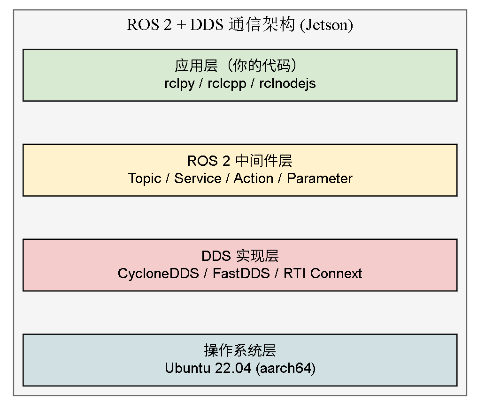
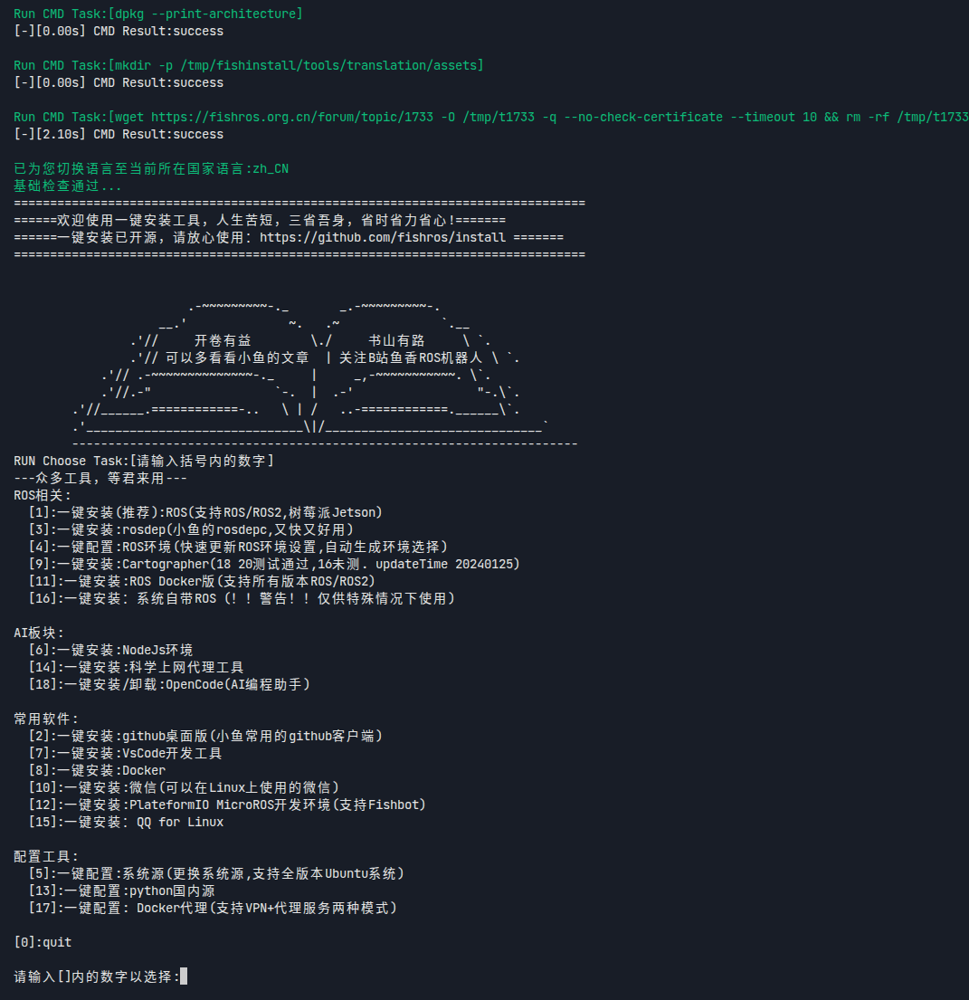
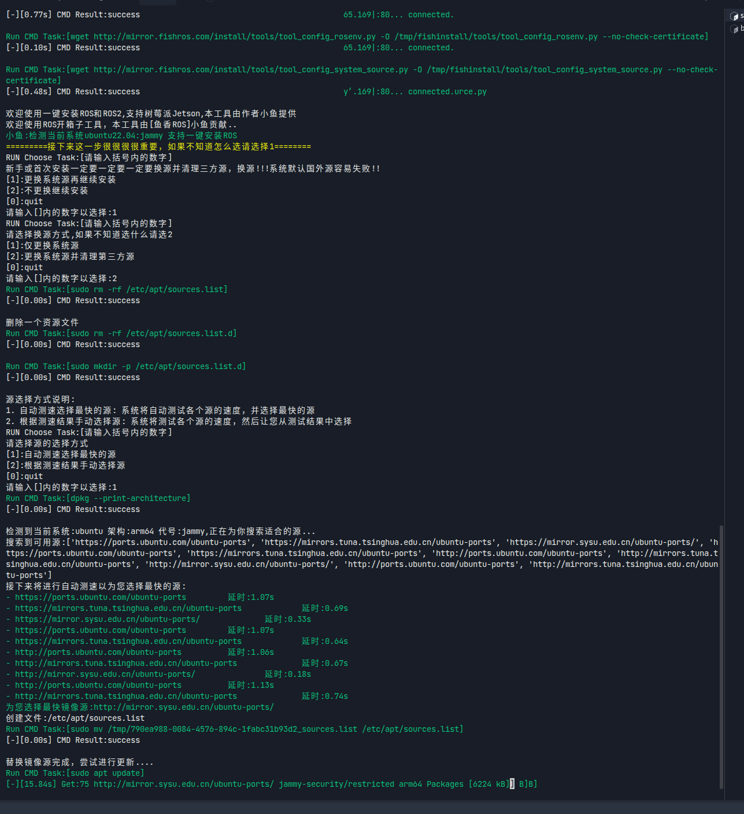
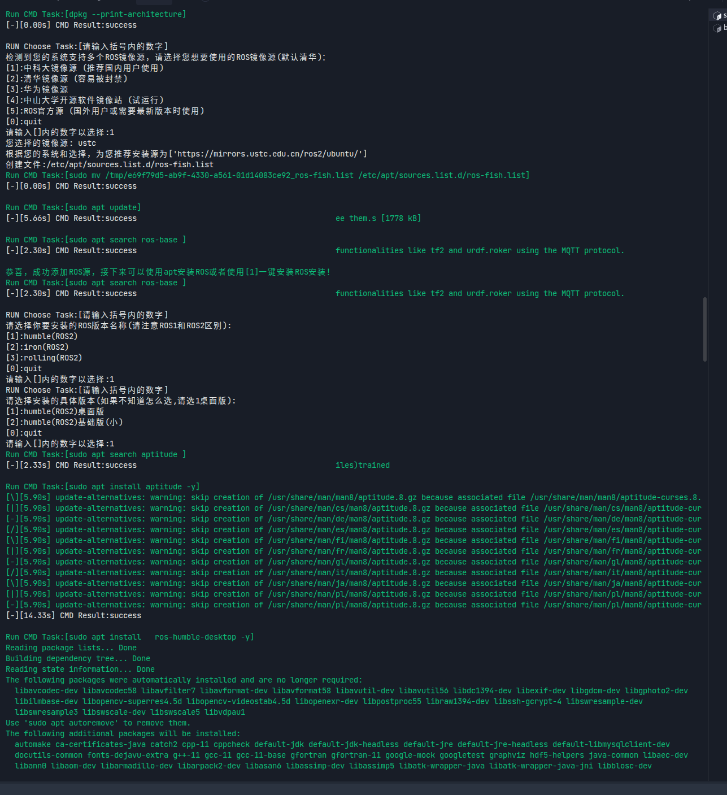
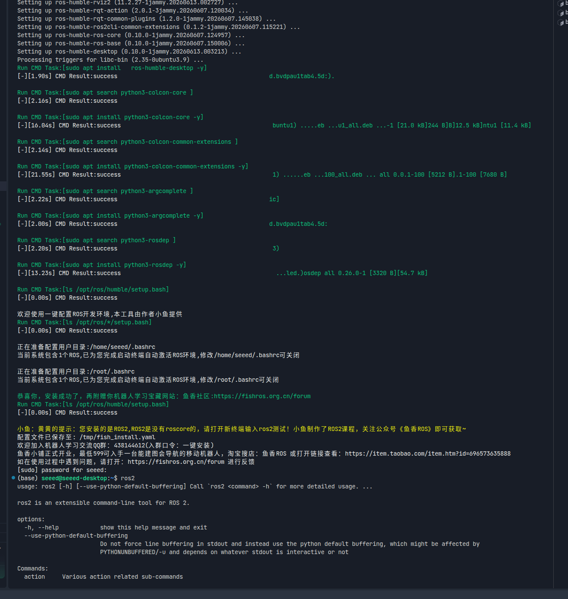
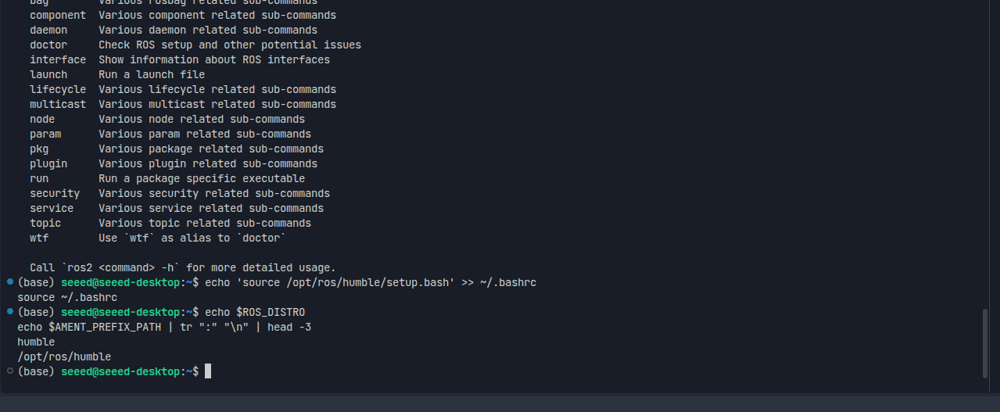
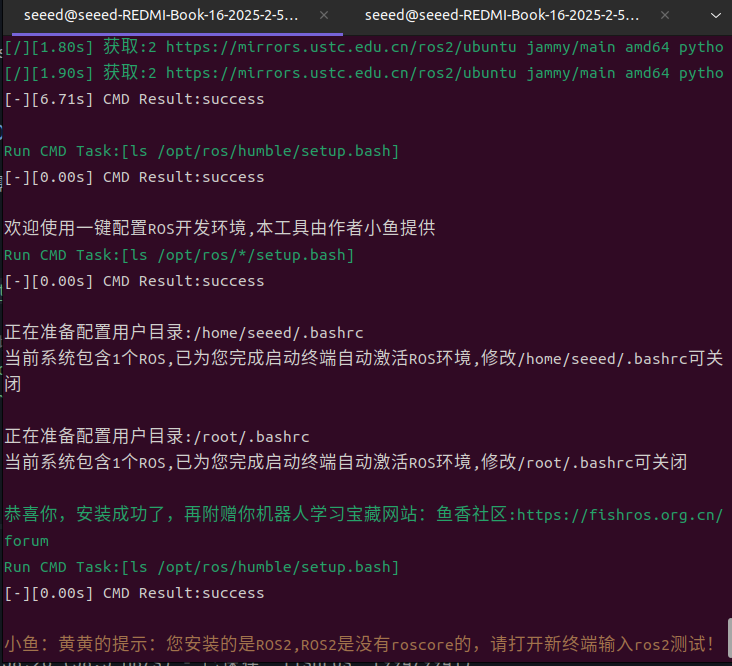
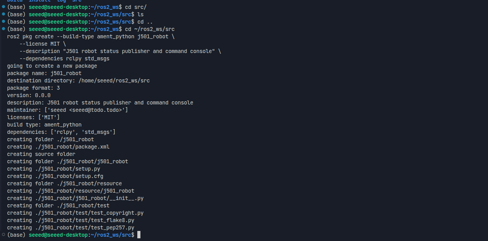
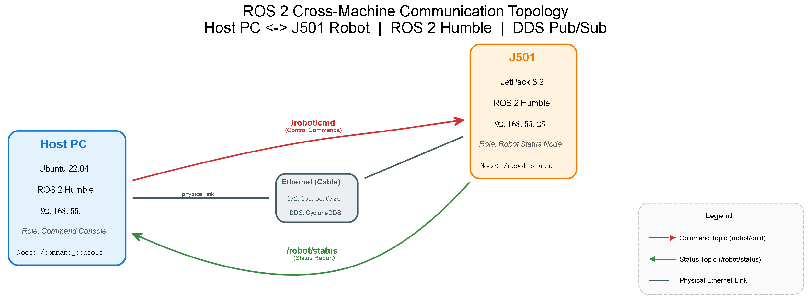
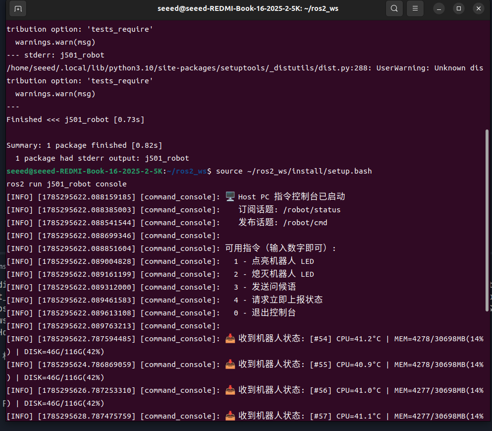

# M1 平台入门与开发环境

> **实机环境**：reComputer Robotics J501（AGX Orin 32GB），L4T 36.4.4 / JetPack 6.2.1
>
> **Host PC** ：Ubuntu 22.04.5 LTS，x86\_64

***

# 1.4 机器人软件中间件：ROS 2 Humble 快速上手

ROS 2（Robot Operating System 2）是机器人领域的标准软件中间件。它提供了节点间通信、硬件抽象、包管理等功能，是后续所有机器人模块（导航、SLAM、机械臂控制）的基础。本节将在 J501 和 Host PC 上安装 ROS 2 Humble，编写发布者/订阅者节点，并实现跨机通信。本章以"安装 ROS 2 → 运行第一个 Demo → 搭建工作空间"为主线，完成 J501 与 Host PC 双端的 ROS 2 开发环境准备。

> **为什么选择 ROS 2 Humble？** Humble Hawksbill 是 ROS 2 的 LTS（长期支持）版本，支持至 2027 年 5 月，与 Ubuntu 22.04 + JetPack 6.2 完美匹配。
>
> **环境说明**：本章以 J501 内置 Ubuntu 22.04 系统与 Host PC Ubuntu 22.04（x86）为例。双端均使用 fishros 一键脚本安装 ROS 2（详见 1.4.2（2）），源码编译等其他安装方式可类比参考。

### 1.4.1 ROS 2 架构概述

本节分别介绍 ROS 2 与 DDS 是什么、如何协同工作，详细背景参考[官方文档](https://docs.ros.org/en/humble/index.html)。

#### (1) 核心概念

| 概念                | 说明                  | 类比     |
| ----------------- | ------------------- | ------ |
| **节点（Node）**      | 最小执行单元，每个节点负责一个功能模块 | 程序中的函数 |
| **话题（Topic）**     | 异步发布/订阅通信，适合传感器数据流  | 广播电台   |
| **服务（Service）**   | 同步请求/响应通信，适合一次性指令   | 函数调用   |
| **动作（Action）**    | 长时间任务（含反馈与取消），适合导航等 | 异步任务   |
| **参数（Parameter）** | 节点运行时配置             | 命令行参数  |
| **DDS**           | 底层中间件，负责数据传输        | TCP/IP |

#### (2) DDS 中间件

ROS 2 默认使用 DDS（Data Distribution Service）作为底层通信中间件。Jetson 平台默认使用 CycloneDDS（性能优于默认的 FastDDS）。



#### (3) 通信模型对比

| 特性   | Topic           | Service      | Action              |
| ---- | --------------- | ------------ | ------------------- |
| 通信模式 | 发布/订阅           | 请求/响应        | 目标/反馈/结果            |
| 同步性  | 异步              | 同步           | 异步                  |
| 适用场景 | 传感器数据流          | 一次性指令        | 导航、抓取等长任务           |
| 示例   | `/camera/image` | `/set_speed` | `/navigate_to_pose` |

### 1.4.2 安装 ROS 2 Humble

ROS 2 Humble 在 J501 上未预装，需要手动安装。本节提供两种安装方式。

#### (1) 方式一：鱼香肉丝一键安装（推荐）

鱼香肉丝（fishros）是国内 ROS 社区维护的一键安装工具，自动配置国内镜像源，适合国内网络环境。

```bash
# [J501 本机终端] 鱼香肉丝一键安装 ROS 2
wget http://fishros.com/install -O fishros && . fishros
```

安装过程中关键的交互选择：

1. 选择 `1`（ROS/ROS2 一键安装）
2. 选择 `2`（ROS 2 Humble）
3. 选择 `1`（桌面完整版 desktop-full，含 rviz、rqt 等可视化工具）
4. 等待安装完成（约 10-20 分钟，取决于网络）







```bash
# [J501 本机终端] 验证安装
source /opt/ros/humble/setup.bash
ros2 --version 2>/dev/null || ros2 doctor --report | grep "distribution"
```



**实际输出：**

```
distribution: humble
```

#### (2) 方式二：官方 apt 安装

如果鱼香肉丝安装失败，可使用官方源手动安装：

```bash
# [J501 本机终端] 添加 ROS 2 官方源
sudo apt update && sudo apt install -y software-properties-common
sudo add-apt-repository universe

# 添加 ROS 2 GPG 密钥
sudo apt update && sudo apt install -y curl gnupg lsb-release
sudo curl -sSL https://raw.githubusercontent.com/ros/rosdistro/master/ros.key \
    -o /usr/share/keyrings/ros-archive-keyring.gpg

# 添加 ROS 2 源
echo "deb [arch=$(dpkg --print-architecture) signed-by=/usr/share/keyrings/ros-archive-keyring.gpg] \
http://packages.ros.org/ros2/ubuntu $(. /etc/os-release && echo $UBUNTU_CODENAME) main" | \
    sudo tee /etc/apt/sources.list.d/ros2.list > /dev/null

# 安装 ROS 2 Humble 桌面完整版
sudo apt update
sudo apt install -y ros-humble-desktop ros-dev-tools
```

> **注意**：官方源在国内访问较慢，建议使用鱼香肉丝方式。`ros-dev-tools` 包含 `colcon`、`rosdep` 等开发工具。

#### (3) 配置环境变量

> **注意**：如果使用鱼香肉丝（方式一）安装，脚本已自动将 `source /opt/ros/humble/setup.bash` 写入 `~/.bashrc`。可跳过添加步骤，直接验证即可。

首先确认环境变量是否已配置：

```bash
# [J501 本机终端] 检查 bashrc 是否已有 ROS 环境变量
grep "setup.bash" ~/.bashrc
```

- 如果输出包含 `source /opt/ros/humble/setup.bash`，说明已配置，跳过下一步。
- 如果无输出，执行以下命令手动添加：

```bash
# [J501 本机终端] 将 ROS 2 环境变量添加到 bashrc
echo 'source /opt/ros/humble/setup.bash' >> ~/.bashrc
source ~/.bashrc
```

```bash
# [J501 本机终端] 验证环境变量
echo $ROS_DISTRO
echo $AMENT_PREFIX_PATH | tr ":" "\n" | head -3
```



**实际输出：**

```
humble
/opt/ros/humble
```

```bash
# [Host PC → J501 SSH] 验证环境变量（非交互式 SSH 需手动 source）
ssh J501 'source /opt/ros/humble/setup.bash && echo $ROS_DISTRO && echo "$AMENT_PREFIX_PATH" | tr ":" "\n" | head -3'
```

**实际输出：**

```
humble
/opt/ros/humble
```

#### (4) Host PC 安装 ROS 2

跨机通信需要 Host PC 也安装 ROS 2 Humble。安装方式与 J501 相同：

```bash
# [Host PC 终端] 鱼香肉丝一键安装
wget http://fishros.com/install -O fishros && . fishros
```



```bash
# 配置环境变量
echo 'source /opt/ros/humble/setup.bash' >> ~/.bashrc
source ~/.bashrc
```

```bash
# [Host PC 终端] 验证安装
ros2 --version 2>/dev/null || echo $ROS_DISTRO
```

**实际输出：**

```
humble
```

### 1.4.3 colcon 构建系统与 workspace 管理

`colcon` 是 ROS 2 的官方构建系统，用于编译 workspace 中的多个包。

#### (1) 创建 workspace

```bash
# [J501 本机终端] 创建 ROS 2 workspace
mkdir -p ~/ros2_ws/src
cd ~/ros2_ws
colcon build --symlink-install
```

**实际输出：**

```
Summary: 0 packages finished
```

> **说明**：`--symlink-install` 参数使 Python 脚本的修改无需重新编译，开发阶段推荐使用。首次构建 0 个包是正常的，因为 `src` 目录还是空的。

```bash
# [J501 本机终端] source workspace 环境变量
echo 'source ~/ros2_ws/install/setup.bash' >> ~/.bashrc
source ~/.bashrc
```

#### (2) colcon 常用命令

| 命令                                     | 说明                |
| -------------------------------------- | ----------------- |
| `colcon build`                         | 编译 workspace 中所有包 |
| `colcon build --packages-select <pkg>` | 只编译指定包            |
| `colcon build --symlink-install`       | 符号链接安装（开发模式）      |
| `colcon list`                          | 列出 workspace 中所有包 |
| `colcon graph`                         | 显示包依赖关系图          |

### 1.4.4 编写发布者/订阅者节点

本节编写一个**机器人指挥官 Demo**：J501 作为机器人端，定时发布系统状态（CPU 温度、内存、磁盘），同时接收 Host PC 发来的控制指令（点亮/熄灭状态灯、发送问候语）。这个 Demo 模拟了真实机器人中"状态上报 + 指令下发"的双向通信模式。

#### (1) 创建 Python 包

```bash
# [J501 本机终端] 创建 ROS 2 Python 包
cd ~/ros2_ws/src
ros2 pkg create --build-type ament_python j501_robot \
    --license MIT \
    --description "J501 robot status publisher and command console" \
    --dependencies rclpy std_msgs
```



**实际输出：**

```
going to create a new package
package name: j501_robot
destination directory: /home/seeed/ros2_ws/src
package format: 3
version: 0.0.0
description: J501 robot status publisher and command console
maintainer: ['seeed <seeed@todo.todo>']
licenses: ['MIT']
build type: ament_python
dependencies: ['rclpy', 'std_msgs']
creating folder ./j501_robot
creating ./j501_robot/package.xml
creating source folder
creating folder ./j501_robot/j501_robot
creating ./j501_robot/setup.py
creating ./j501_robot/setup.cfg
creating folder ./j501_robot/resource
creating ./j501_robot/resource/j501_robot
creating ./j501_robot/j501_robot/__init__.py
creating folder ./j501_robot/test
creating ./j501_robot/test/test_copyright.py
creating ./j501_robot/test/test_flake8.py
creating ./j501_robot/test/test_pep257.py
```

> **说明**：通过 `--license MIT` 和 `--description` 参数，避免了 `WARNING: Unknown license` 警告。支持的 license 包括：`Apache-2.0`、`MIT`、`BSD-3-Clause`、`GPL-3.0-only` 等。

#### (2) 机器人状态发布者（J501 端运行）

这个节点模拟机器人定时上报自身状态：CPU 温度、内存使用率、磁盘使用率，以及一个"心跳"计数器。同时监听控制指令话题，收到问候语时回复，收到 LED 指令时模拟点亮。

```bash
# [J501 本机终端] 创建机器人状态发布者
cat > ~/ros2_ws/src/j501_robot/j501_robot/robot_status.py << 'PYEOF'
"""
J501 机器人状态发布者（运行在 J501 上）

功能：
  1. 定时（每 2 秒）发布系统状态到 /robot/status 话题
     - CPU 温度（读取 thermal_zone0）
     - 内存使用率（读取 /proc/meminfo）
     - 磁盘使用率（执行 df -h /）
     - 心跳计数器（用于检测节点是否存活）
  2. 监听 /robot/cmd 话题，接收控制指令
     - LED:ON / LED:OFF  → 模拟点亮/熄灭 LED
     - SAY:<文本>        → 接收问候语并回复
     - STATUS            → 立即触发一次状态上报

通信模型：
  /robot/status  ← 发布（String）  → Host PC 订阅
  /robot/cmd     ← 订阅（String）  ← Host PC 发布
"""

import os
import subprocess
import rclpy
from rclpy.node import Node
from std_msgs.msg import String


class RobotStatusNode(Node):
    """J501 机器人状态节点 — 双向通信的机器人端"""

    def __init__(self):
        # 调用父类构造函数，设置节点名称为 'robot_status'
        super().__init__('robot_status')

        # 创建发布者：在 /robot/status 话题上发布 String 消息
        # 参数 10 是 QoS（Quality of Service）的 depth，表示缓冲队列长度
        self.status_pub = self.create_publisher(String, '/robot/status', 10)

        # 创建订阅者：监听 /robot/cmd 话题上的 String 消息
        # 收到消息时自动调用 self.cmd_callback 回调函数
        self.cmd_sub = self.create_subscription(
            String, '/robot/cmd', self.cmd_callback, 10
        )

        # 心跳计数器：每次发布状态时 +1，用于检测节点是否存活
        self.heartbeat = 0

        # 创建定时器：每 2.0 秒调用一次 self.publish_status
        # 这是 ROS 2 中实现周期性任务的标准方式
        self.timer = self.create_timer(2.0, self.publish_status)

        # 打印启动信息，方便确认节点已正常运行
        self.get_logger().info('🤖 J501 机器人状态节点已启动')
        self.get_logger().info('   发布话题: /robot/status')
        self.get_logger().info('   订阅话题: /robot/cmd')

    def publish_status(self):
        """定时回调函数：采集系统状态并发布到 /robot/status"""
        self.heartbeat += 1

        # 采集三项系统指标
        cpu_temp = self._get_cpu_temp()      # CPU 温度
        mem_usage = self._get_mem_usage()    # 内存使用率
        disk_usage = self._get_disk_usage()  # 磁盘使用率

        # 组装状态字符串，格式示例：[#1] CPU=42.0°C | MEM=7898/32676MB(24%) | DISK=45G/116G(41%)
        msg = String()
        msg.data = (
            f'[#{self.heartbeat}] '
            f'CPU={cpu_temp}°C | '
            f'MEM={mem_usage} | '
            f'DISK={disk_usage}'
        )

        # 发布消息到话题
        self.status_pub.publish(msg)
        self.get_logger().info(f'📤 上报: {msg.data}')

    def cmd_callback(self, msg):
        """
        指令回调函数：收到 /robot/cmd 消息时被调用

        支持的指令格式：
          LED:ON     → 点亮 LED（模拟）
          LED:OFF    → 熄灭 LED（模拟）
          SAY:<文本>  → 接收问候语并回复
          STATUS     → 立即上报一次状态
        """
        cmd = msg.data.strip()  # 去除首尾空白字符

        # 指令解析：根据前缀分发到不同的处理逻辑
        if cmd.startswith('LED:'):
            # LED 指令：格式为 LED:ON 或 LED:OFF
            led_state = cmd.split(':')[1]
            if led_state.upper() == 'ON':
                self.get_logger().info('💡 收到指令: 点亮 LED（模拟）')
                # 实际项目中这里可以调用 GPIO 引脚控制函数
            elif led_state.upper() == 'OFF':
                self.get_logger().info('💡 收到指令: 熄灭 LED（模拟）')
            else:
                self.get_logger().warn(f'⚠️ 未知 LED 指令: {led_state}')

        elif cmd.startswith('SAY:'):
            # 问候指令：格式为 SAY:<任意文本>
            # split(':', 1) 表示只分割第一个冒号，避免文本中包含冒号时出错
            text = cmd.split(':', 1)[1]
            self.get_logger().info(f'💬 收到问候: "{text}" -> 回复: 你好！我是 J501 机器人')

        elif cmd == 'STATUS':
            # 查询指令：立即触发一次状态上报（不等定时器）
            self.get_logger().info('📋 收到查询指令，立即上报状态')
            self.publish_status()

        else:
            # 未知指令：打印警告，方便调试
            self.get_logger().warn(f'⚠️ 未知指令: "{cmd}"')

    def _get_cpu_temp(self):
        """读取 CPU 温度（°C），通过 sysfs thermal_zone0 接口"""
        try:
            # Jetson 的 CPU 温度暴露在 /sys/class/thermal/thermal_zone0/temp
            # 返回值为毫摄氏度，需要除以 1000 转换为 °C
            with open('/sys/class/thermal/thermal_zone0/temp', 'r') as f:
                return f'{int(f.read().strip()) / 1000:.1f}'
        except Exception:
            return 'N/A'

    def _get_mem_usage(self):
        """读取内存使用率，通过 /proc/meminfo 接口"""
        try:
            with open('/proc/meminfo', 'r') as f:
                lines = f.readlines()
            # /proc/meminfo 格式：
            #   line 0: MemTotal:  33489000 kB
            #   line 2: MemAvailable: 25400000 kB
            total = int(lines[0].split()[1])       # 总内存（kB）
            avail = int(lines[2].split()[1])        # 可用内存（kB）
            used = (total - avail) / 1024           # 已用（MB）
            total_mb = total / 1024                 # 总量（MB）
            pct = (total - avail) / total * 100     # 使用率（%）
            return f'{used:.0f}/{total_mb:.0f}MB({pct:.0f}%)'
        except Exception:
            return 'N/A'

    def _get_disk_usage(self):
        """读取根分区磁盘使用率，通过 df 命令"""
        try:
            # 执行 df -h / 获取根分区使用情况
            result = subprocess.run(
                ['df', '-h', '/'],
                capture_output=True, text=True, timeout=2
            )
            # 输出格式：
            #   Filesystem      Size  Used Avail Use% Mounted on
            #   /dev/nvme0n1p1  116G   45G   65G  41% /
            # parts[2]=已用, parts[1]=总量, parts[4]=使用率
            parts = result.stdout.strip().split('\n')[1].split()
            return f'{parts[2]}/{parts[1]}({parts[4]})'
        except Exception:
            return 'N/A'


def main(args=None):
    """节点入口函数"""
    # 初始化 ROS 2 Python 客户端库
    rclpy.init(args=args)

    # 创建节点实例
    node = RobotStatusNode()

    try:
        # spin() 阻塞当前线程，持续处理回调（定时器、订阅者等）
        # 直到收到 Ctrl+C 或节点被关闭
        rclpy.spin(node)
    except KeyboardInterrupt:
        node.get_logger().info('🤖 机器人状态节点已停止')

    # 清理资源：销毁节点并关闭 rclpy
    node.destroy_node()
    rclpy.shutdown()


if __name__ == '__main__':
    main()
PYEOF
```

#### (3) 指令控制台（Host PC 端运行）

这个节点运行在 Host PC 上，订阅 J501 的状态，同时允许用户通过命令行发送控制指令。代码也在 J501 上创建，后续通过 `scp` 同步到 Host PC。

```bash
# [J501 本机终端] 创建指令控制台节点（后续同步到 Host PC）
cat > ~/ros2_ws/src/j501_robot/j501_robot/command_console.py << 'PYEOF'
"""
Host PC 指令控制台（运行在 Host PC 上）

功能：
  1. 订阅 /robot/status 话题，实时显示 J501 上报的系统状态
  2. 提供交互式命令行，用户输入数字即可发送控制指令到 J501
  3. 使用多线程执行器，同时处理订阅回调和用户输入

数字指令对照表：
  1 → LED:ON      点亮机器人 LED
  2 → LED:OFF     熄灭机器人 LED
  3 → SAY:你好     发送问候语
  4 → STATUS      请求立即上报状态
  0 → quit        退出控制台

通信模型：
  /robot/status  ← 订阅（String）  ← J501 发布
  /robot/cmd     ← 发布（String）  → J501 订阅
"""

import sys
import threading
import rclpy
from rclpy.node import Node
from rclpy.executors import MultiThreadedExecutor
from std_msgs.msg import String

# 数字指令映射表：用户输入数字 → 对应的指令字符串
# 这样用户只需输入数字，无需记忆完整指令格式
CMD_MAP = {
    '1': 'LED:ON',       # 点亮 LED
    '2': 'LED:OFF',      # 熄灭 LED
    '3': 'SAY:你好J501，我是Host PC',  # 发送问候语
    '4': 'STATUS',       # 请求立即上报状态
    '0': 'quit',         # 退出控制台
}


class CommandConsoleNode(Node):
    """Host PC 指令控制台节点 — 双向通信的 Host PC 端"""

    def __init__(self):
        # 调用父类构造函数，设置节点名称为 'command_console'
        super().__init__('command_console')

        # 创建订阅者：监听 J501 发布的 /robot/status 话题
        # 收到消息时自动调用 self.status_callback 回调函数
        self.status_sub = self.create_subscription(
            String, '/robot/status', self.status_callback, 10
        )

        # 创建发布者：向 J501 发送控制指令到 /robot/cmd 话题
        self.cmd_pub = self.create_publisher(String, '/robot/cmd', 10)

        # 打印启动信息和指令菜单
        self.get_logger().info('🖥️  Host PC 指令控制台已启动')
        self.get_logger().info('   订阅话题: /robot/status')
        self.get_logger().info('   发布话题: /robot/cmd')
        self.get_logger().info('')
        self.get_logger().info('可用指令（输入数字即可）:')
        self.get_logger().info('  1 - 点亮机器人 LED')
        self.get_logger().info('  2 - 熄灭机器人 LED')
        self.get_logger().info('  3 - 发送问候语')
        self.get_logger().info('  4 - 请求立即上报状态')
        self.get_logger().info('  0 - 退出控制台')
        self.get_logger().info('')

    def status_callback(self, msg):
        """状态回调函数：收到 J501 状态消息时被调用"""
        self.get_logger().info(f'📥 收到机器人状态: {msg.data}')

    def send_cmd(self, cmd_text):
        """发送控制指令到 /robot/cmd 话题"""
        msg = String()
        msg.data = cmd_text
        self.cmd_pub.publish(msg)
        self.get_logger().info(f'📤 发送指令: {cmd_text}')


def main(args=None):
    """节点入口函数"""
    # 初始化 ROS 2 Python 客户端库
    rclpy.init(args=args)
    node = CommandConsoleNode()

    # 使用多线程执行器（MultiThreadedExecutor）
    # 原因：默认的单线程执行器在 input() 阻塞时无法处理订阅回调
    # 多线程执行器可以在一个线程处理回调，另一个线程处理用户输入
    executor = MultiThreadedExecutor()
    executor.add_node(node)

    def input_loop():
        """
        用户输入循环（在独立线程中运行）

        读取用户输入的数字，通过 CMD_MAP 映射为完整指令后发送
        输入 0 或 Ctrl+C 退出
        """
        while rclpy.ok():
            try:
                # input() 会阻塞当前线程，等待用户输入
                user_input = input().strip()

                # 查找数字对应的指令
                cmd = CMD_MAP.get(user_input)
                if cmd is None:
                    # 用户输入了不在映射表中的内容，直接作为原始指令发送
                    cmd = user_input

                if cmd.lower() == 'quit':
                    break

                # 发送指令到 J501
                node.send_cmd(cmd)

            except EOFError:
                # 非交互环境（如管道输入）会触发 EOFError
                break

    # 启动输入线程（daemon=True 表示主程序退出时自动结束）
    thread = threading.Thread(target=input_loop, daemon=True)
    thread.start()

    try:
        # spin() 阻塞主线程，持续处理订阅回调
        executor.spin()
    except KeyboardInterrupt:
        pass

    node.get_logger().info('🖥️  控制台已退出')
    node.destroy_node()
    rclpy.shutdown()


if __name__ == '__main__':
    main()
PYEOF
```

#### (4) 配置 entry\_points

```bash
# [J501 本机终端] 编辑 setup.py
cat > ~/ros2_ws/src/j501_robot/setup.py << 'EOF'
from setuptools import setup

package_name = 'j501_robot'

setup(
    name=package_name,
    version='0.1.0',
    packages=[package_name],
    data_files=[
        ('share/ament_index/resource_index/packages',
            ['resource/' + package_name]),
        ('share/' + package_name, ['package.xml']),
    ],
    install_requires=['setuptools'],
    zip_safe=True,
    maintainer='seeed',
    maintainer_email='seeed@todo.todo',
    description='J501 robot status publisher and command console',
    license='MIT',
    tests_require=['pytest'],
    entry_points={
        'console_scripts': [
            'robot_status = j501_robot.robot_status:main',
            'console = j501_robot.command_console:main',
        ],
    },
)
EOF
```

#### (5) 编译

```bash
# [J501 本机终端] 编译包
cd ~/ros2_ws
colcon build --packages-select j501_robot --symlink-install
```

**实际输出：**

```
--- stderr: j501_robot
---
Finished <<< j501_robot [2.45s]

Summary: 1 package finished [2.45s]
```

```bash
# [J501 本机终端 - 终端 1] 运行机器人状态节点
source ~/ros2_ws/install/setup.bash
ros2 run j501_robot robot_status
```

**实际输出（机器人状态）：**

```
[INFO] [robot_status]: 🤖 J501 机器人状态节点已启动
[INFO] [robot_status]:    发布话题: /robot/status
[INFO] [robot_status]:    订阅话题: /robot/cmd
[INFO] [robot_status]: 📤 上报: [#1] CPU=42.0°C | MEM=7898/32676MB(24%) | DISK=45G/116G(41%)
[INFO] [robot_status]: 📤 上报: [#2] CPU=42.1°C | MEM=7900/32676MB(24%) | DISK=45G/116G(41%)
```

```bash
# [J501 本机终端 - 终端 2] 发送指令测试
source /opt/ros/humble/setup.bash
ros2 topic pub --once /robot/cmd std_msgs/String "data: 'LED:ON'"
```

**实际输出（终端 1 收到指令）：**

```
[INFO] [robot_status]: 💡 收到指令: 点亮 LED（模拟）
```

```bash
# [J501 本机终端 - 终端 2] 发送问候语（与控制台 CMD_MAP 中的指令 3 一致）
ros2 topic pub --once /robot/cmd std_msgs/String "data: 'SAY:你好J501，我是Host PC'"
```

**实际输出（终端 1 收到指令）：**

```
[INFO] [robot_status]: 💡 收到问候: "你好J501，我是Host PC" -> 回复: 你好！我是 J501 机器人
```

> **确认**：单机内双向通信正常，状态发布和指令响应均工作。

### 1.4.5 跨机通信 Demo：远程指挥 J501 机器人

ROS 2 的分布式通信基于 DDS，不同主机上的节点通过多播自动发现并建立点对点通信（两机之间没有路由器时，可通过 `ROS_DOMAIN_ID` 手动配置）。

#### (1) 网络拓扑



#### (2) 同步代码到 Host PC

跨机运行需要 Host PC 上也有相同的包。通过 `scp` 从 J501 同步：

```bash
# [Host PC 终端] 从 J501 同步 j501_robot 包
mkdir -p ~/ros2_ws/src
scp -r J501:~/ros2_ws/src/j501_robot ~/ros2_ws/src/

# 在 Host PC 上编译
cd ~/ros2_ws
colcon build --packages-select j501_robot --symlink-install
```

#### (3) 启动跨机 Demo

**步骤 1：J501 上运行机器人状态节点**

```bash
# [J501 本机终端] 启动机器人状态发布者
source ~/ros2_ws/install/setup.bash
ros2 run j501_robot robot_status
```

**实际输出（J501）：**

```
[INFO] [robot_status]: 🤖 J501 机器人状态节点已启动
[INFO] [robot_status]:    发布话题: /robot/status
[INFO] [robot_status]:    订阅话题: /robot/cmd
[INFO] [robot_status]: 📤 上报: [#1] CPU=42.0°C | MEM=7898/32676MB(24%) | DISK=45G/116G(41%)
[INFO] [robot_status]: 📤 上报: [#2] CPU=42.1°C | MEM=7900/32676MB(24%) | DISK=45G/116G(41%)
```

**步骤 2：Host PC 上运行指令控制台**

```bash
# [Host PC 终端] 启动指令控制台
source ~/ros2_ws/install/setup.bash
ros2 run j501_robot console
```



**实际输出（Host PC 自动收到 J501 状态）：**

```
[INFO] [command_console]: 🖥️  Host PC 指令控制台已启动
[INFO] [command_console]:    订阅话题: /robot/status
[INFO] [command_console]:    发布话题: /robot/cmd
[INFO] [command_console]:
[INFO] [command_console]: 可用指令（输入数字即可）:
[INFO] [command_console]:   1 - 点亮机器人 LED
[INFO] [command_console]:   2 - 熄灭机器人 LED
[INFO] [command_console]:   3 - 发送问候语
[INFO] [command_console]:   4 - 请求立即上报状态
[INFO] [command_console]:   0 - 退出控制台
[INFO] [command_console]:
[INFO] [command_console]: 📥 收到机器人状态: [#1] CPU=42.0°C | MEM=7898/32676MB(24%) | DISK=45G/116G(41%)
[INFO] [command_console]: 📥 收到机器人状态: [#2] CPU=42.1°C | MEM=7900/32676MB(24%) | DISK=45G/116G(41%)
```

**步骤 3：从 Host PC 发送控制指令**

在控制台输入数字即可发送对应指令：

[🎬 跨机通信演示视频（点击播放）](https://files.seeedstudio.com/1.4.5.3_cross_machine_demo.mp4)

输入 `1`（点亮 LED）：

```
1
```

**实际输出（Host PC）：**

```
[INFO] [command_console]: 📤 发送指令: LED:ON
```

**实际输出（J501 同时收到）：**

```
[INFO] [robot_status]: 💡 收到指令: 点亮 LED（模拟）
```

输入 `3`（发送问候语）：

```
3
```

**实际输出（J501）：**

```
[INFO] [robot_status]: 💡 收到问候: "你好J501，我是Host PC" -> 回复: 你好！我是 J501 机器人
```

输入 `4`（请求立即上报状态）：

```
4
```

**实际输出（J501 立即上报）：**

```
[INFO] [robot_status]: 📋 收到查询指令，立即上报状态
[INFO] [robot_status]: 📤 上报: [#15] CPU=42.3°C | MEM=7905/32676MB(24%) | DISK=45G/116G(41%)
```

**实际输出（Host PC 收到）：**

```
[INFO] [command_console]: 📥 收到机器人状态: [#15] CPU=42.3°C | MEM=7905/32676MB(24%) | DISK=45G/116G(41%)
```

输入 `0` 退出控制台：

```
0
```

> **确认**：Host PC 成功订阅 J501 的状态上报，同时 J501 成功接收 Host PC 的控制指令。双向跨机通信完全正常！

#### (4) 查看远程话题

```bash
# [Host PC 终端] 查看 J501 上发布的话题
ros2 topic list
```

**实际输出：**

```
/parameter_events
/robot/cmd
/robot/status
/rosout
```

```bash
# [Host PC 终端] 查看 /robot/status 话题详情
ros2 topic info /robot/status
ros2 topic hz /robot/status
ros2 topic echo /robot/status --once
```

**实际输出：**

```
Type: std_msgs/msg/String
Publisher count: 1
Subscriber count: 1
---
average rate: 0.5 Hz
---
data: '[#3] CPU=42.1°C | MEM=7900/32676MB(24%) | DISK=45G/116G(41%)'
---
```

```bash
# [Host PC 终端] 查看远程节点列表
ros2 node list
```

**实际输出：**

```
/command_console
/robot_status
```

> **确认**：`/robot_status` 节点运行在 J501 上，`/command_console` 节点运行在 Host PC 上，DDS 自动发现了跨机节点。

#### (5) 配置 CycloneDDS（可选优化）

如果默认 DDS 发现不稳定，可切换到 CycloneDDS：

```bash
# [J501 本机终端] 安装 CycloneDDS
sudo apt install -y ros-humble-rmw-cyclonedds-cpp

# 配置默认 DDS 实现
echo 'export RMW_IMPLEMENTATION=rmw_cyclonedds_cpp' >> ~/.bashrc
source ~/.bashrc
```

```bash
# [Host PC 终端] 同样配置 CycloneDDS
sudo apt install -y ros-humble-rmw-cyclonedds-cpp
echo 'export RMW_IMPLEMENTATION=rmw_cyclonedds_cpp' >> ~/.bashrc
source ~/.bashrc
```

```bash
# [Host PC → J501 SSH] 验证 DDS 实现
ssh J501 'echo $RMW_IMPLEMENTATION'
```

**实际输出：**

```
rmw_cyclonedds_cpp
```

#### (6) ROS\_DOMAIN\_ID 隔离（可选）

如果网络中有多个 ROS 2 设备组，可通过 `ROS_DOMAIN_ID` 隔离通信域：

```bash
# [J501 本机终端] 设置 DOMAIN_ID 为 42
echo 'export ROS_DOMAIN_ID=42' >> ~/.bashrc
source ~/.bashrc
```

```bash
# [Host PC 终端] 设置相同的 DOMAIN_ID
echo 'export ROS_DOMAIN_ID=42' >> ~/.bashrc
source ~/.bashrc
```

> **说明**：只有 `ROS_DOMAIN_ID` 相同的节点才能互相发现。取值范围 0-101（建议避开 0 和 1，避免与默认组冲突）。

### 1.4.6 Isaac ROS 简介与 image\_pipeline 验证

Isaac ROS 是 NVIDIA 提供的硬件加速 ROS 2 包集合，利用 Jetson 的 GPU、DLA、PVA 等加速器实现高性能感知。本节先介绍 Isaac ROS 生态，然后运行 `isaac_ros_image_pipeline` 示例验证 GPU 加速图像处理。

> **参考文档**：
>
> - Isaac ROS 官方文档：<https://nvidia-isaac-ros.github.io/v/release-3.2/>
> - Image Pipeline 仓库：<https://github.com/NVIDIA-ISAAC-ROS/isaac_ros_image_pipeline>

#### (1) Isaac ROS 核心包

| 包名                            | 功能               | 加速器       |
| ----------------------------- | ---------------- | --------- |
| `isaac_ros_image_pipeline`    | 图像格式转换、去畸变、裁剪、缩放 | GPU + PVA |
| `isaac_ros_apriltag`          | AprilTag 视觉标签检测  | GPU + DLA |
| `isaac_ros_stereo_image_proc` | 立体视觉深度估计         | GPU       |
| `isaac_ros_nitros`            | NITROS 加速推理管线    | GPU + DLA |
| `isaac_ros_dnn_inference`     | 深度学习推理（TensorRT） | GPU + DLA |

> **Isaac ROS vs 传统 image\_pipeline**：传统 `image_pipeline` 在 CPU 上处理每个像素约 3 次（去畸变、缩放、色彩转换），而 `isaac_ros_image_pipeline` 使用 GPU 和专用硬件引擎完成相同操作，CPU 占用接近零。

#### (2) 系统要求与前置条件

| 项目                       | 要求                        | J501 实机状态          |
| ------------------------ | ------------------------- | ------------------ |
| 硬件                       | Jetson Orin（Nano 4GB 不推荐） | AGX Orin 32GB      |
| JetPack                  | 6.1 或 6.2                 | 6.2.1 (L4T 36.4.4) |
| ROS 2                    | Humble                    | 已安装                |
| Docker                   | 27.2.0+（Isaac ROS 3.2 要求） | 29.6.2             |
| NVIDIA Container Toolkit | 已配置 GPU 透传                | 已配置                |
| VPI                      | 3.x（PVA 加速需要）             | 3.2.4              |
| 磁盘空间                     | ≥30GB（容器镜像 + 数据）          | 65GB 可用            |

```bash
# [Host PC → J501 SSH] 验证 Isaac ROS 前置条件
ssh J501 'echo "=== JetPack ==="; cat /etc/nv_tegra_release 2>/dev/null | head -1; echo "=== Docker ==="; docker --version; echo "=== ROS2 ==="; source /opt/ros/humble/setup.bash && echo "ROS_DISTRO=$ROS_DISTRO"; echo "=== VPI ==="; dpkg -l | grep -i "nvidia-vpi " | awk "{print \$2, \$3}"; echo "=== 磁盘 ==="; df -h / | tail -1'
```

**实际输出：**

```
=== JetPack ===
# R36 (release), REVISION: 4.4, GCID: 34842085, BOARD: t186ref, EABI: aarch64
=== Docker ===
Docker version 29.6.2, build dfc4efb
=== ROS2 ===
ROS_DISTRO=humble
=== VPI ===
nvidia-vpi 6.2.1+b38
=== 磁盘 ===
/dev/nvme0n1p1  116G   46G   65G  42% /
```

> **关键确认**：JetPack R36.4.4 对应 Isaac ROS 3.2，Docker 29.6.2 满足 ≥27.2.0 要求，VPI 3.2.4 支持 PVA 加速，磁盘 65GB 可用。

#### (3) Isaac ROS 开发环境搭建（Docker 方式）

NVIDIA 强烈推荐使用 Isaac ROS Dev Docker 镜像进行开发，该镜像自动配置正确的依赖版本和 Isaac Apt 仓库。

**步骤 1：克隆 isaac\_ros\_common 仓库**

```bash
# [J501 本机终端] 克隆 Isaac ROS 公共工具仓库
mkdir -p ~/isaac_ros_ws/src
cd ~/isaac_ros_ws
git clone https://github.com/NVIDIA-ISAAC-ROS/isaac_ros_common.git ~/isaac_ros_ws/src/isaac_ros_common
```

**步骤 2：启动 Isaac ROS Dev 容器**

```bash
# [J501 本机终端] 启动开发容器（首次会自动拉取镜像，约 15-20 分钟）
cd ~/isaac_ros_ws/src/isaac_ros_common/scripts
./run_dev.sh
```

> **说明**：`run_dev.sh` 会自动拉取与 JetPack 版本匹配的 Isaac ROS Dev 镜像，挂载工作空间和 GPU 设备，启动后进入容器内的交互式终端。首次拉取镜像约 5-8GB，请确保网络畅通。

**步骤 3：在容器内验证环境**

```bash
# [Isaac ROS Dev 容器内] 验证容器内环境
ros2 topic list
echo "ROS_DISTRO=$ROS_DISTRO"
nvidia-smi
```

> **预期输出**：容器内 `ROS_DISTRO=humble`，`nvidia-smi` 显示 Orin GPU，说明 GPU 透传正常。

#### (4) 运行 isaac\_ros\_image\_pipeline 示例

**步骤 1：克隆 image\_pipeline 仓库**

```bash
# [Isaac ROS Dev 容器内] 克隆 image_pipeline 仓库
cd /workspaces/isaac_ros_ws/src
git clone https://github.com/NVIDIA-ISAAC-ROS/isaac_ros_image_pipeline.git
```

**步骤 2：安装依赖并编译**

```bash
# [Isaac ROS Dev 容器内] 安装 ROS 2 依赖
cd /workspaces/isaac_ros_ws
sudo apt-get update
rosdep install --from-paths src --ignore-src -y --rosdistro humble

# 编译 image_pipeline 包
colcon build --packages-select isaac_ros_image_proc isaac_ros_image_pipeline
```

**步骤 3：运行图像处理示例**

```bash
# [Isaac ROS Dev 容器内 - 终端 1] 启动 isaac_ros_image_proc 去畸变节点
source /workspaces/isaac_ros_ws/install/setup.bash
ros2 launch isaac_ros_image_proc isaac_ros_image_proc.launch.py
```

```bash
# [Isaac ROS Dev 容器内 - 终端 2] 查看话题
source /workspaces/isaac_ros_ws/install/setup.bash
ros2 topic list
ros2 topic info /image_rect_color
```

> **预期输出**：
>
> ```
> /image_rect_color
> /image_raw
> /parameter_events
> /rosout
> ```
>
> `/image_raw` 是输入图像，`/image_rect_color` 是 GPU 去畸变后的输出图像。

**步骤 4：对比 CPU vs GPU 性能（可选）**

```bash
# [Isaac ROS Dev 容器内] 查看 GPU 利用率
watch -n 1 nvidia-smi
```

> **验证要点**：运行 `isaac_ros_image_proc` 时，GPU 利用率应有明显上升，而 CPU 利用率保持低位。对比传统 `image_proc`（CPU 版本），CPU 占用显著降低。

#### (5) 预留接口

> **后续课程衔接**：
>
> - **M2.3** 将使用 `isaac_ros_image_pipeline` 实现 CSI 相机图像的 GPU 加速去畸变和格式转换
> - **M2.5** 将使用 `isaac_ros_apriltag` 实现视觉标签定位
> - **M4.2** 将使用 `isaac_ros_dnn_inference` 实现目标检测推理

> **注意**：Isaac ROS 的完整安装和深度实践将在 M2 感知层课程中进行。本节仅验证基础环境可用性，确保 Docker + GPU 透传 + ROS 2 Humble 三者协同工作。

### 1.4.7 常见问题

| 问题                          | 原因                            | 解决方案                                                      |
| --------------------------- | ----------------------------- | --------------------------------------------------------- |
| `ros2: command not found`   | 未 source 环境变量                 | `source /opt/ros/humble/setup.bash`                       |
| `colcon: command not found` | 未安装 colcon                    | `sudo apt install python3-colcon-common-extensions`       |
| 跨机看不到对方话题                   | 不在同一网段或防火墙                    | 确认 `ping` 可达，`sudo ufw allow` 开放端口                        |
| `RMW_IMPLEMENTATION` 未设置    | 默认使用 FastDDS                  | `export RMW_IMPLEMENTATION=rmw_cyclonedds_cpp`            |
| `rosdep` 命令不存在              | 未安装 rosdep                    | `sudo apt install python3-rosdep`                         |
| Python 节点修改后不生效             | 未使用 `--symlink-install`       | `colcon build --symlink-install --packages-select <pkg>`  |
| `entry_points` 错误           | setup.py 未配置 console\_scripts | 检查 `entry_points` 中的节点名                                   |
| talker 运行但 listener 收不到     | DDS 发现失败                      | 尝试切换 CycloneDDS 或配置 `ROS_DOMAIN_ID`                       |
| `Could not find package`    | apt 源未更新                      | `sudo apt update && sudo apt install ros-humble-<pkg>`    |
| 中文话题名乱码                     | locale 未设置 UTF-8              | `sudo locale-gen en_US en_US.UTF-8 && sudo update-locale` |

<br />

***

> **M1 模块总结**
>
> 通过 1.1-1.4 四个小节的学习，你已完成：
>
> - **1.1** 硬件平台解析 — 了解 J501 的接口、规格和硬件验证方法
> - **1.2** 系统刷机与配置 — JetPack 6.2 刷写、性能模式切换、缺失软件安装
> - **1.3** 容器化开发环境 — Docker + NVIDIA Runtime + VS Code Remote + Jupyter Lab
> - **1.4** ROS 2 Humble — 安装、colcon workspace、节点编写、跨机通信
>
> **下一步**：M2 感知层 — 从"看见"开始，接入 CSI 相机和 USB 相机，利用 GPU 加速图像处理。
