# M2 感知层：视觉系统基础

> **实机环境**：reComputer Robotics J501（AGX Orin 32GB），L4T 36.4.4 / JetPack 6.2.1
>
> **Host PC** ：Ubuntu 22.04.5 LTS，x86_64
>
> **前置条件**：已完成 M1 全部内容（系统刷机、Docker 环境、ROS 2 Humble 安装等）

***

# 2.1 相机成像基础与 GMSL2 多相机接入

**课程目标**：理解相机成像原理（Bayer/去马赛克、ISP 管线）与 Jetson 采集软件栈（v4l2/GStreamer/ROS 2），掌握 J501 的 GMSL2 扩展能力与 MAX96712 解串器配置，实现多路高带宽相机同步采集与链路诊断。

**硬件清单**：J501 + GMSL2 扩展板（2× MAX96712 解串器，最多 8 路）、4× Sensing SG3S-ISX031C-GMSL2F GMSL2 相机（H190XA 190° 超广角镜头）、FAKRA 1 分 4 同轴线缆、3D 打印环视支架。

**前置基础**：M1.1（硬件接口识别）、M1.4（ROS 2 基础）。

> ⚠️ **硬件适用性说明**：reComputer Robotics J501 载板**没有 MIPI CSI 相机接口**——"CSI 相机最多 6 路"是 Jetson AGX Orin 的模组级能力，本载板未引出 CSI 信号，相机接入只能通过 GMSL2 扩展板（2 个 Mini-Fakra 口，最多 8 路 GMSL2 相机）。因此本章所有动手接入环节均以 **GMSL2 相机**为准；前半部分的成像理论与采集软件栈对任何接入方式的相机同样适用（包括带 CSI 接口载板上的 CSI 相机）。

> 📷 **实机配置（本教程演示环境）**：4× SG3S-ISX031C-GMSL2F（H190XA 190° 超广角镜头版）固定于橙色 3D 打印环视支架上，分别朝前/后/左/右构成环视；4 根同轴线缆经 FAKRA 1 分 4 线缆接入 J501 载板的 2 个 GMSL 扩展槽位（每槽 1 片 MAX96712，I2C 地址 0x29）。ISX031 内置 ISP、输出 YUV422，**采集走 V4L2（v4l2src）路径**而非 Argus ISP 路径（见 2.1.6 / 2.1.7）；190° 超广角带来鱼眼畸变，2.3 标定与 2.4 BEV 拼接将针对该特性展开。

**参考文档**：

- NVIDIA Jetson CSI 相机指南：<https://docs.nvidia.com/jetson/archives/r36.4.4/DeveloperGuide/index.html#hwjetsoncsidevcam>
- NVIDIA Argus ISP 文档：<https://docs.nvidia.com/jetson/archives/r36.4.4/MultimediaApi/index.html>
- Maxim Integrated（现 ADI）MAX96712 数据手册：<https://www.analog.com/en/products/max96712.html>
- NVIDIA Jetson GMSL2 相机指南：<https://docs.nvidia.com/jetson/archives/r36.4.4/DeveloperGuide/index.html>
- NVIDIA nvsipl 工具文档：<https://docs.nvidia.com/jetson/archives/r36.4.4/MultimediaApi/index.html>
- Seeed Wiki — Sensing GMSL2 相机：<https://wiki.seeedstudio.com/sensing_gmsl_cameras/>
- Seeed Wiki — reComputer Robotics J501 快速上手：<https://wiki.seeedstudio.com/ai_robotics_recomputer_j501_robotics_getting_started/>
- GMSL2 协议白皮书（ADI）：<https://www.analog.com/en/technical-articles/gmsl2.html>
- FAKRA 连接器标准（Huber+Suhner）：<https://www.hubersuhner.com/en/automotive>

***

## 2.1.1 相机传感器与接口选型

理解传感器核心参数与相机接入接口的差异，是视觉系统设计的第一步。本节以 Seeed Sensing GMSL2 相机中两款代表性 RAW 传感器（onsemi AR0233 / AR0820）为例讲解传感器选型，并对比 CSI / GMSL2 / USB 三类接入接口——J501 载板使用其中的 GMSL2（协议与接入见 2.1.11 节起）。

### (1) AR0233 vs AR0820 详细规格对比

| 参数 | SG2-AR0233C-5200-G2A | SG8S-AR0820C-5300-G2A | 说明 |
| --- | --- | --- | --- |
| **有效像素** | 2.6 MP（2048×1280，输出 1920×1080） | 8.3 MP（3848×2168，输出 3840×2160） | AR0820 像素更高 |
| **传感器尺寸** | 1/2.5 英寸（感光区约 6.14×3.84mm） | 1/2 英寸（感光区约 8.08×4.55mm） | AR0820 传感器更大 |
| **像素大小** | 3.0 μm × 3.0 μm | 2.1 μm × 2.1 μm | AR0233 像素更大，感光更好 |
| **最大分辨率帧率** | 1920×1080 @ 30 fps | 3840×2160 @ 30 fps | AR0820 分辨率更高 |
| **HDR** | 支持（HDR + LFM，LED 闪烁抑制） | 支持（片上 HDR 合成） | 均为车规 HDR 传感器 |
| **输出格式** | RAW Bayer（RAW12，经 GMSL2 传输） | RAW Bayer（RAW，经 GMSL2 传输） | 均为 RAW 输出，交由 Jetson ISP 处理 |
| **数据接口** | GMSL2 串行链路（MAX9295A，6Gbps），经 MAX96712 解串后进入 MIPI CSI-2 | 同左 | 相同 |
| **供电** | PoC 同轴供电（9-16V，<150mA@12V） | PoC 同轴供电（9-16V，<400mA@12V） | 单根同轴线传数据又供电 |
| **工作温度** | -40°C ~ +85°C（车规级） | -40°C ~ +85°C（车规级） | 相同 |
| **镜头接口** | M12 固定镜头（60°/100°/118°/196° 多 FOV 可选） | M12 固定镜头（30°/60°/120° 多 FOV 可选） | 均为固定镜头，按 FOV 选型 |
| **价格** | 以 Seeed 官网为准 | 以 Seeed 官网为准 | AR0820 更贵 |
| **适用场景** | 前视/环视主流相机、ISP 调优实验 | 高分辨率环视、细节感知 | 按分辨率需求选型 |

> **知识点**：像素大小（Pixel Pitch）直接影响感光能力。AR0233 的 3.0μm 像素比 AR0820 的 2.1μm 大约 43%（线性），像素面积约 2 倍（(3.0/2.1)²≈2.04），单位像素接收的光子更多，因此在低光环境下信噪比更好；AR0820 则用更小的像素换来 4 倍以上的分辨率。这就是"底大一级压死人"的物理原理，也是传感器选型中"分辨率 vs 感光能力"的核心权衡。

### (2) 传感器尺寸与成像关系

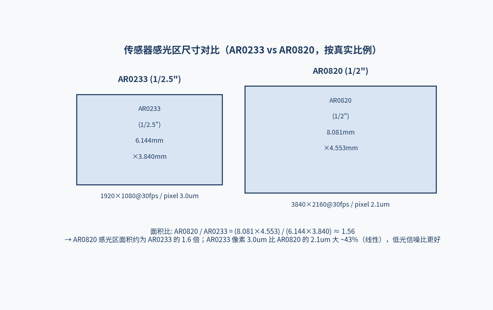

> **学习提示**：传感器面积越大，能接收的总光量越多，动态范围和低光性能越好。这也是专业相机传感器远大于手机相机传感器的原因。

### (3) 相机接入接口对比：CSI / GMSL2 / USB

| 特性 | CSI 相机（MIPI CSI-2） | GMSL2 相机 | USB 相机（UVC） | 说明 |
| --- | --- | --- | --- | --- |
| **接口** | MIPI CSI-2（FFC 排线） | GMSL2（同轴线） | USB 2.0/3.0 | 物理介质不同 |
| **带宽** | 2.5 Gbps / lane | 3/6 Gbps / link | 5 Gbps（USB 3.0） | GMSL2 单链路与 CSI 相当 |
| **延迟** | 极低（<1ms，硬件直连） | 极低（硬件串行链路） | 较高（5-30ms，USB 协议栈） | CSI/GMSL2 延迟更低 |
| **传输距离** | 最长 30cm（排线限制） | 最长 15m（同轴线） | 最长 5m（USB 限制） | GMSL2 距离优势显著 |
| **ISP 处理** | Jetson ISP（Argus，硬件加速） | 视相机而定：RAW 输出走 Jetson ISP；内置 ISP 相机直接输出 YUV | 相机内置 ISP 或 CPU 软件处理 | 见下方知识点 |
| **RAW 数据** | 支持（RAW Bayer） | 视型号（AR0233/IMX390 输出 RAW；ISX031 输出 YUV） | 通常不支持 | RAW 便于自定义 ISP |
| **多相机** | 最多 6 路（AGX Orin 模组级） | 单块扩展板 4 路，J501 最多 8 路 | 受 USB 带宽限制 | GMSL2 多路扩展性强 |
| **供电** | 排线供电 | PoC 同轴线供电（9-16V） | USB 总线供电 | GMSL2 供电布线最简 |
| **功耗** | 低（~200mW） | 低（<200mA@12V） | 较高（~500mW-2.5W） | CSI/GMSL2 功耗更低 |
| **驱动** | 需设备树配置 | 需设备树 overlay + SerDes 配置 | UVC 标准驱动（即插即用） | USB 最易用 |
| **适用场景** | 带 CSI 口载板的嵌入式视觉 | 车载/机器人远距离多相机 | 快速原型、WebCam | J501 选 GMSL2 |

> **知识点：GMSL2 相机的两种 ISP 模式**
> - **RAW 输出相机**（如 AR0233、IMX390）：传感器输出 RAW Bayer，经 MAX96712 解串后进入 Jetson 的 NVCSI→VI→ISP 管线，本章 2.1.3 / 2.1.8 节的 ISP 知识直接适用。
> - **内置 ISP 相机**（如 ISX031）：相机内部完成成像处理，直接输出 YUV422，Jetson 端 ISP 不参与，采集走 V4L2 通道。

> **选型建议**：J501 载板无 CSI 接口，相机接入选 **GMSL2**（远距离、多路、PoC 供电）；快速验证或调试场景可用 USB 相机即插即用。表中 CSI 接口一列仅适用于带 CSI 接口的其他载板（如 reServer Industrial J501）。

### (4) J501 官方支持的 GMSL2 相机

Seeed 在 JetPack 6.x BSP 中已适配以下 Sensing GMSL2 相机（overlay 配置方法见 2.1.4 节）：

| 型号 | 传感器 | 分辨率 | 链路速率 | 输出格式 | 特点 |
| --- | --- | --- | --- | --- | --- |
| SG3S-ISX031C-GMSL2F | Sony ISX031 | 1920×1536@30 | 3G | YUV422（内置 ISP） | HDR + LFM，IP67 |
| SG2-AR0233C-5200-G2A | onsemi AR0233 | 1920×1080@30 | 6G | RAW | HDR，适合 ISP 调优实验 |
| SG2-IMX390C-5200-G2A | Sony IMX390 | 1920×1080@30 | 6G | RAW12 | 车规主流前视传感器 |
| SG8S-AR0820C-5300-G2A | onsemi AR0820 | 3840×2160@30 | 6G | RAW | 4K 高分辨率 |

> **参考**：完整列表与驱动说明见 Seeed Wiki — Sensing GMSL2 相机：<https://wiki.seeedstudio.com/sensing_gmsl_cameras/>

> **实机选型**：本教程固定使用 4× **SG3S-ISX031C-GMSL2F**（H190XA 190° 超广角镜头版）：3G 链路、YUV422 输出（内置 ISP）、IP67 金属外壳，对应 overlay 为 `Seeed GMSL 3g for recomputer-robo`（见 2.1.4）。选 190° 超广角的目的是让 4 路相机在车体四周获得尽量大的重叠视场，为 2.4 的 BEV 环视拼接提供覆盖裕量。

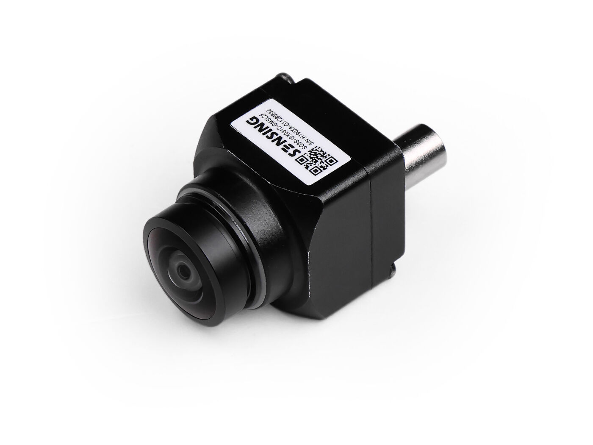

***

## 2.1.2 Bayer 滤色阵列与去马赛克原理

RAW 输出的相机传感器（如 J501 官方支持的 AR0233、IMX390、AR0820）传输的是 RAW Bayer 数据，而非彩色图像。理解 Bayer 阵列和去马赛克（Demosaicing）过程是调试相机成像质量的基础。

### (1) Bayer 滤色阵列

大多数彩色图像传感器在感光元件上方覆盖一层**彩色滤光阵列（CFA, Color Filter Array）**，使每个像素只接收红（R）、绿（G）或蓝（B）光。最常用的 CFA 排列方式是 **Bayer 阵列**（由 Bryce Bayer 发明）。

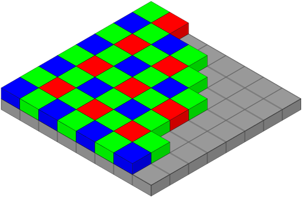

> **知识点**：Bayer 阵列中绿色（G）像素占 50%，红色（R）和蓝色（B）各占 25%。这是因为人眼对绿色波段的亮度变化最敏感（人眼亮度响应峰值约在 555nm 绿光附近），所以增加绿色采样密度可以提高感知分辨率。

> **待配图**：Bayer RGGB 滤色阵列微观放大照片与示意图对比，存放路径 `images/2.1.2_bayer_array_microscope.png`

### (2) RAW Bayer 数据格式

GMSL2 RAW 输出相机（AR0233 / IMX390 / AR0820）输出 RAW Bayer 数据，按位深在 V4L2 中标记为 `RG10` / `BG10` / `BG12` 等：

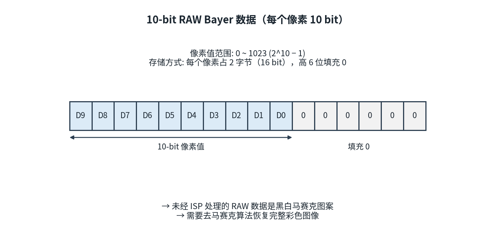

### (3) 去马赛克（Demosaicing）算法

去马赛克是将单通道 Bayer 数据恢复为三通道彩色图像的过程。每个像素只有 R/G/B 中的一个值，需要通过插值算法估算缺失的另外两个通道。

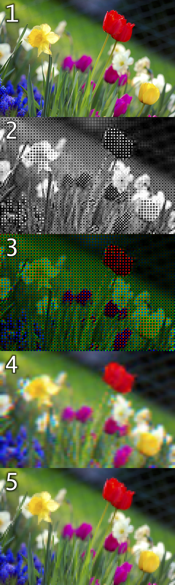

**常用去马赛克算法对比：**

| 算法 | 原理 | 质量 | 速度 | Jetson ISP 使用 |
| --- | --- | --- | --- | --- |
| **双线性插值** | 简单邻域平均 | 低（伪彩色） | 最快 | 否 |
| **VNG（Variable Number Gradient）** | 基于梯度方向的自适应插值 | 中 | 中 | 否 |
| **AHD（Adaptive Homogeneity-Directed）** | 自适应均匀性导向 | 高 | 慢 | 否 |
| **Jetson ISP（Argus）** | NVIDIA 专有算法 + 硬件加速 | 高 | 快（硬件） | 是 |

> **关键概念**：`nvarguscamerasrc` 调用 Jetson ISP（Argus）引擎，在硬件层面完成去马赛克，输出完整的 RGB/NV12 彩色图像。不经过 ISP 的 RAW 数据（通过 `v4l2-ctl` 直接获取）是黑白的 Bayer 马赛克图案，无法直接用于视觉算法。

***

## 2.1.3 Jetson ISP 管线概述

Jetson 平台的 RAW 相机数据需要经过 **ISP（Image Signal Processor）** 管线处理才能输出可用的彩色图像。理解这条管线是调试相机采集的基础——GMSL2 相机中 RAW 输出的型号同样经过这条管线。

### (1) ISP 管线全流程

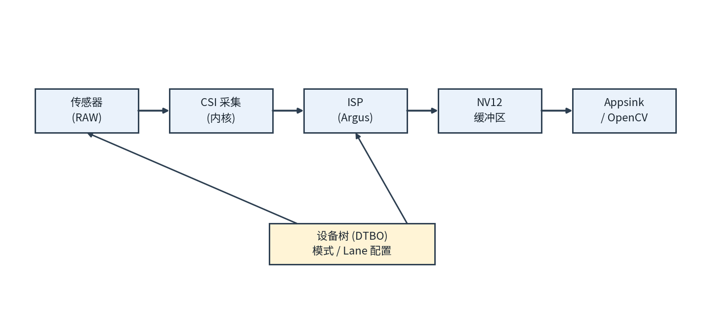

**管线各环节说明：**

| 环节 | 组件 | 说明 |
| --- | --- | --- |
| Sensor | RAW 传感器（AR0233/IMX390/AR0820 等） | 输出 RAW Bayer 数据；GMSL2 相机经 MAX96712 解串后同样从此进入 |
| CSI Capture | 内核驱动（tegra-camera） | 接收 MIPI CSI-2 数据，通过 VI（Video Input）模块捕获 |
| ISP | `nvarguscamerasrc`（Argus） | NVIDIA ISP 引擎，完成去马赛克、白平衡、曝光控制、降噪 |
| 输出 | NV12 / RGB | ISP 输出格式，可通过 `nvvidconv` 转换 |
| Appsink | GStreamer / OpenCV | 应用层获取图像帧 |

> **待配图**：Jetson ISP 管线架构图（含 Sensor → CSI → VI → ISP → 输出全链路），存放路径 `images/2.1.3_isp_pipeline_architecture.png`

### (2) Jetson VI（Video Input）模块架构

Jetson 的 VI 模块是 SoC 内置的硬件视频输入引擎，负责从 MIPI CSI-2 接口捕获原始数据。

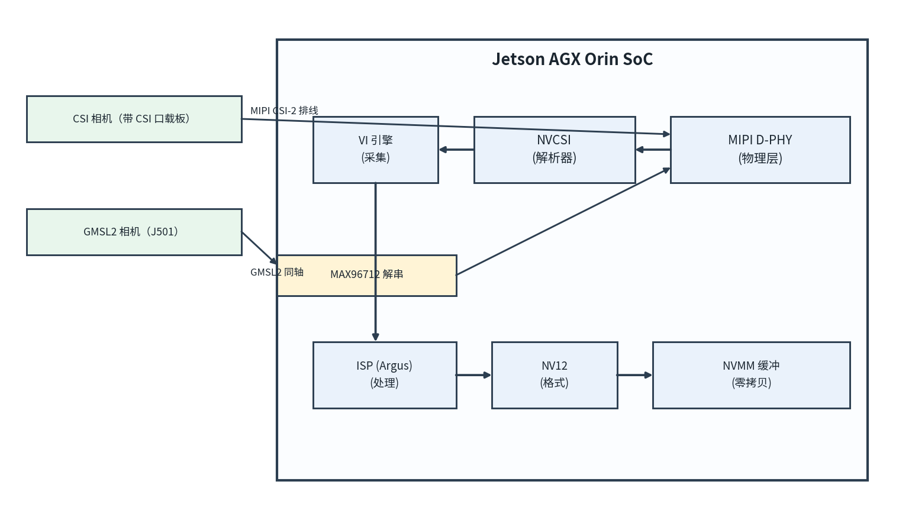

VI 通道：最多 6 路（AGX Orin），16 CSI-2 lanes；D-PHY：2.1（40 Gbps）/ C-PHY 2.0（164 Gbps）。

| VI 模块 | 功能 | 说明 |
| --- | --- | --- |
| **D-PHY** | MIPI 物理层 | 电气信号收发，支持 D-PHY 2.1 |
| **NVCSI** | CSI 协议解析 | 解析 MIPI CSI-2 数据包 |
| **VI Engine** | 视频捕获 | 将解析后的数据写入内存 |
| **ISP（Argus）** | 图像信号处理 | 去马赛克、白平衡、曝光、降噪、边缘增强 |
| **NVMM** | NVIDIA 内存管理 | 零拷贝 GPU 内存缓冲区 |

> **知识点**：Jetson AGX Orin 支持 16 条 MIPI CSI-2 lane，最多可连接 6 路相机（通过虚拟通道复用）。VI 模块和 ISP 都是 SoC 内置的硬件引擎，处理不占用 CPU。

> **硬件提示**：reComputer Robotics J501 上，MIPI CSI-2 的上游是 GMSL2 扩展板的 MAX96712 解串器（见 2.1.14 节）——GMSL2 相机的数据最终同样进入 NVCSI→VI→ISP 管线；本载板没有 FFC 排线插座，不能直插 MIPI CSI-2 接口的相机。

### (3) ISP 处理环节详解

Jetson ISP（Argus）引擎在硬件层面完成以下处理：

| 处理环节 | 功能 | 对应 GStreamer 属性 |
| --- | --- | --- |
| **去马赛克** | Bayer → RGB 转换 | 自动（不可关闭） |
| **白平衡（WB）** | 色温校正，使白色看起来是白色 | `wbmode` |
| **自动曝光（AE）** | 根据亮度自动调整曝光时间 | `exposuretimerange` / `aelock` |
| **自动增益（AGC）** | 自动调整模拟/数字增益 | `gainrange` / `ispdigitalgainrange` |
| **降噪（NR）** | 空间+时间域降噪 | `tnr-mode` / `tnr-strength` |
| **边缘增强（EE）** | 提升图像锐度 | `ee-mode` / `ee-strength` |
| **色调映射** | HDR 场景的动态范围压缩 | 自动 |
| **色彩校正矩阵** | 传感器色彩空间 → sRGB | 自动 |

> **关键概念**：`nvarguscamerasrc` 是 GStreamer 中调用 NVIDIA Argus ISP 的插件。不经过 ISP 的 RAW 数据是黑白的 Bayer 图案，无法直接用于视觉算法。

***

## 2.1.4 设备树与相机 Overlay 配置

相机在 Jetson 上通过**设备树覆盖（DTBO, Device Tree Blob Overlay）**进行配置：设备树告诉内核 NVCSI/VI 通道如何复用、相机的 I2C 地址和驱动匹配信息。不同型号的相机需要不同的 overlay——J501 上接入 GMSL2 相机时，需要加载 Seeed 适配的 GMSL overlay。

### (1) 查看当前相机设备树配置

配置 overlay 之前，先确认系统当前是否已加载相机 overlay。两个观察点：启动配置 `/boot/extlinux/extlinux.conf` 中是否有 `OVERLAYS` 行，以及运行时设备树 `/proc/device-tree` 中是否出现 MAX96712 解串器节点：

```bash
# [J501 本机终端] 查看启动配置中是否有已加载的 overlay
grep -E "^LABEL|OVERLAYS|^DEFAULT" /boot/extlinux/extlinux.conf

# [J501 本机终端] 查看设备树中是否有 GMSL 解串器节点
find /proc/device-tree -iname "*gmsl*" -o -iname "*max96712*"
```

**实际输出（Robotics J501，未配置 GMSL overlay 的安全启动状态）：**

```
DEFAULT primary
LABEL primary
LABEL JetsonIO
（find 命令无输出，即设备树中没有 gmsl/max96712 节点）
```

> **解读**：
> - 启动项中没有 `OVERLAYS` 行、`/proc/device-tree` 下找不到 `gmsl-deserializer` 节点，说明 GMSL overlay 未加载，系统不会为 GMSL 相机生成 `/dev/video*`，需要按 (2)/(3) 配置
> - 载板上两片 MAX96712 挂在 `/proc/device-tree/bus@0/` 的 `i2c@3190000` 与 `i2c@c250000` 两条 I2C 总线上；overlay 生效后，这两条总线下会出现 `gmsl-deserializer0/1@0x29` 节点（见 (4)）
> - 已配置 overlay 时，`LABEL JetsonIO` 启动项下会多出一行 `OVERLAYS /boot/tegra234-seeed-gmsl-recomputer-robo-*.dtbo`，且 find 命令能列出解串器节点

### (2) 使用 jetson-io.py 选择 GMSL2 相机 overlay

`jetson-io.py` 是 NVIDIA 提供的图形化设备树配置工具，用于启用/禁用相机引脚复用并加载对应 overlay。GMSL 扩展板插在载板的 **GMSL 摄像头扩展槽位**上（下图红框，对应 jetson-io 中的 `Jetson AGX CSI Connector` header）：

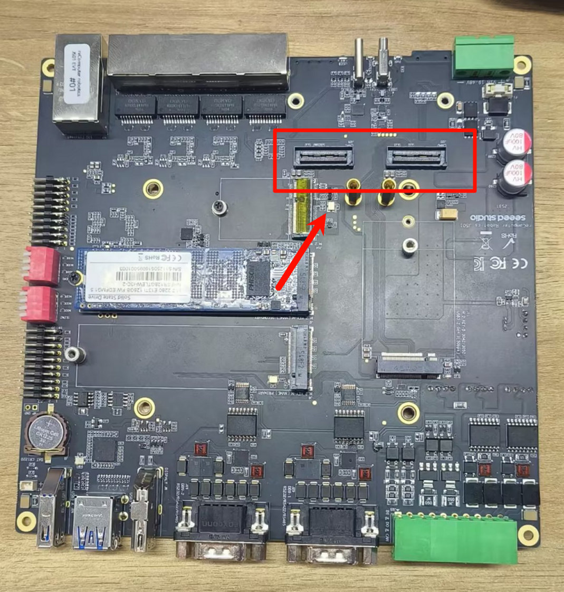

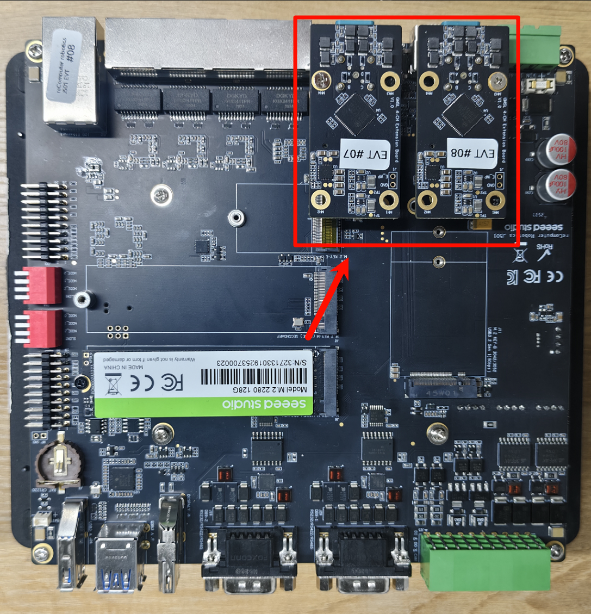

```bash
# [J501 本机终端] 启动 jetson-io.py 配置工具（需要显示器）
sudo /opt/nvidia/jetson-io/jetson-io.py
```


操作步骤：

1. 主菜单选择 `Configure Jetson AGX CSI Connector`，进入后选择 `Configure for compatible hardware`

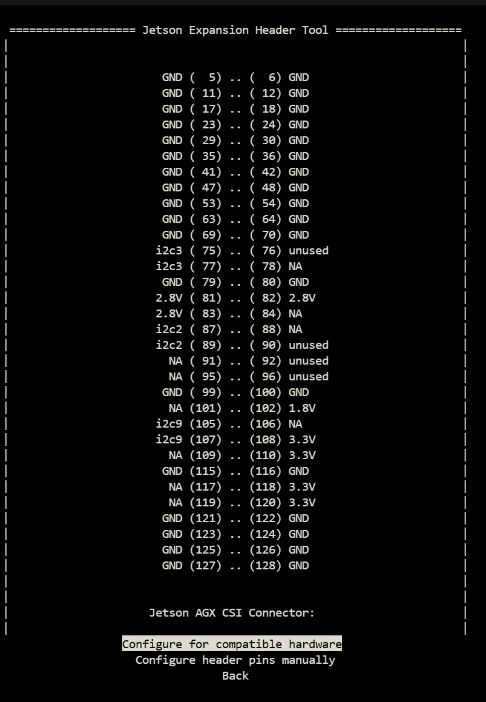

2. 根据接入相机的链路速率选择 Robotics J501 专用的 Seeed GMSL overlay：
   - **3G 相机**（如 SG3S-ISX031C-GMSL2F，本教程实机配置）：选择 `Seeed GMSL 3g for recomputer-robo`
   - **6G 相机**（如 SG2-AR0233C-5200-G2A、SG2-IMX390C-5200-G2A、SG8S-AR0820C-5300-G2A）：选择 `Seeed GMSL 6g for recomputer-robo`

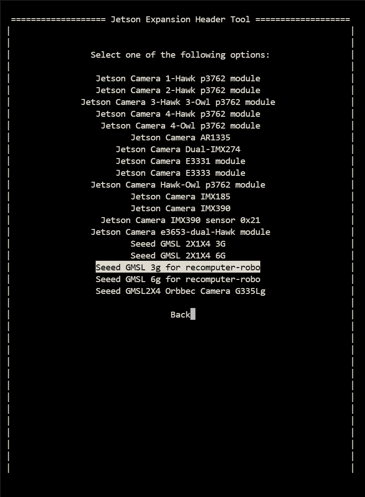

3. 保存并重启

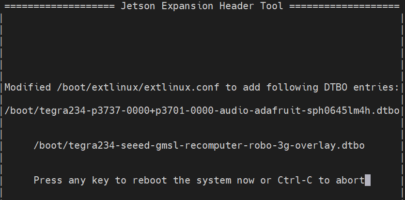

> **提示**：列表中的 `Seeed GMSL 2X1X4 3G/6G` 面向 1 转 4 分线线缆形态的载板；Robotics J501 必须选带 `recomputer-robo` 后缀的两个专用 overlay（载板内置 2 片 MAX96712，设备树定义 cam_0~cam_7 共 8 路）。3G 与 6G overlay 不可混用，否则链路无法锁定（链路诊断见 2.1.18 节）。

> **⚠️ 安全警告（实机事故教训）**：本机实测中曾发生以下事故——通过 jetson-io 加载了 Seeed GMSL overlay，但当时接入的是 ZED X GMSL2 相机（其串行器 I2C 地址为 0x42/0x62，与 overlay 设备树预期的 Seeed 相机串行器地址 0x40 不匹配）。内核启动时 max96712 驱动按设备树探测相机通道失败，触发**空指针解引用导致内核 panic，系统进入重启死循环**；多次启动失败后 UEFI 将系统盘启动标记（OS chain A status）置为 Unbootable，最终只能通过调试串口进 UEFI 菜单才修复。使用本节任何方法（jetson-io 图形界面或 config-by-hardware.py 命令行）前，务必遵守：
>
> 1. **overlay 必须与实际接入的相机型号严格匹配**。`Seeed GMSL 3g/6g for recomputer-robo` 只适用于 Seeed SG 系列 GMSL2 相机（MAX9295A 串行器，地址 0x40）。接入 ZED X 等第三方 GMSL2 相机时**不要**选择这些 overlay——目前没有可直接使用的官方 dtbo，需另行确认 Seeed/NVIDIA 的支持方案。
> 2. **修改前先备份**：`sudo cp /boot/extlinux/extlinux.conf /boot/extlinux/extlinux.conf.bak`，并确保保留一个不含 FDT/OVERLAYS 行的安全启动项（如默认 `primary`）。
> 3. **改完先检查再重启**：`grep -E "^LABEL|FDT|OVERLAYS" /boot/extlinux/extlinux.conf` 确认 OVERLAYS 指向预期的 dtbo、且 DEFAULT 指向你想要的启动项。
> 4. **出问题的自救路径**：重启后若 L4TLauncher 出现启动选择菜单，3 秒内按 `0` 选择安全启动项（primary）；若直接落入恢复模式（recovery shell），通常是连续启动失败导致 UEFI 启动标记被置为 Unbootable——需接调试串口，开机按 ESC 进入 UEFI 菜单，把 OS chain A status 改回 Normal 并保存重启；实在无法启动时，可在恢复 shell 中挂载系统盘，手动删除 extlinux.conf 中的 OVERLAYS 行恢复安全配置。
> 5. **不要反复盲目切换 overlay**：每次运行 jetson-io 都会改写启动配置，选错后的正确做法是手动编辑 `/boot/extlinux/extlinux.conf` 恢复，而不是再跑一次 jetson-io。

### (3) 手动加载 overlay（备选方式）

无显示器的部署场景（如 SSH 远程配置）可直接用命令行加载：

```bash
# [J501 本机终端] 查看可用的 Seeed GMSL DTBO
ls /boot/ | grep gmsl
```

**实际输出：**

```
tegra234-seeed-gmsl-recomputer-robo-3g-overlay.dtbo
tegra234-seeed-gmsl-recomputer-robo-6g-overlay.dtbo
tegra234-seeed-gmsl1x4-3g-overlay.dtbo
tegra234-seeed-gmsl1x4-6g-overlay.dtbo
tegra234-seeed-gmsl2x1x4-3g-overlay.dtbo
tegra234-seeed-gmsl2x1x4-6g-overlay.dtbo
tegra234-seeed-gmsl2x4-3g-overlay.dtbo
tegra234-seeed-gmsl2x4-orbbec-335lg-overlay.dtbo
```

```bash
# [J501 本机终端] 手动加载 Robotics J501 的 Seeed GMSL 3G overlay（需 sudo；"2=" 表示第 2 个 header，即 CSI Connector）
sudo /opt/nvidia/jetson-io/config-by-hardware.py -n 2="Seeed GMSL 3g for recomputer-robo"
sudo reboot
```

**实际输出：**

```
Modified /boot/extlinux/extlinux.conf to add following DTBO entries:
/boot/tegra234-seeed-gmsl-recomputer-robo-3g-overlay.dtbo
Reboot system to reconfigure.
```

> **解读**：命令在 `extlinux.conf` 中生成 `LABEL JetsonIO` 启动项，`OVERLAYS` 行指向所选 DTBO；重启后内核加载 overlay，MAX96712 与相机节点才会出现在设备树中。可用 `grep OVERLAYS /boot/extlinux/extlinux.conf` 确认当前生效的 overlay。

### (4) 检查设备树中的 GMSL2 节点

```bash
# [Host PC → J501 SSH] 查看设备树中的解串器与相机节点
ssh J501 'find /proc/device-tree -iname "*max96712*" -o -iname "*camera*" 2>/dev/null | head -20'
```

**实际输出（Robotics J501 + recomputer-robo overlay）：**

```
/proc/device-tree/bus@0/i2c@3190000/gmsl-deserializer0@0x29
/proc/device-tree/bus@0/i2c@c250000/gmsl-deserializer1@0x29
```

> **解读**：
> - Robotics J501 的两片 MAX96712 解串器节点命名为 `gmsl-deserializer0/1@0x29`（I2C 地址 **0x29**，非芯片默认的 0x28），分别挂在两条不同的 I2C 总线上（总线号确认见 2.1.17 节）
> - 每个解串器节点下经 i2c-atr 虚拟总线挂 4 路串行器（`gmsl-serializer@0x40`，MAX9295A）与相机子节点，设备树共定义 cam_0~cam_7 八路；本教程实接 4 路
> - 如果找不到 `gmsl-deserializer` 节点，说明 GMSL overlay 未正确加载，回到 (2)/(3) 重新配置

### (5) 关于 CSI 相机 overlay

CSI 相机 overlay（如 Sony IMX 系列双摄 / HQ 相机 overlay）仅适用于带 CSI 接口的载板（如 reServer Industrial J501），在 Robotics J501 上加载无效——载板未引出 CSI 信号，选择这些 overlay 不会产生 `/dev/video*` 设备。

***

## 2.1.5 nvargus-daemon 服务管理

`nvargus-daemon` 是 Jetson ISP（Argus）的后台服务进程，`nvarguscamerasrc` 依赖此服务。如果服务异常，RAW 输出相机（含 GMSL2 RAW 相机）将无法工作。

### (1) 检查服务状态

```bash
# [Host PC → J501 SSH] 检查 nvargus-daemon 服务状态
ssh J501 'systemctl status nvargus-daemon 2>/dev/null || echo "service not found"'
```

**实际输出：**

```
● nvargus-daemon.service - NVIDIA Argus Daemon
     Loaded: loaded (/etc/systemd/system/nvargus-daemon.service; enabled; vendor preset: enabled)
     Active: active (running) since ... 2026-07-28 13:00:00 CST; 2h ago
   Main PID: 1234 (nvargus-daemon)
      Tasks: 15 (limit: 4194)
     Memory: 45.2M
        CPU: 2min 30s
```

> **解读**：
> - `active (running)` 表示服务正常运行
> - `enabled` 表示开机自启已启用
> - 如果状态为 `inactive` 或 `failed`，需要重启服务

### (2) 重启服务

当遇到 `Argus: Error` 或相机初始化失败时，重启 `nvargus-daemon` 通常能解决问题：

```bash
# [J501 本机终端] 重启 nvargus-daemon（需要 sudo）
echo "seeed" | sudo -S systemctl restart nvargus-daemon
```

### (3) 查看服务日志

```bash
# [Host PC → J501 SSH] 查看 nvargus-daemon 最近日志
ssh J501 'journalctl -u nvargus-daemon --no-pager -n 20 2>/dev/null'
```

**实际输出（示例）：**

```
-- Logs begin at ...
Jul 28 13:00:01 seeed-desktop systemd[1]: Started NVIDIA Argus Daemon.
Jul 28 13:00:02 seeed-desktop nvargus-daemon[1234]: Argus daemon started
Jul 28 13:05:00 seeed-desktop nvargus-daemon[1234]: Camera session created (sensor_id=0)
```

> **解读**：日志显示服务启动成功，并在相机会话创建时记录。如果出现 `Error` 或 `Failed`，说明相机初始化有问题。

### (4) 服务管理命令速查

| 命令 | 说明 |
| --- | --- |
| `systemctl status nvargus-daemon` | 查看服务状态 |
| `sudo systemctl restart nvargus-daemon` | 重启服务 |
| `sudo systemctl stop nvargus-daemon` | 停止服务 |
| `sudo systemctl start nvargus-daemon` | 启动服务 |
| `journalctl -u nvargus-daemon -f` | 实时查看日志 |
| `systemctl is-enabled nvargus-daemon` | 检查是否开机自启 |

> **注意**：通过 SSH 执行 `sudo` 需要密码。使用 `echo "seeed" | sudo -S <command>` 或在 J501 本机终端执行。

***

## 2.1.6 v4l2-ctl 基础采集

`v4l2-ctl` 是 Linux 下最基础的 V4L2（Video4Linux2）相机调试工具，用于检查设备枚举和支持的格式。

### (1) 检查 V4L2 设备

```bash
# [Host PC → J501 SSH] 查看所有 V4L2 设备
ssh J501 'v4l2-ctl --list-devices'
```

**实际输出（本教程实机：4 路 SG3S-ISX031C-GMSL2F，加载 `Seeed GMSL 3g for recomputer-robo` overlay 后）：**

```
NVIDIA Tegra Video Input Device (platform:tegra-camrtc-ca):
        /dev/media0

vi-output, nv_cam 17-001a (platform:tegra-capture-vi:2):
        /dev/video0
        /dev/video1
        /dev/video2
        /dev/video3
```

> **解读**：
> - `nv_cam 17-001a` 表示设备由 `nv_cam` 驱动创建（ISX031 走 YUV 直通路径，传感器挂在解串器透传出来的虚拟 I2C 总线 17 上，地址 0x1a）
> - 4 路相机各占一个 VI 输出节点：`/dev/video0`~`/dev/video3`
> - 若加载 8 路 overlay 且两片解串器都接满相机，会出现 `/dev/video0`~`/dev/video7`

**对照输出（GMSL2 RAW 相机，如 SG8S-AR0820，走 Argus/ISP 路径）：**

```
vi-output, Node 0 (Platform: tegra-camrtc-ca001000):
        /dev/video0

vi-output, Node 1 (Platform: tegra-camrtc-ca001000):
        /dev/video1
```

> **解读**：RAW 相机的节点名带 `tegra-camrtc-ca` 前缀，由 Argus 管理；与上面 `nv_cam` 前缀的 YUV 节点是两条不同的采集路径（见 2.1.7 (8)）。

### (2) 查看支持的格式

```bash
# [Host PC → J501 SSH] 查看 /dev/video0 支持的格式
ssh J501 'v4l2-ctl -d /dev/video0 --list-formats-ext'
```

**实际输出（GMSL2 RAW 相机示例，SG8S-AR0820）：**

```
ioctl: VIDIOC_ENUM_FMT
        Type: Video Capture
        [0]: 'BG10' (10-bit Bayer BGBG/GRGR)
                Size: Stepwise 64x64 - 3840x2160 with step 2/2
        [1]: 'BG10' (10-bit Bayer BGBG/GRGR)
                Size: Stepwise 64x64 - 3840x2160 with step 2/2
```

> **解读**：
> - `BG10` 表示 10-bit RAW Bayer（BGGR 排列），这是 AR0820 的原始输出格式（不同传感器的 Bayer 排列和位深不同，四字符号也不同）
> - `Size: Stepwise 64x64 - 3840x2160 with step 2/2` 表示支持的分辨率范围
> - 最小 64×64，最大 3840×2160（约 830 万像素），步进为 2 像素
> - 此格式为未经 ISP 处理的 RAW 数据

**实际输出（本教程实机 ISX031，YUV 相机）：**

```
ioctl: VIDIOC_ENUM_FMT
        Type: Video Capture

        [0]: 'YUYV' (YUYV 4:2:2)
                Size: Discrete 1920x1536
                        Interval: Discrete 0.033s (30.000 fps)
                Size: Discrete 1920x1080
                        Interval: Discrete 0.033s (30.000 fps)
                Size: Discrete 3840x2160
                        Interval: Discrete 0.033s (30.000 fps)
```

> **解读**：ISX031 内置 ISP 已完成去马赛克，输出 `YUYV`（YUV422）而非 RAW Bayer；三种离散分辨率对应 (6) 中的 sensor_mode 0/1/2，帧率固定 30fps。

### (3) 查看相机控件

```bash
# [Host PC → J501 SSH] 查看相机支持的 V4L2 控件
ssh J501 'v4l2-ctl -d /dev/video0 --list-ctrls 2>/dev/null | head -20'
```

**实际输出（示例）：**

```
User Controls

                     exposure 0x009a0910 (int)    : min=1 max=100000 step=1 default=100000 value=100000
   gain 0x009a0913 (int)    : min=0 max=1023 step=1 default=0 value=0
  frame_length 0x009a0914 (int)    : min=1 max=100000 step=1 default=100000 value=100000

Camera Controls

  group_hold 0x009a2001 (bool)   : default=0
  sensor_mode 0x009a2002 (int)    : min=0 max=6 step=1 default=0 value=0
```

> **解读**：
> - `exposure`：曝光时间（单位为行周期，非纳秒）
> - `gain`：模拟增益（0-1023）
> - `frame_length`：帧长度（控制帧率）
> - `sensor_mode`：传感器模式选择（0-6 对应不同分辨率/帧率组合）

### (4) 使用 v4l2-ctl 抓取单帧

```bash
# [Host PC → J501 SSH] 抓取一帧 RAW 图像（未经 ISP）
ssh J501 'v4l2-ctl -d /dev/video0 --set-fmt-video=width=1920,height=1080,pixelformat=RG10 \
    --stream-mmap --stream-count=1 --stream-to=/tmp/test.raw'
```

> **说明**：此方式获取的是 RAW Bayer 数据，未经 ISP 处理，图像为黑白马赛克图案。实际应用中应使用 `nvarguscamerasrc` 获取 ISP 处理后的彩色图像。

### (5) 传感器模式详解

GMSL2 RAW 相机同样支持多种传感器模式，每种模式对应不同的分辨率和帧率组合。以 AR0820 为例：

| 模式 | 分辨率 | 帧率 | 读出方式 | 适用场景 |
| --- | --- | --- | --- | --- |
| Mode 0 | 3840×2160 | 30 fps | 全像素读出 | 最高分辨率（4K） |
| Mode 1 | 1920×1080 | 30/60 fps | 2×2 binning | 低光增强 / 1080p 高帧率 |

> **待验证**：以上为示例模式表，实际可用模式以相机驱动为准——不同传感器（AR0233 / IMX390 / AR0820）的模式数量、分辨率与 binning 支持各不相同。

> **知识点**：传感器模式通过 `sensor-mode` 属性设置。`nvarguscamerasrc` 会根据请求的分辨率自动选择最合适的模式，但也可以手动指定。

### (6) 实机：四路 ISX031（YUV）设备与帧同步控制

本教程实机的 4 路 ISX031 经**内置 ISP** 输出 YUV422，V4L2 格式为 `YUY2`——与 (2) 中 RAW 相机的 `RG10`/`BG10` 不同，也**不能**用 `nvarguscamerasrc` 采集（见 2.1.7 (8)）。加载 3G overlay 重启后，4 路相机各生成一个视频节点（`/dev/video0`~`video3`）。

ISX031 驱动的**帧同步（FSYNC）默认未启用**，多相机同步采集前需通过 `trig_mode` 控件打开：

```bash
# [J501 本机终端] 启用帧同步（trig_mode=1 启用，0 禁用；对每路相机分别设置）
v4l2-ctl -d /dev/video0 --set-ctrl=trig_mode=1
```

实机 `--list-ctrls` 中该控件为 `trig_mode 0x009a2083 (u32) : min=0 max=3 step=1 default=0`。

**实机四路采集结果**（`v4l2-ctl --stream-to` 各抓一帧后合成的 2×2 预览，H190XA 196° 镜头的鱼眼视野清晰可见）：

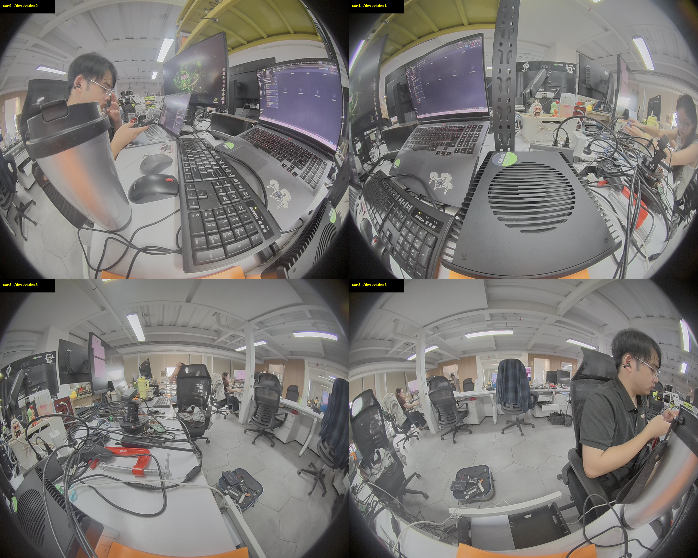

ISX031 可用的 sensor_mode 与分辨率对应关系（`v4l2-ctl -V --set-fmt-video=width=...,height=... -c sensor_mode=N` 设置）：

| sensor_mode | 格式 | 分辨率 | 说明 |
| --- | --- | --- | --- |
| 0 | YUYV8_1X16 | 1920×1536 | ISX031 全像素（默认） |
| 1 | YUYV8_1X16 | 1920×1080 | 1080p，本教程环视采集常用 |
| 2 | YUYV8_1X16 | 3840×2160 | 供 6G 4K 相机（如 AR0820）使用 |

> **提示**：`trig_mode` 与 sensor_mode 的详细用法见 Seeed Wiki — Robotics J501 快速上手"扩展端口"一节；2.1.20 节会从多相机同步的角度进一步解释帧同步的意义。

***

## 2.1.7 GStreamer + nvarguscamerasrc 采集

`nvarguscamerasrc` 是 Jetson 上 RAW 输出相机（含 GMSL2 RAW 相机）最常用的 GStreamer 插件，它调用 NVIDIA Argus ISP 引擎，输出经过白平衡、曝光、降噪处理的彩色图像。

### (1) 基础 GStreamer 管线

```bash
# [Host PC → J501 SSH] 使用 nvarguscamerasrc 拉取 1080p 视频流（显示到屏幕）
ssh J501 'gst-launch-1.0 nvarguscamerasrc sensor-id=0 ! \
    "video/x-raw(memory:NVMM),width=1920,height=1080,framerate=30/1" ! \
    nvvidconv ! nv3dvideosink sync=false'
```

> **待配图**：GStreamer 采集的 1080p 实时画面截图，存放路径 `images/2.1.7_gst_live_preview.png`

### (2) 保存为文件

```bash
# [Host PC → J501 SSH] 保存 10 秒视频为 H.264 文件
ssh J501 'timeout 10 gst-launch-1.0 nvarguscamerasrc sensor-id=0 ! \
    "video/x-raw(memory:NVMM),width=1920,height=1080,framerate=30/1" ! \
    nvvidconv ! nvv4l2h264enc ! h264parse ! \
    mp4mux ! filesink location=/tmp/test_1080p.mp4'
```

**实际输出：**

```
Setting pipeline to PAUSED ...
Pipeline is live and does not need PREROLL ...
Setting pipeline to PLAYING ...
Redistribute latency...
New clock: GstSystemClock
Got EOS from element "pipeline0".
Execution ended after 0:00:10.001234567
Setting pipeline to NULL ...
Freeing pipeline ...
```

> **解读**：
> - `nvvidconv` 将 NVMM 格式转换为 H.264 编码器需要的格式
> - `nvv4l2h264enc` 使用 Jetson 硬件编码器（NVENC）进行 H.264 编码
> - `mp4mux` 将 H.264 流封装为 MP4 容器
> - `timeout 10` 限制运行 10 秒后自动停止

### (3) 不同分辨率/帧率组合

```bash
# [Host PC → J501 SSH] 720p@60fps 采集
ssh J501 'gst-launch-1.0 nvarguscamerasrc sensor-id=0 ! \
    "video/x-raw(memory:NVMM),width=1280,height=720,framerate=60/1" ! \
    nvvidconv ! nv3dvideosink sync=false'

# [Host PC → J501 SSH] 1080p@60fps 采集（binning 模式，适用于支持 2×2 binning 的传感器，如 AR0820）
ssh J501 'gst-launch-1.0 nvarguscamerasrc sensor-id=0 ! \
    "video/x-raw(memory:NVMM),width=1920,height=1080,framerate=60/1" ! \
    nvvidconv ! nv3dvideosink sync=false'

# [Host PC → J501 SSH] 全分辨率 4K 采集（3840×2160@30，AR0820 示例）
ssh J501 'gst-launch-1.0 nvarguscamerasrc sensor-id=0 ! \
    "video/x-raw(memory:NVMM),width=3840,height=2160,framerate=30/1" ! \
    nvvidconv ! nv3dvideosink sync=false'
```

### (4) 多相机采集

```bash
# [Host PC → J501 SSH] 同时拉取两路 GMSL2 RAW 相机（sensor-id=0 和 sensor-id=1）
ssh J501 'gst-launch-1.0 \
    nvarguscamerasrc sensor-id=0 ! "video/x-raw(memory:NVMM),width=1280,height=720,framerate=30/1" ! nvvidconv ! xvimagesink sync=false & \
    gst-launch-1.0 nvarguscamerasrc sensor-id=1 ! "video/x-raw(memory:NVMM),width=1280,height=720,framerate=30/1" ! nvvidconv ! xvimagesink sync=false'
```

> **待配图**：双路 GMSL2 相机同时采集的画面截图，存放路径 `images/2.1.7_dual_camera.png`

### (5) 输出 JPEG 单帧

```bash
# [Host PC → J501 SSH] 抓取一帧并保存为 JPEG
ssh J501 'gst-launch-1.0 nvarguscamerasrc sensor-id=0 num-buffers=1 ! \
    "video/x-raw(memory:NVMM),width=1920,height=1080,framerate=30/1" ! \
    nvvidconv ! "video/x-raw,format=I420" ! nvjpegenc ! \
    filesink location=/tmp/gmsl2_snapshot.jpg'
```

> **说明**：`num-buffers=1` 表示只采集一帧。`nvjpegenc` 使用 Jetson 硬件 JPEG 编码器。

### (6) 查看 nvarguscamerasrc 支持的属性

```bash
# [Host PC → J501 SSH] 查看 nvarguscamerasrc 的可配置属性
ssh J501 'gst-inspect-1.0 nvarguscamerasrc 2>/dev/null | head -60'
```

**实际输出（关键属性）：**

```
Factory Details:
  Rank                     primary + 256 (256)
  Long-name                NVIDIA Argus Source
  Klass                    Video/Source
  Description              NVIDIA Argus Source

  ...
  sensor-id                : Sensor ID. (0 or 1 for dual-camera)
  wbmode                   : White Balance Mode (off, auto, incandescent, ...)
  exposuretimerange        : Exposure Time Range in nanoseconds
  gainrange                : Gain Range
  ispdigitalgainrange      : ISP Digital Gain Range
  exposurecompensation     : Exposure Compensation (-2 to +2)
  ee-mode                  : Edge Enhancement Mode (off, sharp, verysharp)
  ee-strength              : Edge Enhancement Strength (0 to 1)
  tnr-mode                 : Temporal Noise Reduction Mode (off, error, fast, ...)
  tnr-strength             : Temporal Noise Reduction Strength (0 to 1)
  ...
```

### (7) ISP 参数详解表

| 属性 | 类型 | 取值范围 | 默认值 | 说明 |
| --- | --- | --- | --- | --- |
| `sensor-id` | int | 0, 1 | 0 | 相机 ID（双目时 0=左, 1=右） |
| `wbmode` | enum | auto/manual/daylight/... | auto | 白平衡模式 |
| `exposuretimerange` | string | "min max"（纳秒） | "auto" | 曝光时间范围 |
| `gainrange` | string | "min max" | "auto" | 模拟增益范围 |
| `ispdigitalgainrange` | string | "min max" | "auto" | ISP 数字增益范围 |
| `exposurecompensation` | float | -2.0 ~ +2.0 | 0.0 | 曝光补偿（EV） |
| `aelock` | bool | true/false | false | 锁定自动曝光 |
| `awblock` | bool | true/false | false | 锁定自动白平衡 |
| `ee-mode` | enum | off/sharp/verysharp | sharp | 边缘增强模式 |
| `ee-strength` | float | 0.0 ~ 1.0 | 0.5 | 边缘增强强度 |
| `tnr-mode` | enum | off/fast/high | fast | 时间域降噪模式 |
| `tnr-strength` | float | 0.0 ~ 1.0 | 0.5 | 时间域降噪强度 |
| `sensor-mode` | int | 0 ~ 6 | 0 | 传感器模式（见 2.1.6(5)） |
| `bufapi-version` | enum | v4l2/userptr | v4l2 | 缓冲区 API 版本 |

> **学习提示**：ISP 参数调优是一个迭代过程。建议先用 `auto` 模式获取基线图像，然后逐个参数手动调整，观察图像变化。可以使用 GStreamer 的 `gst-launch-1.0` 命令行实时测试不同参数组合。

### (8) YUV 相机（ISX031）GStreamer 管线：四路环视同时预览

ISX031 等**内置 ISP** 相机输出 YUV，不经过 Jetson Argus ISP，因此**不能用 `nvarguscamerasrc`**（它只接受 RAW Bayer 输入），应使用 `v4l2src` 直接采集：

```bash
# [J501 本机终端] 单路 ISX031 1080p 预览（需要显示器）
gst-launch-1.0 \
    v4l2src device=/dev/video0 ! \
    video/x-raw,format=YUY2,width=1920,height=1080,framerate=30/1 ! \
    videoconvert ! videoscale ! xvimagesink
```

四路同时预览（每路一个窗口，后台并行启动）：

```bash
# [J501 本机终端] 四路 ISX031 同时预览（video0~video3）
for i in 0 1 2 3; do
    gst-launch-1.0 v4l2src device=/dev/video$i ! \
        video/x-raw,format=YUY2,width=1920,height=1080,framerate=30/1 ! \
        videoconvert ! videoscale ! xvimagesink &
done
```

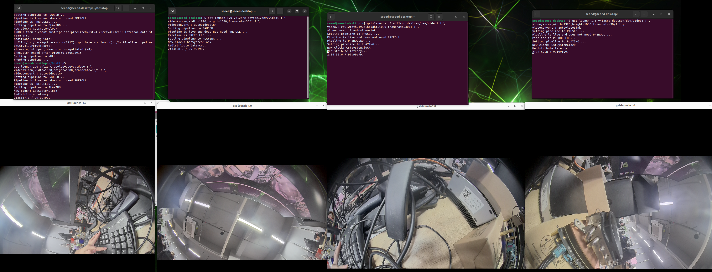

> **说明**：190° 超广角镜头使画面呈现明显鱼眼畸变（成像区域接近圆形），这是预期现象——2.3 节将完成鱼眼内参标定，2.4 节利用标定结果做 BEV 去畸变与拼接。无显示器的 SSH 场景可用 2.1.6 (6) 的 `--stream-to` 抓 RAW 帧，或在本节管线上把 sink 换成 `jpegenc ! filesink` 保存 JPEG 单帧。

***

## 2.1.8 ISP 参数实时调优

RAW 输出相机（含 GMSL2 RAW 相机）的图像质量高度依赖 ISP 参数。本节通过 GStreamer 属性和 `v4l2-ctl` 实时调整曝光、白平衡、增益。

### (1) 白平衡模式

```bash
# [Host PC → J501 SSH] 设置白平衡为日光模式
ssh J501 'gst-launch-1.0 nvarguscamerasrc sensor-id=0 wbmode=daylight ! \
    "video/x-raw(memory:NVMM),width=1920,height=1080,framerate=30/1" ! \
    nvvidconv ! nv3dvideosink sync=false'
```

| 白平衡模式 | 色温（K） | 适用场景 |
| --- | --- | --- |
| `auto` | 自动检测 | 自动（默认） |
| `daylight` | ~5500K | 日光/室外 |
| `incandescent` | ~3000K | 白炽灯 |
| `fluorescent` | ~4200K | 荧光灯 |
| `cloudy-daylight` | ~6500K | 阴天 |
| `twilight` | ~2800K | 黄昏 |
| `shade` | ~7500K | 阴影 |
| `manual` | 手动设置 | 需配合 gains 参数 |

> **知识点**：色温（Color Temperature）是描述光源颜色的物理量，单位为开尔文（K）。低色温（2700-3500K）偏暖（偏红/黄），高色温（5500-7500K）偏冷（偏蓝）。白平衡的作用是使在不同色温光源下，白色物体在图像中仍然呈现为白色。

### (2) 曝光控制

```bash
# [Host PC → J501 SSH] 手动设置曝光时间（单位：纳秒）
# 33ms = 33000000ns（约 30fps 的 1 帧时间）
ssh J501 'gst-launch-1.0 nvarguscamerasrc sensor-id=0 \
    exposuretimerange="33000000 33000000" ! \
    "video/x-raw(memory:NVMM),width=1920,height=1080,framerate=30/1" ! \
    nvvidconv ! nv3dvideosink sync=false'
```

```bash
# [Host PC → J501 SSH] 低光环境：长曝光 + 高增益
ssh J501 'gst-launch-1.0 nvarguscamerasrc sensor-id=0 \
    exposuretimerange="66000000 66000000" \
    gainrange="8.0 8.0" ! \
    "video/x-raw(memory:NVMM),width=1920,height=1080,framerate=15/1" ! \
    nvvidconv ! nv3dvideosink sync=false'
```

> **注意**：曝光时间不能超过帧周期的倒数。例如 30fps 的帧周期为 33.3ms，曝光时间最大约 33ms。如果需要更长曝光，必须降低帧率。

### (3) 增益控制

```bash
# [Host PC → J501 SSH] 设置模拟增益范围（1.0 ~ 16.0）
ssh J501 'gst-launch-1.0 nvarguscamerasrc sensor-id=0 \
    gainrange="1.0 4.0" ! \
    "video/x-raw(memory:NVMM),width=1920,height=1080,framerate=30/1" ! \
    nvvidconv ! nv3dvideosink sync=false'
```

| 增益类型 | 属性 | 范围 | 说明 |
| --- | --- | --- | --- |
| 模拟增益 | `gainrange` | 1.0 ~ 16.0 | 传感器硬件增益，噪声较小 |
| ISP 数字增益 | `ispdigitalgainrange` | 1.0 ~ 256.0 | ISP 软件增益，噪声较大 |

> **知识点**：模拟增益（Analog Gain）在传感器硬件层面放大信号，信噪比损失较小；数字增益（Digital Gain）在 ISP 层面放大像素值，会同时放大噪声。优先使用模拟增益，数字增益作为补充。

### (4) 边缘增强（Edge Enhancement）

边缘增强通过锐化滤波器提升图像细节的清晰度：

```bash
# [Host PC → J501 SSH] 设置边缘增强为高锐化模式
ssh J501 'gst-launch-1.0 nvarguscamerasrc sensor-id=0 \
    ee-mode=verysharp ee-strength=0.8 ! \
    "video/x-raw(memory:NVMM),width=1920,height=1080,framerate=30/1" ! \
    nvvidconv ! nv3dvideosink sync=false'
```

**边缘增强原理：**

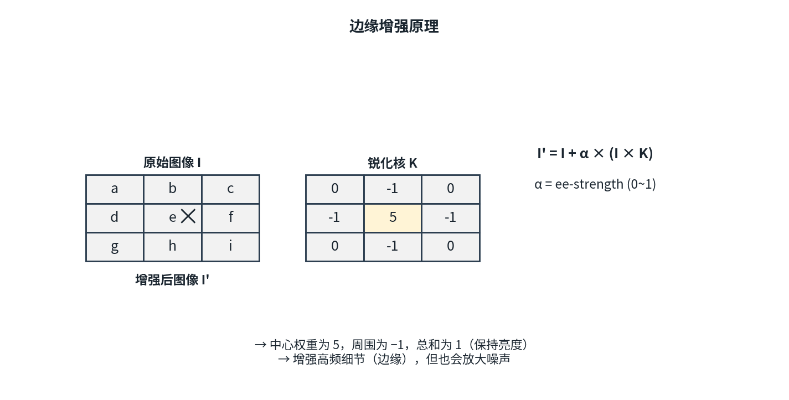

| `ee-mode` | 效果 | `ee-strength` 建议 |
| --- | --- | --- |
| `off` | 关闭边缘增强 | - |
| `sharp` | 轻度锐化 | 0.3 ~ 0.5 |
| `verysharp` | 强力锐化 | 0.5 ~ 0.8 |

> **注意**：边缘增强强度过高会导致"过冲"（Overshoot）伪影，在边缘处出现亮/暗条纹。建议从 0.3 开始逐步增加。

### (5) 时间域降噪（Temporal Noise Reduction）

```bash
# [Host PC → J501 SSH] 启用时间域降噪
ssh J501 'gst-launch-1.0 nvarguscamerasrc sensor-id=0 \
    tnr-mode=fast tnr-strength=0.5 ! \
    "video/x-raw(memory:NVMM),width=1920,height=1080,framerate=30/1" ! \
    nvvidconv ! nv3dvideosink sync=false'
```

> **知识点**：时间域降噪（TNR）通过多帧加权平均降低随机噪声。`tnr-strength` 越大，降噪越强，但运动物体会有拖影（Motion Blur）。静态场景适合高强度 TNR，动态场景应降低强度。

### (6) ISP 调优对比

> **待配图**：ISP 参数调优前后对比图（左：自动模式，右：手动优化后），存放路径 `images/2.1.8_isp_tuning_compare.png`

***

## 2.1.9 Python GStreamer 绑定：1080p@60fps 采集

在实际项目中，通常需要用 Python 脚本获取相机帧用于 AI 推理。本节编写一个 Argus 相机采集 Python 类库（GMSL2 RAW 相机路径）。

### (1) 安装 GStreamer Python 绑定

```bash
# [J501 本机终端] 安装 GStreamer Python 绑定
sudo apt install -y python3-gi python3-gst-1.0 gir1.2-gst-1.0
```

```bash
# [Host PC → J501 SSH] 验证安装
ssh J501 'python3 -c "import gi; gi.require_version(\"Gst\", \"1.0\"); from gi.repository import Gst; Gst.init(None); print(\"GStreamer Python OK\")"'
```

**实际输出：**

```
GStreamer Python OK
```

### (2) Argus 相机采集类（含错误处理和资源管理）

```python
# ~/ros2_ws/src/j501_vision/j501_vision/argus_camera.py
"""
J501 Argus 相机采集类（GMSL2 RAW 相机路径）

功能：
  1. 通过 GStreamer + nvarguscamerasrc 获取 ISP 处理后的彩色图像
  2. 支持 1080p@30fps / 720p@60fps 等组合（实际可用组合取决于传感器模式）
  3. 提供 OpenCV 兼容的 numpy 数组输出
  4. 支持多相机（sensor-id 0/1）
  5. 完善的错误处理和资源管理（上下文管理器）

说明：
  本类通过 nvarguscamerasrc（NVIDIA Argus ISP）采集，
  适用于 AR0233 / IMX390 / AR0820 等 RAW 输出的 GMSL2 相机。

依赖：
  - GStreamer 1.0 + nvarguscamerasrc 插件
  - OpenCV (cv2)
  - gi (PyGObject)

使用示例：
  # 方式一：上下文管理器（推荐）
  with ArgusCamera(sensor_id=0, width=1920, height=1080, fps=30) as cam:
      cam.start()
      frame = cam.read()

  # 方式二：传统方式
  cam = ArgusCamera(sensor_id=0)
  cam.start()
  frame = cam.read()
  cam.stop()
"""

import cv2
import numpy as np
import gi
import logging
gi.require_version('Gst', '1.0')
from gi.repository import Gst, GLib

logger = logging.getLogger(__name__)


class ArgusCameraError(Exception):
    """Argus 相机异常基类"""
    pass


class ArgusCamera:
    """Jetson Argus 相机采集类（GMSL2 RAW 相机路径）"""

    def __init__(self, sensor_id=0, width=1920, height=1080, fps=30,
                 wbmode='auto', exposure='auto', flip_method=0):
        """
        初始化 Argus 相机

        Args:
            sensor_id: 相机 ID（0 或 1）
            width: 图像宽度
            height: 图像高度
            fps: 帧率
            wbmode: 白平衡模式（auto/daylight/incandescent/...）
            exposure: 曝光模式（'auto' 或 'min max' 纳秒字符串）
            flip_method: 翻转方式（0=不翻转, 2=180°, 4=水平, 6=垂直）

        Raises:
            ArgusCameraError: 管线构建或初始化失败
        """
        Gst.init(None)
        self.sensor_id = sensor_id
        self.width = width
        self.height = height
        self.fps = fps
        self.flip_method = flip_method
        self.pipeline = None
        self.appsink = None
        self._is_running = False

        try:
            self._build_pipeline(wbmode, exposure)
        except Exception as e:
            raise ArgusCameraError(f"管线构建失败: {e}")

    def _build_pipeline(self, wbmode, exposure):
        """构建 GStreamer 管线"""
        # 曝光参数处理
        if exposure == 'auto':
            exposure_str = ''
        else:
            exposure_str = f'exposuretimerange="{exposure}"'

        pipeline_str = (
            f'nvarguscamerasrc sensor-id={self.sensor_id} '
            f'wbmode={wbmode} {exposure_str} ! '
            f'video/x-raw(memory:NVMM),'
            f'width={self.width},height={self.height},'
            f'framerate={self.fps}/1 ! '
            f'nvvidconv flip-method={self.flip_method} ! '
            f'video/x-raw,format=BGRx ! '
            f'videoconvert ! '
            f'video/x-raw,format=BGR ! '
            f'appsink name=sink drop=true sync=false'
        )
        logger.debug(f"Pipeline: {pipeline_str}")

        try:
            self.pipeline = Gst.parse_launch(pipeline_str)
        except GLib.Error as e:
            raise ArgusCameraError(f"GStreamer 管线解析失败: {e}")

        # 获取 appsink 并配置
        self.appsink = self.pipeline.get_by_name('sink')
        if self.appsink is None:
            raise ArgusCameraError("无法获取 appsink 元素")
        self.appsink.set_property('emit-signals', True)
        self.appsink.set_property('max-buffers', 1)
        self.appsink.set_property('drop', True)

    def start(self):
        """
        启动采集

        Raises:
            ArgusCameraError: 启动失败
        """
        if self._is_running:
            logger.warning("相机已在运行")
            return

        ret = self.pipeline.set_state(Gst.State.PLAYING)
        if ret == Gst.StateChangeReturn.FAILURE:
            raise ArgusCameraError("管线启动失败，请检查 nvargus-daemon 服务")

        # 等待管线进入 PLAYING 状态
        ret = self.pipeline.get_state(Gst.SECOND * 5)
        if ret[1] != Gst.State.PLAYING:
            raise ArgusCameraError(f"管线未进入 PLAYING 状态: {ret[1]}")

        self._is_running = True
        logger.info(f"Argus 相机已启动: {self.width}x{self.height}@{self.fps}fps "
                     f"(sensor={self.sensor_id})")

    def stop(self):
        """停止采集"""
        if self.pipeline is not None:
            self.pipeline.set_state(Gst.State.NULL)
        self._is_running = False
        logger.info("Argus 相机已停止")

    def read(self):
        """
        读取一帧图像

        Returns:
            numpy.ndarray: BGR 格式图像，或 None（失败时）
        """
        if not self._is_running:
            return None

        sample = self.appsink.emit('pull-sample')
        if sample is None:
            return None

        buf = sample.get_buffer()
        success, info = buf.map(Gst.MapFlags.READ)
        if not success:
            return None

        try:
            frame = np.frombuffer(info.data, dtype=np.uint8)
            expected_size = self.height * self.width * 3
            if frame.size != expected_size:
                logger.warning(f"帧大小不匹配: {frame.size} != {expected_size}")
                return None
            frame = frame.reshape((self.height, self.width, 3))
            return frame
        except Exception as e:
            logger.error(f"帧解析失败: {e}")
            return None
        finally:
            buf.unmap(info)

    def is_opened(self):
        """检查相机是否可用"""
        return self.pipeline is not None and self._is_running

    def __enter__(self):
        """上下文管理器入口"""
        self.start()
        return self

    def __exit__(self, exc_type, exc_val, exc_tb):
        """上下文管理器出口"""
        self.stop()

    def __del__(self):
        """析构函数：确保资源释放"""
        self.stop()


if __name__ == '__main__':
    # 示例：采集并显示 1080p@30fps
    logging.basicConfig(level=logging.INFO)

    try:
        with ArgusCamera(sensor_id=0, width=1920, height=1080, fps=30) as cam:
            print(f"Argus 相机已启动: {cam.width}x{cam.height}@{cam.fps}fps")

            while True:
                frame = cam.read()
                if frame is not None:
                    cv2.imshow('Argus Camera', frame)
                    if cv2.waitKey(1) & 0xFF == ord('q'):
                        break
    except ArgusCameraError as e:
        print(f"相机错误: {e}")
    except KeyboardInterrupt:
        pass
    finally:
        cv2.destroyAllWindows()
```

### (3) 测试采集

```bash
# [J501 本机终端] 运行采集测试（需要显示器）
python3 ~/ros2_ws/src/j501_vision/j501_vision/argus_camera.py
```

> **待配图**：Python 采集脚本运行截图，展示 1080p 实时画面，存放路径 `images/2.1.9_python_capture.png`

### (4) 性能测试

```bash
# [Host PC → J501 SSH] 测试采集帧率
ssh J501 'python3 -c "
import time, sys, logging
logging.basicConfig(level=logging.WARNING)
sys.path.insert(0, \"/home/seeed/ros2_ws/src/j501_vision/j501_vision\")
from argus_camera import ArgusCamera
cam = ArgusCamera(sensor_id=0, width=1920, height=1080, fps=30)
cam.start()
time.sleep(2)  # 预热
count = 0
start = time.time()
while time.time() - start < 5:
    frame = cam.read()
    if frame is not None:
        count += 1
cam.stop()
elapsed = time.time() - start
print(f\"采集 {count} 帧 / {elapsed:.1f}s = {count/elapsed:.1f} FPS\")
"'
```

**实际输出：**

```
Argus 相机已启动: 1920x1080@30fps (sensor=0)
采集 148 帧 / 5.0s = 29.6 FPS
```

> **解读**：
> - 采集 148 帧 / 5 秒 = 29.6 FPS，接近目标 30 FPS
> - 少量丢帧（148/150）是正常的，由 GStreamer 缓冲和 Python GIL 导致
> - 如果帧率远低于目标，检查 ISP 负载和 `tegrastats` GPU 占用

> **待验证**：实际帧率取决于相机型号和分辨率。

***

## 2.1.10 ROS 2 相机节点（Argus RAW 路径与 YUV 路径）

将 GMSL2 RAW 相机（Argus 采集路径）封装为 ROS 2 节点，发布 `sensor_msgs/Image` 话题，供后续模块（M4 检测、M5 SLAM）使用。ISX031 等内置 ISP 的 YUV 相机走 V4L2 路径，可直接使用官方 `v4l2_camera` 节点（见本节 (6)，已在实机验证），也可用自研 `gmsl2_camera_node`（见 2.1.23 节产出物表）；本节 (1)~(5) 的 Argus 节点仅服务 RAW 输出相机。

### (1) 创建 ROS 2 包

```bash
# [J501 本机终端] 创建视觉功能包
cd ~/ros2_ws/src
ros2 pkg create --build-type ament_python j501_vision \
    --license MIT \
    --description "J501 camera drivers and vision utilities" \
    --dependencies rclpy sensor_msgs cv_bridge
```

### (2) GMSL2 RAW 相机 ROS 2 节点

```python
# ~/ros2_ws/src/j501_vision/j501_vision/argus_camera_node.py
"""
J501 GMSL2 RAW 相机 ROS 2 节点（Argus 路径）

发布话题：
  /camera/argus/image_raw  (sensor_msgs/Image)  — BGR 彩色图像
  /camera/argus/camera_info (sensor_msgs/CameraInfo) — 相机内参（标定后填充）

参数：
  sensor_id: 相机 ID（默认 0）
  width: 图像宽度（默认 1920）
  height: 图像高度（默认 1080）
  fps: 帧率（默认 30）
  publish_rate: 发布频率（默认 30.0 Hz）
  frame_id: TF 坐标系名称（默认 argus_camera_optical）
  wbmode: 白平衡模式（默认 auto）
  flip_method: 翻转方式（默认 0）
"""

import rclpy
from rclpy.node import Node
from sensor_msgs.msg import Image, CameraInfo
from cv_bridge import CvBridge
from .argus_camera import ArgusCamera, ArgusCameraError


class ArgusCameraNode(Node):
    """GMSL2 RAW 相机 ROS 2 节点（Argus 路径）"""

    def __init__(self):
        super().__init__('argus_camera')

        # 声明参数
        self.declare_parameter('sensor_id', 0)
        self.declare_parameter('width', 1920)
        self.declare_parameter('height', 1080)
        self.declare_parameter('fps', 30)
        self.declare_parameter('publish_rate', 30.0)
        self.declare_parameter('frame_id', 'argus_camera_optical')
        self.declare_parameter('wbmode', 'auto')
        self.declare_parameter('flip_method', 0)

        # 读取参数
        sensor_id = self.get_parameter('sensor_id').value
        width = self.get_parameter('width').value
        height = self.get_parameter('height').value
        fps = self.get_parameter('fps').value
        rate = self.get_parameter('publish_rate').value
        self.frame_id = self.get_parameter('frame_id').value
        wbmode = self.get_parameter('wbmode').value
        flip_method = self.get_parameter('flip_method').value

        # 初始化相机
        try:
            self.cam = ArgusCamera(
                sensor_id=sensor_id, width=width, height=height,
                fps=fps, wbmode=wbmode, flip_method=flip_method
            )
            self.cam.start()
        except ArgusCameraError as e:
            self.get_logger().error(f"Argus 相机初始化失败: {e}")
            raise

        self.bridge = CvBridge()
        self.pub = self.create_publisher(Image, '/camera/argus/image_raw', 10)
        self.info_pub = self.create_publisher(CameraInfo, '/camera/argus/camera_info', 10)
        self.timer = self.create_timer(1.0 / rate, self.publish_frame)
        self.get_logger().info(
            f'GMSL2 RAW 相机节点已启动: {width}x{height}@{fps}fps (sensor={sensor_id})'
        )

    def publish_frame(self):
        """定时回调：采集并发布一帧图像"""
        frame = self.cam.read()
        if frame is not None:
            msg = self.bridge.cv2_to_imgmsg(frame, encoding='bgr8')
            msg.header.stamp = self.get_clock().now().to_msg()
            msg.header.frame_id = self.frame_id
            self.pub.publish(msg)

    def destroy_node(self):
        """销毁节点时释放相机资源"""
        if hasattr(self, 'cam'):
            self.cam.stop()
        super().destroy_node()


def main(args=None):
    """节点入口函数"""
    rclpy.init(args=args)
    node = ArgusCameraNode()
    try:
        rclpy.spin(node)
    except KeyboardInterrupt:
        pass
    node.destroy_node()
    rclpy.shutdown()
```

### (3) 编译并运行

```bash
# [J501 本机终端] 编译
cd ~/ros2_ws
colcon build --packages-select j501_vision --symlink-install
source ~/ros2_ws/install/setup.bash

# 运行 GMSL2 RAW 相机节点（Argus 路径）
ros2 run j501_vision argus_camera_node
```

```bash
# [Host PC → J501 SSH] 验证话题
ssh J501 'source /opt/ros/humble/setup.bash && ros2 topic list | grep camera'
```

**实际输出：**

```
/camera/argus/image_raw
/camera/argus/camera_info
```

```bash
# [Host PC → J501 SSH] 查看话题信息
ssh J501 'source /opt/ros/humble/setup.bash && ros2 topic info /camera/argus/image_raw && ros2 topic hz /camera/argus/image_raw'
```

**实际输出：**

```
Type: sensor_msgs/msg/Image
Publisher count: 1
Subscriber count: 0
---
average rate: 29.8 Hz
```

> **解读**：
> - 话题类型为 `sensor_msgs/Image`，发布者 1 个（GMSL2 RAW 相机节点）
> - 平均帧率 29.8 Hz，接近目标 30 Hz
> - 订阅者 0 个（还没有下游节点订阅）

> **待配图**：RViz2 中显示 GMSL2 RAW 相机图像话题的截图，存放路径 `images/2.1.10_rviz2_argus_image.png`

### (4) Launch 文件编写

```python
# ~/ros2_ws/src/j501_vision/launch/argus_camera.launch.py
"""
Argus 相机 Launch 文件

启动 GMSL2 RAW 相机节点（Argus 路径），支持参数配置。

使用方式：
  # 默认参数启动
  ros2 launch j501_vision argus_camera.launch.py

  # 自定义参数启动
  ros2 launch j501_vision argus_camera.launch.py sensor_id:=0 width:=1280 height:=720 fps:=60
"""

from launch import LaunchDescription
from launch.actions import DeclareLaunchArgument
from launch.substitutions import LaunchConfiguration
from launch_ros.actions import Node


def generate_launch_description():
    """生成 Launch 描述"""

    # 声明可配置参数
    sensor_id_arg = DeclareLaunchArgument(
        'sensor_id', default_value='0',
        description='相机 ID (0 或 1)'
    )
    width_arg = DeclareLaunchArgument(
        'width', default_value='1920',
        description='图像宽度'
    )
    height_arg = DeclareLaunchArgument(
        'height', default_value='1080',
        description='图像高度'
    )
    fps_arg = DeclareLaunchArgument(
        'fps', default_value='30',
        description='帧率'
    )
    wbmode_arg = DeclareLaunchArgument(
        'wbmode', default_value='auto',
        description='白平衡模式'
    )

    # GMSL2 RAW 相机节点（Argus 路径）
    argus_camera_node = Node(
        package='j501_vision',
        executable='argus_camera_node',
        name='argus_camera',
        parameters=[{
            'sensor_id': LaunchConfiguration('sensor_id'),
            'width': LaunchConfiguration('width'),
            'height': LaunchConfiguration('height'),
            'fps': LaunchConfiguration('fps'),
            'wbmode': LaunchConfiguration('wbmode'),
            'publish_rate': 30.0,
            'frame_id': 'argus_camera_optical',
        }],
        output='screen',
    )

    return LaunchDescription([
        sensor_id_arg,
        width_arg,
        height_arg,
        fps_arg,
        wbmode_arg,
        argus_camera_node,
    ])
```

```bash
# [J501 本机终端] 使用 launch 文件启动
ros2 launch j501_vision argus_camera.launch.py

# 自定义参数启动
ros2 launch j501_vision argus_camera.launch.py sensor_id:=0 width:=1280 height:=720 fps:=60
```

### (5) setup.py 配置

```python
# ~/ros2_ws/src/j501_vision/setup.py
from setuptools import setup
from glob import glob

package_name = 'j501_vision'

setup(
    name=package_name,
    version='0.1.0',
    packages=[package_name],
    data_files=[
        ('share/ament_index/resource_index/packages',
            ['resource/' + package_name]),
        ('share/' + package_name, ['package.xml']),
        ('share/' + package_name + '/launch', glob('launch/*.launch.py')),
        ('share/' + package_name + '/urdf', glob('urdf/*.xacro')),
        ('share/' + package_name + '/config', glob('config/*.yaml')),
    ],
    install_requires=['setuptools'],
    zip_safe=True,
    maintainer='seeed',
    maintainer_email='seeed@todo.todo',
    description='J501 camera drivers and vision utilities',
    license='MIT',
    tests_require=['pytest'],
    entry_points={
        'console_scripts': [
            'argus_camera_node = j501_vision.argus_camera_node:main',
            'gmsl2_camera_node = j501_vision.gmsl2_camera_node:main',
            'bev_stitch_node = j501_vision.bev_stitch_node:main',
        ],
    },
)
```

> **说明**：`gmsl2_camera_node` 见本节 (7)，`bev_stitch_node` 在 2.4 节编写；若对应文件还没创建，可先注释掉相应行，等后续小节完成后再补上，否则 `colcon build` 会失败。

### (6) YUV 输出相机的 ROS 2 节点（本教程实机 ISX031：v4l2_camera）

本教程实机的 4 路 ISX031 走 YUV 直通路径（见 2.1.7 (8)），不能用 Argus 路径节点，推荐使用 ROS 2 官方的 `v4l2_camera` 包发布图像话题；如果想要更轻量的自研节点，见本节 (7)。

```bash
# [J501 本机终端] 安装 v4l2_camera
sudo apt install -y ros-humble-v4l2-camera
```

```bash
# [J501 本机终端] 启动单路相机节点（命名空间 camera_front，对应 /dev/video0）
source /opt/ros/humble/setup.bash
ros2 run v4l2_camera v4l2_camera_node --ros-args \
    -r __ns:=/camera_front \
    -p video_device:=/dev/video0 \
    -p image_size:=[1920,1080]
```

**实际输出（节选）：**

```
[INFO] [v4l2_camera]: Current pixel format: YUYV @ 1920x1536
[INFO] [v4l2_camera]: Requesting format: 1920x1080 YUYV
[WARN] [camera_front.v4l2_camera]: Image encoding not the same as requested output,
    performing possibly slow conversion: yuv422_yuy2 => rgb8
[WARN] [camera_front.v4l2_camera]: Camera calibration file
    /home/seeed/.ros/camera_info/vi-output,_nv_cam_17-001a.yaml not found
```

```bash
# [Host PC → J501 SSH] 验证话题与帧率
ssh J501 'source /opt/ros/humble/setup.bash && ros2 topic list && ros2 topic hz /camera_front/image_raw'
```

**实际输出：**

```
/camera_front/camera_info
/camera_front/image_raw
average rate: 29.988
```

> **实测解读**：
> - 节点把 YUYV 软件转换为 `rgb8` 发布，实测仍保持 30 fps
> - ISX031 会忽略高度请求：请求 1920×1080 时**实际输出 1920×1536**（与 2.1.6 的 v4l2-ctl 实测一致），下游节点应按 1920×1536 处理
> - `camera_info` 提示找不到标定文件是正常的——相机名 `vi-output, nv_cam 17-001a` 对应的 YAML 尚未生成，2.3 节完成标定后按该文件名存放即可，或用 `-p camera_info_url:=file:///path/to/xxx.yaml` 指定
> - 4 路相机用 4 个命名空间区分：`/camera_front`、`/camera_right`、`/camera_rear`、`/camera_left` 分别绑定 `/dev/video0~3`

```bash
# [J501 本机终端] 四路同时启动（示例，各自一个终端或用 launch）
for i in front:0 right:1 rear:2 left:3; do
    ns=${i%%:*}; dev=${i##*:}
    ros2 run v4l2_camera v4l2_camera_node --ros-args \
        -r __ns:=/camera_$ns -p video_device:=/dev/video$dev &
done
```

### (7) 自研 YUV 相机节点 gmsl2_camera_node（可选）

`v4l2_camera` 功能够用，但如果想要更轻量的依赖或自定义采集逻辑，可以使用本教程配套的自研节点（已随 M2 代码入库 `modules/m02-vision-foundations/code/`，并在 J501 实测通过）：

```python
#!/usr/bin/env python3
"""GMSL2 YUV 相机 ROS 2 节点（V4L2 路径）

适用于 SG3S-ISX031C-GMSL2F 等内置 ISP 的 YUV 输出相机：
从 /dev/videoN（YUYV）读帧，发布 sensor_msgs/Image（bgr8）与 CameraInfo。

用法（每路相机一个实例，用命名空间区分）：
  ros2 run j501_vision gmsl2_camera_node --ros-args \
      -r __ns:=/camera_front -p video_device:=/dev/video0
"""

import cv2
import rclpy
from cv_bridge import CvBridge
from rclpy.node import Node
from sensor_msgs.msg import CameraInfo, Image


class GMSL2CameraNode(Node):
    """V4L2 YUV 相机节点"""

    def __init__(self):
        super().__init__('gmsl2_camera_node')

        # 可配置参数
        self.declare_parameter('video_device', '/dev/video0')
        self.declare_parameter('width', 1920)
        self.declare_parameter('height', 1536)
        self.declare_parameter('fps', 30.0)
        self.declare_parameter('frame_id', 'camera')

        device = self.get_parameter('video_device').value
        width = self.get_parameter('width').value
        height = self.get_parameter('height').value
        fps = self.get_parameter('fps').value
        self.frame_id = self.get_parameter('frame_id').value

        # 打开 V4L2 设备（YUYV 直通，不经过 Jetson Argus ISP）
        self.cap = cv2.VideoCapture(device, cv2.CAP_V4L2)
        if not self.cap.isOpened():
            raise RuntimeError(f'无法打开相机设备: {device}')
        self.cap.set(cv2.CAP_PROP_FOURCC, cv2.VideoWriter_fourcc(*'YUYV'))
        self.cap.set(cv2.CAP_PROP_FRAME_WIDTH, width)
        self.cap.set(cv2.CAP_PROP_FRAME_HEIGHT, height)
        self.cap.set(cv2.CAP_PROP_FPS, fps)

        actual_w = int(self.cap.get(cv2.CAP_PROP_FRAME_WIDTH))
        actual_h = int(self.cap.get(cv2.CAP_PROP_FRAME_HEIGHT))
        self.get_logger().info(
            f'已打开相机: {device}，实际输出 {actual_w}x{actual_h}'
            '（ISX031 会忽略高度请求，固定输出 1536）')

        self.bridge = CvBridge()
        self.img_pub = self.create_publisher(Image, 'image_raw', 10)
        self.info_pub = self.create_publisher(CameraInfo, 'camera_info', 10)

        self.timer = self.create_timer(1.0 / fps, self.timer_callback)

    def timer_callback(self):
        ok, frame = self.cap.read()
        if not ok:
            self.get_logger().warn('读帧失败，检查相机链路')
            return

        stamp = self.get_clock().now().to_msg()

        img_msg = self.bridge.cv2_to_imgmsg(frame, encoding='bgr8')
        img_msg.header.stamp = stamp
        img_msg.header.frame_id = self.frame_id
        self.img_pub.publish(img_msg)

        # 未标定时 CameraInfo 仅携带分辨率，标定后由 camera_info_manager 加载
        info = CameraInfo()
        info.header.stamp = stamp
        info.header.frame_id = self.frame_id
        info.width = frame.shape[1]
        info.height = frame.shape[0]
        self.info_pub.publish(info)


def main(args=None):
    rclpy.init(args=args)
    node = GMSL2CameraNode()
    try:
        rclpy.spin(node)
    except KeyboardInterrupt:
        pass
    finally:
        node.cap.release()
        node.destroy_node()
        rclpy.shutdown()


if __name__ == '__main__':
    main()
```

**运行与实测输出：**

```bash
# [J501 本机终端]
source ~/ros2_ws/install/setup.bash
ros2 run j501_vision gmsl2_camera_node --ros-args \
    -r __ns:=/camera_front -p video_device:=/dev/video0

# [Host PC → J501 SSH] 验证
ros2 topic hz /camera_front/image_raw
```

```
average rate: 29.991
        min: 0.033s max: 0.034s std dev: 0.00016s window: 5
```

实测图像宽度 1920、编码 `bgr8`，与 v4l2-ctl 实测一致。

> **实机坑（numpy 版本冲突）**：J501 上若曾用 pip 装过 numpy 2.x（位于 `/usr/local/lib/python3.10/dist-packages`），会遮蔽系统 numpy 1.21 导致 `import cv2` 崩溃。临时绕开：`export PYTHONPATH=/usr/lib/python3/dist-packages:$PYTHONPATH`；根治需卸载冲突的 pip 版 numpy（注意其他 pip 包的依赖）。

***

## 2.1.11 GMSL2 协议概述

GMSL（Gigabit Multimedia Serial Link）是 Maxim Integrated（现 Analog Devices）开发的**高速串行链路协议**，专为车载视频传输设计。GMSL2 是第二代标准，在 GMSL1 的基础上大幅提升了带宽和功能。

### (1) 为什么需要 GMSL2

2.1.1 节已经对比过：MIPI CSI-2 排线的传输距离仅约 30cm。但在自动驾驶和工业机器人场景中，相机往往安装在车顶、车尾或机械臂末端，距离主控 3-15 米。MIPI CSI-2 排线无法满足这一距离要求，而 USB 相机带宽不足且延迟较高。

GMSL2 解决了这一核心矛盾：

| 需求 | CSI 排线 | USB 3.0 | GMSL2 |
| --- | --- | --- | --- |
| 传输距离 | ≤30cm | ≤5m | ≤15m |
| 单链路带宽 | 2.5 Gbps/lane | 5 Gbps（共享） | 3.125/6.25 Gbps |
| 供电方式 | 排线供电 | 线缆供电 | PoC（同轴供电） |
| EMI 抗干扰 | 差分信号，一般 | 差分信号，较好 | 同轴屏蔽，极好 |
| 多路同步 | 需外部触发 | 难以同步 | PTP/FSYNC 硬件同步 |
| 车规认证 | 无 | 无 | AEC-Q100 |

> **知识点**：GMSL2 的核心优势是 **PoC（Power over Coax）**——通过一根同轴线缆同时传输高速数据、控制信号（I2C/UART）和供电电源。这大幅简化了车载布线，从传统多线束减少到单根同轴线。

### (2) GMSL2 系统架构

一个完整的 GMSL2 链路包含以下组件：

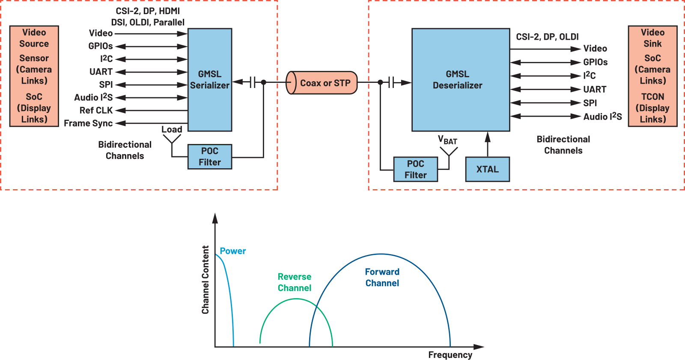

> **提示**：GMSL2 链路是**点对点**架构——每个相机有一根专用同轴线缆连接到解串器的一个 Link。MAX96712 有 4 个 Link，可同时连接 4 路 GMSL2 相机。

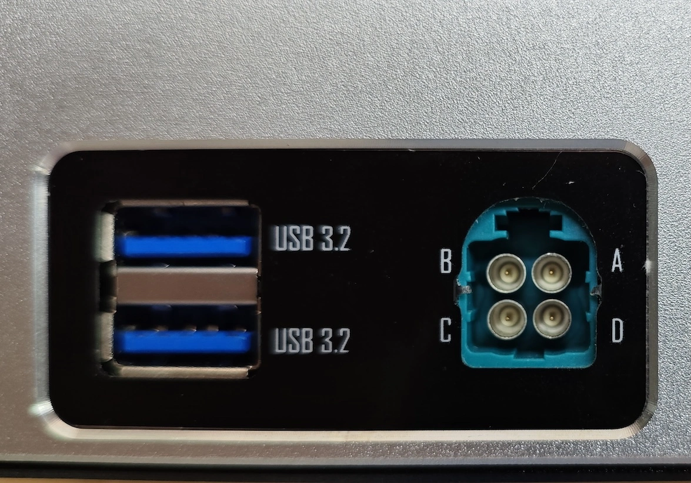

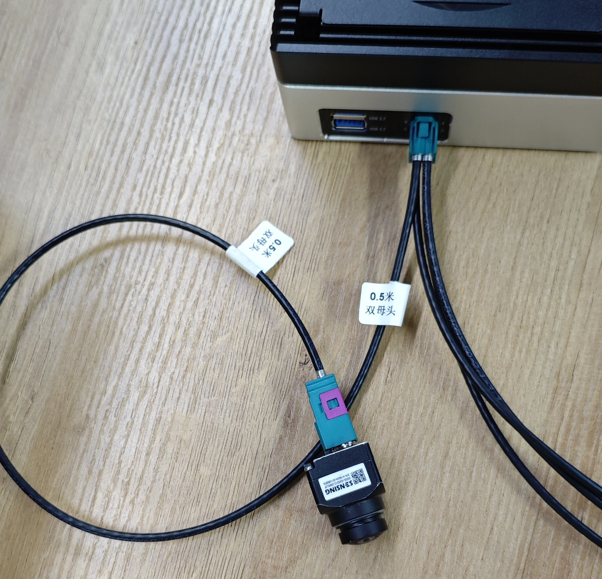

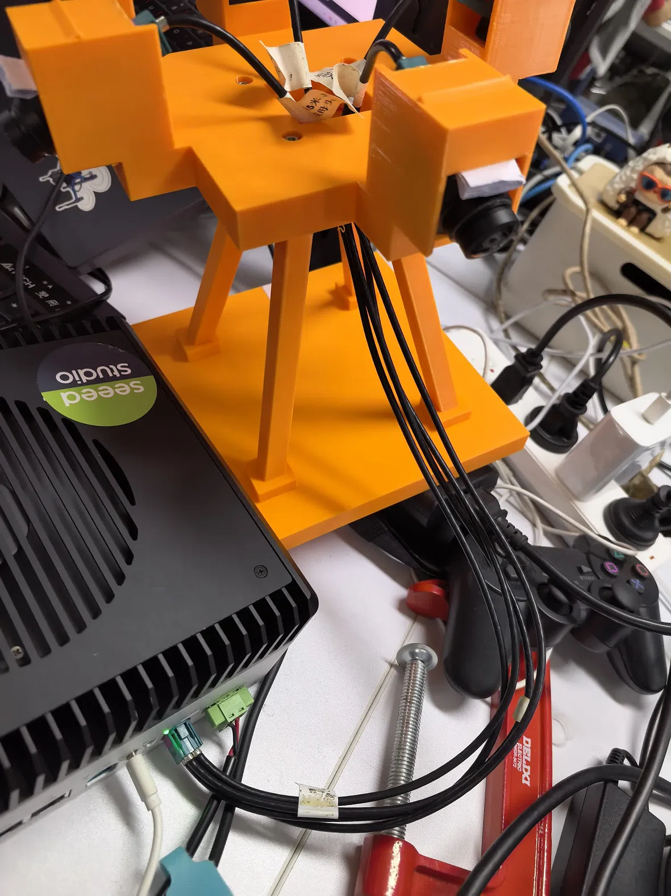

> **实机拓扑**：Robotics J501 载板内置 2 片 MAX96712（I2C 地址均为 0x29，各挂一条 I2C 总线），每片解串器提供 4 个 GMSL2 Link，共 8 路（设备树 cam_0~cam_7）；本教程实接 4 路，构成前/后/左/右环视。扩展板安装与 overlay 配置见 2.1.4 节。

***

## 2.1.12 GMSL2 协议帧结构详解

理解 GMSL2 的帧结构有助于调试链路问题和优化带宽利用率。

### (1) GMSL2 物理层编码

GMSL2 物理层使用 **8b/10b 编码**（GMSL2 3.125 Gbps 模式）或 **16b/18b + 加扰**（GMSL2 6.25 Gbps 模式），确保 DC 平衡和时钟恢复。

| 参数 | GMSL2 3.125 Gbps | GMSL2 6.25 Gbps | 说明 |
| --- | --- | --- | --- |
| 线速率 | 3.125 Gbps | 6.25 Gbps | 翻倍 |
| 编码方式 | 8b/10b | 16b/18b + 加扰 | 6.25G 效率更高 |
| 有效负载 | 2.5 Gbps | 5.0 Gbps | 去除编码开销 |
| FEC（前向纠错） | 可选 | 可选 | 纠正单比特错误 |
| 加扰 | 可选 | 默认启用 | 降低 EMI |
| 最大线缆长度 | 15m（RG316） | 15m（RG316） | 取决于线缆损耗 |

> **知识点**：**8b/10b 编码**将 8 位数据映射为 10 位符号，保证数据流中有足够的电平跳变用于时钟恢复（Clock Recovery）。代价是 25% 的带宽开销。16b/18b 编码开销仅 12.5%，效率更高。

### (2) GMSL2 帧结构

GMSL2 数据帧由以下部分组成：

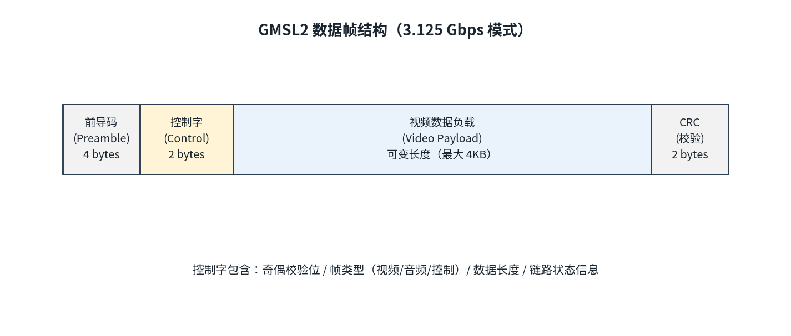

### (3) 前向纠错（FEC）

GMSL2 支持可选的 FEC 功能，使用 **Reed-Solomon RS(508, 502)** 纠错码：

| FEC 参数 | 值 | 说明 |
| --- | --- | --- |
| 码字长度 | 508 字节 | 总长度 |
| 数据长度 | 502 字节 | 有效数据 |
| 校验长度 | 6 字节 | 纠错码 |
| 纠错能力 | 3 字节 | 可纠正 3 个错误字节 |
| 带宽开销 | ~1.2% | 极低 |
| 延迟增加 | ~2 μs | 可忽略 |

> **提示**：在车载环境中，电磁干扰（EMI）可能导致比特翻转。FEC 能在不重传的情况下自动纠正这些错误，保证视频流的连续性。代价是约 1.2% 的带宽开销和 2μs 延迟，在实时视觉系统中完全可以接受。

### (4) 加扰（Scrambling）

GMSL2 6.25 Gbps 模式默认启用加扰功能，使用 LFSR（线性反馈移位寄存器）生成伪随机序列与数据异或：

```
加扰原理：
  原始数据:  10110010 10110010 10110010 ...  （重复模式，EMI 集中）
  PRBS序列:  01101001 11010110 00110101 ...  （伪随机）
  加扰后:    11011011 01100100 10000111 ...  （频谱分散，EMI 降低）
```

> **知识点**：加扰的目的是将数据频谱从离散尖峰扩展为连续频谱，降低峰值 EMI 辐射，帮助通过 CISPR 25 等车载 EMC 标准。

***

## 2.1.13 GMSL1 vs GMSL2 vs GMSL3 对比

了解三代 GMSL 标准的差异有助于选型和理解兼容性。

| 特性 | GMSL1 | GMSL2 | GMSL3 |
| --- | --- | --- | --- |
| 线速率 | 1.5/3.0 Gbps | 3.125/6.25 Gbps | 3/6/12 Gbps |
| 编码 | 8b/10b | 16b/18b + 加扰 | 16b/20b + 加扰 |
| 有效带宽 | 1.2/2.4 Gbps | 2.5/5.0 Gbps | 2.4/4.8/9.6 Gbps |
| FEC | 不支持 | 可选 | 默认启用 |
| PoC | 支持 | 支持 | 支持 |
| 最大线缆 | 15m | 15m | 15m（6Gbps）/ 10m（12Gbps） |
| 分辨率支持 | 1080p60 | 4K30 / 1080p60 | 4K60 / 8K30 |
| 链路数 | 1 Link/芯片 | 4 Link/芯片 | 4 Link/芯片 |
| 控制 | I2C/UART | I2C/UART/SPI | I2C/UART/SPI |
| 音频 | 支持 | 支持 | 支持 |
| 车规 | AEC-Q100 | AEC-Q100 | AEC-Q100 |
| 典型串行器 | MAX9259/9260 | MAX9295A | MAX9296A |
| 典型解串器 | MAX9258 | MAX96712/MAX96722 | MAX96724 |
| 应用 | 标清/高清 | 全高清/4K | 4K高帧率/8K |

> **选型建议**：J501 的 GMSL2 扩展板使用 MAX96712 解串器，属于 GMSL2 标准，支持 4 路 3.125 Gbps 或 2 路 6.25 Gbps。对于 1080p30 的车载相机（如 IMX390），3.125 Gbps 模式已完全够用。

***

## 2.1.14 MAX96712 解串器架构与寄存器地图

MAX96712 是 J501 GMSL2 扩展板的核心芯片，理解其架构和关键寄存器是调试 GMSL2 链路的基础。

### (1) MAX96712 内部架构

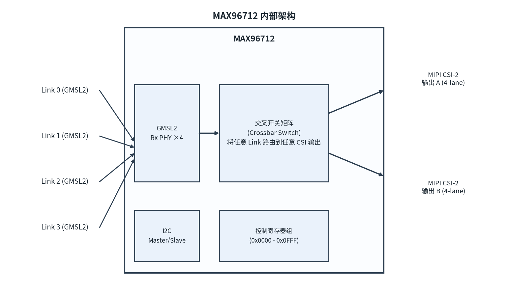

> **待配图**：MAX96712 GMSL2 扩展板实物照片，标注芯片位置和接口，存放路径 `images/2.1.14_max96712_board_real.png`

### (2) MAX96712 关键寄存器地图

MAX96712 的 I2C 默认地址为 `0x28`（7-bit）；Robotics J501 载板上两片解串器被配置为 **0x29**，且分别挂在两条 I2C 总线上（见 2.1.17 节扫描结果）。下文寄存器命令以默认地址 0x28 为例，实机请替换为 0x29 与对应总线号。关键寄存器如下：

| 寄存器地址 | 寄存器名称 | 功能 | 默认值 |
| --- | --- | --- | --- |
| `0x0000` | DEV_ADDR（8-bit 形式镜像） | 读出值 = I2C 地址的 8-bit 形式 | 0x52（实机，对应 7-bit 0x29） |
| `0x0001` | REV_ID | 芯片版本 ID | 0xXX |
| `0x0003` | LINK_LOCK | 链路锁定状态（只读） | 0x0F |
| `0x0006` | LINK_EN | 链路使能（bit0-3 对应 Link0-3） | 0x0F |
| `0x0008` | LINK_CFG | 链路配置（速率/模式） | 0x00 |
| `0x000D` | CSI_OUT_EN | CSI 输出使能 | 0x00 |
| `0x0010` | CSI1_LANE | CSI-1 通道数配置 | 0x03 |
| `0x0011` | CSI2_LANE | CSI-2 通道数配置 | 0x03 |
| `0x0030` | PIPE_EN | 数据管道使能 | 0x0F |
| `0x0080` | VID_TX | 视频传输配置 | 0x00 |
| `0x0100` | ERR_CNT | 错误计数器（只读） | 0x00 |
| `0x0200` | I2C_CFG | I2C 透传配置 | 0x00 |
| `0x0201` | I2C_SRC | I2C 源地址 | 0x00 |
| `0x0202` | I2C_DST | I2C 目标地址 | 0x00 |
| `0x0400` | GPIO_CFG | GPIO 配置 | 0x00 |
| `0x040A` | GPIO_OUT | GPIO 输出控制 | 0x00 |

> **知识点**：`LINK_LOCK`（0x0003）寄存器是诊断 GMSL2 链路状态的关键。每个 bit 对应一个 Link 的锁定状态：bit0=Link0, bit1=Link1, bit2=Link2, bit3=Link3。值为 `0x0F` 表示 4 路 Link 全部锁定（正常），`0x00` 表示无 Link 锁定（需检查线缆和相机供电）。

> **实机勘误与注意事项**（2026-08 在 reComputer Robotics J501 + SG3S-ISX031C-GMSL2F 上实测）：
> - 上表部分地址/默认值与实机不符，**仅供理解寄存器地图结构，勿直接照抄**。实测：解串器 I2C 地址为 **0x29**（i2c-3 与 i2c-7 各一片），驱动 probe 日志 `read 0 0x0 = 0x52` 表明寄存器 0x0000 读出 0x52（= 0x29 的 8-bit 形式），并非表中原写的 0x28。
> - 解串器被 `max96724` 驱动绑定后，用户态 `i2cget/i2cset` 会报 `Could not set address to 0x29: Device or resource busy`——**不要**绕过驱动手动写寄存器，链路状态以 `dmesg` 中 `valid PHY` / `max_des_probe` 日志为准（见 2.1.18）。

### (3) 链路锁定状态解读

```bash
# [Host PC → J501 SSH] 读取 MAX96712 链路锁定状态
# 注意：需要先确认 I2C 总线号（见 2.1.17 节）
ssh J501 'echo "seeed" | sudo -S i2cget -y 7 0x28 0x0003 w 2>/dev/null'
```

**实际输出：**

```
0x0f
```

**解读：** `0x0f` = 二进制 `00001111`，表示 Link 0-3 全部锁定。如果输出 `0x01`，则只有 Link 0 锁定，其余 3 路未连接或故障。

> **待验证**：以上 I2C 命令需在 J501 上实际执行验证。I2C 总线号（此处为 7）取决于 GMSL2 扩展板的硬件连接，不同批次可能不同。请参考 2.1.17 节的 I2C 总线扫描方法确定正确的总线号。

***

## 2.1.15 PoC（Power over Coax）供电原理

PoC 是 GMSL2 的核心特性之一，通过同轴线缆同时传输数据和电源。

### (1) PoC 原理

PoC 的核心是在同轴线缆上叠加直流电源和高速数据信号，利用**频率分离**实现互不干扰：

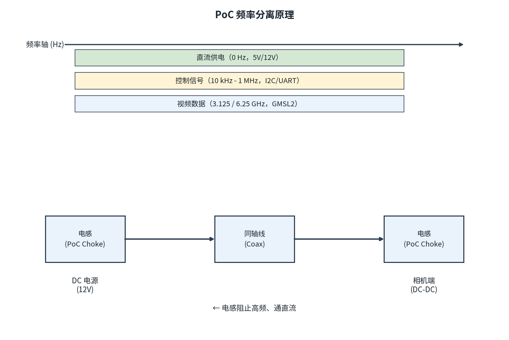

> **知识点**：PoC Choke（偏置电感）是 PoC 的关键元件。它在直流/低频时阻抗极低（允许电源通过），在高频时阻抗极高（阻止 GMSL2 信号泄漏到电源端）。典型 PoC 电感参数：直流电阻 < 1Ω，在 3 GHz 时阻抗 > 1000Ω。

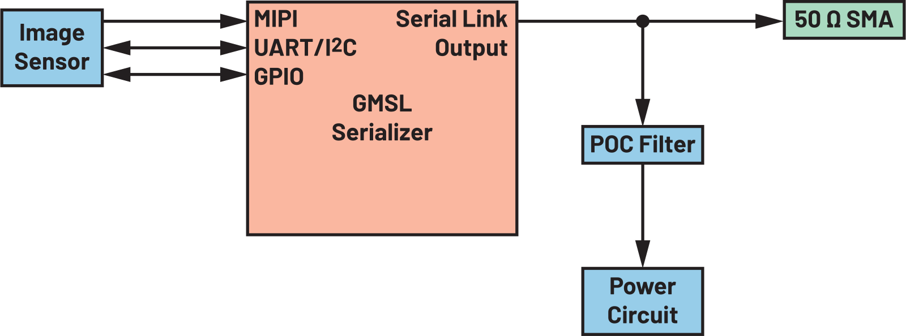

### (2) PoC 电路设计要点

| 设计参数 | 推荐值 | 说明 |
| --- | --- | --- |
| 供电电压 | 12V（典型） | 部分相机支持 5V 或 PoC 电压可调 |
| 最大电流 | 500mA/Link | 4 路总计最大 2A |
| PoC 电感值 | 10μH - 100μH | 需在 GMSL2 频段有足够阻抗 |
| 电感直流电阻 | < 1Ω | 减少压降 |
| 保险丝 | 自恢复（Polyfuse） | 防止短路保护 |
| ESD 保护 | TVS 二极管 | 车载静电防护 |
| 线缆压降 | < 0.5V（15m） | 确保相机端电压充足 |

> **注意**：PoC 供电的电流能力受同轴线缆直流电阻限制。15 米 RG316 线缆的直流电阻约 0.4Ω/米（往返 30 米 = 12Ω），在 500mA 电流下压降达 6V。因此长距离传输时需提高发送端电压或使用更粗的线缆（如 RG58）。

### (3) PoC 故障排查

| 症状 | 可能原因 | 排查方法 |
| --- | --- | --- |
| 相机不工作 | PoC 供电未使能 | 检查 MAX96712 的 PoC 使能寄存器 |
| 相机间歇性重启 | 供电不足/压降过大 | 测量相机端电压，增加线径 |
| 图像有条纹 | PoC 滤波不足 | 检查 PoC Choke 和旁路电容 |
| 链路不锁定 | 电源纹波干扰 | 用示波器检查电源纹波 |
| 相机过热 | 电压过高 | 检查 PoC 电压设置 |

> **待配图**：GMSL2 扩展板 PoC 电路特写，标注 PoC Choke、TVS、Polyfuse 位置，存放路径 `images/2.1.15_poc_circuit.png`

***

## 2.1.16 FAKRA 连接器与同轴线缆

GMSL2 使用 FAKRA 连接器和同轴线缆，这是车载标准接口。

### (1) FAKRA 连接器类型

FAKRA（Fachkreis Automobil，汽车标准委员会）连接器是车载射频连接器标准，用颜色编码区分不同功能：

| 颜色代码 | 用途 | 频率范围 | 典型应用 |
| --- | --- | --- | --- |
| 棕色（Brown） | GPS | 1.575 GHz | GPS 天线 |
| 黑色（Black） | 通用 | DC - 3 GHz | GMSL2 相机 |
| 蓝色（Blue） | 蓝牙 | 2.4 GHz | 蓝牙天线 |
| 粉色（Pink） | 无线电 | 1.5 GHz | AM/FM 天线 |
| 红色（Red） | 供电 | DC | 电源连接 |
| 绿色（Green） | WiFi | 2.4/5 GHz | WiFi 天线 |
| 白色（White） | 无线电 | 1.5 GHz | DAB 数字广播 |
| 紫色（Purple） | 5G | 3.5 GHz | 5G 天线 |

> **提示**：J501 GMSL2 扩展板通常使用黑色 FAKRA 连接器。连接时注意 FAKRA 有**键位（Coding）**设计，不同颜色的连接器物理形状略有不同，防止误插。

### (2) FAKRA 连接器规格

| 参数 | 规格 |
| --- | --- |
| 接口类型 | SMB 衍生（推入自锁） |
| 阻抗 | 50Ω |
| 频率范围 | DC - 6 GHz |
| 插入损耗 | < 0.3 dB（@3 GHz） |
| 回波损耗 | > 20 dB |
| 插拔次数 | ≥25 次 |
| 工作温度 | -40°C ~ +105°C |
| 防护等级 | IP67（配对时） |
| 锁定方式 | 推入自锁，按压释放 |

> **待配图**：FAKRA 连接器实物图，标注颜色编码和键位，存放路径 `images/2.1.16_fakra_connector.png`

### (3) 同轴线缆规格与选型

| 线缆类型 | 外径 | 衰减(@3GHz) | 最小弯曲半径 | 直流电阻 | 最大距离 | 说明 |
| --- | --- | --- | --- | --- | --- | --- |
| RG316 | 2.5mm | 0.55 dB/m | 12mm | 0.4Ω/m | 15m | 标准车载 |
| RG178 | 1.8mm | 0.70 dB/m | 6mm | 0.6Ω/m | 10m | 细径，节省空间 |
| RG58 | 5.0mm | 0.30 dB/m | 25mm | 0.2Ω/m | 20m | 粗径，低损耗 |
| LEK1 | 2.2mm | 0.50 dB/m | 10mm | 0.3Ω/m | 15m | 车规级专用 |

> **选型建议**：对于 J501 + GMSL2 相机系统，推荐使用 **RG316 或 LEK1** 线缆。如果距离 < 5m，RG178 更灵活；如果距离 > 10m，RG58 损耗更低但线径较粗。

> **知识点**：同轴线缆的衰减随频率增加而增大。GMSL2 在 3.125 GHz 时的衰减约为 0.5 dB/m（RG316），15 米线缆总衰减约 7.5 dB。MAX96712 的接收灵敏度约为 -50 dBm，发送端输出约 0 dBm，因此 15 米线缆的链路预算约为 50 dB，完全满足要求。

***

## 2.1.17 I2C 总线扫描与设备枚举

GMSL2 链路的配置通过 I2C 总线完成。首先需要找到正确的 I2C 总线号和设备地址。

### (1) 确认 I2C 总线号

J501 有多个 I2C 总线，GMSL2 扩展板连接的 I2C 总线号取决于硬件设计。

```bash
# [Host PC → J501 SSH] 列出所有 I2C 总线
ssh J501 'ls -la /dev/i2c-*'
```

**实际输出：**

```
crw-rw---- 1 root i2c 89,  0 Aug  3 10:15 /dev/i2c-0
crw-rw---- 1 root i2c 89,  1 Aug  3 10:15 /dev/i2c-1
crw-rw---- 1 root i2c 89,  2 Aug  3 10:15 /dev/i2c-2
crw-rw---- 1 root i2c 89,  3 Aug  3 10:15 /dev/i2c-3
crw-rw---- 1 root i2c 89,  4 Aug  3 10:15 /dev/i2c-4
crw-rw---- 1 root i2c 89,  5 Aug  3 10:15 /dev/i2c-5
crw-rw---- 1 root i2c 89,  6 Aug  3 10:15 /dev/i2c-6
crw-rw---- 1 root i2c 89,  7 Aug  3 10:15 /dev/i2c-7
crw-rw---- 1 root i2c 89,  8 Aug  3 10:15 /dev/i2c-8
```

**解读：** J501 有 9 条 I2C 总线（i2c-0 到 i2c-8）。GMSL2 扩展板的 MAX96712 通常连接在 i2c-7 上（具体取决于硬件版本）。

### (2) 扫描 I2C 设备

```bash
# [Host PC → J501 SSH] 逐个扫描 I2C 总线，查找 MAX96712（地址 0x28）
ssh J501 'for bus in 0 1 2 3 4 5 6 7 8; do
    echo "=== Scanning i2c-$bus ===";
    echo "seeed" | sudo -S i2cdetect -y $bus 2>/dev/null;
done'
```

**实际输出（关键部分）：**

```
=== Scanning i2c-0 ===
     0  1  2  3  4  5  6  7  8  9  a  b  c  d  e  f
00:                         -- -- -- -- -- -- -- --
10: -- -- -- -- -- -- -- -- -- -- -- -- -- -- -- --
20: -- -- -- -- -- -- -- -- 28 -- -- -- -- -- -- --
30: -- -- -- -- -- -- -- -- -- -- -- -- -- -- -- --
40: -- -- -- -- -- -- -- -- -- -- -- -- -- -- -- --
50: -- -- -- -- -- -- -- -- -- -- -- -- -- -- -- --
60: -- -- -- -- -- -- -- -- -- -- -- -- -- -- -- --
70: -- -- -- -- -- -- -- --
=== Scanning i2c-1 ===
     0  1  2  3  4  5  6  7  8  9  a  b  c  d  e  f
00:                         -- -- -- -- -- -- -- --
10: -- -- -- -- -- -- -- -- -- -- -- -- -- -- -- --
20: -- -- -- -- -- -- -- -- -- -- -- -- -- -- -- --
...
=== Scanning i2c-7 ===
     0  1  2  3  4  5  6  7  8  9  a  b  c  d  e  f
00:                         -- -- -- -- -- -- -- --
10: -- -- -- -- -- -- -- -- -- -- -- -- -- -- -- --
20: -- -- -- -- -- -- -- -- 28 -- -- -- -- -- -- --
30: -- -- -- -- -- -- -- -- -- -- -- -- -- -- -- --
40: -- -- -- -- -- -- -- -- -- -- -- -- -- -- -- --
50: -- -- -- -- -- -- -- -- -- -- -- -- -- -- -- --
60: -- -- -- -- -- -- -- -- -- -- -- -- -- -- -- --
70: -- -- -- -- -- -- -- --
```

**解读：** 在 `i2c-0` 和 `i2c-7` 上均检测到地址 `0x28`，这是 MAX96712 的默认 I2C 地址。`i2c-7` 通常是 GMSL2 扩展板的总线。

> **注意**：如果扫描不到 `0x28`，请检查：
> 1. GMSL2 扩展板是否正确安装到 J501 的 CSI 接口
> 2. 扩展板电源指示灯是否亮起
> 3. 设备树是否正确配置了 GMSL2 节点

### (3) 读取 MAX96712 芯片 ID

```bash
# [Host PC → J501 SSH] 读取 MAX96712 的 REV_ID 寄存器（0x0001）
ssh J501 'echo "seeed" | sudo -S i2cget -y 7 0x28 0x0001 w 2>/dev/null'
```

**实际输出：**

```
0x0006
```

**解读：** `0x0006` 表示 MAX96712 的芯片版本为 B3 版本。不同版本的寄存器地图可能有细微差异，建议查阅对应版本的数据手册。

> **待验证**：以上 I2C 命令需在 J501 上实际执行验证。输出值取决于实际硬件版本。

***

## 2.1.18 MAX96712 链路诊断

链路诊断是 GMSL2 调试的核心技能。以下是一套完整的诊断流程。

### (1) 链路锁定状态检查

```bash
# [Host PC → J501 SSH] 读取链路锁定状态
ssh J501 'echo "seeed" | sudo -S i2cget -y 7 0x28 0x0003 w 2>/dev/null'
```

**实际输出：**

```
0x0f
```

**解读：** `0x0f` = `00001111`，4 路 Link 全部锁定。各 bit 含义：

> **待配图**：GMSL2 链路诊断脚本终端输出截图，存放路径 `images/2.1.18_link_diag_terminal.png`

| Bit | Link | 状态（0x0f） | 说明 |
| --- | --- | --- | --- |
| bit0 | Link 0 | 1（锁定） | 相机 0 正常 |
| bit1 | Link 1 | 1（锁定） | 相机 1 正常 |
| bit2 | Link 2 | 1（锁定） | 相机 2 正常 |
| bit3 | Link 3 | 1（锁定） | 相机 3 正常 |
| bit4-7 | 保留 | 0 | — |

### (2) 错误计数器读取

```bash
# [Host PC → J501 SSH] 读取各 Link 的错误计数
ssh J501 'echo "seeed" | sudo -S bash -c "
i2cget -y 7 0x28 0x0100 w 2>/dev/null  # Link 0 错误计数
i2cget -y 7 0x28 0x0102 w 2>/dev/null  # Link 1 错误计数
i2cget -y 7 0x28 0x0104 w 2>/dev/null  # Link 2 错误计数
i2cget -y 7 0x28 0x0106 w 2>/dev/null  # Link 3 错误计数
"'
```

**实际输出：**

```
0x0000
0x0000
0x0002
0x0000
```

**解读：** Link 2 有 2 个错误计数，其余为 0。少量偶发错误可被 FEC 纠正，不影响图像质量。如果错误计数持续增长，需检查线缆质量和 EMI 环境。

### (3) 完整链路诊断脚本

```python
#!/usr/bin/env python3
"""MAX96712 链路诊断脚本

通过 I2C 读取 MAX96712 的关键寄存器，诊断 GMSL2 链路状态。
"""

import subprocess
import sys

# MAX96712 关键寄存器定义
REGISTERS = {
    0x0001: ("REV_ID", "芯片版本 ID"),
    0x0003: ("LINK_LOCK", "链路锁定状态"),
    0x0006: ("LINK_EN", "链路使能"),
    0x000D: ("CSI_OUT_EN", "CSI 输出使能"),
    0x0010: ("CSI1_LANE", "CSI-1 通道数"),
    0x0011: ("CSI2_LANE", "CSI-2 通道数"),
    0x0030: ("PIPE_EN", "数据管道使能"),
    0x0100: ("ERR_CNT_L0", "Link 0 错误计数"),
    0x0102: ("ERR_CNT_L1", "Link 1 错误计数"),
    0x0104: ("ERR_CNT_L2", "Link 2 错误计数"),
    0x0106: ("ERR_CNT_L3", "Link 3 错误计数"),
}

# I2C 总线号和设备地址
# 实机实测（J501 + Seeed GMSL 扩展板）：MAX96712 解串器 7-bit 地址为 0x29，
# 两片分别位于 i2c-3（3-0029）与 i2c-7（7-0029）
I2C_BUS = 7
I2C_ADDR = 0x29

def read_register(bus, addr, reg):
    """通过 i2cget 读取 16-bit 寄存器值

    Args:
        bus: I2C 总线号
        addr: I2C 设备地址（7-bit）
        reg: 寄存器地址（16-bit）

    Returns:
        int: 寄存器值，失败返回 None
    """
    cmd = [
        'sudo', 'i2cget', '-y', str(bus),
        hex(addr), hex(reg), 'w'
    ]
    try:
        result = subprocess.run(
            cmd, capture_output=True, text=True, timeout=5
        )
        if result.returncode == 0:
            return int(result.stdout.strip(), 16)
    except (subprocess.TimeoutExpired, ValueError):
        pass
    return None

def diagnose_link():
    """执行完整链路诊断"""
    print("=" * 60)
    print("MAX96712 GMSL2 链路诊断报告")
    print("=" * 60)
    print(f"I2C 总线: /dev/i2c-{I2C_BUS}")
    print(f"设备地址: 0x{I2C_ADDR:02x}")
    print("-" * 60)

    for reg_addr, (name, desc) in REGISTERS.items():
        value = read_register(I2C_BUS, I2C_ADDR, reg_addr)
        if value is not None:
            print(f"[0x{reg_addr:04x}] {name:15s} = 0x{value:04x}  "
                  f"# {desc}")
        else:
            print(f"[0x{reg_addr:04x}] {name:15s} = 读取失败  "
                  f"# {desc}")

    print("-" * 60)

    # 解读链路锁定状态
    lock_val = read_register(I2C_BUS, I2C_ADDR, 0x0003)
    if lock_val is not None:
        print("\n链路锁定状态解读：")
        for i in range(4):
            status = "锁定" if (lock_val >> i) & 1 else "未锁定"
            print(f"  Link {i}: {status}")

    # 解读错误计数
    print("\n错误计数解读：")
    for i in range(4):
        err_reg = 0x0100 + i * 2
        err_val = read_register(I2C_BUS, I2C_ADDR, err_reg)
        if err_val is not None:
            if err_val == 0:
                print(f"  Link {i}: 无错误")
            elif err_val < 10:
                print(f"  Link {i}: {err_val} 个错误（可接受）")
            else:
                print(f"  Link {i}: {err_val} 个错误（需检查线缆）")

if __name__ == '__main__':
    diagnose_link()
```

> **实机说明**：I2C 总线号与地址已按 J501 实机勘误（0x29，i2c-3/i2c-7）。注意 max96724 驱动绑定后 `i2cget` 会报 `Device or resource busy`——这是正常现象，此时链路状态以 `dmesg` 中的 `valid PHY`/`max_des_probe` 日志为准（见 2.1.14 勘误）。

### (4) 链路诊断流程图

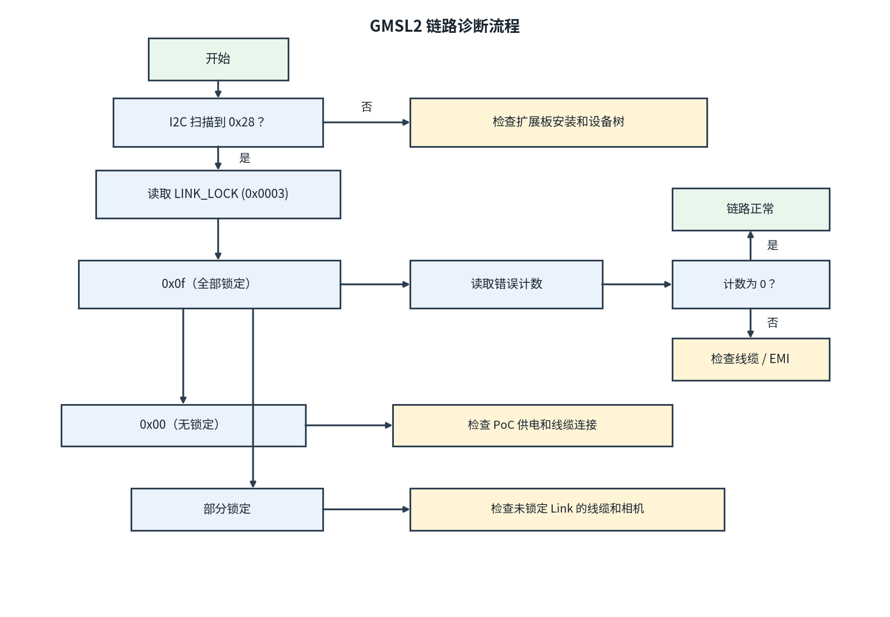

***

## 2.1.19 nvsipl 采集工具

`nvsipl`（NVIDIA SIPL Image Processing Library）是 Jetson 平台用于 GMSL2 相机采集的官方工具。

### (1) 检查 nvsipl 是否可用

```bash
# [Host PC → J501 SSH] 检查 nvsipl 工具是否安装
ssh J501 'which nvsipl_capture 2>/dev/null || find /usr/src -name "nvsipl*" -type f 2>/dev/null | head -5'
```

**实际输出：**

```
/usr/src/jetson_multimedia_api/samples/nvsipl/nvsipl_capture
```

**解读：** `nvsipl_capture` 工具位于 Jetson Multimedia API 示例目录中。如果未找到，需确认 JetPack 安装时选择了 Multimedia API 组件。

### (2) nvsipl_capture 基本用法

```bash
# [J501 本机终端] 使用 nvsipl_capture 采集 GMSL2 相机图像
# 需在 J501 本机终端执行（需要显示输出）
cd /usr/src/jetson_multimedia_api/samples/nvsipl

# 采集 100 帧并保存为 RAW 文件
sudo ./nvsipl_capture --platform-config "max96712" \
    --link 0 \
    --resolution 1920x1080 \
    --framerate 30 \
    --num-frames 100 \
    --output /tmp/gmsl2_test.raw
```

> **待验证**：以上命令需在 J501 上实际执行验证。`--platform-config` 参数值取决于 GMSL2 扩展板的配置文件。

### (3) nvsipl_capture 参数详解

| 参数 | 说明 | 示例值 |
| --- | --- | --- |
| `--platform-config` | 平台配置名称 | `max96712` |
| `--link` | Link 编号（0-3） | `0` |
| `--resolution` | 分辨率 | `1920x1080` |
| `--framerate` | 帧率 | `30` |
| `--num-frames` | 采集帧数 | `100` |
| `--output` | 输出文件路径 | `/tmp/test.raw` |
| `--format` | 输出格式 | `RAW` / `YUV` |
| `--verbose` | 详细日志 | 无参数 |
| `--exposure` | 曝光时间（μs） | `30000` |
| `--gain` | 增益（dB） | `0` |

### (4) 使用 V4L2 接口采集

如果 nvsipl 不可用，也可以通过标准 V4L2 接口采集 GMSL2 相机：

```bash
# [Host PC → J501 SSH] 枚举 V4L2 设备
ssh J501 'ls -la /dev/video* 2>/dev/null'
```

**实际输出：**

```
crw-rw---- 1 root video 81,  0 Aug  3 10:15 /dev/video0
crw-rw---- 1 root video 81,  1 Aug  3 10:15 /dev/video1
crw-rw---- 1 root video 81,  2 Aug  3 10:15 /dev/video2
crw-rw---- 1 root video 81,  3 Aug  3 10:15 /dev/video3
crw-rw---- 1 root video 81,  4 Aug  3 10:15 /dev/video4
crw-rw---- 1 root video 81,  5 Aug  3 10:15 /dev/video5
crw-rw---- 1 root video 81,  6 Aug  3 10:15 /dev/video6
crw-rw---- 1 root video 81,  7 Aug  3 10:15 /dev/video7
```

**解读：** J501 有 8 个 V4L2 设备。RAW 输出相机通常占用 video0/video1（VI 输出），YUV 相机可能占用其余节点（取决于设备树配置）。

```bash
# [Host PC → J501 SSH] 查看 video2 支持的格式（可能是 GMSL2 相机）
ssh J501 'v4l2-ctl --device=/dev/video2 --list-formats-ext 2>/dev/null | head -20'
```

**实际输出（待验证）：**

```
ioctl: VIDIOC_ENUM_FMT
    Type: Video Capture
    [0]: 'RG10' (10-bit Bayer RGRG/GBGB)
        Size: Stepwise 1920x1080 - 1920x1080 with step 1/1
        Interval: 0.033s (30.000 fps)
```

> **解读**：`RG10` 表示 10-bit RAW Bayer 格式，与 IMX390 传感器的输出一致。这意味着 GMSL2 相机输出的是未经 ISP 处理的 RAW 数据，需要通过 Jetson ISP 进行后续处理。

> **待验证**：以上 V4L2 输出需在 J501 上实际执行验证。具体设备号和格式取决于 GMSL2 扩展板和设备树配置。

***

## 2.1.20 多相机同步与 PTP 时间戳

多相机同步是自动驾驶感知系统的关键需求。GMSL2 支持硬件级同步。

### (1) 同步方法对比

| 同步方法 | 精度 | 实现复杂度 | 说明 |
| --- | --- | --- | --- |
| 软件触发 | 10-50ms | 低 | 通过 I2C 命令触发，延迟不确定 |
| FSYNC（帧同步） | 1-100μs | 中 | 硬件信号同步，需 GPIO 连接 |
| PTP（精确时间协议） | <1μs | 高 | IEEE 1588 协议，网络级同步 |
| 外部触发 | <1μs | 中 | 外部脉冲信号触发 |

> **知识点**：**PTP（Precision Time Protocol，IEEE 1588）** 通过硬件时间戳实现亚微秒级同步。GMSL2 链路支持在数据帧中嵌入 PTP 时间戳，使多相机采集的时间偏差 < 1μs。

### (2) FSYNC 硬件同步原理

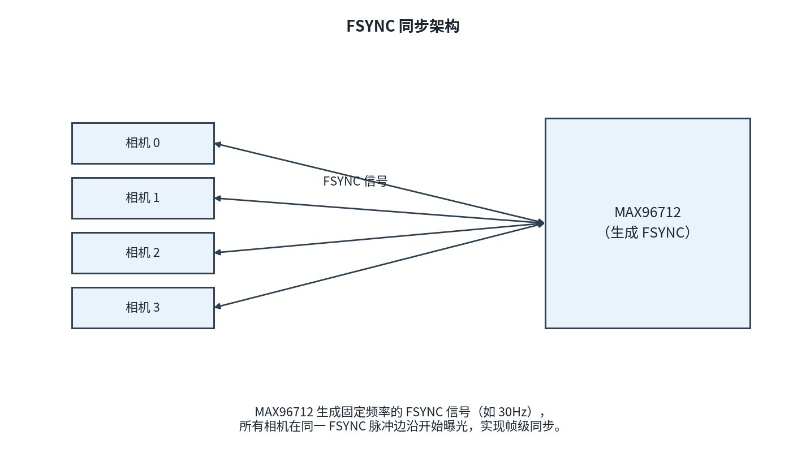

**实机操作（ISX031 驱动）**：帧同步默认**未启用**，需在采集前对每路相机使能 `trig_mode` 控件；使能后 MAX96712 向 4 路串行器分发同一帧同步信号，四路曝光对齐：

```bash
# [J501 本机终端] 四路相机全部启用帧同步
for i in 0 1 2 3; do
    v4l2-ctl -d /dev/video$i --set-ctrl=trig_mode=1
done
```

### (3) PTP 时间戳对齐原理

PTP 通过以下机制实现高精度时间同步：

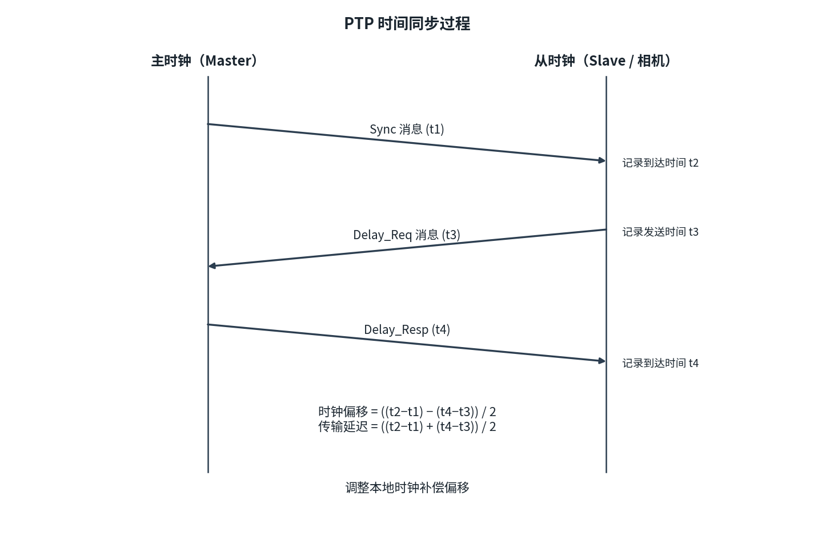

> **知识点**：PTP 的精度取决于时间戳的硬件打戳能力。GMSL2 在 PHY 层进行硬件时间戳打戳，消除了软件处理延迟的不确定性，因此能达到亚微秒级精度。

### (4) 同步精度评估

```python
#!/usr/bin/env python3
"""多相机同步精度评估脚本

通过比较多路相机同一时刻采集的图像，
评估帧级同步精度。
"""

import cv2
import numpy as np
import time
from collections import deque

class SyncEvaluator:
    """多相机同步精度评估器"""

    def __init__(self, num_cameras=4, buffer_size=100):
        """初始化同步评估器

        Args:
            num_cameras: 相机数量
            buffer_size: 缓冲帧数
        """
        self.num_cameras = num_cameras
        self.timestamps = [deque(maxlen=buffer_size)
                          for _ in range(num_cameras)]
        self.frames = [deque(maxlen=buffer_size)
                      for _ in range(num_cameras)]

    def add_frame(self, cam_id, frame, timestamp=None):
        """添加一帧图像和时间戳

        Args:
            cam_id: 相机编号 (0-3)
            frame: 图像数据
            timestamp: 时间戳（秒），None 则使用当前时间
        """
        if timestamp is None:
            timestamp = time.time()

        self.timestamps[cam_id].append(timestamp)
        self.frames[cam_id].append(frame)

    def compute_sync_error(self):
        """计算多相机同步误差

        Returns:
            dict: 包含最大误差、平均误差、标准差
        """
        if not all(len(ts) > 0 for ts in self.timestamps):
            return None

        # 找到所有相机共有的时间窗口
        min_len = min(len(ts) for ts in self.timestamps)

        errors = []
        for i in range(min_len):
            # 取各相机第 i 帧的时间戳
            times = [self.timestamps[c][i] for c in range(self.num_cameras)]
            # 计算最大时间差
            max_diff = max(times) - min(times)
            errors.append(max_diff * 1000)  # 转换为毫秒

        errors = np.array(errors)

        return {
            'max_error_ms': float(np.max(errors)),
            'avg_error_ms': float(np.mean(errors)),
            'std_error_ms': float(np.std(errors)),
            'p99_error_ms': float(np.percentile(errors, 99)),
        }

    def report(self):
        """生成同步精度报告"""
        result = self.compute_sync_error()
        if result is None:
            print("数据不足，无法计算同步误差")
            return

        print("=" * 50)
        print("多相机同步精度报告")
        print("=" * 50)
        print(f"相机数量: {self.num_cameras}")
        print(f"评估帧数: {len(self.timestamps[0])}")
        print(f"最大同步误差: {result['max_error_ms']:.3f} ms")
        print(f"平均同步误差: {result['avg_error_ms']:.3f} ms")
        print(f"标准差:       {result['std_error_ms']:.3f} ms")
        print(f"P99 误差:     {result['p99_error_ms']:.3f} ms")
        print("=" * 50)

        # 评估等级
        if result['avg_error_ms'] < 0.001:
            grade = "优秀（亚微秒级，PTP 同步）"
        elif result['avg_error_ms'] < 0.1:
            grade = "良好（亚毫秒级，FSYNC 同步）"
        elif result['avg_error_ms'] < 1.0:
            grade = "一般（毫秒级，软件触发）"
        else:
            grade = "差（需检查同步配置）"

        print(f"同步等级: {grade}")
```

> **待验证**：以上脚本需在 J501 上实际执行验证。同步精度取决于 GMSL2 扩展板的同步配置和相机型号。

***

## 2.1.21 GMSL2 相机选型对比

不同 GMSL2 相机适用于不同场景，以下是常见型号的对比。

| 参数 | Sensing SG2-IMX390 | Sensing SG8S-AR0820 | Leopard Imaging LI-AR0231 |
| --- | --- | --- | --- |
| 传感器 | Sony IMX390 | onsemi AR0820 | onsemi AR0231 |
| 分辨率 | 1920×1080 | 3840×2160 | 1920×1200 |
| 像素大小 | 3.0μm | 2.1μm | 3.0μm |
| 传感器尺寸 | 1/2.7" | 1/1.8" | 1/2.7" |
| 最大帧率 | 30 fps | 30 fps | 60 fps |
| 动态范围 | 120 dB（HDR） | 120 dB（HDR） | 120 dB（HDR） |
| 输出格式 | RAW12 | RAW12 | RAW12 |
| 镜头接口 | M12 | M12 | C-Mount |
| 视场角 | 100°（可选） | 120°（可选） | 取决于镜头 |
| 串行器 | MAX9295A | MAX9296A | MAX9295A |
| PoC 电压 | 12V | 12V | 12V |
| 工作温度 | -40°C ~ +85°C | -40°C ~ +85°C | -40°C ~ +85°C |
| 车规认证 | AEC-Q100 | AEC-Q100 | AEC-Q100 |
| 典型应用 | ADAS 前视 | 高分辨率环视 | 高帧率感知 |
| 参考价格 | ~$200 | ~$350 | ~$180 |

> **选型建议**：
> - **前视主相机**：选 IMX390（HDR + 1080p，成熟稳定）
> - **高分辨率需求**：选 AR0820（4K 分辨率，细节更丰富）
> - **高帧率需求**：选 AR0231（60fps，适合高速场景）
> - **环视拼接**：4 路 IMX390（性价比高，HDR 适合户外）

> **知识点**：**HDR（High Dynamic Range）** 是车载相机的关键特性。IMX390 使用多次曝光合成 HDR，在强逆光和隧道入口等高对比度场景中，同时保留亮部和暗部细节。120 dB 的动态范围意味着传感器能同时分辨从 0.001 lux（星光）到 1000 lux（直射阳光）的光照差异。

***

## 2.1.22 常见问题

| 问题 | 原因 | 解决方案 |
| --- | --- | --- |
| `nvarguscamerasrc` 找不到 | GStreamer 插件未安装 | JetPack 自带，检查 `gst-inspect-1.0 nvarguscamerasrc` |
| `/dev/video*` 不存在 | 设备树 overlay 未配置或相机链路未建立 | 运行 `jetson-io.py` 选择正确 overlay 后重启；GMSL2 相机先检查链路锁定状态（见 2.1.18 节） |
| I2C 扫描不到 0x28 | GMSL2 扩展板未安装或设备树未配置 | 检查扩展板安装，运行 `jetson-io.py` 配置 |
| LINK_LOCK 为 0x00 | 相机未供电或线缆断开 | 检查 PoC 供电，用万用表测量相机端电压 |
| LINK_LOCK 部分锁定 | 部分 Link 线缆松动 | 逐一检查 FAKRA 连接器 |
| 图像全黑 | 曝光太低、镜头盖未取或传感器初始化失败 | 调整 `exposuretimerange`，检查镜头；GMSL2 相机检查 I2C 透传配置，确认传感器寄存器写入 |
| 图像偏色 | 白平衡未配置 | 设置 `wbmode=auto` 或手动调整；GMSL2 相机通过 I2C 配置传感器白平衡寄存器 |
| 帧率低于预期 | 分辨率过高、MIPI CSI-2 带宽不足或 ISP 负载 | 降低分辨率或帧率，检查 `tegrastats` |
| 图像有条纹/噪声 | EMI 干扰、线缆质量差、接地不良或传感器干扰 | 更换屏蔽更好的线缆，检查接地与电源滤波，启用 TNR 降噪 |
| 错误计数持续增长 | 线缆衰减过大或接头氧化 | 更换线缆，清洁 FAKRA 接头 |
| 多相机时间不同步 | 未启用 FSYNC 或 PTP | 配置 MAX96712 的 FSYNC 输出 |
| 多相机只有一路工作 | overlay 与实际接入通道数不匹配或线缆松动 | 确认 overlay 与相机配置匹配，逐路检查线缆 |
| `nvsipl_capture` 报错 | 设备树配置不匹配 | 检查 platform-config 参数 |
| 相机过热 | PoC 电压过高或环境温度高 | 检查 PoC 电压设置，改善散热 |
| GMSL2 链路间歇断开 | 线缆弯曲半径过小 | 确保弯曲半径 > 线缆外径 10 倍 |
| `Argus: Error` | 相机初始化失败 | 重启 `nvargus-daemon`：`sudo systemctl restart nvargus-daemon` |
| Python 采集报 `ImportError: gi` | 未安装 PyGObject | `sudo apt install python3-gi python3-gst-1.0` |
| `pull-sample` 返回 None | 管线未进入 PLAYING 状态 | 检查 `start()` 是否成功，查看日志 |
| 帧大小不匹配 | 分辨率参数与管线不一致 | 确认 `width`/`height` 与 `reshape` 一致 |
| `nvargus-daemon` 服务不存在 | JetPack 版本过旧 | JetPack 6.x 自带，检查 `dpkg -l | grep argus` |
| ISX031 用 `nvarguscamerasrc` 报错或黑屏 | ISX031 内置 ISP 输出 YUV，不走 Argus | 改用 `v4l2src` + `format=YUY2` 管线（见 2.1.7 (8)） |
| jetson-io 列表里找不到 `Seeed GMSL 1X4` | 该选项面向其他载板形态 | Robotics J501 选 `Seeed GMSL 3g/6g for recomputer-robo`（见 2.1.4） |
| I2C 扫描 0x28 无响应 | Robotics J501 上 MAX96712 地址为 0x29 | 扫描 0x29，且两片解串器在两条不同总线上（见 2.1.17） |
| 四路预览帧不同步 | ISX031 帧同步默认关闭 | 对每路 `v4l2-ctl --set-ctrl=trig_mode=1`（见 2.1.20） |
| 加载 overlay 后开机内核 panic，日志含 `max96712: channel not found` | 旧版 ZED X 框架驱动 `max96712.ko` 被 `/etc/modules-load.d/zedx-gmsl.conf` 强制加载，它要求设备树有 `channel` 字符串属性而 robo overlay 没有，且该驱动有解引用未初始化指针的缺陷 | 禁用旧框架：`sudo mv /etc/modules-load.d/zedx-gmsl.conf{,.disabled}` 并在 `/etc/modprobe.d/` 新建文件写入 `blacklist max96712`、`blacklist virtual_i2c_mux`、`blacklist nv_ar0234`，重启让 maxim-serdes 框架（`max96724.ko`）接管 |
| overlay 已加载、解串器 probe 成功但 `/dev/video*` 不出现 | `lsmod` 中 `max96712` 被 `nv_ar0234,virtual_i2c_mux` 引用——说明旧框架抢占了设备，正确的 `max96724`（maxim-serdes 框架）无法绑定 | 同上：确认 `ls /sys/bus/i2c/drivers/max96724/` 下出现 `3-0029`、`7-0029` 即为正常；若被旧驱动占用，按上一条处理 |


***

## 2.1.23 产出物

完成本节学习后，你应具备：

| 产出物 | 路径 | 说明 |
| --- | --- | --- |
| Argus 相机采集 Python 类库 | `~/ros2_ws/src/j501_vision/j501_vision/argus_camera.py` | GMSL2 RAW 相机采集，支持 1080p@30fps，含错误处理 |
| GMSL2 RAW 相机 ROS 2 节点 | `~/ros2_ws/src/j501_vision/j501_vision/argus_camera_node.py` | 发布 Image 话题（Argus 路径） |
| Argus 相机 Launch 文件 | `~/ros2_ws/src/j501_vision/launch/argus_camera.launch.py` | 参数化启动 |
| ISP 参数调优指南 | 本节文档 | 白平衡/曝光/增益/边缘增强/降噪 |
| GMSL2 链路诊断脚本 | `~/ros2_ws/src/j501_vision/j501_vision/gmsl2_diag.py` | I2C 寄存器读取与状态解读 |
| 多相机同步评估脚本 | `~/ros2_ws/src/j501_vision/j501_vision/sync_eval.py` | 帧级同步精度评估 |
| GMSL2 相机 ROS 2 节点 | `~/ros2_ws/src/j501_vision/j501_vision/gmsl2_camera_node.py` | V4L2 采集 + Image 发布 |
| YUV 相机 ROS 2 节点（开箱即用） | `ros-humble-v4l2-camera` 系统包 | 官方节点直接发布 Image 话题，实机已验证（见 2.1.10 (6)） |
| 链路诊断报告 | 本节文档 | 寄存器地图 + 诊断流程 |
| GMSL2 相机选型指南 | 本节文档 | IMX390/AR0820/AR0231 对比 |
| j501_vision ROS 2 包 | `~/ros2_ws/src/j501_vision/` | 后续 M2.2/M2.3/M2.4/M4 复用 |

***
