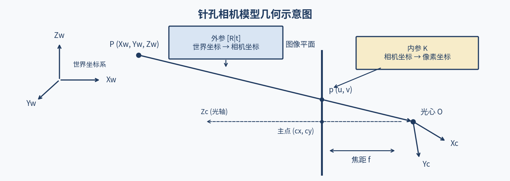
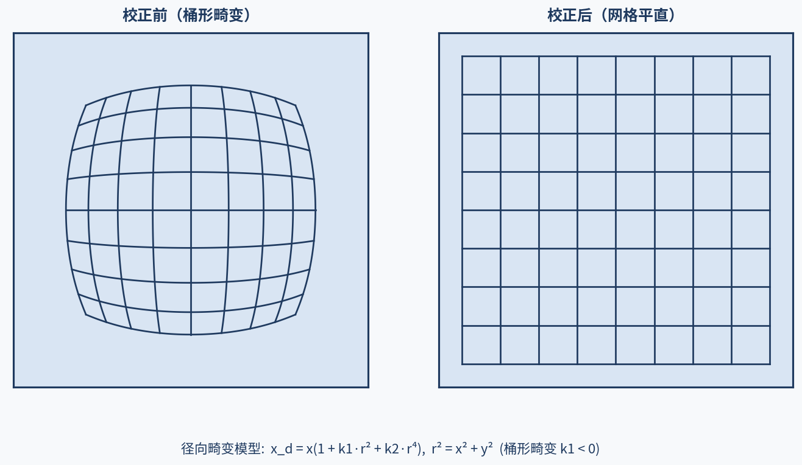
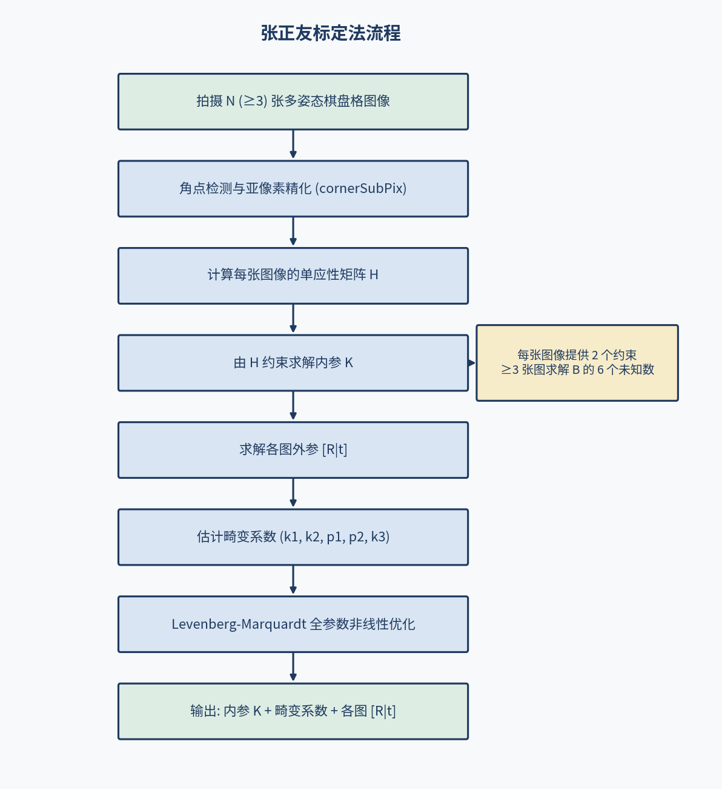
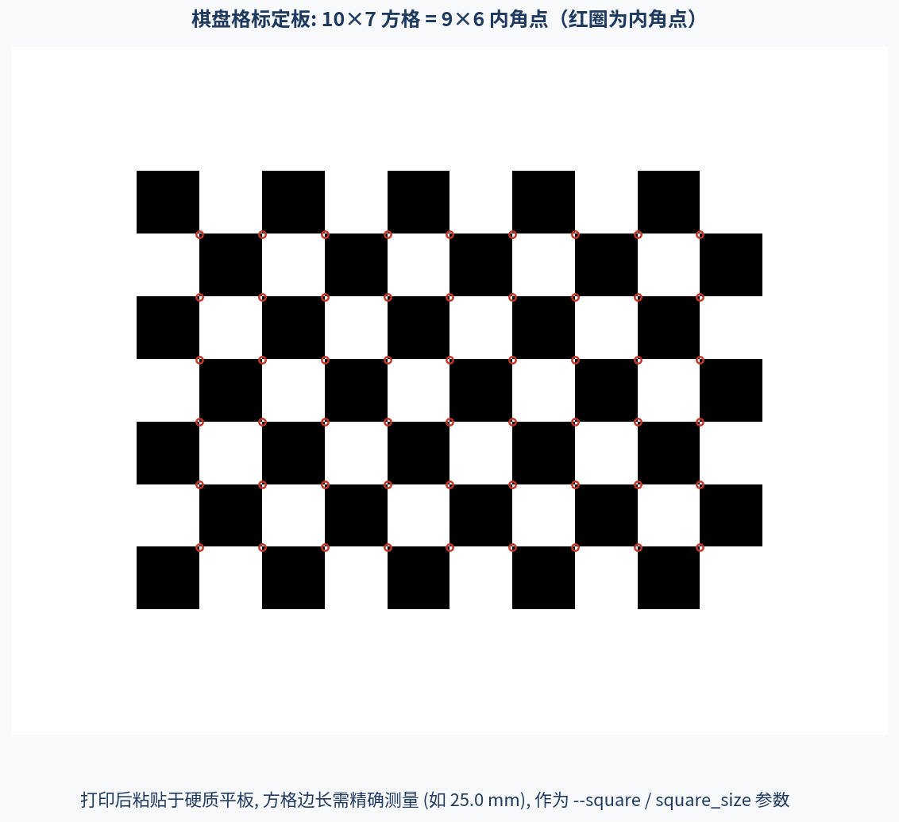
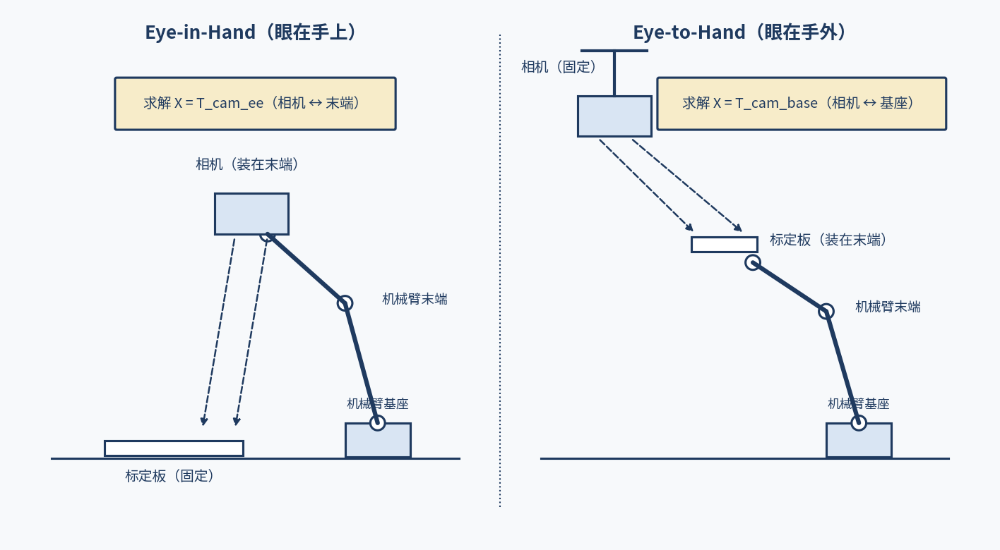

# M2 感知层：视觉系统基础

> **实机环境**：reComputer Robotics J501（AGX Orin 32GB），L4T 36.4.4 / JetPack 6.2.1
>
> **Host PC** ：Ubuntu 22.04.5 LTS，x86\_64
>
> **前置条件**：已完成 M1 全部内容（系统刷机、Docker 环境、ROS 2 Humble 安装等）

***

# 2.3 相机标定：内外参与联合标定

**课程目标**：理解相机成像模型与畸变原理，完成单目/双目标定，建立像素到物理空间的映射，为 SLAM、导航和机械臂抓取提供精确的相机参数。

**硬件清单**：J501、1-2 路相机（CSI/GMSL2/USB）、标定板（棋盘格 9×6 或 ChArUco）、三脚架、卷尺。

**前置基础**：M2.1（相机成像基础与 GMSL2 多相机接入）、M2.2（深度相机基础）。

**参考文档**：

- OpenCV 相机标定教程：<https://docs.opencv.org/4.x/d9/d0c/group__calib3d.html>
- ROS 2 camera_calibration：<http://docs.ros.org/en/humble/p/camera_calibration/>
- Kalibr 标定工具：<https://github.com/ethz-asl/kalibr>
- 张正友标定法原始论文：<https://www.microsoft.com/en-us/research/publication/a-flexible-new-technique-for-camera-calibration/>
- ChArUco 介绍：<https://docs.opencv.org/4.x/df/d4a/tutorial_charuco.html>
- ROS 2 camera_info 格式：<http://docs.ros.org/en/humble/p/sensor_msgs/>

***

## 2.3.1 相机成像模型

### (1) 针孔相机模型

针孔相机模型（Pinhole Model）描述了 3D 世界坐标到 2D 图像坐标的映射关系：

```
世界坐标 → 相机坐标 → 像素坐标

  ┌───┐         ┌───┐         ┌───┐
  │ 3D│  外参   │ 3D│  内参   │ 2D│
  │世界│ ─R,t─► │相机│ ──K──► │图像│
  │坐标│         │坐标│         │坐标│
  └───┘         └───┘         └───┘

  [Xw]         [Xc]         [u]
  [Yw] ──R,t─► [Yc] ──K──► [v]
  [Zw]         [Zc]         [1]
  [ 1]         [ 1]
```



### (2) 坐标变换详解

**步骤 1：世界坐标 → 相机坐标（外参变换）**

```
┌ Xc ┐   ┌               ┐ ┌ Xw ┐
│ Yc │ = │     R    │t│ │ Yw │
│ Zc │   │  3×3     │1│ │ Zw │
└  1 ┘   └               ┘ └  1 ┘

  [R|t] 是 3×4 的外参矩阵
  R = 旋转矩阵（3×3，描述相机姿态）
  t = 平移向量（3×1，描述相机位置）
```

**步骤 2：相机坐标 → 归一化坐标（透视投影）**

```
┌ x ┐   ┌ Xc / Zc ┐
│ y │ = │ Yc / Zc │
└ 1 ┘   └    1   ┘

  归一化坐标 = 相机坐标除以深度
```

**步骤 3：归一化坐标 → 像素坐标（内参变换）**

```
┌ u ┐   ┌ fx   0   cx ┐ ┌ x ┐
│ v │ = │  0  fy   cy │ │ y │
└ 1 ┘   └  0   0    1 ┘ └ 1 ┘

  K 是 3×3 的内参矩阵
  fx, fy = 焦距（像素）
  cx, cy = 主点坐标（像素）
```

> **知识点**：内参矩阵 K 描述了相机的**内部光学特性**（焦距、主点），是相机固有的参数，不随相机位置变化。外参 [R|t] 描述了相机在**世界坐标系中的位姿**，随相机移动而变化。标定的目标是精确估计 K 和 [R|t]。

### (3) 齐次坐标

齐次坐标（Homogeneous Coordinates）将 n 维坐标扩展为 n+1 维，使仿射变换可用矩阵乘法表示：

| 普通坐标 | 齐次坐标 | 说明 |
| --- | --- | --- |
| (x, y) | (x, y, 1) | 2D 点 |
| (x, y, z) | (x, y, z, 1) | 3D 点 |
| (x, y, z) | (x, y, z, w) | w≠1 时等价于 (x/w, y/w, z/w) |

> **提示**：齐次坐标的核心优势是**平移变换可以用矩阵乘法表示**。在非齐次坐标中，平移需要加法（x' = Rx + t），而在齐次坐标中可以用乘法（[x'; 1] = [R t; 0 1][x; 1]），便于级联多个变换。

***

## 2.3.2 畸变模型与畸变系数

实际镜头不是理想针孔，存在光学畸变。标定需要估计畸变系数并进行畸变校正。

### (1) 畸变类型

```
畸变类型：

  1. 径向畸变（Radial Distortion）
     - 穿透镜头的光线弯曲
     - 越远离光轴越严重
     - 桶形畸变（广角镜头）或枕形畸变（长焦镜头）

  2. 切向畸变（Tangential Distortion）
     - 镜头与传感器不平行
     - 图像轻微倾斜

  畸变模型：
     x_distorted = x(1 + k1*r² + k2*r⁴ + k3*r⁶) + 2*p1*x*y + p2*(r² + 2*x²)
     y_distorted = y(1 + k1*r² + k2*r⁴ + k3*r⁶) + p1*(r² + 2*y²) + 2*p2*x*y

     其中 r² = x² + y²
     k1, k2, k3 = 径向畸变系数
     p1, p2 = 切向畸变系数
```

### (2) 畸变系数表

| 系数 | 名称 | 典型值范围 | 说明 |
| --- | --- | --- | --- |
| k1 | 一阶径向 | -0.5 ~ 0.5 | 主要径向畸变 |
| k2 | 二阶径向 | -0.1 ~ 0.1 | 次要径向畸变 |
| p1 | 一阶切向 | -0.01 ~ 0.01 | 主要切向畸变 |
| p2 | 二阶切向 | -0.01 ~ 0.01 | 次要切向畸变 |
| k3 | 三阶径向 | -0.01 ~ 0.01 | 仅广角/鱼眼需要 |

> **知识点**：对于普通镜头，k1 和 k2 足以描述径向畸变。k3 主要用于广角或鱼眼镜头。OpenCV 标定默认估计 5 个畸变系数（k1, k2, p1, p2, k3）。

### (3) 畸变校正效果

```
畸变校正前后对比：

  校正前（桶形畸变）          校正后
  ┌──────────────┐          ┌──────────────┐
  │  ╭────────╮  │          │ ┌──────────┐ │
  │ │          │  │          │ │          │ │
  │ │  网格线  │  │          │ │  网格线  │ │
  │ │  弯曲    │  │          │ │  平直    │ │
  │ │          │  │          │ │          │ │
  │  ╰────────╯  │          │ └──────────┘ │
  └──────────────┘          └──────────────┘
```



***

## 2.3.3 张正友标定法

张正友标定法（Zhang's Method）是目前最广泛使用的相机标定方法。

### (1) 方法原理

张正友法通过拍摄多张不同姿态的平面标定板（如棋盘格），利用**单应性矩阵（Homography）**约束求解内参。

```
张正友标定法流程：

  1. 拍摄 N（≥3）张不同角度的棋盘格图像
  2. 检测每张图像的角点（cornerSubPix）
  3. 计算每张图像的单应性矩阵 H
  4. 利用 H 的约束建立方程，求解内参 K
  5. 利用 K 和 H 求解每张图像的外参 [R|t]
  6. 估计畸变系数（非线性优化）
  7. 全参数非线性优化（Levenberg-Marquardt）
```



### (2) 单应性矩阵推导

标定板平面（Z=0）到图像平面的映射：

```
设标定板平面上的点 P = [X; Y; 0; 1]（Z=0）

  ┌ u ┐   ┌ fx  0  cx ┐ ┌ r11 r12 r13 ┐ ┌ X ┐
  │ v │ = │  0 fy  cy │ │ r21 r22 r23 │ │ Y │
  │ 1 │   └  0  0   1 ┘ │ r31 r32 r33 │ │ 0 │
  └   ┘                   └ t1 t2 t3  ┘ └ 1 ┘

  由于 Z=0，可简化为：
  ┌ u ┐   ┌ fx  0  cx ┐ ┌ r11 r12 t1 ┐ ┌ X ┐
  │ v │ = │  0 fy  cy │ │ r21 r22 t2 │ │ Y │
  │ 1 │   └  0  0   1 ┘ └ r31 r32 t3 ┘ └ 1 ┘

  即 H = K × [r1 r2 t]

  其中 r1, r2 是旋转矩阵的前两列

  利用 r1 和 r2 正交且模为 1 的约束：
    r1^T × K^(-T) × K^(-1) × r2 = 0
    r1^T × K^(-T) × K^(-1) × r1 = r2^T × K^(-T) × K^(-1) × r2 = 1

  设 B = K^(-T) × K^(-1)，每张图像提供 2 个约束方程
  需要 ≥ 3 张图像求解 B 的 6 个未知数
  再从 B 恢复 K
```

> **知识点**：张正友法的核心创新是利用**平面标定板的单应性约束**，将标定从需要 3D 标定物（昂贵且不精确）简化为只需要 2D 平面标定板（易制作、高精度）。这是该方法被广泛采用的原因。

### (3) 标定板制作

| 标定板类型 | 精度 | 制作方式 | 说明 |
| --- | --- | --- | --- |
| 棋盘格（Chessboard） | 高 | 激光打印 + 贴平板 | 最常用，9×6 或 8×6 |
| ChArUco | 极高 | ArUco + 棋盘格 | 部分遮挡仍可标定 |
| 圆点阵列（Circle Grid） | 高 | 精密打印 | 圆心检测精度高 |
| 3D 标定物 | 极高 | CNC 加工 | 成本高，不常用 |

> **提示**：棋盘格标定板建议使用 **A4 纸激光打印**，粘贴到硬质平板（如亚克力板或铝板）上。确保标定板完全平整，否则会影响标定精度。方格大小需用卡尺精确测量（如 25.0mm）。



***

## 2.3.4 使用 camera_calibration 标定

ROS 2 的 `camera_calibration` 包提供了交互式标定工具。

### (1) 安装标定工具

```bash
# [J501 本机终端] 安装 camera_calibration
sudo apt install -y ros-humble-camera-calibration

# 安装 image-view（用于查看标定过程）
sudo apt install -y ros-humble-image-view
```

### (2) 启动相机节点

```bash
# [J501 本机终端] 启动 GMSL2 RAW 相机节点（Argus 路径，参考 2.1 节）
ros2 launch j501_vision argus_camera.launch.py

# 或启动 RealSense 节点
ros2 launch realsense2_camera rs_launch.py
```

> **本教程实机（ISX031 YUV 路径）**：4 路 ISX031 不走 Argus，用官方 `v4l2_camera` 节点发布话题（已在实机验证，详见 2.1.10 (6)）：
>
> ```bash
> # [J501 本机终端] 启动待标定的那一路（示例：/dev/video0 → /camera_front）
> source /opt/ros/humble/setup.bash
> ros2 run v4l2_camera v4l2_camera_node --ros-args \
>     -r __ns:=/camera_front -p video_device:=/dev/video0
> ```
>
> 此时图像话题为 `/camera_front/image_raw`（rgb8，实测 1920×1536），下面标定命令的话题名相应替换。
>
> **注意**：`cameracalibrator` 默认使用 plumb_bob 针孔畸变模型，对 H190XA 这类 190° 鱼眼镜头**不适用**——本教程实机请使用 2.3.10 节的鱼眼标定流程。

### (3) 运行标定

```bash
# [J501 本机终端] 单目标定
ros2 run camera_calibration cameracalibrator \
    --size 9x6 \
    --square 0.025 \
    image:=/camera/color/image_rect_color \
    camera_info:=/camera/color/camera_info
```

**参数说明：**

| 参数 | 值 | 说明 |
| --- | --- | --- |
| `--size` | 9x6 | 棋盘格内角点数（列×行） |
| `--square` | 0.025 | 方格边长（米） |
| `image` | 话题名 | 图像话题 |
| `camera_info` | 话题名 | 相机信息话题 |

### (4) 标定操作流程

```
标定操作步骤：

  1. 标定窗口打开后，将标定板对准相机
  2. 移动标定板，覆盖以下条件：
     - X 轴：左右移动（标定板在画面左/中/右）
     - Y 轴：上下移动（标定板在画面上/中/下）
     - 俯仰：前后倾斜（标定板上下倾斜）
     - 偏航：左右旋转（标定板左右旋转）
     - 距离：远近移动（近/中/远）

  3. 窗口侧边进度条显示各方向覆盖度
  4. 当所有进度条变绿时，点击 "CALIBRATE" 按钮
  5. 标定完成后，点击 "SAVE" 保存结果
  6. 点击 "COMMIT" 将标定参数写入相机
```

> **提示**：标定精度取决于**图像多样性**。建议采集 15-20 张不同角度、距离、姿态的图像。避免只在一个位置采集大量图像——这会导致标定方程病态。

### (5) 标定结果

```bash
# [Host PC → J501 SSH] 查看标定后的 camera_info
ssh J501 'source /opt/ros/humble/setup.bash && ros2 topic echo /camera/color/camera_info --once 2>/dev/null'
```

**实际输出（待验证）：**

```yaml
---
height: 720
width: 1280
distortion_model: plumb_bob
d: [0.0123, -0.0456, 0.000789, -0.000456, 0.0234]
k:
- 640.123
- 0.0
- 639.567
- 0.0
- 640.456
- 359.876
- 0.0
- 0.0
- 1.0
r:
- 1.0
- 0.0
- 0.0
- 0.0
- 1.0
- 0.0
- 0.0
- 0.0
- 1.0
p:
- 640.123
- 0.0
- 639.567
- 0.0
- 0.0
- 640.456
- 359.876
- 0.0
- 0.0
- 0.0
- 1.0
- 0.0
---
```

**解读：**
- `distortion_model: plumb_bob`：使用 5 参数畸变模型（k1, k2, p1, p2, k3）
- `d`：畸变系数 [k1, k2, p1, p2, k3]
- `k`：内参矩阵 K（3×3，行优先）
- `r`：校正矩阵（通常为单位阵）
- `p`：投影矩阵（3×4）

***

## 2.3.5 重投影误差计算

重投影误差（Reprojection Error）是评估标定质量的核心指标。

### (1) 重投影误差原理

```
重投影误差计算：

  1. 使用标定参数将 3D 标定板角点投影到图像
     u_proj = project(P_3D, K, [R|t], dist_coeffs)

  2. 与实际检测到的角点比较
     error = ||u_detected - u_proj||

  3. 计算所有角点的 RMS 误差
     RMS = sqrt(mean(error²))
```

> **知识点**：重投影误差衡量的是"标定参数预测的角点位置与实际检测位置的偏差"。好的标定应使 RMS 误差 < 0.5 像素。如果误差 > 1 像素，说明标定质量差，需要重新采集数据。

### (2) 误差评估标准

| RMS 误差 | 评级 | 说明 |
| --- | --- | --- |
| < 0.3 px | 优秀 | 高精度应用（SLAM、机械臂） |
| 0.3-0.5 px | 良好 | 大多数应用足够 |
| 0.5-1.0 px | 可接受 | 一般视觉任务 |
| 1.0-2.0 px | 差 | 需重新标定 |
| > 2.0 px | 不合格 | 标定失败 |

### (3) Python 重投影误差计算

```python
#!/usr/bin/env python3
"""相机标定重投影误差计算

使用 OpenCV 计算标定后的重投影误差。
"""

import cv2
import numpy as np
import glob

class CalibrationEvaluator:
    """标定质量评估器"""

    def __init__(self, pattern_size=(9, 6), square_size=0.025):
        """初始化标定评估器

        Args:
            pattern_size: 棋盘格内角点数（列, 行）
            square_size: 方格边长（米）
        """
        self.pattern_size = pattern_size
        self.square_size = square_size

        # 生成 3D 角点世界坐标
        self.objp = np.zeros(
            (pattern_size[0] * pattern_size[1], 3), dtype=np.float64
        )
        self.objp[:, :2] = np.mgrid[
            0:pattern_size[0], 0:pattern_size[1]
        ].T.reshape(-1, 2)
        self.objp *= square_size

    def calibrate(self, image_dir, image_extension="jpg"):
        """执行标定

        Args:
            image_dir: 标定图像目录
            image_extension: 图像扩展名

        Returns:
            tuple: (ret, K, dist, rvecs, tvecs, errors)
        """
        objpoints = []  # 3D 角点
        imgpoints = []  # 2D 角点
        image_size = None

        images = sorted(glob.glob(f"{image_dir}/*.{image_extension}"))
        print(f"找到 {len(images)} 张标定图像")

        for idx, fname in enumerate(images):
            img = cv2.imread(fname)
            gray = cv2.cvtColor(img, cv2.COLOR_BGR2GRAY)

            if image_size is None:
                image_size = gray.shape[::-1]

            # 检测棋盘格角点
            ret, corners = cv2.findChessboardCorners(
                gray, self.pattern_size, None
            )

            if ret:
                # 亚像素精化
                corners2 = cv2.cornerSubPix(
                    gray, corners, (11, 11), (-1, -1),
                    (cv2.TERM_CRITERIA_EPS + cv2.TERM_CRITERIA_MAX_ITER, 30, 0.001)
                )
                objpoints.append(self.objp)
                imgpoints.append(corners2)
                print(f"  [{idx+1}/{len(images)}] 角点检测成功")
            else:
                print(f"  [{idx+1}/{len(images)}] 角点检测失败: {fname}")

        if len(objpoints) < 3:
            print("有效图像不足（需 ≥3 张）")
            return None

        # 执行标定
        ret, K, dist, rvecs, tvecs = cv2.calibrateCamera(
            objpoints, imgpoints, image_size, None, None
        )

        errors = []
        for i in range(len(objpoints)):
            imgpoints_proj, _ = cv2.projectPoints(
                objpoints[i], rvecs[i], tvecs[i], K, dist
            )
            error = cv2.norm(
                imgpoints[i], imgpoints_proj, cv2.NORM_L2
            ) / len(imgpoints_proj)
            errors.append(error)

        return ret, K, dist, rvecs, tvecs, errors

    def report(self, ret, K, dist, rvecs, tvecs, errors):
        """打印单目标定报告

        Args:
            ret: 标定 RMS 误差
            K: 内参矩阵
            dist: 畸变系数
            rvecs: 旋转向量列表
            tvecs: 平移向量列表
            errors: 每张图像的重投影误差列表
        """
        print("\n" + "=" * 60)
        print("单目相机标定报告")
        print("=" * 60)
        print(f"标定 RMS 误差: {ret:.4f}")
        print(f"内参矩阵 K:")
        print(f"  fx = {K[0,0]:.4f}, fy = {K[1,1]:.4f}")
        print(f"  cx = {K[0,2]:.4f}, cy = {K[1,2]:.4f}")
        print(f"畸变系数: {dist.flatten()}")
        print(f"\n每张图像重投影误差:")
        for i, err in enumerate(errors):
            print(f"  [{i+1}] {err:.4f} px")
        print(f"平均误差: {np.mean(errors):.4f} px")
        print("=" * 60)

    def save_yaml(self, K, dist, output_path):
        """保存标定结果到 YAML

        Args:
            K: 内参矩阵
            dist: 畸变系数
            output_path: 输出文件路径
        """
        fs = cv2.FileStorage(output_path, cv2.FILE_STORAGE_WRITE)
        fs.write("K", K)
        fs.write("dist", dist)
        fs.release()
        print(f"标定结果已保存到: {output_path}")


if __name__ == '__main__':
    evaluator = CalibrationEvaluator(
        pattern_size=(9, 6), square_size=0.025
    )
    result = evaluator.calibrate("/tmp/calib_images", "jpg")
    if result is not None:
        ret, K, dist, rvecs, tvecs, errors = result
        evaluator.report(ret, K, dist, rvecs, tvecs, errors)
        evaluator.save_yaml(K, dist, "/tmp/mono_calibration.yaml")
```

> **待验证**：以上脚本需在 J501 上实际执行验证。需要提前采集 15-20 张棋盘格图像。

***

## 2.3.6 双目立体标定

双目标定用于确定左右相机之间的相对位姿关系，是立体匹配和深度估计的基础。

### (1) 双目标定原理

```
双目标定目标：
  求解左右相机之间的相对外参 [R|t]
  使得左右图像的对应点满足极线约束

  极线约束（Epipolar Constraint）：
    x_left^T × F × x_right = 0

  其中 F 为基础矩阵，与内参和相对外参相关：
    F = K_right^(-T) × R × [t]_x × K_left^(-1)

  标定流程：
    1. 同时采集左右相机的棋盘格图像
    2. 分别检测左右角点
    3. 分别标定左右相机内参
    4. 使用 stereoCalibrate 求解相对外参
    5. 使用 stereoRectify 计算校正映射
```

> **知识点**：双目标定的核心是**极线约束**——左图中的任一点，在右图中的对应点必定在一条极线上。这将二维搜索问题简化为一维搜索，是立体匹配的基础。

### (2) 双目标定 Python 实现

```python
#!/usr/bin/env python3
"""双目立体标定

使用 OpenCV 的 stereoCalibrate 和 stereoRectify 完成双目标定。
"""

import cv2
import numpy as np
import glob

class StereoCalibrator:
    """双目立体标定器"""

    def __init__(self, pattern_size=(9, 6), square_size=0.025):
        """初始化双目标定器

        Args:
            pattern_size: 棋盘格内角点数（列, 行）
            square_size: 方格边长（米）
        """
        self.pattern_size = pattern_size
        self.square_size = square_size

        # 生成 3D 角点世界坐标
        self.objp = np.zeros(
            (pattern_size[0] * pattern_size[1], 3), dtype=np.float64
        )
        self.objp[:, :2] = np.mgrid[
            0:pattern_size[0], 0:pattern_size[1]
        ].T.reshape(-1, 2)
        self.objp *= square_size

    def _find_corners(self, image_dir, image_extension="jpg"):
        """检测棋盘格角点

        Args:
            image_dir: 图像目录
            image_extension: 图像扩展名

        Returns:
            tuple: (objpoints, imgpoints, image_size)
        """
        objpoints = []
        imgpoints = []
        image_size = None

        images = sorted(glob.glob(f"{image_dir}/*.{image_extension}"))
        print(f"找到 {len(images)} 张图像")

        for idx, fname in enumerate(images):
            img = cv2.imread(fname)
            gray = cv2.cvtColor(img, cv2.COLOR_BGR2GRAY)

            if image_size is None:
                image_size = gray.shape[::-1]

            ret, corners = cv2.findChessboardCorners(
                gray, self.pattern_size, None
            )

            if ret:
                corners2 = cv2.cornerSubPix(
                    gray, corners, (11, 11), (-1, -1),
                    (cv2.TERM_CRITERIA_EPS + cv2.TERM_CRITERIA_MAX_ITER, 30, 0.001)
                )
                objpoints.append(self.objp)
                imgpoints.append(corners2)
                print(f"  [{idx+1}/{len(images)}] 角点检测成功")
            else:
                print(f"  [{idx+1}/{len(images)}] 角点检测失败: {fname}")

        return objpoints, imgpoints, image_size

    def calibrate_stereo(self, left_dir, right_dir, image_size,
                         image_extension="jpg"):
        """执行双目标定

        Args:
            left_dir: 左相机图像目录
            right_dir: 右相机图像目录
            image_size: 图像尺寸 (width, height)
            image_extension: 图像扩展名

        Returns:
            dict: 包含所有标定结果
        """
        # 检测左右角点
        objpoints_l, imgpoints_l, _ = self._find_corners(left_dir, image_extension)
        objpoints_r, imgpoints_r, _ = self._find_corners(right_dir, image_extension)

        # 取共同检测成功的图像
        n = min(len(imgpoints_l), len(imgpoints_r))
        if n < 3:
            print("有效图像对不足（需 ≥3 对）")
            return None

        objpoints_l = objpoints_l[:n]
        imgpoints_l = imgpoints_l[:n]
        objpoints_r = objpoints_r[:n]
        imgpoints_r = imgpoints_r[:n]

        # 分别标定左右相机内参
        _, K_l, dist_l, _, _ = cv2.calibrateCamera(
            objpoints_l, imgpoints_l, image_size, None, None
        )
        _, K_r, dist_r, _, _ = cv2.calibrateCamera(
            objpoints_r, imgpoints_r, image_size, None, None
        )

        # 双目标定
        ret, K_l, dist_l, K_r, dist_r, R, T, E, F = cv2.stereoCalibrate(
            objpoints_l, imgpoints_l, imgpoints_r,
            K_l, dist_l, K_r, dist_r,
            image_size,
            criteria=(cv2.TERM_CRITERIA_EPS + cv2.TERM_CRITERIA_MAX_ITER, 100, 1e-6),
            flags=cv2.CALIB_FIX_INTRINSIC
        )

        # 极线校正
        R_left, R_right, P_left, P_right, Q, _, _ = cv2.stereoRectify(
            K_l, dist_l, K_r, dist_r, image_size, R, T
        )

        # 计算极线误差
        epipolar_error = self._compute_epipolar_error(
            imgpoints_l, imgpoints_r, F
        )

        result = {
            'K_left': K_l, 'dist_left': dist_l,
            'K_right': K_r, 'dist_right': dist_r,
            'R': R, 'T': T,
            'R_left': R_left, 'R_right': R_right,
            'P_left': P_left, 'P_right': P_right,
            'Q': Q,
            'epipolar_error': epipolar_error,
            'rms': ret,
        }
        return result

    def _compute_epipolar_error(self, imgpoints_l, imgpoints_r, F):
        """计算平均极线误差

        Args:
            imgpoints_l: 左图像角点列表
            imgpoints_r: 右图像角点列表
            F: 基础矩阵

        Returns:
            float: 平均极线误差（像素）
        """
        errors = []
        for pts_l, pts_r in zip(imgpoints_l, imgpoints_r):
            for pt_l, pt_r in zip(pts_l, pts_r):
                pt_l = pt_l.reshape(-1, 1)
                pt_r = pt_r.reshape(-1, 1)
                # 极线约束: x_l^T F x_r ≈ 0
                error = abs(pt_l.T @ F @ pt_r)
                errors.append(error)
        return float(np.mean(errors))

    def report(self, result):
        """打印双目标定报告"""
        if result is None:
            return

        print("\n" + "=" * 60)
        print("双目相机标定报告")
        print("=" * 60)
        print(f"左相机内参:")
        print(f"  fx = {result['K_left'][0,0]:.4f}, fy = {result['K_left'][1,1]:.4f}")
        print(f"  cx = {result['K_left'][0,2]:.4f}, cy = {result['K_left'][1,2]:.4f}")
        print(f"右相机内参:")
        print(f"  fx = {result['K_right'][0,0]:.4f}, fy = {result['K_right'][1,1]:.4f}")
        print(f"  cx = {result['K_right'][0,2]:.4f}, cy = {result['K_right'][1,2]:.4f}")
        print(f"\n相对外参:")
        print(f"  旋转矩阵 R = {result['R'].flatten()}")
        print(f"  平移向量 T = {result['T'].flatten()}")
        print(f"  基线距离 = {np.linalg.norm(result['T']):.4f} m")
        print(f"\n极线误差: {result['epipolar_error']:.4f} px")
        print("=" * 60)

    def save_yaml(self, result, output_path):
        """保存双目标定结果"""
        fs = cv2.FileStorage(output_path, cv2.FILE_STORAGE_WRITE)
        fs.write("K_left", result['K_left'])
        fs.write("dist_left", result['dist_left'])
        fs.write("K_right", result['K_right'])
        fs.write("dist_right", result['dist_right'])
        fs.write("R", result['R'])
        fs.write("T", result['T'])
        fs.write("R_left", result['R_left'])
        fs.write("R_right", result['R_right'])
        fs.write("P_left", result['P_left'])
        fs.write("P_right", result['P_right'])
        fs.write("Q", result['Q'])
        fs.write("epipolar_error", result['epipolar_error'])
        fs.release()
        print(f"双目标定结果已保存到: {output_path}")


if __name__ == '__main__':
    calibrator = StereoCalibrator(
        pattern_size=(9, 6), square_size=0.025
    )
    result = calibrator.calibrate_stereo(
        "/tmp/stereo_left", "/tmp/stereo_right", (1280, 720)
    )
    calibrator.report(result)
    calibrator.save_yaml(result, "/tmp/stereo_calibration.yaml")
```

> **待验证**：以上脚本需在 J501 上实际执行验证。需要同时采集左右相机的标定图像。

### (3) 极线校正效果

```
极线校正前后对比：

  校正前：                          校正后：
  左图          右图               左图          右图
  ┌──────┐    ┌──────┐            ┌──────┐    ┌──────┐
  │ ╱    │    │    ╲ │            │──────│    │──────│
  │╱  ◉  │    │  ◉  ╲│            │  ◉───│────│───◉  │
  │      │    │      │            │──────│    │──────│
  │  ╲   │    │   ╱  │            │──────│    │──────│
  └──────┘    └──────┘            └──────┘    └──────┘

  对应点不在同一行               对应点在同一行（水平极线）
```

> **知识点**：极线校正（Rectification）将左右图像变换为"对应点在同一行"的配置，使立体匹配只需在水平方向搜索。校正后的图像可以直接用 `cv2.StereoBM` 或 `cv2.StereoSGBM` 计算视差图。

***

## 2.3.7 Kalibr 多传感器标定

Kalibr 是 ETH Zurich（苏黎世联邦理工学院）ASL 实验室开发的多传感器标定工具，支持相机-IMU、多相机、相机-激光雷达联合标定。

### (1) Kalibr 安装

```bash
# [J501 本机终端] 使用 Docker 安装 Kalibr（推荐）
# 拉取 Kalibr Docker 镜像（Docker Hub 组织名为 ethzasl，GitHub 组织名为 ethz-asl）
docker pull ethzasl/kalibr:latest

# 或从源码编译（较慢）
cd ~/ros2_ws/src
git clone https://github.com/ethz-asl/kalibr.git
cd ~/ros2_ws
colcon build --symlink-install --packages-select kalibr
```

> **待验证**：Kalibr 官方支持 ROS 1，ROS 2 支持可能需要额外配置。建议使用 Docker 方式运行。

### (2) 标定板配置文件

Kalibr 使用 YAML 格式的标定板配置文件：

```yaml
# aprilgrid_6x6.yaml — Kalibr 标定板配置
target_type: 'aprilgrid'   # 标定板类型
tagCols: 6                  # AprilTag 列数
tagRows: 6                  # AprilTag 行数
tagSize: 0.025              # AprilTag 边长（米）
tagSpacing: 0.3             # 标签间距比例（相对于 tagSize）
```

### (3) 相机配置文件

```yaml
# camchain.yaml — Kalibr 相机链配置
cam0:
  camera_model: pinhole
  intrinsics: [640.123, 640.456, 639.567, 359.876]  # [fx, fy, cx, cy]
  distortion_model: radtan
  distortion_coeffs: [0.0123, -0.0456, 0.000789, -0.000456, 0.0234]
  T_cam_imu:
    - [1.0, 0.0, 0.0, 0.05]
    - [0.0, 1.0, 0.0, -0.02]
    - [0.0, 0.0, 1.0, 0.03]
    - [0.0, 0.0, 0.0, 1.0]
  timeshift_cam_imu: 0.0  # 相机与 IMU 时间偏移（秒）
  rostopics: /camera/image_raw
```

### (4) 运行 Kalibr 标定

```bash
# [J501 本机终端] 使用 Kalibr 标定相机-IMU
# 需要先录制 rosbag（包含图像和 IMU 数据）
ros2 bag record -o /tmp/cam_imu_calib.bag \
    /camera/image_raw \
    /imu/data

# 运行 Kalibr
docker run -it --rm -v /tmp:/data ethzasl/kalibr:latest \
    kalibr_calibrate_cameras \
    --bag /data/cam_imu_calib.bag \
    --topics /camera/image_raw \
    --models pinhole-radtan \
    --target /data/aprilgrid_6x6.yaml \
    --output /data/cam_imu_calib
```

> **待验证**：以上命令需在 J501 上实际执行验证。Kalibr 的 ROS 2 兼容性可能需要额外处理。

***

## 2.3.8 手眼标定

手眼标定（Hand-Eye Calibration）用于确定相机与机械臂末端之间的变换关系，是视觉伺服抓取的基础。

### (1) Eye-in-Hand vs Eye-to-Hand

```
手眼标定两种配置：

  Eye-in-Hand（相机安装在机械臂上）：

    ┌─────────┐     ┌─────────┐
    │ 机械臂   │─────│ 相机     │
    │ 末端     │     │         │
    └─────────┘     └────┬────┘
                          │
                          ▼
                    ┌─────────┐
                    │ 标定板   │
                    │ (固定)  │
                    └─────────┘

    求解：T_cam_ee（相机到末端执行器的变换）

  Eye-to-Hand（相机固定在外部）：

    ┌─────────┐
    │ 相机     │ (固定)
    │ (固定)  │
    └────┬────┘
         │
         ▼
    ┌─────────┐     ┌─────────┐
    │ 标定板   │─────│ 机械臂   │
    │ (在末端) │     │ 末端     │
    └─────────┘     └─────────┘

    求解：T_cam_base（相机到机械臂基座的变换）
```



### (2) AX=XB 数学推导

手眼标定的核心方程是 **AX=XB**：

```
AX=XB 方程：

  对于 Eye-in-Hand：
    A = T_ee1_ee2（机械臂末端两次位姿的变换，从运动学获得）
    B = T_target1_target2（标定板在相机坐标系中的变换，从视觉获得）
    X = T_cam_ee（待求的相机到末端的变换）

  方程：A × X = X × B

  展开为旋转和平移：
    R_A × R_X = R_X × R_B    （旋转部分）
    R_A × t_X + t_A = R_X × t_B + t_X  （平移部分）

  求解方法：
    1. Tsai-Lenz 方法：分别求解旋转和平移
    2. Park 方法：使用李代数求解
    3. Daniilidis 方法：使用对偶四元数同时求解
```

> **知识点**：手眼标定需要**至少 3 组不同的机械臂位姿**（通常 8-15 组）。每组位姿需要：1）记录机械臂末端位姿（从关节角度通过运动学计算）；2）检测标定板在相机中的位姿。位姿之间的旋转轴需要足够不同，否则方程病态。

### (3) OpenCV 手眼标定

```python
#!/usr/bin/env python3
"""手眼标定

使用 OpenCV 的 calibrateHandEye 方法求解相机到机械臂末端的变换。
"""

import cv2
import numpy as np

class HandEyeCalibrator:
    """手眼标定器"""

    def __init__(self, method=cv2.CALIB_HAND_EYE_TSAI):
        """初始化手眼标定器

        Args:
            method: 标定方法
                cv2.CALIB_HAND_EYE_TSAI     - Tsai-Lenz 方法
                cv2.CALIB_HAND_EYE_PARK     - Park 方法
                cv2.CALIB_HAND_EYE_HORAUD   - Horaud 方法
                cv2.CALIB_HAND_EYE_ANDREFF  - Andreff 方法
                cv2.CALIB_HAND_EYE_DANIILIDIS - Daniilidis 对偶四元数方法
        """
        self.method = method
        self.gripper_poses = []  # 机械臂末端位姿列表
        self.target_poses = []    # 标定板在相机中的位姿列表

    def add_sample(self, gripper_pose, target_pose):
        """添加一组标定样本

        Args:
            gripper_pose: 机械臂末端位姿（4×4 齐次变换矩阵）
            target_pose: 标定板在相机坐标系中的位姿（4×4）
        """
        self.gripper_poses.append(gripper_pose)
        self.target_poses.append(target_pose)

    def calibrate(self):
        """执行手眼标定

        Returns:
            tuple: (R_cam_ee, t_cam_ee) 相机到末端的旋转和平移
        """
        if len(self.gripper_poses) < 3:
            print("样本不足（需 ≥3 组）")
            return None

        # 提取旋转矩阵和平移向量
        R_gripper2base = []
        t_gripper2base = []
        R_target2cam = []
        t_target2cam = []

        for i in range(len(self.gripper_poses)):
            R_gripper2base.append(self.gripper_poses[i][:3, :3])
            t_gripper2base.append(self.gripper_poses[i][:3, 3])
            R_target2cam.append(self.target_poses[i][:3, :3])
            t_target2cam.append(self.target_poses[i][:3, 3])

        # 执行手眼标定
        R_cam2gripper, t_cam2gripper = cv2.calibrateHandEye(
            R_gripper2base, t_gripper2base,
            R_target2cam, t_target2cam,
            method=self.method
        )

        # 组合为 4×4 变换矩阵
        T_cam2gripper = np.eye(4)
        T_cam2gripper[:3, :3] = R_cam2gripper
        T_cam2gripper[:3, 3] = t_cam2gripper

        return T_cam2gripper

    def evaluate(self, T_cam2gripper):
        """评估标定精度

        对每组样本，验证 AX=XB 是否成立

        Args:
            T_cam2gripper: 标定结果

        Returns:
            float: 平均误差
        """
        errors = []
        for i in range(len(self.gripper_poses) - 1):
            # A = T_gripper[i]^-1 × T_gripper[i+1]
            A = np.linalg.inv(self.gripper_poses[i]) @ self.gripper_poses[i+1]
            # B = T_target[i] × T_target[i+1]^-1
            B = self.target_poses[i] @ np.linalg.inv(self.target_poses[i+1])
            # AX = XB → A @ X vs X @ B
            AX = A @ T_cam2gripper
            XB = T_cam2gripper @ B
            error = np.linalg.norm(AX - XB)
            errors.append(error)

        return np.mean(errors)

    def report(self, T_cam2gripper):
        """打印标定报告"""
        if T_cam2gripper is None:
            return

        print("\n" + "=" * 60)
        print("手眼标定报告")
        print("=" * 60)
        print(f"标定方法: {self.method}")
        print(f"样本数: {len(self.gripper_poses)}")
        print(f"\n相机到末端变换矩阵 T_cam2gripper:")
        print(f"  旋转矩阵 R:")
        for row in T_cam2gripper[:3, :3]:
            print(f"    [{row[0]:.6f}, {row[1]:.6f}, {row[2]:.6f}]")
        print(f"  平移向量 t:")
        print(f"    [{T_cam2gripper[0,3]:.6f}, "
              f"{T_cam2gripper[1,3]:.6f}, "
              f"{T_cam2gripper[2,3]:.6f}] m")

        avg_error = self.evaluate(T_cam2gripper)
        print(f"\nAX=XB 平均误差: {avg_error:.6f}")
        print("=" * 60)


if __name__ == '__main__':
    calibrator = HandEyeCalibrator(
        method=cv2.CALIB_HAND_EYE_DANIILIDIS
    )

    # 模拟数据（实际使用时替换为真实采集数据）
    np.random.seed(42)
    true_T = np.eye(4)
    true_T[:3, 3] = [0.05, -0.03, 0.10]

    for i in range(10):
        # 模拟机械臂位姿
        gripper_pose = np.eye(4)
        gripper_pose[:3, :3] = cv2.Rodrigues(
            np.random.randn(3) * 0.3
        )[0]
        gripper_pose[:3, 3] = np.random.randn(3) * 0.2

        # 模拟标定板位姿
        target_pose = np.linalg.inv(gripper_pose) @ true_T @ np.eye(4)
        target_pose[:3, :3] = cv2.Rodrigues(
            np.random.randn(3) * 0.2
        )[0]

        calibrator.add_sample(gripper_pose, target_pose)

    T_result = calibrator.calibrate()
    calibrator.report(T_result)
```

> **待验证**：以上脚本需在 J501 上实际执行验证。实际使用时需要从机械臂控制器获取末端位姿，从相机获取标定板位姿。

> **知识点**：手眼标定为 M9 机械臂抓取模块奠定基础。标定结果 `T_cam2gripper` 描述了相机坐标系到机械臂末端坐标系的变换，使得相机检测到的物体位置可以转换到机械臂坐标系中，实现"看到即抓到"。

***

## 2.3.9 标定数据采集策略

标定质量很大程度上取决于数据采集策略。

### (1) 采集要求

| 要求 | 推荐值 | 说明 |
| --- | --- | --- |
| 图像数量 | 15-20 张 | 太少不够约束，太多冗余 |
| 覆盖角度 | X/Y/俯仰/偏航 | 4 个方向均需覆盖 |
| 距离范围 | 0.3-2.0m | 近/中/远各 5 张 |
| 画面位置 | 左/中/右/上/下 | 覆盖整个视场 |
| 倾斜角度 | ±30° | 避免极端角度 |
| 光照条件 | 均匀、无反光 | 避免过曝/欠曝 |
| 标定板平整度 | < 0.5mm | 粘贴到硬质平板 |

### (2) 常见采集错误

| 错误 | 后果 | 正确做法 |
| --- | --- | --- |
| 只在正对角度采集 | 标定方程病态 | 多角度倾斜 |
| 标定板占画面太小 | 角点精度差 | 标定板占画面 30-70% |
| 标定板不平行 | 标定板平面假设不成立 | 确保标定板平整 |
| 光照不均匀 | 角点检测失败 | 使用漫射光源 |
| 图像模糊 | 角点亚像素精度差 | 固定相机或缩短曝光 |
| 采集太少（<5张） | 标定不稳定 | 至少 15 张 |
| 所有图像在同一距离 | 距离方向无约束 | 多距离采集 |

> **提示**：一个好的标定数据集应该让标定板在画面中"到处跑、各种角度倾斜、远近不同"。想象你在给相机"展示"标定板的所有可能姿态。

***

## 2.3.10 鱼眼相机标定（本教程实机 H190XA 190°：cv2.fisheye）

本教程实机的 SG3S-ISX031C-GMSL2F 配 H190XA 镜头，水平视场角约 190°。这类超广角鱼眼镜头**不能**用 2.3.4 的 plumb_bob 模型标定：

- plumb_bob 基于针孔模型，畸变按 `r²` 多项式建模，入射角接近/超过 90° 时（FOV≥180°）模型发散，拟合出的畸变系数无物理意义
- 鱼眼镜头应使用**等距投影模型**（Kannala-Brandt），OpenCV 中对应 `cv2.fisheye` 模块：入射角 θ 与像面半径的关系为 `θ_d = θ(1 + k1θ² + k2θ⁴ + k3θ⁶ + k4θ⁸)`，只需 4 个畸变系数 k1~k4

### (1) 采集标定图像（实机已验证）

ISX031 走 YUV 路径（YUYV），用 `v4l2-ctl` 抓帧后转成 PNG 保存。以下流程已在 J501 实机跑通：

```bash
# [J501 本机终端] 抓取单帧（跳过前 15 帧等待曝光稳定）
v4l2-ctl -d /dev/video0 \
    --set-fmt-video=width=1920,height=1536,pixelformat=YUYV \
    --stream-mmap --stream-skip=15 --stream-count=1 \
    --stream-to=/tmp/calib_001.yuv
```

**实际输出：**

```
<<<<<<<<<<<<<<<< 5898240
```

> 5898240 = 1920 × 1536 × 2 字节（YUYV）。ISX031 对高度请求不生效，实际固定输出 1920×1536。

YUYV 转 PNG（`numpy`+`PIL`，J501 自带依赖，实测可运行）：

```python
# yuyv2png.py：把 ISX031 的 YUYV 原始帧转为 PNG
import sys
import numpy as np
from PIL import Image

W, H = 1920, 1536
yuv = np.fromfile(sys.argv[1], dtype=np.uint8).reshape(H, W, 2)
Y = yuv[..., 0].astype(np.int32)
u = np.repeat(yuv[:, 0::2, 1].astype(np.int32), 2, axis=1)
v = np.repeat(yuv[:, 1::2, 1].astype(np.int32), 2, axis=1)
C, D, E = Y - 16, u - 128, v - 128
r = np.clip((298 * C + 409 * E + 128) >> 8, 0, 255)
g = np.clip((298 * C - 100 * D - 208 * E + 128) >> 8, 0, 255)
b = np.clip((298 * C + 516 * D + 128) >> 8, 0, 255)
Image.fromarray(np.stack([r, g, b], -1).astype(np.uint8)).save(sys.argv[2])
```

```bash
# [J501 本机终端] 用法：yuyv2png.py 输入.yuv 输出.png
python3 yuyv2png.py /tmp/calib_001.yuv ~/calib_images/cam0_001.png
```

> **采集方法**：把棋盘格（9×6 内角点，方格边长已知）在画面中不同位置、角度、距离摆放，每摆好一次抓一帧，共采集 15~20 张（要点见 2.3.9 节）。4 路相机各自独立采集、独立标定。

### (2) 鱼眼标定脚本

```python
# ~/ros2_ws/src/j501_vision/j501_vision/fisheye_calibrate.py
"""
鱼眼相机标定（cv2.fisheye，Kannala-Brandt 等距模型）
适用于本教程实机 SG3S-ISX031C-GMSL2F + H190XA（190°）

用法：
  python3 fisheye_calibrate.py ~/calib_images --pattern 9x6 --square 0.025 \
      --out ~/ros2_ws/src/j501_vision/config/cam_front_fisheye.yaml
"""
import argparse
import glob
import os

import cv2
import numpy as np
import yaml


def main():
    ap = argparse.ArgumentParser()
    ap.add_argument('imgdir', help='标定图像目录')
    ap.add_argument('--pattern', default='9x6', help='内角点数 列x行')
    ap.add_argument('--square', type=float, default=0.025, help='方格边长（米）')
    ap.add_argument('--out', required=True, help='输出 YAML 路径')
    args = ap.parse_args()

    cols, rows = map(int, args.pattern.split('x'))
    objp = np.zeros((1, cols * rows, 3), np.float32)
    objp[0, :, :2] = np.mgrid[0:cols, 0:rows].T.reshape(-1, 2) * args.square

    objpoints, imgpoints = [], []
    img_size = None
    for path in sorted(glob.glob(os.path.join(args.imgdir, '*.png'))):
        img = cv2.imread(path)
        if img is None:
            continue
        gray = cv2.cvtColor(img, cv2.COLOR_BGR2GRAY)
        img_size = gray.shape[::-1]
        ok, corners = cv2.findChessboardCorners(gray, (cols, rows))
        if ok:
            corners = cv2.cornerSubPix(
                gray, corners, (3, 3), (-1, -1),
                (cv2.TERM_CRITERIA_EPS + cv2.TERM_CRITERIA_MAX_ITER, 30, 1e-3))
            objpoints.append(objp)
            imgpoints.append(corners.reshape(1, -1, 2))
            print(f'[OK] {os.path.basename(path)}')
        else:
            print(f'[跳过] {os.path.basename(path)}：未检测到角点')

    if len(objpoints) < 5:
        raise SystemExit(f'有效图像仅 {len(objpoints)} 张，至少需要 5 张，请补采')

    K = np.zeros((3, 3))
    D = np.zeros((4, 1))
    flags = cv2.fisheye.CALIB_RECOMPUTE_EXTRINSIC | cv2.fisheye.CALIB_FIX_SKEW
    rms, _, rvecs, tvecs = cv2.fisheye.calibrate(
        objpoints, imgpoints, img_size, K, D,
        flags=flags,
        criteria=(cv2.TERM_CRITERIA_EPS + cv2.TERM_CRITERIA_MAX_ITER, 100, 1e-6))
    print(f'RMS 重投影误差: {rms:.4f} px（建议 < 0.5，否则重采重标）')

    # 逐图重投影误差，便于剔除坏图
    for i, (op, ip) in enumerate(zip(objpoints, imgpoints)):
        proj, _ = cv2.fisheye.projectPoints(
            op.reshape(-1, 3), rvecs[i], tvecs[i], K, D)
        err = cv2.norm(ip.reshape(-1, 2), proj.reshape(-1, 2), cv2.NORM_L2) / len(op)
        print(f'  图 {i:02d}: {err:.3f} px')

    # 保存为 camera_info 兼容 YAML（distortion_model: equidistant）
    calib = {
        'image_width': img_size[0],
        'image_height': img_size[1],
        'camera_name': 'isx031_h190xa',
        'camera_matrix': {
            'rows': 3, 'cols': 3, 'data': K.flatten().tolist()},
        'distortion_model': 'equidistant',
        'distortion_coefficients': {
            'rows': 1, 'cols': 4, 'data': D.flatten().tolist()},
        'rectification_matrix': {
            'rows': 3, 'cols': 3, 'data': np.eye(3).flatten().tolist()},
        'projection_matrix': {
            'rows': 3, 'cols': 4,
            'data': np.hstack([K, np.zeros((3, 1))]).flatten().tolist()},
    }
    os.makedirs(os.path.dirname(os.path.abspath(args.out)), exist_ok=True)
    with open(args.out, 'w') as f:
        yaml.safe_dump(calib, f)
    print(f'标定结果已保存: {args.out}')


if __name__ == '__main__':
    main()
```

> **待验证**：以上脚本需在 J501 上用真实棋盘格图像执行验证。采集与 YUYV→PNG 转换流程已实机跑通，角点检测与标定计算部分需备 9×6 棋盘格标定板后实测。

### (3) 鱼眼去畸变（供 2.4 节 BEV 拼接使用）

```python
# 鱼眼去畸变映射（每个相机只需计算一次 map，之后 remap 即可实时）
import cv2
import numpy as np

# K、D 来自标定结果；balance=0 裁掉全部黑边，balance=1 保留全部像素
new_K = cv2.fisheye.estimateNewCameraMatrixForUndistortRectify(
    K, D, img_size, np.eye(3), balance=0.6)
map1, map2 = cv2.fisheye.initUndistortRectifyMap(
    K, D, np.eye(3), new_K, img_size, cv2.CV_16SC2)
rect = cv2.remap(img, map1, map2, interpolation=cv2.INTER_LINEAR)
```

> **知识点**：鱼眼去畸变后有效 FOV 会缩小（`balance` 越小裁得越多）。2.4 节 BEV 拼接的 IPM 变换建立在去畸变后的针孔图像上，因此 4 路相机都要先做这一步。

***

## 2.3.11 常见问题

| 问题 | 原因 | 解决方案 |
| --- | --- | --- |
| 角点检测失败 | 光照不足或标定板反光 | 改善光照，使用漫射光 |
| 重投影误差 > 1px | 标定板不平或图像太少 | 更换平整标定板，增加图像 |
| 内参 fx/fy 差异大 | 像素非正方形或标定错误 | 检查传感器规格，重新标定 |
| 畸变系数过大 | 广角镜头或标定板太近 | 使用鱼眼模型（见 2.3.10），增加距离 |
| 190° 鱼眼用 plumb_bob 标定发散 | 模型不适用 | 改用 2.3.10 节 `cv2.fisheye` 等距模型 |
| 标定结果不稳定 | 数据多样性不足 | 增加角度和距离覆盖 |
| 双目极线误差大 | 左右相机不同步 | 确保同时采集左右图像 |
| 手眼标定误差大 | 机械臂位姿不够多样 | 增加旋转轴多样性 |
| camera_info 不更新 | 未执行 COMMIT | 在标定工具中点击 COMMIT |
| Kalibr 报错 | rosbag 格式不匹配 | 检查话题名和时间戳 |
| 标定后图像变形 | 畸变校正过度 | 检查畸变系数是否合理 |

***

## 2.3.12 产出物

完成本节学习后，你应具备：

| 产出物 | 路径 | 说明 |
| --- | --- | --- |
| 单目标定脚本 | `~/ros2_ws/src/j501_vision/j501_vision/mono_calibrate.py` | OpenCV 张正友标定 |
| 鱼眼标定脚本 | `~/ros2_ws/src/j501_vision/j501_vision/fisheye_calibrate.py` | cv2.fisheye，适用本教程实机 H190XA（见 2.3.10） |
| YUYV 转 PNG 工具 | `~/ros2_ws/src/j501_vision/j501_vision/yuyv2png.py` | ISX031 抓帧转彩色图（采集链路实机已验证） |
| 双目标定脚本 | `~/ros2_ws/src/j501_vision/j501_vision/stereo_calibrate.py` | 极线校正 |
| 手眼标定脚本 | `~/ros2_ws/src/j501_vision/j501_vision/handeye_calibrate.py` | AX=XB 求解 |
| 标定参数 YAML | `~/ros2_ws/src/j501_vision/config/camera_info.yaml` | 内参+畸变+外参 |
| 标定精度报告 | 本节文档 | 重投影误差评估 |
| Kalibr 配置文件 | `~/ros2_ws/src/j501_vision/config/` | 多传感器联合标定 |

***
