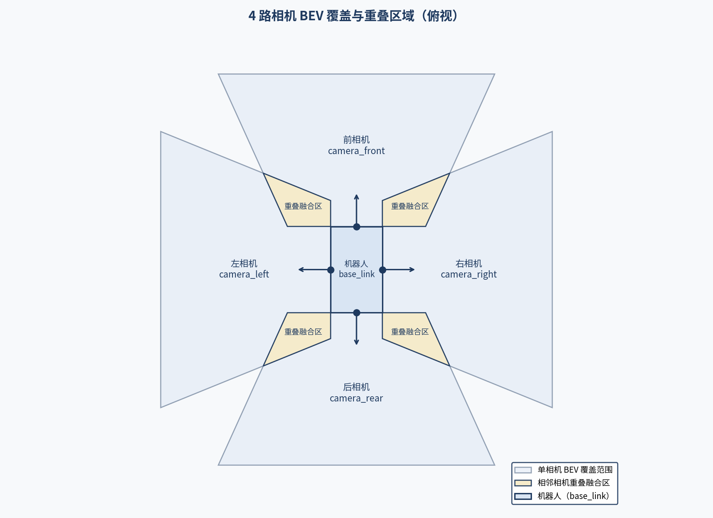
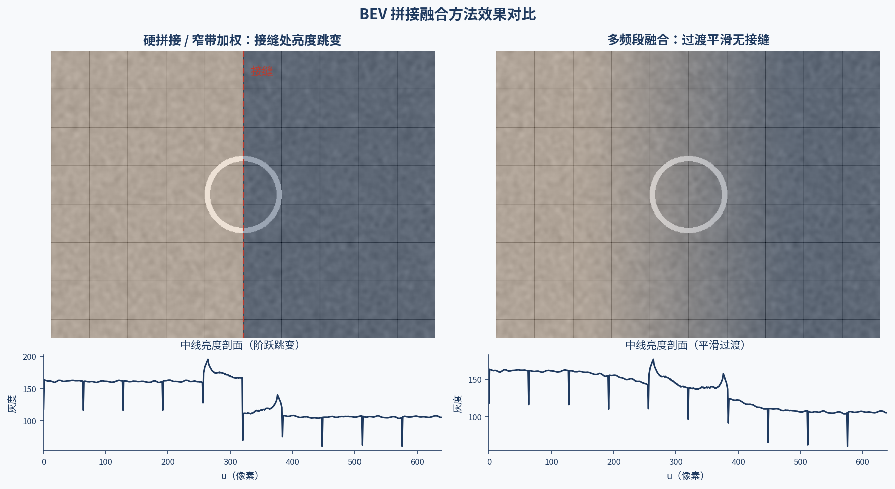

# M2 感知层：视觉系统基础

> **实机环境**：reComputer Robotics J501（AGX Orin 32GB），L4T 36.4.4 / JetPack 6.2.1
>
> **Host PC** ：Ubuntu 22.04.5 LTS，x86_64
>
> **前置条件**：已完成 M1 全部内容（系统刷机、Docker 环境、ROS 2 Humble 安装等）

***

# 2.4 多相机 BEV 拼接与环视感知基础

**课程目标**：理解 BEV 与逆透视变换（IPM）原理，掌握多相机 BEV 的重叠区域计算与加权 / 多频段融合方法，将拼接流程封装为 ROS 2 节点并发布环视图，为后续导航与决策提供全景感知输入。

**硬件清单**：J501、4× SG3S-ISX031C-GMSL2F（H190XA 190° 超广角，与 2.1 同一环视支架）、标定板（2.3 节产出）、3D 打印环视支架。

**前置基础**：M2.1（相机成像基础与 GMSL2 多相机接入）、M2.3（相机标定）。

**参考文档**：

- OpenCV 透视变换：<https://docs.opencv.org/4.x/da/d54/group__imgproc__transform.html>
- IPM 论文：<https://ieeexplore.ieee.org/document/5509711>
- 多频段融合（Burt & Adelson）：<https://www.sciencedirect.com/science/article/pii/S0262885286000422>
- OpenCV 拼接模块：<https://docs.opencv.org/4.x/d8/d8c/tutorial_py_stitching.html>
- ROS 2 image_transport：<http://docs.ros.org/en/humble/p/image_transport/>

***

## 2.4.1 BEV 与 IPM 原理

### (1) 鸟瞰视角（BEV）

鸟瞰视角（Bird's Eye View, BEV）是将多个相机的透视图像投影到地面平面的俯视图。如果说 M2.1 解决了"相机怎么看"、M2.3 解决了"如何测量相机"，本节要解决的是"如何把多路相机看到的画面统一到同一张俯视图"。在自动驾驶与机器人导航中，BEV 用于环视拼接、可通行区域检测和泊车辅助。

```
BEV 拼接概念：

  相机布局（俯视）：

         前相机
          ◉
          │
    ╔═════╪═════╗
    ║     │     ║
左 ◉─────┼─────◉ 右
    ║     │     ║
    ║     │     ║
    ╚═════╪═════╝
          │
          ◉
         后相机

  各相机透视图像 → IPM 投影 → BEV 平面拼接

  ┌───────────────────────────┐
  │         前相机区域          │
  │    ┌─────────────────┐    │
  │    │                 │    │
  │左相│     BEV 拼接图   │右相│
  │机区│                 │机区│
  │    │                 │    │
  │    └─────────────────┘    │
  │         后相机区域          │
  └───────────────────────────┘
```

### (2) 逆透视变换（IPM）原理

逆透视变换（Inverse Perspective Mapping, IPM）将透视图像转换为俯视图：

```
IPM 原理：

  透视图像（相机视角）          BEV 图像（俯视）

    ┌──────────┐               ┌──────────┐
    │ 近       │               │          │
    │   ╲      │    IPM        │  等宽     │
    │    ╲    │  ──────►      │  等距     │
    │     ╲   │               │          │
    │ 远     │               │          │
    └──────────┘               └──────────┘

  透视图中近处像素大、远处像素小
  BEV 图中所有区域等比例

  IPM 变换公式：
    [u_bev]   [H]   [u_img]
    [v_bev] = ── × [v_img]
    [  1 ]        [  1 ]

    H 是 3×3 单应性矩阵（从相机内参+外参计算）
```

> **知识点**：IPM 的核心假设是**地面为平面**。如果地面有坡度或凸起，IPM 投影会出现误差。这是 BEV 拼接的主要局限，也是后续 BEV 深度学习方法试图解决的问题。

### (3) IPM 单应性矩阵推导

```
IPM 单应性矩阵计算：

  已知：
    K = 相机内参（3×3）
    [R|t] = 相机外参（相对于地面坐标系）
    地面平面方程：Z = 0（在地面坐标系中）

  推导：
    地面点 P = [X, Y, 0, 1]（Z=0）

    图像坐标：
    ┌ u ┐   ┌ K  0 ┐ ┌ R  t ┐ ┌ X ┐
    │ v │ = │      │ │     │ │ Y │
    │ 1 │   └ 0  1 ┘ └ 0  1 ┘ │ 0 │
    └   ┘                      └ 1 ┘

    由于 Z=0，可简化为：
    ┌ u ┐   ┌ K × [r1 r2 t] ┐ ┌ X ┐
    │ v │ = │               │ │ Y │
    │ 1 │   └    3×3       ┘ │ 1 │
    └   ┘                      └   ┘

    即 H = K × [r1 r2 t]

    其中 r1, r2 是旋转矩阵 R 的前两列
    t 是平移向量

  BEV 坐标到图像坐标的映射：
    p_img = H × p_bev

  图像坐标到 BEV 坐标的映射（逆变换）：
    p_bev = H^(-1) × p_img
```

> **提示**：IPM 变换只需要相机的**内参**和**外参**（相对于地面的位姿）。外参可以通过标定板标定获得，也可以通过测量相机安装高度和俯仰角计算。

***

## 2.4.2 相机安装角度与 IPM 参数计算

2.4.1 中的 IPM 单应性矩阵不需要手工测量——它可以由相机的安装参数（高度、俯仰角、偏航角）直接推导。本节先给出典型安装参数，再给出计算代码。

### (1) 相机安装参数

| 参数 | 符号 | 典型值 | 说明 |
| --- | --- | --- | --- |
| 安装高度 | h | 0.3-1.5m | 相机光心到地面距离 |
| 俯仰角 | pitch | -30° ~ -60° | 向下倾斜（负值） |
| 偏航角 | yaw | 0°（前）/±90°（侧）/180°（后） | 相对车头方向 |
| 横滚角 | roll | 0° | 通常为 0 |
| 水平偏移 | dx, dy | ±0.3m | 相对车中心 |

### (2) 从安装参数计算外参

```python
#!/usr/bin/env python3
"""从相机安装参数计算 IPM 单应性矩阵"""

import numpy as np
import cv2

class IPMCalculator:
    """逆透视变换计算器"""

    def __init__(self, K, bev_width=500, bev_height=500,
                 bev_resolution=0.01):
        """初始化 IPM 计算器

        Args:
            K: 相机内参矩阵（3×3）
            bev_width: BEV 图像宽度（像素）
            bev_height: BEV 图像高度（像素）
            bev_resolution: BEV 分辨率（米/像素）
        """
        self.K = K
        self.bev_width = bev_width
        self.bev_height = bev_height
        self.bev_resolution = bev_resolution

    def compute_homography(self, height, pitch, yaw=0, roll=0,
                           dx=0, dy=0):
        """计算 IPM 单应性矩阵

        Args:
            height: 相机安装高度（米）
            pitch: 俯仰角（度，向下为负）
            yaw: 偏航角（度）
            roll: 横滚角（度）
            dx: 水平偏移 X（米）
            dy: 水平偏移 Y（米）

        Returns:
            H: 3×3 单应性矩阵（图像 → BEV）
        """
        # 角度转弧度
        pitch_rad = np.radians(pitch)
        yaw_rad = np.radians(yaw)
        roll_rad = np.radians(roll)

        # 构造旋转矩阵
        R_yaw = np.array([
            [np.cos(yaw_rad), -np.sin(yaw_rad), 0],
            [np.sin(yaw_rad),  np.cos(yaw_rad), 0],
            [0, 0, 1]
        ])
        R_pitch = np.array([
            [np.cos(pitch_rad), 0, np.sin(pitch_rad)],
            [0, 1, 0],
            [-np.sin(pitch_rad), 0, np.cos(pitch_rad)]
        ])
        R_roll = np.array([
            [1, 0, 0],
            [0, np.cos(roll_rad), -np.sin(roll_rad)],
            [0, np.sin(roll_rad),  np.cos(roll_rad)]
        ])
        R = R_yaw @ R_pitch @ R_roll

        # 平移向量
        t = np.array([dx, dy, height])

        # 计算单应性矩阵 H = K × [r1 r2 t]
        r1 = R[:, 0]
        r2 = R[:, 1]
        H = self.K @ np.column_stack([r1, r2, t])

        # 计算 BEV 坐标系偏移
        # BEV 图像中心对应地面坐标 (0, 0)
        # BEV 像素坐标 → 地面坐标：
        #   X_ground = (u_bev - bev_width/2) * resolution
        #   Y_ground = (v_bev - bev_height/2) * resolution
        # 需要额外的平移变换

        # BEV 到地面的变换矩阵
        T_bev2ground = np.array([
            [self.bev_resolution, 0, -self.bev_width/2 * self.bev_resolution],
            [0, self.bev_resolution, -self.bev_height/2 * self.bev_resolution],
            [0, 0, 1]
        ])

        # 图像到 BEV 的变换 = (BEV→地面)^(-1) × (图像→地面)
        H_img2bev = np.linalg.inv(T_bev2ground) @ np.linalg.inv(H)

        return H_img2bev

    def warp_image(self, image, H):
        """将透视图像变换为 BEV 图像

        Args:
            image: 输入透视图像
            H: 单应性矩阵（图像 → BEV）

        Returns:
            BEV 图像
        """
        bev_image = cv2.warpPerspective(
            image, H,
            (self.bev_width, self.bev_height),
            flags=cv2.INTER_LINEAR
        )
        return bev_image

    def warp_bev_to_image(self, bev_image, H):
        """将 BEV 图像逆变换为透视图像（用于叠加）

        Args:
            bev_image: BEV 图像
            H: 单应性矩阵（图像 → BEV）

        Returns:
            透视图像
        """
        H_inv = np.linalg.inv(H)
        image = cv2.warpPerspective(
            bev_image, H_inv,
            (bev_image.shape[1], bev_image.shape[0]),
            flags=cv2.INTER_LINEAR
        )
        return image


if __name__ == '__main__':
    # 示例：计算前相机的 IPM 矩阵
    K = np.array([
        [640.0, 0, 320.0],
        [0, 640.0, 240.0],
        [0, 0, 1.0]
    ])

    ipm = IPMCalculator(K, bev_width=500, bev_height=500,
                        bev_resolution=0.01)

    # 前相机：高度 1.2m，俯仰 -45°
    H_front = ipm.compute_homography(
        height=1.2, pitch=-45, yaw=0
    )
    print(f"前相机 IPM 矩阵:\n{H_front}\n")

    # 左相机：高度 1.0m，俯仰 -45°，偏航 90°
    H_left = ipm.compute_homography(
        height=1.0, pitch=-45, yaw=90
    )
    print(f"左相机 IPM 矩阵:\n{H_left}\n")

    # 右相机：高度 1.0m，俯仰 -45°，偏航 -90°
    H_right = ipm.compute_homography(
        height=1.0, pitch=-45, yaw=-90
    )
    print(f"右相机 IPM 矩阵:\n{H_right}\n")

    # 后相机：高度 1.2m，俯仰 -45°，偏航 180°
    H_rear = ipm.compute_homography(
        height=1.2, pitch=-45, yaw=180
    )
    print(f"后相机 IPM 矩阵:\n{H_rear}\n")
```

> **待验证**：以上脚本需在 J501 上实际执行验证。安装参数需根据实际相机位置测量。

***

## 2.4.3 BEV 分辨率与覆盖范围权衡

BEV 图像的分辨率与覆盖范围是一对矛盾：在相同的计算与内存预算下，覆盖越广，地面分辨率越低。下表给出三种典型配置的权衡。

### (1) 分辨率权衡

| 参数 | 选项 A | 选项 B | 选项 C | 说明 |
| --- | --- | --- | --- | --- |
| BEV 尺寸 | 500×500 | 1000×1000 | 2000×2000 | 像素 |
| 分辨率 | 0.02m/px | 0.01m/px | 0.005m/px | 米/像素 |
| 覆盖范围 | 10m×10m | 10m×10m | 10m×10m | 相同 |
| 处理时间 | 2ms | 8ms | 30ms | warpPerspective |
| 细节精度 | 低 | 中 | 高 | 物体边缘清晰度 |
| 适用场景 | 导航避障 | 通用 | 高精度检测 | — |

> **提示**：对于 J501 机器人导航（M6），推荐 1000×1000 像素、0.01m/像素的 BEV，覆盖 10m×10m 区域。这提供了 1cm 的地面分辨率，足以检测 10cm 以上的障碍物。

### (2) 覆盖范围计算

```
BEV 覆盖范围计算：

  相机视场角 FOV = 90°（水平）
  安装高度 h = 1.2m
  俯仰角 pitch = -45°

  近端距离（画面底部对应地面距离）：
    底部光线俯角 = |pitch| + FOV/2 = 45° + 45° = 90°（垂直向下）
    d_near = h / tan(90°) = 0m（相机正下方）

  远端距离（画面顶部对应地面距离）：
    顶部光线俯角 = |pitch| - FOV/2 = 45° - 45° = 0°（水平）
    d_far = h / tan(0°) = ∞（理论上无穷远）

  实际有效距离（受分辨率限制）：
    d_effective = min(d_far, bev_height × resolution)
                = min(∞, 1000 × 0.01)
                = 10m

  水平覆盖宽度（在远端）：
    w_far = 2 × d_effective × tan(FOV_h/2)
          = 2 × 10 × tan(45°)
          = 20m
```

> **实机说明**：上式以水平 FOV 90° 为例讲解原理。实机 H190XA 镜头水平 FOV 约 190°，原始画面为鱼眼图像，需先按 2.3 节的鱼眼内参做去畸变整流（得到针孔模型下的整流图），再套用上述 IPM 计算；整流后有效 FOV 一般取 120°~150°（鱼眼边缘分辨率低），相邻相机重叠区比 90° 示例更大，更有利于接缝融合（见 2.4.4/2.4.5 节）。

> **知识点**：IPM 的一个固有问题是**远端分辨率下降**——透视图像中远处的少量像素被拉伸到 BEV 的大量像素，导致远处区域模糊。这是透视投影的物理限制，无法通过算法完全解决。

***

## 2.4.4 重叠区域计算与多相机拼接

单相机 BEV 只能覆盖车体前方有限区域，环视感知需要把多路相机的 BEV 拼接起来；而拼接质量的关键，在于相邻相机重叠区域的处理。本节先计算重叠区域，再介绍加权融合方法。

### (1) 重叠区域计算

```
重叠区域计算：

  前相机覆盖：        左相机覆盖：
  ┌──────────┐       ┌──────────┐
  │          │       │          │
  │   前部   │       │  左侧    │
  │          │       │          │
  └────┬─────┘       └────┬─────┘
       │                   │
       │   重叠区域        │
       │   ┌──────┐       │
       │   │      │       │
       │   │ 融合 │       │
       │   │      │       │
       │   └──────┘       │
       │                   │

  重叠区域宽度 = 前相机右边缘 - 左相机前边缘
  需要在重叠区域进行图像融合
```



### (2) 加权融合方法

```python
#!/usr/bin/env python3
"""多相机 BEV 拼接 - 加权融合"""

import cv2
import numpy as np

class BEVStitcher:
    """多相机 BEV 拼接器"""

    def __init__(self, bev_width=1000, bev_height=1000):
        """初始化 BEV 拼接器

        Args:
            bev_width: BEV 图像宽度
            bev_height: BEV 图像高度
        """
        self.bev_width = bev_width
        self.bev_height = bev_height

        # 存储各相机的 BEV 图像和权重图
        self.bev_images = {}
        self.weight_maps = {}

    def set_camera_bev(self, cam_name, bev_image, weight_map=None):
        """设置单相机的 BEV 图像

        Args:
            cam_name: 相机名称（'front', 'left', 'right', 'rear'）
            bev_image: BEV 图像
            weight_map: 权重图（0-1），None 则自动生成
        """
        self.bev_images[cam_name] = bev_image

        if weight_map is None:
            # 自动生成距离权重图（中心权重高）
            weight_map = self._create_distance_weight(bev_image.shape)
        self.weight_maps[cam_name] = weight_map

    def _create_distance_weight(self, shape):
        """创建距离权重图

        距离相机越近（BEV 中心）权重越高

        Args:
            shape: 图像尺寸 (height, width)

        Returns:
            权重图（0-1）
        """
        h, w = shape[:2]
        # 创建径向距离图
        y, x = np.ogrid[:h, :w]
        center_y, center_x = h / 2, w / 2
        dist = np.sqrt((y - center_y)**2 + (x - center_x)**2)
        max_dist = np.sqrt(center_y**2 + center_x**2)
        # 线性衰减
        weight = 1.0 - (dist / max_dist) * 0.5
        weight = np.clip(weight, 0, 1)
        return weight.astype(np.float32)

    def _create_feather_weight(self, shape, direction='center'):
        """创建羽化权重图

        在图像边缘渐变到 0，避免拼接接缝

        Args:
            shape: 图像尺寸
            direction: 羽化方向

        Returns:
            权重图
        """
        h, w = shape[:2]
        feather_size = min(h, w) // 10  # 羽化区域大小

        weight = np.ones((h, w), dtype=np.float32)

        # 边缘羽化
        for i in range(feather_size):
            alpha = i / feather_size
            weight[i, :] = min(weight[i, :], alpha)
            weight[h-1-i, :] = min(weight[h-1-i, :], alpha)
            weight[:, i] = min(weight[:, i], alpha)
            weight[:, w-1-i] = min(weight[:, w-1-i], alpha)

        return weight

    def stitch_weighted(self):
        """加权融合拼接

        Returns:
            拼接后的 BEV 图像
        """
        if not self.bev_images:
            return None

        # 初始化累加器
        result = np.zeros(
            (self.bev_height, self.bev_width, 3), dtype=np.float32
        )
        weight_sum = np.zeros(
            (self.bev_height, self.bev_width), dtype=np.float32
        )

        # 累加各相机贡献
        for cam_name in self.bev_images:
            bev = self.bev_images[cam_name].astype(np.float32)
            weight = self.weight_maps[cam_name]

            # 确保尺寸匹配
            if bev.shape[:2] != (self.bev_height, self.bev_width):
                bev = cv2.resize(bev, (self.bev_width, self.bev_height))
                weight = cv2.resize(
                    weight, (self.bev_width, self.bev_height)
                )

            # 广播权重到 3 通道
            weight_3c = np.stack([weight] * 3, axis=-1)
            result += bev * weight_3c
            weight_sum += weight

        # 归一化
        weight_sum = np.maximum(weight_sum, 1e-6)  # 避免除零
        result = result / np.stack([weight_sum] * 3, axis=-1)

        return result.astype(np.uint8)

    def stitch_max(self):
        """最大值拼接（选择每个像素最亮的相机）

        Returns:
            拼接后的 BEV 图像
        """
        if not self.bev_images:
            return None

        result = np.zeros(
            (self.bev_height, self.bev_width, 3), dtype=np.uint8
        )

        for cam_name in self.bev_images:
            bev = self.bev_images[cam_name]
            if bev.shape[:2] != (self.bev_height, self.bev_width):
                bev = cv2.resize(bev, (self.bev_width, self.bev_height))
            result = np.maximum(result, bev)

        return result


if __name__ == '__main__':
    stitcher = BEVStitcher(bev_width=1000, bev_height=1000)

    # 模拟 4 路相机 BEV 图像
    for cam_name in ['front', 'left', 'right', 'rear']:
        # 随机生成模拟 BEV 图像
        bev = np.random.randint(
            0, 255, (1000, 1000, 3), dtype=np.uint8
        )
        stitcher.set_camera_bev(cam_name, bev)

    # 加权融合
    result = stitcher.stitch_weighted()
    cv2.imwrite('/tmp/bev_stitched.jpg', result)
    print("BEV 拼接图已保存到 /tmp/bev_stitched.jpg")
```

> **待验证**：以上脚本需在 J501 上实际执行验证。实际使用时需要先对每路相机进行 IPM 变换，再传入拼接器。

***

## 2.4.5 接缝优化与鬼影消除

### (1) 接缝问题

当两路相机的曝光、白平衡存在差异时，重叠区域若直接拼接，会在两路画面的边界处产生可见的亮度跳变，即"接缝"。

```
接缝问题示意：

  加权融合（有接缝）：      多频段融合（无缝隙）：
  ┌──────────────┐        ┌──────────────┐
  │     左       │        │              │
  │──────────────│        │    平滑      │
  │     右       │        │    过渡      │
  └──────────────┘        └──────────────┘
  接缝处亮度跳变            无可见接缝
```



### (2) 多频段融合（Multi-band Blending）

多频段融合（Burt & Adelson, 1983）通过拉普拉斯金字塔在不同频段分别融合，消除接缝：

```
多频段融合流程：

  1. 构建拉普拉斯金字塔（通常 4-6 层）
     - 高频层：细节信息
     - 低频层：全局亮度

  2. 在每层使用不同的融合权重
     - 高频层：窄过渡带（保持细节）
     - 低频层：宽过渡带（平滑亮度）

  3. 金字塔重建
     - 从低频到高频逐层上采样叠加
```

> **知识点**：多频段融合的核心思想是"低频平滑过渡，高频精确切换"。亮度差异主要在低频，用宽过渡带消除；细节信息在高频，用窄过渡带保持。这样既消除了亮度接缝，又保留了图像细节。

### (3) OpenCV 多频段融合

```python
#!/usr/bin/env python3
"""使用 OpenCV 的多频段融合进行 BEV 拼接"""

import cv2
import numpy as np

class MultiBandBlender:
    """多频段融合器"""

    def __init__(self, num_bands=5):
        """初始化多频段融合器

        Args:
            num_bands: 金字塔层数
        """
        self.num_bands = num_bands

    def blend(self, img1, mask1, img2, mask2):
        """融合两幅图像

        Args:
            img1: 图像 1
            mask1: 图像 1 的权重图（0-1）
            img2: 图像 2
            mask2: 图像 2 的权重图（0-1）

        Returns:
            融合后的图像
        """
        # 确保图像为 float32
        img1 = img1.astype(np.float32)
        img2 = img2.astype(np.float32)
        mask1 = mask1.astype(np.float32)
        mask2 = mask2.astype(np.float32)

        # 构建拉普拉斯金字塔
        lp1 = self._build_laplacian_pyramid(img1, self.num_bands)
        lp2 = self._build_laplacian_pyramid(img2, self.num_bands)
        gp1 = self._build_gaussian_pyramid(mask1, self.num_bands)
        gp2 = self._build_gaussian_pyramid(mask2, self.num_bands)

        # 在每层融合
        blended = []
        for l1, l2, g1, g2 in zip(lp1, lp2, gp1, gp2):
            # 广播权重到 3 通道
            g1_3c = np.stack([g1] * 3, axis=-1) if len(g1.shape) == 2 else g1
            g2_3c = np.stack([g2] * 3, axis=-1) if len(g2.shape) == 2 else g2
            blended.append(l1 * g1_3c + l2 * g2_3c)

        # 金字塔重建
        result = blended[-1]
        for i in range(len(blended) - 2, -1, -1):
            h, w = blended[i].shape[:2]
            result = cv2.pyrUp(result, dstsize=(w, h))
            result = result + blended[i]

        return np.clip(result, 0, 255).astype(np.uint8)

    def _build_laplacian_pyramid(self, image, levels):
        """构建拉普拉斯金字塔"""
        gaussian = image.copy()
        lp = []
        for i in range(levels):
            h, w = gaussian.shape[:2]
            down = cv2.pyrDown(gaussian)
            up = cv2.pyrUp(down, dstsize=(w, h))
            lap = gaussian - up
            lp.append(lap)
            gaussian = down
        lp.append(gaussian)  # 最后一层是低频残差
        return lp

    def _build_gaussian_pyramid(self, mask, levels):
        """构建高斯金字塔"""
        gp = [mask]
        for i in range(levels):
            mask = cv2.pyrDown(mask)
            gp.append(mask)
        return gp


if __name__ == '__main__':
    blender = MultiBandBlender(num_bands=5)

    # 模拟两幅图像
    img1 = np.random.randint(100, 200, (512, 512, 3), dtype=np.uint8)
    img2 = np.random.randint(150, 250, (512, 512, 3), dtype=np.uint8)

    # 创建权重图（上半给 img1，下半给 img2，中间 100 行过渡）
    mask1 = np.zeros((512, 512), dtype=np.float32)
    mask2 = np.zeros((512, 512), dtype=np.float32)
    for i in range(512):
        alpha = max(0, min(1, (256 - i) / 100))
        mask1[i, :] = alpha
        mask2[i, :] = 1 - alpha

    result = blender.blend(img1, mask1, img2, mask2)
    cv2.imwrite('/tmp/bev_blended.jpg', result)
    print("多频段融合结果已保存到 /tmp/bev_blended.jpg")
```

> **待验证**：以上脚本需在 J501 上实际执行验证。OpenCV 的 `cv2.detail.Blender` 也提供了内置的多频段融合实现。

### (4) 鬼影消除

鬼影（Ghosting）出现在重叠区域的运动物体上——同一物体在不同相机中位置不同，融合后出现重影。

| 鬼影消除方法 | 原理 | 复杂度 | 效果 |
| --- | --- | --- | --- |
| 运动检测 | 检测重叠区域差异，选择差异小的源 | 中 | 一般 |
| 光流对齐 | 用光流对齐运动物体 | 高 | 好 |
| 最佳接缝切割 | 用图割找最优接缝避开运动物体 | 中 | 好 |
| 深度学习融合 | 用神经网络学习融合权重 | 高 | 最好 |

> **提示**：对于静态场景（如泊车），鬼影问题不严重。对于动态场景（如行驶中），推荐使用最佳接缝切割（`cv2.detail.SeamFinder`）。

***

## 2.4.6 坐标系定义与 TF2 配置

要把拼接好的 BEV 图发布到 ROS 2 中并被下游节点（M6 导航）使用，就需要统一的坐标系定义：各相机的位置姿态用 TF2 描述，BEV 图则绑定到 bev_frame 坐标系。

### (1) 坐标系层级

```
坐标系层级（TF2 Tree）：

  base_link（机器人基座）
    ├── camera_front_link
    │     └── camera_front_optical
    ├── camera_left_link
    │     └── camera_left_optical
    ├── camera_right_link
    │     └── camera_right_optical
    ├── camera_rear_link
    │     └── camera_rear_optical
    └── bev_frame（BEV 坐标系）
```

### (2) URDF 坐标系定义

```xml
<!-- robot.urdf.xacro — 相机坐标系定义 -->
<robot name="j501_robot">

  <!-- 基座坐标系 -->
  <!-- 注意：URDF 规范中 <link> 不能包含 <origin> 子元素，
       origin 只属于 joint / visual / collision；
       base_link 作为 TF 树根节点，其位姿由外部（如 world 关节或里程计）确定 -->
  <link name="base_link"/>

  <!-- 前相机 -->
  <link name="camera_front_link"/>
  <joint name="camera_front_joint" type="fixed">
    <parent link="base_link"/>
    <child link="camera_front_link"/>
    <origin xyz="0.3 0 1.2" rpy="0 -0.785 0"/>
    <!-- xyz: 前方 0.3m, 高度 1.2m -->
    <!-- rpy: 俯仰 -45° -->
  </joint>

  <!-- 左相机 -->
  <link name="camera_left_link"/>
  <joint name="camera_left_joint" type="fixed">
    <parent link="base_link"/>
    <child link="camera_left_link"/>
    <origin xyz="0 0.3 1.0" rpy="0 -0.785 1.5708"/>
    <!-- 偏航 90°（朝左） -->
  </joint>

  <!-- 右相机 -->
  <link name="camera_right_link"/>
  <joint name="camera_right_joint" type="fixed">
    <parent link="base_link"/>
    <child link="camera_right_link"/>
    <origin xyz="0 -0.3 1.0" rpy="0 -0.785 -1.5708"/>
    <!-- 偏航 -90°（朝右） -->
  </joint>

  <!-- 后相机 -->
  <link name="camera_rear_link"/>
  <joint name="camera_rear_joint" type="fixed">
    <parent link="base_link"/>
    <child link="camera_rear_link"/>
    <origin xyz="-0.3 0 1.2" rpy="0 -0.785 3.14159"/>
    <!-- 偏航 180°（朝后） -->
  </joint>

  <!-- BEV 坐标系（地面平面） -->
  <link name="bev_frame"/>
  <joint name="bev_joint" type="fixed">
    <parent link="base_link"/>
    <child link="bev_frame"/>
    <origin xyz="0 0 0" rpy="0 0 0"/>
    <!-- BEV 坐标系与基座重合，Z 轴向上 -->
  </joint>

</robot>
```

> **知识点**：ROS 2 使用 **REP 103** 坐标系约定：X 轴向前，Y 轴向左，Z 轴向上。相机光学坐标系使用 **REP 104**：Z 轴向前（光轴方向），X 轴向右，Y 轴向下。在 URDF 中需要通过 `rpy` 旋转来对齐这两种坐标系。

***

## 2.4.7 BEV 拼接 ROS 2 节点

将前几节的 IPM 计算与加权融合封装为 ROS 2 节点：订阅多路相机的图像与相机内参话题，定时执行 IPM 变换与拼接，发布拼接后的 BEV 图像。

> **本教程实机**：图像话题由 4 个 `v4l2_camera` 节点提供（`/camera_front|right|rear|left/image_raw`，启动方式见 2.1.10 (6)），与本节代码默认的 `/camera_{name}/image_raw` 话题命名一致。注意本节点示例直接对内参做 IPM；H190XA 为 190° 鱼眼，实际接入时应先按 2.3.10 (3) 对每路图像去畸变，并使用去畸变后的新内参计算 IPM。

### (1) 完整 ROS 2 节点

```python
#!/usr/bin/env python3
"""BEV 拼接 ROS 2 节点

订阅多路相机图像，进行 IPM 变换和 BEV 拼接，
发布拼接后的 BEV 图像。
"""

import rclpy
from rclpy.node import Node
from sensor_msgs.msg import Image, CameraInfo
from cv_bridge import CvBridge
import cv2
import numpy as np
from collections import deque

from .ipm_calculator import IPMCalculator  # IPM 计算类，见 2.4.2 节

class BEVStitchNode(Node):
    """BEV 拼接 ROS 2 节点"""

    def __init__(self):
        """初始化节点"""
        super().__init__('bev_stitch_node')

        # 参数声明
        self.declare_parameter('bev_width', 1000)
        self.declare_parameter('bev_height', 1000)
        self.declare_parameter('bev_resolution', 0.01)
        self.declare_parameter('num_cameras', 4)

        self.bev_width = self.get_parameter('bev_width').value
        self.bev_height = self.get_parameter('bev_height').value
        self.bev_resolution = self.get_parameter('bev_resolution').value
        self.num_cameras = self.get_parameter('num_cameras').value

        # CV Bridge
        self.bridge = CvBridge()

        # 相机数据存储
        self.camera_data = {}
        camera_names = ['front', 'left', 'right', 'rear']

        for name in camera_names[:self.num_cameras]:
            self.camera_data[name] = {
                'image': None,
                'K': None,
                'H': None,  # IPM 单应性矩阵
                'weight': None,
            }

            # 订阅图像话题
            self.create_subscription(
                Image,
                f'/camera_{name}/image_raw',
                lambda msg, n=name: self.image_callback(msg, n),
                10
            )

            # 订阅相机信息话题
            self.create_subscription(
                CameraInfo,
                f'/camera_{name}/camera_info',
                lambda msg, n=name: self.camera_info_callback(msg, n),
                10
            )

        # BEV 图像发布者
        self.bev_pub = self.create_publisher(
            Image, '/bev/image_raw', 10
        )

        # 定时器：定期执行拼接
        self.timer = self.create_timer(0.033, self.stitch_timer_callback)

        self.get_logger().info(
            f'BEV 拼接节点已启动 '
            f'(BEV: {self.bev_width}×{self.bev_height}, '
            f'分辨率: {self.bev_resolution}m/px)'
        )

    def image_callback(self, msg, camera_name):
        """图像回调"""
        try:
            cv_image = self.bridge.imgmsg_to_cv2(msg, 'bgr8')
            self.camera_data[camera_name]['image'] = cv_image
        except Exception as e:
            self.get_logger().error(f'图像转换失败: {e}')

    def camera_info_callback(self, msg, camera_name):
        """相机信息回调"""
        K = np.array(msg.k).reshape(3, 3)
        self.camera_data[camera_name]['K'] = K

        # 如果已有内参，计算 IPM 矩阵
        # 实际应用中，安装参数应从 URDF 或参数服务器获取
        # 这里使用默认参数作为示例
        if self.camera_data[camera_name]['H'] is None:
            self._compute_ipm(camera_name, K)

    def _compute_ipm(self, camera_name, K):
        """计算 IPM 单应性矩阵

        Args:
            camera_name: 相机名称
            K: 内参矩阵
        """
        # 安装参数（实际应从参数或 URDF 获取）
        install_params = {
            'front': {'height': 1.2, 'pitch': -45, 'yaw': 0},
            'left':  {'height': 1.0, 'pitch': -45, 'yaw': 90},
            'right': {'height': 1.0, 'pitch': -45, 'yaw': -90},
            'rear':  {'height': 1.2, 'pitch': -45, 'yaw': 180},
        }

        params = install_params.get(camera_name)
        if params is None:
            return

        # 计算 IPM 矩阵（参考 2.4.2 节）
        ipm_calc = IPMCalculator(
            K, self.bev_width, self.bev_height, self.bev_resolution
        )
        H = ipm_calc.compute_homography(
            params['height'], params['pitch'], params['yaw']
        )
        self.camera_data[camera_name]['H'] = H

        # 创建权重图
        weight = self._create_weight_map()
        self.camera_data[camera_name]['weight'] = weight

    def _create_weight_map(self):
        """创建权重图"""
        h, w = self.bev_height, self.bev_width
        y, x = np.ogrid[:h, :w]
        center_y, center_x = h / 2, w / 2
        dist = np.sqrt((y - center_y)**2 + (x - center_x)**2)
        max_dist = np.sqrt(center_y**2 + center_x**2)
        weight = 1.0 - (dist / max_dist) * 0.5
        return np.clip(weight, 0, 1).astype(np.float32)

    def stitch_timer_callback(self):
        """定时拼接回调"""
        # 检查所有相机是否有图像
        ready_cameras = [
            name for name, data in self.camera_data.items()
            if data['image'] is not None and data['H'] is not None
        ]

        if not ready_cameras:
            return

        # 执行 IPM 变换和拼接
        result = np.zeros(
            (self.bev_height, self.bev_width, 3), dtype=np.float32
        )
        weight_sum = np.zeros(
            (self.bev_height, self.bev_width), dtype=np.float32
        )

        for name in ready_cameras:
            data = self.camera_data[name]
            # IPM 变换
            bev = cv2.warpPerspective(
                data['image'], data['H'],
                (self.bev_width, self.bev_height),
                flags=cv2.INTER_LINEAR
            )
            # 加权累加
            weight = data['weight']
            weight_3c = np.stack([weight] * 3, axis=-1)
            result += bev.astype(np.float32) * weight_3c
            weight_sum += weight

        # 归一化
        weight_sum = np.maximum(weight_sum, 1e-6)
        result = result / np.stack([weight_sum] * 3, axis=-1)
        result = result.astype(np.uint8)

        # 发布 BEV 图像
        bev_msg = self.bridge.cv2_to_imgmsg(result, 'bgr8')
        bev_msg.header.stamp = self.get_clock().now().to_msg()
        bev_msg.header.frame_id = 'bev_frame'
        self.bev_pub.publish(bev_msg)


def main(args=None):
    rclpy.init(args=args)
    node = BEVStitchNode()
    rclpy.spin(node)
    node.destroy_node()
    rclpy.shutdown()


if __name__ == '__main__':
    main()
```

> **待验证**：以上节点需在 J501 上实际编译运行验证。需要先完成 2.3 节的相机标定，获取各相机的内参。

### (2) Launch 文件

```python
#!/usr/bin/env python3
"""BEV 拼接 Launch 文件"""

from launch import LaunchDescription
from launch.actions import DeclareLaunchArgument
from launch.substitutions import LaunchConfiguration
from launch_ros.actions import Node

def generate_launch_description():
    """生成 launch 描述"""
    return LaunchDescription([
        # BEV 参数
        DeclareLaunchArgument('bev_width', default_value='1000'),
        DeclareLaunchArgument('bev_height', default_value='1000'),
        DeclareLaunchArgument('bev_resolution', default_value='0.01'),
        DeclareLaunchArgument('num_cameras', default_value='4'),

        # BEV 拼接节点
        Node(
            package='j501_vision',
            executable='bev_stitch_node',
            name='bev_stitch',
            parameters=[{
                'bev_width': LaunchConfiguration('bev_width'),
                'bev_height': LaunchConfiguration('bev_height'),
                'bev_resolution': LaunchConfiguration('bev_resolution'),
                'num_cameras': LaunchConfiguration('num_cameras'),
            }],
            output='screen',
        ),
    ])
```

***

## 2.4.8 BEV 质量评估

拼接完成后需要量化评估，确认接缝、覆盖率与几何精度是否达标。以下指标与脚本可纳入离线验收流程。

### (1) 评估指标

| 指标 | 计算方法 | 目标值 | 说明 |
| --- | --- | --- | --- |
| 接缝亮度差 | 重叠区域左右均值差 | < 5% | 亮度一致性 |
| 接缝位置误差 | 已知标志物位置偏差 | < 2px | 几何精度 |
| 拼接覆盖率 | 有效像素 / 总像素 | > 90% | 覆盖完整性 |
| 帧率 | 拼接帧率 | > 15 fps | 实时性 |
| 鬼影指数 | 重叠区域运动物体重影 | < 1% | 动态场景质量 |

### (2) 评估脚本

```python
#!/usr/bin/env python3
"""BEV 拼接质量评估"""

import cv2
import numpy as np

class BEVQualityEvaluator:
    """BEV 质量评估器"""

    def __init__(self, bev_width=1000, bev_height=1000):
        """初始化评估器"""
        self.bev_width = bev_width
        self.bev_height = bev_height

    def evaluate_seam_brightness(self, bev_image, seam_positions):
        """评估接缝亮度差

        Args:
            bev_image: BEV 拼接图
            seam_positions: 接缝位置列表 [(x1, y1, x2, y2), ...]

        Returns:
            float: 平均亮度差（百分比）
        """
        gray = cv2.cvtColor(bev_image, cv2.COLOR_BGR2GRAY)
        diffs = []

        for x1, y1, x2, y2 in seam_positions:
            # 在接缝两侧取条带
            left_region = gray[max(0,y1-10):y1+10, max(0,x1-20):x1]
            right_region = gray[max(0,y1-10):y1+10, x1:min(x1+20, gray.shape[1])]

            if left_region.size > 0 and right_region.size > 0:
                left_mean = np.mean(left_region)
                right_mean = np.mean(right_region)
                diff = abs(left_mean - right_mean) / max(left_mean, 1)
                diffs.append(diff)

        return np.mean(diffs) * 100 if diffs else 0

    def evaluate_coverage(self, bev_image):
        """评估拼接覆盖率

        Args:
            bev_image: BEV 拼接图

        Returns:
            float: 覆盖率（百分比）
        """
        gray = cv2.cvtColor(bev_image, cv2.COLOR_BGR2GRAY)
        valid_pixels = np.sum(gray > 10)  # 非黑像素
        total_pixels = gray.size
        return (valid_pixels / total_pixels) * 100

    def evaluate_position_error(self, bev_image, known_positions,
                                detected_positions):
        """评估位置误差

        Args:
            bev_image: BEV 拼接图
            known_positions: 已知标志物位置 [(x, y), ...]
            detected_positions: 检测到的位置 [(x, y), ...]

        Returns:
            float: 平均位置误差（像素）
        """
        if len(known_positions) != len(detected_positions):
            return float('inf')

        errors = []
        for (kx, ky), (dx, dy) in zip(known_positions, detected_positions):
            error = np.sqrt((kx - dx)**2 + (ky - dy)**2)
            errors.append(error)

        return np.mean(errors)

    def report(self, bev_image, seam_positions=None,
               known_positions=None, detected_positions=None):
        """生成质量评估报告"""
        print("\n" + "=" * 50)
        print("BEV 拼接质量评估报告")
        print("=" * 50)

        # 覆盖率
        coverage = self.evaluate_coverage(bev_image)
        print(f"拼接覆盖率: {coverage:.1f}%")

        # 接缝亮度差
        if seam_positions:
            seam_diff = self.evaluate_seam_brightness(
                bev_image, seam_positions
            )
            print(f"接缝亮度差: {seam_diff:.2f}%")

        # 位置误差
        if known_positions and detected_positions:
            pos_error = self.evaluate_position_error(
                bev_image, known_positions, detected_positions
            )
            print(f"位置误差: {pos_error:.2f} px")

        print("=" * 50)


if __name__ == '__main__':
    evaluator = BEVQualityEvaluator()

    # 加载 BEV 图像
    bev = cv2.imread('/tmp/bev_stitched.jpg')
    if bev is not None:
        evaluator.report(bev)
```

> **待验证**：以上脚本需在 J501 上实际执行验证。需要先生成 BEV 拼接图。

***

## 2.4.9 常见问题

下表汇总 BEV 拼接调试中的常见问题与对策：

| 问题 | 原因 | 解决方案 |
| --- | --- | --- |
| BEV 图像有黑边 | 相机覆盖范围不足 | 增加相机数量或调整安装角度 |
| 接缝明显 | 权重过渡不够平滑 | 使用多频段融合 |
| 远处模糊 | IPM 远端分辨率下降 | 增加相机俯仰角或接受物理限制 |
| 位置偏差 | 安装参数测量不准 | 重新测量安装高度和角度 |
| 鬼影 | 重叠区域运动物体 | 使用最佳接缝切割 |
| 帧率低 | 拼接计算量大 | 降低 BEV 分辨率或使用 GPU 加速 |
| 颜色不一致 | 各相机白平衡不同 | 统一白平衡参数或做颜色校正 |
| BEV 图像变形 | 地面非平面 | 使用 BEV 深度学习方法 |
| TF2 变换错误 | URDF 坐标系定义错误 | 检查 REP 103/104 约定 |
| 内存不足 | BEV 图像过大 | 降低分辨率或分块处理 |

***

## 2.4.10 产出物

完成本节学习后，你应具备：

| 产出物 | 路径 | 说明 |
| --- | --- | --- |
| IPM 变换计算器 | `~/ros2_ws/src/j501_vision/j501_vision/ipm_calculator.py` | 单应性矩阵计算 |
| BEV 拼接器 | `~/ros2_ws/src/j501_vision/j501_vision/bev_stitcher.py` | 加权融合 + 多频段融合 |
| BEV 拼接 ROS 2 节点 | `~/ros2_ws/src/j501_vision/j501_vision/bev_stitch_node.py` | 实时拼接发布 |
| BEV Launch 文件 | `~/ros2_ws/src/j501_vision/launch/bev_stitch.launch.py` | 参数化启动 |
| URDF 坐标系定义 | `~/ros2_ws/src/j501_vision/urdf/j501_robot.urdf.xacro` | TF2 坐标系 |
| BEV 质量评估脚本 | `~/ros2_ws/src/j501_vision/j501_vision/bev_quality.py` | 接缝/覆盖率评估 |

***

## M2 总结与后续衔接

### M2 模块产出物总览

完成 M2 感知层视觉系统基础全部 4 节内容后，你应具备以下完整产出物：

| 节 | 产出物 | 路径 | 后续模块复用 |
| --- | --- | --- | --- |
| 2.1 | Argus 相机采集类（GMSL2 RAW 路径） | `j501_vision/argus_camera.py` | M4（AI 视觉）、M5（SLAM） |
| 2.1 | Argus 相机 ROS 2 节点 | `j501_vision/argus_camera_node.py` | M4、M5、M6 |
| 2.1 | YUV 相机 ROS 2 节点（本教程实机 ISX031 路径，实机已验证） | `ros-humble-v4l2-camera` 系统包（见 2.1.10 (6)） | 本节 BEV 节点的图像来源 |
| 2.1 | GMSL2 链路诊断脚本 | `j501_vision/gmsl2_diag.py` | M4、M6 |
| 2.1 | 多相机同步评估脚本 | `j501_vision/sync_eval.py` | M3（传感器融合） |
| 2.2 | 深度滤波模块 | `j501_vision/depth_filter.py` | M5（SLAM）、M6（导航） |
| 2.2 | 点云可视化脚本 | `j501_vision/pointcloud_viz.py` | M3、M5 |
| 2.2 | RANSAC 平面分割 | `j501_vision/plane_segment.py` | M6（导航） |
| 2.3 | 单目/双目标定脚本 | `j501_vision/mono_calibrate.py` | M5（SLAM）、M9（机械臂） |
| 2.3 | 手眼标定脚本 | `j501_vision/handeye_calibrate.py` | M9（机械臂抓取） |
| 2.3 | 标定参数 YAML | `j501_vision/config/camera_info.yaml` | 全部后续模块 |
| 2.4 | BEV 拼接节点 | `j501_vision/bev_stitch_node.py` | M6（导航） |
| 2.4 | URDF 坐标系定义 | `j501_vision/urdf/j501_robot.urdf.xacro` | M6、M9 |

### 与后续模块的衔接

```
M2 感知层视觉系统基础
    │
    ├──► M3 感知层：雷达与多传感器融合
    │     └── 使用 M2.2 的点云和 M2.3 的标定参数
    │
    ├──► M4 感知层：AI 视觉算法与边缘加速
    │     └── 使用 M2.1 的相机节点作为输入源
    │
    ├──► M5 认知层：三维重建与 SLAM
    │     └── 使用 M2.3 的标定参数和 M2.2 的深度数据
    │
    ├──► M6 决策层：路径规划与导航
    │     └── 使用 M2.4 的 BEV 拼接图和 M2.2 的地面分割
    │
    └──► M9 执行层：机械臂控制与抓取
          └── 使用 M2.3 的手眼标定结果
```

> **知识点**：M2 是整个课程的**感知基础设施**——所有后续模块都依赖于 M2 建立的相机采集、标定和点云处理能力。确保 M2 的产出物完整且高质量，是后续模块顺利推进的前提。

***
