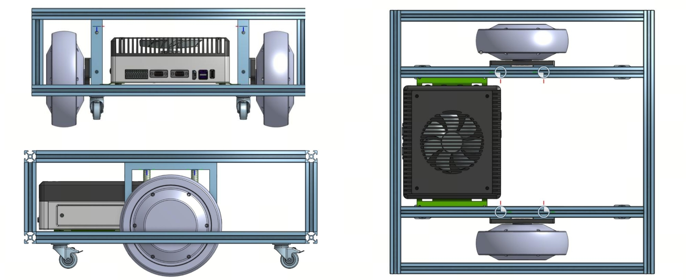

# Mechanical Design and CAD Resources

This directory contains the mechanical design resources used in the
**Mobile Robot Full-Stack Development in Practice** course.

The robot mechanical platform is designed and maintained in Onshape.
The online CAD model can be used to inspect the complete assembly,
mechanical structure, component placement, mounting interfaces, and
overall dimensions of the mobile robot.

## Mobile Robot CAD

[

**Open the interactive CAD model in Onshape:**

[View Mobile Robot CAD in Onshape](https://cad.onshape.com/documents/e34a3837abed0629f60b32a5/w/5446a17c586f6b214b732178/e/30ba309ca3c778eb58ac7c8e)

The CAD model provides a mechanical reference for building the mobile
robot used throughout the course.

> The Onshape document is the primary source for the latest mechanical design.
> Exported CAD files in this repository may correspond to a specific course release.